# C++习题解答下学期

# C++程序设计基础（第5版）（下）

# 习题与解答

## 第6章练习题

### 同步练习6.1

### **一、选择题**

1．下列类的定义中正确的是（    ）。

（A）class  a{int x=0;int y=1;}                      	（B）class b{int x=0;int y=1;};

（C）class c{int x;int y;}                          		（D）class d{int x;int y;};

2．若有以下说明，则在类外使用对象objX成员的正确语句是（    ）。

class X

{    int a;

void fun1();

public:

void fun2();

};

X objX;

（A）objX.a=0;				（D）X::fun1();

3．在类定义的外部，可以被访问的成员有（    ）。

（A）所有类成员						（B）private或protected的类成员

（C）public的类成员					（D）public或private的类成员

4．下列关于类和对象的说法中，正确的是（    ）。

（A）编译器为每个类和类的对象分配内存	（B）类的对象具有成员函数的副本

（C）类的成员函数由类来调用			（D）编译器为每个对象的数据成员分配内存

5．关于this指针的说法正确的是（    ）。

（A）this指针必须显式说明				（B）定义一个类后，this指针就指向该类

（C）成员函数拥有this指针				（D）静态成员函数拥有this指针

【解答】	D	D	C	D	C

### **二、程序练习**

1．阅读程序，写出运行结果。

#include<iostream>

using namespace std;

class A

{   public :

int f1();

int f2();

void setx( int m )   {   x = m; cout << x << endl;   }

void sety( int n )   {   y = n; cout << y << endl;   }

int getx()   {   return x;   }

int gety()   {   return y;   }

private :

int x, y;

};

int A::f1()

{   return x + y;   }

int A::f2()

{   return x  -  y;   }

int main()

{   A a;

a.setx( 10 );	a.sety( 5 );

cout << a.getx() << '\t' << a.gety() << endl;

cout << a.f1() << '\t' << a.f2() << endl;

}

【解答】

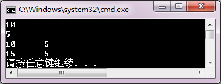

2．改写以下程序。要求定义类student，封装三个数据成员和两个成员函数intpt和output，使程序得到相同的运行效果。

#include <iostream>

using namespace std;

struct student

{   char name[20];

unsigned int id;

double score;

};

void input(student &stu)

{  cout<<"name?";

cin>>stu.name;

cout<<"id?";

cin>>stu.id;

cout<<"score?";

cin>>stu.score;

}

void output(student &stu)

{  cout<<"name: "<<stu.name<<"\tid: "<<stu.id<<"\tscore: "<<stu.score<<endl;  }

int main()

{  student s={"\0", 0, 0};

input(s);

output(s);

}

【解答】

#include <iostream>

using namespace std;

class student

{

char name[20];

unsigned int id;

double score;

public:

void input()

{

cout<<"name? ";

cin>>name;

cout<<"id?";

cin>>id;

cout<<"score? ";

cin>>score;

}

void output()

{

cout<<"name: "<<name<<"\tid: "<<id<<"\tscore: "<<score<<endl;

}

};

int main()

{

student s;

s.input();

s.output();

}

#### 同步练习6.2

### **一、选择题**

1．下面对构造函数的不正确描述是（    ）。

（A）用户定义的构造函数不是必须的			（B）构造函数可以重载

（C）构造函数可以有参数，也可以有返回值	（D）构造函数可以设置默认参数

2．下面对析构函数的正确描述是（    ）。

（A）系统在任何情况下都能正确析构对象		（B）用户必须定义类的析构函数

（C）析构函数没有参数，也没有返回值		（D）析构函数可以设置默认参数

3．构造函数是在（    ）时被执行的。

（A）建立源程序文件	（B）创建对象		（C）创建类		（D）程序编译时

4．在下列函数原型中，可以作为类Base析构函数的是（    ）。

（A）void~Base		（B）~Base()				（C）~Base()const		（D）Base()

5．AB是一个类，那么执行语句“AB a (4), b[3], *p;”调用了（    ）次构造函数。

（A）2				（B）3					（C）4 		 			（D）5

6．下面关于复制构造函数调用的时机，不正确的是（    A  ）。

（A）访问对象时							（B）对象初始化时

（C）函数具有类类型传值参数时				（D）函数返回类类型值时

7．说明一个类的对象时，系统自动调用（    ）。

（A）成员函数		（B）构造函数		（C）析构函数		（D）友元函数

8．程序中撤销一个类对象时，系统自动调用（    ）。

（A）成员函数		（B）构造函数		（C）析构函数		（D）友元函数

【解答】	C	C	B	B	C	A	B	C

### **二、程序练习**

1．阅读程序，写出运行结果。

#include<iostream>

using namespace std;

class T

{   public :

T( int x, int y )

{   a = x; b = y;

cout << "调用构造函数1." << endl;

cout << a << '\t' << b << endl;

}

T( T &d )

{  cout << "调用构造函数2." << endl;

cout << d.a << '\t' << d.b << endl;

}

~T() { cout << "调用析构函数."<<endl; }

int add( int x, int y = 10 )   {   return x + y;   }

private :

int a, b;

};

int main()

{   T d1( 4, 8 );

T d2( d1 );

cout << d2.add( 10 ) << endl;

}

【解答】

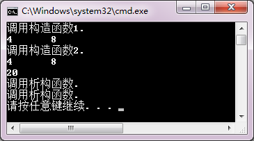

2．为同步练习6.1程序练习第2题中的student类增加一个构造函数，使得建立对象时可以完成用户指定数据的初始化。默认初始化值为：(  "\0", 0, 0 )。

若主函数为：

int main()

{  student s1;

s1.output();

student s2("Zhangsan", 120, 85);

s2.output();

student s3;

s3.input();

s3.output();

}

将有以下屏幕对话和输出：

name:	id: 0		score: 0

name: Zhangsan	 	id: 120	score: 85

name? Lihua

score? 95

name: Lihua		id: 130	score: 95

请补充student类的构造函数。

【解答】

class student

{

char name[20];

unsigned id;

double score;

public:

student(char s[20]="\0", unsigned k=0, double t=0)

{

strcpy_s(name,s);

id=k;

score=t;

}

void input()

{

cout<<"name? ";

cin>>name;

cout<<"id? ";

cin>>id;

cout<<"score? ";

cin>>score;

}

void output()

{

cout<<"name: "<<name<<"\tid: "<<id<<"\tscore: "<<score<<endl;

}

};

#### 同步练习6.3

### **一、选择题**

1．在下列选项中，（    ）不是类的成员函数。

（A）构造函数		（B）析构函数		（C）友元函数		（D）复制构造函数

2．下面对友元的错误描述是（    ）。

（A）关键字friend用于声明友元

（B）一个类中的成员函数可以是另一个类的友元

（C）友元函数访问对象的成员不受访问特性影响

（D）友元函数通过this指针访问对象成员

3．已知类A是类B的友元，类B是类C的友元，则下面选项描述正确的是（    ）。

（A）类A一定是类C的友元

（B）类C一定是类A的友元

（C）类C的成员函数可以访问类B的对象的任何成员

（D）类A的成员函数可以访问类B的对象的任何成员

4．下述关于类的静态成员的特性中，描述错误的是（    ）。

（A）说明静态数据成员时前边要加修饰符static

（B）静态数据成员要在类体外定义

（C）引用静态数据成员时，要在静态数据成员前加<类名>和作用域运算符

（D）每个对象有自己的静态数据成员副本

5．若有以下说明，则对n的正确访问语句是（    ）。

class Y

{     //…;

public:

staticint n;

};

int Y::n;

Y objY;

（A）n=1;					（B）Y::n=1;			（C）objY::n=1;			（D）Y->n

6．若有以下类Z说明，则函数fStatic中访问数据a错误的是（    ）。

class Z

{     static int a;

public:

static void fStatic(Z&);

};

int Z::a=0;  Z objZ;

（A）void Z::fStatic()  {   objZ.a =1;   }

（B）void Z::fStatic()  {   a = 1;   }

（C）void Z::fStatic()  {   this->a = 0;   }

（D）void Z::fStatic()  {   Z::a = 0;   }

7．若有以下类W说明，则函数fConst的正确定义是（    ）。

class W

{     int a;

Public

:

void fConst(int&) const;

};

（A）void W::fConst( int&k )const  {   k = a;   }

（B）void W::fConst( int&k )const  {   k = a++;   }

（C）void W::fConst( int&k )const  {   cin>> a;   }

（D）void W::fConst( int&k )const  {   a = k;   }

8．若有以下类T说明，则函数fFriend的错误定义是（        )。

class T

{   inti;

friend void fFriend( T&, int );

};

（A）void  fFriend( T &objT, int k )  {   objT.i = k;   }

（B）void  fFriend( T &objT, int k )  {   k = objT.i;   }

（C）void T::fFriend( T &objT, int k )  {   k += objT.i;   }

（D）void  fFriend( T &objT, int k )  {   objT.i += k;   }

【解答】	C	D	D	D	B	C	A	C

### **二、程序练习**

1．阅读程序，写出运行结果。

#include<iostream>

using namespace std;

class T

{   public:

T(int x)   {   a=x; b+=x;   };

static void display(T c)   {   cout<<"a="<<c.a<<'\t'<<"b="<<c.b<<endl;   }

private:

int a;

static int b;

};

int T::b=5;

int main()

{   T A(3), B(5);

T::display(A);

T::display(B);

}

【解答】

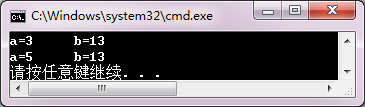

2．阅读程序，写出运行结果。

#include<iostream>

using namespace std;

#include<cmath>

class Point

{   public :

Point( float x, float y )

{   a = x; b = y;  cout<<"点( "<<a<<", "<<b<<" )";   }

friend double d( Point &A, Point &B )

{   return sqrt((A.a-B.a)*(A.a-B.a)+(A.b-B.b)*(A.b-B.b));   }

private:

double a, b;

};

int main()

{   Point p1( 2, 3 );

cout << "  到";

Point p2( 4, 5 );

cout << "的距离是：" << d( p1,p2 ) << endl;

}

【解答】

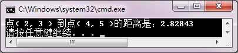

3．阅读程序，写出运行结果。

#include<iostream>

using namespace std;

class A

{   public :

A() { a = 5; }

void printa() { cout << "A:a = " << a << endl; }

private :

int a;

friend  class B;

};

class B

{   public:

void display1( A t )

{   t.a++; cout << "display1:a = " << t.a << endl;   };

void display2( A t )

{   t.a--; cout << "display2:a = " << t.a << endl;   };

};

int main()

{   A obj1;

B obj2;

obj1.printa();

obj2.display1( obj1 );

obj2.display2( obj1 );

obj1.printa();

}

【解答】

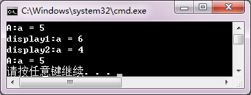

4．为同步练习6.2程序练习第2题中的student类添加一个复制构造函数。若主函数为：

int main()

{  cout<<"s2:\n";

student s2("Zhangsan", 120, 85);

s2.output();

cout<<"s3:\n";

student s3(s2);

s3.output();

}

则运行结果如下：

s2:

name: Zhangsan		id: 120	score: 85

s3:

name: Zhangsan		id: 120	score: 85

【解答】

class student

{

char name[20];

unsigned id;

double score;

public:

student(char s[20]="\0", unsigned k=0, double t=0)

{

strcpy_s(name,s);

id=k;

score=t;

}

student(const student &ss)				//复制构造函数

{

strcpy_s(name,ss.name);

id=ss.id;

score=ss.score;

}

void input()

{

cout<<"name? ";

cin>>name;

cout<<"id? ";

cin>>id;

cout<<"score? ";

cin>>score;

}

void output()

{

cout<<"name: "<<name<<"\tid: "<<id<<"\tscore: "<<score<<endl;

}

};

5．修改同步练习6.1程序练习第2题中的student类，把input和output函数写为友元函数，并相应修改主函数，使程序得到正确的运行结果。

【解答】

#include <iostream>

#include<fstream>

using namespace std;

class student

{

char name[20];

unsigned id;

double score;

public:

student(char s[20]="\0", unsigned k=0, double t=0)

{

strcpy_s(name,s);

id=k;

score=t;

}

student(const student &ss)

{

strcpy_s(name,ss.name);

id=ss.id;

score=ss.score;

}

friend void input(student &ss);		//声明友元函数

friend void output(student ss);		//声明友元函数

};

void input(student &ss)

{

cout<<"name? ";

cin>>ss.name;

cout<<"id? ";

cin>>ss.id;

cout<<"score? ";

cin>>ss.score;

}

void output(student ss)

{

cout<<"name: "<<ss.name<<"\tid: "<<ss.id<<"\tscore: "<<ss.score<<endl;

}

int main()

{

student s1;

input(s1);

output(s1);

}

6．删除同步练习6.1程序练习第2题中student类的成员函数input和output，定义一个iostudent类，它是student类的友元类，完成对student数据成员的输入/输出操作。编写完整的程序，使其得到正确的运行效果。

【解答】

#include <iostream>

#include<fstream>

using namespace std;

class student

{

char name[20];

unsigned id;

double score;

public:

student(char s[20]="\0", unsigned k=0, double t=0)

{

strcpy_s(name,s);

id=k;

score=t;

}

student(const  student &ss)

{

strcpy_s(name,ss.name);

id=ss.id;

score=ss.score;

}

friend class iostudent;

};

class iostudent				//定义iostudent类

{

public:

void input(student &ss)

{

cout<<"name? ";

cin>>ss.name;

cout<<"id? ";

cin>>ss.id;

cout<<"score? ";

cin>>ss.score;

}

void output(student ss)

{

cout<<"name: "<<ss.name<<"\tid: "<<ss.id<<"\tscore: "<<ss.score<<endl;

}

};

int main()

{

student s1;

iostudent io;

io.input(s1);

io.output(s1);

}

#### 同步练习6.4

### **一、选择题**

1．若class B中定义了一个class A的类成员A a，则关于类成员的正确描述是（    ）。

（A）在类B的成员函数中可以访问A类的私有数据成员

（B）在类B的成员函数中可以访问A类的保护数据成员

（C）类B的构造函数可以调用类A的构造函数进行数据成员初始化

（D）类A的构造函数可以调用类B的构造函数进行数据成员初始化

2．下列关于类的包含描述正确的是（    ）。

（A）可以使用赋值语句对对象成员进行初始化

（B）可以使用“参数初始式”调用成员类的构造函数初始化对象成员

（C）被包含类可以访问包含类的成员

（D）首先执行自身构造函数，再调用成员类的构造函数

【解答】		C	B

### **二、程序练习**

1．阅读程序，写出运行结果。

#include<iostream>

using namespace std;

class A

{   public:

A(int x=0):a(x){ }

void getA(int A) { a =A; }

void printA() { cout<<"a="<<a<<endl; }

private:

int a;

};

class B

{   public:

B(int x=0, int y=0):aa(x) { b = y; }

void getAB(int A, int outB) { aa.getA(A);  b=outB; }

void printAB() { aa.printA(); cout<<"b="<<b<<endl; }

private:

A aa;

int b;

};

int main()

{   A objA;

int m=5;

objA.getA(m);

cout<<"objA.a="<<m<<endl;

cout<<"objB:\n";

B objB;

objB.getAB(12,56);

objB.printAB();

}

【解答】

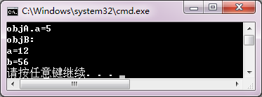

2．为同步练习6.1程序练习第2题中的student类添加一个date类数据成员birthday，date类包含三个数据成员：year、month、day，以及用于初始化的构造函数，用于输入数据的input和输出数据的output成员函数。student类构造函数需要完成birthday的数据初始化，并且完成birthday数据的输入/输出。用main函数测试这个类。

【解答】

#include <iostream>

#include<fstream>

using namespace std;

class date				//定义date类

{

int year, month, day;

public:

date(int y, int m, int d)

{

year=y;

month=m;

day=d;

}

void input()

{

cout<<"birth of year ? ";

cin>>year;

cout<<"\tmonth ? ";

cin>>month;

cout<<"\t  day ? ";

cin>>day;

}

void output()

{

cout<<"birth: "<<year<<"-"<<month<<"-"<<day<<endl;

}

};

class student				//定义student类

{

char name[20];

unsigned id;

double score;

date birth;				//date类的数据成员

public:

//构造函数

student(char s[20]="No name", unsigned k=0, double t=0, int y=2000, int m=1, int d=1)

: birth(y, m, d)

{

strcpy_s(name,s);

id=k;

score=t;

}

void input()

{

cout<<"name? ";

cin>>name;

birth.input();

cout<<"id? ";

cin>>id;

cout<<"score? ";

cin>>score;

}

void output()

{

cout<<"name: "<<name<<"\t";

birth.output();

cout<<"id: "<<id<<"\tscore: "<<score<<endl;

}

};

int main()

{

student s;

s.input();

s.output();

}

#### 综合练习

### **一、思考题**

1．结构与类有什么区别？如果把程序中定义结构的关键字struct直接改成class，会有什么问题？用教材中的一个例程试试看，想一想做什么修改能使程序正确运行？

【解答】

结构是数据的封装，类是数据和操作的封装。可以把结构看成是类的特例。结构和类都可以用关键字struct或class定义。区别是，struct定义的结构或类的全部成员都是公有的，用class定义的结构或类不做声明的成员是私有的。

若把struct改成class，只需要把全部成员定义为public就可以了。

2．有说明：

class A

{

int a;

double x;

public:

funMember();

};

A a1, a2, a3;

编译器为对象a1、a2和a3开辟了什么内存空间？它们有各自的funMember函数的副本吗？C++通过什么机制调用类的成员函数？

【解答】

开辟的存储空间有a1.a, a1.x, a2.a, a2.x, a3.a, a3.x。各对象没有funMember函数的副本，C++通过this指针调用成员函数。

3．C++提供了系统版本的构造函数，为什么还需要用户自定义构造函数？编写一个验证程序，说明自定义构造函数的必要性。

【解答】

类的默认构造函数可以建立基本类型数据成员的存储空间。基于以下两个原因，需要用户定义构造函数：

（1）对数据成员的值做指定初始化；

（2）类的数据是由指针管理的堆。

程序略。

4．试从定义方式、访问方式、存储性质和作用域4个方面来分析类的一般数据成员和静态数据成员的区别，并编写一个简单程序验证它。

【解答】

<table>
<tr><td></td><td>定义方式</td><td>访问方式</td><td>存储性质</td><td>作用域</td></tr>
<tr><td>一般数据成员</td><td>类中定义</td><td>对象.数据成员</td><td>局部数据</td><td>由访问属性public, protected,  private决定</td></tr>
<tr><td>静态数据成员</td><td>类中声明，类外定义</td><td>对象.数据成员 类::数据成员</td><td>全局数据</td><td></td></tr>
</table>

程序略。

5．试从定义方式、调用方式两个方面来分析常成员函数、静态成员函数和友元函数的区别。考察

例6-16，若class Goods的指针域：

Goods * next;

被声明为私有（private）成员，程序会出现什么错误？做什么最小修改能使程序正确运行？

【解答】

|  | **定义方式** | **调用方式** |
|---|---|---|
| 常成员函数 | 函数原型以const做后缀 this指针被约束为指向常量的常指针 | 与一般成员函数调用形式相同 对数据成员只读 |
| 静态成员函数 | 以static做函数原型前缀 没有this指针 | 通过类或对象调用 用于操作静态数据成员 |
| 友员函数 | 以friend做函数原型前缀 没有this指针 | 通过参数访问对象 可以访问对象的不同属性的成员 |

在例6-16中，若把next声明为私有数据成员，只须把有关指针操作的函数定义为友员函数就可以了：

friend void purchase( Goods * &f, Goods *& r, int w );

friend void sale( Goods * & f , Goods * & r );

6．设有：

class M

{  public: int a;

};

class N

{  public:

M m;

int b;

void fun()

{   /*…*/   }

};

int main()

{  N n;

N *p = &n;

/*…*/

}

描述在N::fun中如何访问M类的数据成员a？在main函数中又如何访问对象n的全部数据成员？

【解答】

在N::fun中访问M类的数据成员a的形式是：  		m.a

在main函数中访问M类的数据成员的形式是：		n.b，n.m.a

### **二、程序设计**

1．定义一个Book（图书）类，在该类定义中包括以下数据成员和成员函数。

数据成员：bookname（书名）、price（价格）和number（存书数量）。

成员函数：display()显示图书的情况；borrow()将存书数量减1，并显示当前存书数量；restore()将存书数量加1，并显示当前存书数量。

在main函数中，要求创建某一种图书对象，并对该图书进行简单的显示、借阅和归还管理。

【解答】

#include <iostream>

using namespace std;

class Book

{

public:

void setBook(char*,double,int);

void borrow();

void restore();

void display();

private:

char bookname[40];

double price;

int number;

};

//在类外定义Book类的成员函数

void Book::setBook(char *name, double pri, int num)

{

strcpy_s(bookname, name);

price=pri;

number=num;

}

void Book::borrow()

{

if (number==0 )

{

cout << "已没存书，退出！" << endl;

abort();

}

number = number - 1;

cout << "借一次，现存书量为：" << number << endl;

}

void Book::restore()

{

number = number + 1;

cout << "还一次，现存书量为：" << number << endl;

}

void Book::display()

{

cout << "存书情况：" << endl

<< "bookname:" << bookname << endl

<< "price:" << price << endl

<< "number:" << number << endl;

}

int main()

{

char flag, ch;

Book computer;

computer.setBook( "C++程序设计基础" , 32, 1000 );

computer.display();

ch = 'y';

while ( ch == 'y' )

{

cout << "请输入借阅或归还标志(b/r)：";

cin >> flag;

switch ( flag )

{

case 'b':  computer.borrow(); break;

case 'r':  computer.restore();

}

cout << "是否继续？(y/n)";

cin >> ch;

}

computer.display();

}

2．定义一个Box（盒子）类，在该类定义中包括以下数据成员和成员函数。

数据成员：length（长）、width（宽）和height（高）。

成员函数：构造函数Box，设置盒子的长、宽和高三个初始数据；成员函数setBox对数据成员置值；成员函数volume计算盒子的体积。

在main函数中，要求创建Box对象，输入长、宽、高，输出盒子的体积。

【解答】

#include <iostream>

using namespace std;

class BOX

{

public:

BOX( double l, double w, double h )

{ length = l;

width = w;

height = h;

}

void volume()

{  cout << "volume=" << length * width * height << endl;

}

private:

double  length, width, height;

};

int main()

{

BOX box1( 1,3,5 );

box1.volume();

BOX box2( 2,4,6 );

box2.volume();

}

3．定义一个student类，在该类定义中包括：一个数据成员（分数score）及两个静态数据成员（总分total和学生人数count）；成员函数scoretotalcount(double s)  用于设置分数、求总分和累计学生人数；静态成员函数sum()用于返回总分；静态成员函数average()用于求平均值。

在main函数中，输入某班同学的成绩，并调用上述函数求全班学生的总分和平均分。

【解答】

#include <iostream>

using namespace std;

class student

{

public:

void scoretotalcount( double s )

{

score = s;

total = total + score;

count++;

}

static double sum()

{

return total;

}

static double average()

{

return total / count;

}

private:

double  score;

static double total;

static double count;

};

double student::total=0;

double student::count=0;

int main()

{

int i,n; double s;

cout << "请输入学生人数：";

cin >> n;

student  stu;

for( i=1; i<=n; i++ )

{

cout << "请输入第" << i << "个学生的分数：";

cin >> s;

stu.scoretotalcount( s );}

cout << "总分：" << student::sum() << endl;

cout << "平均分：" << student::average() << endl;

}

4．定义一个表示点的结构类型Point和一个由直线方程*y*  =  *ax*  +  *b*确定的直线类Line。结构类型Point有两个成员x和y，分别表示点的横坐标和纵坐标。Line类有两个数据成员a和b，分别表示直线方程中的系数。Line类有一个成员函数print用于显示直线方程。友元函数setPoint(Line &l1,Line &l2)用于求两条直线的交点。在main函数中，建立两个直线对象，分别调用print函数显示两条直线的方程，并调用函数setPoint求这两条直线的交点。

【解答】

#include <iostream>

using namespace std;

struct point

{

double x; double y;

};

class line

{

public:

line( double u, double v )

{

a=u;  b=v;

}

void print()

{

cout<<"y="<<a<<"x+"<<b<<endl;

}

friend point setpoint(line &l1,line &l2);

private:

double a, b;

};

point setpoint( line &l1, line &l2 )

{

point p;

p.x=( l2.b-l1.b )/( l1.a-l2.a );

p.y=( l1.a*l2.b-l2.a*l1.b)/(l1.a-l2.a );

return p;

}

int main()

{

point setp;

line l1(2,3), l2(4,5);

cout<<"直线l1: ";

l1.print();

cout<<"直线l2: ";

l2.print();

setp=setpoint( l1,l2 );

cout<<"直线l1和直线l2的交点:("<<setp.x<<","<<setp.y<<")"<<endl;

}

5．用类成员结构修改第4题的程序，使其实现相同的功能。定义Point类和Line类，表示点和线；定义setPoint类，包含两个Line类成员和一个表示直线交点的Point成员，并定义类中求直线交点的成员函数。编写每个类相应的成员函数和测试用的主函数。

【解答】

略。

## 第7章练习题

**同步练习7.1**

### **一、选择题**

1．在下列运算符中，不能重载的是（    ）。

（A）!							（B）sizeof				（C）new						（D）delete

2．在下列关于运算符重载的描述中，（    ）是正确的。

（A）可以改变参与运算的操作数个数		（B）可以改变运算符原来的优先级

（C）可以改变运算符原来的结合性		（D）不能改变原运算符的语义

3．运算符函数是一种特殊的（    ）或友元函数。

（A）构造函数		（B）析构函数		（C）成员函数		（D）重载函数

4．设op表示要重载的运算符，那么重载运算符的函数名是（    ）。

（A）operator op		（B）op			（C）函数标识符	（D）函数标识符op

5．用于类运算的运算符通常都要重载。但有两个运算符系统提供默认重载版本，它们是（    ）。

（A）->和.			（B）++和--		（C）=和&		（D）new和delete

【解答】		B	D	C	A	C

### **二、程序练习**

阅读程序，其中s::connect函数实现字符串连接。把这个成员函数改写为重载+运算符函数，并修改main函数的对应代码，使其正确运行。

#include <iostream>

#include<cstring>

using namespace std;

class s

{  public:

s() { *str = '\0'; len = 0; }

s( char *pstr )

{  strcpy_s( str,pstr );  len = strlen(pstr);   }

char *gets() {  return str;   }

int getLen() {  return len;   }

s connect( s obj );							//字符串连接函数声明

private:

char str[100];

int len;

};

s s::connect( s obj )									//字符串连接函数定义

{  strcat_s( str,obj.str );

return str;

}

int main()

{  s obj1( "Visual" ), obj2( " C++" ), obj3(" language");

obj3 = (obj1.connect(obj2)).connect(obj3);		//调用字符串连接函数

cout << "obj3.str = "<<obj3.gets() << endl;

cout<<"obj3.len = "<<obj3.getLen()<<endl;

}

【解答】

#include <iostream>

#include<cstring>

using namespace std;

class s

{  public:

s()

{ *str = '\0'; len = 0; }

s( char *pstr )

{  strcpy_s( str,pstr );

len = strlen(pstr);

}

char *gets()

{  return str; }

int getLen()

{  return len; }

s operator+( s obj );

private:

char str[100];

int len;

};

s s::operator+( s obj )

{

strcat_s( str,obj.str );

return str;

}

int main()

{

s obj1( "Visual" ), obj2( " C++" ), obj3(" language");

obj3 = obj1 + obj2 + obj3;

cout << "obj3.str = "<<obj3.gets() << endl;

cout<<"obj3.len = "<<obj3.getLen()<<endl;

}

**同步练习7.2**

### **一、选择题**

1．在下列函数中，不能重载运算符的函数是（    ）。

（A）成员函数		（B）构造函数		（C）普通函数		（D）友元函数

2．在下列运算符中，要求用成员函数重载的运算符是（    ）。

（A）=							（B）==						（C）<=					（D）++

3．在下列运算符中，要求用友元函数重载的运算符是（    ）。

（A）=							（B）[]						（C）<<						（D）( )

4．如果希望运算符的操作数（尤其是第一个操作数）有隐式转换，则重载运算符时必须用（    ）。

（A）构造函数		（B）析构函数		（C）成员函数		（D）友元函数

5．当一元运算符的操作数，或者二元运算符的左操作数是该类的一个对象时，重载运算符函数一般定义为（    ）。

（A）构造函数		（B）析构函数		（C）成员函数		（D）友元函数

【解答】			B	A	C	D	C

### **二、程序练习**

1．阅读程序，写出运行结果。

#include <iostream>

using namespace std;

class T

{  public :

T()   {   a = 0; b = 0; c = 0;   }

T( int i, int j, int k )   {   a = i; b =j; c = k;   }

void get( int &i, int &j, int &k )   {   i = a; j = b; k = c;   }

T operator* ( T obj );

private:

int a, b, c;

};

T T::operator* ( T obj )

{  T tempobj;

tempobj.a = a * obj.a;

tempobj.b = b * obj.b;

tempobj.c = c * obj.c;

return tempobj;

}

int main()

{  T obj1( 1,2,3 ), obj2( 5,5,5 ), obj3;

int a, b, c;

obj3 = obj1 * obj2;

obj3.get( a, b, c );

cout<<"( obj1*obj2 ): " <<"a = "<<a<<'\t'<<"b = "<<b<<'\t'<<"c = "<<c<<'\n';

(obj2*obj3).get( a, b, c );

cout<<"( obj2*obj3 ): " <<"a = "<<a<<'\t'<<"b = "<<b<<'\t'<<"c = "<<c<<'\n';

}

【解答】

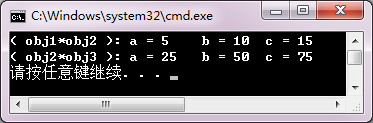

2．阅读程序，写出运行结果。

#include <iostream>

using namespace std;

class Vector

{  public:

Vector(){   }

Vector(int i,int j)   {   x = i; y = j;   }

friend Vector operator+ ( Vector v1, Vector v2 )

{  Vector tempVector;

tempVector.x = v1.x + v2.x;

tempVector.y = v1.y + v2.y;

return  tempVector;

}

void display()

{   cout << "( " << x << ", " << y << ") "<< endl;   }

private:

int x, y;

};

int main()

{  Vector v1( 1, 2 ), v2( 3, 4 ), v3;

cout << "v1 = ";

v1.display();

cout << "v2 = ";

v2.display();

v3 = v1 + v2;

cout << "v3 = v1 + v2 = ";

v3.display();

}

【解答】

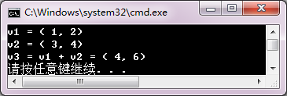

3．在同步练习7.1的程序练习中，用于连接字符串的重载“+”运算符函数被重载为class s的成员函数。请用友元函数定义改写之。

【解答】

#include <iostream>

#include<cstring>

using namespace std;

class s

{

public:

s()

{ *str = '\0'; len = 0; }

s( char *pstr )

{

strcpy_s( str,pstr );

len=strlen(pstr);

}

char *gets()

{  return str;  }

int getLen()

{  return len;  }

friend s operator+( s obj1, s obj2 );				//声明友元函数

private:

char str[100];

int len;

};

s operator+( s obj1, s obj2  )

{

strcat_s( obj1.str,obj2.str );

return obj1.str;

}

int main()

{

s obj1( "Visual" ),obj2( " C++" ),obj3(" language");

obj3 = obj1 + obj2 + obj3;

cout << "obj3.str = "<<obj3.gets() << endl;

}

**同步练习7.3**

### **一、选择题**

1．设有类A的对象Aobject，若用成员函数重载前置自增表达式，那么++Aobject被编译器解释为（    ）。

（A）Aobject.operator++()				（B）operator++(Aobject)

（C）++(Aobject)								（D）Aobject :: operator++()

2．运算符++，=，+和[]中，只能用成员函数重载的运算符是（    ）。

（A）+和=					（B）[]和后置++

（C）=和[]					（D）前置++和[]

3．在C++中，如果在类中重载了函数调用运算符()，那么重载函数调用的一般形式为（    ）。

（A）（表达式）对象			（B）（表达式表）对象

（C）对象（表达式）			（D）对象（表达式表）

4．设有类A的对象Aobject，若用友元函数重载后置自减表达式，那么Aobject--被编译器解释为（    ）。

（A）Aobject.operator--  ()				（B）operator--  (Aobject,0)

（C）--  (Aobject,0)						（D）--  (Aobject,0)

5．如果表达式++j*k中的++和*都是重载的友元运算符，则采用运算符函数调用格式，该表达式还可以表示为（    ）。

（A）operator*(j.operator++(),k)		（B）operator*(operator++(j),k)

（C）operator++(j).operator*(k)		（D）operator*(operator++(j),)

6．如果类A要重载插入运算符<<，那么重载函数参数表的形式一般定义为（    ）。

（A）(constA&)				（B）(ostream&)

（C）(constA&,  ostream&)		（D）(ostream&,  constA&)

【解答】		A	C	D	B	B	D

### **二、程序练习**

改写下述程序中的student类，用重载运算符>>函数代替input函数；用重载运算符<<函数代替output函数；并修改main函数，使其得到正确的运行结果。

#include <iostream>

using namespace std;

class student

{      char name[20];

unsigned id;

double score;

public:

student(char s[20]="\0", unsigned k=0, double t=0)

{  strcpy_s(name,s);

id=k;

score=t;

}

void input()

{  cout<<"name? ";

cin>>name;

cout<<"id? ";

cin>>id;

cout<<"score? ";

cin>>score;

}

void output()

{  cout<<"name: "<<name<<"\tid: "<<id<<"\tscore: "<<score<<endl;   }

};

int main()

{  student s;

s.input();

s.output();

}

【解答】

#include <iostream>

using namespace std;

class student

{

char name[20];

unsigned id;

double score;

public:

student(char s[20]="\0", unsigned k=0, double t=0)

{

strcpy_s(name,s);

id=k;

score=t;

}

friend ostream & operator<<(ostream &, const student &);

friend istream & operator>>(istream &, student &);

};

ostream & operator<<(ostream &out, const student &s)

{

out<<"name: "<<s.name<<"\tid: "<<s.id<<"\tscore: "<<s.score<<endl;

return out;

}

istream & operator>>(istream &in, student &s)

{

cout<<"name? ";

in>>s.name;

cout<<"id? ";

in>>s.id;

cout<<"score? ";

in>>s.score;

return in;

}

int main()

{

student s;

cin>>s;

cout<<s;

}

**同步练习7.4**

### **一、选择题**

1．类型转换函数只能定义为一个类的（    ）。

（A）构造函数		（B）析构函数		（C）成员函数		（D）友元函数

2．具有一个非默认参数的构造函数一般用于实现从（    ）的转换。

（A）该类类型到参数类型		（B）参数类型到该类类型

（C）参数类型到基本类型		（D）类类型到基本类型

3．假设ClassX是类类型标识符，Type为类型标识符，可以是基本类型或类类型，Type_Value为Type类型的表达式，那么，类型转换函数的形式为（    ）。

（A）ClassX :: operator Type(Type t)  {  …  return Type_Value;  }

（B）friendClassX :: operator Type()  {  …  return Type_Value;  }

（C）Type ClassX :: operator Type()  {  … return Type_Value;  }

（D）ClassX :: operator Type()  {  …  return Type_Value;  }

4．在下列关于类型转换的描述中，错误的是（    ）。

（A）任何形式的构造函数都可以实现数据类型转换。

（B）带非默认参数的构造函数可以把基本类型数据转换成类类型对象。

（C）类型转换函数可以把类类型对象转换为其他指定类型对象。

（D）类型转换函数只能定义为一个类的成员函数，不能定义为类的友元函数。

5．C++中利用构造函数进行类类型转换时的构造函数形式为（    ）。

（A）类名::类名(arg);				（B）类名::类名(arg,arg1=E1,…,agrn=En);

（C）~类名(arg);						（D）~类名(arg,arg1=E1,…,agrn=En);

【解答】		C	B	D	A	B

### **二、程序练习**

1．阅读下面程序，按注释位置指出语句的性质。

#include<string.h>

#include<iostream>

using namespace std;

//定义String类

class String

{     friend ostream &operator<<(ostream & output,String &s);	//（1）什么语句

friend istream &operator>>(istream & input,String &s);	//（2）什么语句

public:

String(const char *m="");								//（3）什么语句

~String();												//（4）什么语句

operator int() const;										//（5）什么语句

operator char* ()const;									//（6）什么语句

private:

char *str;

int size;

};

//（7）什么定义

String::String(const char *m)

{  size=strlen(m);

str=new char[size+1];

strcpy_s(str,size+1,m);

}

//（8）什么定义

String::~String()

{   delete [] str;

size=0;

}

//（9）什么定义

ostream &operator<<(ostream &output,String &s)

{  output<<s.str;

return output;

}

//（10）什么定义

istream &operator>>(istream &input,String &s)

{  char temp[1000];

input>>temp;

delete [] s.str;

s.size=strlen(temp);

s.str=new char[s.size+1];

strcpy_s(s.str,s.size+1,temp);

return input;

}

//（11）什么定义

String::operator int()const

{  return size;  }

//（12）什么定义

String::operator char* () const

{  static char temp[1000];

strcpy_s(temp,"\"");

strcat_s(temp,str);

strcat_s(temp,"\"");

return temp;

}

int main()

{  char s[100];

String s1,s2;											//（13）调用什么函数

cout<<"Please input two strings:"<<endl;

cin>>s1>>s2;										//（14）调用什么函数

cout<<"output is:"<<endl;

cout<<"s1 as String--"<<s1<<endl;							//（15）调用什么函数

cout<<"sizeof(s1) -sizeof(s2)="<<((int)s1-  (int)s2)<<endl;	//（16）调用什么函数

cout<<"s1 as char *  --"<<(char*)s1<<endl;						//（17）调用什么函数

cout<<"s2 as char *  --"<<(char*)s2<<endl;						//（18）调用什么函数

strcpy(s,s2);												//（19）调用什么函数

cout<<"After strcpy(s,s2); s="<<s<<endl;						//（20）调用什么函数

return 0;													//（21）调用什么函数

}

【解答】

#include<string.h>

#include<iostream>

using namespace std;

//定义String类

class String

{	friend ostream &operator<<(ostream & output,String &s);  	//（1）运算符<<重载函数声明

friend istream &operator>>(istream & input,String &s);  		//（2）运算符>>重载函数声明

public:

String(const char *m="");	//（3）构造函数声明

~String();				//（4）析构函数声明

operator int() const;		//（5）类型转换函数声明

operator char* ()const;		//（6）类型转换函数声明

private:

char *str;

int size;

};

//（7）定义构造函数

String::String(const char *m)

{	size=strlen(m);

str=new char[size+1];

strcpy_s(str,size+1,m);

}

//（8）定义析构函数

String::~String()

{ 	delete [] str;

size=0;

}

//（9）定义运算符<<重载函数

ostream &operator<<(ostream &output,String &s)

{	output<<s.str;

return output;

}

//（10）定义运算符>>重载函数

istream &operator>>(istream &input,String &s)

{	char temp[1000];

input>>temp;

delete [] s.str;

s.size=strlen(temp);

s.str=new char[s.size+1];

strcpy_s(s.str,s.size+1,temp);

return input;

}

//（11）定义int类型转换函数

String::operator int()const

{

return size;

}

//（12）定义char*类型转换函数

String::operator char* () const

{

static char temp[1000];

strcpy_s(temp,"\"");

strcat_s(temp,str);

strcat_s(temp,"\"");

return temp;

}

int main()

{

char s[100];

String s1,s2;	//（13）调用构造函数

cout<<"Please input two strings:"<<endl;

cin>>s1>>s2;	/（14）/调用operator>>函数

cout<<"output is:"<<endl;

cout<<"s1 as String--"<<s1<<endl;	//（15）调用operator<<函数

cout<<"sizeof(s1)-sizeof(s2)="<<((int)s1-(int)s2)<<endl;	//（16）调用operator int类型转换函数

cout<<"s1 as char * --"<<(char*)s1<<endl;	//（17）调用operator char*类型转换函数

cout<<"s2 as char * --"<<(char*)s2<<endl;	//（18）调用operator char*类型转换函数

strcpy(s,s2);		//（19）对参数s2调用类型转换函数operator char*，然后调用库函数

cout<<"After strcpy(s,s2); s="<<s<<endl;	//（20）调用库函数输出串

return 0;		//（21）调用析构函数

}

2．定义人民币类RMB，包含：

私有数据成员	int yuan（元）、int jiao（角）、int fen（分）、bool mark（标志，表示正、负数）

成员函数		用（元，角，分，标志）构造RMB对象

用double数据构造RMB对象

类型转换，把RMB对象转换为double值

友元函数		重载<<，以“元角分”形式输出RMB对象值

重载>>，以“元角分”形式输入RMB对象值

以下是main函数的测试和运行显示。请补充RMB类的定义。

#include<iostream>

using namespace std;

//此处定义class RMB

int main()

{  RMB a, b;

double c;

cout<<"a :\n";  cin>>a;

cout<<"b :\n";  cin>>b;

cout<<"c :\n";  cin>>c;

cout<<"a = "<<a<<"\tb = "<<b<<"\tc = "<<RMB(c)<<endl;

cout<<"a + c = "<<RMB(a+c)<<endl;

cout<<"a  -  b = "<<RMB(a-b)<<endl;

cout<<"b * 2 = "<<RMB(b*2)<<endl;

cout<<"a * 0.5 = "<<RMB(a*0.5)<<endl;

}

【解答】

#include<iostream>

using namespace std;

class RMB

{

int yuan, jiao, fen ;

bool mark;

public:

RMB(int y, int j, int f, bool mark=false);

RMB(double x=0);

operator double()const;

friend istream& operator>>(istream&, RMB&);

friend ostream& operator<<(ostream&, RMB);

};

RMB::RMB(int y, int j, int f, bool m )

{

yuan=y; jiao=j; fen=f; mark=m;

}

RMB::RMB(double x)

{

if(x<0)

{

mark=true; x=-x;

}

else

mark=0;

int n=int((x+0.005)*100);

yuan=n/100;

jiao=(n-yuan*100)/10;

fen=n%10;

}

RMB::operator double()const

{

double x=yuan+jiao/10.0+fen/100.0;

if(mark) x=-x;

return x;

}

istream& operator>>(istream&input, RMB &r)

{

cout<<"元？"; input>>r.yuan;

cout<<"角？"; input>>r.jiao;

cout<<"分？"; input>>r.fen;

return input;

}

ostream& operator<<(ostream& output, RMB r)

{

if(r.mark) output<<" - ";

output<<r.yuan<<"元"<<r.jiao<<"角"<<r.fen<<"分";

return output;

}

int main()

{

RMB a, b;

double c;

cout<<"a :\n";  cin>>a;

cout<<"b :\n";  cin>>b;

cout<<"c :\n";  cin>>c;

cout<<"a = "<<a<<"\tb = "<<b<<"\tc = "<<RMB(c)<<endl;

cout<<"a + c = "<<RMB(a+c)<<endl;

cout<<"a - b = "<<RMB(a-b)<<endl;

cout<<"b * 2 = "<<RMB(b*2)<<endl;

cout<<"a * 0.5 = "<<RMB(a*0.5)<<endl;

}

**综合练习**

### **一、思考题**

1．一个运算符重载函数被定义为成员函数或友元函数后，在定义方式、解释方式和调用方式上有何区别？可能会出现什么问题？请用一个实例说明之。

【解答】

以二元运算符为例。

| **运算符重载** | **定义** | **解释** | **调用** |
|---|---|---|---|
| 成员函数 | Obj& operator op(); Obj operator  *op*(object); | Obj.operator  *op*() ObjL.operator op(ObjR) | Obj *op* 或  *op*  Obj ObjL  *op*  ObjR 左操作数通过this指针指定，右操作数由参数传递 |
| 友员函数 | friend Obj & operator *op*(Obj &); friend Obj operator *op*(Obj,Obj); | operator  *op*(Obj) operator  *op*(ObjL,ObjR) | Obj  *op*  或   *op*  Obj ObjL  *op*  ObjR 操作数均由参数传递 |

可能会出现的问题：

（1）运算符的左右操作数不同，须用友员函数重载；

（2）当运算符的操作需要修改类对象状态时，应用成员函数重载。

（3）友员函数不能重载运算符  = () [] ->

必须要用友员函数重载的运算符  >> <<

程序略。

2．类类型对象之间、类类型和基本类型对象之间用什么函数进行类型转换？归纳进行类型转换的构造函数和类型转换函数的定义形式、调用形式和调用时机。

【解答】

构造函数可以把基本类型、类类型数据转换成类类型数据；类类型转换函数可以在类类型和基本数据类型之间做数据转换。

|  | 定义形式 | 调用形式 | 调用时机 |
|---|---|---|---|
| 构造函数 | ClassX::ClassX(arg,arg1=E1,...,argn=En); | 隐式调用 | 建立对象、参数传递时 |
| 类类型转换函数 | ClassX::operator Type(); | 用类型符显式调用； 自动类型转换时隐式调用 | 需要做数据类型转换时 |

### **二、程序设计**

1．定义一个整数计算类Integer，实现短整数+、-、*、/基本算术运算。要求：可以进行数据范围检查（32 768～32 767，或自行设定），数据溢出时显示错误信息并中断程序运行。

【解答】

#include <iostream>

using namespace std;

class Integer

{

private:

short a;

public:

Integer (short n=0){ a=n;}

Integer operator +(Integer);

Integer operator -(Integer);

Integer operator *(Integer);

Integer  operator /(Integer);

Integer operator =(Integer);

void display() { cout<<a<<endl; }

};

Integer Integer::operator+(Integer x)

{

Integer temp;

if(a+x.a<-32768||a+x.a>32767)

{ cout<<"Data overflow!"<<endl; abort(); }

temp.a=a+x.a;

return temp;

}

Integer Integer::operator-(Integer x)

{

Integer temp;

if(a-x.a<-32768||a-x.a>32767)

{ cout<<"Data overflow!"<<endl; abort(); }

temp.a=a-x.a;

return temp;

}

Integer Integer::operator*(Integer x)

{

Integer temp;

if(a*x.a<-32768||a*x.a>32767)

{cout<<"Data overflow!"<<endl; abort();}

temp.a=a*x.a;

return temp;

}

Integer  Integer::operator/(Integer x)

{

Integer temp;

if(a/x.a<-32768||a/x.a>32767)

{ cout<<"Data overflow!"<<endl; abort(); }

temp.a=a/x.a;

return temp;

}

Integer Integer::operator=(Integer x)

{

a=x.a;

return *this;

}

int main()

{

Integer A(90),B(30),C;

cout<<"A=";A.display();

cout<<"B=";B.display();

C=A+B;

cout<<"C=A+B="; C.display();

C=A-B;

cout<<"C=A-B="; C.display();

C=A*B;

cout<<"C=A*B="; C.display();

C=A/B;

cout<<"C=A/B="; C.display();

}

2．定义一个实数计算类Real，实现单精度浮点数+、、*、/基本算术运算。要求：可以进行数据范围（3.4×1038～3.4×1038，或自行设定）检查，数据溢出时显示错误信息并中断程序运行。

【解答】

#include <iostream>

using namespace std;

class Real

{

private:

double a;

public:

Real (double r=0){a=r;}

Real operator +(Real);

Real operator -(Real);

Real operator *(Real);

Real operator /(Real);

Real operator =(Real);

void display()

{ cout<<a<<endl; }

};

Real Real::operator+(Real x)

{

Real temp;

if(a+x.a<-1.7e308||a+x.a>1.7e308)

{ cout<<"Data overflow!"<<endl; abort(); }

temp.a=a+x.a;

return temp;

}

Real Real::operator-(Real x)

{

Real temp;

if(a-x.a<-1.7e308||a-x.a>1.7e308)

{ cout<<"Data overflow!"<<endl; abort(); }

temp.a=a-x.a;

return temp;

}

Real Real::operator*(Real x)

{

Real temp;

if(a*x.a<-1.7e308||a*x.a>1.7e308)

{ cout<<"Data overflow!"<<endl; abort(); }

temp.a=a*x.a;

return temp;

}

Real Real::operator/(Real x)

{

Real temp;

if(a/x.a<-1.7e308||a/x.a>1.7e308)

{ cout<<"Data overflow!"<<endl; abort(); }

temp.a=a/x.a;

return temp;

}

Real Real::operator=(Real x)

{

a=x.a;

return *this;

}

int main()

{

Real A(1.1),B(1.2),C;

cout<<"A=";A.display();

cout<<"B=";B.display();

C=A+B;

cout<<"C=A+B="; C.display();

C=A-B;

cout<<"C=A-B="; C.display();

C=A*B;

cout<<"C=A*B="; C.display();

C=A/B;

cout<<"C=A/B="; C.display();

}

3．假设有向量***X***  = (  *x*1, *x*2,…, *x**n*)和***Y***  = ( *y*1, *y*2,…, *y**n* )，它们之间的加、减和乘法分别定义为：

***X***  +  ***Y***  = (  *x*1 +  *y*1, *x*2 +  *y*2,…, *x**n* +  *y**n* )

***X***  ***Y***  = (  *x*1  *y*1, *x*2  *y*2,…, *x**n*  *y**n* )

***X***  ***Y***  =  *x*1  *y*1 +  *x*2  *y*2 +…+  *x**n*  *y**n*

编写程序定义向量类Vector，重载运算符+、、和=，实现向量之间的加、减、乘、赋值运算；重载运算符>>、<<实现向量的输入、输出功能。注意检测运算的合法性。

提示：向量类的声明可以是：

class Vector

{  private:

double *v;

int len;

public:

Vector(int size);

Vector(double *,int);

~Vector();

double &operator;

Vector & operator =(Vector &);

friend Vector operator +(Vector &,Vector &);

friend Vector operator  -  (Vector &,Vector &);

friend double operator *(Vector &,Vector &);

friend ostream & operator <<(ostream &output,Vector &);

friend istream & operator >>(istream &input,Vector &);

};

【解答】

#include <iostream>

using namespace std;

class Vector

{

private:

double *v;

int len;

public:

Vector(int size);

Vector(double *,int);

~Vector();

double &operator;

Vector & operator =(Vector &);

friend Vector operator +(Vector &,Vector &);

friend Vector operator -(Vector &,Vector &);

friend double operator *(Vector &,Vector &);

friend ostream & operator <<(ostream &output,Vector &);

friend istream & operator >>(istream &input,Vector &);

};

Vector::Vector (int size)

{

if(size<=0||size>=2147483647)

{ cout<<"The size of "<<size<<"is overflow!\n";

abort();

}

v=new double [size];

for(int i=0;i<size;i++) v[i]=0;

len=size;

}

Vector::Vector(double *C,int size)

{

if(size<=0||size>=2147483647)

{ cout<<"The size of"<<size<<"is overflow!\n"<<endl;

abort();

}

v=new double[size];

len=size;

for(int i=0;i<len;i++) v[i]=C[i];

}

Vector::~Vector()

{

delete []v;

v=NULL;  len=0;

}

double &Vector::operator

{

if(i>=0 && i<len)

return v[i];

else

{ cout<<"The size of"<<i<<"is overflow!\n";

abort();}

}

Vector &Vector::operator =(Vector &C)

{

if(len==C.len)

{

for(int i=0;i<len;i++)

v[i]=C[i];

return *this;

}

else

{

cout<<"Operator = fail!\n";

abort();

}

}

Vector operator +(Vector &A,Vector &B)            //  向量相加

{

int size=A.len ;

double *T=new double[size];

if(size==B.len)

{

for(int i=0;i<size;i++)

T[i]=A[i]+B[i];

return Vector (T,size);

}

else

{

cout<<"Operator + fail!\n";

abort();

}

}

Vector operator -(Vector &A,Vector &B)             //向量相减

{

int size=A.len ;

double *T=new double[size];

if(size==B.len)

{ for(int i=0;i<size;i++)

T[i]=A[i]-B[i];

return Vector (T,size);

}

else

{

cout<<"Operator - fail!\n";

abort();

}

}

double operator *(Vector &A,Vector &B)              //向量相乘

{

int size=A.len ;

double s=0;

if( size==B.len )

{

for( int i=0; i<size; i++ )

s+=A[i]*B[i];

return s;

}

else

{

cout<<"Operator * fail!\n";

abort();

}

}

ostream & operator <<(ostream &output,Vector &A)     //输出

{

int i;

output<<'(';

for( i=0;i<A.len-1;i++)

output<<A[i]<<',';

output<<A[i]<<')';

return output;

}

istream & operator >>(istream &input,Vector &A)     //输入

{

for(int i=0;i<A.len;i++)

input>>A[i];

return input;

}

int main()

{

int k1,k2,k3;double t;

cout<<"Input the length of Vector A:\n";

cin>>k1;

Vector A(k1);

cout<<"Input the elements of Vector A:\n";

cin>>A;

cout<<"Input the length of Vector B:\n";

cin>>k2;

Vector B(k2);

cout<<"Input the elements of Vector B:\n";

cin>>B;

cout<<"Input the length of Vector C:\n";

cin>>k3;

Vector C(k3);

cout<<"A="<<A<<endl;

cout<<"B="<<B<<endl;

C=A+B;

cout<<"A+B="<<A<<"+"<<B<<"="<<C<<endl;

C=A-B;

cout<<"A-B="<<A<<"-"<<B<<"="<<C<<endl;

t=A*B;

cout<<"A*B="<<A<<"*"<<B<<"="<<t<<endl;

}

4．定义一个类nauticalmile_kilometer，它包含两个数据成员kilometer（千米）和meter（米）；还包含一个构造函数对数据成员进行初始化；成员函数print，用于输出数据成员kilometer和meter的值；类型转换函数operator double，实现把千米和米转换为海里（1海里=1.852千米）的功能。编写main函数，测试类nauticalmile_kilometer。

【解答】

#include <iostream>

using namespace std;

const double n = 1.852;     //  定义海里与千米和米的转换系数(1海里=1.852千米)

class nauticalmile_kilometer

{

public:

nauticalmile_kilometer( int km,double m )

{

kilometer = km;  meter = m;

}

void print()

{

cout<<"kilometer="<<kilometer<<'\t'<<"meter="<<meter<<endl;

}

operator double();

private:

int kilometer;

double meter;

};

nauticalmile_kilometer::operator double()

{

return ( meter / 1000 + double( kilometer )) / n;

}

int main()

{

nauticalmile_kilometer  obj( 100,50 );

obj.print();

cout << "nauticalmile=" << double( obj ) << endl;

}

5．定义一个集合类setColour，要求元素为枚举类型值。例如，

enum colour { red, yellow, blue, white, black };

集合类实现交、并、差、属于、蕴含、输入、输出等各种基本运算。设计main函数测试setColour类的功能。

【解答】

枚举类型数据用序值参与运算。定义枚举集合关键是对输入/输出操作进行显示转换。

程序略。

6．为例7-9的String类增加定义两个类型转换函数：

String::operator int()const;

String::operator double()const;

把数值形式的字符串转换成int或double类型数据，并在main函数进行测试。

【解答】

#include<iostream>

#include<cstring>

using namespace std;

class String

{

char *data;

int size;

public:

String( char* s);

operator char* () const;		//把类对象转换成字符串

operator int()const;			//把类对象转换成int类型数值

operator double()const;		//把类对象转换成double类型数值

};

String::String( char* s)

{

size=strlen(s);

data = new char(size+1);

strcpy_s(data,size+1,s);

}

String::operator char* () const

{

return data;

}

String::operator int()const

{

int i, n=0;

for(i=0; i<size; i++)

{

if(data[i]<'0'||data[i]>'9')

{

cout<<"#No int#\n";

exit(0) ;

}

else

{

n*=10;

n+=int(data[i]-'0');

}

}

return n;

}

String::operator double()const

{

double x=0, p=1;

int i, point=size;

for(i=0; i<size; i++)

{

if((data[i]<'0'||data[i]>'9')&&data[i]!='.')

{

cout<<"#No double#\n";

exit(0) ;

}

if(data[i]=='.') point=i;	//记录小数点位置

if(i<point)			//处理整数部分

{

x*=10;

x+=int(data[i]-'0');

}

if(i>point)			//处理小数部分

{

p/=10;

x+=int(data[i]-'0')*p;

}

}

return x;

}

void main()

{

String sobj = "hell";

char * svar = sobj;

cout<<svar<<endl;

String iobj="2345";

int k;

k=int(String("456"))+100;		//把字符串转换成int数据

cout<<"k="<<k<<endl;

double w;

w=double(String("3.14"))*2;	//把字符串转换成double数据

cout<<"w="<<w<<endl;

}

## 第8章练习题

**同步练习8.1**

1．一个大的应用程序，通常由多个类构成，类与类之间互相协同工作,  它们之间有三种主要关系。下列不属于类之间关系的是（    ）。

（A）gets-a			 			 （B）has-a						（C）uses-a		 		 （D）is-a

2．在C++中，类之间的继承关系具有（    ）。

（A）自反性			（B）对称性			（C）传递性		（D）反对称性

3．下列关于类之间关系的描述，正确的是（    ）。

（A）has-a表示一个类部分地使用另一个类	（B）uses-a表示类的包含关系

（C）is-a关系具有对称性。				（D）is-a机制称为“继承”

4．下列关于类的描述，正确的是（    ）。

（A）父类具有子类的特征				（B）一个类只能从一个类继承

（C）is-a关系具有传递性				（D）uses-a表示类的继承机制

5．下列关于类之间关系的描述，错误的是（    ）。

（A）用有向无环图（DAG）表示的类之间关系，称为“类格”

（B）DAG中每个结点是一个类定义，它的前驱结点称为基类

（C）DAG中每个结点是一个类定义，它的后继结点称为派生类

（D）DAG中每个结点是一个类定义，它有且仅有一个前驱结点

6．下列关于类的继承描述中，正确的是（    ）。

（A）派生类公有继承基类时，可以访问基类的所有数据成员，调用所有成员函数。

（B）派生类也是基类，所以它们是等价的。

（C）派生类对象不会建立基类的私有数据成员，所以不能访问基类的私有数据成员。

（D）一个基类可以有多个派生类，一个派生类可以有多个基类。

【解答】	A	C	D	C	D	D

**同步练习8.2**

### **一、选择题**

1．当一个派生类公有继承一个基类时，基类中的所有公有成员成为派生类的（    ）。

（A）public成员		（B）private成员	（C）protected成员		（D）友元

2．当一个派生类私有继承一个基类时，基类中的所有公有成员和保护成员成为派生类的（    ）。

（A）public成员		（B）private成员	（C）protected成员		（D）友元

3．当一个派生类保护继承一个基类时，基类中的所有公有成员和保护成员成为派生类的（    ）。

（A）public成员		（B）private成员	（C）protected成员		（D）友元

4．不论派生类以何种方式继承基类，都不能直接使用基类的（    ）。

（A）public成员		（B）private成员	（C）protected成员		（D）所有成员

5．在C++中，不加说明，则默认的继承方式是（    ）。

（A）public				（B）private				（C）protected			（D）public或protected

6．某公有派生类的成员函数不能直接访问基类中继承来的某个成员，则该成员一定是基类中的（    ）。

（A）私有成员		（B）公有成员		（C）保护成员			（D）保护成员或私有成员

7．下列关于类层次中重名成员的描述，错误的是（    ）。

（A）C++允许派生类的成员与基类成员重名

（B）在派生类中访问重名成员时，屏蔽基类的同名成员

（C）在派生类中不能访问基类的同名成员

（D）如果要在派生类中访问基类的同名成员，可以显式地使用作用域符指定

8．下列关于类层次中静态成员的描述，正确的是（    ）。

（A）在基类中定义的静态成员，只能由基类的对象访问

（B）在基类中定义的静态成员，在整个类体系中共享

（C）在基类中定义的静态成员，不管派生类以何种方式继承，在类层次中具有相同的访问性质

（D）一旦在基类中定义了静态成员，就不能在派生类中再定义

【解答】	A	B	C	B	B	A	C	B

### **二、程序练习**

1．阅读程序，写出运行结果。

#include<iostream>

using namespace std;

class Base

{  public :

void get( int i,int j,int k,int l )

{  a = i; b = j; x = k;  y = l; }

void print()

{  cout << "a = "<< a << '\t' << "b = " << b << '\t'

<< "x = " << x << '\t' << "y = " << y << endl;

}

int a, b;

protected :

int x, y;

};

class A : public Base

{  public :

void get( int i, int j, int k, int l )

{  Base obj3;

obj3.get( 50, 60, 70, 80 );

obj3.print();

a = i; b = j; x = k; y = l;

u = a + b + obj3.a; v = y  -  x + obj3.b;

}

void print()

{  cout << "a = " << a << '\t' << "b = " << b << '\t'

<< "x = " << x << '\t' << "y = " << y << endl;

cout << "u = " << u << '\t' << "v = " << v << endl;

}

private:

int u, v;

};

int main()

{  Base obj1;

A obj2;

obj1.get( 10, 20, 30, 40 );

obj2.get( 30, 40, 50, 60 );

obj1.print();

obj2.print();

}

【解答】

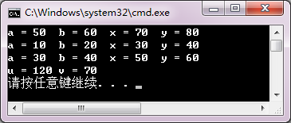

2．阅读程序，写出运行结果。

#include<iostream>

using namespace std;

class A

{  public :

A( int i, int j )   {  a=i; b=j;  }

void Add( int x, int y )   {   a += x;  b += y;   }

void show()   {   cout << "("<<a<<")\t("<<b<<")\n";   }

private :

int a, b;

};

class B : public A

{  public :

B(int i, int j, int m, int n) : A( i, j ),x( m ), y( n ) {}

void show()  {   cout << "(" << x << ")\t(" << y << ")\n";   }

void fun()  {   Add( 3, 5 );   }

void ff()  {   A::show();   }

private :

int x, y;

};

int main()

{  A a( 1, 2 );

a.show();

B b( 3, 4, 5, 6 );

b.fun();

b.A::show();

b.show();

b.ff();

}

【解答】

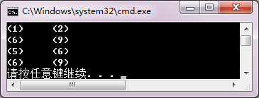

3．编写程序，定义一个Rectangle类，它包含：

数据成员	length，width

成员函数	Rectangle( double l, double w );			//构造函数

double area(); 			 						//返回矩形面积

double getlength();							//返回数据成员length的值

double getwidth();							//返回数据成员width的值

再定义Rectangle的派生类Rectangular，它包含：

数据成员	height

成员函数	Rectangular( double l, double w, double h );	//构造函数

double volume();							//返回长方体体积

double getheight();							//返回数据成员height的值

在main函数中测试类体系，建立两个类的对象，显示它们的数据和面积、体积。

【解答】

#include <iostream>

using namespace std;

class rectangle

{

public:

rectangle( double l, double w )

{ length = l; width = w; }

double area()

{  return( length*width ); }

double getlength()

{ return length; }

double getwidth()

{ return width; }

private:

double length;

double width;

};

class rectangular: public rectangle

{

public:

rectangular( double l,double w,double h ) : rectangle( l,w )

{ height = h; }

double getheight()

{ return height; }

double volume()

{ return area() *height; }

private:

double height;

};

int main()

{

rectangle obj1( 2,8 );

rectangular obj2( 3,4,5 );

cout<<"length="<<obj1.getlength()<<'\t'<<"width="<<obj1.getwidth()<<endl;

cout<<"rectanglearea="<<obj1.area()<<endl;

cout<<"length="<<obj2.getlength()<<'\t'<<"width="<<obj2.getwidth();

cout<<'\t'<<"height="<<obj2.getheight()<<endl;

cout<<"rectangularvolume="<<obj2.volume()<<endl;

}

**同步练习8.3**

### **一、选择题**

1．在C++中，可以被派生类继承的函数是（    ）。

（A）成员函数		（B）构造函数		（C）析构函数		（D）友元函数

2．下列关于派生类对象的初始化，叙述正确的是（    ）。

（A）是由派生类的构造函数实现的

（B）是由基类的构造函数实现的

（C）是由基类和派生类的构造函数实现的

（D）是系统自动完成的，不需要程序设计者干预

3．在创建派生类对象时，构造函数的执行顺序是（    ）。

（A）对象成员构造函数—基类构造函数—派生类本身的构造函数

（B）派生类本身的构造函数—基类构造函数—对象成员构造函数

（C）基类构造函数—派生类本身的构造函数—对象成员构造函数

（D）基类构造函数—对象成员构造函数—派生类本身的构造函数

4．在具有继承关系的类层次体系中，析构函数执行的顺序是（    ）。

（A）对象成员析构函数—基类析构函数—派生类本身的析构函数

（B）派生类本身的析构函数—对象成员析构函数—基类析构函数

（C）基类析构函数—派生类本身的析构函数—对象成员析构函数

（D）基类析构函数—对象成员析构函数—派生类本身的析构函数

5．在创建派生类对象时，类层次中构造函数的执行顺序是由（    ）。

（A）派生类的参数初始式列表的顺序决定的		（B）系统规定的

（C）是由类的书写顺序决定的				（D）是任意的

【解答】		A	C	D	B	B

### **二、程序练习**

1．阅读程序，写出运行结果。

#include<iostream>

using namespace std;

class Base1

{  public :

Base1( int i )

{   cout << "调用基类Base1的构造函数:" << i << endl;   }

};

class Base2

{  public:

Base2( int j )

{   cout << "调用基类Base2的构造函数:" << j << endl;   }

};

class A : public Base1, public Base2

{  public :

A( int a,int b,int c,int d ):Base2(b),Base1(c),b2(a),b1(d)

{   cout << "调用派生类A的构造函数:" << a+b+c+d << endl;   }

private :

Base1 b1;

Base2 b2;

};

int main()

{  A obj( 1, 2, 3, 4 );

}

【解答】

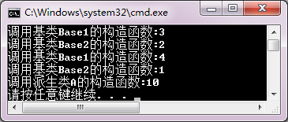

2．编写程序。已知有一个描述个人信息的Person类，数据成员记录个人姓名name和身份证号idNumber；成员函数print输出个人信息，构造函数完成对数据成员的初始化。请根据Person类和main函数运行结果，补充定义Person类的派生类Teacher类，除了记录教师的姓名和身份证号，还须记录职称title和工资wage；成员函数print输出教师个人信息，构造函数完成对数据成员的初始化。

#include <iostream>

#include<string>

using namespace std;

class Person

{  private:

string name;					//姓名

string idNumber;		//身份证号

public:

Person( const char *n, const char *i)

{  name = n;

idNumber = i;

}

void Print() const

{  cout<<"Name: "<<name<<"\n\tidNumber: "<<idNumber<<endl;

}

};

//此处定义Teacher类

int main()

{   Person p("张少华", "420106196611070538");

Teacher t("李若山", "420106195801247168", "教授", 5000);

p.Print();

t.Print();

}

程序运行结果：

Name：张少华

idNumber：420106196611070538

Name：李若山

idNumber：420106195801247168

Title：教授		Wage：5000

【解答】

#include <iostream>

#include<string>

using namespace std;

class Person

{

private:

string name;		//姓名

string idNumber;	//身份证号

public:

Person( const char *n, const char *i)

{

name = n;

idNumber = i;

}

void Print() const

{		 cout<<"Name: "<<name<<"\n\tidNumber: "<<idNumber<<endl;

}

};

//定义Teacher类

class Teacher : public Person

{

private:

string title;		//职称

double wage;		//工资

public:

Teacher( const char *n, const char *i, const char *t, double w)

: Person(n, i)

{

title = t; wage = w;

}

void Print() const

{

Person::Print();

cout<<"\tTitle: "<<title<<"\tWage: "<<wage<<endl;

}

};

int main()

{

Person p("张少华", "420106196611070538");

Teacher t("李若山", "420106195801247168", "教授", 5000);

p.Print();

t.Print();

}

**同步练习8.5**

### **一、选择题**

1．当不同的类具有相同的间接基类时，（    ）。

（A）各派生类无法按继承路线产生自己的基类版本

（B）为了建立唯一的间接基类版本，应该声明间接基类为虚基类

（C）为了建立唯一的间接基类版本，应该声明派生类虚继承基类

（D）一旦声明虚继承，基类的性质就改变了，不能再定义新的派生类

2．下列关于多继承的描述，错误的是（     ）。

（A）一个派生类对象可以拥有多个直接或间接基类的成员

（B）在多继承时不同的基类可以有同名成员

（C）对于不同基类的同名成员，派生类对象访问它们时不会出现二义性

（D）对于不同基类的不同名成员，派生类对象访问它们时不会出现二义性

3．下面关于基类和派生类的描述，正确的是（     ）。

（A）一个类可以被多次说明为一个派生类的直接基类，可以不止一次地成为间接基类

（B）一个类不能被多次说明为一个派生类的直接基类，可以不止一次地成为间接基类

（C）一个类不能被多次说明为一个派生类的直接基类，且只能成为一次间接基类

（D）一个类可以被多次说明为一个派生类的直接基类，但只能成为一次间接基类

4．下列关于虚继承的说明形式的描述，正确的是（     ）。

（A）在派生类类名前添加关键字virtual				（B）在基类类名前添加关键字virtual

（C）在基类类名后添加关键字virtual

（D）在派生类类名后，类继承的关键字之前添加关键字virtual

5．设置虚基类的目的是（     ）。

（A）简化程序		（B）消除二义性		（C）提高运行效率	（D）减少目标代码

【解答】	C	C	B	D	B

### **二、程序练习**

1．阅读程序，写出运行结果。

#include<iostream>

using namespace std;

class A

{  public :

A(const char *s)  {   cout << s << endl;   }

~A() {}

};

class B : virtual public A

{  public :

B(const char *s1, const char *s2) : A( s1 )   {   cout << s2 << endl;   }

};

class C : virtual public A

{  public :

C(const char *s1, const char *s2):A(s1)   {   cout << s2 << endl;   }

};

class D : public B, public C

{  public :

D( const char *s1,const char *s2,const char *s3,const char *s4 ):

B( s1, s2 ), C( s1, s3 ), A( s1 )

{   cout << s4 << endl;   }

};

int main()

{  D *ptr = new D( "class A", "class B", "class C", "class D" );

delete ptr;

}

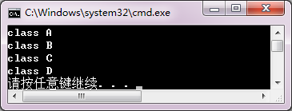【解答】

**综合练习**

### **一、思考题**

1．函数和类这两种程序模块都可以实现软件重用，它们之间有什么区别？

【解答】

函数是基于参数集的功能抽象模块，以调用方式实现软件重用，函数之间没有逻辑关系。

类是数据属性与操作的封装，以继承方式实现软件重用，类之间构成有向无回图的类格。

2．按照类成员的访问特性、类层次的继承特点，制作一张表格，总结各种类成员在基类、派生类中的可见性和作用域。

【解答】

<table>
<tr><td>基类成员 派生类继承</td><td>public</td><td>protected</td><td>private</td></tr>
<tr><td>public</td><td>在派生类中访问特性不变。派生类和类外均可见，有作用域。</td><td>在派生类中访问特性不变。类体系中可见。</td><td>基类私有成员，仅在基类中可见。</td></tr>
<tr><td>protected</td><td>成为派生类保护段成员。在整个类体系中可见。</td><td></td></tr>
<tr><td>private</td><td>成为派生类私有成员。仅在派生类和基类中可见。</td><td></td></tr>
<tr><td></td><td>派生类不论以何种方式继承基类，基类所有成员在整个类体系有作用域。</td></tr>
</table>

3．若有以下说明语句：

class A

{  private : int a1;

public : int a2; double x;

/*…*/

};

class B : private A

{  private : int b1;

public  :  int b2;  double x;

/*…*/

};

B b;

对象b将会生成什么数据成员？与继承关系、访问特性、名字有关吗？

【解答】

对象b生成的数据成员有a1 a2 A::x b1 b2 B::x，共六个数据成员。数据成员的建立和继承关系、访问特性、名字无关。

4．若有以下说明语句：

class A

{  /*…*/

public : void sameFun();

};

class B : public A

{  /*…*/

public : void sameFun();

};

void comFun()

{  A a;

B b;

/*…*/

}

（1）若在B::sameFun中调用A::sameFun，语句格式如何？它将在什么对象上操作？

（2）在comFun中可以用什么方式调用A::sameFun和B::sameFun？语句格式如何？它们将可以在什么对象上操作？

【解答】

（1）若要在B::sameFun中调用A::sameFun，语句形式应为：

A::samefun();		//域作用符说明调用基类函数

调用的A::samefun将在B类对象上进行操作。

（2）在comFun中调用B::sameFun和A::sameFun的方式有：

a.A::sameFun();		//通过A类对象调用A::sameFun，在a类对象上操作

b.sameFun();		//通过B类对象调用B::sameFun，在b类对象上操作

b.A::sameFun();		//通过B类对象调用A::sameFun

//在b类对象上（对由基类继承下来的数据成员）操作

5．有人定义一个教师类派生一个学生类。他认为“姓名”和“性别”是教师、学生共有的属性，声明为public，“职称”和“工资”是教师特有的，声明为private。在学生类中定义特有的属性“班级”和“成绩”。所以有：

class teacher

{  public:

char name[20];  char sex;

//…

private:

char title[20]; double salary;

};

class student : public teacher

{  //…

private:

char grade[20]; int score;

};

你认为这样定义合适吗？请给出你认为合理的类结构定义。

【解答】

不合适，这样导致数据冗余。合理的结构是提取它们共有的数据和操作定义一个基类，然后分别定义teacher和student作为派生类。

class person

{ protected:

char name[20];  char sex;

//……

};

class teacher : public teache

{ //……

private:

char title[20]; double salary;

};

class student : public teacher

{ //……

private :

char grade[20] ; int score;

};

6．在第6章的例6-21中，定义Student类包含了Date类成员。可以用继承方式把Student类定义为Date类的派生类吗？如何改写程序？请你试一试。

【解答】

可以用继承方式改写。程序略。

7．“虚基类”是通过什么方式定义的？如果类A有派生类B、C，类A是类B虚基类，那么它也一定是类C的虚基类吗？为什么？

【解答】

虚基类是在声明派生类时，指定继承方式时声明的，声明虚基类的一般形式为：

class  派生类名 ：  virtual  继承方式 基类名

若类A是类B和类C的虚基类，但不一定是类D的虚基类，原因在于“虚基类”中的“虚”不是基类本身的性质。而是派生类在继承过程中的特性。关键字virtual只是说明该派生类把基类当作虚基类继承，不能说明基类其他派生类继承基类的方式

8．在具有虚继承的类体系中，建立派生类对象时，以什么顺序调用构造函数？请用简单程序验证你的分析。

【解答】

在具有虚继承的类体系中，建立派生类对象时先调用间接基类构造函数，再按照派生类定义时各个直接基类继承的顺序调用直接基类的构造函数，最后再对派生类对象自身构造函数。

另外，C++为了保证虚基类构造函数只被建立对象的类执行一次，规定在创建对象的派生类构造函数中只调用虚基类的构造函数和进行(执行)自身的初始化。参数表中的其他调用被忽略，即直接基类的构造函数只调用系统自带的版本，或调用自定义版本但不对虚基类数据成员初始化。

程序略。

### **二、程序设计**

1．假设某销售公司有一般员工、销售员工和销售经理。月工资的计算办法是：

一般员工月薪=基本工资；

销售员工月薪=基本工资+销售额*提成率；

销售经理月薪=基本工资+职务工资+销售额*提成率。

编写程序，定义一个表示一般员工的基类Employee，它包含三个表示员工基本信息的数据成员：编号number、姓名name和基本工资basicSalary。

由Employee类派生销售员工Salesman类，Salesman类包含两个新数据成员：销售额sales和静态数据成员提成比例commrate。

再由Salesman类派生表示销售经理的Salesmanager类。Salesmanager类包含新数据成员：岗位工资jobSalary。

为这些类定义初始化数据的构造函数，以及输入数据input、计算工资pay和输出工资条print的成员函数。

设公司员工的基本工资是2000元，销售经理的岗位工资是3000元，提成率=5/1000。在main函数中，输入若干个不同类型的员工信息测试你的类结构。

【解答】

#include <iostream>

using namespace std;

class Employee

{

public:

Employee( char Snumber[]="\0", char Sname[]="\0", double bSalary=2000 )

{

strcpy_s(number,Snumber);

strcpy_s(name,Sname);

basicSalary=bSalary;

}

void input()

{

cout << "编号：" ;	cin >> number;

cout <<"姓名：" ;	cin >> name;

}

void print()

{

cout<<"员工 ："<<name<<"\t\t编号："<<number<<"\t\t本月工资："<<basicSalary<<endl;

}

protected:

char number[5];

char name[10];

double basicSalary;

};

class Salesman: public Employee

{

public:

Salesman(int sal=0)

{ sales=sal; }

void input()

{

Employee::input();

cout<<"本月个人销售额：";

cin>>sales;

}

void pay()

{

salary = basicSalary+sales*commrate;

}

void print()

{

pay();

cout<<"销售员 ："<<name<<"\t\t编号："<<number<<"\t\t本月工资："<<salary<<endl;	         	}

protected:

static double commrate;

int sales;

double salary;

};

double Salesman :: commrate=0.005;

class Salesmanager : public Salesman

{

public:

Salesmanager(double jSalary=3000)

{

jobSalary = jSalary;

}

void input()

{

Employee::input();

cout<<"本月部门销售额：";

cin>>sales;

}

void pay()

{

salary = jobSalary + sales*commrate;

}

void print()

{

pay();

cout<<"销售经理 ："<<name<<"\t\t编号："<<number<<"\t\t本月工资："<<salary<<endl;	         }

private:

double jobSalary;

};

int main()

{

cout<<"基本员工\n";

Employee emp1;

emp1.input();

emp1.print();

cout<<"销售员\n";

Salesman emp2;

emp2.input();

emp2.print();

cout<<"销售经理\n";

Salesmanager emp3;

emp3.input();

emp3.print();

}

2．试写出你所能想到的所有形状（包括二维的和三维的），生成一个形状层次类体系。生成的类体系以Shape作为基类，并由此派生出TwoDimShape类和ThreeDimShape类。它们的派生类是不同的形状类。定义类体系中的每个类，并用main函数进行测试。

【解答】

略。

3．为第7章综合练习的程序设计第1题和第2题中的Integer类和Real类定义一个派生类IntReal：

class IntReal : public Integer, public Real;

使其可以进行+、-、*、/、=  的左、右操作数类型不同的相容运算，并符合原有运算类型转换的语义规则。

【解答】

略。

4．使用Integer类，定义派生类Vector类：

class Integer

{  //…

protected :

int n;

};

class Vector:public Integer

{  //…

protected :

int *v;

};

其中，数据成员v用于建立向量，n为向量长度。要求：类的成员函数可以实现向量的基本算术运算。

【解答】

略。

5．用包含方式改写第4题中的Vector类，使其实现相同的功能。

class Vector

{  //…

protected :

Integer *v;

Integer size;

};

【解答】

略。

6．使用第5题定义的Vector类，定义它的派生类Matrix，实现矩阵的基本算术运算。

【解答】

略。

7．用包含方式改写第6题的Matrix类，使其实现相同的功能。

【解答】

略。

8．设计快捷店会员的简单管理程序。基本要求如下：

（1）定义人民币RMB类，实现人民币的基本运算和显示。

（2）定义会员member类，表示会员的基本信息，包括：编号（按建立会员的顺序自动生成），姓名，密码，电话。提供输入、输出信息等功能。

（3）由RMB类和member类共同派生一个会员卡memberCar类，提供新建会员、充值、消费和查询余额等功能。

（4）main函数定义一个memberCar类数组或链表，保存会员卡，模拟一个快捷店的会员卡管理功能，主要包括：

①  新建会员；

②  已有会员充值；

③  已有会员消费（凭密码，不能透支）；

④  输出快捷店当前会员数，营业额（收、支情况）。

【解答】

略。

## 第9章练习题

**同步练习9.2**

### **一、选择题**

1．静态联编又叫作（    ）。

（A）延迟联编		（B）早期联编		（C）晚期联编		（D）以上三者都行

2．基类的指针与派生类指针，可以分别指向基类对象或派生类对象而形成4种情形。在这4种情形中，需要进行强制类型转换的是（    ）。

（A）基类指针指向基类对象		（B）基类指针指向派生类对象

（C）派生类指针指向基类对象	（D）派生类指针指向派生类对象

3．当基类指针指向派生类对象时，（    ）。

（A）发生语法错误

（B）只能调用基类自己定义的成员函数

（C）可以调用派生类的全部成员函数

（D）以上说法全部错误

4．当基类指针指向派生类对象时，利用基类指针调用派生类中与基类同名但被派生类重写后的成员函数时，调用的是（    ）。

（A）基类的成员函数			（B）派生类的成员函数

（C）不确定					（D）先调用基类的，再调用派生类的

5.  当派生类指针指向基类对象时（    ）。

（A）可以直接调用基类的成员函数

（B）可以调用派生类对象的成员函数

（C）必须强制将派生类指针转换成基类指针才能调用基类的成员函数

（D）以上说法都不对

【解答】		B	C	B	A	C

### **二、程序练习**

写出下列程序的运行结果。

#include <iostream>

using namespace std;

class Bclass

{  public:

Bclass( int i, int j ) { x = i; y = j; }

int fun() { return 0; }

protected:		int x, y;

};

class Iclass: public Bclass

{	public :

Iclass(int i, int j, int k):Bclass(i, j) { z = k; }

int fun() { return ( x + y + z ) / 3; }

private :	int z;

};

int main()

{	Iclass obj( 2, 4, 10 );

Bclass p1 = obj;

cout << p1.fun() << endl;

Bclass &p2 = obj;

cout << p2.fun() << endl;

cout << obj.fun() << endl;

Iclass *p3 = &obj;

cout << p3-> fun() << endl;

}

【解答】

**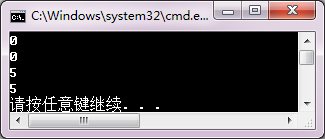**

**同步练习9.3**

### **一、选择题**

1.  在C++中，要实现动态联编，必须使用（    ）调用虚函数。

（A）基类指针		（B）对象名		（C）派生类指针	（D）类名

2.  下列函数中，不能说明为虚函数的是（    ）。

（A）析构函数		（B）构造函数		（C）公有成员函数	（D）私有成员函数

3.  在派生类中，重载一个虚函数时，要求函数名、参数的个数、参数的类型、参数的顺序和函数的返回值(    )。

（A）部分相同		（B）相容		（C）不同		（D）相同

4.  下面关于构造函数和析构函数的描述，错误的是（    ）。

（A）析构函数中调用虚函数采用静态联编

（B）对虚析构函数的调用可以采用动态联编

（C）当基类的析构函数是虚函数时，其派生类的析构函数也一定是虚函数

（D）构造函数可以声明为虚函数

5.  在C++中，根据（    ）识别类层次中不同类定义的虚函数版本。

（A）参数个数		（B）参数类型		（C）函数名		（D）this指针类型

6.  虚析构函数的作用是（    ）。

（A）虚基类必须定义虚析构函数	（B）类对象作用域结束时释放资源

（C）delete动态对象时释放资源	（D）无意义

【解答】	A	B	D	D	D	C

### **二、程序练习**

阅读程序，写出运行结果。

#include <iostream>

using namespace std;

class Bclass

{	public:

Bclass( int i, int j ) { x = i; y = j; }

int fun() { return 0; }

protected:	int x, y;

};

class Iclass: public Bclass

{	public :

Iclass(int i, int j, int k):Bclass(i, j) { z = k; }

int fun() { return ( x + y + z ) / 3; }

private :	int z;

};

int main()

{	Iclass obj( 2, 4, 10 );

Bclass p1 = obj;

cout << p1.fun() << endl;

Bclass &p2 = obj;

cout << p2.fun() << endl;

cout << obj.fun() << endl;

Iclass *p3 = &obj;

cout << p3-> fun() << endl;

}

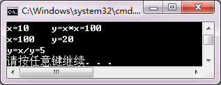【解答】

**同步练习9.4**

1.  在下面函数原型中，（    ）声明了fun为纯虚函数。

（A）void fun()=0;					（B）virtual void fun()=0;

（C）virtual void fun();				（D）virtual void fun(){ };

2.  若一个类中含有纯虚函数，则该类称为（    ）。

（A）基类		（B）纯基类		（C）抽象类		（D）派生类

3.  假设Aclass为抽象类，下列正确的说明语句是（    ）。

（A）Aclass fun( int ) ;				（B）Aclass * p ;

（C）int fun( Aclass ) ;						（D）AclassObj ;

4.  下面描述中，正确的是（    ）。

（A）虚函数是没有实现的函数		（B）纯虚函数是返回值等于0的函数

（C）抽象类是只有纯虚函数的类		（D）抽象类指针可以指向不同的派生类

5.  异质链表是（    ）。

（A）用数组组织类对象			（B）用链表组织类对象

（C）用抽象类指针指向派生类对象	（D）用抽象类指针构造派生类对象链表

【解答】		B	C	B	D	D

**综合练习**

### **一、思考题**

1．在C++中，使用类体系依靠什么机制实现程序运行时的多态？

【解答】

在C++中，基类指针可以指向派生类对象，以及基类中拥有虚函数，是支持多态性的前提。程序通过用同一个基类指针访问不同派生类的虚函数重载版本实现程序运行时的多态。C++的虚特性负责自动地在程序运行时把基类指针的关联类型转换成当前指向对象的派生类类型。

另外，抽象类机制提供了软件抽象和可扩展性的手段，实现运行时的多态性。

2．如果一个类的虚函数被声明为私有成员函数，会有语法错误吗？当它作为基类时，可以在应用类体系时实现动态联编吗？请验证一下。

【解答】

没有语法错误。但在应用类体系时无法实现动态编联和多态。因为私有成员函数只在类内可见，在类外无法调用，无法在类外通过基类指针实现多态。

程序略。

3．虚函数和纯虚函数的区别是什么？

【解答】

虚函数定义时冠以关键字virtual,本身有实现代码，作用是引导基类指针根据指向对象调用类体系中不同重载版本函数。

纯虚函数是指在说明时代码“为0”的虚函数，即纯虚函数本身并没有实现代码，必须通过它的派生类定义实现版本。

4．一个非抽象类的派生类是否可以为抽象类？利用例9-11进行验证，从Hex_type类派生一个Hex_format类，其中包含一个纯虚函数Show_format，然后定义Hex_format的派生类定义实现Show_format。

【解答】

一个非抽象类的派生类可以为抽象类，即在派生类中定义了纯虚函数。

程序略。

### **二、程序设计**

1．使用虚函数编写程序，求球体和圆柱体的体积及表面积。由于球体和圆柱体都可以看作由圆继承而来，因此，可以把圆类CIRCLE作为基类。在CIRCLE类中定义一个数据成员radius及两个虚函数area和volume。由CIRCLE类派生SPHERE类和COLUMN类。在派生类中对虚函数area和volume重新定义，分别求球体和圆柱体的体积及表面积。

【解答】

#include <iostream>

using namespace std;

const double PI=3.14159265;

class CIRCLE

{

public:

CIRCLE(double r) { radius = r; }

virtual double area() { return 0.0; }

virtual double volume() { return 0.0; }

protected:

double radius;

};

class SPHERE:public CIRCLE

{

public:

SPHERE( double r ):CIRCLE( r ){}

double area()

{ return 4.0 * PI * radius * radius; }

double volume()

{ return 4.0 * PI * radius * radius * radius / 3.0; }

};

class COLUMN:public CIRCLE

{

public:

COLUMN( double r,double h ):CIRCLE( r ) { height = h; }

double area()

{ return 2.0 * PI * radius * ( height + radius ); }

double volume()

{ return PI * radius * radius * height;	}

private:

double height;

};

int main()

{

CIRCLE *p;

SPHERE sobj(2);

p = &sobj;

cout << "球体:" << endl;

cout << "体积  = " << p->volume() << endl;

cout << "表面积  = " << p->area() << endl;

COLUMN cobj( 3,5 );

p = &cobj;

cout << "圆柱体:" << endl;

cout << "体积  = " << p->volume() << endl;

cout << "表面积  = " << p->area() << endl;

}

2．某学校教职工的工资计算方法为：

	所有教职工都有基本工资。

	教师月工资为固定工资+课时补贴，课时补贴根据职称和课时计算。例如，每课时教授补贴50元，副教授补贴30元，讲师补贴20元。

	管理人员月薪为基本工资+职务工资。

	实验室人员月薪为基本工资+工作日补贴，工作日补贴等于日补贴×月工作日数。

定义教职工抽象类，派生教师类、管理人员类和实验室类，编写程序测试这个类体系。

【解答】

#include <iostream>

using namespace std;

class staff

{

public:

staff ( double bSalary)

{

basicSalary=bSalary;

}

virtual void input() = 0;

virtual void output() = 0;

protected:

char name[30];

double basicSalary;

};

class teacher : public staff

{

public:

teacher( int basicsalary=3000 ) : staff( basicsalary ){ }

void input()

{

cout<<"姓名？";

cin>>name;

cout<<"职称        1，教授        2，副教授        3，讲师   （输入1，2  或  3）：";

cin>>title;

cout<<"课时?";

cin>>coursetime;

}

void output()

{

double salary;

switch(title)

{

case 1:   salary = basicSalary+coursetime *50;  break;

case 2:   salary=basicSalary+coursetime*30;  break;

case 3:   salary=basicSalary+coursetime*20;

}

cout<<"姓名："<<name<<"\t本月工资："<<salary<<endl;

}

protected:

int coursetime;

int title;

};

class manage : public staff

{

public:

manage( int basicsalary=2500 ) : staff( basicsalary ){ }

void input()

{

cout<<"姓名？";

cin>>name;

cout<<"职务工资？  ";

cin>>jobSalary;

}

void output()

{

double salary;

salary = basicSalary+jobSalary;

cout<<"姓名："<<name<<"\t本月工资："<<salary<<endl;

}

protected:

double jobSalary;

};

class technician : public staff

{

public:

technician( int basicsalary=2000 ) : staff( basicsalary ){ }

void input()

{

cout<<"姓名？";

cin>>name;

cout<<"工作日？";

cin>>workdays;

}

void output()

{

double salary;

salary = basicSalary+workdays*20;

cout<<"姓名："<<name<<"\t本月工资："<<salary<<endl;

}

protected:

int workdays;

};

int main()

{

teacher t;

t.input();

t.output();

manage m;

m.input();

m.output();

technician h;

h.input();

h.output();

}

3．使用第2题中定义的教师类体系，编写程序，输入某月各种职称教师的工资信息，建立异质链表，输出每位教师的工资条，统计当月的总工资、平均工资、最高工资和最低工资。

【解答】

略

4．改写第8章综合练习第2题的程序，把Shape类定义为抽象类，提供共同操作界面的纯虚函数。TwoDimShape类和ThreeDimShape类仍然是抽象类，只有第3层具体类才提供全部函数的实现。在测试函数中，使用基类指针实现不同派生类对象的操作。

【解答】

略

## 第10章练习题

**同步练习10.2**

### **一、选择题**

1．关于函数模板，描述错误的是（    ）。

（A）函数模板必须由程序员实例化为可执行的函数模板

（B）函数模板的实例化由编译器实现

（C）一个类定义中，只要有一个函数模板，这个类就是类模板

（D）类模板的成员函数都是函数模板，类模板实例化后，成员函数也随之实例化

2．在下列模板说明中，正确的是（    ）。

（A）template <typename T1, T2 >						（B）template < class T1, T2 >

（C）template <typename T1, typename T2 >		（D）template ( typedef T1, typedef T2 )

3．假设有函数模板定义如下，则下列选项正确的是（    ）。

template <typename T>

Max( T a, T b ,T &c)

{   c = a + b;   }

（A）int x, y; char z; Max( x, y, z );					（B）double x, y, z; Max( x, y, z );

（C）int x, y; float z; Max( x, y, z );					（D）float x; double y, z; Max( x, y, z );

4．有以下模板说明，则T在函数模板中（    ）。

template<typename T>

（A）可以作为返回类型、参数类型和函数中的变量类型

（B）只能作为函数返回类型

（C）只能作为函数参数类型

（D）只能用于函数中的变量类型

5.  关于函数模板的同名函数重载，叙述正确的是（    ）。

（A）函数模板由调用自行实例化，不可以定义重载版本

（B）函数模板可以用不同类型，不同个数的参数重载

（C）函数模板只能用其他类属参数重载

（D）函数模板只能用参数个数相同参数重载

【解答】		A	C	B	A	B

### **二、程序练习**

1．阅读程序，写出运行结果。

#include <iostream>

using namespace std;

template <typename T>

void fun( T &x, T &y )

{  T temp;

temp = x;  x = y;  y = temp;

}

int main()

{   int i , j;

i = 10; j = 20;

fun( i, j );

cout << "i = " << i << '\t' << "j = " << j << endl;

double a , b;

a = 1.1; b = 2.2;

fun( a, b );

cout << "a = " << a << '\t' << "b = " << b << endl;

}

【解答】

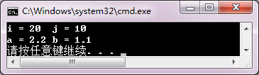

2．使用函数模板实现对不同类型数组求平均值的功能，并在main函数中分别求一个整型数组和一个浮点型数组的平均值。

【解答】

#include <iostream>

using namespace std;

template <typename T>

double average( T *array,int size )

{ T sum = 0;

for( int i=0; i<size; i++ )

sum += array[i];

return sum / size;

}

int main()

{ int a[] = { 1, 2, 3, 4, 5, 6, 7, 8, 9, 10 };

double b[] = { 1.1, 2.2, 3.3, 4.4, 5.5, 6.6, 7.7, 8.8, 9.9, 10 };

cout << "Average of array a :" << average( a,10 ) << endl;

cout << "Average of array b :" << average( b,10 ) << endl;

}

**同步练习10.3**

### **一、选择题**

1．关于类模板，描述错误的是（    ）。

（A）一个普通基类不能派生类模板

（B）类模板可以从普通类派生，也可以从类模板派生

（C）根据建立对象时的实际数据类型，编译器把类模板实例化为模板类

（D）函数的类模板参数需生成模板类并通过构造函数实例化

2．建立类模板对象的实例化过程为（    ）。

（A）基类→派生类					（B）构造函数→对象

（C）模板类→对象					（D）模板类→模板函数

3．在一个类层次结构中，（    ）。

（A）若基类是类模板，派生类必定是类模板。

（B）若基类是普通类，派生类也只能是普通类。

（C）一个普通类的派生类不能增加类属参数。

（D）一个派生类可以对作为基类的类模板提供实例化的类型参数。

4．若一个类模板定义了静态数据成员，正确的叙述的是（    ）。

（A）每一个实例化的模板类都有自己的静态数据成员副本

（B）类模板的静态数据成员在声明类模板时定义和初始化

（C）一个类模板实例化的不同模板类的全部对象共享一个静态数据成员

（D）一个类模板实例化后的每个对象都有自己的静态数据成员副本

5.  关于类模板与友元叙述错误的是（  A    ）。

（A）一般函数可以声明为类模板的友元

（B）函数模板可以声明为类模板的友元

（C）一个模板类可以声明为另一个类模板的友元

（D）一个模板类的友元只能是模板

6.  若有以下类模板声明，则正确的说明语句是（    ）。

template<typename T>

classTclass

{       int k;

public:

Tclass(int);

//…

};

（A）Tclass(double) t(10);

（B）Tclass< double > t(10);

（C）Tclass<0.5> t( 10 );

（D）Tclass t(10);

【解答】		A	C		D	D	A	B

### **二、程序练习**

1．阅读程序，写出运行结果。

#include <iostream>

using namespace std;

template <typename T>

class Base

{  public:

Base( T i , T j ) { x = i;  y = j; }

T sum() { return x + y; }

private:

T x, y;

};

int main()

{  Base<double> obj2(3.3,5.5);

cout << obj2.sum() << endl;

Base<int> obj1(3,5);

cout << obj1.sum() << endl;

}

【解答】

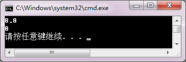

2．阅读第6章例6-6，把Location类改写为类模板，定义数据成员X、Y为类属类型参数。主函数分别用int和double类型实例化建立对象，验证类模板。

【解答】

#include <iostream>

using namespace std;

template <typename T>

class T_Location

{

public :

T_Location ( T xx = 0, T yy = 0 )

{ X = xx;  Y = yy; }

T_Location ( const T_Location  & p );

T GetX()const { return  X; }

T GetY()const { return  Y; }

private :

T X, Y;

};

template <typename T>

T_Location<T>::T_Location(const T_Location<T> & p)

{

X = p.X;

Y = p.Y;

cout << "Copy_constructor called." << endl;

}

int main()

{

T_Location <int>A(1,2);

T_Location <int>B(A);

cout << "B: " << B.GetX() << ", " << B.GetY() << endl;

T_Location <double>C(3.4,5.6);

T_Location <double>D(C);

cout << "D: " << D.GetX() << ", " << D.GetY() << endl;

}

3．把第7章综合练习的程序设计第3题的Vector类改写为模板类，使向量的数据成员为抽象类。main函数用int和double实例化，测试Vector类。

【解答】

#include <iostream>

using namespace std;

template<typename T> class Vector

{

private:

T *v;

int len;

public:

Vector(int size);

Vector(double *, int);

~Vector();

T &operator;

Vector & operator =(Vector &);

template<typename T>	friend Vector<T> operator +(Vector<T> &,Vector<T> &);

template<typename T>	friend Vector<T> operator -(Vector<T> &,Vector<T> &);

template<typename T>	friend T operator *(Vector<T> &,Vector<T> &);

template<typename T>	friend ostream & operator <<(ostream &output,Vector<T> &);

template<typename T>	friend istream & operator >>(istream &input,Vector<T> &);

};

template<typename T>Vector<T>::Vector (int size)

{

if(size<=0||size>=2147483647)

{ cout<<"The size of "<<size<<"is overflow!\n";

abort();

}

v=new double [size];

for(int i=0;i<size;i++) v[i]=0;

len=size;

}

template<typename T>Vector<T>::Vector(double *C,int size)

{

if(size<=0||size>=2147483647)

{ cout<<"The size of"<<size<<"is overflow!\n"<<endl;

abort();

}

v=new double[size];

len=size;

for(int i=0;i<len;i++) v[i]=C[i];

}

template<typename T>Vector<T>::~Vector()

{

delete []v;

v=NULL;  len=0;

}

template<typename T> T &Vector<T>::operator

{

if(i>=0 && i<len)

return v[i];

else

{ cout<<"The size of"<<i<<"is overflow!\n";

abort();

}

}

template<typename T> Vector<T> &Vector<T>::operator =(Vector<T> &C)

{

if(len==C.len)

{

for(int i=0;i<len;i++)

v[i]=C[i];

return *this;

}

else

{

cout<<"Operator = fail!\n";

abort();

}

}

template<typename T> Vector<T> operator +(Vector<T> &A,Vector<T> &B)   //向量相加

{

int size=A.len ;

T *v=new T[size];

if(size==B.len)

{

for(int i=0;i<size;i++)

v[i]=A[i]+B[i];

return Vector<T> (v,size);

}

else

{

cout<<"Operator + fail!\n";

abort();

}

}

template<typename T> Vector<T> operator -(Vector<T> &A,Vector<T> &B)  //向量相减

{

int size=A.len ;

T *v=new T[size];

if(size==B.len)

{ for(int i=0;i<size;i++)

v[i]=A[i]-B[i];

return Vector<T> (v,size);

}

else

{

cout<<"Operator - fail!\n";

abort();

}

}

template<typename T> T operator *(Vector <T>&A,Vector<T> &B)    //向量相乘

{

int size=A.len ;

double s=0;

if( size==B.len )

{

for( int i=0; i<size; i++ )

s+=A[i]*B[i];

return s;

}

else

{

cout<<"Operator * fail!\n";

abort();

}

}

template<typename T> ostream & operator <<(ostream &output,Vector<T> &A)     //输出

{

int i;

output<<'(';

for( i=0;i<A.len-1;i++)

output<<A[i]<<',';

output<<A[i]<<')';

return output;

}

template<typename T> istream & operator >>(istream &input,Vector<T> &A)     //输入

{

for(int i=0;i<A.len;i++)

input>>A[i];

return input;

}

int main()

{

int k1,k2,k3;double t;

cout<<"Input the length of Vector A:\n";

cin>>k1;

Vector<double> A(k1);

cout<<"Input the elements of Vector A:\n";

cin>>A;

cout<<"Input the length of Vector B:\n";

cin>>k2;

Vector<double> B(k2);

cout<<"Input the elements of Vector B:\n";

cin>>B;

cout<<"Input the length of Vector C:\n";

cin>>k3;

Vector<double> C(k3);

cout<<"A="<<A<<endl;

cout<<"B="<<B<<endl;

C=A+B;

cout<<"A+B="<<A<<"+"<<B<<"="<<C<<endl;

C=A-B;

cout<<"A-B="<<A<<"-"<<B<<"="<<C<<endl;

t=A*B;

cout<<"A*B="<<A<<"*"<<B<<"="<<t<<endl;

}

**综合练习**

### **一、思考题**

1．抽象类和类模板都是提供抽象的机制，请分析它们的区别和应用场合。

【解答】

抽象类至少包含一个纯虚函数，纯虚函数抽象了类体系中一些类似操作的公共界面，它不依赖于数据，也没有操作定义。派生类必须定义实现版本。抽象类用于程序开发时对功能的统一策划，利用程序运行的多态性自动匹配实行不同版本的函数。

类模板抽象了数据类型，称为类属参数。成员函数描述了类型不同，逻辑操作相同的功能集。编译器用建立对象的数据类型参数实例化为模板类，生成可运行的实体。类模板用于抽象数据对象类型不同，逻辑操作完全相同类定义。这种数据类型的推导必须在语言功能的范畴之内的。

2．类属参数可以实现类型转换吗？如果不行，应该如何处理？

【解答】

类属参数不可以实现类型转换。为了解决参数隐式类型转换的问题，可以用类型参数把函数模板重载为非模板函数。

3．类模板能够声明什么形式的友元？当类模板的友元是函数模板时，它们可以定义不同形式的类属参数吗？请编写一个验证程序试一试。

【解答】

类模板可以声明的友员形式有：普通函数、函数模板、普通类成员函数、类模板成员函数以及普通类、类模板。

当类模板的友员是函数模板时，它们可以定义不同形式的类属参数。

程序略。

4．类模板的静态数据成员可以是抽象类型吗？它们的存储空间是什么时候建立的？请用验证程序试一试。

【解答】

类模板的静态数据成员可以是抽象类型。它们的存储空间在生成具体模板类的时候建立，即每生成一个模板类同时建立静态储存空间并做一次文件范围的初始化。

程序略。

### **二、程序设计**

1．建立结点，包括一个任意类型数据域和一个指针域的单向链表类模板。在main函数中使用该类模板建立数据域为整型的单向链表，并把链表中的数据显示出来。

【解答】

#include <iostream>

using namespace std;

template <typename T>

class List

{

public:

List( T x )  { data = x; }

void append( List *node )

{

node->next = this;

next = 0;

}

List *getnext() { return next; }

T getdata() { return data; }

private:

T data;

List *next;

};

int main()

{

int i, idata, n, fdata;

cout << "输入结点的个数：";

cin >> n;

cout << "输入结点的数据域：";

cin >> fdata;

List <int> headnode( fdata );

List <int> *p, *last;

last = &headnode;

for( i=1; i<n; i++ )

{

cin >> idata;

p = new List <int>( idata );

p->append( last );

last = p;

}

cout << "链表已经建立！" << endl;

cout << "链表中的数据为：" << endl;

p = &headnode;

while( p )

{

cout << p->getdata() << endl;

p = p->getnext();

}

}

2．定义类模板T_Counter，实现基本类型数据的+、-、*、=、>>、<<  运算；类模板T_Vector，实现向量运算；类模板T_Matrix，实现矩阵运算。请分析使用类模板建立T_Counter、T_Vector、T_Matrix对象和使用类继承体系建立IntReal、Vector、Matrix对象（见第8章综合练习的程序设计第3、4、5题）的语法区别和运算功能区别。

【解答】

略。

3．学习MSDN Library中Visual C++的STL，应用容器和算法，实现一个简单的人员信息管理系统。

【解答】

略。

## 第11章练习题

**同步练习11.2**

1．在下列流类中，可以用于处理输入/输出的是（    ）。

（A）ios						（B）iostream				（C）strstream				（D）fstream

2．在下列选项中，（    ）是istream类的对象。

（A）cerr						（B）cin						（C）clog						（D）cout

3．在下列选项中，不可以作为输出流对象的是（    ）。

（A）文件			（B）内存		（C）键盘		（D）显示器

4．在下列选项中，用于处理字符串流的是（    ）。

（A）strstream				（B）ios						（C）fstream				（D）iostream

5．能够从输入流中提取指定长度的字节序列的函数是（    ）。

（A）get						（B）getline				（C）read						（D）cin

6．能够把指定长度的字节序列插入到输出流中的函数是（    ）。

（A）put						（B）write				（C）cout						（D）print

7．getline函数的功能是从输入流中读取（    ）。

（A）一个字符		（B）当前字符		（C）一行字符		（D）指定若干个字节

8．要进行文件的输出，除了包含头文件iostream外，还要包含头文件（    ）。

（A）ifstream				（B）fstream				（C）ostream				（D）cstdio

9．用标准输入流对象cin与提取操作符>>连用进行输入时，将空格与回车当作分隔符，使用（    ）成员函数进行输入时可以指定输入分隔符。

（A）get()						（B）put()				（C）read()				（D）gcount()

10．在ios类中，状态字用于记录流错误状态，其每位对应一种流的错误状态，其中（    ）表示流数据已遭到损坏。

（A）goodbit						（B）eofbit				（C）failbit				（D）badbit

【答案】		B	B	C	A	C	B	C	B	A	D

**同步练习11.3**

### **一、选择题**

1．在下列选项中，用于清除基数格式位设置以十六进制数输出的语句是（    ）。

（A）cout<<setf( ios::dec, ios::basefield );

（B）cout<<setf( ios::hex, ios::basefield );

（C）cout<<setf( ios::oct, ios::basefield );

（D）cin>>setf( ios::hex, ios::basefield );

2．下列格式控制符，既可以用于输入，又可以用于输出的是（    ）。

（A）setbase						（B）setfill				（C）setprecision				（D）setw

3．若在I/O流的输出中使用控制符setfill()设置填充字符，应包括的头文件是（    ）。

（A）stdlib.h						（B）iostream.h		（C）fstream.h						（D）iomanip.h

4．以下语句的输出结果是（    C    ）。

cout<<setw(3)<<25<<oct<<25<<hex<<endl;

（A）25 25						（B） 2531				（C）31 19						（D）25 31

5．以下语句的输出结果是（    ）。

cout<<setfill('*')<<setw(10)<< "Hello!"<<endl;

（A）****Hello!				（B）Hello!****		（C）  Hello!						（D）Hello!

6．以下语句的输出结果是（    ）。

cout.fill('*');  cout.width(10);  cout<<setiosflags(ios::left)<<123.45<<endl;

（A）****123.45								（B）**123.45**

（C）123.45****								（D）***123.45*

【答案】		B		A	D		C		A	C

### **二、程序练习**

阅读程序，写出运行结果。

1．  #include<iostream>

#include<iomanip>

using namespace std;

void main()

{  double x=123.456;

cout.width (10);

cout.setf(ios::dec,ios::basefield);

cout<<x<<endl;

cout.setf(ios::left);

cout<<x<<endl;

cout.width(15);

cout.setf(ios::right, ios::left);

cout<<x<<endl;

cout.setf(ios::showpos);

cout<<x<<endl;

cout<<-x<<endl;

cout.setf(ios::scientific);

cout<<x<<endl;

}

【解答】

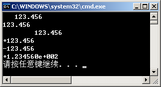

2．    #include<iostream>

#include<iomanip>

using namespace std;

void main()

{  double x=123.45678;

cout.width (10);

cout<<"#";

cout<<x<<endl;

cout.precision(5);

cout<<x<<endl;

cout.setf(ios::showpos);

cout<<x<<endl;

cout.setf(ios::scientific);

cout<<x<<endl;

}

【解答】

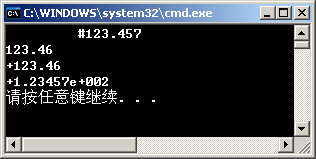

3．    #include<iostream>

#include<iomanip>

using namespace std;

void main()

{  double x=123.456789;

cout<<setiosflags(ios::fixed|ios::showpos)<<x<<endl;

cout<<setw(12)<<setiosflags(ios::right);

cout<<setprecision(3)<< -x<<endl;

cout<<resetiosflags(ios::fixed|ios::showpos)<<setiosflags(ios::scientific);

cout<<setprecision(5)<<x<<endl;

}

【解答】

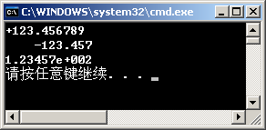

**同步练习11.4**

1．使用串流类需要包含（    ）头文件。

（A）iostream				（B）iomanip				（C）fstream						（D）strstream

2．串流在提取数据时，对字符串按（    ）解释。

（A）整型数据		（B）浮点型数据	（C）变量类型			（D）ASC码

3．串流在插入数据时，把各种类型数据转换成（    ）。

（A）二进制码		（B）十进制码		（C）格式化ASC码		（D）计算结果

【解答】		D	C	C

**同步练习11.5**

### **一、选择题**

1．在下列流类中，可以用于处理文件的是（    ）。

（A）ios						（B）iostream				（C）strstream						（D）fstream

2．在文件操作中，表示以追加方式打开文件的模式是（    ）。

（A）iso::ate						（B）iso::app				（C）iso::out						（D）iso::trunc

3．下列打开文件的语句中，（    ）是错误的。

（A）ofstream ofile; ofile.open("abc.txt",ios::binary);

（B）fstream iofile; iofile.open("abc.txt",ios::ate);

（C）ifstream ifile("abc.txt");

（D）cout.open("abc.txt",ios::binary);

4．以下关于文件操作的叙述中，不正确的是（    ）。

（A）打开文件的目的是使文件对象与磁盘文件建立联系

（B）文件的读写过程中，程序将直接与磁盘文件进行数据交换

（C）关闭文件的目的之一是保证输出的数据写入硬盘文件中

（D）关闭文件的目的之一是释放内存中的文件对象

5．以下不能正确创建输出文件对象并使其与磁盘文件相关联的语句是（    ）。

（A）ofstream myfile; myfile.open("d:ofile.txt");

（B）ofstream *myfile=new ofstream; myfile->open("d:ofile.txt");

（C）ofstream myfile("d:ofile.txt");

（D）ofstream *myfile=new ("d:ofile.txt");

6．要打开文件 D:\file.dat，并能够写入数据，正确的语句是（    ）。

（A）ifstream infile("D:\\file.dat", ios::in );

（B）ifstream infile("D:\\file.dat", ios::out );

（D）ofstream outfile("D:\\file.dat", ios::in );

（D）fstream infile("D:\\file.dat", ios::in|ios::out );

7．能实现删除文件功能的语句是（    ）。

（A）ofstream fs("date.dat", ios::trunc );		（B）ifstream fs("date.dat", ios::trunc );

（C）ofstream fs("date.dat", ios::out );		（D）ifstream fs("date.dat", ios::in );

8.  设已定义浮点型变量data，以二进制代码方式把data的值写入输出文件流对象outfile中，正确的语句是（    ）。

（A）outfile.write((double  ) &data, sizeof(double));

（B）outfile.write((double  ) &data, data);

（C）outfile.write((char  ) &data, sizeof(double));

（D）outfile.write((char  ) &data, data);

9．把二进制数据文件流fdat的读指针移到文件头的语句是（    ）。

（A）fdat.seekg( 0, ios::beg);						（B）fdat.tellg( 0, ios::beg );

（D）fdat.seekp( 0, ios::beg);						（D）fdat.tellp( 0, ios::beg );

【解答】		D	B	C	B	D	D	A	C	A

### **二、程序练习**

1．阅读以下程序，写出文件D:\f1.txt中的内容和屏幕显示的结果。

#include<iostream>

#include<fstream>

using namespace std;

int main()

{   int i;

ofstream ftxt1;

ftxt1.open( "D:\\f1.txt", ios::out );

for( i=1; i<10; i++ )

ftxt1<<i<<' ';

ftxt1.close();

ifstream ftxt2;

ftxt2.open( "D:\\f1.txt", ios::in );

while( !ftxt2.eof() )

{   ftxt2>>i>>i;

cout<<i<<endl;

}

}

【解答】

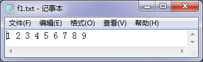D:\f1.txt：

屏幕显示：

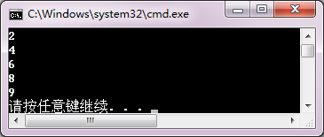

2．以下程序使用了第1题中生成的文件D:\f1.txt。写出程序运行后屏幕显示的结果。

#include<iostream>

#include<fstream>

using namespace std;

int main()

{   int i;

ifstream f1( "D:\\f1.txt", ios::in );

fstream f2;

f2.open( "D:\\f2.dat", ios::out|ios::binary );

while(!f1.eof())

{   f1>>i;

i = i*5;

f2.write( ( char* ) &i, sizeof( int ) );

}

f1.close();

f2.close();

f2.open( "D:\\f2.dat", ios::in|ios::binary );

do

{   f2.read( ( char* ) &i, sizeof( int ) );

cout<<i<<"  ";

}while( i<30 );

cout<<endl;

f2.close();

}

【解答】

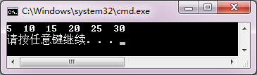

3.  建立一个文本文件，从键盘输入一篇短文存放在文件中。短文由若干行构成，每行不超过80个字符。

【解答】

#include <iostream>

#include <fstream>

using namespace std;

int main()

{

char filename[20];

char s;

int i=0;

fstream outfile;

cout << "Please input the name of file :\n";

cin >> filename ;

outfile.open( filename, ios::out );

if ( !outfile )

{

cout << "File could not be open." << endl;

abort();

}

cout<<"Please input your text (Enter Ctrl-Z to end input) :\n";

cin.get(s);		//略去输入文件名后的换行符

while(cin.get(s))

{

if(s=='\n') i=0;

else i++;

outfile.put(s);

if(i==80&&s!='\n')

{

outfile.put('\n');

i=0;

}

}

outfile.close();

cout<<"the file is created!\n";

}

4．读出由第3题建立的文本文件，显示在屏幕上并统计该文件的行数。

【解答】

#include <iostream>

#include <fstream>

using namespace std;

int main()

{

char filename[20];

fstream infile;

cout << "Please input the name of file :\n";

cin >> filename ;

infile.open( filename, ios::in );

if ( !infile )

{

cerr << "File could not be open." << endl;

abort();

}

char textline[80];

int i = 0;

while ( !infile.eof() )

{

infile.getline( textline,sizeof( textline ));

cout << textline << endl;

++i;

}

infile.close();

cout << "i=" << i << endl;

}

5．阅读以下程序。修改RandAry函数，把生成数据写入二进制文件D:\rand.dat中；修改OutAll函数，从二进制文件D:\rand.dat中读出全部数据，以每行10个数据的格式显示在屏幕上。

#include<iostream>

#include <cstdlib>

#include<ctime>

using namespace std;

void RandAry(int ary[], int n, int min, int max);//生成随机数序列

void OutAll(int ary[], int n);

int main()

{   const int N=50;

int ary[N];

cout<<"生成50个1～100之间的整数:\n";

RandAry(ary, N, 1, 100);				//生成N个1～100之间的整数放在数组ary中

OutAll(ary,N);								//输出数组全部原始数据

system("pause");

}

//生成n个min～max的随机数序列，放在数组ary中

void RandAry(int ary[], int n, int min, int max)

{   int i, k;

srand(unsigned(time(0)));			//为随机数生成器设置种子值

for(i=0; i<n; i++)    			    				//获取指定范围的随机数

{   do

{   k = rand();

} while( k<min || k>max );

ary[i]= k;

}

}

void OutAll(int ary[], int n)

{  int i;

for (i=0;i<n;i++)

cout<<ary[i]<<" ";

cout<<endl;

}

【解答】

#include<iostream>

#include<fstream>

#include <cstdlib>

#include<ctime>

using namespace std;

const char * filename="e:\\myfile.dat";

void RandAry(const char * file, int n, int min, int max); 		//生成随机数序列，保存在文件中

void OutAll( const char * file,  int n); 					//输出文件数据，每行10个数据

int main()

{ const int N=50;

cout<<"生成50个1～100之间的整数保存在文件中。\n";

RandAry( filename, N, 1, 100);			//生成N个1～100之间的整数放在文件中

cout<<"显示文件中的数据：\n";

OutAll(filename,N);					//输出文件的全部数据

system("pause");

}

//生成n个min～max的随机数序列，放在文件中

void RandAry(const char * file, int n, int min, int max)

{

ofstream outfile(file,ios::out|ios::binary);

int i, k;

srand(unsigned(time(0)));		//为随机数生成器设置种子值

for(i=0; i<n; i++)    			//获取指定范围的随机数

{

do

{

k = rand();

} while( k<min || k>max );

outfile.write((char*)&k, sizeof(k));

}

outfile.close();

}

//显示文件的数据

void OutAll( const char* file, int n)

{

ifstream infile(file,ios::in|ios::binary);

int i, k;

for (i=0; i<n; i++)

{

infile.read((char*)&k, sizeof(k));

cout<<k<<"  ";

if(( i+1)%10==0 )

cout<<endl;

}

infile.close();

}

**综合练习**

### **一、思考题**

1．在Visual C++中，流类库的作用是什么？有人说，cin是键盘，cout是显示器，这种说法正确吗？为什么？

【解答】

在Visual C++中，流类库是一个程序包，作用是实现对象之间的数据交互。“cin是键盘，cout是显示器”的说法不正确。cin和cout分别是istream和ostream的预定义对象，默认连接标准设备键盘、显示器，解释从键盘接受的信息，传送到内存；把内存的信息解释传送到显示器。所以称为标准流对象。程序可以对cin、cout重定向，连接到用户指定的设备，例如指定的磁盘文件。

2．什么叫文件？C++读/写文件需要通过什么对象？有些什么基本操作步骤？

【解答】

任何一个应用程序运行，都要利用内存储器存放数据。这些数据在程序运行结束之后就会消失。为了永久的保存大量数据，计算机用外存储器（如磁盘和磁带）保存数据。各种计算机应用系统通常把一些相关信息组织起来保存在外存储器中，并用一个名字（称为文件名）加以标识，称为文件。

C++读/写文件需要用到文件流对象。

文件操作的三个主要步骤是：打开文件、读/写文件、关闭文件流。

打开文件包括建立文件流对象，与外部文件关联，指定文件的打开方式。

读/写文件是按文件信息规格、数据形式与内存交互数据的过程。

关闭文件包括把缓冲区数据完整地写入文件，添加文件结束表示符，切断流对象和外部文件的连接。

3．一个已经建立的文本文件可以用二进制代码方式打开操作吗？一个二进制数据文件可以用文本方式打开吗？为什么？写一个程序试一试。

【解答】

一个已经建立的文本文件可以用二进制方式打开操作。但必须以字符类型数据读取数据然后转换成需要的类型数据才有意义。通常一个二进制文件用文本方式打开是没有意义的，除非这个二进制文件全部是用字符类型数据建立的。因为文本文件是以可读形式ASC码存放数据的，二进制文件直接用计算机表示数据的二进制形式存放数据，它们之间解释方式不同。

程序略。

### **二、程序设计**

1．以表格形式输出：当*x*  = 1°, 2°,  …,10°时sin*x*、cos*x*和tan*x*的值。要求：输出时，数据的宽度为10，左对齐，保留小数点后5位。

【解答】

#include <iostream>

#include <cmath>

#include <iomanip>

using namespace std;

int main()

{

int x; double a;

cout << "x   sin(x)    cos(x)    tg(x)" << endl;     //输出表头

for( x=1; x<=10; x++ )

{

a = x * 3.14159265 / 180;                  	//角度转换为弧度

cout << setw(3) << setiosflags( ios::left );

cout << setiosflags( ios::fixed );

cout << setprecision(5);

cout << x;

cout << setw(10) << sin(a);

cout << setw(10) << cos(a);

cout<<setw(10)<<sin(a)/cos(a)<<endl;

}

}

2．读出一个作业.cpp文件，删除全部注释内容，即以“/*…*/”相括的文本和以“//”开始到行末的文本，生成一个新的.cpp文件。

【解答】

#include<fstream>

#include<iostream>

using namespace std;

void trans(char *,char *);

int main()

{

char *icpp="f:\\ex.cpp";

char *ocpp="f:\\exr.cpp";

trans(icpp,ocpp);

system("pause");

}

void trans(char *icpp,char *ocpp)

{	 fstream incpp(icpp,ios::in);

fstream outcpp(ocpp,ios::out);

char c,flag='\0';

while(incpp.get(c))

{	if(c=='/')

{	incpp.get(c);

if(c!='/'&&c!='*')

outcpp<<"/"<<c;		//一般除号，正常输出

else

{	if(c=='/')

{	while(c!='\n')

incpp.get(c);

outcpp<<c;

}

else

{	while(flag!='/')

{	flag='\0';

incpp.get(c);

if(c=='*')

incpp.get(flag);	//判别/*…*/注释是否结束

}

incpp.get(c);				//去掉多余空格

}

}

}

else

outcpp<<c;

}

incpp.close();

outcpp.close();

}

3．建立某单位职工通讯录的二进制数据文件，文件中的每个记录包括：职工编号、姓名、电话号码、邮政编码和住址。

【解答】

#include <iostream>

#include<fstream>

using namespace std;

struct txrec

{

char no[6];

char name[20];

char tel[9];

char postc[7];

char addr[30];

};

int main()

{

int n,i;

txrec gzrec;

char filename[20];

fstream outfile;

cout << "请输入通讯录文件名:" ;

cin >> filename ;

outfile.open( filename, ios::out|ios::binary );

if ( !outfile )

{

cerr << "文件不能打开！" << endl ;

abort();

}

cout << "请输入职工人数:" ;

cin >> n;

for( i=1; i<=n; i++ )

{

cout << "请输入第"<< i <<"个职工的编号:" ;

cin >> gzrec.no ;

cout << "请输入第"<< i <<"个职工的姓名:" ;

cin >> gzrec.name ;

cout << "请输入第"<< i <<"个职工的电话号码:" ;

cin >> gzrec.tel ;

cout << "请输入第"<< i <<"个职工的邮政编码:" ;

cin >> gzrec.postc ;

cout << "请输入第"<< i <<"个职工的通信地址:" ;

cin >> gzrec.addr ;

outfile.write( ( char* )&gzrec,sizeof( txrec )) ;

}

outfile.close() ;

}

4．从键盘输入职工的编号，在第3题所建立的通讯录文件中查找该职工资料。查找成功后，显示职工的姓名、电话号码、邮政编码和住址。

【解答】

#include <iostream>

#include<fstream>

using namespace std;

struct txrec

{

char no[6];

char name[20];

char tel[9];

char postc[7];

char addr[30];

};

int main()

{

struct txrec gzrec;  int i;

char filename[20], num[6];

fstream infile;

cout << "请输入通讯录文件名:";

cin >> filename ;

infile.open( filename, ios::in|ios::binary );

if ( !infile )

{  cerr << "文件不能打开！" << endl;

abort();

}

infile.seekg( 0,ios::end );

long posend = infile.tellp();

infile.seekg( 0,ios::beg );

cout << "请输入职工编号:" ;

cin >> num;

do

{

infile.read(( char * )&gzrec,sizeof( txrec ));

} while ( strcmp( gzrec.no,num ) != 0 && long(infile.tellp()) != posend );

if ( strcmp( gzrec.no,num ) == 0 )

{

cout << "该职工的记录找到了！" << endl;

cout << "编号:" << gzrec.no << endl;

cout << "姓名:"<< gzrec.name << endl;

cout << "电话号码:"<< gzrec.tel << endl;

cout << "邮政编码:" << gzrec.postc << endl;

cout << "通信地址:" << gzrec.addr << endl;

}

else

{

cout << "该职工的记录找不到！" << endl;

}

infile.close();

}

5．设有两个按升序排列的二进制数据文件f和g，将它们合并生成一个新的升序二进制数据文件h。

【解答】

#include <iostream>

#include<fstream>

using namespace std;

int main()

{

int data1,data2;

fstream infile1,infile2,outfile;

infile1.open( "d:\\vc\\f.dat", ios::in|ios::binary);

if ( !infile1 )

{

cerr << "文件不能打开！" << endl ;

abort();

}

infile1.seekg(0,ios::end);

long posend1 = infile1.tellp();

infile2.open( "d:\\vc\\g.dat", ios::in|ios::binary);

if ( !infile2 )

{

cerr << "文件不能打开！" << endl ;

abort();

}

infile2.seekg( 0,ios::end );

long posend2 = infile2.tellp();

outfile.open( "d:\\vc\\h.dat", ios::out|ios::binary );

infile1.seekg( 0,ios::beg );

infile2.seekg( 0,ios::beg );

while ( long(infile1.tellp()) != posend1 && long(infile2.tellp()) != posend2 )

{

infile1.read(( char * )&data1,sizeof( int ));

infile2.read(( char * )&data2,sizeof( int ));

if( data1<data2 )

{

outfile.write(( char * )&data1,sizeof( int ));

infile2.seekg(-int(sizeof( int )),ios::cur );

}

else

{

outfile.write(( char * )&data2,sizeof( int ));

infile1.seekg( -int(sizeof(int)),ios::cur );

}

}

while ( long(infile1.tellp()) != posend1 )

{

infile1.read(( char * )&data1,sizeof( int ));

outfile.write(( char * )&data1,sizeof( int ));

}

while ( long(infile2.tellp()) != posend2 )

{

infile2.read(( char * )&data2,sizeof( int ));

outfile.write(( char * )&data2,sizeof( int ));

}

cout << "文件合并已完成！" << endl;

infile1.close();

infile2.close();

outfile.close();

}

6．阅读本教材附录A.2.4，把例11-20的程序改写为带命令行参数的main函数，把生成的.exe文件，以文件名lock.Unlock.exe保存在D盘中，用命令行方式执行程序。

【解答】

#include <fstream>

#include<iostream>

using namespace std;

int main( int argc, char* argv[] )

{

int i, r=13;

unsigned char j ;

fstream f ;

f.open( argv[1] , ios::in|ios::out|ios::binary ) ;

f.seekp( 0, ios::beg);

for( i = 0; i<1000 ; i ++ )

{

r=(25171*r+13859)%127;

f.seekg( long( sizeof( char ) * i ) );

f.read( ( char* ) &j, sizeof( char ) );

j ^= r;

f.seekp( -long(sizeof(char)), ios::cur);

f.write((char *)&j, sizeof(char) ) ;

}

f.close();

return 0;

}

7．编写一个函数，使用数据文件测试在第10章综合练习程序设计第2题中完成的T_Counter类体系。准备一个文件inputdat用于输入数据，把程序运行结果显示在屏幕上并写入文件outputdat中。

【解答】

略。

## 第12章练习题

**综合练习**

### **一、阅读下列程序，写出运行结果**

1．  #include<iostream>

using namespace std;

int a[ 10 ] = { 1, 2, 3, 4, 5, 6, 7, 8, 9, 10 };

int fun( int i );

int main()

{   int i ,s = 0;

for( i = 0; i <= 10; i++ )

{  try

{   s = s + fun( i );   }

catch( int )

{   cout<<"数组下标越界！"<<endl;   }

}

cout<<"s = "<<s<<endl;

}

int fun( int i )

{  if ( i >= 10 )

throw i;

return a[i];

}

【解答】

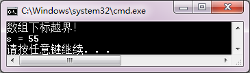

2．  #include<iostream>

using namespace std;

void f();

class T

{   public:

T()

{   cout<<"constructor"<<endl;

try

{   throw  "exception";   }

catch( char * )

{   cout<<"exception1"<<endl;   }

throw  "exception";

}

~T()

{   cout<<"destructor";   }

};

int main()

{   cout<<"main function "<<endl;

try   {  f();   }

catch( char * )

{   cout<<"exception2"<<endl;   }

cout<<"main function "<<endl;

}

void f()

{  T t;  }

【解答】

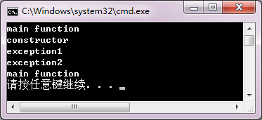

### **二、思考题**

1．对一个应用是否一定要设计异常处理程序？异常处理的作用是什么？

【解答】

一个应用不一定要设计异常处理程序。异常处理以结构化思想把异常检测与异常处理分离，增加了程序的可读性，便于大型软件的开发。

2．什么叫抛出异常？catch可以获取什么异常参数？是根据异常参数的类型还是根据参数的值处理异常？请编写测试程序验证。

【解答】

C++异常处理通过三个关键字实现：throw、try和catch。被调用函数按指定条件检测到异常条件的存在，用throw一个数值，称为抛出一个异常。这个函数仅仅做了throw，而不去处理错误。在上层调用函数中使用try语句检测函数调用是否引发异常，被检测到的各种异常由catch语句捕获并作相应的处理。catch只是根据异常参数的类型（不管具体数值）处理异常。

3．什么是不唤醒机制？这种机制有什么好处？请举例说明。

【解答】

不唤醒机制是指抛出异常后，调用链上的所有模块都终止执行，不返回异常抛出点。这种机制的好处是把函数的正常功能设计和异常处理设计分离，便于结构化处理。

程序略

### **三、程序设计**

1．从键盘上输入*x*和*y*的值，计算*y*  = ln( 2*x*  –  *y*  )  的值，要求用异常处理“负数求对数”的情况。

【解答】

#include <iostream>

#include <cmath>

using namespace std;

double f( double x,double y );

int main()

{

double x,y;

try

{

cout << "输入x和y的值：";

cin >> x >> y;

cout << f( x,y ) << endl;

}

catch( char * )

{

cout << "负数不能求对数！" << endl;

}

}

double f( double x,double y )

{

if( 2*x-y < 0 )

throw  "error";

else

return log( 2*x - y );

}

2．程序中，典型的异常有：内存不足以满足new的请求、数组下标越界、运算溢出、除数为0或无效函数参数等。简单描述程序应该如何用异常处理的方法处理这些情况。

【解答】

略。

3．把第12章12.2.4节中的代码补充成完整的测试程序并运行。

【解答】

略。
