# cpp习题与解答-选择题修订-ALL

<!-- page: 1 -->

习题与解答

第1 章习题与解答

同步练习1.1

<!-- question: cpp-032-Q1 -->

一、选择题

1．一个最简单的C++程序，可以只有一个（    ）。

（A）库函数
（B）自定义函数
（C）main 函数 （D）空函数
2．函数名是（    ），用于识别和调用函数。

（A）关键字
（B）标识符
（C）常数
（D）语句
3．用C++语言编写的源程序要成为目标程序必须要经过（    ）。

（A）解释
（B）汇编
（C）编辑
（D）编译
4．C++程序中的简单语句必须以（    ）结束。

（A）冒号
（B）分号
（C）空格
（D）花括号
5．程序中把表达式“a+0.5”写为“a*0.5”，是（    ）错误。

（A）编译
（B）连接
（C）运行
（D）逻辑

【解答】
C
B
D
B
D

<!-- question: cpp-032-Q2 -->

二、程序练习

用一个简单问题，练习程序的书写格式。

（1）问题

输入一个摄氏温度值，转换输出华氏温度值。转换公式为：

9
32
5
F
C
=
+

式中，F 是华氏温度值，C 是摄氏温度值。想一想，应该如何正确把转换公式写成C++表达式。

（2）分析

首先，分析本问题需要的数据表示和数据处理。

数据：
摄氏温度C，华氏温度F。

处理：
输入C；

计算F；

输出C 和F。

然后，逐步细化：① 说明变量C 和F；② 显示提示输入摄氏温度值的信息；③ 从键盘输入C 的值；

④ 通过转换公式计算F 的值；⑤ 以清晰的说明输出C 和F。

（3）编写代码

简单程序语法格式：

程序与外部连接表示

主函数

程序中需要连接系统的输入/输出流类库。使用VC 2015，用宏指令包含头文件，使用标准名空间的

using 语句。主函数定义包括函数头和函数体。

程序框架：

#include<iostream>

<!-- page: 2 -->

using namespace std;
int main()5
{
   //语句序列
}

根据以上分析写出一个完整的程序，并在集成开发环境编译执行。运行结果如下：

请输入摄氏温度 C：
26.5
摄氏温度 C=26.5
华氏温度 F=79.7

【解答】

#include<iostream>

using namespace std;

int main()

{

double C,F;

cout<<"请输入摄氏温度 C:\n";

cin>>C;

F=(9.0/5)*C+32;

cout<< "摄氏温度 C=" <<C<<endl;

cout<< "华氏温度 F=" <<F<<endl;

}

想一想

把程序中的语句

F=(9.0/5)*C+32;

改为

F=(9/5)*C+32;

测试一下，程序计算结果将会有什么错误？想想为什么？

同步练习1.2

选择题

1．在下列选项中，全部都是C++关键字的选项为（    ）。

（A）while  IF  Static
（B）break  char  go

（C）sizeof  case  extern
（D）switch  float  integer
2．按C++标识符的语法规定，合法的标识符是（    ）。

（A）_abc
（B）new
（C）π
（D）"age"
3．在C++语句中，两个标识符之间（    ）不能
．．作为C++的分隔符。

（A）数字
（B）;
（C）:
（D）+
4．可以用于命名变量的标识符是（    ）。

（A）3x
（B）const
（C）name_2
（D）a.com
5．说明变量a 是整型变量的正确语句是（    ）。

（A）int a;
（B）inta;
（C）Int a;
（D）INTa;

【解答】
C
A
A
C
A

<!-- page: 3 -->

同步练习1.3

<!-- question: cpp-032-Q3 -->

一、选择题

1．下列正确的八进制整型常量表示是（    ）。

（A）0a0
（B）015
（C）080
（D）0x10
2．下列错误的十六进制整型常量表示是（    ）。

（A）0x11
（B）0xaf
（C）0xg
（D）0x1f
3．在下列选项中，全部都合法的浮点型数据的选项为（    ）。

（A）-1e3.5    15.    2e-4
（B）12.34    -1e+5    0.1E-12

（C）0.2e-2    -12345.    e-5
（D）5.0e(1+4)  0.1    8e+2
4．在下列选项中，正确的字符常量为（    ）。

（A）"a"
（B）'name'
（C）a
（D）'\101'

【解答】
B
C
B
D

<!-- question: cpp-032-Q4 -->

二、程序练习

sizeof 运算可以求一个数据或数据类型所要求的字节数。例如：

sizeof(int)
结果为4

sizeof(3.14)
结果为8

编写程序，显示以下数据类型要求的字节数：

char    short int    int    long int    double    long double

【解答】

#include<iostream>

using namespace std;

int main()

{

 cout<<"sizeof(char)="<<sizeof(char)<<endl;

 cout<<"sizeof(short int)="<<sizeof(short int)<<endl;

 cout<<"sizeof(int)="<<sizeof(int)<<endl;

 cout<<"sizeof(long int)="<<sizeof(long int)<<endl;

 cout<<"sizeof(double)="<<sizeof(double)<<endl;

 cout<<"sizeof(long double)="<<sizeof(long double)<<endl;

}

同步练习1.4

<!-- question: cpp-032-Q5 -->

一、选择题

1．在下列语句选项中，（    ）不能
．．交换变量a 和b 的值。

（A）t=b;  b=a;  a=t;
（B）a=a+b;  b=a-b;  a=a–b;
（C）t=a;  a=b;  b=t;
（D）a=b;  b=a;
2．关于下列语句，叙述错误的是（    ）。

int i=10, ∗p=&i;
（A）p 的值为10
（B）p 指向整型变量i
（C）∗p 表示变量i 的值
（D）p 的值是变量i 的地址
3．有以下变量说明，下面不正确
．．．的赋值语句是（    ）。

int a=5, b=10, c;  int ∗p1 = &a, ∗p2 = &b;

<!-- page: 4 -->

（A）∗p2 = b;
（B）p1 = a;
（C）p2 = p1;
（D）c = ∗p1 ∗(∗p2);
4．有以下变量说明，下面正确的语句是（    ）。

int a=10, b;  int &pa=a, &pb=b;

（A）&pb = a; （B）pb = pa;
（C）pb = &pa;
（D）∗pb = ∗pa;
5．执行下面语句序列后，a 和b 的值分别为（    ）。
int a=5, b=3, t;
int &ra=a;
int &rb=b;
t=ra;  ra=rb;  rb=t;
（A）3 和3
（B）3 和5
（C）5 和3
（D）5 和5

【解答】
D
A
B
B
B
<!-- question: cpp-032-Q6 -->

二、程序练习

阅读以下程序，分析下面语句序列中每个字符“∗”和“&”的含义，并写出输出结果。

#include <iostream>
using namespace std;
int main()
{  int a=10, b=20;
   int *p=&a, *q=&b;
   *p =*p* *q;
   int & ra = a;
   ra=a;
   int *& rt = q;
   *rt = 30;
   cout<<"a="<<a<<"\nb="<<b<<"\n*p="<<*p<<"\n*q="<<*q
            <<"\nra="<<ra<<"\n*rt="<<*rt<<endl;
}

【解答】

int main()
{

int a=10, b=20;
  int ∗p = &a, ∗q = &b;
//*为指针类型说明符，&是取址运算符
  ∗p = ∗p ∗ ∗q;
//第1、2、4 个*为间址运算符，第3 个是算数乘运算符
  int & ra = a;
//&是引用说明符
  ra=a;
  int ∗ & rt = q;
//*指针说明符，&引用说明符
  ∗rt = 30;
//*间址运算符
  cout<<"a="<<a<<"\nb="<<b<<"\n∗p="<<∗p<<"\n∗q="<<∗q
       <<"\nra="<<ra<<"\n∗rt="<<∗rt<<endl;      //字符串中的*是字符，其他是间址运算符
}
程序运行结果：

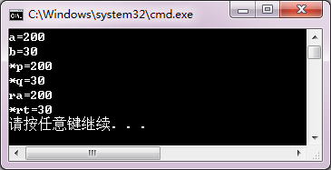

<!-- page: 5 -->

同步练习1.5

<!-- question: cpp-032-Q7 -->

一、选择题

1．控制台程序中需要使用cin 和cout 输出/输入，因此include 指令包含的头文件是（    ）。

（A）cmanth
（B）conio.h
（C）iostream
（D）iomanip
2．使用标准命名空间的语句是（    ）。

（A）using namespace std;
（B）using namespace iostream;

（C）include std;
（D）include iostream;
3．有语句  double x, y;  以下正确的输入语句是（    ）。

（A）cin<<x, y;
（B）cin<<x+y;
（C）cin<<x<<y<<endl;
（D）cin<<x<<y;
4．以输出宽度为8 输出变量x 值的语句是（    ）。

（A）cout<<setw(8)<<x<<endl;
（B）cout<<oct<<x<<endl;

（C）cout<<setprecision(8)<<x<<endl;
（D）cout<<setfill(8)<<x<<endl;

【解答】
C
A
D
A

<!-- question: cpp-032-Q8 -->

二、程序练习

  1．阅读程序，写运行结果。

#include <iostream>
#include<iomanip>
using namespace std;
int main()
{  int a=123;
   int &ra=a;
   int *pa=&a;
   cout<<setw(5)<<dec<<a<<setw(5)<<oct<<ra<<setw(5)<<hex<<*pa<<endl;
}
  【解答】

 2. 编写程序，计算0 到10 整数的平方和立方，然后用制表符整齐格式显示数值表。

【解答】

#include <iostream>

using namespace std;

int main()

{

cout<<"integer"<<'\t'<<"square"<<'\t'<<"cube"<<endl;

    int a = 0;

    cout<<a<<'\t'<<a*a<<'\t'<<a*a*a<<endl;

     ++a;

    cout<<a<<'\t'<<a*a<<'\t'<<a*a*a<<endl;

    ++a;

    cout<<a<<'\t'<<a*a<<'\t'<<a*a*a<<endl;

    ++a;

    cout<<a<<'\t'<<a*a<<'\t'<<a*a*a<<endl;

    ++a;

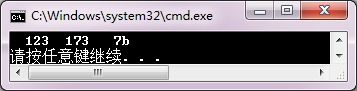

<!-- page: 6 -->

    cout<<a<<'\t'<<a*a<<'\t'<<a*a*a<<endl;

    ++a;

    cout<<a<<'\t'<<a*a<<'\t'<<a*a*a<<endl;

    ++a;

    cout<<a<<'\t'<<a*a<<'\t'<<a*a*a<<endl;

    ++a;

    cout<<a<<'\t'<<a*a<<'\t'<<a*a*a<<endl;

    ++a;

    cout<<a<<'\t'<<a*a<<'\t'<<a*a*a<<endl;

    ++a;

    cout<<a<<'\t'<<a*a<<'\t'<<a*a*a<<endl;

    ++a;

    cout<<a<<'\t'<<a*a<<'\t'<<a*a*a<<endl;

}

想一想

程序中的10 个输出操作模式都是相同的，只是每次操作变量a 的值增加了1。如何简化这种程序代码

呢？

习题

思考题

1． 什么叫数据类型？变量的类型定义有什么作用？
【解答】

数据“类型”是对数据的抽象。类型相同的数据有相同的表示形式、存储格式以及相关的操作。定
义一个变量时，计算机根据变量的类型分配存储空间，并以该类型解释存放的数据。

2．普通数据类型变量和指针类型变量的定义、存储、使用方式上有何区别？请编写一个程序验证之。
【解答】

变量类型
定义
存储
使用方式

数据
类型 标识符
数据值
通过名访问即直接访问对变量内容操作

指针
类型 * 标识符
地址值
通过指针变量的地址值间址访问对象
验证程序：

#include<iostream>

using namespace std;

int main()

{

int a,b,c;

  cout<<"a,b,c= ";

  cin>>a>>b>>c;
//对普通数据类型变量赋值

  int *pa=&a,*pb=&b,*pc=&c;
//用变量地址值初始化指针变量

  cout<<"a,b,c= "<<a<<", "<<b<<", "<<c<<endl;
//名访问，输出a,b,c的值

  cout<<"pa,pb,pc= "<<pa<<", "<<pb<<", "<<pc<<endl;  //输出指针变量的地址值

  //间址访问，输出pa,pb,pc指向的变量的赋值

  cout<<"*pa,*pb,*pc= "<<*pa<<", "<<*pb<<", "<<*pc<<endl;
}

     3．什么叫数据对象的引用？对象的引用和对象的指针有什么区别？请用一个验证程序说明之。

<!-- page: 7 -->

【解答】

引用是为数据对象定义别名。引用与指针有以下几点区别：
（1）引用名不是内存变量，而指针变量要开辟内存空间。
（2）引用名需要在变量定义与变量名绑定，并且不能重定义；指针变量可以在程序中赋给不同的地址
值，改变指向。

（3）程序中用变量名和引用名访问对象的形式和效果一样；指针变量通过间址访问对象。

验证程序：

#include<iostream>

using namespace std;

int main ()

{

int a;

  cout<<"a=";

cin>>a;

  int ra=a;

  int *pa=&a;

  cout<<"a 的值："<<a<<endl;

  cout<<"a 的地址："<<&a<<endl;

  cout<<"ra 的值："<<ra<<endl;

  cout<<"ra 的地址："<<&ra<<endl;

  cout<<"pa 所指向的变量的值："<<*pa<<endl;

  cout<<"pa 的地址："<<pa<<endl;
}

4．数据对象在C++中有什么不同的访问方式？请编写一个程序验证之。
【解答】

数据对象在C++中的访问方式有：名访问，引用（别名）访问，间址访问。
验证程序：

#include<iostream>
using namespace std;

int main()

{

int a;

  cout<<"a=";

  cin>>a;

  a=a+5;
//名访问

  cout<<&a<<endl;
//输出变量地址

  cout<<*(&a)<<endl;
//地址访问，输出变量值

  int *pa=&a;
//说明指针变量，指向变量a

  cout<<*pa<<endl;
//间址访问，输出变量值

  int &ra=a;
//ra 是a 的引用

  cout<<ra<<endl;
//引用访问，输出变量a 的值
}

5．为了约束对数据对象的值做只读操作，C++采用什么方式？请给出简要归纳。
【解答】

约束数据对象只读形式如下：

约束对象
说明形式

标识常量
const 类型 常量标识符=常量表达式;

<!-- page: 8 -->

指针常量
类型 * const 指针;

指向常量的指针
const 类型 * 指针;  或者  类型 const * 指针;

指向常量的指针常量
const 类型 * const 指针;  或者  类型 const * const 指针;

常引用
const 类型 & 引用名 = 对象名;

第2 章习题与解答

同步练习2.1

<!-- question: cpp-032-Q9 -->

一、选择题

1．假设有说明  int a=0; double x=5.16;  则在以下语句中，（    ）属于编译错误。

（A）x=a/x;
（B）x=x/a;
（C）a=a%x;
（D）x=x∗a;
2．在下列运算符中，（    ）优先级最高。

（A）<=
（B）∗=
（C）+
（D）∗
3．在下列运算符中，（    ）优先级最低。

（A）!
（B）&&
（C）!=
（D）? :
4．已知  int i=1, j=2;  则表达式 i+++j 的值为（    ）。

（A）1
（B）2
（C）3
（D）4
5．已知  int i=1, j=2;  则表达式 ++i+j 的值为（    ）。

（A）1
（B）2
（C）3
（D）4
6．在下列表达式选项中，（    ）是正确。

（A）++(a++)
（B）a++b
（C）a+++b
（D）a++++b
7．已知  int i=0, j=1, k=2;  则逻辑表达式 ++i || --j && ++k 的值为（    ）。

（A）0
（B）1
（C）2
（D）3
8．下列选项中，结果等于false 的是（    ）。

（A）1<3
（B）1=3
（C）1==3
（D）1!=3
9．执行下列语句后，x 和y 的值是（    ）。
int x, y;
x = y = 1;  ++x || ++y;

（A）1 和1
（B）1 和2
（C）2 和1
（D）2 和2
10．设x 为整型变量，不能
．．正确表达数学关系 1<x<5 的C++逻辑表达式是（    ）。

（A）1< x <5
（B）x==2||x==3||x==4

（C）1<x && x<5
（D）!(x<=1) && !(x>=5)
11．已知  int x=5;  执行下列语句后，x 的值为（    ）。

x += x -= x ∗ x;

（A）25
（B）40
（C）–40
（D）20
12．设  int a=1, b=2, c=3, d=4;  则以下条件表达式的值为（    ）。

a < b ? a : c < d ? c : d

（A）1
（B）2
（C）3
（D）4
13．以下逗号表达式的值为（    ）。

( x=4∗5, x∗5 ), x+25

（A）25
（B）20
（C）100
（D）45
14．有语句 int a=1, b=2; 以下正确的输出语句是（    ）。

（A）cout<<a=a+b<<endl;
（B）cout<<a>b?a:b<<endl;

（C）cout<<(hex)a+b;
（D）cout<<&a<<endl<<a<<endl;

【解答】
C
D
D
C
D
C   B
C
C
A
C
A
D
D

<!-- page: 9 -->

<!-- question: cpp-032-Q10 -->

二、书写表达式

1．根据算术式写C++算术表达式。

10
1
a
b
a
b



+


+


−



（1）
1
1
1
1
1
x
y

（2）x{x[x(ax+b)+c]+d}+e
（3）ln

+

+
+

2



−




+



2
1
1
x
x

（4）1
cos48°
2
π
+

（6）lg(a2+ab+b2)

（5）cot

【解答】

1. 1/(1 + 1/(1 + 1/(x + y)))

2. x * ( x * ( x * ( a * x + b ) + c ) + d ) + e

3. log( 1 + pow( fabs( ( a + b )/( a – b ) )，10)

4. sqrt( 1 + 3.14159/2 * cos( 48 * 3.14159/180 ) )

5. 1/tan( ( 1 - x*x )/( 1 + x*x))

或者  cos( ( 1 - x*x )/( 1 + x*x ) )/sin( ( 1 - x*x )/( 1 + x*x ) )

6. log10( a * a + a * b + b * b )

2．书写描述以下条件成立的C++逻辑表达式。
（1）i 被j 整除
（2）n 是小于k 的偶数
（3）1≤x＜10
（4）x、y 其中有一个小于z
（5）y∉[–100,–10]，并且y∉[10,100]
（6）坐标点(x, y)落在以(10, 20)为圆心，以35 为半径的圆内
（7）三条边a、b 和c 构成三角形
（8）年份Year 能被4 整除，但不能被100 整除，或者能被400 整除

【解答】

1.  i%j == 0
2. （n<k）&&（n%2 == 0）

3.  1<=x && x<10                  4.  x<z||y<z

5.  !( y>=-100 && y<=-10 ) && !( y>=10 && y<=100 )

6.  sqrt(pow((x-10),2) + pow((y-20),2))< 35

7.  a+b>c && b+c>a && c+a>b

8.  (year%4 == 0) && (year%100!=0)||(year%400==0)

<!-- question: cpp-032-Q11 -->

三、程序练习

1．阅读下列程序，写出运行结果。
#include <iostream>
using namespace std;
int main()
{  int a = 1, b = 2;
   bool x, y;
   cout << (a++)+(++b) << endl;
   cout << a % b << endl;
   x = !a>b;
   y = a-- && b;
   cout << x << endl;
   cout << y << endl;
}

【解答】

<!-- page: 10 -->

2．阅读下列程序，写出运行结果。
#include <iostream>
using namespace std;
int main()
{ int x,y,z,f;
  x = y = z = 1;
  f = --x || y-- && z++;
  cout << "x = " << x << endl;
  cout << "y = " << y << endl;
  cout << "z = " << z << endl;
  cout << "f = " << f << endl;
}

【解答】

3．编写一个程序。要求从键盘输入4 个小于100 的正整数，并打印输出它们的和、平均值、乘积、
最小值和最大值。整数的平均值不一定是整数，注意程序中应做什么处理。

【解答】

#include <iostream>

using namespace std;

int main()

{

 int a,b,c,d ,sum ,pro,min,max;

 double ave;

 cout<<"Input four different integers(<100):";

 cin >>a>>b>>c>>d;

 sum = a+b+c+d;

 ave = sum/4.0;

 pro = a*b*c*d;

 max = a>b ? ( a>c ?( a>d ? a : d):( c>d ? c : d ) ) :(b>c ?(b>d ? b : d ):(c>d ? c :d ));

 min = a<b ? ( a<c ?( a<d ? a : d):( c<d ? c : d ) ) :(b<c ?(b<d ? b : d ):(c<d ? c :d ));

 cout<<"Sum is "<<sum<<endl;

 cout<<"Average is "<<ave<<endl;

 cout<<"Product is "<<pro<<endl;

 cout<<"Smallest is "<<min<<endl;

 cout<<"Largest is "<<max<<endl;

 system("pause");

}

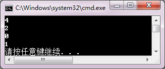

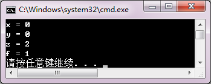

<!-- page: 11 -->

同步练习2.2

<!-- question: cpp-032-Q12 -->

一、选择题

1．已知  int i=0, x=1, y=0;  在下列选项中，使i 的值变成1 的语句是(    )。
（A）if( x&&y ) i++;
（B）if( x==y ) i++;
（C）if( x||y ) i++;
（D）if( !x ) i++;
2．已知  int i=0, x=1, y=0;  在下列选项中，使i 的值变成1 的语句是(    )。
（A）if( x ) {if(y) i=1; else i=0; }
（B）if( x ) {if(y) i=1; } else i=0;
（C）if( x ) i=0; else { if(y) i=1; }
（D）if( x ) i=1; else {if(y) i=0; }

x
x
x

3．设有函数关系为y=
1
0
0
0
1
0

−
<


=


>


，在下列选项中，能正确表示上述关系的是（    ）。

（A）y = 1;

（B）y = -1;

    if( x >= 0 )

    if( x != 0 )

       if( x == 0 ) y = 0;

       if( x > 0 ) y = 1;

       else  y = -1;

       else  y = 0

（C）if( x <= 0 )

（D）y = -1;

       if( x < 0 ) y = -1;

    if( x <= 0 )

       else  y = 0;

       if( x < 0 ) y = -1;

    else  y = 1;

       else  y = 0;

4．设i=2，执行下列语句后i 的值为（   ）。
switch( i )
{  case 1 : i ++;
   case 2 : i --;
   case 3 : ++ i; break;
   case 4 : -- i;
   default : i ++;
}
（A）1
（B）2
（C）3
（D）4
5．执行下列语句后，输出显示为（   ）。
char ch='A';
switch( ch )
{  case 'A' : ch++;
   case 'B' : ch++;
   case 'C' : ch++;
}
cout<<ch<<endl;
（A）A
（B）B
（C）C
（D）D

【解答】  C
D
C
B
D
<!-- question: cpp-032-Q13 -->

二、程序练习

1．阅读程序，写出运行结果。
#include<iostream>
using namespace std;
int main()
{  int a,b,c,d,x;
   a = c = 0; b = 1; d = 20;
   if( a )
      d = d-10;
   else

<!-- page: 12 -->

      if( !b )
         if( !c )
            x = 15;
         else x = 25;
   cout << d << endl;
}

【解答】

2．阅读程序，写出运行结果。
#include<iostream>
using namespace std;
int main()
{  int a = 0, b = 1;
   switch( a )
   {  case 0:
         switch( b )
         {  case 0 : cout<<"a="<<a<<" b="<<b<<endl; break;
            case 1 : cout<<"a="<<a<<" b="<<b<<endl; break;
         }
      case 1:
         a++; b++; cout<<"a="<<a<<" b="<<b<<endl;
   }
}

【解答】

3．输入一个正整数，使用if 语句，判断它的奇偶性。

【解答】

#include<iostream>

using namespace std;

int main()

{

 int a ;

 cout << "请输入一个正整数：" ;

 cin >> a ;

 if ( a%2 )

     cout << "这是一个奇数！" << endl;

 else

cout << "这是一个偶数！" << endl ;

}

4．输入三角形的三条边，判别它们能否形成三角形，若能，则判断是等边、等腰、还是一般三角形。

【解答】

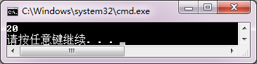

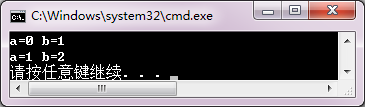

<!-- page: 13 -->

#include<iostream>
using namespace std;
int main()
{

double a, b, c ;
cout << "a, b, c = " ;
cin >> a >> b >> c ;
if ( a+b > c && b+c > a && c+a > b )
 {

if ( a == b && b == c )
      cout << "等边三角形！" << endl;
   else

if ( a == b || a == c || b == c )
          cout << "等腰三角形！" << endl;
     else

cout << "一般三角形！" << endl;
 }
else
cout << "不能形成三角形！" << endl ;
}

5．用case 语句代替if 语句，修改第3 题的程序，判断输入正整数的奇偶性。
【解答】

#include<iostream>

using namespace std;

int main()

{

int a ;

cout << "请输入一个正整数：" ;

cin >> a ;

switch ( a%2)

{

case 1:  cout << "这是一个奇数！" << endl;
break;

case 0:  cout << "这是一个偶数！" << endl ;

}

}

6．输入百分制成绩，并把它转换成五级分制，并显示转换结果。要求用case 语句编程。转换公式为：







A（优秀）  90～100

B（良好）  80～89

grade（级别）＝

C（中等）  70～79

D（合格）  60～69

想一想，若用if 语句进行成绩判断，本程序应该如何改写？请你试一试。

【解答】

#include<iostream>

using namespace std;

int main()

{

double score; char grade;

cout << "score=";

cin >> score;

<!-- page: 14 -->

if ( score >= 0 && score <= 100 )

{

switch  ( int( score ) /10 )

{ case   10:

  case   9:  grade = 'a'; break;

  case   8:  grade = 'b'; break;

  case   7:  grade = 'c'; break;

  case   6:  grade = 'd'; break;

  case   5:

  case   4:

  case   3:

  case   2:

  case   1:

  case   0:  grade = 'e'; break;

}

 }

else

{

cout <<"数据输入错误！"<< endl;

goto end;

}

cout << grade << endl;

end:  ;                      //分号不能省

}

同步练习2.3

<!-- question: cpp-032-Q14 -->

一、选择题

1．已知  int i=0，x=0;  在下面while 语句执行时循环次数为（   ）。
while( !x && i< 3 )  { x++; i++; }

（A）4
（B）3
（C）2
（D）1
2．已知  int i=3;  在下面do-while 语句执行时的循环次数为（   ）。
do  {  i--; cout<<i<<endl;  }while( i!= 1);

（A）1
（B）2
（C）3
（D）无限
3．下面for 语句执行时的循环次数为（   ）。
int i, j;
for ( i=0, j=5; i=j; )
{  cout<<i<<j<< ndl; i++; j--; }

（A）0
（B）5
（C）10
（D）无限

4．以下程序段形成死循环的是（    ）。

（A）int x; for( x=0; x<3; ) { x++; };

（B）int k = 0; do { ++k; } while( k>=0 );

（C）int a=5; while( a ) { a--; };

（D）int i=3; for(; i; i -- );

5．执行以下程序段后，x 的值是（    ）。
int i, j, x = 0;

<!-- page: 15 -->

for( i=0; i<=3; i++ )
{  x++;
   for( j=0; j<=3; j++ )
   {  if( j )  continue;
      x++;
   }
}
（A）8
（B）12
（C）14
（D）16

【解答】
D
B
B
B
A

<!-- question: cpp-032-Q15 -->

二、程序练习

1．阅读程序，写出运行结果。

（1）

#include<iostream>
using namespace std;
int main()
{

int i = 1;
while( i<=10 )
{  if( ++i % 3 != 1 )

continue;
else

cout << i << endl;
}
}

【解答】

（2）

#include<iostream>
using namespace std;
int main()
{  int i = 0, j = 5;

do
{  i++; j--;

if ( i>3 ) break;
} while ( j>0 );
cout << "i=" << i << endl << "j=" << j << endl;
}

【解答】

（3）

#include<iostream>

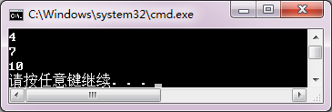

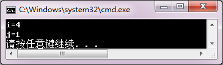

<!-- page: 16 -->

using namespace std;
int main()
{  int i, j, x = 0;

for( i=0; i<=3; i++ )
{  x++;

for( j=0; j<=3; j++ )
{  if( j % 2 )

continue;
x++;
}
x++;
}
cout << "x=" << x << endl;
}

【解答】

（4）

#include<iostream>
using namespace std;
int main()
{  int i, s = 0;

for( i=0; i<5; i++ )
switch( i )
{  case 0:  s += i;  break;

case 1:  s += i;  break;
case 2:  s += i;  break;
default: s += 2;
}
cout<<"s="<<s<<endl;
}

【解答】

（5）

#include<iostream>
using namespace std;
int main()
{  int i, j;

for( i=1, j=5; i<j; i++ )

j--;
cout<<i<<'\t'<<j<<endl;
}

【解答】

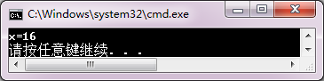

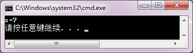

<!-- page: 17 -->

2. 修改同步练习2.1 程序练习第4 题中判断三角形的程序，使其可以完成多次测试。程序要求用户应

答，若输入Y 或y，程序可以继续运行，若输入N 或n，程序结束运行。要求分别用while 语句构造循环

和用do-while 语句构造循环编写程序。

【解答-1】

#include<iostream>

using namespace std;

int main()

{

double a, b, c ;

char answer;

while(1)

{

cout<<"测试三角形吗？";

cin>>answer;

if(answer=='Y'||answer=='y')

{

cout << "a, b, c = " ;

cin >> a >> b >> c ;

if ( a+b > c && b+c > a && c+a > b )

{

if ( a == b && b == c )

cout << "等边三角形！" << endl;

else

if ( a == b || a == c || b == c )

cout << "等腰三角形！" << endl;

else

cout << "一般三角形！" << endl;

}

else

cout << "不能形成三角形！" << endl ;

}

else

{

cout<<"测试结束！";

return 0;

}

}

}
【解答-2】

#include<iostream>

using namespace std;

int main()

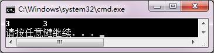

<!-- page: 18 -->

{

double a, b, c ;

char answer;

do

{

cout<<"测试三角形吗？";

cin>>answer;

if(answer=='Y'||answer=='y')

{

cout << "a, b, c = " ;

cin >> a >> b >> c ;

if ( a+b > c && b+c > a && c+a > b )

{

if ( a == b && b == c )

cout << "等边三角形！" << endl;

else

if ( a == b || a == c || b == c )

cout << "等腰三角形！" << endl;

else

cout << "一般三角形！" << endl;

}

else

cout << "不能形成三角形！" << endl ;

}

else

{

cout<<"测试结束！";

}

  }while(answer=='Y'||answer=='y');

}

3. 编写程序，计算0 到10 整数的平方和立方，然后用制表符整齐格式显示数值表。

【解答】

#include <iostream>
using namespace std;
int main()
{
cout<<"integer"<<'\t'<<"square"<<'\t'<<"cube"<<endl;
    int a = 0;
for( a=1; a<=10; a++)
{
cout<<a<<'\t'<<a*a<<'\t'<<a*a*a<<endl;
}
}

4. 编写程序，显示由符号组成的三角形图案。要求程序运行后由用户应答。输出星号三角形的

程序运行效果如下：

<!-- page: 19 -->

How many lines?
5
What character?
*
     *
    ***
   *****
  *******
 *********

【解答】

#include<iostream>

using namespace std;

int main()

{

int i, j, k, n;

char ch;

cout<<"How many lines ?\t";

cin>>n;

cout<<"What character ?\t";

cin>>ch;

for( i=1; i<=n; i++ )

   {

for( k=1; k<=n-i; k++ ) cout << " ";

for( j=1; j<=2*i-1; j++ ) cout << ch ;

cout << endl;

   }

}

5. 编写程序，在100～200 之间找出满足用3 除余2，用5 除余3 和用7 除余2 的所有整数。

【解答】

#include<iostream>

using namespace std;

int main()

{

int i;

  for( i=100; i<=200; i++ )

   {

if ( ( i % 3 == 2) && ( i % 5 == 3 ) && ( i % 7 == 2 ) )

      cout << i << endl;

}

}

同步练习2.4

<!-- question: cpp-032-Q16 -->

一、选择题

1．有“if<逻辑表达式><语句>;”，当整型变量a 和b 的值都不等于0 时执行<语句>，则逻辑表达式是

（    ）。

（A）a&b
（B）a&&b
（C）a!=b
（D）a-b!=0

<!-- page: 20 -->

2．有“if<逻辑表达式><语句>;”，当整型变量a、b 的值相等时执行<语句>，则逻辑表达式是（    ）。

（A）a=b
（B）a!=b
（C）a-b
（D）!(a-b)

3．有语句

for( int i=1; i<=10; i++)
   if(!(i%3)) cout<<i<< " ";

输出结果是（    ）。

（A）1 2 3
（B）1 2 4 5
（C）3 6 9
（D）4 5 6

4．有语句

int i=5, sum=0;
while(i--) { sum+=i%2; }
循环结束后，sum的值等于（    ）。

（A）2
（B）3
（C）4
（D）5
5．有语句
int a=5, b=1;
while(a-b) { a--; b++; }
循环体执行的次数是（    ）。

（A）1
（B）2
（C）3
（D）4
【解答】
B
D
C
A
B
<!-- question: cpp-032-Q17 -->

二、程序练习

设计程序，从键盘输入一系列数据，直到按Ctrl+Z 组合键结束输入，然后显示输入的非0 数据的个数

及这些数据之和。

【解答】

#include<iostream>

using namespace std;

int main()

{

int n=0, k, sum=0;

cout<<"input data, end in Ctrl-Z:\n";

while(cin>>k)

{

if( k )

{

   n++;

   sum+=k;

}

}

cout<<"n = "<<n<<"\nsum = "<<sum<<endl;

}

同步练习2.5

<!-- question: cpp-032-Q18 -->

一、选择题

1．以下程序段输出结果是（    ）。

int i,n=0;
for(i=0; i<10; i++)
{  if( i%3 ) break;

<!-- page: 21 -->

   n++;
}
cout<<n<<endl;
（A）1
（B）2
（C）3
（D）4

2．以下程序段输出结果是（    ）。

int i,n=0;
for(i=0; i<10; i++)
{  if( i%3 ) continue;
   n++;
}
cout<<n<<endl;
（A）1
（B）2
（C）3
（D）4

3．以下程序段输出结果是（    ）。

int i,n=0;
for(i=0; i<10; i++)
{  if( i>2 ) goto out;
   n++;
}
out: cout<<n<<endl;
（A）1
（B）2
（C）3
（D）4
【解答】
A
D
C
<!-- question: cpp-032-Q19 -->

二、程序练习

编写程序，输出小于结果50000 正整数的阶乘值。想一想，若用while(1) { }构造循环，循环条件是什

么？有什么方法可以结束循环？

【解答】

#include<iostream>

using namespace std;

void main()

{

int i=1, n=1;

    cout<<"n\tn!\n";

    while(1)

{

  n*=i;

  cout<<i<<'\t'<<n<<endl;

  i++;

  if(n>50000)  return;

}

}

习题

<!-- question: cpp-032-Q20 -->

一、思考题

<!-- page: 22 -->

1.什么叫表达式？表达式值的类型由什么因素决定？使用不同运算符连接以下三个变量，请写出5 个

以上运算结果值等于true 的表达式。

int a=1, b=2;  double x=0.5;

【解答】

表达式是由数据和运算符，按求值规则，表达一个值的式子。

表达式值的类型的决定因素为操作数的类型。

（1）如果运算符左右操作数类型相同，运算结果也是相同类型。

（2）如果运算符左右操作数类型不同，首先把类型较低（存储要求，

示数能力较低）的数据转换成类型较高的数据，然后运算。

（3）赋值表达式的类型由被赋值变量的类型决定。当把一个表达式的

值赋给一个变量时，系统首先强制把运算值转换成变量的类型，然后执行

写操作。

6 个值等于true 的表达式：

（1）b>a && a>x （2）(a+b)!=x
（3）a||(b+x)

（4）a==(b*x)
（5）a-b<x
（6）(a/x==b)

2．C++语言中有什么形式的选择控制语句？归纳它们的语法形式、应用场合。根据一个实际问题使

用不同的条件语句编程。

【解答】

语句
使用方式
使用场合

if 语句
if(表达式)语句1;

需要对给定的条件进行判断，并根据判断的结果

else 语句2;

选择不同的操作。

适用于复杂的条件表达式判断。

switch 语句
switch(表达式)

根据整型表达式的不同值决定程序分支的情况。

{ case 常量表达式1: 语句1;

适用于判断表达式简单，需要多个分支处理的情

case 常量表达式2: 语句2;

况。

……

case 常量表达式n; 语句n;

[default :  语句n+1;]

}

演示程序：
程序（1）

//此程序用if输出等级对应的分数段

//A->=90, B-(90,80], C-(80,70] , D-(70,60], E-<60

#include<iostream>

using namespace std;

int main()

{ char gd;

cout<<"Enter the grade:";

cin>>gd;

//直到输入有效等级，否则程序不继续运行

while(!((gd>='A' && gd<='E')||(gd>='a' && gd<='e')))

{ cout<<"Invalid grade! Please retry:";

  cin>>gd;

}

  if(gd=='A'||gd=='a') cout<<"\nScored 90-100!\n";

else if(gd=='B'||gd=='b') cout<<"\nScored 80-89!\n";

<!-- page: 23 -->

          else if(gd=='C'||gd=='c') cout<<"\nScored 70-79!\n";

          else if(gd=='D'||gd=='d') cout<<"\nScored 60-69!\n";

               else if(gd=='E'||gd=='e') cout<<"\nScore under 60!\n";

                    else cout<<"Unexpect error!\n";  //防止意外错误

}

程序（2）

//此程序用switch输出等级对应的分数段

//A->=90,B-(90,80],C-(80,70] ,D-(70,60],,E-<60

#include<iostream>

using namespace std;

int main()

{ char gd;

cout<<"Enter the grade:";

cin>>gd;

//直到输入有效等级，否则程序不继续运行

while(!((gd>='A' && gd<='E')||(gd>='a' && gd<='e')))

{ cout<<"Invalid grade! Please retry:";

 cin>>gd;

}

switch(gd)

{ case 'A':

case 'a': cout<<"\nScored 90-100!\n";break;

case 'B':

case 'b': cout<<"\nScored 80-89!\n";break;

case 'C':

case 'c':cout<<"\nScored 70-79!\n";break;

case 'D':

case 'd':cout<<"\nScored 60-69!\n";break;

case 'E':

case 'e':cout<<"\nScore under 60!\n";break;

default:cout<<"Unexpect error!\n";//防止意外错误

}

}

3．什么叫作循环控制？归纳比较C++语言中各种循环控制语句的语法、循环条件和循环结束条件的

表示形式及执行流程。

【解答】

循环控制是在特定的条件下，程序重复执行一些特定动作。

语句
语法
执行流程
使用场合

while 语句
while(表达式)

程序中常用于根据条件执行操作

循环体;

而不需关心循环次数的情况。

先判断形式循环，条件不成立时不

循环条件：表达式值为非0(真)

进入循环体。

循环结束条件：表达式值为0(假)

<!-- page: 24 -->

do-while 语

do

程序中常用于根据条件执行操作

句

循环体

而不需关心循环次数。

while(表达式);

后判断形式循环，至少执行1 次循

环体。

循环条件：表达式值为非0(真)

一般情况，while 语句和do while

循环结束条件：表达式值为0(假)

语句可以互换使用。

for 语句
for([表达式1];[表达式2];[表达式3])

for 语句称为步长循环语句，

循环体;

通常用于确定循环次数的情况。

由于语句的3 个表达式均可以

（1）表达式1 称为初始化表达式，不是

缺省，也可以用于条件循环，即循

循环体执行部分。

环次数不确定的情况。

（2）表达式3 称为后置表达式，作为循

环体的最后一个执行表达式。

（3）循环条件：表达式2 值为非0（真）

循环结束条件：表达式2 值为0（假）

4．根据一个实际问题，用不同的循环语句编程，分析其优缺点。
【解答】

略。

5．用if 语句和goto 语句组织循环，改写第3 题的程序，并分析在什么情况下可以适当使用goto 语句。
【解答】

在不破坏程序基本流程控制的情况下，可以适当使用goto 语句实现从语句结构内部向外的必要跳转，

即按特定条件结束结构语句块的执行。

程序略。

6．有以下程序，希望判断两个输入的整数是否相等。程序可以编译通过，但不能达到预期结果。请

分析程序能够通过C++编译而不能得到期望结果的原因。

#include<iostream>
using namespace std;
int main()
{  int a,b;
   cout<<"a: ";  cin>>a;
   cout<<"b: ";  cin>>b;
   if( a=b )  cout<<a<<"等于"<<b<<endl;
   else  cout<<a<<"不等于"<<b<<endl;
}
【解答】

在if 语句的判断表达式(a=b)中，赋值号“=”应该是逻辑等“==”。从语法上，C++的if 语句把a=b 这个

赋值表达式视为逻辑表达式，没有编译错误。a=b 的值决定于b。若b 的输入值不等于0，if 语句的判断表

达式作为逻辑真（true），否则作为逻辑假（false）。所以，题目中输入b 的值虽然不等于a，但表达式a=b

为逻辑true，执行了if 语句的第1 个分支。

<!-- page: 25 -->

<!-- question: cpp-032-Q21 -->

二、程序设计

1．
输入平面上某点横坐标x 和纵坐标y，若该点在如图2.12 所示的方块区域内，则输出true；

否则，输出false。

图2.12  方块区域

【解答】

#include <iostream>

using namespace std;

int main()

{

 double x,y;

 bool b;

 cout << "please input x, y:\n";

 cin >> x >> y;

 b = ( -2<=x ) && ( x<=2 ) && ( -2<=y ) && ( y<=2 );

 if(b)

cout<<"true"<<endl;

 else

cout <<"false"<< endl;

}

2．输入三个整数，求出其中最小数（要求使用条件表达式）。

【解答】

#include <iostream>

using namespace std;

int main()

{

int a, b, c, temp, min;

cout << "please input a,b,c:";

cin >> a >> b >> c;

temp = (a<b) ? a : b;

min = (temp<c) ? temp : c;

cout << "min=" << min << endl;

}

3．编写一个程序。要求输入一个5 位正整数，然后分解出它的每位数字，并将这些数字按间隔2 个

空格的逆序形式打印输出。例如，用户输入42339，则程序输出如下结果：

9   3   3   2   4
【解答】

#include<iostream>
using namespace std;
int main()
{

<!-- page: 26 -->

int t;
  cout<<"Input one integer for 5 bit: ";
  cin>>t;
  cout<<t%10<<"   "<<t/10%10<<"   "<<t/100%10<<"   "<<t/1000%10

<<"   "<<t/10000<<endl;
}

4．输入三个整数，按从小到大的顺序输出它们的值。

【解答】

#include<iostream>

using namespace std;

int main()

{

int a, b, c, t;

cout << "a, b, c=";

cin >> a >> b >> c;

if(a>b) { t=a; a=b; b=t; }

if(a>c) { t=a; a=c; c=t; }

if(b>c) { t=b; b=c; c=t; }

cout<< a << '\t'<< b << '\t' << c << endl;

}

5．编程模拟剪刀、石头和布游戏。游戏规则为：剪刀剪纸，石头砸剪刀，布包石头。玩游戏者从键盘输

入s（表示剪刀）或r（表示石头）或p（表示布），要求两个游戏者交替输入，计算机给出输赢的信息。

【解答】

#include<iostream>

using namespace std;

int main()

{

char first,second;

  cout << "First input( s,r or p ):";

  cin >> first;

  cout << "Second input( s,r or p ):";

  cin >> second;

  switch  ( first )

  {

case  's':

 switch  ( second )

{

case  's': cout << "Scissor ties scissor." << endl; goto end;

case  'r': cout << "Scissor is crushed by rock." << endl; goto end;

case  'p': cout << "Scissor cuts paper." << endl; goto end;

default :  cout << "second input error!" << endl ; goto end;

}

    case  'r':

switch  ( second )

 {

case  's': cout << "Rock crushes scissor." << endl; goto end;

<!-- page: 27 -->

case  'r': cout << "Rock ties rock." << endl; goto end;

case  'p': cout << "Rock is wrapped by paper." << endl; goto end;

default :  cout << "second input error!" << endl; goto end;

 }

    case  'p':

 switch  ( second )

{

case  's': cout << "Paper is cut by scissor." << endl; goto end;

case  'r': cout << "Paper wraps the rock." << endl; goto end;

  case  'p': cout << "Paper ties paper." << endl; goto end;

default :  cout << "second input error!" << endl; goto end;

}

    default : cout << "First input error!" << endl; goto end;

  }

end: ;

}

6．编写一个程序，输出一张表，内容是1~256 范围内每个十进制数对应的二进制数、八进制数和十

六进制数形式。第1 行是标题，用制表符整齐格式（根据输出情况调整）显示数值表。提示，八进制数和

十六进制数可以直接输出。

decimal
binary
octal
hexadecimal
1
1
1
1
2
10
2
2
3
11
3
3
……

【解答】

#include<iostream>

#include<iomanip>

using namespace std;

int main()

{

int i,k,t,m;

     cout<<"decimal\t  binary\toctal\thexadecimal\n";

for(i=1; i<=256; i++)

{

   cout<<dec<<i<<"\t";

   t=i;

   m=0;
//标志，判断是否输出1

   for(k=256; k>=1; k/=2)
//从最高位开始处理

   {

if(t>=k)

{

   cout<<1;
//填写1

   t=t-k;
//等待处理的剩余数

   m=1;
//记录输出了最高位的1

}

<!-- page: 28 -->

else

   if(m) cout<<0;
//如果已经输出1，就输出有效的0

      }

if(i<128)
cout<<'\t';
//格式调整

cout<<"\t"<<oct<<i<<"\t"<<hex<<i<<endl;

  }

}

7．输入一个整数，输出该整数的所有素数因子。例如，输入120，输出为2、2、2、3 和5。

【解答】

#include<iostream>

using namespace std;

int main()

{

int m,i = 2;

  cout << "please input m:";

  cin >> m;

  while( i<=m )

    if( m % i == 0 )

     {

cout << i << ",";

       m = m / i;

     }

   else i++;

}
8．使用迭代公式
1
0
(
/
)/ 2 (
0,1, 2
;
/ 2)
n
n
n
x
x
a x
n
x
a
+ =
+
=
=

编程求某个正整数a 的平方根。

【解答】

#include<iostream>

#include<cmath>

using namespace std;

int main()

{

const double eps = 1e-8;

double a,x0,x;

cout << "please input a:";

cin >> a;

x0 = a / 2;

x = ( x0 + a/x0 )/2;

while( fabs( x-x0 )>eps )

   {

x0 = x;  x =( x0 + a/x0 )/2;

}

cout << x << endl;

}

9．已知x=0
, 10

, 20

, …, 180

，求sinx、cosx 和tanx 的值。

<!-- page: 29 -->

【解答】

#include<iostream>

#include<cmath>

#include<iomanip>

using namespace std;

int main()

{

const double pi = 3.14159265;

int i;

double x,y1,y2,y3;

cout << setw(2) << "x" << setw(15) << "sin(x)" << setw(15)

     << "cos(x)" << setw(15) << "tg(x)" << endl;

for( i=0; i<=18; i++ )

  {

x = i*10*pi/180;

     y1 = sin( x );

     y2 = cos(x);

     y3 = y1/y2;

     cout << setw(2) << i << setw(15) << y1 << setw(15)

         << y2 << setw(15) << y3 << endl;

     }

}

10．求100～999 之间的水仙花数。所谓水仙花数，是指一个三位数，它的每位数字的立方之和等于

3+5
3+3
3，所以153 为水仙花数。

该数。例如，因为153=1

【解答】

#include<iostream>

using namespace std;

int main()

{

int i,a,b,c;

  for( i=100; i<=999; i++ )

    {

a = i/100;

       b = ( i-a*100 ) / 10;

       c = i - a*100 - b*10;

       if ( i == a*a*a + b*b*b + c*c*c )

cout << i <<endl;

    }

}

11．求1000 以内的所有完数。所谓完数，是指一个数恰好等于它的所有因子之和。例如，因为6=1+2+3，

所以6 为完数。

【解答】

#include<iostream>

using namespace std;

<!-- page: 30 -->

int main()

{

int i,j,s;

  for( i=1; i<=1000; i++ )

  {

s = 0;

     for( j=1; j<i; j++ )

        if ( i % j == 0 ) s = s + j;

     if ( i == s ) cout << i << endl;

  }

}

12．编写一个程序，它能够读入一个正方形的边长（1~20），然后打印一个由星号和空格组成的空心

正方形。例如，程序读入边长是5，则输出的空心正方形为：

*
*
*
*
*
*
*
*
*
*
*
*
*
*
*
*

【解答】

#include<iostream>

using namespace std;

int main()

{

int i, j, n;

cout<<"input n = ";

cin>>n;

for(i=1; i<=n; i++)

{

for(j=1; j<=n; j++)

if(i==1||i==n||j==1||j==n)

cout<<"* ";

else cout<<"  ";

cout<<endl;

}

}

13．已知XYZ+YZZ=532，其中X，Y 和Z 为数字，编写程序求出X、Y 和Z 的值。

【解答】

#include<iostream>

using namespace std;

int main()

{

int x,y,z,i;

for( x=1; x<=9; x++ )

  for( y=1; y<=9; y++ )

    for( z=0; z<=9; z++ )

<!-- page: 31 -->

     {

  i = 100*x + 10*y + z + 100*y + 10*z + z;

        if ( i == 532 )

cout<<"x="<<x<<'\t'<<"y="<<y<<'\t'<<"z="<<z<<endl;

      }

}

14．编写一个简单加密程序。输入一个6 位整数的明码，按以下方法加密：首先，将每位数字替换成

它与7 相加之和再用10 求模的结果；然后逆置；最后输出密码。再编写程序，把这个密码还原成明码。若

输入错误，则显示错误信息后退出程序。

例如，输入原码数据n 为：200911，则显示密码n1 为：886779，解密后的原码n2 为：200911。

注：密码n1 不一定是6 位整数，但明码n 和n2 是相等的6 位整数。
【解答】

#include<iostream>

using namespace std;

int main()

{

int i,n,n1=0,n2=0,t=0;

cout<<"输入一个6位整数：";

cin>>n;

if(n>999999||n<100000)

{

cout<<"输入错误，退出程序。\n";

return 0;

}

    //加密

for(i=1; i<=6; i++)

{

n1*=10;

t=n%10;

n1+=(t+7)%10;

n=(n-t)/10;

}

    cout<<"加密："<<n1<<endl;

    //解密

for(i=1; i<=6; i++)

{

n2*=10;

t=n1%10;

if(t>=7)

n2+=t-7;

else

n2+=t+10-7;

n1=(n1-t)/10;

}

cout<<"解密："<<n2<<endl;

<!-- page: 32 -->

}

第3 章习题与解答

同步练习3.1

<!-- question: cpp-032-Q22 -->

一、选择题

1．以下正确的函数原型为（    ）。

（A）fun1( int x; int y );
（B）void fun1( x, y );

（C）void fun1( int x, y );
（D）void fun1( int, int );

2. 有函数原型  int f2(int, int);  以下正确的调用语句是（    ）。

（A）int a=fun2(1);
（B）cout<<fun2(3,4);

（C）int a=fun2(1)+fun(2);
（D）cout<<fun2(3+4);

3．有函数原型  void f3(double);  以下正确的调用语句是（    ）。

（A）double a=fun3(0.15);
（B）fun3(0.34);

（C）double a=fun3(0.1)+f3(0.2);
（D）cout<<fun3(3.4);

4．以下正确的函数定义是（    ）。

（A）int fun4(int a, int b) { return a+b; }
（B）void fun4(int a, int b) { return a+b; }

（C）int fun4(int a, int b) { fun4 = a+b; }
（D）void fun4(int a, int b){ fun4 = a+b; }

5．以下正确的函数定义是（    ）。

（A）void fun5();{ cout<<"Call f5\n";}
（B）void fun5() { return f5;}

（C）void fun5() { cout<<"Call f5\n";}
（D）void fun5() { return 5;}

【解答】
D
B
B
A
C

<!-- question: cpp-032-Q23 -->

二、程序练习

1．阅读程序，写出运行结果。

#include<iostream>

using namespace std;

#include<cmath>

int f( int );

int main()

{  int i;

for( i = 0; i < 3; i ++ )

    cout << f( i ) << endl;

}

int f( int a )

{  int b = 0, c = 1;

b++; c++;

return int( a + pow( double(b), 2 ) + c );

}

【解答】

<!-- page: 33 -->

2．函数floor 可以将一个数值近似到指定的十进制数位。以下语句：
y=floor(x*10+0.5)/10;

将把x 的值近似到“十分之一位”，即小数点右边的第一位。编写程序，定义4 个近似值的函数如下：

（1）roundToIntnger(number)
//求近似整数

（2）roundToTenths(number)
//求近似到十分之一位

（3）roundToHundreths(number)
//求近似到百分之一位

（4）roundToThousandths(number)
//求近似到千分之一位

每当程序读入一个数据，程序应能够输出原始值，近似整数值，近似到十分之一位的值，近似到百分

之一位的值，近似到千分之一位的值。（提示：floor 函数包含在cmath 头文件中。）

【解答】

#include<iostream>

#include<cmath>

using namespace std;

int roundToIntnger(double number)

{

return int(floor(number+0.5));

}

double roundToTenths(double number)

{

return floor(number*10+0.5)/10;

}

double roundToHundreths(double number)

{

return floor(number*100+0.5)/100;

}

double roundToThousandths(double number)

{

return floor(number*1000+0.5)/1000;

}

int main()

{

double x;

cout<<"Please input a number (until Ctrl-z): ";

while(cin>>x)

{

cout<<x<<"\tRound to intnger is : "<<roundToIntnger(x)<<endl

        <<"\tRound to tenths is : "<<roundToTenths(x)<<endl

<<"\tRound to hundreths is : "<<roundToHundreths(x)<<endl

<<"\tRound to thousandths is : "<<roundToThousandths(x)<<endl;

cout<<"Please input a number (until Ctrl-z): ";

<!-- page: 34 -->

}

}

3．想一想，上题程序中定义的4 个函数有什么相似之处？可以通过参数识别精度要求，把它们编写

成一个函数吗？

【解答】

#include<iostream>

#include<cmath>

using namespace std;

double round(double number, int app)

{

return floor(number*app+0.5)/app;

}

int main()

{

double x;

cout<<"Please input a number (until Ctrl-z): ";

while(cin>>x)

{

cout<<x<<"\tRound to intnger is : "<<round(x,1)<<endl

<<"\tRound to tenths is : "<<round(x,10)<<endl

<<"\tRound to hundreths is : "<<round(x,100)<<endl

<<"\tRound to thousandths is : "<<round(x,1000)<<endl;

cout<<"Please input a number (until Ctrl-z): ";

}

}

同步练习3.2

<!-- question: cpp-032-Q24 -->

一、选择题

1．有函数原型  void fun6( int );  在下列选项中，不正确
．．．的调用是（    ）。

（A）int a = 21;  fun6( a );
（B）int a = 15;  fun6( a*3 );

（C）int b = 100; fun6( &b );
（D）fun6( 256 );

2．有函数原型  void fun7( int * );  在下列选项中，正确的调用是（    ）。

（A）double x = 2.17; fun7( &x );
（B）int a = 15;  fun7( a*3.14 );

（C）int b = 100;  fun7( &b );
（D）fun7( 256 );

3．有函数原型 void fun8( int & );  在下列选项中，正确的调用是（    ）。

（A）int a = 2.17; fun8( &a );
（B）int a = 15;   fun8( a*3.14 );

（C）int b = 100;  fun8( b );
（D）fun8( 256 );

4．有以下声明，在下列选项中，正确的调用是（    ）。

void fun9( int * & );  int a, int *p = &a;

（A）fun9(&a);
（B）fun9(p);
（C）fun9(*a);
（D）fun9(*p);

5．以下正确的函数定义是（    ）。

（A）int * fun10(double x){ return x; }
（B）int * fun10(double x){ return &x; }

（C）int * fun10(int a){ return *a; }
（D）int * fun10(int a){ return &a; }

<!-- page: 35 -->

6．函数参数的默认值不允许为（    ）。

（A）全局常量
（B）直接常量
（C）局部变量
（D）函数调用

【解答】
C
C
C
B
D
C

<!-- question: cpp-032-Q25 -->

二、程序练习

1．阅读程序，写出运行结果。

#include<iostream>

using namespace std;

void func(int a, int b, int c = 3, int d = 4 );

int main()

{  func( 10, 15, 20, 30 );

func( 10, 11, 12 );

func( 12, 12 );

}

void func( int a, int b, int c, int d )

{  cout<<a<<'\t'<<b<<'\t'<<c<<'\t'<<d<< endl;  }

【解答】

2．阅读程序，写出运行结果。

#include<iostream>

using namespace std;

void func( int, int, int * );

int main()

{  int x, y, z;

func( 5, 6, &x );

func( 7, x, &y );

func( x, y, &z );

cout << x << "," << y << ", "<< z << endl;

}

void func( int a, int b, int *c )

{  b += a;  *c = b - a;  }

【解答】

3．阅读程序，写出运行结果。

#include<iostream>

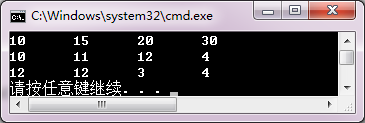

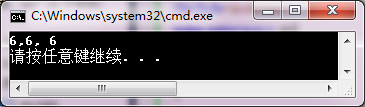

<!-- page: 36 -->

using namespace std;

void func( int, int, int & );

int main()

{  int x=0, y=1, z=2;

func( 1, 2, x );

func( x + y, y, y );

func( z, x + y, z );

cout << x << ", " << y << ", "<< z << endl;

}

void func( int a, int b, int &c )

{  b += a;  c = b - a;  }

【解答】

4．阅读程序，写出运行结果。

#include<iostream>

using namespace std;

void func( int *, int *, int *& );

int main()

{  int a=10, b=20;

int *p=&a, *q=&b;

func( p, q, p );

cout << "*p=" << *p << ", *q=" << *q << endl;

}

void func( int *t1, int *t2, int *& rt )

{  *t1 += 5;  *t2 += 5;

rt = t1;

*rt += 5;

cout << "*t1=" << *t1 << ", *t2=" << *t2<< ", *rt=" << *rt << endl;

}

【解答】

5．编写一个程序，测试三个函数，它们都能够把main 函数中的变量count 的值增至原来的三倍。这

三个函数说明如下：

（a）tripleByValue 函数通过值传递count 的一份副本，把值增至原来的三倍并返回这一结果。

（b）tripleByReference 函数通过引用参数传递count，用别名（即引用参数）把count 原来的值增至三倍。

（c）tripleByPointer 函数通过指针参数传递count 的地址，用间址方式把count 原来的值增至三倍。

【解答】

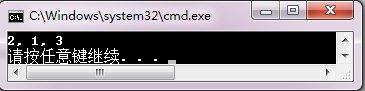

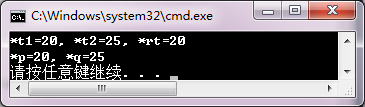

<!-- page: 37 -->

#include<iostream>

using namespace std;

double tripleByValue(double x)

{ return x*3; }

void tripleByReference(double &x)

{ x = x*3; }

void tripleByPointer( double *x)

{ *x = *x * 3; }

int main()

{

double count;

cout<<"1, Please input count: ";

cin>>count;

cout<<"tripleByValue: "<<tripleByValue(count)<<endl;

cout<<"2, Please input count: ";

cin>>count;

tripleByReference(count);

cout<<"tripleByReference: "<<count<<endl;

cout<<"3, Please input count: ";

cin>>count;

tripleByPointer(&count);

cout<<"tripleByPointer: "<<count<<endl;

}

同步练习3.3

<!-- question: cpp-032-Q26 -->

一、选择题

1．在C++中，一个项目可以包含多个函数，它们之间是（    ）。

（A）独立定义的
（B）嵌套定义的

（C）根据调用关系定义的
（D）根据调用顺序定义的

2．一个项目中只能有一个的函数是（    ）。

（A）系统库函数
（B）自定义函数

（C）主函数
（D）在其他文件中定义的函数

3．一个项目中包含三个函数：main、fa 和fb 函数，它们之间不正确的调用是（    ）。

（A）在main 函数中调用fb 函数
（B）在fa 函数中调用fb 函数

（C）在fa 函数中调用fa 函数 （D）在fb 函数中调用main 函数

4．实现函数调用需要（    ）进行信息管理。

（A）队列
（B）堆栈
（C）数组
（D）参数

5．关于递归调用不正确的描述是（    ）。

（A）递归调用和嵌套调用都是通过堆栈管理实现的

（B）函数直接或间接调用自己称为递归调用

（C）递归终止条件必须为参数值等于0

（D）递归算法的问题规模必须是逐步缩小的

【解答】
A
C
D
B
C

<!-- page: 38 -->

<!-- question: cpp-032-Q27 -->

二、程序练习

1．阅读程序，写出运行结果。

#include<iostream>

using namespace std;

int f2( int, int );

int f1( int a, int b )

{  int c;

a += a; b += b;

c = f2( a+b, b+1 );

return c;

}

int f2( int a, int b )

{  int c;

c = b % 2;

return a + c;

}

int main()

{  int a = 3, b = 4;

cout << f1( a, b ) << endl;

}

【解答】

2．阅读程序，写出运行结果。

#include<iostream>

using namespace std;

int age( int n )

{  int f;

if( n == 1 )

   f = 10;

else

   f = age( n-1 ) + 2;

return f;

}

int main()

{  cout << "age : " << age( 5 ) << endl;  }

【解答】

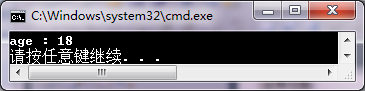

<!-- page: 39 -->

3．编写递归函数：

int power(int base, int e);

当它被调用时，返回指数basee 的值。设e 是大于或等于0 的整数。用main 函数调用power 函数，并

显示计算结果。例如，power(3,4)=3*3*3*3。

提示：递归算法为

basee = base×basee
当e>1 时

base1 = base
当e=1 时

base0 = 1
当e=0 时

想一想，这个程序可以用循环算法代替递归函数定义吗？请你试一试。

【解答】

#include<iostream>

using namespace std;

int power( int b,  int e ) ;

int main()

{

int b,e;

cout<<"base = ";

cin>>b;

cout<<"exponent = ";

cin>>e;

if(e>=1)

    cout<<"power( "<<b<<", "<<e<<" ) = "<<power( b, e )<<endl;

else

{

cout<<"exponent is error!";

return 0;

}

}

int power(int b, int e)

{

if(e==0)

return 1;

    else

if(e==1)

return b;

else

return  b*power( b, e-1 );

}

同步练习3.4

<!-- question: cpp-032-Q28 -->

一、选择题

1．有以下函数定义，该函数的类型是（    ）。

double fun11 (int ary[], int len)

{ /*…*/ }

<!-- page: 40 -->

（A）double fun11 (int ary[], int len)
（B）double fun11 (int [], int)

（C）double (int[], int)
（D）double

2．有以下说明语句，以下叙述正确的是（    ）。

typedef double funt (double);  funt fun12;

（A）funt 和 fun12 是类型相同的函数
（B）fun12 是funt 类型的变量

（C）funt 是返回typedef double 类型的函数
（D）fun12 是funt 类型的函数

3．有以下语句，则以下正确的赋值语句是（    ）。

typedef double funt (double);  funt fun13, *pfun;

（A）pfun=fun13;
（B）*pfun=fun13;
（C）pfun=funt;
（D）*pfun=funt;
4．有以下语句，则以下不正确
．．．的赋值语句是（    ）。

typedef double funt (double);  funt fun13, fun14, *pfun;

（A）pfun=fun13;
（B）pfun=&fun14;
（C）pfun=*fun13;
（D）fun13=fun14;

5．有以下声明，在下列选项中，正确的调用是（    ）。

int fun14( int );  int (*pf)(int) = fun14;

（A）int a=15;  int n=fun14(&a);
（B）int a = 15; cout<<(&pf)(a);

（C）cout<<(*pf)( 256 );
（D）cout << *pf( 256 );

【解答】
C
C
A
D
C

<!-- question: cpp-032-Q29 -->

二、程序练习

1．阅读程序，写出运行结果。

#include<iostream>

using namespace std;

int f1( int a, int b )

{  return a + b;  }

int f2( int a, int b )

{  return a - b;  }

int f3( int(*t )( int, int ), int a, int b )

{  return (*t )( a, b );  }

int main()

{  int (*p )( int, int );

   p = f1;

   cout << f3( p, 4, 8 ) << endl;

   p = f2;

   cout << f3( p, 8, 4 ) << endl;

}

【解答】

2．当用户输入三个不相等的整数时，以下程序分别按顺序和逆序输出它们的值。给出main 函数，请

把程序补充完整。

#include<iostream>

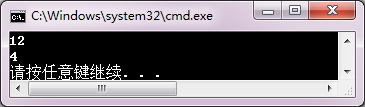

<!-- page: 41 -->

using namespace std;

int main()

{  int a,b,c;

   int t1,t2,t3;

   orderFun *pf;
//说明函数指针

   cout<<"请输入三个不相等的整数：";

   cin>>a>>b>>c;

   t1=a;  t2=b;  t3=c;

   pf=sequence;
//获取函数地址

   pf(t1,t2,t3);
//调用函数

   cout<<"顺序输出："<<t1<<"  "<<t2<<"  "<<t3<<endl;

   t1=a;  t2=b;  t3=c;

   pf=retrograde;
//获取函数地址

   pf(t1,t2,t3);
//调用函数

   cout<<"逆序输出："<<t1<<"  "<<t2<<"  "<<t3<<endl;

}

【解答】

#include<iostream>

using namespace std;

typedef void orderFun (int &, int&,int&);

orderFun sequence, retrograde;

int main()

{

  int a,b,c;

  int t1,t2,t3;

  orderFun *pf;
//说明函数指针

  cout<<"请输入3个不相等的整数：";

  cin>>a>>b>>c;

  t1=a;  t2=b;  t3=c;

  pf=sequence;
//获取函数地址

  pf(t1,t2,t3);
//调用函数

  cout<<"顺序输出："<<t1<<"  "<<t2<<"  "<<t3<<endl;

  t1=a;  t2=b;  t3=c;

  pf=retrograde;

  pf(t1,t2,t3);

  cout<<"逆序输出："<<t1<<"  "<<t2<<"  "<<t3<<endl;

}

void sequence (int &x, int &y, int &z)

{

int t;

if( x>y ) { t=x;  x=y;  y=t; }

if( x>z ) { t=x;  x=z;  z=t; }

if( y>z ) { t=y;  y=z;  z=t; }

}

void retrograde (int &x, int &y, int &z)

{

<!-- page: 42 -->

int t;

if( x<y ) { t=x;  x=y;  y=t; }

if( x<z ) { t=x;  x=z;  z=t; }

if( y<z ) { t=y;  y=z;  z=t; }

}

同步练习3.5

<!-- question: cpp-032-Q30 -->

一、选择题

1．指定内联函数的关键字是（    ）。

（A）include
（B）inline
（C）namespace
（D）typedef

2．内联函数的正确定义是（    ）。

（A）inline int small();  int small() { /*…*/ }

（B）int small();  inline int small() { /*…*/ }

（C）int inline small();  int small() { /*…*/ }

（D）int small();  int inline small() { /*…*/ }

3．使用重载函数编程序的目的是（    ）。

（A）使用相同的函数名调用功能相似的函数 （B）共享程序代码

（C）提高程序的运行速度
（D）节省存储空间

4．重载函数要求（    ）。

（A）函数名不同，函数参数个数相同
（B）函数名不同，函数参数类型相同

（C）函数名相同，函数类型各不相同
（D）函数名相同，函数类型也相同

5．以下正确的重载函数是（    ）。

（A）int same (int, double);  double same (int, double);

（B）int same1 (int, double);  int same2 (int, double);

（C）int same (int =0);  int same (int);

（D）int same (int, double);  int same (int, double, double);

【解答】
B
A
A
C
D

<!-- question: cpp-032-Q31 -->

二、程序练习

编写一个程序，包含三个重载的display 函数和一个主函数。要求：第一个函数输出double 值，前面

用字符串“a double:”引导；第二个函数输出一个int 值，前面用字符串“a int:”引导；第三个函数输出一

个char 字符值，前面用字符串“a char:”引导；在主函数中，分别用double、int 和char 型变量作为实参调

用display 函数。

【解答】

#include<iostream>

using namespace std;

void display( double  d )

{

cout << "a double:" << d << endl;

}

void display( int i )

{

cout << "a int:" << i << endl;

<!-- page: 43 -->

}

void display( char c )

{

cout << "a char:" << c << endl;

}

int main()

{

double d = 1.5; int i = 100; char c = 'a';

display( d );

display( i );

display( c );

}

同步练习3.6

<!-- question: cpp-032-Q32 -->

一、选择题

1．自动存储变量是指（    ）。

（A）自动指定存储地址的变量

（B）自动更新数据的变量

（C）在程序块执行时生成，块结束时释放的变量

（D）在项目执行时生成，项目结束时释放的变量

2．在函数中声明的静态变量（    ）。

（A）在函数体中可见，函数结束调用时释放

（B）在函数体中可见，项目结束调用时释放

（C）在项目中可见，函数结束调用时释放

（D）在项目中可见，项目结束调用时释放

3．语句标号的作用域是（    ）。

（A）函数
（B）文件
（C）程序块
（D）项目

4．全局变量指的是（    ）的变量。

（A）在项目所有文件可访问
（B）当前文件的所有代码可访问

（C）任何自动初始化为0
（D）具有文件作用域

5．当局部变量与全局变量同名时，若要在局部块内访问全局变量，使用（    ）运算符。

（A）::
（B）:
（C）.
（D）->

【解答】
C
B
A
D
A

<!-- question: cpp-032-Q33 -->

二、程序练习

1．有以下程序：
#include<iostream>
using namespace std;
int cube(int t);
int main()
{  int k;
   for( k=1; k<10; k++)
   cout<<cube(k)<<endl;
}
int cube(int t)

<!-- page: 44 -->

{  return t*t*t;  }

说明下面每个元素的作用域：

（a）main 中的变量k；

（b）cube 函数中的变量t；

（c）cube 的函数原型。

（d）cube 的函数原型中的标识符t。

【解答】

（a）块作用域

（b）块作用域

（c）文件作用域

（d）函数原型块作用域

2．阅读程序，写出运行结果。

#include<iostream>

using namespace std;

int sub( int, int );

int a = 1;

int main()

{  int m = 1, n = 2, f;

f = sub( m, n );

cout << a << '\t' << f << endl;

f = sub( m, n );

cout << a << '\t' << f << endl;

}

int sub( int c, int d )

{  static int m = 2, n = 5;

cout << m << '\t' << n << '\t' << endl;

a = ++a; c = m++; d = n++;

return c + d;

}

【解答】

习题

<!-- question: cpp-032-Q34 -->

一、思考题

1．函数的作用是什么？如何定义函数？什么叫函数原型？
【解答】

函数的两个重要作用：

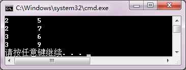

<!-- page: 45 -->

（1）任务划分，把一个复杂任务划分为若干小任务，便于分工处理和验证程序正确性；（2）软件重用，

把一些功能相同或相近的程序段，独立编写成函数，让应用程序随时调用，而不需要编写雷同的代码。

函数的定义形式：
类型  函数名 （ [ 形式参数表 ] ）
{
     语句序列
}

函数原型是函数声明，告诉编译器函数的接口信息：函数名、返回数据类型、接收的参数个数、参数

类型和参数顺序，编译器根据函数原型检查函数调用的正确性。

2．什么叫函数值的返回类型？什么叫函数的类型？如何通过指向函数的指针调用一个已经定义的函

数？编写一个验证程序进行说明。

【解答】

（1）函数的返回类型是函数返回的表达式的值得类型；

（2）函数类型是指函数的接口，包括函数的参数定义和返回类型；

（3）若有

functionType functionName;
//functionType 是已经定义的函数类型

functionType *functionPointer=functionName;
//定义函数指针并获取函数地址

则可以通过函数指针调用函数：

(*functionPointer)(argumentList);

或
functionPointer(argumentList)；

其中argumentList 是实际参数表。

验证程序：

#include<iostream>

using namespace std;

int main()

{

typedef int myfunc(int,int);

  myfunc f,*fp;

  int a=10,b=6;

  fp=f;

  cout<<"Using f(a):"<<f(a,b)<<endl;
//函数名调用函数

  cout<<"Using fp(a):"<<fp(a,b)<<endl;
//函数指针调用函数

  cout<<"Using (*fp)(a):"<<(*fp)(a,b)<<endl; //函数指针调用函数

  return 0;

}

int f(int i,int j)

{

return i*j;

}

3．什么叫形式参数？什么叫实际参数？C++函数参数有什么不同的传递方式？编写一个验证程序进

行说明。

【解答】

参数是调用函数与被调用函数之间交换数据的通道。函数定义首部的参数称为形式参数，调用函数时

使用的参数称为实际参数。C++有三种参数传递机制：值传递（值调用）；指针传递（地址调用）；引用传

递（引用调用）。

<!-- page: 46 -->

 验证程序：

#include<iostream>

using namespace std;

void funcA(int i)

{ i=i+10; }

void funcB(int *j)

{ *j=*j+20; }

void funcC(int &k)

{ k=k+30; }

int main()

{ int a=1;

  funcA(a);cout<<"a="<<a<<endl;

  funcB(&a);cout<<"a="<<a<<endl;

  funcC(a);cout<<"a="<<a<<endl;

}

程序输出：

a=1
//传值参数，实际参数值不变

a=21
//指针参数，形式参数通过间址修改实际参数

a=51
//引用参数，形式参数通过别名方式修改实际参数

4．C++函数通过什么方式传递返回值？当一个函数返回指针类型时，对返回表达式有什么要求？若

返回引用类型时，是否可以返回一个算术表达式？为什么？

【解答】

C++首先计算表达式的值，然后把该值赋给函数返回类型的匿名对象，通过这个对象，把数值带回调

用点，继续执行后续代码。

当函数返回指针类型时，返回的地址值所指对象不能是局部变量。因为局部变量在函数运行结束后会

被销毁，返回这个指针是毫无意义的。

返回引用的对象不能是局部变量，也不能返回表达式。算术表达式的值被储存在匿名空间中，函数运

行结束后会被销毁，返回这个变量的引用也是无意义的。

5．变量的生存期和变量作用域有什么区别？请举例说明。
【解答】

变量的生存期是指程序运行后，变量占有内存的时间；变量作用域指的是指变量声明之后，在程序正

文中有效的那部分区域。

例如，定义函数:

void count()

{ static int n=0;

  //……

}

该函数中n 被定义为static 变量，生存期是整个程序运行时期；但作用域只在count 函数中。

6．静态局部变量有什么特点？编写一个应用程序，说明静态局部变量的作用。
【解答】

静态局部变量的生存期是全程的，作用域是局部的。程序开始执行时就分配和初始化存储空间（默认

初始化值为0）。定义静态局部变量的函数退出时，系统保持其存储空间和数值。再次调用这个函数时，static

变量还是上次退出函数时的值。直至整个程序运行结束，系统才收回存储空间。

<!-- page: 47 -->

验证程序：

以下程序在函数callfun 中定义了静态变量n，记录的函数本身被调用的次数。

#include<iostream>
using namespace std;
void callfun()
{
static int n=0;

   n++;
   if(n<=3)
    {
  cout<<"被调用了"<<n<<"次\n";
  callfun();
 }
   }
int main()
{
 callfun();
 cout<<"不能再调用了\n";
}

7．在一个语句块中能否访问一个外层的同名局部变量？能否访问一个同名的全局变量？如果可以，

应该如何访问？编写一个验证程序进行说明。

【解答】

一个语句块中不能访问外层的同名局部变量。可以访问一个同名的全局变量。

验证程序：

#include<iostream>

using namespace std;

int a=0;
//全局变量a

int main()

{ int a=1;
//外层局部变量a

  { int a=2;
//内层局部变量a

    cout<<"Local a is "<<a<<endl;
//输出内层局部变量a

  }

  cout<<"Main a is "<<a<<endl;
//输出外层局部变量a

  cout<<"Global a is "<<::a<<endl;
//输出全局部变量a

}

8．有函数原型：

void f (int & n) ;

和函数调用：

int a;

//…

f(a);

有人说，因为n 是a 的引用，在函数f 中访问n 相当于访问a，所以，可以在f 的函数体内直接使用变量名

a。这种说法正确吗？为什么？编写一个验证程序。

【解答】

形式参数n 的作用域是f 函数，实际参数a 的作用域是调用f 函数的模块（例如main 函数），所以在f

函数中可见n 而不可见a。因此，这种说法不正确。f 函数内不能直接使用变量名a，只能通过别名n 访问

a。

验证程序：

<!-- page: 48 -->

#include<iostream>

using namespace std;

void f ( int&n );

int main()

{

 int a = 1 ;

 f( a );

 cout<<"a="<<a<<endl;

}

void f ( int&n )

{

 a++;
//错误，直接使用a

 n++;
//正确

}

产生编译错误：error C2065: “a”: 未声明的标识符

9．有函数原型

double function(int,double);

函数function 的返回值类型是什么？函数的类型是什么？请用typedef 定义函数的类型。

若有函数调用语句

x=function(10,(2*(0.314+5));

其中的括号“()”与函数原型中括号有什么语义区别？

【解答】

函数function 的返回值类型是double

函数类型是： double (int,double)

可以定义为：
typedef double funType (int,double);

函数调用function(10,(2*(0.314+5)) 中，外层括号表示调用函数匹配的实际参数表，里面的两层括号是

表达式运算。

10．请分析以下各语句的意义。

int * fun() ;

int * (*pf)() ;

fun() ;

pf = fun ;

pf() ;

【解答】

int * fun() ;
//函数原型声明。fun 是返回int*类型，没有参数的函数

int * (*pf)();
//声明指针变量。pf 是指向函数的指针，函数类型为int*()

fun() ;
//调用函数语句

pf = fun ;
//向指针变量赋值。函数指针pf 指向函数fun

pf() ;
//用指针变量间址调用函数

<!-- question: cpp-032-Q35 -->

二、程序设计

t
t
t

−
−
=
。编写一个程序，输入x 的值，

x
y
x
x
+
=
+
，其中，sh 为双曲正弦函数，即
e
e
sh( )
2

1．已知
sh(1
sh )
sh2
sh3

求y 的值。

<!-- page: 49 -->

【解答】

#include<iostream>

#include<cmath>

using namespace std;

double sh( double t );

int main()

{

double x,y;

cout << "x=";

cin >> x;

y = sh( 1+sh(x) )/( sh( 2*x )+sh( 3*x ) );

cout << "y=" << y << endl;

}

double sh( double t )

{

return ( exp( t )-exp( -t ) )/2;

}

3
3
3

m
n

5
5
5
1
2
1
2

+
+
+
+
+
+
+




2．输入m、n 和p 的值，求s =

的值。注意判断运算中的溢出。

p

1
2

+
+
+



【解答】

#include<iostream>

using namespace std;

double f( long k,long num );

int main()

{

long m, n, p;

double s, f1, f2, f3;

cout << "m, n, p = ";

cin>>m>>n>>p;

f1=f( 1, m );

f2=f( 3, n );

f3=f( 5, p );

if ( f1&&f2&&f3 )

{

s = ( f1 + f2) /f3;

cout << "s=" << s << endl;

}

else

cout<<"溢出!\n";

}

double f( long k,long num )

{

long i;

double sum=0;

for( i=1; i<=num && sum<2147483647; i++ )

sum = sum + pow( double (i),double (k) );

<!-- page: 50 -->

if (i<=num)

return 0;   //溢出时返回

return sum;

}

3．输入a、b 和c 的值，编写一个程序求这三个数的最大值和最小值。要求：把求最大值和最小值操

作分别编写成一个函数，并使用指针或引用作为形式参数把结果返回main 函数。

【解答】

（1）使用指针参数

#include<iostream>

using namespace std;

void fmaxmin( double,double ,double ,double *,double * );

int main()

{

double a,b,c,max,min;

cout << "a,b,c = ";

cin >> a >> b >> c;

fmaxmin( a,b,c,&max,&min );

cout << "max=" << max << endl;

cout << "min=" <<min << endl;

}

void fmaxmin( double x,double y,double z,double *p1,double *p2 )

{

double u,v;

if ( x>y )

  { u = x; v = y; }

    else

  { u = y; v = x; };

if ( z>u ) u = z;

if ( z<v ) v = z;

*p1 = u;

*p2 = v;

}

（2）使用引用参数

#include<iostream>

using namespace std;

void fmaxmin( double,double ,double ,double& ,double& );

int main()

{

double a,b,c,max,min;

cout << "a,b,c=";

cin >> a >> b >> c;

fmaxmin( a,b,c,max,min );

cout << "max=" << max << endl;

cout << "min=" << min << endl;

}

<!-- page: 51 -->

void fmaxmin( double x,double y,double z,double &p1,double &p2 )

{

double u,v;

if ( x>y )

{ u = x; v = y; }

else

{ u = y; v = x; };

if ( z>u ) u = z;

if ( z<v ) v = z;

p1 = u;

p2 = v;

}

4．用线性同余法生成随机数序列的公式为：

rk = (multiplier × rk−1 + increment) % modulus

序列中的每个数rk 都可以由它的前一个数rk−1 计算出来。例如，如果有：

rk = (25 173 × rk−1 + 13 849) % 65 536

则可以产生65 536 个各不相同的整型随机数。设计一个函数作为随机数生成器，生成1 位或2 位的随     机

数。

利用这个随机数生成器，编写一个小学生学习四则运算的练习程序，要求：

① 可以进行难度选择，一级难度只用1 位数，二级难度用2 位数；

② 可以选择运算类型，包括加、减、乘、除等；

③ 给出错误提示；

④ 可以统计成绩。

【解答】

#include<iostream>

using namespace std;

int Rand(int,int);
    //生成指定范围的随机数

int main()

{

int w,i,r,t = 0;

char op,answer;

int a,b,d;

while(1)
//练习开始

{

cout<<"现在开始？( Y 或 N )\n" ;

cin>>answer;

if (answer=='N'||answer=='n') break;

while(1)

{

cout << "请输入难度( 1或2 ):";

cin >> w;

if ( w != 1 && w != 2 )

cout << "输入难度错误，重新输入！" << endl;

else break ;

}

<!-- page: 52 -->

while(1)

{

cout << "请输入运算类型( +,-,*,/ ):" ;

cin >> op;

if ( op != '+' && op != '-' && op != '*' && op != '/' )

cout << "输入运算符错误，重新输入！" << endl;

else

break;

}

//出10道题，每题10分

t=0;

for( i=1; i<=10; i++ )

{

while(1)

{

if( w == 1 )

{ a = Rand(0,10); b = Rand(0,10); }

else

if( w == 2 )

{ a = Rand(10,100); b = Rand(10,100); }

if ( op == '-' )

if ( a<b ) continue ;
//使被减数大于减数

if ( op == '/' )

if ( int( a/b ) != (a / b) ) continue;
//只做结果为整数的除法

break;

}

cout << a << op << b << '=';

cin >> d;

switch ( op )

{

case '+': r = a + b; break;

case '-': r = a - b; break;

case '*': r = a * b; break;

case '/': r = a / b; break;

}

if ( r == d )

{

cout << "你算对了，加10分！" << endl;

t = t + 10;

}

else

cout << "你算错了！" << endl;

}

cout << "你的成绩是：" << t << "分" << endl;

}

}

<!-- page: 53 -->

int Rand(int m, int n)

{

static int r;
//静态变量保留上一个随机数

do

{

r = ( 25173*r + 13849 ) % 65536 ;

} while (r<m||r>=n);

return r;

}

5．已知勒让德多项式为：

n
p
x
x
n
n
p
x
n
p
x
n
n
−
−

1
0
( )
1
((2
1)
( )
(
1)
( ))/
1

=


=
=


−
−
−
>


n

n
n

1
2

编写程序，从键盘输入x 和n 的值，使用递归函数求pn(x)的值。

【解答】

#include<iostream>

using namespace std;

double p( double x,int n );

int main()

{

int n;

double x;

cout << "please input x and n:";

cin >> x >> n;

cout << "p(" << x << "," << n << ")=" << p( x,n ) <<endl;

}

double p( double x,int n )

{

double t1,t2;

if( n == 0 )

return 1;

else

if( n == 1 )

return x;

else

{

t1 = ( 2*n-1 )*p( x,n-1 );

t2 = ( n-1 )*p( x,n-2 );

        return ( t1-t2 )/n;

}

}

6．把以下程序中的print()函数改写为等价的递归函数。
#include <iostream>

<!-- page: 54 -->

using namespace std;
void print( int w )
{  for( int i = 1 ; i <= w ; i++ )
   {  for( int j = 1 ; j <= i ; j++ )
      cout << i << " " ;
      cout << endl ;
   }
}
int main()
{  print( 5 ) ;  }

【解答】

#include<iostream>

using namespace std;

void print(int w)

{

int i;

if( w )

{

print( w-1 );

for( i=1; i<=w; i++ )

cout << w << "  ";

cout << endl;

 }

}

void main()

{

print( 5 );

}

n

7．已知用梯形法求积分的公式为：
1

−

h f a
f b
T
h
f a
ih

( ( )
( ))
(
)
2

+
=
+
+
∑
，其中，h = (b−a) / n，n 为积

n

i

=

1

分区间的等分数，编程求如下积分的值。要求：把求积分公式编写成一个函数，并使用函数指针作为形式

参数。调用该函数时，给出不同的被积函数作为实际参数求不同的积分。

π
∫

2
0
4
d
1
x
x
+
∫
      ②

1

2
2

1
1
d
x
x
+
∫
      ③
2
0 sin d
x x

①

【解答】

#include<iostream>

#include<cmath>

using namespace std;

double f1( double x )

{

return 4 / ( 1 + x*x );

}

double f2( double x )

{

return sqrt( 1 + x*x );

}

double f3( double x )

<!-- page: 55 -->

{

return sin( x );

}

double trap( double( *fun )( double x ), double a, double b, long n )

{

double t,h;  int i;

t = ( ( *fun )(a) + ( *fun )( b ) ) / 2.0;

h = ( b - a ) / n;

for( i=1; i<=n-1; i++ ) t += ( *fun )( a + i * h );

t *= h;

return t;

}

int main()

{

double t1,t2,t3;

t1 = trap( f1,0,1,10000 );

cout << "t1=" << t1 << endl;

t2 = trap( f2,1,2,10000 );

cout << "t2=" << t2 << endl;

t3 = trap( sin,0,3.14159265/2,10000 );

cout << "t3=" << t3 << endl;

}

8．使用重载函数编程序分别把两个数和三个数从大到小排列。

【解答】

#include<iostream>

using namespace std;

void sort( double x,double y );

void sort( double x,double y,double z );

int main()

{

sort( 5.6, 79 );

sort( 0.5, 30.8, 5.9 );

}

void sort(double x,double y)

{

if ( x>y )

cout << x << '\t' << y << endl;

else

cout << y << '\t' << x << endl;

}

void sort( double x,double y,double z )

{

double t;

if( y<z ) { t = y; y = z; z = t; }

if( x<z ) { t = x; x = z; z = t; }

<!-- page: 56 -->

if( x<y ) { t = x; x = y ;y = t; }

cout << x << '\t' << y << '\t' << z << '\t' << endl;

}

9．猜数游戏。玩家想好了一个1～1000 之内的整数，由计算机来猜这个数。如果计算机猜出的数比

玩家想的数大，则玩家输入1；如果计算机猜出的数比玩家想的数小，则玩家输入−1；这个过程一直进行

到计算机猜中为止，玩家输入0。

【解答】

#include<iostream>

using namespace std;

int guess(int k=0);

int main()

{

int answer,t=1;

cout<<"请你想好一个1～1000之内的整数，别告诉我，让我来猜猜！\n";

cout<<"猜中了，请输入0；若猜的数小了，请输入-1；若猜的数大了，请输入1\n";

cout<<"开始猜了……\n";

cout<<"是 "<<guess()<<" 吗？\t";

while(1)

{

 cin>>answer;

 if(answer==0)

 {

    cout<<"我猜中啦！只猜了 "<<t<<" 次，很强吧！\n";

    break;

 }

 cout<<"是 "<<guess(answer)<<" 吗？\t";

 t++;

}

}

int guess(int k)

{

static int min=1;

static int max=1000;

static int g = 500;

switch(k)

{

 case 0:
break;

 case 1:
max=g-1; break;

 case -1:
min=g+1;  break;

 default :
cout<<"你输入错了，请再输入。\n";    return g;

}

if(max<min)

{

 cout<<"你耍赖…不跟你玩了！\n";

 exit(0);

}

<!-- page: 57 -->

g=(min+max)/2;

return g;

}

m
C
n m
n
=
−
，编一程序，输入m 和n 的值，求
n
m
C 的值。注意优化算

10．给定求组合数公式为：
!
!(
)!

n
m

法，降低溢出可能。要求：主函数调用以下函数求组合数：

int Fabricate(int m, int n);
//返回
n
m
C 的值

在Fabricate 函数内需调用Multi 函数：

int Multi(int m, int n);
//返回
(
1)
m
m
n
×
−
×
×

…

程序由4 个文件组成。头文件用于存放函数原型，作为调用接口；其他三个.cpp 文件分别是main、

Fabricate 和Multi 函数的定义。

【解答】

//Fabricate.h

#ifndef FABRICATE_H

#define FABRICATE_H

int Fabricate( int m,int n );

int Multi( int m, int n );

#endif

//main.cpp

#include<iostream>

using namespace std;

#include "Fabricate.h"

int main()

{

int m ,n;

cout << "input m and n:";

cin >> m >> n;

cout << "Fabricate(" << m << "," << n << ")=" << Fabricate( m, n ) << endl;

}

//Fabricate.cpp

#include "Fabricate.h"

int Fabricate( int m, int n )

{

return Multi( m, m-n + 1 ) / Multi( n, 1 );

}

//Multi.cpp

int Multi( int m, int n )

{

int i, t = 1;

for( i=n; i<=m; i++ )

t = t * i;

return t;

}

<!-- page: 58 -->

第4 章习题与解答

同步练习4.1

<!-- question: cpp-032-Q36 -->

一、选择题

1．有数组定义  double d[10];  以下叙述不正确的是（    ）。

（A）数组d 有10 个元素
（B）数组d 的最后一个元素是d[10]

（C）数组d 的第一个元素*d
（D）数组d 的字节数是sizeof(double)*10

2．以下对一维数组a 的定义正确的是（    ）。

（A）int n = 5, a[n];
（B）int a(5);

（C）const int N = 5; int a[N];
（D）int n;  cin>>n;  int a[n];

3．下列数组定义语句中，不合法的是（    ）。

（A）int a[3] = { 0, 1, 2, 3 };
（B）int a[] = { 0, 1, 2 };

（C）int a[3] = { 0, 1, 2 };
（D）int a[3] = { 0 };

4．已知 int a[10] = { 0, 1, 2, 3, 4, 5, 6, 7, 8, 9 }, ∗p = a;  以下不能表示数组 a 中元素的表达式是（    ）。

（A）∗a
（B）∗p
（C）a
（D）a[ p-a ]

5．已知 int a[] = { 0,2,4,6,8,10 }, ∗p = a+1; 其值等于0 的表达式是（    ）。

（A）∗ (p++)
（B）∗(++p)
（C）∗(p--)
（D）∗(--p)

【解答】
B
C
A
C
D

<!-- question: cpp-032-Q37 -->

二、程序练习

1．阅读程序，写出运行结果。
#include <iostream>
using namespace std;
int main()
{ int i, count=0, sum=0;

double average;
int a[] = { 1, 2, 3, 4, 5, 6, 7, 8, 9, 10 };
for( i=0; i<10; i++ )
{    if( a[i] % 2 == 0 )
        continue;

sum += a[ i ];
count++;
}
average = sum/count;
cout << "count = " << count << '\t' << "average = " << average << endl;
}
【解答】

2．阅读程序，写出运行结果。
#include <iostream>
using namespace std;

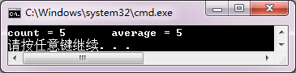

<!-- page: 59 -->

int main()
{  int a[9] = { 1, 2, 3, 4, 5, 6, 7, 8, 9 };

int *p = a, sum = 0;
for(; p<a+9; p++ )
   if(*p % 2 == 0 )

  sum += *p;
cout << "sum = " << sum << endl;
}
【解答】

3．设计一个程序，要求有以下功能：

（1）声明一个长度为10 的整型数组；

（2）输入数组元素；

（3）寻找数组中的最大值元素和这个元素的下标；

（4）输出最大值元素的值和它的下标值。

【解答】

#include<iostream>

#include<cstdlib>

using namespace std;

int main()

{

    int a[10],max,i,j;

    cout<<"请输入10 个数：";

    for( i=0;i<10;i++)

    {

        cin>>a[i];

    }

    max=0;
//记录最大元素的下标

    for(j=0;j<10;j++)

    {

        if(a[j]>=a[max])
//用当前最大元素与遍历元素比较

        max=j;
//修改最大下标值

    }

    cout<<"最大值为："<<a[max]<<endl;

cout<<"它的下标为："<<max<<endl;

}

同步练习4.2

<!-- question: cpp-032-Q38 -->

一、选择题

1. 说明一个长度为10 的数组，元素类型为整型指针的正确语句是（    ）。

（A）int *pary[10];
（B）int (*pary)[10]

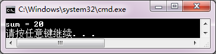

<!-- page: 60 -->

（C）int *pary(10);
（D）int **pary[10]

2. 有以下语句，则能够输出a+b+c 的值的语句是（    ）。

int a=1, b=2, c=3; int *pary[3]={&a, &b, &c};

（A）cout<<(pary[0]+pary[1]+pary[2]);
（B）cout<<(*pary[0]+*pary[1]+*pary[2]);

（C）cout<<(pary[1]+pary[2]+pary[3]);
（D）cout<<(*pary[1]+*pary[2]+*pary[3]);
【解答】 A
B

<!-- question: cpp-032-Q39 -->

二、程序练习

使用以下语句：

const int n=20;
int a[n];  int *pa[n];  int i;
for(i=0; i<n; i++)
   a[i]=i+1;

编写完整的程序，通过pa 数组修改数组a 元素的值，使其元素值自增10，然后通过pa 数组遍历a 数组，

输出全部元素值，要求每行输出10 个元素。
【解答】

#include<iostream>

using namespace std;

int main()

{

const int n=20;

int a[n];

int *pa[n];

int i;

for(i=0; i<n; i++)

{

a[i]=i+1;

pa[i]=a+i;
//对指针数组元素赋值

*pa[i]+=10;
//数组元素值自增10

cout<<*pa[i]<<"  ";
//输出数组元素

if((i+1)%10==0)
//格式控制

cout<<endl;

}

}

同步练习4.3

<!-- question: cpp-032-Q40 -->

一、选择题

1．以下不能对二维数组a 进行正确初始化的语句是（    ）。

（A）int a[2][3] = { 0 };

（B）int a[][3] = { { 0,1 }, { 0 } };

（C）int a[2][3] = { { 0, 1 }, { 2, 3 }, { 4, 5 } };

（D）int a[][3] = { 0, 1, 2, 3, 4, 5 };

2．已知  int a[][3] = { { 0, 1 }, { 2, 3, 4 }, { 5, 6 }, { 7 } };  则 a[2][1]的值是（    ）。

（A）0
（B）2
（C）6
（D）7

<!-- page: 61 -->

3．已知  int a[3][3] = { 1, 2, 3, 4, 5, 6, 7, 8, 9 };  以下不能表示数组元素a[2][1]的地址是（   ）。

（A）&a[2][1] （B）∗(a[2]+1)     （C）a[2]+1
     （D）∗(a+2)+1

4. 有以下说明语句，则正确的赋值语句是（    ）。

int a[5][5];  int *p, **q;

（A）p=a;
（B）p=*a;
（C）q=a;
（D）q=*a;

5. 有以下说明语句，则正确的赋值语句是（    ）。

int a[5][5];  int *p, **q;

（A）p=a[0];
（B）p=&a[0];
（C）q=a[0];
（D）q=&a[0][0];

【解答】
 C
C
B
B
A

<!-- question: cpp-032-Q41 -->

二、程序练习

1．阅读程序，写出运行结果。
#include <iostream>
#include <iomanip>
using namespace std;
const int N = 5;
int main()
{  int a[N][N]={ 0 }, i, j, k;
   for( k=1, i=0; i<N; i++ )
      for( j=i; j>= 0; j--, k++ )
         a[j][i - j ] = k;
   for( i=0; i<N; i++ )
   {  for( j=0; j<N; j++ )
         cout << setw( 3 ) << a[i][j];
      cout << endl;
   }
}
    【解答】

2．以下程序用于输入一个矩阵的元素，并输出指定行的元素。请补充inputAry 函数和outputAry 函数。
#include<iostream>
using namespace std;
const int N=5;
int main()
{  int ary[N][N], k;
   inputAry(ary, N);
   cout<<"输入行号，k = ";
   cin>>k;
   outputAry(ary, N, k-1);
}

#include<iostream>

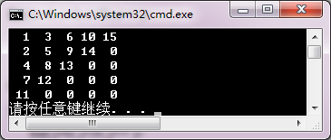

<!-- page: 62 -->

using namespace std;

const int N=5;

void inputAry(int ary[N][N], int n );

void outputAry(const int ary[N][N], int n, int line);

int main()

{

int ary[N][N], k;

inputAry(ary, N);

cout<<"输入行号，k = ";

cin>>k;

outputAry(ary, N, k-1);

}

void inputAry(int ary[N][N], int n)

{

cout<<"输入"<<n<<"*"<<n<<"个矩阵元素\n";

for(int i=0; i<n; i++)

for(int j=0; j<n; j++)

cin>>ary[i][j];

}

void outputAry(const int ary[N][N], int n, int k)

{

for(int i=0; i<n; i++)

cout<<ary[k][i]<<"  ";

cout<<endl;

}

同步练习4.4

<!-- question: cpp-032-Q42 -->

一、选择题

1．若用数组名作为调用函数的实参，则传递给形参的是（    ）。

（A）数组存储首地址
（B）数组的第一个元素值

（C）数组中全部元素的值
（D）数组元素的个数

2．有说明语句：int a[10];

及函数：int fun(int x[10], int n)  {  return sizeof(x);  }

则语句  cout<<fun(a,10)<<endl;  的显示结果是（    ）。

（A）40
（B）10
（C）4
（D）0

3．有以下说明语句，则调用函数的正确语句是（    ）。
int a[10];
void fun( int * ,int n);

（A）fun(a, 10);
（B）fun(a[0], 10);
（C）fun(*a, 10);
（D）fun(&a, 10);

4．有以下说明语句，则调用函数的正确语句是（    ）。
int b[4][5];
void fun( int * ,int n);

（A）fun(b, 20);
（B）fun(b[0], 20);
（C）fun(b[0][0], 20); （D）fun(&b, 20);

<!-- page: 63 -->

5. 有以下说明语句，则调用函数的正确语句是（    ）。
int x[4][5];
void fun( int y[4][5] , int m, int n);

（A）fun(x, 4,5);
（B）fun(*x, 4,5);
（C）fun(x[0], 4,5);
（D）fun(&x, 4,5);

【解答】
A
C
A
B
A

<!-- question: cpp-032-Q43 -->

二、程序练习

1．阅读程序，写出运行结果。
#include <iostream>
using namespace std;
int f(int [],int);
int main()
{  int a[] = { -1, 3, 5, -7, 9, -11 };
   cout << f( a, 6 ) << endl;
}
int f( int a[], int size )
{  int i, t=1;
   for( i=0; i<size; i ++ )
      if( a[i]>0 )   t*= a[i];
   return t;
}
   【解答】

2．阅读程序，写出运行结果。
#include <iostream>
using namespace std;
int f( int [][3], int, int );
int main()
{  int a[][3] = { 0, 1, 2, 3, 4, 5, 6, 7, 8 };
   cout << f( a, 3, 3 ) << endl;
}
int f( int a[][3], int row, int col )
{  int i, j, t=1;
   for( i=0; i<row; i++ )
      for( j=0; j<col; j++ )
      {  a[i][j]++;
         if( i == j )  t *= a[i][j];
      }
   return t;
}
  【解答】

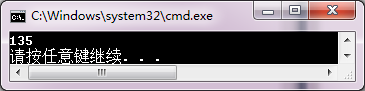

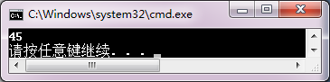

<!-- page: 64 -->

3．本程序的main 函数定义了一个用二维数组m 表示的6×6 方阵。程序中：

（1）调用setMatrix 函数，对方阵元素赋不大于100 的随机整数；

（2）调用diagonal 函数，依次把m 阵的主对角线、次对角线放在数组a 中。

请补充定义setMatrix 函数和diagonal 函数，使其成为完整程序。

#include<iostream>
#include <cstdlib>
#include<ctime>
using namespace std;
const int N=6;
int main()
{  int m[N][N],a[2*N],i,j;
   setMatrix( m, N*N );
//调用函数，对方阵元素赋不大于100 的随机整数
   cout<<N<<"*"<<N<<"方阵:\n";
   for( i=0; i<N; i++ )
//输出方阵元素
   {  for(j=0;j<N; j++)
         cout<<m[i][j]<< '\t';
      cout<<endl;
   }
   diagonal( m, a, N );
//调用函数，依次把m 阵的主对角线、次对角线放在数组a 中
   cout<<"对角线元素：\n";
   for( i=0; i<2*N; i++ )
//输出对角线元素
      cout<<a[i]<<"  ";
   cout<<endl;
}

 【解答】

  void setMatrix( int matrix[][N],int n )
//matrix 是二维数组参数

  { int i,*p;
//p 是一级指针变量

    p=*matrix;
//二维数组作降维处理

    srand(unsigned(time(0)));

    for( i=0; i<n; i++,p++ )

     *p= rand()%100;
//对数组元素赋随机数

   }

  void diagonal( int matrix[][N], int *ary, int n)

  { int i;

    for (i=0;i<n;i++)

    {
ary[i]= matrix[i][i];
//主对角线

  ary[i+n]= matrix[i][n-i-1];
//次对角线

    }

   }

同步练习4.5

<!-- question: cpp-032-Q44 -->

一、选择题

1. 以下建立动态存储的语句正确的是（    ）。

（A）int p=new int;
（B）int p=new (10);

（C）int *p(10);
（D）int *p=new int(10);

<!-- page: 65 -->

2. 以下建立动态存储的语句正确的是（    ）。

（A）int p=new int[];
（B）int p=new [10];

（C）int *p=new int[10];
（D）int *p[10]=new int;

3. 有说明语句，则释放动态数组的正确语句是（    ）。
int *p=new int[10];

（A）delete []p;
（B）delete p[]

（C）delete int[]p
（D）delete p int[10]

4. 有说明语句，则访问动态数组元素的正确语句是（    ）。
int *p=new int[10];

（A）int a=p;
（B）int a=&p;

（C）int* a=p[1]
（D）int a=p[1];

【解答】
D
C
A
C

<!-- question: cpp-032-Q45 -->

二、程序练习

1．阅读程序，写出运行结果。
#include <iostream>
using namespace std;
int main()
{  int *p;
   cout << "test1: \n" ;
   p= new int( 5);
   cout<<*p << endl;
   p= new int[5];
   cout << "test2: \n";
   for(int i=0; i<5; i++)
   {  *(p+i)=i+1;
      cout <<*(p+i) << "\t";
   }
   cout<<endl;
}

【解答】

2．阅读程序，写出运行结果。
#include <iostream>
using namespace std;
void test1( int *a1 )
{  a1 = new int( 5 );
   cout << "*a1 = " << *a1 << endl;
}
void test2(int * & a2)
{  a2 = new int( 5 );
   cout << "*a2 = " << *a2 << endl;

<!-- page: 66 -->

}
int main()
{  int *p = new int( 1 );
   test1( p );
   cout << "test1: *p1 = " << *p << endl;
   test2( p );
   cout << "test2: *p2 = " << *p << endl;
}
【解答】

3．以下程序修改了同步练习4.3 程序练习第2 题中程序的主函数，请补充inputAry 函数和outputAry

函数，使程序完成相同的功能。

#include<iostream>
using namespace std;
int main()
{  int *pa, n, k;
   cout<<"输入矩阵的阶，n = ";
   cin>>n;
   pa=new int[n*n];
   inputAry(pa, n);
   cout<<"输入行号，k = ";
   cin>>k;
   outputAry(pa, n, k-1);
}

【解答】

#include<iostream>

using namespace std;

void inputAry(int *ary, int n );

void outputAry(const int *ary, int n, int k);

int main()

{

int *pa, n, k;

cout<<"输入矩阵的阶，n = ";

cin>>n;

pa=new int[n*n];

inputAry(pa, n);

cout<<"输入行号，k = ";

cin>>k;

outputAry(pa, n, k-1);

}

void inputAry(int *ary, int n)

{

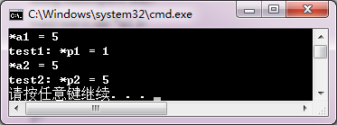

<!-- page: 67 -->

cout<<"输入"<<n<<"*"<<n<<"个矩阵元素\n";

for(int i=0; i<n*n; i++)

cin>>ary[i];

}

void outputAry(const int *ary, int n, int k)

{

for(int i=0; i<n; i++)

cout<<ary[n*k+i]<<"  ";

cout<<endl;
}

同步练习4.6

<!-- question: cpp-032-Q46 -->

一、选择题

1．程序中使用vector 类需要包含文件是（    ）。

（A）iostream
（B）cmath

（C）vector
（D）cstdlib

2．正确声明一个向量的语句是（    ）。

（A）vector [10];
（B）vector int[10];

（C）vector int[10](0);
（D）vector <double> (10);

3．要把一个4*5 矩阵的整型数据放在一个vector 变量中，则这个变量的正确声明语句是（    ）。

（A）vector <int> m(4, 5);
（B）vector< vector<int> > m(4, 5);

（C）vector <int> m [4, 5];
（D）vector< vector<int> > m(4, vector<int>(5));

4．设有语句

vector<int> a(5, 10);  vector<int> b(10, 5);

则以下语句结果等于0 的表达式是（    ）。

（A）a<b
（B）a>b
（C）a>=b
（D）a!=b

5．设有语句

vector<int> a(5, 0);  vector<int> b(5，5);

执行（    ）操作后，使得a.size()的值等于0。

（A）a.empty()
（B）a.clear()
（C）a.swap(b)
（D）a.erase(a.begin())

6. 假设有说明：vector<int> a(10); ，删除向量a 序号为3 元素正确的语句是（    ）。

（A）a.clear(3)；
 （B）a.erase( 3);

（C）a.erase(a.begin() + 3);
     （D）a.erase(a[3]；

7. 假设有说明：vector<int> b(10); ，将10，20 和30 插入到向量b 的起始位置前正确的语句是（    ）。

      （A）b.insert(a.begin(), 10);
         （B）b.insert(a.begin(), 30);

       b.insert(a.begin(), 20);
 b.insert(a.begin(), 20);

     b.insert(a.begin(), 30);
 b.insert(a.begin(), 10);

（C） b.insert(a.begin(), 30，20，10);       （D） b.insert(a.begin(), 10，20，30);

【解答】
C    D    D     A     B     C
B

<!-- question: cpp-032-Q47 -->

二、程序练习

 1.阅读程序，写出运行结果。

 #include <vector>

<!-- page: 68 -->

#include <iostream>

int main()

{

using namespace std;

vector <int> a;

vector <int>b;

int i;

for (i = 0; i <5; i++)

a.push_back(i);

a.pop_back();

a.insert(a.begin()+3, 3, 10);

cout << "a:\t";

for (i = 0; i < a.size(); i++)

cout << a[i] << "\t";

cout << endl;

cout << "a.size = " << a.size() << endl;

b = a;

b.erase(b.begin(), b.begin() + 5);

cout << "b:\t";

for (i = 0; i < b.size(); i++)

cout << b[i] << "\t";

cout << endl;

cout << "b.size = " << b.size() << endl;

}

2.阅读程序，写出运行结果。

#include<iostream>

#include<cmath>

#include<vector>

using namespace std;

int main()

{

vector<int> a(3);

vector<int> b(3);

int i, g = 0;
double m = 0;

for (i = 0; i < a.size(); i++)

a[i] = i - 1;

cout << "向量 a： ";

for (i = 0; i < a.size(); i++)

cout << a[i] << " ";

cout << endl;

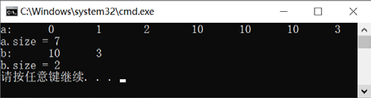

<!-- page: 69 -->

for (i = 0; i < a.size(); i++)

m = m + a[i] * a[i];

cout << "m = " << sqrt(m) << " ";

cout << endl;

b = a;

cout << "向量 b： ";

for (i = 0; i < b.size(); i++)

cout << b[i] << " ";

cout << endl;

for (i = 0; i < a.size(); i++)

g = g + a[i] * b[i];

cout << "g = " << g << " ";

cout << endl;

}

【解答】

同步练习4.7

<!-- question: cpp-032-Q48 -->

一、选择题

1．已知  char ∗a[]={ "fortran", " basic", "pascal", "java", "c++" };  则 cout<<a[3];的显示结果是（    ）。

（A）t
（B）一个地址值
（C）java
（D）javac++

2．设有  char ∗s="ABCDE"; cout<<*(s+1)<<endl;  输出结果是（    ）。

（A）A
（B）B
（C）ABCD
（D）BCD

3．设有  char ∗s="ABCDE"; cout<<(s+1)<<endl;  输出结果是（    ）。

（A）A
（B）B
（C）ABCD
（D）BCDE

4．设有  char ∗s="ABCDE"; cout<<strlen(s)<<endl;  输出结果是（    ）。

（A）6
（B）5
（C）4
（D）1

5．设  char ∗s1, ∗s2;  分别指向两个字符串，可以判断字符串s1 和s2 是否相等的表达式为（    ）。

（A）s1=s2
（B）s1==s2

（C）strcpy(s1,s2)==0
（D）strcmp(s1,s2)==0

6．设有 string s1="ABCDE", s2="FGH"; 以下输出字符串ABCDE 的语句是（    ）。

（A）cout << (s1+s2)<< endl;
（B）cout << (s1 += s2) << endl;

（C）cout << (s2.assign(s1))<<endl;
（D）cout << (s1.assign(s2)) << endl;

7．设有 string s1="ABCDE"; s2="FGH"; 以下（    ）操作使得s1 的值为"ABCDEFGH"。

（A）s1.append(s2);
（B）s1.assign(s2);

（C）s2.insert(0, s1);
（D）s1.insert(0, s2);

8．设有 string s="ABBCCCDDDDEFG"; 以下（    ）语句输出值不等于5。

（A）cout << s.find('C',5) << endl;
（B）cout << s.find('C')<<endl;

（C）cout << s.find("CD") << endl;
（D）cout << s.find("CDD") << endl;

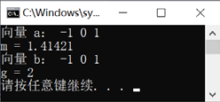

<!-- page: 70 -->

【解答】
C
B
D
B
D    C    A    B

<!-- question: cpp-032-Q49 -->

二、程序练习

1．阅读程序，写出运行结果。
#include <iostream>
using namespace std;
int main()
{  char s[] = "abccda";
   int i;  char c;
   for( i = 1; ( c=s[i] ) != '\0'; i++ )
   {  switch( c )
      {  case 'a' : cout << '%'; continue;
         case 'b' : cout << '\$'; break;
         case 'c' : cout << '*'; break;
         case 'd' : continue;
      }
      cout << '#' << endl;
   }
}
【解答】

2．阅读程序，写出运行结果。
#include <iostream>
using namespace std;
int main()
{  char *str[] = { "c++", "basic", "pascal" };
   char **p;  int i;
   p = str;
   for( i=0; i<3; i++ )
      cout << * ( p+i ) << endl;
}
【解答】

3．阅读程序，写出运行结果。
#include <iostream>
using namespace std;
int main()
{  char s1[] = "Fortran", s2[] = "Foxpro";

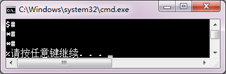

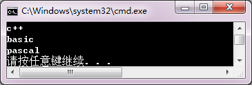

<!-- page: 71 -->

   char *p, *q;
   p = s1;  q = s2;
   while(*p && *q )
   {  if (*p == *q )
         cout << *p;
      p++;
      q++;
   }
   cout << endl;
}
【解答】

4．阅读程序，写出运行结果。
#include <cstring>
#include <iostream>
using namespace std;
int main()
{  char str[][10] = { "VB", "Pascal", "C++" }, s[10];
   strcpy_s( s, ( strcmp( str[0], str[1] ) < 0 ? str[0] : str[1] ) );
   if( strcmp( str[2], s ) < 0 )
      strcpy_s( s, str[2] );
   cout << s << endl;
}
【解答】

习题

<!-- question: cpp-032-Q50 -->

一、思考题

1．数组说明语句要向编译器提供什么信息？请写出一维数组、二维数组说明语句的形式。
【解答】

数组说明语句要向编译器提供数组名（标识符），数组元素的类型、数组维数、数组长度（元素的个数）
等信息。

一维数组说明语句为： 类型 数组名[表达式]

二维数组说明语句为： 类型 数组名[表达式1] [表达式2]

2．数组名、数组元素的区别是什么？归纳一维数组元素地址、元素值不同的表示形式。若有说明：
int aa [3], *pa=aa;

请使用aa 或pa，写出三个以上与aa[2]等价的表达式。

【解答】

数组名是一个标识符，执行代码中代表数组的地址，即指向数组起始位置的指针；而数组元素是下标

变量，性质相当于普通变量。

对一维数组aa 第i 个元素的地址可以表示为：
&aa[i]
aa+i;

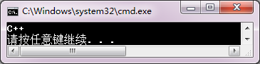

<!-- page: 72 -->

对一维数组aa 第i 个元素的值可以表示为：
a[i]
*(a+i);

与aa[2]等价的表达式：

*(aa+2)
*(&a[2])
*(pa+2)
pa[2]

3．要把一维数组int a[m*n] 的元素传送到二维数组int b[m][n]中，即在程序中要执行：
b[i][j]=a[k];

请写出k→i, j 的下标变换公式，并用程序进行验证。

4．有以下函数：
void query()
{  int *p;
   p=new int[3];
   //…
   delete []p;
   p=new double[5];
   //…
  delete []p;
}

出现了编译错误。请分析错误的原因，并把上述程序补充完整，上机验证你的判断。

【解答】

转换公式： i=k/n  j=k%n

验证程序：

#include <iostream>

using namespace std;

int main()

{

const int M=3,N=4;

  int k,a[M*N]={1,2,3,4,5,6,7,8,9,10,11,12}, b[M][N];

  int i,j;

  cout<<"array a:"<<endl;

  for( k=0; k<M*N; k++ )

     b[k/N][k%N] = a[k];

  for( k=0; k<M*N; k++ )

 cout<<a[k]<<'\t';

  cout<<endl;

cout<<"**After convert**"<<endl;

  cout<<"array b:"<<endl;

  for(i=0;i<M;i++)

  {

for(j=0;j<N;j++) cout<<b[i][j]<<'\t';

       cout<<endl;

  }

}

5．有以下程序，设计功能是调用函数create 建立并初始化动态数组，令a[i]=i。但该程序运行后不能

得到期望结果，请分析程序的错误原因并进行修改。

#include <iostream>
using namespace std;
void create(int *, int);

<!-- page: 73 -->

int main()
{  int *a = NULL, len;
   cin>>len;
   create(a,len);
   for( int i = 0; i<len; i++ )
   cout << a[i] << "   ";
   cout << endl;
   delete []a;
   a = NULL;
}
void create(int *ap, int n)
{  ap=new int[n];
   for(int i=0; i<n; i++) ap[i]=i;
}
<!-- question: cpp-032-Q51 -->

二、程序设计

n

n

=
= ∑

= ∑

2

s

s

1
(
ave)

−

i
i

i
i

1．已知求成绩的平均值和均方差公式：
1
ave

=

，其中，n 为学生人数，si

,

dev

n

n

为第i 个学生成绩。求某班学生的平均成绩和均方差。

【解答】

#include<iostream>

#include<cmath>

using namespace std;

void aveMsd( double [], int, double &, double & );
//求平均值和均方差值函数

int main()

{

double s[] = { 76, 85, 54, 77, 93, 83, 90, 67, 81, 65 };

double ave, msd;

int i,n;

n = sizeof( s )/sizeof( double );     //求数组元素的个数

cout<<"学生成绩：";

for( i=0; i<n; i++ )

  cout<<s[i]<<"  ";

cout<<endl;

aveMsd( s, n, ave, msd );

cout << "平均值：" << ave << endl << "均方差值：" << msd << endl;

}

void aveMsd( double s[], int n, double &ave, double &msd )

{

int i;

double sum1=0, sum2=0;

for( i=0; i<n; i++ )
//求平均值

   sum1 += s[i];

ave = sum1/n;

for( i=0; i<n; i++ )
//求均方差

   sum2 += pow( s[i]-ave, 2 );

msd = sqrt( sum2/n );

<!-- page: 74 -->

}

2．用随机函数产生10 个互不相同的两位整数存放到一维数组中，并输出其中的素数。

【解答】

#include<iostream>
#include<cmath>
#include <cstdlib>
#include<ctime>
using namespace std;
int main()
{

int a[10],i,j;
  srand( int( time(0)) );
//为随机数生成器设置种子值
  for( i=0; i<10; i++ )
  {

 l: a[i] = rand();
//产生随机数存放到数组中
       if ( a[i]<10 || a[i]>=100 )
//获取指定范围数据
goto l;
   for( j=0; j<i; j++ )
//排除相同数据
          if( a[i]==a[j] )

goto l;
  }
  for( i=0; i<10; i++ )
     cout << a[i] << "   ";
  cout << endl;
  for( i=0; i<10; i++ )
  {

double m=sqrt( double (a[i]) );
     for( j=2; j<=m; j++)
        if( a[i] % j == 0 )break;
     if( j>m )
       cout << a[i] << "   ";
  }
  cout << "是素数！" << endl;
}

3．将一组数据从大到小排列后输出，要求显示每个元素及它们在原数组中的下标。

【解答】

#include<iostream>

using namespace std;

int main()

{

int a[] = { 38, 6, 29, 1, 25, 20, 6, 32, 78, 10 };

  int index[10];
//记录下标的数组

  int i,j,temp;

  for( i=0; i<10; i++ )

     index[i] = i;

  for( i=0; i<=8; i++ )

     for( j=i+1; j<=9; j++ )

       if( a[i] < a[j] )

<!-- page: 75 -->

       {

temp = a[i]; a[i] = a[j]; a[j] = temp;

          temp = index[i]; index[i] = index[j]; index[j] = temp;

       }

  for( i=0; i<10; i++ )

     cout << a[i] << '\t' << index[i] << endl;

}

4．从键盘输入一个正整数，判别它是否为回文数。所谓回文数，是指正读和反读都一样的数。例如，

123321 是回文数。

【解答】

#include<iostream>

using namespace std;

int main()

{

int b[10], i, j, k, flag ;

  long num, n ;

  cout << "num=" ;  cin >> num;

  k = 0;

  n = num;

  do
                   //拆分整数，把各数字放入数组b

  {

b[k++] = n % 10;

     n = n/10;

  } while( n != 0);

  flag=1;
              //判断标志

  i=0; j=k-1;
              //设置指示下标的指针

  while(i<j)

    if( b[i++] != b[j--] )
//对称位置元素不相等

     {

 flag = 0;

       break ;

     }

  if( flag )  cout << num << "是回文数！" << endl;

  else  cout << num << "不是回文数！" << endl;

}

5．写一个合并函数，把两个升序排列的数组合并为一个升序数组。用随机数生成两个不等长有序数

组测试合并函数。请分别用数组和用vector 类实现。

【解答】

   （1）使用数组

#include<iostream>

using namespace std;

void merge(const int a[],int na, const int b[],int nb, int c[],int nc);

int main()

<!-- page: 76 -->

{

int a[4] = { 1, 2, 5, 7 };

  int b[8] = { 3, 4, 8, 8, 9, 10, 11, 12 };

  int c[12];

  int i;

  merge( a,4,b,8,c,12 );

  for( i=0; i<12; i++ )

    cout << c[i] << "   ";

  cout << endl;

}

void merge(const int a[],int na, const int b[],int nb, int c[],int nc)

{

int i,j,k;

  i = j = k = 0;

  while( i<na && j<nb )

  {

    if( a[i] > b[j] )
//当a[i]>b[j]，把b[i]写入数组c

      { c[k] = b[j];  k++;  j++; }

    else                           //当a[i]<=b[j]，把a[i]写入数组c

      { c[k] = a[i];  k++;  i++; }

}

  while( i<na )

  {

c[k] = a[i];  i++;  k++;
 //把数组a的剩余元素写入数组c

}

  while( j<nb )

  {

c[k] = b[j];  k++;  j++;
//把数组b的剩余元素写入数组c

}

}

（2）使用vector 类

#include<iostream>

#include<vector>

#include<algorithm>

#include<ctime>

using namespace std;

void set(vector<int> &a)

{
int i,k;

k= rand() % 100;

for (i = 0; i<k ; i++)

a.push_back(rand() % 100);

}

void merge(vector<int> &a, vector<int> &b)

{
a.insert(a.begin(), b.begin(), b.end());
//合并

sort(a.begin(),a.end());
//调用排序算法

}

<!-- page: 77 -->

int main()

{
vector<int> a; vector<int> b;

srand(int(time(0)));

set(a);

cout << "a:\n";

for (int i = 0; i <a.size(); i++)

cout << a[i] << '\t';

cout << endl;

set(b);

cout << "b:\n";

for (int i = 0; i <b.size(); i++)

cout << b[i] << '\t';

cout << endl;

merge(a,b);

cout << "merge:\n";

for (int i = 0; i <a.size(); i++)

cout << a[i] << '\t';

cout << endl;

}

6．输入一个表示星期几的数，然后输出相应的英文单词。要求：使用指针数组实现。

【解答】

#include<iostream>

using namespace std;

int main()

{

char *weekday[7]

= { "sunday", "monday", "tuesday","wednesday", "thursday", "friday", "saturday" };

  int d;

  cout << "please input week day: ";

  cin >> d;

  if( d>=0 && d<=6 )

cout << d << "---" << *( weekday + d ) <<endl;

  else

 cout << "input error!" << endl;

}

7．编写以下函数：

（1）在一个二维数组中形成以下形式的n 阶矩阵：

1
1
1
1
1


















2
1
1
1
1

3
2
1
1
1

4
3
2
1
1

5
4
3
2
1

（2）去掉靠边的元素，生成新的n−2 阶矩阵；

<!-- page: 78 -->

（3）求矩阵主对角线下元素之和；

（4）以方阵形式输出数组。

在main 函数中调用以上函数进行测试。

【解答】

#include<iostream>

using namespace std;

void create( int *&app, int n );

void del( int *&app, int *&bpp, int n );

int maindiagonal( int *&app, int n );

void output( int *&app, int );

int main()

{

int *ap = NULL, *bp = NULL, n;

  cout << "输入矩阵的阶：";

  cin >> n;

  create( ap,n );

  cout << "\n 形成矩阵：\n";

  output( ap, n );

  cout << "去掉靠边元素生成的矩阵：\n";

  del( ap,bp,n );

  output( bp,n-2 );

  cout << "主对角线元素之和：" << maindiagonal( ap, n ) <<endl;

}

//形成n 阶矩阵函数

void create( int * &app, int n )

{

app = new int[ n*n ];

  int i,j,k = 0;

  for( i=0; i<n; i++ )

    for( j=0; j<n; j++ )

     {

  if( i<=j )

app[k] = 1;

        else

 app[k] = i-j+1;

        k++;

     }

}

//去掉靠边元素生成n-2 阶矩阵函数

void del( int *&app, int *&bpp, int n )

{

 int i,j,k = 0;

  bpp = new int[ ( n-2 )*( n-2 ) ];

  for ( i=0; i<n; i++ )

  {

<!-- page: 79 -->

for( j=0; j<n; j++ )

  if ( i && j && i<n-1 && j <n-1 )

  {

 bpp[k]= *( app + i*n + j );

     k++;

  }

  }

}

//求主对角线元素之和函数

int maindiagonal( int *&app, int n )

{

int i,j,k = 0,sum = 0;

  for ( i=0; i<n; i++ )

  {

 for( j=0; j<n; j++ )

  if( i==j )

    sum += *( app + i*n + j);

  }

  return sum;

}

//以方阵的形式输出数组函数

void output( int *&app, int n )

{

 int i,j;

  for ( i=0; i<n ; i++ )

  {

for( j=0; j<n; j++ )

   cout << *( app + i*n + j) <<  '\t';

    cout<<endl;

  }

  cout<<endl;

}

8．设某城市三个百货公司某个季度销售电视机的情况和价格如下所示。编写程序，将表数据用数组

存放，求各百货公司的电视机营业额。

牌号
价格

          牌号

康佳
TCL
长虹

 公司

康佳
3500

TCL
3300

第一百货公司
300
250
150

长虹
3800

第二百货公司
200
240
200

第三百货公司
280
210
180

【解答】

#include<iostream>

<!-- page: 80 -->

using namespace std;

int main()

{

long s[][3] = { { 300, 250, 150 }, { 200, 240, 200},{ 280, 210, 180 } };

  long p[] = { 3500, 3300, 3800 };

  int i,j;

  double sum;

  for( i=0; i<3; i++ )

  {

sum=0;

    for( j=0; j<3; j++)

      sum += s[i][j] * p[j];

    cout << "第" << i+1 << "百货公司的电视机营业额:  " << sum << endl;

  }

}

9．设计函数求一整型数组的最小元素及其下标。在主函数中定义和初始化该整型数组，调用该函数，

并显示最小元素值和下标值。

【解答】

#include<iostream>

using namespace std;

int fmin(int [], int);

int main()

{

int a[ ] = { 73, 85, 62, 95, 77, 56, 81, 66, 90, 80 };

  int index;

  index = fmin( a, sizeof(a)/sizeof(int) );

  cout << "The minnum number is : " << a[index] << endl;

  cout << "The index is : " << index << endl;

}

int fmin( int a[], int size )

{

int i,min = a[0], index = 0;

  for( i=0; i<size; i++ )

    if( a[i]<min )

{

  min = a[i];

index = i;

};

  return index;

}

10．假设有从小到大排列的一组数据存放在一个数组中，在主函数中从键盘输入一个在该数组的最小

值和最大值之间的数，并调用一个函数把输入的数插入到原有的数组中，保持从小到大的顺序，并把最大

<!-- page: 81 -->

数挤出。然后在主函数中输出改变后的数组。

【解答】

#include<iostream>

using namespace std;

void insert( int a[],int,int );

int main()

{

 int a[] = { 10, 12, 23, 25, 48, 48, 53, 58, 60, 78 };

  int x,n,i;

  cout << "please input insert data: ";

  cin >> x;

  n = sizeof(a)/sizeof(int);
//求数组长度

  insert( a, n, x );
     //插入元素

  for( i=0; i<n; i++ )

    cout << a[i] << "   ";

cout << endl;

}

void insert( int a[],int n,int x )

{

 int i,p,j;

  if ( x<a[n-1] )

  {

 for( i=1; i<n; i++ )      //查找插入位置

      if( x<a[i] )

{

  p=i; break;

}

    for( j=n-1; j>=p; j-- )
//后移元素，挤出最大值

       a[j] = a[j-1];

    a[p] = x;
//插入元素

  }

}

11．一个整型数组的每个元素占4 字节。编写一个压缩函数pack，把一个无符号小整数（0~255）数

组进行压缩存储，只存放低8 位；再编写一个解压函数unpack，把压缩数组展开，以整数形式存放。主函

数用随机函数生成数据初始化数组，测试pack 和unpack 函数。

【解答】

#include<iostream>

#include <cstdlib>

#include<ctime>

using namespace std;

void pack( int *a, unsigned char *p, int n );

void unpack( unsigned char *p, int *a, int n );

int main()

{

<!-- page: 82 -->

 int *ary, n, i;

 unsigned char *packary;

 cout<<"请输入数组长度：";

 cin>>n;

 ary = new int [n];
//建立动态数组

 packary = new unsigned char[n];
//压缩数组

    srand(int(time(0)));

 for(i=0;i<n;i++)
//产生随机数并存放到动态数组中

    ary[i]=rand()/255;

 pack( ary, packary, n );

 cout<<"\n输出压缩数组：";

 for( i=0; i<n; i++ )

 {

    if (i %10 == 0)  cout<<endl;
//控制一行输出10个数据

    cout << int( packary[i] ) <<"  ";

 }

 unpack( packary, ary, n);

 cout<<"\n输出解压数组：";

 for( i=0; i<n; i++ )

 {

    if (i %10 == 0)  cout<<endl;

    cout<<ary[i]<<"  ";

 }

}

void pack( int *a, unsigned char *p, int n )

{

 for(int i=0; i<n; i++)

 {

    p[i] = unsigned char(a[i]);

 }

}

void unpack( unsigned char *p, int *a, int n )

{

 for(int i=0; i<n; i++)

 {

    a[i] = int(p[i]);

 }

}

12．编写程序，按照指定长度生成动态数组，用随机数对数组元素进行赋值，然后逆置该数组元素。

例如，数组A 的初值为{6, 3, 7, 8, 2}，逆置后的值为{2, 8, 7, 3, 6}。要求：输出逆置前、后的数组元素序

列。

【解答】

#include<iostream>
#include <cstdlib>
#include<ctime>

using namespace std;

<!-- page: 83 -->

void printarray(int *p,int n);

void adverse(int *p,int n);

int main()

{

int *p,n,i;

  cout<<"请输入数组长度:";

  cin>>n;

  p=new int [n];            //建立动态数组

  srand(int(time(0)));

  for(i=0;i<n;i++)          //产生随机数并存放到动态数组中

    *(p+i)=rand()%1000;

  cout<<"动态数组：";

  printarray(p,n);            // 输出动态数组

  adverse(p,n);              // 对数组逆置

  cout<<"逆置数组：";

  printarray(p,n);            // 输出逆置数组

}

 // 输出数组函数

void printarray(int *p,int n)

{

int i;

  for( i=0; i<n; i++ )

  {

 if (i % 5==0) cout<<endl;   // 控制一行输出5 个数据

         cout<<"ary["<<i<<"]="<<*(p+i)<<"\t";

}

 cout<<endl;

 }

// 对数组逆置函数

void adverse(int *p,int n)

{

 int i,t;

for (i=0;i<n/2;i++)

  {

 t=*(p+i);

    *(p+i)=*(p+n-i-1);

    *(p+n-i-1)=t;

}

}

13．把某班学生的姓名和学号分别存放到两个数组中，从键盘输入某位学生的学号，查找该学生是否

在该班，若找到该学生，则显示出相应的姓名。

【解答】

（1）使用字符数组

#include<iostream>

<!-- page: 84 -->

using namespace std;

int main()

{

char name[5][20] = { "li ming", "zhang qing", "liu xiao ping", "wang ying", "lu pei" };

  long num[5] = { 20030001, 20030002, 20030005, 20030007, 20030010 };

  int i;

  long snumber;

  cout << "please input studentnumber:";

  cin >> snumber;

  for( i=0; i<5; i++ )

  {

 if( num[i] == snumber )

     {

 cout << "Found! The name is :" << name[i] << endl;

        break;

}

  }

  if( i==5 )  cout << "Can\'t found!" << endl;

}

（2）使用string 类

        #include<string>

        #include<iostream>

        using namespace std;

        int main()

       {

    string name[5] = { "li ming", "zhang qing", "liu xiao ping", "wang ying", "lu pei" };

    long num[5] = { 20030001, 20030002, 20030005, 20030007, 20030010 };

    int i;

    long snumber;

    cout << "please input studentnumber:";

    cin >> snumber;

    for (i = 0; i<5; i++)

    {

   if (num[i] == snumber)

{

cout << "Found! The name is :" << name[i] << endl;

break;

}

   }

     if (i == 5)  cout << "Can\'t found!" << endl;

}

14．将一组C++关键字存放到一个二维数组中，并找出这些关键字中的最小者。

【解答】

#include<iostream>

<!-- page: 85 -->

#include <cstring>

using namespace std;

int main()

{

 char string[10];

  char str[][10]={ "while", "break", "if", "extern", "void", "auto", "long", "static", "do", "const" };

  int i;

  strcpy_s( string, str[0] );

  for( i=0; i<10; i++ )

    if( strcmp(str[i],string)<0 ) strcpy_s( string, str[i] );

  cout << "The minimum string is:" << string << endl;

}

15．使用指针函数编写程序，把两个字符串连接起来。

【解答】

#include<iostream>

using namespace std;

char *strcat( char *str1,char *str2 )

{

 char *p = str1;

  while( *p != '\0' ) p++;

  *p = *str2;

  do

{

p++;

    str2++;

    *p = *str2;

} while( *str2 != '\0' );

  return( str1 );

}

int main()

{

 char str1[80], str2[80];

  cout << "input str1:";

cin >> str1;

  cout << "input str2:";

cin >> str2;

  cout << "str1+str2=" << strcat( str1, str2 ) << endl;

}

16．使用string 类，编写一个简单的文本编辑程序，能够实现基本的插入、删除、查找、替换等功能。

【解答】

略。

<!-- page: 86 -->

第5 章习题与解答

同步练习5.1

<!-- question: cpp-032-Q52 -->

一、选择题

1．语句  cout<<(1&2)<<", "<<(1&&2)<<endl;  的输出结果是（    ）。

（A）0, 0
（B）0, 1
（C）1, 0
（D）1, 1

2．语句  cout<<(1|2)<<", "<<(1||2)<<endl;  的输出结果是（    ）。

（A）0, 0
（B）1, 1
（C）2, 0
（D）3, 1

3．语句  cout<<(3<<3)<<endl;  的输出结果是（    ）。

（A）24 （B）12
（C）9
（D）6

4．语句  cout<<(24>>3)<<endl;  的输出结果是（    ）。

（A）12 （B）9
（C）6
（D）3

5．语句  cout<<(2^5)<<endl;  的输出结果是（    ）。

（A）1
（B）3
（C）7
（D）10

【解答】
B
D
A
D
C

<!-- question: cpp-032-Q53 -->

二、程序练习

使用按位异或（^）运算，可以不需要中间变量，快速交换两个变量的值。设计一个函数，实现快速

交换两个长度相同整型数组元素的值。

【解答】

void Swap(int * Aary, int * Bary , int n)

{

for(int i=0; i<n; i++)

{

Aary[i]=Aary[i]^Bary[i];

Bary[i]=Aary[i]^Bary[i];

Aary[i]=Aary[i]^Bary[i];

}

}

同步练习5.2

<!-- question: cpp-032-Q54 -->

一、选择题

设有

unsigned A, B;
//表示两个集合
unsigned x;
//表示集合元素

1．实现集合运算A∪B 运算的对应表达式是（    ）。

（A）A|B
（B）A&B
（C）A&(~ (A&B)) （D）A|B==B

2．实现集合运算A&B 运算的对应表达式是（    ）。

（A）A|B
（B）A&B
（C）A&(~ (A&B)) （D）A|B==B

3．实现集合运算A−B 运算的对应表达式是（    ）。

（A）A|B
（B）A&B
（C）A&(~ (A&B)) （D）A|B==B
4．实现集合运算A⊆B 运算的对应表达式是（    ）。

<!-- page: 87 -->

（A）A|B
（B）A&B
（C）A&(~ (A&B)) （D）A|B==B

5．实现集合运算求补集~A 运算的对应表达式是（    ）。

（A）~A
（B）A==0
（C）A&(~ (A&B)) （D）1<<(x-1)&A==1<<(x-1)

6．判断元素x∈A 对应的表达式是（    ）。

（A）~A
（B）A==0
（C）A&(~ (A&B)) （D）1<<(x-1)&A==1<<(x-1)

【解答】
A
B
C
D
A
D

<!-- question: cpp-032-Q55 -->

二、程序练习

设计一个函数：

int count( unsigned S );

计算由无符号整数S 表示的集合中包含的元素个数。

【解答】

int count( unsigned S )

{

 unsigned bitMask = 1<<31, t=0;

 for(unsigned c=1; c<=32; c++)

 {

if(S&bitMask)

t++;

S<<=1;

 }

 return t;

}

同步练习5.3

<!-- question: cpp-032-Q56 -->

一、选择题

1．有以下说明语句，则对应正确的赋值语句是（    ）。
struct point
{ int x; int y; }p;

（A）point.x = 1;  point.y = 2;
（B）point={ 1, 2 };

（C）p.x = 1;  p.y = 2;
（D）p = { 1, 2 };

2．已知有职工情况结构变量emp 定义如下，则对emp 中的birth 正确赋值方法是（    ）。
struct Date
{  int year;
   int month;
   int day;
};
strnct Employee
{  char name[20];
   long  code;
   Date birth
};
Employee emp;

（A）year=1980;  month=5;  day=1;

（B）birth.year=1980;  birth.month=5;  birth.day=1;

（C）emp.year=1980;  emp.month=5;  emp.day=1;

（D）emp.birth.year=1980;  emp.birth.month=5;  emp.birth.day=1;

<!-- page: 88 -->

3. 有以下说明语句，则叙述正确的是（    ）。
struct Point
{  int x;
   int y;
};

（A）正确的结构类型说明
（B）正确的结构变量说明

（C）错误的原因是结构中成员类型相同
（D）无意义的说明

4．有以下说明语句，则下列错误的引用是（    ）。
struct  Worker
{  int  no;
char name[20];
};
Worker w, ∗p ＝&w;

（A）w.no
（B）p->no
（C）(∗p).no
（D）∗p.no

5．s1 和s2 是两个结构类型变量，若要使赋值s1=s2 合法，则要求（    ）。

（A）s1 只接收s2 中相同类型的数据成员

（B）s1 和s2 中的数据成员个数相同

（C）s1 和s2 是同一结构类型的变量

（D）s1 和s2 是存储字节长度一样的变量

【解答】
C
D
A
D
C

<!-- question: cpp-032-Q57 -->

二、程序练习

1．阅读程序，写出运行结果。
#include <iostream>
using namespace std;
struct Data
{  int n;
   double score;
};
int main()
{  Data a[3] = { 1001,87,1002,72,1003,90 }, *p = a;
   cout << (p++)->n << endl;
   cout << (p++)->n << endl;
   cout << p->n++ << endl;
   cout << (*p).n++ << endl;
}
【解答】

2．阅读程序，写出运行结果。
#include <iostream>
using namespace std;
struct Employee
{  char name[ 20 ];
   char sex;

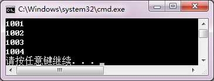

<!-- page: 89 -->

};
void fun( Employee *p )
{  if( (*p).sex == 'm' )
     cout << (*p).name << endl;
}
int main()
{  Employee emp[5] = { "Liming", 'm', "Wangxiaoping", 'f', "Luwei", 'm' };
   int i;
   for( i=0; i<3; i++ )
      fun( emp+i );
}
【解答】

3．编写程序，定义一个表示 ( x, y ) 坐标点的结构类型：
struct Point{ int x; int y; };

main 函数输入两个坐标点的值。函数：

int Line(Point a, Point b);

判断两点的连线是否为水平线、垂直线或斜线。

【解答】

#include<iostream>

#include <iomanip>

using namespace std;

struct Point

{

int x;

int y;

};

int Line(Point a, Point b)

{

if(a.x==b.x) return 1;

if(a.y==b.y) return 2;

return 0;

}

int main()

{

Point a,b;

cout<<"输入第一点坐标值：\n";

cout<<"x = ";  cin>>a.x;

cout<<"y = ";  cin>>a.y;

cout<<"输入第二点坐标值：\n";

cout<<"x = ";  cin>>b.x;

cout<<"y = ";  cin>>b.y;

int t=Line(a,b);

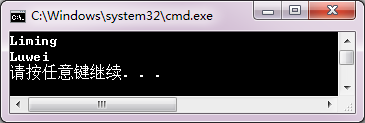

<!-- page: 90 -->

if(t==1)

cout<<"这是一条水平线\n";

else

if(t==2)

    cout<<"这是一条垂直线\n";

else

 cout<<"这是一条斜线\n";

}

同步练习5.4

<!-- question: cpp-032-Q58 -->

一、选择题

1．有以下说明语句，则正确的赋值语句是（    ）。
struct Point
{  double x;
   double y;
};
Point pp[3];

（A）pp[0]={0,0}
（B）pp.x= pp.y=1;

（C）pp[2]->x= pp[2]->y=2;
（D）pp[3].x=3; pp[3].y=3

2．有以下说明语句，则引用形式错误的是（    ）。
struct Student
{  int num;
   double score;
};
Student stu[3]={{1001,80}, {1002,75}, {1003,91}}, ∗p=stu;

（A）p->num
（B）(p++).num
（C）(p++)->num
（D）(∗p).num

【解答】
D
B

<!-- question: cpp-032-Q59 -->

二、程序练习

1．阅读程序，写出运行结果。
#include <iostream>
using namespace std;
struct Node
{  char * s;
   Node * q;
};
int main()
{  Node a[ ] = { { "Mary", a+1 }, { "Jack", a+2 }, { "Jim", a } };
   Node *p = a;
   cout << p->s << endl;
   cout << p->q->s << endl;
   cout << p->q->q->s << endl;
   cout << p->q->q->q->s << endl;
}
【解答】

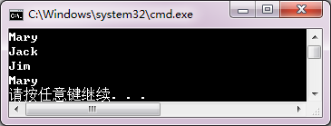

<!-- page: 91 -->

2．编写程序，定义点结构类型：
struct Point{ int x; int y; };

从键盘输入若干个点的数据，存放在结构数组中。函数：

int Line(Point ary[], int n);

判断这些点是否在一条水平线或垂直线上。

【解答】

#include<iostream>

#include <iomanip>

using namespace std;

struct Point

{

int x;

int y;

};

int Line(Point ary[], int n)

{

int i, t1=0, t2=0;

for( i=0; i<n-1; i++)

{

t1+=ary[i].x==ary[i+1].x;

t2+=ary[i].y==ary[i+1].y;

}

if(t1==n-1) return 1;

if(t2==n-1) return 2;

return 0;

}

int main()

{

const int N=3;

Point ary[N];

for(int i=0; i<N; i++)

{

cout<<"输入第"<<i+1<<"点坐标值：\n";

cout<<"x = ";  cin>>ary[i].x;

cout<<"y = ";  cin>>ary[i].y;

}

int t=Line(ary, N);

if(t==1)

cout<<"构成一条水平线\n";

else

if(t==2)

    cout<<"构成一条垂直线\n";

else

 cout<<"不能构成水平线或垂直线\n";

}

<!-- page: 92 -->

同步练习5.5

<!-- question: cpp-032-Q60 -->

一、选择题

有说明语句：

Struct Node{ int data; Node * next; };
Node *head, *p,*q, *s;
并且，head 是单向链表的头指针，p 指向链表中的节点，q 指向*p 的前驱节点。

1．在*p 之后插入节点*s 的操作是（    ）。

（A）p->next=s;  s->next=p->next;
（B）s->next=p-next;  p->next=s;

（C）p =s->next;  s =p->next;
（D）s =p->next;  p =s->next;

2．在*p 之前插入节点*s 的操作是（    ）。

（A）q =s->next;  s =p->next;
（B）q->next=s;  s->next=p;

（C）s=p->next;  q=s->next;
（D）s->next=p;  q->next=s;

3．在*hear 之前插入节点*s 的操作是（    ）。

（A）s->next=head;  head=s;
（B）s->next=head->next;  head->next=s;

（C）head=s;  s->next=head;
（D）head->next=s;  s->next=head->next;

4．删除*p 节点的操作是（    ）。

（A）q = p; delete p;
（B）p = q; delete q;

（C）q->next=p->next; delete p;
（D）p->next = q->next; delete q;

5．删除*(head->next)的操作是（    ）。

（A）p=head->next; head->next=head->next->next; delete p;

（B）head->next=head->next->next; p=head->next; delete p;

（C）p=head; head=head->next; delete p;

（D）head=head->next; p=head; delete p;

【解答】
B
D
A
C
A

<!-- question: cpp-032-Q61 -->

二、程序练习

有以下声明语句和主函数。其中Create 函数从键盘输入整数序列，以输入0 为结束，按输入逆序建立

一个以head 为表头的单向链表。程序在main 函数调用Create 建立链表，调用ShowList 函数验证链表。例

如，输入序列为1 2 3 4 5 0，建立的链表是5 4 3 2 1。补充程序中的Create 函数和ShowList 函数。

#include<iostream>
using namespace std;
struct Node{int data; Node * next;};
void Create(Node *&head);
void ShowList(Node *head);
void main()
{  Node *head=new Node;
   head=NULL;
   cout<<"输入链表元素，以输入 0 结束：\n";
   Create(head);
   cout<<"输出逆向链表\n";
   ShowList(head);
}

【解答】

void Create(Node *&head)

{

Node *p;

p = new Node ;

<!-- page: 93 -->

cin>>p->data;

while(p->data!=0)

{

if(head==NULL)

{ head=p; head->next=NULL; }

else

{

p->next = head;

head = p;

}

p=new Node;

cin>>p->data;

}

}

void ShowList(Node *head)

{

cout << "now the items of node are: \n";

while( head )

{

cout << head->data << '\t';

head = head->next;

}

cout << endl;

}

习题

<!-- question: cpp-032-Q62 -->

一、思考题

1．判断一个整数n 的奇偶性，可以利用位运算吗？请你试一试。

【解答】

可以。一个整数当最低位为1 时，它是奇数，否则为偶数。以下函数返回对参数k 的奇偶判断。

bool odd( int k )

{

 return 1&k;

}

2．长度为N 的数组可以表示N 个元素的集合，若有 S[i]==1，表示对应元素在集合中，如何实现集

合的基本运算？请你试一试。并从内存和处理要求上与5.2.2 节中集合的实现方法进行比较。

【解答】

长度为N 的数组S 可以表示有N 个元素的集合。当S[i]==1，表示元素i+1 在集合中；当S[i]==0，表

示元素i+1 不在集合中。集合运算通过对数组元素操作完成。

用数组实现集合，每一个数组元素只能表示一个集合元素，运算的空间和时间消耗高于用无符号整数

和位运算实现集合运算。

用数组实现集合运算程序如下。

<!-- page: 94 -->

#include<iostream>

using namespace std;

void setPut( unsigned *S );
//输入集合S的元素

void setDisplay( const unsigned *S );
//输出集合S中的全部元素

bool putX( unsigned *S, unsigned x );
//元素x并入集合

void Com(  unsigned *C, const unsigned *A, const unsigned *B);
//求并集C=A∪B

void setInt(  unsigned *C, const unsigned A, const unsigned B);
//求交集C=A∩B

void setDif( const unsigned A, const unsigned B );
//求差集C=A-B

bool Inc( const unsigned *A, const unsigned *B );
//判蕴含

bool In( const unsigned *S,  const unsigned x );
//判属于x∈S

bool Null( const unsigned *S );
//判空集

const int N=32;

//输入集合元素

void setPut(unsigned *S)

{ unsigned x;

 cin >> x;

 while( x>0&&x<=N)

 {  putX( S, x );
//把输入元素并入集合S

    cin >> x;

 }

}

//输出集合S中的全部元素

void setDisplay( const unsigned *S )

{ cout << "{ ";

 if (Null(S))

  cout<<"  }\n";

 else

 {  for( int i=0; i<N; i++ )
//输出元素

{

   if( S[i] )

cout << i+1 << ", ";

}

    cout << "\b\b }\n";
//擦除最后的逗号

 }

 return;

}

//元素x并入集合S

bool putX( unsigned *S, unsigned x )

{ if(x>0&&x<=N)

 {  S[x-1] = 1;

    return true;

 }

 return false;

}

//求并集C=A∪B

void Com(  unsigned *C, const unsigned *A, const unsigned *B )

{ for( int i=0; i<N; i++ )

<!-- page: 95 -->

   C[i]= int( A[i] || B[i] ) ;

}

//求交集C=A∩B

void setInt( unsigned *C, const unsigned *A, const unsigned *B )

{ for( int i=0; i<N; i++ )

   C[i]= int( A[i]&&B[i] ) ;

}

//求差集C=A-B

void setDif(  unsigned *C, const unsigned *A, const unsigned *B )

{ for( int i=0; i<N; i++ )

   C[i]= int( A[i]&&!(A[1]&&B[i]) ) ;

}

//判蕴含，A蕴含于B时返回true

bool Inc( const unsigned *A, const unsigned *B )

{ for(int i=0; i<N; i++)

   { if(A[i]&&!B[i])

     return false;

   }

 return true;

}

//判属于，x∈S时返回true

bool In( const unsigned *S, const unsigned x )

{  return S[x-1];

}

//判空集，S为空集时返回true

bool Null( const unsigned *S )

{ for( int i=0; i<N; i++)

 { if( S[i])

    return false;

 }

 return true;

}

int main()

{ unsigned A[N]={0}, B[N]={0},  C[N]={0};

 unsigned x;

 cout << "Input the elements of set A, 1-"<<N<<", until input 0 :\n";

 setPut( A );

 cout << "Input the elements of set B, 1-"<<N<<", until input 0 :\n";

 setPut( B );

 cout<<"A = ";

 setDisplay( A );

 cout<<"B = ";

 setDisplay( B );

 cout << "Input x: ";

 cin>>x;

 cout << "Put " << x << " in A = ";

<!-- page: 96 -->

 putX( A, x) ;

 setDisplay(A);

 cout << "C = A+B = ";

 Com( C, A, B );

 setDisplay( C );

 cout << "C = A*B = ";

 setInt( C, A, B );

 setDisplay( C );

 cout << "C = A-B = ";

 setDif( C, A, B );

 setDisplay( C );

 if( Inc( A, B ) )

   cout << "A <= B is true\n";

 else

   cout << "not A <= B\n";

 cout << "Input x: ";

 cin >> x;

 if( In( A, x ) )

   cout << x << " in A\n";

 else

   cout << x << " not in A\n";

}

3．分析以下说明结构的语句：
struct Node
{  int data;
   Node error;
//错误
   Node * ok;
//正确
};

error 和ok 分别属于什么数据类型？有什么存储要求？error 出错的原因是什么？

【解答】

error 是Node 结构类型数据成员，错误。原因是结构定义的数据成员若为本身的结构类型，是一种无

穷递归。ok 是指向Node 类型的指针，定义正确，占4 字节。

4．例5-15 中用辅助数组对结构数组进行关键字排序，有定义：
person *index[100];

index 数组存放结构数组元素的地址。如果把index 定义改为：

int index[100];

用于存放结构数组元素的下标，可以实现对结构数组的索引排序吗？如何修改程序？请你试一试。

 【解答】

可以。关键是通过整型索引数组元素作为下标访问结构数组。表示为：

all[pi[i]].name all[pi[i]].id
all[pi[i]].salary

有关程序如下：

#include<iostream>

using namespace std;

struct person
//说明结构类型

{

<!-- page: 97 -->

char name[10];

  unsigned int id;

  double salary;

} ;

void Input( person[], const int );

void Sort( person[], int[],const int );

void Output( const person[], int[],const int );

int main()

{

person allone[100] ;
//说明结构数组

  int index[100];
//说明索引数组

  int total ;

  for(int i=0; i<100; i++)
//索引数组元素值初始化为结构数组元素下标

 index[i]=i ;

  cout<<"输入职工人数：";

  cin>>total;

  cout<<"输入职工信息：\n";

  Input(allone,total);

  cout<<"以工资做关键字排序\n";

  Sort(allone,index, total);

  cout<<"输出排序后信息：\n";

  Output(allone,index,total);

}

void Input( person all[], const int n )

{

int i ;

  for( i=0; i<n; i++ )
// 输入数据

   {

cout<<i<<": 姓名: ";

     cin>>all[i].name;

     cout<<"编号: ";

     cin >> all[i].id;

     cout<<"工资: ";

     cin >> all[i].salary ;

   }

}

void Sort(person all[], int pi[], const int n)

{

 int i,j;

  int t;
//交换用中间变量

  for(i=1; i<n; i++)
//以成员salary做关键字排序

  {

for(j=0; j<=n-1-i; j++)

     if(all[pi[j]].salary>all[pi[j+1]].salary) //通过索引数组访问结构数组元素

 {

t=pi[j];
//交换索引数组元素值

pi[j]=pi[j+1];

<!-- page: 98 -->

pi[j+1]= t;

 }

  }

}

void Output(const person all[], int pi[], const int n)

{

 for( int i=0; i<n; i++ )
// 输出排序后数据

    cout<<all[pi[i]].name<<'\t'<<all[pi[i]].id<<'\t'<<all[pi[i]].salary<<endl;

}

5．有以下结构说明和遍历单向链表的函数。函数内有错误吗？是什么性质的错误？请上机验证你的

分析。

struct Node
{  int data;
   Node * next;
};
void ShowList( Node *head )
{  while( head )
   {  cout << head->date << '\n';
      head++;
   }
}
【解答】

head++错误，原因是动态链表的结点存放不是连续顺序的内存空间，它们是逐个结点通过new 建立的，

所以不能用++做地址偏移运算。应该用：

head=head->next;

<!-- question: cpp-032-Q63 -->

二、程序设计

1．编写程序，将一个整型变量右移4 位，并以二进制数形式输出该整数在移位前和移位后的数值。

观察系统填补空缺的数位情况。

【解答】

#include<iostream>

using namespace std;

void bitDisplay(unsigned value);

int main()

{

 unsigned x;

 cout << "Enter an unsigned integer: ";

 cin >> x;

 bitDisplay(x);

 x>>=4;

 cout<<"Right 4-bit\n";

 bitDisplay(x);

}

void bitDisplay(unsigned value)

{

 unsigned c;

 unsigned bitmask = 1<<31;

<!-- page: 99 -->

 cout << value << " = \t";

 for( c=1; c<=32; c++ )

 {

cout << ( value&bitmask ? '1' : '0' );

value <<= 1;

if( c%8 == 0 )

  cout << ' ';

 }

 cout << endl;

}

2．整数左移一位相当于将该数乘以2。编写一个函数：
unsigned power2( unsigned number, unsigned pow );

使用移位运算计算number*2pow，并以整数形式输出计算结果。注意考虑数据的溢出。

【解答】

unsigned power2( unsigned number, unsigned pow )

{

 unsigned c=1;

 unsigned bitmask = 1<<31;

 while(c<31)
//溢出判断

 {

if( number&bitmask ) break;
//查找最高位的1

c++;

bitmask>>=1;

 }

 if(pow<c)

return number<<pow;

 else

 {

cout<<"overflow!\n";

return 0;

 }

}

3．设计重载函数，使用按位异或（^）运算，实现快速交换两个整型变量和浮点型变量的值。

【解答】

void swap (int &a, int &b)

{

  a=a^b;

  b=a^b;

  a=a^b;

}

void swap(double &x, double &y)

{

 int*xp,*yp;

 xp = (int*)(&x);

 yp = (int*)(&y);

<!-- page: 100 -->

 *xp=(*xp)^*(yp);     *yp=(*xp)^(*yp);     *xp=(*xp)^(*yp);

 xp++;   yp++;

 *xp=(*xp)^*(yp);     *yp=(*xp)^(*yp);     *xp=(*xp)^(*yp);

}

4．设计函数，不使用辅助数组，实现两个int 类型或double 类型数组的数据快速交换。

【解答】

void Swap(char * Aary, char * Bary , int n)

{

 for(int i=0; i<n; i++)

 {

Aary[i]=Aary[i]^Bary[i];

Bary[i]=Aary[i]^Bary[i];

Aary[i]=Aary[i]^Bary[i];

 }

}

以上函数使用char*，字节指针做数组参数，对于不同类型的数组，调用函数时，只需要对实参地址做

指针类型转换，并且设定参数n对应的实参是交换数据的总字节数。例如，交换double类型数组的数据可以

有以下方式：

const int N=100;

double x[N];

double y[N];

//……

Swap((char*)x, (char*)y,sizeof(double)*N);

5．集合的元素通常是字符。设计程序，用无符号整数表示ASCII 码字符集合，用位运算实现各种基

本集合运算。

【解答】

ASCII 码是0~127 的整数，可以用长度为4 的无符号整型数组表示集合，如教材例5-6 所示。区别是，

在输入集合元素时，需要把字符转换成整型数据，在输出操作中，把整型集合元素转换成字符型数据。

程序略。

6．使用结构类型表示复数。设计程序，输入两个复数，可以选择进行复数的＋、－、×或÷运算，并

输出结果。

【解答】

#include <iostream>
#include <iomanip>

using namespace std;

struct complex

{

  double re, im;

};

int main()

{

complex a,b,c;  char oper;

cout << "输入复数a的实部和虚部: ";

<!-- page: 101 -->

cin >> a.re >> a.im;

cout << "输入复数b的实部和虚部:";

cin >> b.re >> b.im;

cout << "输入运算符: ";

cin >> oper;

switch ( oper )

   {

case '+':
c.re=a.re+b.re; c.im=a.im+b.im;

break;

case '-':
c.re=a.re-b.re; c.im=a.im-b.im;

break;

case '*':
c.re=a.re*b.re-a.im*b.im;

c.im=a.im*b.re+a.re*b.im;

break;

case '/':
c.re=(a.re*b.re+a.im*b.im)/(b.re*b.re+b.im*b.im);

c.im=(a.im*b.re-a.re*b.im)/(b.re*b.re+b.im*b.im);

break;

   default:
cout << "input error!" << endl;

return 0;

}

cout << "c=" << c.re;

cout << setiosflags( ios::showpos );

cout << c.im << "i" << endl;

return 0;

}

7．把一个班的学生姓名和成绩存放到一个结构数组中，寻找并输出最高分者。

【解答】
     #include <iostream>

     using namespace std;

     struct dat

     {

     char name[12];

     double score;

      };

     double searchMax(dat *a, int n);

     int main()

     {

     dat stu[] = { "李小平",90,"何文章",66,"刘大安",87,"汪立新",93,"罗建国",78,

"陆丰收",81,"杨勇",85,"吴一兵",55,"伍晓笑",68,"张虹虹",93 };

     double max;

     int n = sizeof(stu) / sizeof(dat);

     max = searchMax(stu, n);

     for (int i = 0; i<n; i++)

      if (stu[i].score == max)

    cout << stu[i].name << '\t' << stu[i].score << endl;

<!-- page: 102 -->

      }

     double searchMax(dat *a, int n)

     {

    int i;

    double max = a[0].score;

    for (i = 1; i<n; i++)

    if (a[i].score > max) max = a[i].score;

     return max;

}

8．使用结构表示X-Y 平面直角坐标系上的点，编写程序，顺序读入一个四边形的4 个顶点坐标，判别由这

个顶点的连线构成的图形是否为正方形、矩形或其他四边形。要求：定义求两个点距离的函数使用结构参数。

【解答】

#include <iostream>

#include <cmath>

using namespace std;

struct point

{

 double x;

 double y;

};

double d( point p1, point p2 )

{

  return sqrt( pow( p1.x-p2.x,2 )+pow( p1.y-p2.y,2 ) );

}

int main()

{

  int i;  point p[5];

   for( i=1; i<=4; i++ )

    { cout << "输入第" << i << "个顶点的横坐标和纵坐标: ";

      cin >> p[i].x >> p[i].y;

}

   if( fabs( d( p[1],p[2] ) - d( p[3],p[4] ))<=1e-8

        && fabs( d( p[1],p[4] ) - d( p[2],p[3] ))<=1e-8

        && fabs( d( p[1],p[3] ) - d( p[2],p[4] ))<=1e-8)

     if( fabs( d( p[1],p[2] ) - d( p[2],p[3] ))<1e-8 )

         cout << "四个顶点构成的图形为正方形！" << endl;

     else cout << "四个顶点构成的图形为矩形！" << endl;

  else cout << "四个顶点构成的图形为其它四边形！" << endl;

}

9．建立一个结点包括职工的编号、年龄和性别的单向链表，分别定义函数完成以下功能：

（1）遍历该链表输出全部职工信息；

（2）分别统计男、女职工的人数；

（3）在链表尾部插入新职工结点；

（4）删除指定编号的职工结点；

<!-- page: 103 -->

（5）删除年龄在60 岁以上的男性职工或55 岁以上的女性职工结点，并保存在另一个链表中。

要求：用主函数建立简单菜单选择，并测试程序。

【解答】

#include <iostream>

using namespace std;

struct employee

{

int num;

int age;

char sex;

employee *next;

};

employee *head, *head1;

//建立单向链表

employee *create()

{

employee *head, *p, *pend=NULL;

char ch;

head = NULL;

cout << "\t输入数据?(y/n)"; cin >> ch;

if (ch == 'y')

{

p = new employee;

cout << "\t编号:";  cin >> p->num;

cout << "\t年龄:";  cin >> p->age;

cout << "\t性别:";  cin >> p->sex;

}

else

goto L0;

while (ch == 'y')

{

if (head == NULL) head = p;

else pend->next = p;

pend = p;

cout << "\t输入数据?(y/n)"; cin >> ch;

if (ch == 'y')

{

p = new employee;

cout << "\t编号:"; cin >> p->num;

cout << "\t年龄:"; cin >> p->age;

cout << "\t性别:"; cin >> p->sex;

}

}

pend->next = NULL;

L0: return head;

<!-- page: 104 -->

}

//显示单向链表中全部职工信息

void show(employee *head)

{

;

employee *p = head;

if (!head) { cout << "\t空链表！" << endl; goto L1; }

cout << "\t链表中的数据是: \n";

while (p)

{

cout << '\t' << p->num << "," << p->age << "," << p->sex << endl;

p = p->next;

}

L1: return ;

}

//统计男女职工人数

void count(employee *head)

{

employee *p = head;

int m, f;

m = 0; f = 0;

while (p)

{

if (p->sex == 'm')

m++;

else

f++;

p = p->next;

}

cout << "\t男职工人数：" << m << endl;

cout << "\t女职工人数：" << f << endl;

}

//在链表尾部插入新结点

employee *insert()

{

employee *pend = head, *p;

//在空链表尾部插入新结点

if (!head)

{

p = new employee;

cout << "\t编号:";  cin >> p->num;

cout << "\t年龄:";  cin >> p->age;

cout << "\t性别:";  cin >> p->sex;

head = p;

<!-- page: 105 -->

p->next = NULL;

return head;

}

//在链表尾部插入新结点

while (pend->next != NULL)

{

pend = pend->next;

}

p = new employee;

cout << "\t编号:";  cin >> p->num;

cout << "\t年龄:";  cin >> p->age;

cout << "\t性别:";  cin >> p->sex;

pend->next = p;

pend = p;

pend->next = NULL;

return head;

}

//删除指定编号的结点

employee *del(int bh)

{

employee *p, *q;

if (!head)

{

cout << "\t空链表！" << endl;

goto L2;

}

//删除链首结点

if (head->num == bh)

{

p = head;

head = head->next;

delete p;

cout << "\t结点已被删除！" << endl;

goto L2;

}

//删除非链首结点

q = head;

while (q->next != NULL)

{

if (q->next->num == bh)

{

p = q->next;      //待删除结点

q->next = p->next;

delete p;

<!-- page: 106 -->

cout << "\t结点已被删除！" << endl;

goto L2;

}

q = q->next;

}

cout << "\t找不到需删除结点！" << endl;

L2:  return (head);

}

//删除指定年龄段的结点，并把被删除结点保存在另一链表中

employee *delcreate()

{

employee *p, *pd, *p1=NULL, *q;

int flag;

//建立新链表

if (head == NULL)

{

cout << "\t空链表！" << endl;

goto L3;

}

head1 = NULL;

pd = new employee;

p = head;

flag = 0;

while (p != NULL)

{

if (p->age >= 55 && p->age <= 60)

{

pd->num = p->num;

pd->age = p->age;

pd->sex = p->sex;

if (head1 == NULL)

head1 = pd;

else

p1->next = pd;

p1 = pd;

pd = new employee;

flag = 1;

}

p = p->next;

}

if (flag == 0)

{

cout << "\t没有需删除的结点！" << endl; goto L3;

}

<!-- page: 107 -->

p1->next = NULL;

//显示新链表

cout << "\t新链表中的数据是: \n";

p = head1;

while (p)

{

cout << '\t' << p->num << "," << p->age << "," << p->sex << endl;

p = p->next;

}

//删除指定年龄的结点

p = head;

q = p;

while (p != NULL)

{

if (p->age >= 55 && p->age <= 60)

if (head->age == p->age)

{

pd = head;               //待删除结点

head = head->next;

delete pd;

p = head;

continue;

}

else

if (p->next == NULL)

{

pd = p;
      //待删除结点

q->next = NULL;

delete pd;

goto L3;

}

else

{

pd = p;
      //待删除结点

q->next = p->next;

delete pd;

p = q->next;

continue;

}

q = p;

p = p->next;

}

L3: return (head);

}

<!-- page: 108 -->

int main()

{

int choice, bh;

L:

cout << "\n\t\t请键入操作选择\n" << endl;

cout << "\t 1 --- 建立单向链表" << endl;

cout << "\t 2 --- 显示单向链表中全部职工信息" << endl;

cout << "\t 3 --- 统计男女职工人数" << endl;

cout << "\t 4 --- 在职工尾部插入新结点" << endl;

cout << "\t 5 --- 删除指定编号的结点" << endl;

cout << "\t 6 --- 删除指定年龄的结点，并把被删除结点保存在另一链表中" << endl;

cout << "\t 0 --- 退出" << endl;

cout << "\t\t";

cin >> choice;

switch (choice)

{

case 1: head = create(); goto L;

case 2: show(head);  goto L;

case 3: count(head); goto L;

case 4: head = insert(); goto L;

case 5: cout << "\t输入需删除结点编号:";

cin >> bh;

head = del(bh); goto L;

case 6: head = delcreate(); goto L;

case 0: cout << " \t退出程序的运行！\n" << endl; break;

default: cout << "\t输入错误，请重新输入！\n" << endl; goto L;

}

}

10．输入一行字符，按输入字符的反序建立一个字符结点的单向链表，并输出该链表中的字符。

【解答】

#include <iostream>

using namespace std;

struct node

{

 char ch;

  node *next;

};

void show( node *head );

int main()

{

 node *head, *p;

  char c;

<!-- page: 109 -->

  head = NULL;

  while( (c = getchar()) != '\n' )
//输入一行字符

   {

 p = new node;
     //建立新结点

     p->ch = c;

     p->next = head;
          //插入表头

     head=p;

}

   show(head);

}

void show( node *head )
      //输出链表

{

 node *p = head;

  cout << "链表中的字符是: \n";

  while( p )

   { cout << p->ch;

      p = p->next;

}

  cout << endl;

}

11．设有说明语句：
struct List { int data;  List * next; };
List *head;

head 是有序单向链表的头指针。请编写函数：

void Count( List * head );

计算并输出链表数据相同值的结点及个数。例如，若数据序列为：

2 3 3 3 4 5 5 6 6 6 6 7 8 9 9

则输出结果为：

data number
3
3
5
2
6
4
9
2

可以用例5-18 的程序生成有序链表，测试Count 函数。

【解答】 略

12．用带头结点的有序单向链表可以存放集合，如图5.16 所示。头结点不存放集合元素，仅为操作方

便而设置。使用这种数据结构，设计集合的输入、输出和各种基本运算的函数。

图5.16  带头结点的有序单向链表

【解答】 略

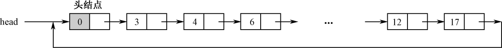

<!-- page: 110 -->

第6 章习题与解答

同步练习6.1

<!-- question: cpp-032-Q64 -->

一、选择题

1．下列类的定义中正确的是（    ）。

（A）class a{int x=0;int y=1;}
（B）class b{int x=0;int y=1;};

（C）class c{int x;int y;}
（D）class d{int x;int y;};

2．若有以下说明，则在类外使用对象objX 成员的正确语句是（    ）。

class X

{   int a;

    void fun1();

  public:

    void fun2();

};

X objX;

（A）objX.a=0;
（B）objX.fun1();
（C）objX.fun2();
（D）X::fun1();

3．在类定义的外部，可以被访问的成员有（    ）。

（A）所有类成员
（B）private 或protected 的类成员

（C）public 的类成员
（D）public 或private 的类成员

4．下列关于类和对象的说法中，正确的是（    ）。

（A）编译器为每个类和类的对象分配内存
（B）类的对象具有成员函数的副本

（C）类的成员函数由类来调用
（D）编译器为每个对象的数据成员分配内存

5．关于this 指针的说法正确的是（    ）。

（A）this 指针必须显式说明
（B）定义一个类后，this 指针就指向该类

（C）成员函数拥有this 指针
（D）静态成员函数拥有this 指针

【解答】
D
D
C
D
C

<!-- question: cpp-032-Q65 -->

二、程序练习

1．阅读程序，写出运行结果。

#include<iostream>

using namespace std;

class A

{  public :

     int f1();

     int f2();

     void setx( int m )  {  x = m; cout << x << endl;  }

     void sety( int n )  {  y = n; cout << y << endl;  }

     int getx()  {  return x;  }

     int gety()  {  return y;  }

   private :

     int x, y;

};

int A::f1()

<!-- page: 111 -->

{  return x + y;  }

int A::f2()

{  return x - y;  }

int main()

{  A a;

   a.setx( 10 ); a.sety( 5 );

   cout << a.getx() << '\t' << a.gety() << endl;

   cout << a.f1() << '\t' << a.f2() << endl;

}

【解答】

2．改写以下程序。要求定义类student，封装三个数据成员和两个成员函数intpt 和output，使程序得

到相同的运行效果。

#include <iostream>

using namespace std;

struct student

{  char name[20];

   unsigned int id;

   double score;

};

void input(student &stu)

{  cout<<"name?";

   cin>>stu.name;

   cout<<"id?";

   cin>>stu.id;

   cout<<"score?";

   cin>>stu.score;

}

void output(student &stu)

{  cout<<"name: "<<stu.name<<"\tid: "<<stu.id<<"\tscore: "<<stu.score<<endl;  }

int main()

{  student s={"\0", 0, 0};

   input(s);

   output(s);

}

【解答】

#include <iostream>

using namespace std;

class student

{

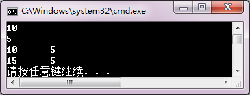

<!-- page: 112 -->

char name[20];

unsigned int id;

double score;

public:

void input()

{

cout<<"name? ";

cin>>name;

cout<<"id?";

cin>>id;

cout<<"score? ";

cin>>score;

}

void output()

{

cout<<"name: "<<name<<"\tid: "<<id<<"\tscore: "<<score<<endl;

}

};

int main()

{

student s;

s.input();

s.output();

}

同步练习6.2

<!-- question: cpp-032-Q66 -->

一、选择题

1．下面对构造函数的不正确描述是（    ）。

（A）用户定义的构造函数不是必须的
（B）构造函数可以重载

（C）构造函数可以有参数，也可以有返回值 （D）构造函数可以设置默认参数

2．下面对析构函数的正确描述是（    ）。

（A）系统在任何情况下都能正确析构对象
（B）用户必须定义类的析构函数

（C）析构函数没有参数，也没有返回值
（D）析构函数可以设置默认参数

3．构造函数是在（    ）时被执行的。
（A）建立源程序文件
（B）创建对象
（C）创建类
（D）程序编译时

4．在下列函数原型中，可以作为类Base 析构函数的是（    ）。

（A）void~Base
（B）~Base()
（C）~Base()const
（D）Base()

5．AB 是一个类，那么执行语句“AB a (4), b[3], *p;”调用了（    ）次构造函数。

（A）2
（B）3
（C）4
（D）5

6．下面关于复制构造函数调用的时机，不正确的是（    ）调用。

（A）访问对象时
（B）对象初始化时

（C）函数具有类类型传值参数时
（D）函数返回类类型值时

7．说明一个类的对象时，系统自动调用（    ）。

（A）成员函数
（B）构造函数
（C）析构函数
（D）友元函数

8．程序中撤销一个类对象时，系统自动调用（    ）。

<!-- page: 113 -->

（A）成员函数
（B）构造函数
（C）析构函数
（D）友元函数

【解答】
C
C
B
B
C
A
B
C

<!-- question: cpp-032-Q67 -->

二、程序练习

1．阅读程序，写出运行结果。

#include<iostream>

using namespace std;

class T

{  public :

     T( int x, int y )

     {  a = x; b = y;

        cout << "调用构造函数1." << endl;

        cout << a << '\t' << b << endl;

     }

     T( T &d )

     {  cout << "调用构造函数2." << endl;

       cout << d.a << '\t' << d.b << endl;

     }

     ~T() { cout << "调用析构函数."<<endl; }

     int add( int x, int y = 10 )  {  return x + y;  }

  private :

     int a, b;

};

int main()

{  T d1( 4, 8 );

   T d2( d1 );

   cout << d2.add( 10 ) << endl;

}

【解答】

2．为同步练习6.1 程序练习第2 题中的student 类增加一个构造函数，使得建立对象时可以完成用户

指定数据的初始化。默认初始化值为：( "\0", 0, 0 )。

若主函数为：

int main()

{  student s1;

   s1.output();

   student s2("Zhangsan", 120, 85);

   s2.output();

   student s3;

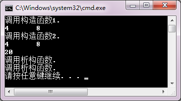

<!-- page: 114 -->

   s3.input();

   s3.output();

}

将有以下屏幕对话和输出：

name:
id: 0
score: 0

name: Zhangsan
id: 120
score: 85

name? Lihua

score? 95

name: Lihua
id: 130
score: 95

请补充student 类的构造函数。

【解答】

class student

{

char name[20];

unsigned id;

double score;

public:

student(char s[20]="\0", unsigned k=0, double t=0)

{

strcpy_s(name,s);

id=k;

score=t;

}

void input()

{

cout<<"name? ";

cin>>name;

cout<<"id? ";

cin>>id;

cout<<"score? ";

cin>>score;

}

void output()

{

cout<<"name: "<<name<<"\tid: "<<id<<"\tscore: "<<score<<endl;

}

};

同步练习6.3

<!-- question: cpp-032-Q68 -->

一、选择题

1．在下列选项中，（    ）不是类的成员函数。

（A）构造函数
（B）析构函数
（C）友元函数
（D）复制构造函数

2．下面对友元的错误描述是（    ）。

（A）关键字friend 用于声明友元

（B）一个类中的成员函数可以是另一个类的友元

<!-- page: 115 -->

（C）友元函数访问对象的成员不受访问特性影响

（D）友元函数通过this 指针访问对象成员

3．已知类A 是类B 的友元，类B 是类C 的友元，则下面选项描述正确的是（    ）。

（A）类A 一定是类C 的友元

（B）类C 一定是类A 的友元

（C）类C 的成员函数可以访问类B 的对象的任何成员

（D）类A 的成员函数可以访问类B 的对象的任何成员

4．下述关于类的静态成员的特性中，描述错误的是（    ）。

（A）说明静态数据成员时前边要加修饰符static

（B）静态数据成员要在类体外定义

（C）引用静态数据成员时，要在静态数据成员前加<类名>和作用域运算符

（D）每个对象有自己的静态数据成员副本

5．若有以下说明，则对n 的正确访问语句是（    ）。

class Y

{    //…;

  public:

     staticint n;

};

int Y::n;

Y objY;

（A）n=1;
（B）Y::n=1;
（C）objY::n=1;
（D）Y->n

6．若有以下类Z 说明，则函数fStatic 中访问数据a 错误的是（    ）。

class Z

{    static int a;

  public:

     static void fStatic(Z&);

};

int Z::a=0;  Z objZ;

（A）void Z::fStatic()  {  objZ.a =1;  }

（B）void Z::fStatic()  {  a = 1;  }

（C）void Z::fStatic()  {  this->a = 0;  }

（D）void Z::fStatic()  {  Z::a = 0;  }

7．若有以下类W 说明，则函数fConst 的正确定义是（    ）。

class W

{    int a;

  public:

     void fConst(int&) const;

};

（A）void W::fConst( int&k )const  {  k = a;  }

（B）void W::fConst( int&k )const  {  k = a++;  }

（C）void W::fConst( int&k )const  {  cin>> a;  }

（D）void W::fConst( int&k )const  {  a = k;  }

8．若有以下类T 说明，则函数fFriend 的错误定义是（    )。

class T

{  inti;

   friend void fFriend( T&, int );

<!-- page: 116 -->

};

（A）void fFriend( T &objT, int k )  {  objT.i = k;  }

（B）void fFriend( T &objT, int k )  {  k = objT.i;  }

（C）void T::fFriend( T &objT, int k )  {  k += objT.i;  }

（D）void fFriend( T &objT, int k )  {  objT.i += k;  }

【解答】
C
D
D
D
B
C
A
C

<!-- question: cpp-032-Q69 -->

二、程序练习

1．阅读程序，写出运行结果。

#include<iostream>

using namespace std;

class T

{  public:

     T(int x)  {  a=x; b+=x;  };

     static void display(T c)  {  cout<<"a="<<c.a<<'\t'<<"b="<<c.b<<endl;  }

   private:

     int a;

     static int b;

};

int T::b=5;

int main()

{  T A(3), B(5);

   T::display(A);

   T::display(B);

}

【解答】

2．阅读程序，写出运行结果。

#include<iostream>

using namespace std;

#include<cmath>

class Point

{  public :

     Point( float x, float y )

     {  a = x; b = y;  cout<<"点( "<<a<<", "<<b<<" )";  }

     friend double d( Point &A, Point &B )

     {  return sqrt((A.a-B.a)*(A.a-B.a)+(A.b-B.b)*(A.b-B.b));  }

   private:

     double a, b;

};

int main()

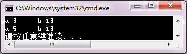

<!-- page: 117 -->

{  Point p1( 2, 3 );

   cout << " 到";

   Point p2( 4, 5 );

   cout << "的距离是：" << d( p1,p2 ) << endl;

}

【解答】

3．阅读程序，写出运行结果。

#include<iostream>

using namespace std;

class A

{  public :

     A() { a = 5; }

     void printa() { cout << "A:a = " << a << endl; }

   private :

     int a;

     friend  class B;

};

class B

{  public:

     void display1( A t )

     {  t.a++; cout << "display1:a = " << t.a << endl;  };

     void display2( A t )

     {  t.a--; cout << "display2:a = " << t.a << endl;  };

};

int main()

{  A obj1;

   B obj2;

   obj1.printa();

   obj2.display1( obj1 );

   obj2.display2( obj1 );

   obj1.printa();

}

【解答】

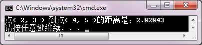

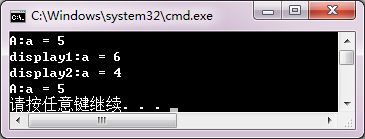

<!-- page: 118 -->

4．为同步练习6.2 程序练习第2 题中的student 类添加一个复制构造函数。若主函数为：

int main()

{  cout<<"s2:\n";

   student s2("Zhangsan", 120, 85);

   s2.output();

   cout<<"s3:\n";

   student s3(s2);

   s3.output();

}

则运行结果如下：

s2:

name: Zhangsan
id: 120
score: 85

s3:

name: Zhangsan
id: 120
score: 85

【解答】

class student

{

char name[20];

unsigned id;

double score;

public:

student(char s[20]="\0", unsigned k=0, double t=0)

{

strcpy_s(name,s);

id=k;

score=t;

}

student(const student &ss)
//复制构造函数

{

strcpy_s(name,ss.name);

id=ss.id;

score=ss.score;

}

void input()

{

cout<<"name? ";

cin>>name;

cout<<"id? ";

cin>>id;

cout<<"score? ";

cin>>score;

}

void output()

{

cout<<"name: "<<name<<"\tid: "<<id<<"\tscore: "<<score<<endl;

}

<!-- page: 119 -->

};

5．修改同步练习6.1 程序练习第2 题中的student 类，把input 和output 函数写为友元函数，并相应修

改主函数，使程序得到正确的运行结果。

【解答】

#include <iostream>

#include<fstream>

using namespace std;

class student

{

char name[20];

unsigned id;

double score;

public:

student(char s[20]="\0", unsigned k=0, double t=0)

{

strcpy_s(name,s);

id=k;

score=t;

}

student(const student &ss)

{

strcpy_s(name,ss.name);

id=ss.id;

score=ss.score;

}

friend void input(student &ss);
//声明友元函数

friend void output(student ss);
//声明友元函数

};

void input(student &ss)

{

cout<<"name? ";

cin>>ss.name;

cout<<"id? ";

cin>>ss.id;

cout<<"score? ";

cin>>ss.score;

}

void output(student ss)

{

cout<<"name: "<<ss.name<<"\tid: "<<ss.id<<"\tscore: "<<ss.score<<endl;

}

int main()

{

student s1;

input(s1);

output(s1);

<!-- page: 120 -->

}

6．删除同步练习6.1 程序练习第2 题中student 类的成员函数input 和output，定义一个iostudent 类，

它是student 类的友元类，完成对student 数据成员的输入/输出操作。编写完整的程序，使其得到正确的运

行效果。

【解答】

#include <iostream>

#include<fstream>

using namespace std;

class student

{

char name[20];

unsigned id;

double score;

public:

student(char s[20]="\0", unsigned k=0, double t=0)

{

strcpy_s(name,s);

id=k;

score=t;

}

student(const student &ss)

{

strcpy_s(name,ss.name);

id=ss.id;

score=ss.score;

}

friend class iostudent;

};

class iostudent
//定义iostudent类

{

public:

void input(student &ss)

{

cout<<"name? ";

cin>>ss.name;

cout<<"id? ";

cin>>ss.id;

cout<<"score? ";

cin>>ss.score;

}

void output(student ss)

{

cout<<"name: "<<ss.name<<"\tid: "<<ss.id<<"\tscore: "<<ss.score<<endl;

}

};

int main()

<!-- page: 121 -->

{

student s1;

iostudent io;

io.input(s1);

io.output(s1);

}

同步练习6.4

<!-- question: cpp-032-Q70 -->

一、选择题

1．若class B 中定义了一个class A 的类成员A a，则关于类成员的正确描述是（    ）。

（A）在类B 的成员函数中可以访问A 类的私有数据成员

（B）在类B 的成员函数中可以访问A 类的保护数据成员

（C）类B 的构造函数可以调用类A 的构造函数进行数据成员初始化

（D）类A 的构造函数可以调用类B 的构造函数进行数据成员初始化

2．下列关于类的包含描述正确的是（    ）。

（A）可以使用赋值语句对对象成员进行初始化

（B）可以使用“参数初始式”调用成员类的构造函数初始化对象成员

（C）被包含类可以访问包含类的成员

（D）首先执行自身构造函数，再调用成员类的构造函数

【解答】
C
B

<!-- question: cpp-032-Q71 -->

二、程序练习

1．阅读程序，写出运行结果。

#include<iostream>

using namespace std;

class A

{  public:

      A(int x=0):a(x){ }

      void getA(int A) { a =A; }

      void printA() { cout<<"a="<<a<<endl; }

   private:

      int a;

};

class B

{  public:

      B(int x=0, int y=0):aa(x) { b = y; }

      void getAB(int A, int outB) { aa.getA(A);  b=outB; }

      void printAB() { aa.printA(); cout<<"b="<<b<<endl; }

   private:

      A aa;

      int b;

};

int main()

<!-- page: 122 -->

{  A objA;

   int m=5;

   objA.getA(m);

   cout<<"objA.a="<<m<<endl;

   cout<<"objB:\n";

   B objB;

   objB.getAB(12,56);

   objB.printAB();

}

【解答】

2．为同步练习6.1 程序练习第2 题中的student 类添加一个date 类数据成员birthday，date 类包含三

个数据成员：year、month、day，以及用于初始化的构造函数，用于输入数据的input 和输出数据的output

成员函数。student 类构造函数需要完成birthday 的数据初始化，并且完成birthday 数据的输入/输出。用main

函数测试这个类。

【解答】

#include <iostream>

#include<fstream>

using namespace std;

class date
//定义date类

{

int year, month, day;

 public:

date(int y, int m, int d)

{

year=y;

month=m;

day=d;

}

void input()

{

cout<<"birth of year ? ";

cin>>year;

cout<<"\tmonth ? ";

cin>>month;

cout<<"\t  day ? ";

cin>>day;

}

void output()

{

cout<<"birth: "<<year<<"-"<<month<<"-"<<day<<endl;

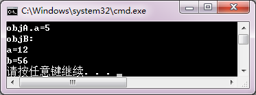

<!-- page: 123 -->

}

};

class student
//定义student类

{

 char name[20];

 unsigned id;

 double score;

 date birth;
//date类的数据成员

 public:

//构造函数

student(char s[20]="No name", unsigned k=0, double t=0, int y=2000, int m=1, int d=1)

: birth(y, m, d)

{

strcpy_s(name,s);

id=k;

score=t;

}

void input()

{

cout<<"name? ";

cin>>name;

birth.input();

cout<<"id? ";

cin>>id;

cout<<"score? ";

cin>>score;

}

void output()

{

cout<<"name: "<<name<<"\t";

birth.output();

cout<<"id: "<<id<<"\tscore: "<<score<<endl;

}

};

int main()

{

 student s;

 s.input();

 s.output();

}

习题

<!-- question: cpp-032-Q72 -->

一、思考题

1．结构与类有什么区别？如果把程序中定义结构的关键字struct 直接改成class，会有什么问题？用

教材中的一个例程试试看，想一想做什么修改能使程序正确运行？

<!-- page: 124 -->

【解答】

结构是数据的封装，类是数据和操作的封装。可以把结构看成是类的特例。结构和类都可以用关键字

struct 或class 定义。区别是，struct 定义的结构或类的全部成员都是公有的，用class 定义的结构或类不做

声明的成员是私有的。

若把struct 改成class，只需要把全部成员定义为public 就可以了。

2．有说明：

class A

{

      int a;

      double x;

   public:

      funMember();

};

A a1, a2, a3;

编译器为对象a1、a2 和a3 开辟了什么内存空间？它们有各自的funMember 函数的副本吗？C++通过

什么机制调用类的成员函数？

【解答】

开辟的存储空间有a1.a, a1.x, a2.a, a2.x, a3.a, a3.x。各对象没有funMember 函数的副本，C++通过this

指针调用成员函数。

3．C++提供了系统版本的构造函数，为什么还需要用户自定义构造函数？编写一个验证程序，说明

自定义构造函数的必要性。

【解答】

类的默认构造函数可以建立基本类型数据成员的存储空间。基于以下两个原因，需要用户定义构造函

数：

（1）对数据成员的值做指定初始化；

（2）类的数据是由指针管理的堆。

程序略。

4．试从定义方式、访问方式、存储性质和作用域4 个方面来分析类的一般数据成员和静态数据成员

的区别，并编写一个简单程序验证它。

【解答】

定义方式
访问方式
存储性质
作用域

一般数据成员
类中定义
对象.数据成员
局部数据
由访问属性public, protected,

private 决定
静态数据成员
类中声明，类外定义
对象.数据成员

全局数据

类::数据成员

程序略。

5．试从定义方式、调用方式两个方面来分析常成员函数、静态成员函数和友元函数的区别。考察

例6-16，若class Goods 的指针域：

Goods * next;

被声明为私有（private）成员，程序会出现什么错误？做什么最小修改能使程序正确运行？

【解答】

定义方式
调用方式

<!-- page: 125 -->

常成员函数
函数原型以const 做后缀

与一般成员函数调用形式相同

this 指针被约束为指向常量的常指针

对数据成员只读

静态成员函数
以static 做函数原型前缀

通过类或对象调用

没有this 指针

用于操作静态数据成员

友员函数
以friend 做函数原型前缀

通过参数访问对象

没有this 指针

可以访问对象的不同属性的成员

在例6-16 中，若把next 声明为私有数据成员，只须把有关指针操作的函数定义为友员函数就可以了：

friend void purchase( Goods * &f, Goods *& r, int w );

friend void sale( Goods * & f , Goods * & r );

6．设有：

class M

{  public: int a;

};

class N

{  public:

      M m;

      int b;

      void fun()

      {  /*…*/  }

};

int main()

{  N n;

   N *p = &n;

   /*…*/

}

描述在N::fun 中如何访问M 类的数据成员a？在main 函数中又如何访问对象n 的全部数据成员？

【解答】

在N::fun 中访问M 类的数据成员a 的形式是：  m.a

 在main 函数中访问M 类的数据成员的形式是： n.b，n.m.a

<!-- question: cpp-032-Q73 -->

二、程序设计

1．定义一个Book（图书）类，在该类定义中包括以下数据成员和成员函数。

数据成员：bookname（书名）、price（价格）和number（存书数量）。

成员函数：display()显示图书的情况；borrow()将存书数量减1，并显示当前存书数量；restore()将存书

数量加1，并显示当前存书数量。

在main 函数中，要求创建某一种图书对象，并对该图书进行简单的显示、借阅和归还管理。

【解答】

#include <iostream>

using namespace std;

class Book

{

 public:

      void setBook(char*,double,int);

     void borrow();

<!-- page: 126 -->

     void restore();

     void display();

   private:

     char bookname[40];

     double price;

     int number;

};

//在类外定义Book 类的成员函数

void Book::setBook(char *name, double pri, int num)

{

 strcpy_s(bookname, name);

   price=pri;

   number=num;

}

void Book::borrow()

{

 if (number==0 )

{

cout << "已没存书，退出！" << endl;

abort();

}

  number = number - 1;

  cout << "借一次，现存书量为：" << number << endl;

}

void Book::restore()

{

 number = number + 1;

   cout << "还一次，现存书量为：" << number << endl;

}

void Book::display()

{

cout << "存书情况：" << endl

       << "bookname:" << bookname << endl

       << "price:" << price << endl

       << "number:" << number << endl;

}

int main()

{

  char flag, ch;

   Book computer;

   computer.setBook( "C++程序设计基础" , 32, 1000 );

   computer.display();

   ch = 'y';

   while ( ch == 'y' )

<!-- page: 127 -->

   {

 cout << "请输入借阅或归还标志(b/r)：";

     cin >> flag;

     switch ( flag )

{

 case 'b':  computer.borrow(); break;

   case 'r':  computer.restore();

}

     cout << "是否继续？(y/n)";

     cin >> ch;

}

   computer.display();

}

2．定义一个Box（盒子）类，在该类定义中包括以下数据成员和成员函数。

数据成员：length（长）、width（宽）和height（高）。

成员函数：构造函数Box，设置盒子的长、宽和高三个初始数据；成员函数setBox 对数据成员置值；

成员函数volume 计算盒子的体积。

在main 函数中，要求创建Box 对象，输入长、宽、高，输出盒子的体积。

【解答】

#include <iostream>
using namespace std;
class BOX

{
  public:
 BOX( double l, double w, double h )
      { length = l;
   width = w;
   height = h;

}
 void volume()
      {  cout << "volume=" << length * width * height << endl;

}
   private:
     double  length, width, height;
};
int main()

{

 BOX box1( 1,3,5 );
 box1.volume();
  BOX box2( 2,4,6 );
  box2.volume();
}

3．定义一个student 类，在该类定义中包括：一个数据成员（分数score）及两个静态数据成员（总分

total 和学生人数count）；成员函数scoretotalcount(double s) 用于设置分数、求总分和累计学生人数；静态

成员函数sum()用于返回总分；静态成员函数average()用于求平均值。

在main 函数中，输入某班同学的成绩，并调用上述函数求全班学生的总分和平均分。

【解答】

<!-- page: 128 -->

#include <iostream>

using namespace std;

class student

{

 public:

void scoretotalcount( double s )

 {

score = s;

    total = total + score;

    count++;

}

static double sum()

 {

  return total;

}

static double average()

 {

  return total / count;

 }

private:

double  score;

static double total;

static double count;

};

double student::total=0;

double student::count=0;

int main()

{

 int i,n; double s;

  cout << "请输入学生人数：";

  cin >> n;

  student  stu;

  for( i=1; i<=n; i++ )

    {

 cout << "请输入第" << i << "个学生的分数：";

      cin >> s;

    stu.scoretotalcount( s );}

      cout << "总分：" << student::sum() << endl;

cout << "平均分：" << student::average() << endl;

}

4．定义一个表示点的结构类型Point 和一个由直线方程y = ax + b 确定的直线类Line。结构类型Point

有两个成员x 和y，分别表示点的横坐标和纵坐标。Line 类有两个数据成员a 和b，分别表示直线方程中的

系数。Line 类有一个成员函数print 用于显示直线方程。友元函数setPoint(Line &l1,Line &l2)用于求两条直

线的交点。在main 函数中，建立两个直线对象，分别调用print 函数显示两条直线的方程，并调用函数setPoint

<!-- page: 129 -->

求这两条直线的交点。

【解答】

#include <iostream>

using namespace std;

struct point

{

   double x; double y;

};

class line

{

 public:

    line( double u, double v )

     {

 a=u;  b=v;

}

    void print()

     {

 cout<<"y="<<a<<"x+"<<b<<endl;

}

     friend point setpoint(line &l1,line &l2);

private:

     double a, b;

};

point setpoint( line &l1, line &l2 )

{

point p;

p.x=( l2.b-l1.b )/( l1.a-l2.a );

p.y=( l1.a*l2.b-l2.a*l1.b)/(l1.a-l2.a );

return p;

 }

int main()

{

 point setp;

   line l1(2,3), l2(4,5);

   cout<<"直线l1: ";

   l1.print();

   cout<<"直线l2: ";

   l2.print();

   setp=setpoint( l1,l2 );

   cout<<"直线l1 和直线l2 的交点:("<<setp.x<<","<<setp.y<<")"<<endl;

}

5．用类成员结构修改第4 题的程序，使其实现相同的功能。定义Point 类和Line 类，表示点和线；

定义setPoint 类，包含两个Line 类成员和一个表示直线交点的Point 成员，并定义类中求直线交点的成员

函数。编写每个类相应的成员函数和测试用的主函数。

<!-- page: 130 -->

【解答】

略。

第7 章习题与解答

同步练习7.1

<!-- question: cpp-032-Q74 -->

一、选择题

1．在下列运算符中，不能重载的是（    ）。

（A）!
（B）sizeof
（C）new
（D）delete

2．在下列关于运算符重载的描述中，（    ）是正确的。

（A）可以改变参与运算的操作数个数
（B）可以改变运算符原来的优先级

（C）可以改变运算符原来的结合性
（D）不能改变原运算符的语义

3．运算符函数是一种特殊的（    ）或友元函数。

（A）构造函数
（B）析构函数
（C）成员函数
（D）重载函数

4．设op 表示要重载的运算符，那么重载运算符的函数名是（    ）。

（A）operator op
（B）op
（C）函数标识符
（D）函数标识符op

5．用于类运算的运算符通常都要重载。但有两个运算符系统提供默认重载版本，它们是（    ）。

（A）->和.
（B）++和--
（C）=和&
（D）new 和delete

【解答】
B
D
C
A
C

<!-- question: cpp-032-Q75 -->

二、程序练习

阅读程序，其中s::connect 函数实现字符串连接。把这个成员函数改写为重载+运算符函数，并修改

main 函数的对应代码，使其正确运行。

#include <iostream>
#include<cstring>
using namespace std;
class s
{  public:
      s() { *str = '\0'; len = 0; }
      s( char *pstr )
      {  strcpy_s( str,pstr );  len = strlen(pstr);  }
      char *gets() {  return str;  }
      int getLen() {  return len;  }
      s connect( s obj );
//字符串连接函数声明
   private:
      char str[100];
      int len;
};
s s::connect( s obj )
//字符串连接函数定义
{  strcat_s( str,obj.str );
      return str;
}
int main()
{  s obj1( "Visual" ), obj2( " C++" ), obj3(" language");

<!-- page: 131 -->

   obj3 = (obj1.connect(obj2)).connect(obj3);
//调用字符串连接函数
   cout << "obj3.str = "<<obj3.gets() << endl;
   cout<<"obj3.len = "<<obj3.getLen()<<endl;
}

【解答】

#include <iostream>

#include<cstring>

using namespace std;

class s

{  public:

s()

{ *str = '\0'; len = 0; }

s( char *pstr )

{  strcpy_s( str,pstr );

len = strlen(pstr);

}

char *gets()

{  return str; }

int getLen()

{  return len; }

s operator+( s obj );

  private:

   char str[100];

   int len;

};

s s::operator+( s obj )

{

 strcat_s( str,obj.str );

 return str;

}

int main()

{

s obj1( "Visual" ), obj2( " C++" ), obj3(" language");

obj3 = obj1 + obj2 + obj3;

cout << "obj3.str = "<<obj3.gets() << endl;

cout<<"obj3.len = "<<obj3.getLen()<<endl;

}

同步练习7.2

<!-- question: cpp-032-Q76 -->

一、选择题

1．在下列函数中，不能重载运算符的函数是（    ）。

（A）成员函数
（B）构造函数
（C）普通函数
（D）友元函数

2．在下列运算符中，要求用成员函数重载的运算符是（    ）。

（A）=
（B）==
（C）<=
（D）++

<!-- page: 132 -->

3．在下列运算符中，要求用友元函数重载的运算符是（    ）。

（A）=
（B）[]
（C）<<
（D）( )

4．如果希望运算符的操作数（尤其是第一个操作数）有隐式转换，则重载运算符时必须用（    ）。

（A）构造函数
（B）析构函数
（C）成员函数
（D）友元函数

5．当一元运算符的操作数，或者二元运算符的左操作数是该类的一个对象时，重载运算符函数一般

定义为（    ）。

（A）构造函数
（B）析构函数
（C）成员函数
（D）友元函数

【解答】
B
A
C
D
C

<!-- question: cpp-032-Q77 -->

二、程序练习

1．阅读程序，写出运行结果。
#include <iostream>
using namespace std;
class T
{  public :
      T()  {  a = 0; b = 0; c = 0;  }
      T( int i, int j, int k )  {  a = i; b =j; c = k;  }
      void get( int &i, int &j, int &k )  {  i = a; j = b; k = c;  }
      T operator* ( T obj );
   private:
      int a, b, c;
};
T T::operator* ( T obj )
{  T tempobj;
   tempobj.a = a * obj.a;
   tempobj.b = b * obj.b;
   tempobj.c = c * obj.c;
   return tempobj;
}
int main()
{  T obj1( 1,2,3 ), obj2( 5,5,5 ), obj3;
   int a, b, c;
   obj3 = obj1 * obj2;
   obj3.get( a, b, c );
   cout<<"( obj1*obj2 ): " <<"a = "<<a<<'\t'<<"b = "<<b<<'\t'<<"c = "<<c<<'\n';
   (obj2*obj3).get( a, b, c );
   cout<<"( obj2*obj3 ): " <<"a = "<<a<<'\t'<<"b = "<<b<<'\t'<<"c = "<<c<<'\n';
}
【解答】

2．阅读程序，写出运行结果。
#include <iostream>
using namespace std;
class Vector
{  public:

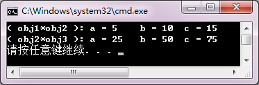

<!-- page: 133 -->

      Vector(){  }
      Vector(int i,int j)  {  x = i; y = j;  }
      friend Vector operator+ ( Vector v1, Vector v2 )
      {  Vector tempVector;
         tempVector.x = v1.x + v2.x;
         tempVector.y = v1.y + v2.y;
         return  tempVector;
      }
      void display()
      {  cout << "( " << x << ", " << y << ") "<< endl;  }
   private:
      int x, y;
};
int main()
{  Vector v1( 1, 2 ), v2( 3, 4 ), v3;
   cout << "v1 = ";
   v1.display();
   cout << "v2 = ";
   v2.display();
   v3 = v1 + v2;
   cout << "v3 = v1 + v2 = ";
   v3.display();
}
【解答】

3．在同步练习7.1 的程序练习中，用于连接字符串的重载“+”运算符函数被重载为class s 的成员函

数。请用友元函数定义改写之。

【解答】

#include <iostream>

#include<cstring>

using namespace std;

class s

{

public:

    s()

     { *str = '\0'; len = 0; }

s( char *pstr )

     {

strcpy_s( str,pstr );

        len=strlen(pstr);

}

char *gets()

    {  return str;  }

    int getLen()

    {  return len;  }

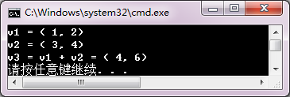

<!-- page: 134 -->

friend s operator+( s obj1, s obj2 );
//声明友元函数

private:

char str[100];

int len;

};

s operator+( s obj1, s obj2  )

{

  strcat_s( obj1.str,obj2.str );

    return obj1.str;

}

int main()

{

s obj1( "Visual" ),obj2( " C++" ),obj3(" language");

obj3 = obj1 + obj2 + obj3;

cout << "obj3.str = "<<obj3.gets() << endl;

}

同步练习7.3

<!-- question: cpp-032-Q78 -->

一、选择题

1．设有类A的对象Aobject，若用成员函数重载前置自增表达式，那么++Aobject 被编译器解释为（    ）。

（A）Aobject.operator++()
（B）operator++(Aobject)

（C）++(Aobject)
（D）Aobject :: operator++()

2．运算符++，=，+和[]中，只能用成员函数重载的运算符是（    ）。

（A）+和=
（B）[]和后置++

（C）=和[]
（D）前置++和[]

3．在C++中，如果在类中重载了函数调用运算符()，那么重载函数调用的一般形式为（    ）。

（A）（表达式）对象
（B）（表达式表）对象

（C）对象（表达式）
（D）对象（表达式表）

4．设有类A 的对象Aobject，若用友元函数重载后置自减表达式，那么Aobject--被编译器解释为

（    ）。

（A）Aobject.operator-- ()
（B）operator-- (Aobject,0)

（C）-- (Aobject,0)
（D）-- (Aobject,0)

5．如果表达式++j*k 中的++和*都是重载的友元运算符，则采用运算符函数调用格式，该表达式还可

以表示为（    ）。

（A）operator*(j.operator++(),k)
（B）operator*(operator++(j),k)

（C）operator++(j).operator*(k)
（D）operator*(operator++(j),)

6．如果类A 要重载插入运算符<<，那么重载函数参数表的形式一般定义为（    ）。

（A）(constA&)
（B）(ostream&)

（C）(constA&, ostream&)
（D）(ostream&, constA&)
【解答】
A
C
D
B
B
D

<!-- page: 135 -->

<!-- question: cpp-032-Q79 -->

二、程序练习

改写下述程序中的student 类，用重载运算符>>函数代替input 函数；用重载运算符<<函数代替output

函数；并修改main 函数，使其得到正确的运行结果。

#include <iostream>
using namespace std;
class student
{     char name[20];
      unsigned id;
      double score;
   public:
      student(char s[20]="\0", unsigned k=0, double t=0)
      {  strcpy_s(name,s);
         id=k;
         score=t;
      }
      void input()
      {  cout<<"name? ";
         cin>>name;
         cout<<"id? ";
         cin>>id;
         cout<<"score? ";
         cin>>score;
      }
      void output()
      {  cout<<"name: "<<name<<"\tid: "<<id<<"\tscore: "<<score<<endl;  }
};
int main()
{  student s;
   s.input();
   s.output();
}
【解答】

#include <iostream>
using namespace std;
class student
{
 char name[20];
 unsigned id;
 double score;
 public:
student(char s[20]="\0", unsigned k=0, double t=0)
{
strcpy_s(name,s);
id=k;
score=t;
}
friend ostream & operator<<(ostream &, const student &);
friend istream & operator>>(istream &, student &);
};
ostream & operator<<(ostream &out, const student &s)
{
   out<<"name: "<<s.name<<"\tid: "<<s.id<<"\tscore: "<<s.score<<endl;

return out;
}

<!-- page: 136 -->

istream & operator>>(istream &in, student &s)
{

cout<<"name? ";
in>>s.name;
cout<<"id? ";
in>>s.id;
cout<<"score? ";
in>>s.score;
return in;
}
int main()
{
 student s;
 cin>>s;
 cout<<s;
}

同步练习7.4

<!-- question: cpp-032-Q80 -->

一、选择题

1．类型转换函数只能定义为一个类的（    ）。

（A）构造函数
（B）析构函数
（C）成员函数
（D）友元函数

2．具有一个非默认参数的构造函数一般用于实现从（    ）的转换。

（A）该类类型到参数类型
（B）参数类型到该类类型

（C）参数类型到基本类型
（D）类类型到基本类型

3．假设ClassX 是类类型标识符，Type 为类型标识符，可以是基本类型或类类型，Type_Value 为Type

类型的表达式，那么，类型转换函数的形式为（    ）。

（A）ClassX :: operator Type(Type t)  {  … return Type_Value;  }

（B）friendClassX :: operator Type()  {  … return Type_Value;  }

（C）Type ClassX :: operator Type()  {  … return Type_Value;  }

（D）ClassX :: operator Type()  {  … return Type_Value;  }

4．在下列关于类型转换的描述中，错误的是（    ）。

（A）任何形式的构造函数都可以实现数据类型转换。

（B）带非默认参数的构造函数可以把基本类型数据转换成类类型对象。

（C）类型转换函数可以把类类型对象转换为其他指定类型对象。

（D）类型转换函数只能定义为一个类的成员函数，不能定义为类的友元函数。

5．C++中利用构造函数进行类类型转换时的构造函数形式为（    ）。

（A）类名::类名(arg);
（B）类名::类名(arg,arg1=E1,…,agrn=En);

（C）~类名(arg);
（D）~类名(arg,arg1=E1,…,agrn=En);
【解答】 C
B
D
A
B

<!-- question: cpp-032-Q81 -->

二、程序练习

1．阅读下面程序，按注释位置指出语句的性质。
#include<string.h>
#include<iostream>
using namespace std;
//定义String 类

<!-- page: 137 -->

class String
{     friend ostream &operator<<(ostream & output,String &s);
//（1）什么语句
      friend istream &operator>>(istream & input,String &s); //（2）什么语句
   public:
      String(const char *m="");
//（3）什么语句
      ~String();
//（4）什么语句
      operator int() const;
//（5）什么语句
      operator char* ()const;
//（6）什么语句
   private:
      char *str;
      int size;
};
//（7）什么定义
String::String(const char *m)
{  size=strlen(m);
   str=new char[size+1];
   strcpy_s(str,size+1,m);
}
//（8）什么定义
String::~String()
{  delete [] str;
   size=0;
}
//（9）什么定义
ostream &operator<<(ostream &output,String &s)
{  output<<s.str;
   return output;
}
//（10）什么定义
istream &operator>>(istream &input,String &s)
{  char temp[1000];
   input>>temp;
   delete [] s.str;
   s.size=strlen(temp);
   s.str=new char[s.size+1];
   strcpy_s(s.str,s.size+1,temp);
   return input;
}
//（11）什么定义
String::operator int()const
{  return size;  }
//（12）什么定义
String::operator char* () const
{  static char temp[1000];
   strcpy_s(temp,"\"");
   strcat_s(temp,str);
   strcat_s(temp,"\"");
   return temp;
}
int main()
{  char s[100];
   String s1,s2;
//（13）调用什么函数
   cout<<"Please input two strings:"<<endl;

<!-- page: 138 -->

   cin>>s1>>s2;
//（14）调用什么函数
   cout<<"output is:"<<endl;
   cout<<"s1 as String--"<<s1<<endl;
//（15）调用什么函数
   cout<<"sizeof(s1) -sizeof(s2)="<<((int)s1- (int)s2)<<endl; //（16）调用什么函数
   cout<<"s1 as char * --"<<(char*)s1<<endl;
//（17）调用什么函数
   cout<<"s2 as char * --"<<(char*)s2<<endl;
//（18）调用什么函数
   strcpy(s,s2);
//（19）调用什么函数
   cout<<"After strcpy(s,s2); s="<<s<<endl;
//（20）调用什么函数
   return 0;
//（21）调用什么函数
}
【解答】

#include<string.h>
#include<iostream>
using namespace std;
//定义String类
class String
{
friend ostream &operator<<(ostream & output,String &s);
//（1）运算符<<重载函数声明
friend istream &operator>>(istream & input,String &s);
//（2）运算符>>重载函数声明
public:
String(const char *m="");
//（3）构造函数声明
~String();
//（4）析构函数声明
operator int() const;
//（5）类型转换函数声明
operator char* ()const;
//（6）类型转换函数声明
private:
char *str;
int size;
};
//（7）定义构造函数
String::String(const char *m)
{
size=strlen(m);
str=new char[size+1];
strcpy_s(str,size+1,m);
}
//（8）定义析构函数
 String::~String()
 {  delete [] str;
size=0;
 }
//（9）定义运算符<<重载函数
ostream &operator<<(ostream &output,String &s)
{
output<<s.str;
return output;
}
//（10）定义运算符>>重载函数
istream &operator>>(istream &input,String &s)
{
char temp[1000];
input>>temp;
delete [] s.str;
s.size=strlen(temp);
s.str=new char[s.size+1];
strcpy_s(s.str,s.size+1,temp);
return input;
}
//（11）定义int类型转换函数
String::operator int()const
{

<!-- page: 139 -->

return size;
}
//（12）定义char*类型转换函数
String::operator char* () const
{
static char temp[1000];
strcpy_s(temp,"\"");
strcat_s(temp,str);
strcat_s(temp,"\"");
return temp;
}
int main()
{
char s[100];
String s1,s2;
//（13）调用构造函数
cout<<"Please input two strings:"<<endl;
cin>>s1>>s2;
//（14）调用operator>>函数
cout<<"output is:"<<endl;
cout<<"s1 as String--"<<s1<<endl;
//（15）调用operator<<函数
cout<<"sizeof(s1)-sizeof(s2)="<<((int)s1-(int)s2)<<endl; //（16）调用operator int类型转换函数
cout<<"s1 as char * --"<<(char*)s1<<endl;
//（17）调用operator char*类型转换函数
cout<<"s2 as char * --"<<(char*)s2<<endl;
//（18）调用operator char*类型转换函数
strcpy_s(s,s2);
//（19）对参数s2调用类型转换函数operator char*，然后调用库函数
cout<<"After strcpy(s,s2); s="<<s<<endl;
//（20）调用库函数输出串
return 0;
//（21）调用析构函数
}

2．定义人民币类RMB，包含：

私有数据成员
int yuan（元）、int jiao（角）、int fen（分）、bool mark（标志，表示正、负数）

成员函数
用（元，角，分，标志）构造RMB 对象

用double 数据构造RMB 对象

类型转换，把RMB 对象转换为double 值

友元函数
重载<<，以“元角分”形式输出RMB 对象值

重载>>，以“元角分”形式输入RMB 对象值

以下是main 函数的测试和运行显示。请补充RMB 类的定义。

#include<iostream>
using namespace std;
//此处定义class RMB
int main()
{  RMB a, b;
   double c;
   cout<<"a :\n";  cin>>a;
   cout<<"b :\n";  cin>>b;
   cout<<"c :\n";  cin>>c;
   cout<<"a = "<<a<<"\tb = "<<b<<"\tc = "<<RMB(c)<<endl;
   cout<<"a + c = "<<RMB(a+c)<<endl;
   cout<<"a - b = "<<RMB(a-b)<<endl;
   cout<<"b * 2 = "<<RMB(b*2)<<endl;
   cout<<"a * 0.5 = "<<RMB(a*0.5)<<endl;
}
【解答】

#include<iostream>

<!-- page: 140 -->

using namespace std;
class RMB
{
int yuan, jiao, fen ;
bool mark;
 public:
RMB(int y, int j, int f, bool mark=false);
RMB(double x=0);
operator double()const;
friend istream& operator>>(istream&, RMB&);
friend ostream& operator<<(ostream&, RMB);
};
RMB::RMB(int y, int j, int f, bool m )
{
   yuan=y; jiao=j; fen=f; mark=m;
}
RMB::RMB(double x)
{
 if(x<0)
 {
    mark=true; x=-x;
 }
 else
    mark=0;
 int n=int((x+0.005)*100);
 yuan=n/100;
 jiao=(n-yuan*100)/10;
 fen=n%10;
}

RMB::operator double()const
{
 double x=yuan+jiao/10.0+fen/100.0;
 if(mark) x=-x;
 return x;
}
istream& operator>>(istream&input, RMB &r)
{
 cout<<"元？"; input>>r.yuan;
 cout<<"角？"; input>>r.jiao;
 cout<<"分？"; input>>r.fen;
 return input;
}
ostream& operator<<(ostream& output, RMB r)
{
 if(r.mark) output<<" - ";
 output<<r.yuan<<"元"<<r.jiao<<"角"<<r.fen<<"分";
 return output;
}
int main()
{
 RMB a, b;
 double c;
 cout<<"a :\n";  cin>>a;
 cout<<"b :\n";  cin>>b;
 cout<<"c :\n";  cin>>c;

<!-- page: 141 -->

 cout<<"a = "<<a<<"\tb = "<<b<<"\tc = "<<RMB(c)<<endl;
 cout<<"a + c = "<<RMB(a+c)<<endl;
 cout<<"a - b = "<<RMB(a-b)<<endl;
 cout<<"b * 2 = "<<RMB(b*2)<<endl;
 cout<<"a * 0.5 = "<<RMB(a*0.5)<<endl;
}

习题

<!-- question: cpp-032-Q82 -->

一、思考题

1．一个运算符重载函数被定义为成员函数或友元函数后，在定义方式、解释方式和调用方式上有何

区别？可能会出现什么问题？请用一个实例说明之。

【解答】

以二元运算符为例。

定义
解释
调用

运算符

重载

Obj op 或 op Obj

成员函数
Obj& operator op();

Obj.operator op()

Obj operator op(object);

ObjL op ObjR

ObjL.operator op(ObjR)

左操作数通过this 指针指定，右操作数

由参数传递

Obj op  或  op Obj

友员函数
friend Obj & operator op(Obj &);

operator op(Obj)

friend Obj operator op(Obj,Obj);

operator op(ObjL,ObjR)

ObjL op ObjR

操作数均由参数传递

可能会出现的问题：

（1）运算符的左右操作数不同，须用友员函数重载；

（2）当运算符的操作需要修改类对象状态时，应用成员函数重载。

（3）友员函数不能重载运算符 = () [] ->

必须要用友员函数重载的运算符 >> <<

程序略。

2．类类型对象之间、类类型和基本类型对象之间用什么函数进行类型转换？归纳进行类型转换的构

造函数和类型转换函数的定义形式、调用形式和调用时机。

【解答】

构造函数可以把基本类型、类类型数据转换成类类型数据；类类型转换函数可以在类类型和基本数据

类型之间做数据转换。

定义形式
调用形式
调用时机

构造函数
ClassX::ClassX(arg,arg1=E1,...,argn=En);
隐式调用
建立对象、参数传递时

类类型转换函数
ClassX::operator Type();
用类型符显式调用；

需要做数据类型转换时

自动类型转换时隐式调用

<!-- question: cpp-032-Q83 -->

二、程序设计

1．定义一个整数计算类Integer，实现短整数+、-、*、/基本算术运算。要求：可以进行数据范围检

查（−32 768～32 767，或自行设定），数据溢出时显示错误信息并中断程序运行。

【解答】

#include <iostream>

<!-- page: 142 -->

using namespace std;

class Integer

{

 private:

    short a;

  public:

Integer (short n=0){ a=n;}

Integer operator +(Integer);

Integer operator -(Integer);

Integer operator *(Integer);

Integer  operator /(Integer);

Integer operator =(Integer);

void display() { cout<<a<<endl; }

};

Integer Integer::operator+(Integer x)

{

 Integer temp;

  if(a+x.a<-32768||a+x.a>32767)

{ cout<<"Data overflow!"<<endl; abort(); }

  temp.a=a+x.a;

  return temp;

}

Integer Integer::operator-(Integer x)

{

 Integer temp;

if(a-x.a<-32768||a-x.a>32767)

{ cout<<"Data overflow!"<<endl; abort(); }

temp.a=a-x.a;

return temp;

}

Integer Integer::operator*(Integer x)

{

 Integer temp;

if(a*x.a<-32768||a*x.a>32767)

 {cout<<"Data overflow!"<<endl; abort();}

temp.a=a*x.a;

return temp;

}

Integer  Integer::operator/(Integer x)

{

 Integer temp;

 if(a/x.a<-32768||a/x.a>32767)

{ cout<<"Data overflow!"<<endl; abort(); }

 temp.a=a/x.a;

 return temp;

}

 Integer Integer::operator=(Integer x)

<!-- page: 143 -->

 {

 a=x.a;

   return *this;

 }

int main()

{

 Integer A(90),B(30),C;

cout<<"A=";A.display();

cout<<"B=";B.display();

C=A+B;

cout<<"C=A+B="; C.display();

C=A-B;

cout<<"C=A-B="; C.display();

C=A*B;

cout<<"C=A*B="; C.display();

C=A/B;

cout<<"C=A/B="; C.display();

}

2．定义一个实数计算类Real，实现单精度浮点数+、−、*、/基本算术运算。要求：可以进行数据范

围（−3.4×1038～3.4×1038，或自行设定）检查，数据溢出时显示错误信息并中断程序运行。

【解答】

#include <iostream>

using namespace std;

class Real

{

 private:

    double a;

  public:

    Real (double r=0){a=r;}

    Real operator +(Real);

    Real operator -(Real);

    Real operator *(Real);

    Real operator /(Real);

    Real operator =(Real);

void display()

{ cout<<a<<endl; }

};

Real Real::operator+(Real x)

{

 Real temp;

  if(a+x.a<-1.7e308||a+x.a>1.7e308)

{ cout<<"Data overflow!"<<endl; abort(); }

  temp.a=a+x.a;

  return temp;

}

Real Real::operator-(Real x)

<!-- page: 144 -->

{

 Real temp;

if(a-x.a<-1.7e308||a-x.a>1.7e308)

{ cout<<"Data overflow!"<<endl; abort(); }

temp.a=a-x.a;

return temp;

}

Real Real::operator*(Real x)

{

 Real temp;

if(a*x.a<-1.7e308||a*x.a>1.7e308)

{ cout<<"Data overflow!"<<endl; abort(); }

temp.a=a*x.a;

return temp;

}

Real Real::operator/(Real x)

{

 Real temp;

  if(a/x.a<-1.7e308||a/x.a>1.7e308)

{ cout<<"Data overflow!"<<endl; abort(); }

  temp.a=a/x.a;

  return temp;

}

 Real Real::operator=(Real x)

 {

 a=x.a;

return *this;

 }

int main()

{

 Real A(1.1),B(1.2),C;

  cout<<"A=";A.display();

  cout<<"B=";B.display();

  C=A+B;

  cout<<"C=A+B="; C.display();

  C=A-B;

  cout<<"C=A-B="; C.display();

  C=A*B;

  cout<<"C=A*B="; C.display();

  C=A/B;

  cout<<"C=A/B="; C.display();

}

3．假设有向量X = ( x1, x2,…, xn)和Y = ( y1, y2,…, yn )，它们之间的加、减和乘法分别定义为：

X + Y = ( x1 + y1, x2 + y2,…, xn + yn )

X − Y = ( x1 − y1, x2 − y2,…, xn − yn )

X ∗ Y = x1 ∗ y1 + x2 ∗ y2 +…+ xn ∗ yn

<!-- page: 145 -->

编写程序定义向量类Vector，重载运算符+、−、∗和=，实现向量之间的加、减、乘、赋值运算；重载

运算符>>、<<实现向量的输入、输出功能。注意检测运算的合法性。

提示：向量类的声明可以是：

class Vector
{  private:
      double *v;
      int len;
  public:
      Vector(int size);
      Vector(double *,int);
      ~Vector();
      double &operator;
      Vector & operator =(Vector &);
      friend Vector operator +(Vector &,Vector &);
      friend Vector operator - (Vector &,Vector &);
      friend double operator *(Vector &,Vector &);
      friend ostream & operator <<(ostream &output,Vector &);
      friend istream & operator >>(istream &input,Vector &);
};

【解答】

#include <iostream>

using namespace std;

class Vector

{

 private:

    double *v;

    int len;

public:

Vector(int size);

Vector(double *,int);

~Vector();

double &operator;

Vector & operator =(Vector &);

friend Vector operator +(Vector &,Vector &);

friend Vector operator -(Vector &,Vector &);

friend double operator *(Vector &,Vector &);

friend ostream & operator <<(ostream &output,Vector &);

friend istream & operator >>(istream &input,Vector &);

};

Vector::Vector (int size)

{

 if(size<=0||size>=2147483647)

{ cout<<"The size of "<<size<<"is overflow!\n";

abort();

}

v=new double [size];

for(int i=0;i<size;i++) v[i]=0;

len=size;

}

<!-- page: 146 -->

Vector::Vector(double *C,int size)

{

 if(size<=0||size>=2147483647)

{ cout<<"The size of"<<size<<"is overflow!\n"<<endl;

      abort();

}

v=new double[size];

len=size;

for(int i=0;i<len;i++) v[i]=C[i];

}

Vector::~Vector()

{

 delete []v;

   v=NULL;  len=0;

 }

double &Vector::operator

{

 if(i>=0 && i<len)

return v[i];

   else

    { cout<<"The size of"<<i<<"is overflow!\n";

      abort();}

 }

Vector &Vector::operator =(Vector &C)

{

 if(len==C.len)

 {

  for(int i=0;i<len;i++)

      v[i]=C[i];

    return *this;

 }

 else

 {

  cout<<"Operator = fail!\n";

     abort();

}

}

Vector operator +(Vector &A,Vector &B)            // 向量相加

{

 int size=A.len ;

  double *T=new double[size];

  if(size==B.len)

  {

 for(int i=0;i<size;i++)

      T[i]=A[i]+B[i];

    return Vector (T,size);

  }

<!-- page: 147 -->

  else

  {

 cout<<"Operator + fail!\n";

     abort();

}

}

Vector operator -(Vector &A,Vector &B)             //向量相减

{

 int size=A.len ;

  double *T=new double[size];

  if(size==B.len)

{ for(int i=0;i<size;i++)

     T[i]=A[i]-B[i];

  return Vector (T,size);

}

  else

{

 cout<<"Operator - fail!\n";

   abort();

}

}

double operator *(Vector &A,Vector &B)              //向量相乘

{

 int size=A.len ;

  double s=0;

  if( size==B.len )

{

 for( int i=0; i<size; i++ )

     s+=A[i]*B[i];

   return s;

}

  else

{

 cout<<"Operator * fail!\n";

   abort();

}

}

ostream & operator <<(ostream &output,Vector &A)     //输出

{

  int i;

output<<'(';

   for( i=0;i<A.len-1;i++)

     output<<A[i]<<',';

   output<<A[i]<<')';

   return output;

}

istream & operator >>(istream &input,Vector &A)     //输入

<!-- page: 148 -->

{

 for(int i=0;i<A.len;i++)

input>>A[i];

return input;

}

int main()

{

int k1,k2,k3;double t;

cout<<"Input the length of Vector A:\n";

cin>>k1;

Vector A(k1);

cout<<"Input the elements of Vector A:\n";

cin>>A;

cout<<"Input the length of Vector B:\n";

cin>>k2;

Vector B(k2);

cout<<"Input the elements of Vector B:\n";

cin>>B;

cout<<"Input the length of Vector C:\n";

cin>>k3;

Vector C(k3);

cout<<"A="<<A<<endl;

cout<<"B="<<B<<endl;

C=A+B;

cout<<"A+B="<<A<<"+"<<B<<"="<<C<<endl;

C=A-B;

cout<<"A-B="<<A<<"-"<<B<<"="<<C<<endl;

t=A*B;

cout<<"A*B="<<A<<"*"<<B<<"="<<t<<endl;

}

4．定义一个类nauticalmile_kilometer，它包含两个数据成员kilometer（千米）和meter（米）；还包含

一个构造函数对数据成员进行初始化；成员函数print，用于输出数据成员kilometer 和meter 的值；类型转

换函数operator double，实现把千米和米转换为海里（1 海里=1.852 千米）的功能。编写main 函数，测试

类nauticalmile_kilometer。

【解答】

#include <iostream>

using namespace std;

const double n = 1.852;     // 定义海里与千米和米的转换系数(1 海里=1.852 千米)

class nauticalmile_kilometer

{

 public:

nauticalmile_kilometer( int km,double m )

 {

 kilometer = km;  meter = m;

 }

<!-- page: 149 -->

void print()

 {

cout<<"kilometer="<<kilometer<<'\t'<<"meter="<<meter<<endl;

}

operator double();

private:

int kilometer;

double meter;

};

nauticalmile_kilometer::operator double()

{

  return ( meter / 1000 + double( kilometer )) / n;

}

int main()

{

nauticalmile_kilometer  obj( 100,50 );

  obj.print();

  cout << "nauticalmile=" << double( obj ) << endl;

}

5．定义一个集合类setColour，要求元素为枚举类型值。例如，

enum colour { red, yellow, blue, white, black };

集合类实现交、并、差、属于、蕴含、输入、输出等各种基本运算。设计main 函数测试setColour 类

的功能。

【解答】

枚举类型数据用序值参与运算。定义枚举集合关键是对输入/输出操作进行显示转换。

程序略。

6．为例7-9 的String 类增加定义两个类型转换函数：

String::operator int()const;

String::operator double()const;

把数值形式的字符串转换成int 或double 类型数据，并在main 函数进行测试。

【解答】

#include<iostream>

#include<cstring>

using namespace std;

class String

{

   char *data;

   int size;

 public:

    String( char* s);

    operator char* () const;
//把类对象转换成字符串

    operator int()const;
//把类对象转换成int类型数值

    operator double()const;
//把类对象转换成double类型数值

<!-- page: 150 -->

};

String::String( char* s)

{

   size=strlen(s);

   data = new char(size+1);

   strcpy_s(data,size+1,s);

}

String::operator char* () const

{

  return data;

}

String::operator int()const

{

 int i, n=0;

 for(i=0; i<size; i++)

 {

    if(data[i]<'0'||data[i]>'9')

    {

      cout<<"#No int#\n";

      exit(0) ;

    }

    else

    {

      n*=10;

      n+=int(data[i]-'0');

    }

  }

 return n;

}

String::operator double()const

{

 double x=0, p=1;

 int i, point=size;

 for(i=0; i<size; i++)

 {

    if((data[i]<'0'||data[i]>'9')&&data[i]!='.')

    {

      cout<<"#No double#\n";

      exit(0) ;

    }

    if(data[i]=='.') point=i;
//记录小数点位置

    if(i<point)
//处理整数部分

    {

      x*=10;

      x+=int(data[i]-'0');

    }

    if(i>point)
//处理小数部分

<!-- page: 151 -->

    {

      p/=10;

      x+=int(data[i]-'0')*p;

    }

  }

 return x;

}

void main()

{

String sobj = "hell";

char * svar = sobj;

cout<<svar<<endl;

String iobj="2345";

int k;

k=int(String("456"))+100;
//把字符串转换成int数据

cout<<"k="<<k<<endl;

double w;

w=double(String("3.14"))*2;
//把字符串转换成double数据

cout<<"w="<<w<<endl;

}

第8 章习题与解答

同步练习8.1

1．一个大的应用程序，通常由多个类构成，类与类之间互相协同工作, 它们之间有三种主要关系。下

列不属于类之间关系的是（    ）。

（A）gets-a
 （B）has-a
（C）uses-a
 （D）is-a

2．在C++中，类之间的继承关系具有（    ）。

（A）自反性
（B）对称性
（C）传递性
（D）反对称性

3．下列关于类之间关系的描述，正确的是（    ）。

（A）has-a 表示一个类部分地使用另一个类
（B）uses-a 表示类的包含关系

（C）is-a 关系具有对称性。
（D）is-a 机制称为“继承”

4．下列关于类的描述，正确的是（    ）。

（A）父类具有子类的特征
（B）一个类只能从一个类继承

（C）is-a 关系具有传递性
（D）uses-a 表示类的继承机制

5．下列关于类之间关系的描述，错误的是（    ）。

（A）用有向无环图（DAG）表示的类之间关系，称为“类格”

（B）DAG 中每个结点是一个类定义，它的前驱结点称为基类

（C）DAG 中每个结点是一个类定义，它的后继结点称为派生类

（D）DAG 中每个结点是一个类定义，它有且仅有一个前驱结点

6．下列关于类的继承描述中，正确的是（    ）。

（A）派生类公有继承基类时，可以访问基类的所有数据成员，调用所有成员函数。

（B）派生类也是基类，所以它们是等价的。

<!-- page: 152 -->

（C）派生类对象不会建立基类的私有数据成员，所以不能访问基类的私有数据成员。

（D）一个基类可以有多个派生类，一个派生类可以有多个基类。

【解答】
A
C
D
C
D
D

同步练习8.2

<!-- question: cpp-032-Q84 -->

一、选择题

1．当一个派生类公有继承一个基类时，基类中的所有公有成员成为派生类的（    ）。

（A）public 成员
（B）private 成员
（C）protected 成员
（D）友元

2．当一个派生类私有继承一个基类时，基类中的所有公有成员和保护成员成为派生类的（    ）。

（A）public 成员
（B）private 成员
（C）protected 成员
（D）友元

3．当一个派生类保护继承一个基类时，基类中的所有公有成员和保护成员成为派生类的（    ）。

（A）public 成员
（B）private 成员
（C）protected 成员
（D）友元

4．不论派生类以何种方式继承基类，都不能直接使用基类的（    ）。

（A）public 成员
（B）private 成员
（C）protected 成员
（D）所有成员

5．在C++中，不加说明，则默认的继承方式是（    ）。

（A）public
（B）private
（C）protected
（D）public 或protected

6．某公有派生类的成员函数不能直接访问基类中继承来的某个成员，则该成员一定是基类中的（    ）。

（A）私有成员
（B）公有成员
（C）保护成员
（D）保护成员或私有成

员

7．下列关于类层次中重名成员的描述，错误的是（    ）。

（A）C++允许派生类的成员与基类成员重名

（B）在派生类中访问重名成员时，屏蔽基类的同名成员

（C）在派生类中不能访问基类的同名成员

（D）如果要在派生类中访问基类的同名成员，可以显式地使用作用域符指定

8．下列关于类层次中静态成员的描述，正确的是（    ）。

（A）在基类中定义的静态成员，只能由基类的对象访问

（B）在基类中定义的静态成员，在整个类体系中共享

（C）在基类中定义的静态成员，不管派生类以何种方式继承，在类层次中具有相同的访问性质

（D）一旦在基类中定义了静态成员，就不能在派生类中再定义
【解答】 A
B
C
B
B
A
C
B

<!-- question: cpp-032-Q85 -->

二、程序练习

1．阅读程序，写出运行结果。

#include<iostream>

using namespace std;

class Base

{  public :

      void get( int i,int j,int k,int l )

      {  a = i; b = j; x = k;  y = l; }

      void print()

      {  cout << "a = "<< a << '\t' << "b = " << b << '\t'

            << "x = " << x << '\t' << "y = " << y << endl;

<!-- page: 153 -->

      }

      int a, b;

   protected :

      int x, y;

};

class A : public Base

{  public :

      void get( int i, int j, int k, int l )

      {  Base obj3;

         obj3.get( 50, 60, 70, 80 );

         obj3.print();

         a = i; b = j; x = k; y = l;

         u = a + b + obj3.a; v = y - x + obj3.b;

      }

      void print()

      {  cout << "a = " << a << '\t' << "b = " << b << '\t'

             << "x = " << x << '\t' << "y = " << y << endl;

         cout << "u = " << u << '\t' << "v = " << v << endl;

      }

   private:

      int u, v;

};

int main()

{  Base obj1;

   A obj2;

   obj1.get( 10, 20, 30, 40 );

   obj2.get( 30, 40, 50, 60 );

   obj1.print();

   obj2.print();

}

【解答】

2．阅读程序，写出运行结果。

#include<iostream>

using namespace std;

class A

{  public :

      A( int i, int j )  {  a=i; b=j;  }

      void Add( int x, int y )  {  a += x;  b += y;  }

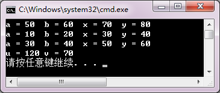

<!-- page: 154 -->

      void show()  {  cout << "("<<a<<")\t("<<b<<")\n";  }

   private :

      int a, b;

};

class B : public A

{  public :

      B(int i, int j, int m, int n) : A( i, j ),x( m ), y( n ) {}

      void show()  {  cout << "(" << x << ")\t(" << y << ")\n";  }

      void fun()  {  Add( 3, 5 );  }

      void ff()  {  A::show();  }

   private :

      int x, y;

};

int main()

{  A a( 1, 2 );

   a.show();

   B b( 3, 4, 5, 6 );

   b.fun();

   b.A::show();

   b.show();

   b.ff();

}

【解答】

3．编写程序，定义一个Rectangle 类，它包含：

数据成员 length，width

成员函数 Rectangle( double l, double w );
//构造函数

double area();
//返回矩形面积

double getlength();
//返回数据成员length 的值

double getwidth();
//返回数据成员width 的值

再定义Rectangle 的派生类Rectangular，它包含：

数据成员 height
成员函数 Rectangular( double l, double w, double h ); //构造函数

double volume();
//返回长方体体积

double getheight();
//返回数据成员height 的值

在main 函数中测试类体系，建立两个类的对象，显示它们的数据和面积、体积。

【解答】

#include <iostream>

using namespace std;

class rectangle

{

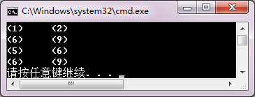

<!-- page: 155 -->

  public:

rectangle( double l, double w )

{ length = l; width = w; }

double area()

{  return( length*width ); }

double getlength()

{ return length; }

double getwidth()

{ return width; }

  private:

    double length;

double width;

};

class rectangular: public rectangle

{

   public:

rectangular( double l,double w,double h ) : rectangle( l,w )

    { height = h; }

    double getheight()

{ return height; }

double volume()

{ return area() *height; }

  private:

double height;

};

int main()

{

rectangle obj1( 2,8 );

rectangular obj2( 3,4,5 );

cout<<"length="<<obj1.getlength()<<'\t'<<"width="<<obj1.getwidth()<<endl;

cout<<"rectanglearea="<<obj1.area()<<endl;

cout<<"length="<<obj2.getlength()<<'\t'<<"width="<<obj2.getwidth();

cout<<'\t'<<"height="<<obj2.getheight()<<endl;

cout<<"rectangularvolume="<<obj2.volume()<<endl;

}

同步练习8.3

<!-- question: cpp-032-Q86 -->

一、选择题

1．在C++中，可以被派生类继承的函数是（    ）。

（A）成员函数
（B）构造函数
（C）析构函数
（D）友元函数

2．下列关于派生类对象的初始化，叙述正确的是（    ）。

（A）是由派生类的构造函数实现的

（B）是由基类的构造函数实现的

（C）是由基类和派生类的构造函数实现的

<!-- page: 156 -->

（D）是系统自动完成的，不需要程序设计者干预

3．在创建派生类对象时，构造函数的执行顺序是（    ）。

（A）对象成员构造函数—基类构造函数—派生类本身的构造函数

（B）派生类本身的构造函数—基类构造函数—对象成员构造函数

（C）基类构造函数—派生类本身的构造函数—对象成员构造函数

（D）基类构造函数—对象成员构造函数—派生类本身的构造函数

4．在具有继承关系的类层次体系中，析构函数执行的顺序是（    ）。

（A）对象成员析构函数—基类析构函数—派生类本身的析构函数

（B）派生类本身的析构函数—对象成员析构函数—基类析构函数

（C）基类析构函数—派生类本身的析构函数—对象成员析构函数

（D）基类析构函数—对象成员析构函数—派生类本身的析构函数

5．在创建派生类对象时，类层次中构造函数的执行顺序是由（    ）。

（A）派生类的参数初始式列表的顺序决定的
（B）系统规定的

（C）是由类的书写顺序决定的
（D）是任意的
【解答】 A
C
D
B
B

<!-- question: cpp-032-Q87 -->

二、程序练习

1．阅读程序，写出运行结果。

#include<iostream>

using namespace std;

class Base1

{  public :

      Base1( int i )

      {  cout << "调用基类Base1 的构造函数:" << i << endl;  }

};

class Base2

{  public:

      Base2( int j )

      {  cout << "调用基类Base2 的构造函数:" << j << endl;  }

};

class A : public Base1, public Base2

{  public :

      A( int a,int b,int c,int d ):Base2(b),Base1(c),b2(a),b1(d)

      {  cout << "调用派生类A 的构造函数:" << a+b+c+d << endl;  }

   private :

      Base1 b1;

      Base2 b2;

};

int main()

{  A obj( 1, 2, 3, 4 );

}

【解答】

<!-- page: 157 -->

2．编写程序。已知有一个描述个人信息的Person 类，数据成员记录个人姓名name 和身份证号idNumber；

成员函数print 输出个人信息，构造函数完成对数据成员的初始化。请根据Person 类和main 函数运行结果，

补充定义Person 类的派生类Teacher 类，除了记录教师的姓名和身份证号，还须记录职称title 和工资wage；

成员函数print 输出教师个人信息，构造函数完成对数据成员的初始化。

#include <iostream>

#include<string>

using namespace std;

class Person

{  private:

      string name;
//姓名

      string idNumber;
//身份证号

   public:

      Person( const char *n, const char *i)

        {  name = n;

           idNumber = i;

        }

      void Print() const

      {  cout<<"Name: "<<name<<"\n\tidNumber: "<<idNumber<<endl;

   }

};

//此处定义Teacher 类

int main()

{  Person p("张少华", "420106196611070538");

   Teacher t("李若山", "420106195801247168", "教授", 5000);

   p.Print();

   t.Print();

}

程序运行结果：

Name：张少华

idNumber：420106196611070538

Name：李若山

idNumber：420106195801247168

Title：教授
Wage：5000

【解答】

#include <iostream>

#include<string>

using namespace std;

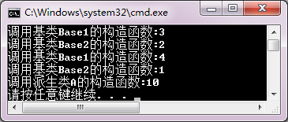

<!-- page: 158 -->

class Person

{

private:

   string name;
//姓名

   string idNumber;
//身份证号

 public:

   Person( const char *n, const char *i)

    {

name = n;

idNumber = i;

    }

   void Print() const

    {  cout<<"Name: "<<name<<"\n\tidNumber: "<<idNumber<<endl;

    }

};

//定义Teacher类

class Teacher : public Person

{

 private:

string title;
//职称

double wage;
//工资

 public:

Teacher( const char *n, const char *i, const char *t, double w)

: Person(n, i)

{

title = t; wage = w;

}

void Print() const

{

Person::Print();

cout<<"\tTitle: "<<title<<"\tWage: "<<wage<<endl;

}

};

int main()

{

 Person p("张少华", "420106196611070538");

 Teacher t("李若山", "420106195801247168", "教授", 5000);

 p.Print();

 t.Print();

}

<!-- page: 159 -->

同步练习8.5

<!-- question: cpp-032-Q88 -->

一、选择题

1．当不同的类具有相同的间接基类时，（    ）。

（A）各派生类无法按继承路线产生自己的基类版本

（B）为了建立唯一的间接基类版本，应该声明间接基类为虚基类

（C）为了建立唯一的间接基类版本，应该声明派生类虚继承基类

（D）一旦声明虚继承，基类的性质就改变了，不能再定义新的派生类

2．下列关于多继承的描述，错误的是（     ）。

（A）一个派生类对象可以拥有多个直接或间接基类的成员

（B）在多继承时不同的基类可以有同名成员

（C）对于不同基类的同名成员，派生类对象访问它们时不会出现二义性

（D）对于不同基类的不同名成员，派生类对象访问它们时不会出现二义性

3．下面关于基类和派生类的描述，正确的是（     ）。

（A）一个类可以被多次说明为一个派生类的直接基类，可以不止一次地成为间接基类

（B）一个类不能被多次说明为一个派生类的直接基类，可以不止一次地成为间接基类

（C）一个类不能被多次说明为一个派生类的直接基类，且只能成为一次间接基类

（D）一个类可以被多次说明为一个派生类的直接基类，但只能成为一次间接基类

4．下列关于虚继承的说明形式的描述，正确的是（     ）。

（A）在派生类类名前添加关键字virtual
（B）在基类类名前添加关键字virtual

（C）在基类类名后添加关键字virtual

（D）在派生类类名后，类继承的关键字之前添加关键字virtual

5．设置虚基类的目的是（     ）。

（A）简化程序
（B）消除二义性
（C）提高运行效率 （D）减少目标代码

【解答】
C
C
B
D
B

<!-- question: cpp-032-Q89 -->

二、程序练习

  阅读程序，写出运行结果。

#include<iostream>

using namespace std;

class A

{  public :

      A(const char *s)  {  cout << s << endl;  }

      ~A() {}

};

class B : virtual public A

{  public :

      B(const char *s1, const char *s2) : A( s1 )  {  cout << s2 << endl;  }

};

class C : virtual public A

{  public :

      C(const char *s1, const char *s2):A(s1)  {  cout << s2 << endl;  }

};

class D : public B, public C

<!-- page: 160 -->

{  public :

      D( const char *s1,const char *s2,const char *s3,const char *s4 ):

      B( s1, s2 ), C( s1, s3 ), A( s1 )

      {  cout << s4 << endl;  }

};

int main()

{  D *ptr = new D( "class A", "class B", "class C", "class D" );

   delete ptr;

}

【解答】

习题

<!-- question: cpp-032-Q90 -->

一、思考题

1．函数和类这两种程序模块都可以实现软件重用，它们之间有什么区别？

【解答】

函数是基于参数集的功能抽象模块，以调用方式实现软件重用，函数之间没有逻辑关系。

类是数据属性与操作的封装，以继承方式实现软件重用，类之间构成有向无回图的类格。

2．按照类成员的访问特性、类层次的继承特点，制作一张表格，总结各种类成员在基类、派生类中

的可见性和作用域。

【解答】

           基类成员

public
protected
private

派生类继承

public
在派生类中访问特性不变。派生

在派生类中访问特性不

类和类外均可见，有作用域。

变。类体系中可见。
基类私有成员，仅在

基类中可见。
protected
成为派生类保护段成员。在整个类体系中可见。

private
成为派生类私有成员。仅在派生类和基类中可见。

派生类不论以何种方式继承基类，基类所有成员在整个类体系有作用域。

3．若有以下说明语句：

class A

{  private : int a1;

public : int a2; double x;

 /*…*/

};

class B : private A

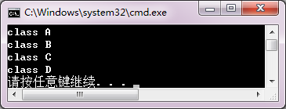

<!-- page: 161 -->

{  private : int b1;

   public : int b2;  double x;

/*…*/

};

B b;

对象b 将会生成什么数据成员？与继承关系、访问特性、名字有关吗？

【解答】

对象b 生成的数据成员有a1 a2 A::x b1 b2 B::x，共六个数据成员。数据成员的建立和继承关系、访问

特性、名字无关。

4．若有以下说明语句：

class A

{  /*…*/

   public : void sameFun();

};

class B : public A

{  /*…*/

   public : void sameFun();

};

void comFun()

{  A a;

   B b;

   /*…*/

}

（1）若在B::sameFun 中调用A::sameFun，语句格式如何？它将在什么对象上操作？

（2）在comFun 中可以用什么方式调用A::sameFun 和B::sameFun？语句格式如何？它们将可以在什么

对象上操作？

【解答】

（1）若要在B::sameFun 中调用A::sameFun，语句形式应为：

A::samefun();
//域作用符说明调用基类函数

调用的A::samefun 将在B 类对象上进行操作。

（2）在comFun 中调用B::sameFun 和A::sameFun 的方式有：

a.A::sameFun();
//通过A 类对象调用A::sameFun，在a 类对象上操作

b.sameFun();
//通过B 类对象调用B::sameFun，在b 类对象上操作

b.A::sameFun();
//通过B 类对象调用A::sameFun

//在b 类对象上（对由基类继承下来的数据成员）操作

5．有人定义一个教师类派生一个学生类。他认为“姓名”和“性别”是教师、学生共有的属性，声

明为public，“职称”和“工资”是教师特有的，声明为private。在学生类中定义特有的属性“班级”和“成

绩”。所以有：

class teacher

{  public:

      char name[20];  char sex;

      //…

   private:

<!-- page: 162 -->

      char title[20]; double salary;

};

class student : public teacher

{  //…

   private:

      char grade[20]; int score;

};

你认为这样定义合适吗？请给出你认为合理的类结构定义。

【解答】

不合适，这样导致数据冗余。合理的结构是提取它们共有的数据和操作定义一个基类，然后分别定义

teacher 和student 作为派生类。

class person

{ protected:

char name[20];  char sex;

//……

};

class teacher : public teache

{ //……

   private:

char title[20]; double salary;

};

class student : public teacher

{ //……

private :

char grade[20] ; int score;

};

6．在第6 章的例6-21 中，定义Student 类包含了Date 类成员。可以用继承方式把Student 类定义为

Date 类的派生类吗？如何改写程序？请你试一试。

【解答】

可以用继承方式改写。程序略。

7．“虚基类”是通过什么方式定义的？如果类A 有派生类B、C，类A 是类B 虚基类，那么它也一定

是类C 的虚基类吗？为什么？

【解答】

虚基类是在声明派生类时，指定继承方式时声明的，声明虚基类的一般形式为：

class 派生类名 ： virtual 继承方式 基类名

若类A 是类B 和类C 的虚基类，但不一定是类D 的虚基类，原因在于“虚基类”中的“虚”不是基类本

身的性质。而是派生类在继承过程中的特性。关键字virtual 只是说明该派生类把基类当作虚基类继承，不

能说明基类其他派生类继承基类的方式

8．在具有虚继承的类体系中，建立派生类对象时，以什么顺序调用构造函数？请用简单程序验证你

的分析。

【解答】

在具有虚继承的类体系中，建立派生类对象时先调用间接基类构造函数，再按照派生类定义时各个直

接基类继承的顺序调用直接基类的构造函数，最后再对派生类对象自身构造函数。

<!-- page: 163 -->

另外，C++为了保证虚基类构造函数只被建立对象的类执行一次，规定在创建对象的派生类构造函数

中只调用虚基类的构造函数和进行(执行)自身的初始化。参数表中的其他调用被忽略，即直接基类的构造

函数只调用系统自带的版本，或调用自定义版本但不对虚基类数据成员初始化。

程序略。

<!-- question: cpp-032-Q91 -->

二、程序设计

1．假设某销售公司有一般员工、销售员工和销售经理。月工资的计算办法是：

一般员工月薪=基本工资；

销售员工月薪=基本工资+销售额*提成率；

销售经理月薪=基本工资+职务工资+销售额*提成率。

编写程序，定义一个表示一般员工的基类Employee，它包含三个表示员工基本信息的数据成员：编号

number、姓名name 和基本工资basicSalary。

由Employee 类派生销售员工Salesman 类，Salesman 类包含两个新数据成员：销售额sales 和静态数

据成员提成比例commrate。

再由Salesman 类派生表示销售经理的Salesmanager 类。Salesmanager 类包含新数据成员：岗位工资

jobSalary。

为这些类定义初始化数据的构造函数，以及输入数据input、计算工资pay 和输出工资条print 的成员

函数。

设公司员工的基本工资是2000 元，销售经理的岗位工资是3000 元，提成率=5/1000。在main 函数中，

输入若干个不同类型的员工信息测试你的类结构。

【解答】

#include <iostream>

using namespace std;

class Employee

{

  public:

     Employee( char Snumber[]="\0", char Sname[]="\0", double bSalary=2000 )

     {

strcpy_s(number,Snumber);

strcpy_s(name,Sname);

basicSalary=bSalary;

}

void input()

{

cout << "编号：" ;
cin >> number;

cout <<"姓名：" ;
cin >> name;

}

void print()

{

  cout<<"员工 ："<<name<<"\t\t编号："<<number<<"\t\t本月工资："<<basicSalary<<endl;

}

  protected:

     char number[5];

     char name[10];

     double basicSalary;

};

<!-- page: 164 -->

class Salesman: public Employee

{

 public:

Salesman(int sal=0)

{ sales=sal; }

void input()

{

Employee::input();

cout<<"本月个人销售额：";

cin>>sales;

}

void pay()

{

salary = basicSalary+sales*commrate;

}

void print()

{

pay();

cout<<"销售员 ："<<name<<"\t\t编号："<<number<<"\t\t本月工资："<<salary<<endl;

}

 protected:

static double commrate;

int sales;

double salary;

};

double Salesman :: commrate=0.005;

class Salesmanager : public Salesman

{

  public:

Salesmanager(double jSalary=3000)

{

   jobSalary = jSalary;

}

void input()

{

Employee::input();

cout<<"本月部门销售额：";

cin>>sales;

}

    void pay()

{

salary = jobSalary + sales*commrate;

}

void print()

     {

<!-- page: 165 -->

pay();

cout<<"销售经理 ："<<name<<"\t\t编号："<<number<<"\t\t本月工资："<<salary<<endl;

         }

private:

     double jobSalary;

};

int main()

{

 cout<<"基本员工\n";

 Employee emp1;

 emp1.input();

 emp1.print();

 cout<<"销售员\n";

 Salesman emp2;

 emp2.input();

 emp2.print();

 cout<<"销售经理\n";

 Salesmanager emp3;

 emp3.input();

 emp3.print();

}

2．试写出你所能想到的所有形状（包括二维的和三维的），生成一个形状层次类体系。生成的类体系

以Shape 作为基类，并由此派生出TwoDimShape 类和ThreeDimShape 类。它们的派生类是不同的形状类。

定义类体系中的每个类，并用main 函数进行测试。

【解答】

 略。

3．为第7 章习题的程序设计第1 题和第2 题中的Integer 类和Real 类定义一个派生类IntReal：

class IntReal : public Integer, public Real;

使其可以进行+、-、*、/、= 的左、右操作数类型不同的相容运算，并符合原有运算类型转换的语义规则。

【解答】

 略。

4．使用Integer 类，定义派生类Vector 类：

class Integer

{  //…

   protected :

      int n;

};

class Vector:public Integer

{  //…

   protected :

      int *v;

};

其中，数据成员v 用于建立向量，n 为向量长度。要求：类的成员函数可以实现向量的基本算术运算。

<!-- page: 166 -->

【解答】

 略。

5．用包含方式改写第4 题中的Vector 类，使其实现相同的功能。

class Vector

{  //…

   protected :

      Integer *v;

      Integer size;

};

【解答】

 略。

6．使用第5 题定义的Vector 类，定义它的派生类Matrix，实现矩阵的基本算术运算。

【解答】

 略。

7．用包含方式改写第6 题的Matrix 类，使其实现相同的功能。

【解答】

 略。

8．设计快捷店会员的简单管理程序。基本要求如下：

（1）定义人民币RMB 类，实现人民币的基本运算和显示。

（2）定义会员member 类，表示会员的基本信息，包括：编号（按建立会员的顺序自动生成），姓名，

密码，电话。提供输入、输出信息等功能。

（3）由RMB 类和member 类共同派生一个会员卡memberCar 类，提供新建会员、充值、消费和查询

余额等功能。

（4）main 函数定义一个memberCar 类数组或链表，保存会员卡，模拟一个快捷店的会员卡管理功能，

主要包括：

① 新建会员；

② 已有会员充值；

③ 已有会员消费（凭密码，不能透支）；

④ 输出快捷店当前会员数，营业额（收、支情况）。

【解答】

 略。

第9 章习题与解答

同步练习9.2

<!-- question: cpp-032-Q92 -->

一、选择题

1．静态联编又叫作（    ）。

（A）延迟联编
（B）早期联编
（C）晚期联编
（D）以上三者都行

<!-- page: 167 -->

2．基类的指针与派生类指针，可以分别指向基类对象或派生类对象而形成4 种情形。在这4 种情形

中，需要进行强制类型转换的是（    ）。

（A）基类指针指向基类对象
（B）基类指针指向派生类对象

（C）派生类指针指向基类对象
（D）派生类指针指向派生类对象

3．当基类指针指向派生类对象时，（    ）。

（A）发生语法错误

（B）只能调用基类自己定义的成员函数

（C）可以调用派生类的全部成员函数

（D）以上说法全部错误

4．当基类指针指向派生类对象时，利用基类指针调用派生类中与基类同名但被派生类重写后的成员

函数时，调用的是（    ）。

（A）基类的成员函数
（B）派生类的成员函数

（C）不确定
（D）先调用基类的，再调用派生类的

5. 当派生类指针指向基类对象时（    ）。

（A）可以直接调用基类的成员函数

（B）可以调用派生类对象的成员函数

（C）必须强制将派生类指针转换成基类指针才能调用基类的成员函数

（D）以上说法都不对
【解答】 B
C
B
A
C

<!-- question: cpp-032-Q93 -->

二、程序练习

写出下列程序的运行结果。

#include <iostream>
using namespace std;
class Bclass
{  public:
 Bclass( int i, int j ) { x = i; y = j; }
 int fun() { return 0; }
   protected:
int x, y;
};
class Iclass: public Bclass
{
public :
  Iclass(int i, int j, int k):Bclass(i, j) { z = k; }
  int fun() { return ( x + y + z ) / 3; }
private :
int z;
};
int main()
{
Iclass obj( 2, 4, 10 );
Bclass p1 = obj;
cout << p1.fun() << endl;
Bclass &p2 = obj;
cout << p2.fun() << endl;
cout << obj.fun() << endl;
Iclass *p3 = &obj;
cout << p3-> fun() << endl;
}
【解答】

<!-- page: 168 -->

同步练习9.3

<!-- question: cpp-032-Q94 -->

一、选择题

1. 在C++中，要实现动态联编，必须使用（    ）调用虚函数。

（A）基类指针
（B）对象名
（C）派生类指针
（D）类名

2. 下列函数中，不能说明为虚函数的是（    ）。

（A）析构函数
（B）构造函数
（C）公有成员函数 （D）私有成员函数

3. 在派生类中，重载一个虚函数时，要求函数名、参数的个数、参数的类型、参数的顺序和函数的返

回值(    )。

（A）部分相同
（B）相容
（C）不同
（D）相同

4. 下面关于构造函数和析构函数的描述，错误的是（    ）。

（A）析构函数中调用虚函数采用静态联编

（B）对虚析构函数的调用可以采用动态联编

（C）当基类的析构函数是虚函数时，其派生类的析构函数也一定是虚函数

（D）构造函数可以声明为虚函数

5. 在C++中，根据（    ）识别类层次中不同类定义的虚函数版本。

（A）参数个数
（B）参数类型
（C）函数名
（D）this 指针类型

6. 虚析构函数的作用是（    ）。

（A）虚基类必须定义虚析构函数 （B）类对象作用域结束时释放资源

（C）delete 动态对象时释放资源
（D）无意义
【解答】 A
B
D
D
D
C

<!-- question: cpp-032-Q95 -->

二、程序练习

阅读程序，写出运行结果。

#include <iostream>

using namespace std;

class Base

{ public:

    virtual void getxy( int i,int j = 0 ) { x = i; y = j; }

    virtual void fun() = 0 ;

  protected:

    int x , y;

} ;

class A : public Base

{ public:

    void fun()

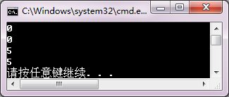

<!-- page: 169 -->

     { cout<<"x = "<<x<<'\t'<<"y = x * x = "<<x*x<<endl; }

};

class B : public Base

{ public:

    void fun()

     { cout << "x = " << x << '\t' << "y = " << y << endl;

   cout << "y = x / y = " << x / y << endl;

 }

} ;

int main()

{ Base * pb;

  A obj1;

  B obj2;

  pb = &obj1;

  pb -> getxy( 10 );

  pb -> fun();

  pb = &obj2;

  pb -> getxy( 100, 20 );

  pb -> fun();
}
【解答】

同步练习9.4

1. 在下面函数原型中，（    ）声明了fun 为纯虚函数。

（A）void fun()=0;
（B）virtual void fun()=0;

（C）virtual void fun();
（D）virtual void fun(){ };

2. 若一个类中含有纯虚函数，则该类称为（    ）。

（A）基类
（B）纯基类
（C）抽象类
（D）派生类

3. 假设Aclass 为抽象类，下列正确的说明语句是（    ）。

（A）Aclass fun( int ) ;
（B）Aclass * p ;

（C）int fun( Aclass ) ;
（D）AclassObj ;

4. 下面描述中，正确的是（    ）。

（A）虚函数是没有实现的函数
（B）纯虚函数是返回值等于0 的函数

（C）抽象类是只有纯虚函数的类
（D）抽象类指针可以指向不同的派生类

5. 异质链表是（    ）。

（A）用数组组织类对象
（B）用链表组织类对象

（C）用抽象类指针指向派生类对象
（D）用抽象类指针构造派生类对象链表
【解答】 B
C
B
D
D

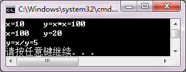

<!-- page: 170 -->

习题

<!-- question: cpp-032-Q96 -->

一、思考题

1．在C++中，使用类体系依靠什么机制实现程序运行时的多态？

【解答】

在C++中，基类指针可以指向派生类对象，以及基类中拥有虚函数，是支持多态性的前提。程序通过

用同一个基类指针访问不同派生类的虚函数重载版本实现程序运行时的多态。C++的虚特性负责自动地在

程序运行时把基类指针的关联类型转换成当前指向对象的派生类类型。

另外，抽象类机制提供了软件抽象和可扩展性的手段，实现运行时的多态性。

2．如果一个类的虚函数被声明为私有成员函数，会有语法错误吗？当它作为基类时，可以在应用类

体系时实现动态联编吗？请验证一下。

【解答】

没有语法错误。但在应用类体系时无法实现动态编联和多态。因为私有成员函数只在类内可见，在类外

无法调用，无法在类外通过基类指针实现多态。

程序略。

3．虚函数和纯虚函数的区别是什么？

【解答】

虚函数定义时冠以关键字virtual,本身有实现代码，作用是引导基类指针根据指向对象调用类体系中不同

重载版本函数。

纯虚函数是指在说明时代码“为0”的虚函数，即纯虚函数本身并没有实现代码，必须通过它的派生类

定义实现版本。

4．一个非抽象类的派生类是否可以为抽象类？利用例9-11 进行验证，从Hex_type 类派生一个

Hex_format 类，其中包含一个纯虚函数Show_format，然后定义Hex_format 的派生类定义实现Show_format。

【解答】

一个非抽象类的派生类可以为抽象类，即在派生类中定义了纯虚函数。

程序略。

<!-- question: cpp-032-Q97 -->

二、程序设计

1．使用虚函数编写程序，求球体和圆柱体的体积及表面积。由于球体和圆柱体都可以看作由圆继承

而来，因此，可以把圆类Circle作为基类。在Circle类中定义一个数据成员radius及两个虚函数area和volume。

由Circle 类派生Sphere 类和Column 类。在派生类中对虚函数area 和volume 重新定义，分别求球体和圆柱

体的体积及表面积。

【解答】

#include <iostream>

using namespace std;

const double PI=3.14159265;

class circle

{

 public:

     circle(double r) { radius = r; }

     virtual double area() { return 0.0; }

<!-- page: 171 -->

     virtual double volume() { return 0.0; }

  protected:

     double radius;

};

class sphere:public circle

{

  public:

      sphere( double r ):circle( r ){}

      double area()

{ return 4.0 * PI * radius * radius; }

      double volume()

       { return 4.0 * PI * radius * radius * radius / 3.0; }

};

class column:public circle

{

 public:

    column( double r,double h ):circle( r ) { height = h; }

    double area()

     { return 2.0 * PI * radius * ( height + radius ); }

    double volume()

     { return PI * radius * radius * height;
}

private:

     double height;

};

int main()

{

circle *p;

sphere sobj(2);

p = &sobj;

cout << "球体:" << endl;

cout << "体积 = " << p->volume() << endl;

cout << "表面积 = " << p->area() << endl;

column cobj( 3,5 );

p = &cobj;

cout << "圆柱体:" << endl;

cout << "体积 = " << p->volume() << endl;

cout << "表面积 = " << p->area() << endl;

}

2．某学校教职工的工资计算方法为：

 所有教职工都有基本工资。

 教师月工资为固定工资+课时补贴，课时补贴根据职称和课时计算。例如，每课时教授补贴50

元，副教授补贴30 元，讲师补贴20 元。

 管理人员月薪为基本工资+职务工资。

 实验室人员月薪为基本工资+工作日补贴，工作日补贴等于日补贴×月工作日数。

<!-- page: 172 -->

定义教职工抽象类，派生教师类、管理人员类和实验室类，编写程序测试这个类体系。

【解答】

#include <iostream>

using namespace std;

class staff

{

public:

staff ( double bSalary)

{

basicSalary=bSalary;

}

   virtual void input() = 0;

   virtual void output() = 0;

protected:

    char name[30];

    double basicSalary;

};

class teacher : public staff

{

public:

   teacher( int basicsalary=3000 ) : staff( basicsalary ){ }

   void input()

   {

   cout<<"姓名？";

   cin>>name;

   cout<<"职称    1，教授    2，副教授    3，讲师   （输入1，2 或 3）：";

   cin>>title;

   cout<<"课时?";

   cin>>coursetime;

   }

   void output()

{

double salary;

switch(title)

{

case 1:   salary = basicSalary+coursetime *50;  break;

case 2:   salary=basicSalary+coursetime*30;  break;

case 3:   salary=basicSalary+coursetime*20;

}

cout<<"姓名："<<name<<"\t本月工资："<<salary<<endl;

}

protected:

int coursetime;

int title;

};

class manage : public staff

{

<!-- page: 173 -->

public:

    manage( int basicsalary=2500 ) : staff( basicsalary ){ }

   void input()

   {

   cout<<"姓名？";

   cin>>name;

   cout<<"职务工资？ ";

   cin>>jobSalary;

   }

 void output()

{

double salary;

salary = basicSalary+jobSalary;

cout<<"姓名："<<name<<"\t本月工资："<<salary<<endl;

}

protected:

double jobSalary;

};

class technician : public staff

{

public:

technician( int basicsalary=2000 ) : staff( basicsalary ){ }

void input()

   {

   cout<<"姓名？";

   cin>>name;

   cout<<"工作日？";

   cin>>workdays;

   }

 void output()

{

double salary;

salary = basicSalary+workdays*20;

cout<<"姓名："<<name<<"\t本月工资："<<salary<<endl;

}

   protected:

int workdays;

};

int main()

{

teacher t;

t.input();

t.output();

manage m;

m.input();

m.output();

technician h;

<!-- page: 174 -->

h.input();

h.output();

}

3．使用第2 题中定义的教师类体系，编写程序，输入某月各种职称教师的工资信息，建立异质链表，

输出每位教师的工资条，统计当月的总工资、平均工资、最高工资和最低工资。

【解答】

略

4．改写第8 章习题第2 题的程序，把Shape 类定义为抽象类，提供共同操作界面的纯虚函数。

TwoDimShape 类和ThreeDimShape 类仍然是抽象类，只有第3 层具体类才提供全部函数的实现。在测试函

数中，使用基类指针实现不同派生类对象的操作。

【解答】

略

第10 章习题与解答

同步练习10.2

<!-- question: cpp-032-Q98 -->

一、选择题

1．关于函数模板，描述错误的是（    ）。

（A）函数模板必须由程序员实例化为可执行的函数模板

（B）函数模板的实例化由编译器实现

（C）一个类定义中，只要有一个函数模板，这个类就是类模板

（D）类模板的成员函数都是函数模板，类模板实例化后，成员函数也随之实例化

2．在下列模板说明中，正确的是（    ）。

（A）template <typename T1, T2 >
（B）template < class T1, T2 >

（C）template <typename T1, typename T2 >
（D）template ( typedef T1, typedef T2 )

3．假设有函数模板定义如下，则下列选项正确的是（    ）。
template <typename T>
Max( T a, T b ,T &c)
{  c = a + b;  }

（A）int x, y; char z; Max( x, y, z );
（B）double x, y, z; Max( x, y, z );

（C）int x, y; float z; Max( x, y, z );
（D）float x; double y, z; Max( x, y, z );

4．有以下模板说明，则T 在函数模板中（    ）。
template<typename T>

（A）可以作为返回类型、参数类型和函数中的变量类型

（B）只能作为函数返回类型

（C）只能作为函数参数类型

（D）只能用于函数中的变量类型

5. 关于函数模板的同名函数重载，叙述正确的是（    ）。

（A）函数模板由调用自行实例化，不可以定义重载版本

（B）函数模板可以用不同类型，不同个数的参数重载

（C）函数模板只能用其他类属参数重载

<!-- page: 175 -->

（D）函数模板只能用参数个数相同参数重载

【解答】
A
C
B
A
B

<!-- question: cpp-032-Q99 -->

二、程序练习

1．阅读程序，写出运行结果。
#include <iostream>
using namespace std;
template <typename T>
void fun( T &x, T &y )
{  T temp;
   temp = x;  x = y;  y = temp;
}
int main()
{  int i , j;
   i = 10; j = 20;
   fun( i, j );
   cout << "i = " << i << '\t' << "j = " << j << endl;
   double a , b;
   a = 1.1; b = 2.2;
   fun( a, b );
   cout << "a = " << a << '\t' << "b = " << b << endl;
}
【解答】

2．使用函数模板实现对不同类型数组求平均值的功能，并在main 函数中分别求一个整型数组和一个

浮点型数组的平均值。

【解答】

#include <iostream>

using namespace std;

template <typename T>

double average( T *array,int size )

{ T sum = 0;

  for( int i=0; i<size; i++ )

     sum += array[i];

     return sum / size;

 }

int main()

{ int a[] = { 1, 2, 3, 4, 5, 6, 7, 8, 9, 10 };

  double b[] = { 1.1, 2.2, 3.3, 4.4, 5.5, 6.6, 7.7, 8.8, 9.9, 10 };

  cout << "Average of array a :" << average( a,10 ) << endl;

  cout << "Average of array b :" << average( b,10 ) << endl;

}

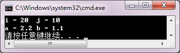

<!-- page: 176 -->

同步练习10.3

<!-- question: cpp-032-Q100 -->

一、选择题

1．关于类模板，描述错误的是（    ）。

（A）一个普通基类不能派生类模板

（B）类模板可以从普通类派生，也可以从类模板派生

（C）根据建立对象时的实际数据类型，编译器把类模板实例化为模板类

（D）函数的类模板参数需生成模板类并通过构造函数实例化

2．建立类模板对象的实例化过程为（    ）。

（A）基类→派生类
（B）构造函数→对象

（C）模板类→对象
（D）模板类→模板函数

3．在一个类层次结构中，（    ）。

（A）若基类是类模板，派生类必定是类模板。

（B）若基类是普通类，派生类也只能是普通类。

（C）一个普通类的派生类不能增加类属参数。

（D）一个派生类可以对作为基类的类模板提供实例化的类型参数。

4．若一个类模板定义了静态数据成员，正确的叙述的是（    ）。

（A）每一个实例化的模板类都有自己的静态数据成员副本

（B）类模板的静态数据成员在声明类模板时定义和初始化

（C）一个类模板实例化的不同模板类的全部对象共享一个静态数据成员

（D）一个类模板实例化后的每个对象都有自己的静态数据成员副本

5. 关于类模板与友元叙述错误的是（    ）。

（A）一般函数可以声明为类模板的友元

（B）函数模板可以声明为类模板的友元

（C）一个模板类可以声明为另一个类模板的友元

（D）一个模板类的友元只能是模板

6. 若有以下类模板声明，则正确的说明语句是（    ）。

template<typename T>

classTclass

{     int k;

   public:

      Tclass(int);

     //…

};

（A）Tclass(double) t(10);

（B）Tclass< double > t(10);

（C）Tclass<0.5> t( 10 );

（D）Tclass t(10);

 【解答】 A
C
D
D
A
B

<!-- question: cpp-032-Q101 -->

二、程序练习

1．阅读程序，写出运行结果。

#include <iostream>

using namespace std;

<!-- page: 177 -->

template <typename T>

class Base

{  public:

     Base( T i , T j ) { x = i;  y = j; }

     T sum() { return x + y; }

   private:

     T x, y;

};

int main()

{  Base<double> obj2(3.3,5.5);

   cout << obj2.sum() << endl;

   Base<int> obj1(3,5);

   cout << obj1.sum() << endl;

}
 【解答】

2．阅读第6 章例6-6，把Location 类改写为类模板，定义数据成员X、Y 为类属类型参数。主函数分

别用int 和double 类型实例化建立对象，验证类模板。

 【解答】

#include <iostream>

using namespace std;

template <typename T>

class T_Location

{

 public :

T_Location ( T xx = 0, T yy = 0 )

 { X = xx;  Y = yy; }

T_Location ( const T_Location  & p );

T GetX()const { return  X; }

T GetY()const { return  Y; }

 private :

T X, Y;

};

template <typename T>

T_Location<T>::T_Location(const T_Location<T> & p)

{

 X = p.X;

 Y = p.Y;

 cout << "Copy_constructor called." << endl;

}

int main()

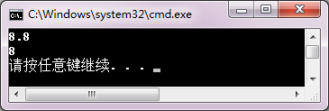

<!-- page: 178 -->

{

 T_Location <int>A(1,2);

 T_Location <int>B(A);

 cout << "B: " << B.GetX() << ", " << B.GetY() << endl;

 T_Location <double>C(3.4,5.6);

 T_Location <double>D(C);

 cout << "D: " << D.GetX() << ", " << D.GetY() << endl;

}

3．把第7 章习题的程序设计第3 题的Vector 类改写为模板类，使向量的数据成员为抽象类。main 函

数用int 和double 实例化，测试Vector 类。

【解答】

#include <iostream>

using namespace std;

template<typename T> class Vector

{

  private:

    T *v;

    int len;

  public:

Vector(int size);

Vector(double *, int);

~Vector();

T &operator;

Vector & operator =(Vector &);

template<typename T> friend Vector<T> operator +(Vector<T> &,Vector<T> &);

template<typename T> friend Vector<T> operator -(Vector<T> &,Vector<T> &);

template<typename T> friend T operator *(Vector<T> &,Vector<T> &);

template<typename T> friend ostream & operator <<(ostream &output,Vector<T> &);

template<typename T> friend istream & operator >>(istream &input,Vector<T> &);

};

template<typename T>Vector<T>::Vector (int size)

{

if(size<=0||size>=2147483647)

{ cout<<"The size of "<<size<<"is overflow!\n";

  abort();

}

v=new double [size];

for(int i=0;i<size;i++) v[i]=0;

len=size;

}

template<typename T>Vector<T>::Vector(double *C,int size)

{

if(size<=0||size>=2147483647)

{ cout<<"The size of"<<size<<"is overflow!\n"<<endl;

      abort();

}

<!-- page: 179 -->

v=new double[size];

len=size;

for(int i=0;i<len;i++) v[i]=C[i];

}

template<typename T>Vector<T>::~Vector()

{

delete []v;

v=NULL;  len=0;

}

template<typename T> T &Vector<T>::operator

{

if(i>=0 && i<len)

return v[i];

   else

    { cout<<"The size of"<<i<<"is overflow!\n";

      abort();

}

 }

template<typename T> Vector<T> &Vector<T>::operator =(Vector<T> &C)

{

if(len==C.len)

{

for(int i=0;i<len;i++)

     v[i]=C[i];

   return *this;

}

else

{

  cout<<"Operator = fail!\n";

      abort();

}

}

template<typename T> Vector<T> operator +(Vector<T> &A,Vector<T> &B)   //向量相加

{

int size=A.len ;

T *v=new T[size];

if(size==B.len)

{

for(int i=0;i<size;i++)

  v[i]=A[i]+B[i];

return Vector<T> (v,size);

}

else

{

  cout<<"Operator + fail!\n";

       abort();

}

<!-- page: 180 -->

}

template<typename T> Vector<T> operator -(Vector<T> &A,Vector<T> &B)  //向量相减

{

int size=A.len ;

T *v=new T[size];

if(size==B.len)

{ for(int i=0;i<size;i++)

        v[i]=A[i]-B[i];

  return Vector<T> (v,size);

}

else

{

  cout<<"Operator - fail!\n";

       abort();

}

}

template<typename T> T operator *(Vector <T>&A,Vector<T> &B)    //向量相乘

{

int size=A.len ;

double s=0;

if( size==B.len )

{

  for( int i=0; i<size; i++ )

s+=A[i]*B[i];

  return s;

}

else

{

  cout<<"Operator * fail!\n";

  abort();

}

}

template<typename T> ostream & operator <<(ostream &output,Vector<T> &A)     //输出

{

int i;

output<<'(';

for( i=0;i<A.len-1;i++)

       output<<A[i]<<',';

output<<A[i]<<')';

return output;

}

template<typename T> istream & operator >>(istream &input,Vector<T> &A)     //输入

{

for(int i=0;i<A.len;i++)

input>>A[i];

return input;

}

<!-- page: 181 -->

int main()

{

int k1,k2,k3;double t;

cout<<"Input the length of Vector A:\n";

cin>>k1;

Vector<double> A(k1);

cout<<"Input the elements of Vector A:\n";

cin>>A;

cout<<"Input the length of Vector B:\n";

cin>>k2;

Vector<double> B(k2);

cout<<"Input the elements of Vector B:\n";

cin>>B;

cout<<"Input the length of Vector C:\n";

cin>>k3;

Vector<double> C(k3);

cout<<"A="<<A<<endl;

cout<<"B="<<B<<endl;

C=A+B;

cout<<"A+B="<<A<<"+"<<B<<"="<<C<<endl;

C=A-B;

cout<<"A-B="<<A<<"-"<<B<<"="<<C<<endl;

t=A*B;

cout<<"A*B="<<A<<"*"<<B<<"="<<t<<endl;

}

习题

<!-- question: cpp-032-Q102 -->

一、思考题

1．抽象类和类模板都是提供抽象的机制，请分析它们的区别和应用场合。

【解答】

抽象类至少包含一个纯虚函数，纯虚函数抽象了类体系中一些类似操作的公共界面，它不依赖于数据，

也没有操作定义。派生类必须定义实现版本。抽象类用于程序开发时对功能的统一策划，利用程序运行的

多态性自动匹配实行不同版本的函数。

类模板抽象了数据类型，称为类属参数。成员函数描述了类型不同，逻辑操作相同的功能集。编译器

用建立对象的数据类型参数实例化为模板类，生成可运行的实体。类模板用于抽象数据对象类型不同，逻

辑操作完全相同类定义。这种数据类型的推导必须在语言功能的范畴之内的。

2．类属参数可以实现类型转换吗？如果不行，应该如何处理？

【解答】

类属参数不可以实现类型转换。为了解决参数隐式类型转换的问题，可以用类型参数把函数模板重载

为非模板函数。

3．类模板能够声明什么形式的友元？当类模板的友元是函数模板时，它们可以定义不同形式的类属

参数吗？请编写一个验证程序试一试。

<!-- page: 182 -->

【解答】

类模板可以声明的友员形式有：普通函数、函数模板、普通类成员函数、类模板成员函数以及普通类、

类模板。

当类模板的友员是函数模板时，它们可以定义不同形式的类属参数。

程序略。

4．类模板的静态数据成员可以是抽象类型吗？它们的存储空间是什么时候建立的？请用验证程序试

一试。

【解答】

类模板的静态数据成员可以是抽象类型。它们的存储空间在生成具体模板类的时候建立，即每生成一

个模板类同时建立静态储存空间并做一次文件范围的初始化。

程序略。

<!-- question: cpp-032-Q103 -->

二、程序设计

1．建立结点，包括一个任意类型数据域和一个指针域的单向链表类模板。在main 函数中使用该类模

板建立数据域为整型的单向链表，并把链表中的数据显示出来。

【解答】

#include <iostream>

using namespace std;

template <typename T>

class List

{

 public:

List( T x )  { data = x; }

void append( List *node )

{

     node->next = this;

     next = 0;

}

List *getnext() { return next; }

T getdata() { return data; }

private:

T data;

List *next;

};

int main()

{

int i, idata, n, fdata;

cout << "输入结点的个数：";

cin >> n;

cout << "输入结点的数据域：";

cin >> fdata;

List <int> headnode( fdata );

List <int> *p, *last;

<!-- page: 183 -->

last = &headnode;

for( i=1; i<n; i++ )

{

cin >> idata;

p = new List <int>( idata );

p->append( last );

last = p;

}

cout << "链表已经建立！" << endl;

cout << "链表中的数据为：" << endl;

p = &headnode;

while( p )

{

   cout << p->getdata() << endl;

   p = p->getnext();

}

}

2．定义类模板T_Counter，实现基本类型数据的+、-、*、=、>>、<< 运算；类模板T_Vector，实现

向量运算；类模板T_Matrix，实现矩阵运算。请分析使用类模板建立T_Counter、T_Vector、T_Matrix 对象

和使用类继承体系建立IntReal、Vector、Matrix 对象（见第8 章习题的程序设计第3、4、5 题）的语法区

别和运算功能区别。

【解答】

略。

3．学习MSDN Library 中Visual C++的STL，应用容器和算法，实现一个简单的人员信息管理系统。

【解答】

略。

第11 章习题与解答

同步练习11.2

选择题

1．在下列流类中，可以用于处理输入/输出的是（    ）。

（A）ios
（B）iostream
（C）strstream
（D）fstream

2．在下列选项中，（    ）是istream 类的对象。

（A）cerr
（B）cin
（C）clog
（D）cout

3．在下列选项中，不可以作为输出流对象的是（    ）。

（A）文件
（B）内存
（C）键盘
（D）显示器

4．在下列选项中，用于处理字符串流的是（    ）。

（A）strstream
（B）ios
（C）fstream
（D）iostream

<!-- page: 184 -->

5．能够从输入流中提取指定长度的字节序列的函数是（    ）。

（A）get
（B）getline
（C）read
（D）cin

6．能够把指定长度的字节序列插入到输出流中的函数是（    ）。

（A）put
（B）write
（C）cout
（D）print

7．getline 函数的功能是从输入流中读取（    ）。

（A）一个字符
（B）当前字符
（C）一行字符
（D）指定若干个字节

8．要进行文件的输出，除了包含头文件iostream 外，还要包含头文件（    ）。

（A）ifstream
（B）fstream
（C）ostream
（D）cstdio

9．用标准输入流对象cin 与提取操作符>>连用进行输入时，将空格与回车当作分隔符，使用（    ）

成员函数进行输入时可以指定输入分隔符。

（A）get()
（B）put()
（C）read()
（D）gcount()

10．在ios 类中，状态字用于记录流错误状态，其每位对应一种流的错误状态，其中（    ）表示流

数据已遭到损坏。

（A）goodbit
（B）eofbit
（C）failbit
（D）badbit
【答案】 B
B
C
A
C
B
C
B
A
D

同步练习11.3

<!-- question: cpp-032-Q104 -->

一、选择题

1．在下列选项中，用于清除基数格式位设置以十六进制数输出的语句是（    ）。

（A）cout<<setf( ios::dec, ios::basefield );

（B）cout<<setf( ios::hex, ios::basefield );

（C）cout<<setf( ios::oct, ios::basefield );

（D）cin>>setf( ios::fixed, ios::basefield );

2．下列格式控制符，既可以用于输入，又可以用于输出的是（    ）。

（A）setbase
（B）setfill
（C）setprecision
（D）setw

3．若在I/O 流的输出中使用控制符setfill()设置填充字符，应包括的头文件是（    ）。

（A）stdlib.h
（B）iostream.h （C）fstream.h
（D）iomanip.h

4．以下语句的输出结果是（    ）。

cout<<setw(3)<<25<<oct<<25<<hex<<endl;

（A）25 25
（B） 2531
（C）31 19
（D）25 31

5．以下语句的输出结果是（    ）。

cout<<setfill('*')<<setw(10)<< "Hello!"<<endl;

（A）****Hello!
（B）Hello!****
（C）  Hello!
（D）Hello!

6．以下语句的输出结果是（    ）。

cout.fill('*');  cout.width(10);  cout<<setiosflags(ios::left)<<123.45<<endl;

（A）****123.45
（B）**123.45**

（C）123.45****
（D）***123.45*
【答案】 B
A
D
B
A
C

<!-- question: cpp-032-Q105 -->

二、程序练习

阅读程序，写出运行结果。

1．  #include<iostream>

<!-- page: 185 -->

#include<iomanip>
using namespace std;
void main()
{  double x=123.456;
   cout.width (10);
   cout.setf(ios::dec,ios::basefield);
   cout<<x<<endl;
   cout.setf(ios::left);
   cout<<x<<endl;
   cout.width(15);
   cout.setf(ios::right, ios::left);
   cout<<x<<endl;
   cout.setf(ios::showpos);
   cout<<x<<endl;
   cout<<-x<<endl;
   cout.setf(ios::scientific);
   cout<<x<<endl;
}
【解答】

2．  #include<iostream>
#include<iomanip>
using namespace std;
void main()
{  double x=123.45678;
   cout.width (10);
   cout<<"#";
   cout<<x<<endl;
   cout.precision(5);
   cout<<x<<endl;
   cout.setf(ios::showpos);
   cout<<x<<endl;
   cout.setf(ios::scientific);
   cout<<x<<endl;
}
【解答】

3．  #include<iostream>
#include<iomanip>

<!-- page: 186 -->

using namespace std;
void main()
{  double x=123.456789;
   cout<<setiosflags(ios::fixed|ios::showpos)<<x<<endl;
   cout<<setw(12)<<setiosflags(ios::right);
   cout<<setprecision(3)<< -x<<endl;
   cout<<resetiosflags(ios::fixed|ios::showpos)<<setiosflags(ios::scientific);
   cout<<setprecision(5)<<x<<endl;
}
【解答】

同步练习11.4

选择题

1．使用串流类需要包含（    ）头文件。

（A）iostream
（B）iomanip
（C）fstream
（D）strstream

2．串流在提取数据时，对字符串按（    ）解释。

（A）整型数据
（B）浮点型数据
（C）变量类型
（D）ASC 码

3．串流在插入数据时，把各种类型数据转换成（    ）。

（A）二进制码
（B）十进制码
（C）格式化ASC 码
（D）计算结果

【解答】
D
C
C

同步练习11.5

<!-- question: cpp-032-Q106 -->

一、选择题

1．在下列流类中，可以用于处理文件的是（    ）。

（A）ios
（B）iostream
（C）strstream
（D）fstream

2．在文件操作中，表示以追加方式打开文件的模式是（    ）。

（A）iso::ate
（B）iso::app
（C）iso::out
（D）iso::trunc

3．下列打开文件的语句中，（    ）是错误的。

（A）ofstream ofile; ofile.open("abc.txt",ios::binary);

（B）fstream iofile; iofile.open("abc.txt",ios::ate);

（C）ifstream ifile("abc.txt");

（D）cout.open("abc.txt",ios::binary);

4．以下关于文件操作的叙述中，不正确的是（    ）。

（A）打开文件的目的是使文件对象与磁盘文件建立联系

（B）文件的读写过程中，程序将直接与磁盘文件进行数据交换

（C）关闭文件的目的之一是保证输出的数据写入硬盘文件中

（D）关闭文件的目的之一是释放内存中的文件对象

5．以下不能正确创建输出文件对象并使其与磁盘文件相关联的语句是（    ）。

<!-- page: 187 -->

（A）ofstream myfile; myfile.open("d:ofile.txt");

（B）ofstream *myfile=new ofstream; myfile->open("d:ofile.txt");

（C）ofstream myfile("d:ofile.txt");

（D）ofstream *myfile=new ("d:ofile.txt");

6．要打开文件 D:\file.dat，并能够写入数据，正确的语句是（    ）。

（A）ifstream infile("D:\\file.dat", ios::in );

（B）ifstream infile("D:\\file.dat", ios::out );

（D）ofstream outfile("D:\\file.dat", ios::in );

（D）fstream infile("D:\\file.dat", ios::in|ios::out );

7．能实现删除文件功能的语句是（    ）。

（A）ofstream fs("date.dat", ios::trunc );
（B）ifstream fs("date.dat", ios::trunc );

（C）ofstream fs("date.dat", ios::out );
（D）ifstream fs("date.dat", ios::in );

8. 设已定义浮点型变量data，以二进制代码方式把data 的值写入输出文件流对象outfile 中，正确的

语句是（    ）。

（A）outfile.write((double ∗) &data, sizeof(double));

（B）outfile.write((double ∗) &data, data);

（C）outfile.write((char ∗) &data, sizeof(double));

（D）outfile.write((char ∗) &data, data);

9．把二进制数据文件流fdat 的读指针移到文件头的语句是（    ）。

（A）fdat.seekg( 0, ios::beg);
（B）fdat.tellg( 0, ios::beg );

（D）fdat.seekp( 0, ios::beg);
（D）fdat.tellp( 0, ios::beg );

【解答】
D
B
C
B
D
D
A
C
A

<!-- question: cpp-032-Q107 -->

二、程序练习

1．阅读以下程序，写出文件D:\f1.txt 中的内容和屏幕显示的结果。
#include<iostream>
#include<fstream>
using namespace std;
int main()
{  int i;
   ofstream ftxt1;
   ftxt1.open( "D:\\f1.txt", ios::out );
   for( i=1; i<10; i++ )
      ftxt1<<i<<' ';
   ftxt1.close();
   ifstream ftxt2;
   ftxt2.open( "D:\\f1.txt", ios::in );
   while( !ftxt2.eof() )
   {  ftxt2>>i>>i;
      cout<<i<<endl;
   }
}
【解答】
D:\f1.txt：

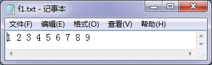

<!-- page: 188 -->

 屏幕显示：

2．以下程序使用了第1 题中生成的文件D:\f1.txt。写出程序运行后屏幕显示的结果。
#include<iostream>
#include<fstream>
using namespace std;
int main()
{  int i;
   ifstream f1( "D:\\f1.txt", ios::in );
   fstream f2;
   f2.open( "D:\\f2.dat", ios::out|ios::binary );
   while(!f1.eof())
   {  f1>>i;
      i = i*5;
      f2.write( ( char* ) &i, sizeof( int ) );
   }
   f1.close();
   f2.close();
   f2.open( "D:\\f2.dat", ios::in|ios::binary );
   do
   {  f2.read( ( char* ) &i, sizeof( int ) );
      cout<<i<<"  ";
   }while( i<30 );
   cout<<endl;
   f2.close();
}
【解答】

3. 建立一个文本文件，从键盘输入一篇短文存放在文件中。短文由若干行构成，每行不超过80 个字

符。

【解答】

#include <iostream>

#include <fstream>

using namespace std;

int main()

{

  char filename[20];

<!-- page: 189 -->

  char s;

  int i=0;

  fstream outfile;

  cout << "Please input the name of file :\n";

  cin >> filename ;

  outfile.open( filename, ios::out );

  if ( !outfile )

   {

cout << "File could not be open." << endl;

abort();

  }

  cout<<"Please input your text (Enter Ctrl-Z to end input) :\n";

  cin.get(s);
//略去输入文件名后的换行符

  while(cin.get(s))

  {

   if(s=='\n') i=0;

   else i++;

   outfile.put(s);

   if(i==80&&s!='\n')

   {

outfile.put('\n');

i=0;

   }

  }

  outfile.close();

  cout<<"the file is created!\n";

}

4．读出由第3 题建立的文本文件，显示在屏幕上并统计该文件的行数。

【解答】

#include <iostream>

#include <fstream>

using namespace std;

int main()

{

char filename[20];

fstream infile;

cout << "Please input the name of file :\n";

cin >> filename ;

 infile.open( filename, ios::in );

if ( !infile )

    {

cerr << "File could not be open." << endl;

abort();

}

char textline[80];

int i = 0;

<!-- page: 190 -->

while ( !infile.eof() )

{

infile.getline( textline,sizeof( textline ));

cout << textline << endl;

++i;

}

infile.close();

cout << "i=" << i << endl;

}

5．阅读以下程序。修改RandAry 函数，把生成数据写入二进制文件D:\rand.dat 中；修改OutAll

函数，从二进制文件D:\rand.dat 中读出全部数据，以每行10 个数据的格式显示在屏幕上。

#include<iostream>
#include <cstdlib>
#include<ctime>
using namespace std;
void RandAry(int ary[], int n, int min, int max);//生成随机数序列
void OutAll(int ary[], int n);
int main()
{  const int N=50;
   int ary[N];
   cout<<"生成50 个1～100 之间的整数:\n";
   RandAry(ary, N, 1, 100);
//生成N 个1～100 之间的整数放在数组ary 中
   OutAll(ary,N);
//输出数组全部原始数据
   system("pause");
}
//生成n 个min～max 的随机数序列，放在数组ary 中
void RandAry(int ary[], int n, int min, int max)
{  int i, k;
   srand(unsigned(time(0)));
//为随机数生成器设置种子值
   for(i=0; i<n; i++)
//获取指定范围的随机数
   {  do
      {  k = rand();
      } while( k<min || k>max );
      ary[i]= k;
   }
}
void OutAll(int ary[], int n)
{  int i;
   for (i=0;i<n;i++)
     cout<<ary[i]<<" ";
   cout<<endl;
}

【解答】

#include<iostream>

#include<fstream>

#include <cstdlib>

#include<ctime>

using namespace std;

const char * filename="e:\\myfile.dat";

<!-- page: 191 -->

void RandAry(const char * file, int n, int min, int max);
//生成随机数序列，保存在文件中

void OutAll( const char * file,  int n);
//输出文件数据，每行10个数据

int main()

{ const int N=50;

  cout<<"生成50个1～100之间的整数保存在文件中。\n";

  RandAry( filename, N, 1, 100);
//生成N个1～100之间的整数放在文件中

  cout<<"显示文件中的数据：\n";

  OutAll(filename,N);
//输出文件的全部数据

  system("pause");

}

//生成n个min～max的随机数序列，放在文件中

void RandAry(const char * file, int n, int min, int max)

{

 ofstream outfile(file,ios::out|ios::binary);

 int i, k;

 srand(unsigned(time(0)));
//为随机数生成器设置种子值

 for(i=0; i<n; i++)
//获取指定范围的随机数

{

do

{

k = rand();

} while( k<min || k>max );

outfile.write((char*)&k, sizeof(k));

}

  outfile.close();

}

//显示文件的数据

void OutAll( const char* file, int n)

{

 ifstream infile(file,ios::in|ios::binary);

 int i, k;

 for (i=0; i<n; i++)

 {

infile.read((char*)&k, sizeof(k));

cout<<k<<"  ";

if(( i+1)%10==0 )

cout<<endl;

 }

 infile.close();

}

<!-- page: 192 -->

习题

<!-- question: cpp-032-Q108 -->

一、思考题

1．在Visual C++中，流类库的作用是什么？有人说，cin 是键盘，cout 是显示器，这种说法正确吗？

为什么？

【解答】

在Visual C++中，流类库是一个程序包，作用是实现对象之间的数据交互。“cin 是键盘，cout 是显示

器”的说法不正确。cin 和cout 分别是istream 和ostream 的预定义对象，默认连接标准设备键盘、显示器，

解释从键盘接受的信息，传送到内存；把内存的信息解释传送到显示器。所以称为标准流对象。程序可以

对cin、cout 重定向，连接到用户指定的设备，例如指定的磁盘文件。

2．什么叫文件？C++读/写文件需要通过什么对象？有些什么基本操作步骤？

【解答】

任何一个应用程序运行，都要利用内存储器存放数据。这些数据在程序运行结束之后就会消失。为了

永久的保存大量数据，计算机用外存储器（如磁盘和磁带）保存数据。各种计算机应用系统通常把一些相

关信息组织起来保存在外存储器中，并用一个名字（称为文件名）加以标识，称为文件。

C++读/写文件需要用到文件流对象。

文件操作的三个主要步骤是：打开文件、读/写文件、关闭文件流。

打开文件包括建立文件流对象，与外部文件关联，指定文件的打开方式。

读/写文件是按文件信息规格、数据形式与内存交互数据的过程。

关闭文件包括把缓冲区数据完整地写入文件，添加文件结束表示符，切断流对象和外部文件的连接。

3．一个已经建立的文本文件可以用二进制代码方式打开操作吗？一个二进制数据文件可以用文本方

式打开吗？为什么？写一个程序试一试。

【解答】

一个已经建立的文本文件可以用二进制方式打开操作。但必须以字符类型数据读取数据然后转换成需

要的类型数据才有意义。通常一个二进制文件用文本方式打开是没有意义的，除非这个二进制文件全部是

用字符类型数据建立的。因为文本文件是以可读形式ASC 码存放数据的，二进制文件直接用计算机表示数

据的二进制形式存放数据，它们之间解释方式不同。

程序略。

<!-- question: cpp-032-Q109 -->

二、程序设计

1．以表格形式输出：当x = 1°, 2°, …,10°时sinx、cosx 和tanx 的值。要求：输出时，数据的宽度为10，

左对齐，保留小数点后5 位。

【解答】

#include <iostream>

#include <cmath>

#include <iomanip>

using namespace std;

int main()

{

int x; double a;

cout << "x   sin(x)    cos(x)    tg(x)" << endl;     //输出表头

for( x=1; x<=10; x++ )

<!-- page: 193 -->

    {

   a = x * 3.14159265 / 180;                   //角度转换为弧度

   cout << setw(3) << setiosflags( ios::left );

   cout << setiosflags( ios::fixed );

   cout << setprecision(5);

   cout << x;

   cout << setw(10) << sin(a);

   cout << setw(10) << cos(a);

   cout<<setw(10)<<sin(a)/cos(a)<<endl;

    }

}

2．读出一个作业.cpp 文件，删除全部注释内容，即以“/*…*/”相括的文本和以“//”开始到行末的

文本，生成一个新的.cpp 文件。

【解答】

#include<fstream>

#include<iostream>

using namespace std;

void trans(char *,char *);

int main()

{

char *icpp="f:\\ex.cpp";

char *ocpp="f:\\exr.cpp";

trans(icpp,ocpp);

system("pause");

}

void trans(char *icpp,char *ocpp)

{
 fstream incpp(icpp,ios::in);

 fstream outcpp(ocpp,ios::out);

 char c,flag='\0';

 while(incpp.get(c))

 {
if(c=='/')

{
incpp.get(c);

if(c!='/'&&c!='*')

outcpp<<"/"<<c;
//一般除号，正常输出

else

{
if(c=='/')

{
while(c!='\n')

incpp.get(c);

outcpp<<c;

}

else

{
while(flag!='/')

{
flag='\0';

incpp.get(c);

if(c=='*')

incpp.get(flag); //判别/*…*/注释是否结束

<!-- page: 194 -->

}

incpp.get(c);
//去掉多余空格

}

}

}

else

  outcpp<<c;

}

 incpp.close();

outcpp.close();

}

3．建立某单位职工通讯录的二进制数据文件，文件中的每个记录包括：职工编号、姓名、电话号码、

邮政编码和住址。

【解答】

#include <iostream>

#include<fstream>

using namespace std;

struct txrec

{

char no[6];

  char name[20];

 char tel[9];

 char postc[7];

 char addr[30];

};

int main()

{

  int n,i;

txrec gzrec;

 char filename[20];

 fstream outfile;

  cout << "请输入通讯录文件名:" ;

  cin >> filename ;

  outfile.open( filename, ios::out|ios::binary );

  if ( !outfile )

{

    cerr << "文件不能打开！" << endl ;

    abort();

}

  cout << "请输入职工人数:" ;

 cin >> n;

 for( i=1; i<=n; i++ )

{

cout << "请输入第"<< i <<"个职工的编号:" ;

<!-- page: 195 -->

cin >> gzrec.no ;

cout << "请输入第"<< i <<"个职工的姓名:" ;

cin >> gzrec.name ;

cout << "请输入第"<< i <<"个职工的电话号码:" ;

cin >> gzrec.tel ;

cout << "请输入第"<< i <<"个职工的邮政编码:" ;

cin >> gzrec.postc ;

cout << "请输入第"<< i <<"个职工的通信地址:" ;

cin >> gzrec.addr ;

outfile.write( ( char* )&gzrec,sizeof( txrec )) ;

}

  outfile.close() ;

}

4．从键盘输入职工的编号，在第3 题所建立的通讯录文件中查找该职工资料。查找成功后，显示职

工的姓名、电话号码、邮政编码和住址。

【解答】

#include <iostream>

#include<fstream>

using namespace std;

struct txrec

{

char no[6];

char name[20];

char tel[9];

char postc[7];

char addr[30];

};

int main()

{

struct txrec gzrec;  int i;

char filename[20], num[6];

fstream infile;

cout << "请输入通讯录文件名:";

cin >> filename ;

infile.open( filename, ios::in|ios::binary );

if ( !infile )

{  cerr << "文件不能打开！" << endl;

abort();

}

infile.seekg( 0,ios::end );

long posend = infile.tellp();

infile.seekg( 0,ios::beg );

cout << "请输入职工编号:" ;

cin >> num;

do

<!-- page: 196 -->

{

    infile.read(( char * )&gzrec,sizeof( txrec ));

} while ( strcmp( gzrec.no,num ) != 0 && long(infile.tellp()) != posend );

if ( strcmp( gzrec.no,num ) == 0 )

{

cout << "该职工的记录找到了！" << endl;

cout << "编号:" << gzrec.no << endl;

cout << "姓名:"<< gzrec.name << endl;

cout << "电话号码:"<< gzrec.tel << endl;

cout << "邮政编码:" << gzrec.postc << endl;

cout << "通信地址:" << gzrec.addr << endl;

}

else

{

cout << "该职工的记录找不到！" << endl;

}

infile.close();

}

5．设有两个按升序排列的二进制数据文件f 和g，将它们合并生成一个新的升序二进制数据文件h。

【解答】

#include <iostream>

#include<fstream>

using namespace std;

int main()

{

int data1,data2;

fstream infile1,infile2,outfile;

infile1.open( "d:\\vc\\f.dat", ios::in|ios::binary);

if ( !infile1 )

{

   cerr << "文件不能打开！" << endl ;

   abort();

}

infile1.seekg(0,ios::end);

long posend1 = infile1.tellp();

infile2.open( "d:\\vc\\g.dat", ios::in|ios::binary);

if ( !infile2 )

{

   cerr << "文件不能打开！" << endl ;

   abort();

}

infile2.seekg( 0,ios::end );

long posend2 = infile2.tellp();

outfile.open( "d:\\vc\\h.dat", ios::out|ios::binary );

infile1.seekg( 0,ios::beg );

infile2.seekg( 0,ios::beg );

<!-- page: 197 -->

while ( long(infile1.tellp()) != posend1 && long(infile2.tellp()) != posend2 )

{

infile1.read(( char * )&data1,sizeof( int ));

infile2.read(( char * )&data2,sizeof( int ));

if( data1<data2 )

{

   outfile.write(( char * )&data1,sizeof( int ));

 infile2.seekg(-int(sizeof( int )),ios::cur );

}

else

{

  outfile.write(( char * )&data2,sizeof( int ));

infile1.seekg( -int(sizeof(int)),ios::cur );

}

}

while ( long(infile1.tellp()) != posend1 )

{

  infile1.read(( char * )&data1,sizeof( int ));

  outfile.write(( char * )&data1,sizeof( int ));

}

while ( long(infile2.tellp()) != posend2 )

{

  infile2.read(( char * )&data2,sizeof( int ));

outfile.write(( char * )&data2,sizeof( int ));

}

cout << "文件合并已完成！" << endl;

infile1.close();

infile2.close();

outfile.close();

}

6．阅读本教材附录A.2.4，把例11-20 的程序改写为带命令行参数的main 函数，把生成的.exe 文件，

以文件名lockUnlock.exe 保存在D 盘中，用命令行方式执行程序。

【解答】

#include <fstream>

#include<iostream>

using namespace std;

int main( int argc, char* argv[] )

{

int i, r=13;

unsigned char j ;

fstream f ;

f.open( argv[1] , ios::in|ios::out|ios::binary ) ;

f.seekp( 0, ios::beg);

for( i = 0; i<1000 ; i ++ )

{

   r=(25171*r+13859)%127;

<!-- page: 198 -->

   f.seekg( long( sizeof( char ) * i ) );

   f.read( ( char* ) &j, sizeof( char ) );

   j ^= r;

   f.seekp( -long(sizeof(char)), ios::cur);

   f.write((char *)&j, sizeof(char) ) ;

}

  f.close();

  return 0;

}

7．编写一个函数，使用数据文件测试在第10 章习题程序设计第2 题中完成的T_Counter 类体系。准

备一个文件inputdat 用于输入数据，把程序运行结果显示在屏幕上并写入文件outputdat 中。

【解答】

第12 章习题与解答

略。

习题

<!-- question: cpp-032-Q110 -->

一、阅读下列程序，写出运行结果

1．  #include<iostream>
using namespace std;
int a[ 10 ] = { 1, 2, 3, 4, 5, 6, 7, 8, 9, 10 };
int fun( int i );
int main()
{  int i ,s = 0;
   for( i = 0; i <= 10; i++ )
   {  try
      {  s = s + fun( i );  }
      catch( int )
      {  cout<<"数组下标越界！"<<endl;  }
   }
   cout<<"s = "<<s<<endl;
}
int fun( int i )
{  if ( i >= 10 )
      throw i;
   return a[i];
}
【解答】

2．  #include<iostream>

<!-- page: 199 -->

using namespace std;
void f();
class T
{  public:
     T()
     {  cout<<"constructor"<<endl;
        try
        {  throw  "exception";  }
        catch( char * )
        {  cout<<"exception1"<<endl;  }
        throw  "exception";
     }
     ~T()
     {  cout<<"destructor";  }
};
int main()
{  cout<<"main function "<<endl;
   try  {  f();  }
   catch( char * )
   {  cout<<"exception2"<<endl;  }
   cout<<"main function "<<endl;
}
void f()
{  T t;  }
【解答】

<!-- question: cpp-032-Q111 -->

二、思考题

1．对一个应用是否一定要设计异常处理程序？异常处理的作用是什么？
【解答】

一个应用不一定要设计异常处理程序。异常处理以结构化思想把异常检测与异常处理分离，增加了程

序的可读性，便于大型软件的开发。

2．什么叫抛出异常？catch 可以获取什么异常参数？是根据异常参数的类型还是根据参数的值处理异

常？请编写测试程序验证。

【解答】

C++异常处理通过三个关键字实现：throw、try 和catch。被调用函数按指定条件检测到异常条件的存

在，用throw 一个数值，称为抛出一个异常。这个函数仅仅做了throw，而不去处理错误。在上层调用函数

中使用try 语句检测函数调用是否引发异常，被检测到的各种异常由catch 语句捕获并作相应的处理。catch

只是根据异常参数的类型（不管具体数值）处理异常。

3．什么是不唤醒机制？这种机制有什么好处？请举例说明。

<!-- page: 200 -->

【解答】

不唤醒机制是指抛出异常后，调用链上的所有模块都终止执行，不返回异常抛出点。这种机制的好处

是把函数的正常功能设计和异常处理设计分离，便于结构化处理。

程序略

<!-- question: cpp-032-Q112 -->

三、程序设计

1．从键盘上输入x 和y 的值，计算y = ln( 2x – y ) 的值，要求用异常处理“负数求对数”的情况。

【解答】

#include <iostream>
#include <cmath>
using namespace std;
double f( double x,double y );
int main()
{

double x,y;
   try

{

  cout << "输入x 和y 的值：";
      cin >> x >> y;
      cout << f( x,y ) << endl;

}
   catch( char * )
    {

cout << "负数不能求对数！" << endl;
}
}
double f( double x,double y )
{

  if( 2*x-y < 0 )
     throw  "error";
   else
     return log( 2*x - y );
}

2．程序中，典型的异常有：内存不足以满足new 的请求、数组下标越界、运算溢出、除数为0 或无

效函数参数等。简单描述程序应该如何用异常处理的方法处理这些情况。

【解答】

略。

3．把第12 章12.2.4 节中的代码补充成完整的测试程序并运行。
【解答】

略。
