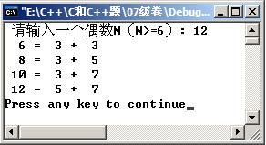
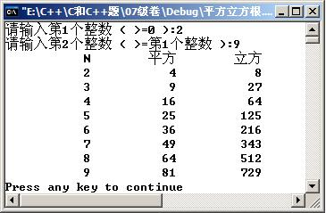
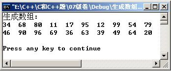
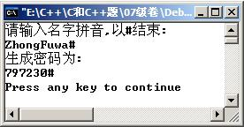

# 2007C++程序设计基础试卷(A)

<!-- page: 1 -->

<!-- question: cpp-037-Q1 -->

一、单项选择题。(每小题2 分, 共20 分)
１、下列合法的变量名是（
C
）。
（A）8d
（B）1_2h
（C）_int
（D）
file.cpp
2、有说明语句：int a=0; double x=5.16; ，则以下语句中，(
C
)属于编译错误。
（A）x=a/x;
(B) x=x/a;
(C) a=a%x;
(D) x=x*a;
3、设有：int a=7,b=5,c=3, d=1; ,
则条件表达式a<b?a:c>d?c:d 的值为（
Ｃ
）。
（A）7
（B）5
（C）
3
（D）1
4、执行下列语句后，x的值是(
Ｄ
)，y的值是(
Ｃ
)。
int x, y ;
x = y = 1;
++x||++y ;
（A）不确定
（B）0
（Ｃ）１
（Ｄ）２
5、下列for 语句循环的次数是(
B
) 。
for ( int i=0,x=0; !x && i<=3; i++ )

（Ａ）3
（B）4
（Ｃ）0
（Ｄ）无限
6、有函数原型void fun( int * ); 下面选项中，正确的调用是(
C
)。
（Ａ）double x = 0.12; fun( &x );
（Ｂ）int a = 1 ;
fun( a*3.14 );
（Ｃ）int b = 10;
fun( &b );
（Ｄ）fun( 56 );
7、关于函数定义和调用的说法正确的是(
A
)。
（A）函数能嵌套调用，但不能嵌套定义
（B）函数能嵌套调用，也能嵌套定义
（C）函数不能嵌套调用，也不能嵌套定义
（D）函数不能嵌套调用，但能嵌套定义
8、有定义一维数组语句：int a[5],*p;，则下列表达式错误的是（
Ｂ
）。
（A）p=p+1
（B）a=a+1
（Ｃ）p-a
（Ｄ）a+２
9、假定有语句：int b[][3]={{1},{１,2},{１,２,３},{0}};
则b[2][2]的值是（
Ｄ
）。
（A）０
（B）１
（Ｃ）２
（Ｄ）３
10、若用数组名作为调用函数的实参,则传递给形参的是(
Ａ
)。
(Ａ) 数组存贮首地址
(Ｂ) 数组的第一个元素值
(Ｃ) 数组中全部元素的值
(Ｄ) 数组元素的个数

_____________ ________

<!-- question: cpp-037-Q2 -->

二、简答题。(共20 分)
1、有以下循环语句无法正常结束循环，请找出原因。（2 分）

int i=100, j=0, m=0;
1

while(1)

{ m+=j; j++; if(j=i) break; }

2、一程序要求统计未退休（男性年龄<60，女性<55）职工中1-3 月份出生的人数。请写出
职工记录中结构的最小定义形式，并写出用于判断的C++逻辑表达式。（4 分）
struct Employee{ char name[20]; char sex; int Byear; int Bmonth; int Bday;};
Employee em;
//设男性=’m’,女性=’f’
(em.sex==’m’&&2007-em.Byear<60||
em.sex==’f’&&2007-em.Byear<55)&&(em.Bmonth<=3&&em.Bmonth>=1)
3、设有说明int a[4*5]; 请写出两个表示数组a 最后一个元素地址值的表达式。（3 分）

《高级语言程序设计I 》试卷（A）
第1 页共8 页

<!-- page: 2 -->

&a[19]
a+19
4、设有说明double
x[10]= { 0 }, * y = new
double [10];
问sizeof(x), sizeof(y)的值各是
多少？并分析结果原因。（4 分）
sizeof(y)的值为4。y 是指针变量。
5、设有函数调用语句Count(a ,n, right, negative); 功能是由参数right, negative
返回统计数组a 的n 个元素中正整数和负整数的个数。对应的函数原型是什么？（2 分）
void Count(int *a, int , int&, int&);
void Count(int a[], int , int&, int&);
6、以下语句不能正确输出单向链表的数据元素值，请找出原因。（2 分）

struct link{int data; link * next; };

link *head, *p;

……

p=head;

while(p){cout<<p.data; p++; }

……
链表非连续存储，p++不能访问后续结点。
7、设有以下说明语句，请写出3 个调用函数function 的语句。（3 分）

typedef
void funType (int ,double);

funType function, *fp;

设：
int a; double x;
fp=function;
则可有：
function(a,x);
fp(a,x);
(*fp)(a,x);
<!-- question: cpp-037-Q3 -->

三、阅读程序写输出结果（每小题4 分,共20 分）
1、

#include <iostream.h>

void main()

{
int i, s = 0;

for( i=4; i<6; i++ )

{
switch( i )

{ case 3:
s += i*i;
break;

case 4:
s += i*i;
break;

case 5:
s += i*i;
break;

default: s += 2; }

cout << "s=" << s <<endl;

}

}

S=16
S=41

2、

《高级语言程序设计I 》试卷（A）
第2 页共8 页

<!-- page: 3 -->

#include <iostream.h>

void main()

{
int i,j;

for( i=1; i<=3; i++ )

{ j=1;

while (j<i)

{ cout << i<<'\t'<<j<<endl;

j++;}

}

}

2
1
3
1
3
2
3、

#include <iostream.h>

void func(int, int, int *) ;

void main()

{
int x, y, z ;

func(1, 2, &x) ;

func(3, x, &y) ;

func(x, y, &z) ;

cout<<x<<endl<<y<<endl<<z<<endl ;

}

void func(int a, int b, int *c)

{ b-=a ;
*c=b-a; }

0
-6
-6
4、

#include <iostream.h>

int f1(int a,int b) {return a%b*5;}

int f2(int a,int b) {return a*b;}

int f3(int(*t)(int, int),int a,int b) { return (*t)(a, b);}

void main()

{ int (*p)(int, int) ;

p=f1 ;
cout<<f3(p, 5, 6)<<endl ;

p=f2 ;
cout<<f3(p, 7, 8)<<endl ;

}

25
56
5、

#include<iostream.h>

#include<iomanip.h>

void fNum (int w)

《高级语言程序设计I 》试卷（A）
第3 页共8 页

<!-- page: 4 -->

{ int i;

if(w>0)

{ for(i=1;i<=w;i++)
cout<<setw(3)<<w;

cout<<endl;

fNum(w-1);

}

}

void main()

{ fNum(4);}

4
4
4
4
3
3
3
2
2
1

<!-- question: cpp-037-Q4 -->

四、程序填空题（每空2 分，共20 分）

1、下面程序的功能是：输入三角形的三条边存放在变量a，b 和c 中，判别它们能否
构成三角形，若能，则判断是等边、等腰、还是其它三角形，在横线上填上适当内容。

#include <iostream.h>

void main()

{ float a, b, c ;

cout<<"a,b,c=";
cin>>a>>b>>c;

if (
a+b>c && b+c>a && c+a>b
)

{

if (
【1】
)
a==b && b==c

cout<<"等边三角形！\n";

else if (
【2】
)
a==b||a==c||b==c

cout<<"等腰三角形！\n";

else cout<<"其它三角形！\n";

}

else cout<<"不能构成三角形！\n";

}

2、以下程序功能是输出1000 以内个位数为6 且能被3 整除的所有数。请填空。

#include <iostream.h>

void main ( )

{ int
i, j
;

for ( i=0 ;
【3】
;
i++ )
i <100

{ j = i * 10 + 6 ;

if
(
【4】
)
continue
;
j % 3

cout << j << "
" ;

}

}

3、求n（n≥6）内的所有偶数表示为两个素数之和，图1 为输入12 的运行结果。补充

《高级语言程序设计I 》试卷（A）
第4 页共8 页

<!-- page: 5 -->

完整以下程序。

[提示：一个偶数n（n≥6）可以表示为1+(n-1),2+(n-2),3+(n-3),… ]

#include<iostream.h>

#include<math.h>

#include<iomanip.h>

int
isprime(int);

void
main()

{ int
num;

cout<<" 请输入一个偶数N（N>=6）:\n";

cin>>num;

for(int n=6; n<=num; n+=2)

图1

for(int i=3;i<=n/2;i+=2)

if( _________【5】______________ )
isprime(i) && isprime(n-i)

{cout<<setw(3)<<n<<"="<<setw(3)<<i<<" +"<<setw(3)<<(n-i)<<endl;

break ; }

}

int
isprime(int
n)

{ int i, sqrtm=(int)sqrt(n);

for(i=2; i<=sqrtm; i++)

if( __________【6】_____________ ) return
0 ;
n%i==0

____________【7】___________ ;
return
1

}

4、以下程序是创建一个动态数组，数组长度由程序运行时输入数据决定。调用随机函数对动态数
组赋初值，并输出动态数组各元素值。请填空。

#include< iostream.h>

#include<stdlib.h>

#include<time.h>

void
main()

{ int
n,
*p=
【8】
;
NULL

cout << "Please input n:\n";
cin>>n;

p=
【9】
new
int[n]

if(p==NULL)

{ cout<<"Allocation faiure \n";
return;}

srand(time(0)) ;

for( int i=0; i<n; i++ )

{ p[i]=rand()%100; }

for(
【10】
; a<p+n; a++ )
int *a=p

{ cout<<*a<<'\t';
}

cout<<endl;

《高级语言程序设计I 》试卷（A）
第5 页共8 页

<!-- page: 6 -->

delete []p;

}
<!-- question: cpp-037-Q5 -->

五、编程题（20 分）

1、（6 分）编写程序，打印正整数的平方和立方值。程序运行后显示相应的提示信息，
要求输入2 个正整数，然后显示这个范围的数据的平方和立方值。例如，分别输入整
数2 和9，执行效果如图2 所示。

图2
显示数制对照表

#include<iostream.h>
#include<iomanip.h>
void main()
{ int a,b;

cout<<"请输入第1 个整数( >=0 ):";
cin>>a;
cout<<"请输入第2 个整数( >=第1 个整数):";
cin>>b;
cout<<setw(12)<<"N"<<setw(12)<<"平方"<<setw(12)<<"立方"<<endl;
for(int i=a; i<=b; i++)

cout<<setw(12)<<i<<setw(12)<<i*i<<setw(12)<<i*i*i<<endl;
}
2、（6 分）以下程序用随机函数生成两位整数，取M 个各不相等的数据，按生成顺序存
放在数组a 中。图3 是生成20 个数据的显示效果。请依题意编写函数insert 及填写
函数原型。

#include<iostream.h>

#include<stdlib.h>

#include<time.h>

int insert(int *ap, int k, int n);
//函数原型
或：
int insert(int ap[], int k, int n);

图3
生成数组

void main()

{ const int M=20;

int n, i=0;

int a[M]={0};

《高级语言程序设计I 》试卷（A）
第6 页共8 页

<!-- page: 7 -->

srand(time(0));

while (i<M)

{ do{n=rand()%100;}while(n<10);
//生成数据

if(insert(a,i,n))
//把不相同数据插入数组a

i++;

}

cout<<"生成数组:"<<endl;

for(i=1; i<=M;i++)

{ cout<<a[i]<<"
";
if(i%10==0)cout<<endl;
}

cout<<endl;

}

int insert(int *ap, int k, int n)
{ for(int j=0; j<k; j++)
//滤去相同数
if(ap[j]==n) break;
if(j==k){ap[j]=n; return 1;}
//添加数据
return 0;
}

3、（8 分）本程序功能是把一个用拼音输入的名字自动生成6 位数字串的密码。生成规
则是把字母串的最后6 位逆序，取每个字母小写的ASCII 码值，其除以10 的余数为该位的
密码值。当输入名字的字母串不足6 位，生成时以字母“z”补足。图4 是程序的运行效果。
请填写change 函数的函数原型并编写函数。

#include<iostream.h>

#include<ctype.h>

struct link {char s; link * next;};

void inputName(link *& h);

void outLink(link *h);

______________________
//change 的函数原型

void main()

图4
生成密码

{ link *name=NULL, *code=NULL;

cout<<"请输入名字拼音,以#结束:\n";

inputName(name);

change(code,name);

cout<<"生成密码为:\n";

outLink(code);

}

void inputName(link *& h)
//逆序存放字符串

{ link *p;

p=new link;
cin>>(p->s);

while((p->s>='a'&&p->s<='z'||p->s>='A'&&p->s<='Z')&&p->s!='#')

{ p->next=h;
h=p;

《高级语言程序设计I 》试卷（A）
第7 页共8 页

<!-- page: 8 -->

p=new link;
cin>>(p->s);

}

}

void change(link *&hCode, link *h)
{ char d;

link *p=NULL;
hCode=new link;
hCode->next=NULL;
p=hCode;
d=h->s;
for(int i=0;i<6;i++)
{ p->s=int(tolower(d))%10+'0';

p->next=new link;
p=p->next;
p->s='#';
p->next=NULL;
if(h->next)

{h=h->next; d=h->s;}
else d='z';
}
}

void outLink(link *h)

{ while(h) {cout<<(h->s); h=h->next;}

cout<<endl;

}

《高级语言程序设计I 》试卷（A）
第8 页共8 页
