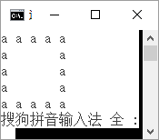
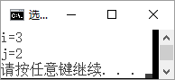
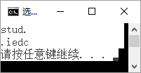
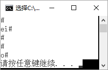
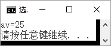
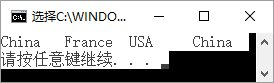

# 2016-2017(1)C++程序设计基础--A卷--试题答案

**诚信应考，考试作弊将带来严重后果！**

**华南理工大学本科生期末考试**

**《C++程序设计基础》** **A卷—参考答案**
- **单项选择题，请将正确的选项涂写在答题纸相应位置上。（共20小题，每小题1分，共20分）**

1~5：DCDCB

6~10：ABADC

11~15：BAABC

16~20：DBCDA
- **写出下列程序的执行结果。（共6小题，每小题5分，共30分）**

| 1. |  | 2. |  |
|---|---|---|---|
| 3. |  | 4. |  |
| 5. |  | 6. |  |

- **根据以下各题目要求，将程序的空格处补充完整。（共15空，每空2分，共30分）**

| **(1)** | k=n | **(2)** | k  或 k!=0 |
|---|---|---|---|
| **(3)** | k=k/10 | **(4)** | #include<cmath> |
| **(5)** | double( *fun )( double x ) | **(6)** | t += ( *fun )( a + i * h ) |
| **(7)** | t3 = trap( sin,0,3.14159265/2,10000 ) | **(8)** | p[i]==num |
| **(9)** | p[i] % j == 0 | **(10)** | check(a,i,x) |
| **(11)** | print(a,10) | **(12)** | p=new Employee[total] |
| **(13)** | Output(p,total) | **(14)** | all[j].salary>all[t].salary |
| **(15)** | t!=i |  |  |

- **按下列各小题的要求编写程序。（共2小题，各10分，共20分）**

1.

void searchMin(data *a, int n , data &m)

{	m=a[0];

for(int  i=1; i<n; i++ )

if( a[i].score < m.score )

m = a[i];

return;

}

2.

//  对数组逆置函数

void adverse(int *p,int n)

{

for (int  i=0;i<n/2;i++)

{

int  t=*(p+i);

*(p+i)=*(p+n-i-1);

*(p+n-i-1)=t;

}

}
