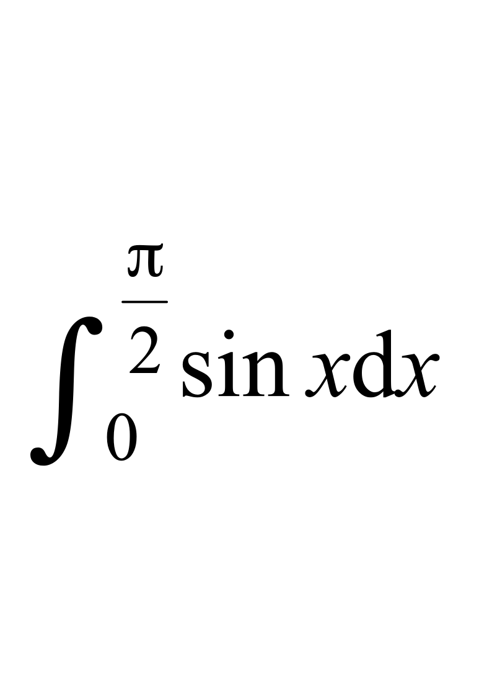

# 2016-2017(1)C++程序设计基础--B卷

**诚信应考，考试作弊将带来严重后果！**

**华南理工大学本科生期末考试**

**《C++程序设计基础》** **A卷**

**注意事项：1.** **开考前请将密封线内各项信息填写清楚；**

**2.** **所有答案请直接答在答题纸上，否则无效；**

**3.** **试卷和答题纸同时提交；**

**4．考试形式：闭卷；**

**5.** **本试卷共 四大题，满分100分，**	**考试时间120分钟**。

**一、单项选择题。（共20小题，每小题1分，共20分）**

1.  下列选项中，(      )是不合法的常量。

A  0xab      B  “student”        C   .618E3                         D    count

2.    下列语句执行后, a和b的值分别是(      )。

int a=1,b=1;

--a && --b;

A   0  0           B  1   0        C   0  1       D  1   1

3.    用逻辑表达式表示“大于2  或 小于-2的数”，正确的是(     )。

A   a>2&&a<-2        B  a>=2||a<=-2     C  a<=-2&&a>=2   D !(a>=-2&&a<=2)

4.    下列表达式选项中，(      )是正确的。

A   ++(a++)       B  a++++b            C  ++(++a)         D   ++a++b

5.    设x=1,y=2，表达式  x>y? x++：y++，x+y的值是(      )。

A  3                B  4              C  5              D  6

6.    下面for语句执行时的循环次数为（    ）。

int count=1,i;

for (i=10;i=count; i--)`

{ cout<<count<<endl; count--; }

A  1			B    无限		 		 C  0			   D  10

7.    以下程序段没有形成死循环的是(      )。

A  int a=10;while(a){ a++;}       B  int i=5;do{cout<<i; i--; }while(i>=0);

C  for(i=0;i=3;i++);              D  int  i=985;while(1){i=i%10;if (i>10)break;}

8.    下列代码编译执行后，屏幕上显示的结果是（    ）。

int  m = 2;

switch( m)

{    case 1:   cout <<"1";

case 2:   cout <<"2";

default:   cout <<"default";

}

A	2default	     	B 	12	         	         C      12default          D  2

9.    下列函数原型有错误的是(        )。

A  Func(int&, int*);               B  Func(int*, int *);

C  Func(int =1,int=2);             D  Func(int a,b,c);

10.    已知下列语句可以正确执行const int MAX=1000; cout<<func(MAX)<<endl;  则func函数的原型是（    ）。

A  int func(int *);	              B  int func(int &);

C  int func(const int &);            D  int func(const int *);

11.    有函数原型  void func( const double &, int* ); double PI = 3.14; int x=5  ，在下列选项中，不正确的语句是（    ）。

A   fun1( PI3, &x );         		  B  fun1( &PI,*x );

C   fun1( PI, &x );	           		  D  fun1( 3.14159,&x );

12.    int a=1,b=2,c=3, x;  下列各程序段执行后x的值不为10的是(      )。

A  if (a>b) x=5; else if (a<b) a=8; else a=10;

B  if (a>b) x=a; if (b>c) x=b; if (a<c) x=10;

C  if (a<b) x=b; if (a<10) x=10; if (c<a) x=a;

D  if (a==1) x=10; else if (a<5) x=5; else x=4;

13.    设有函数说明和变量定义：int sum(int*,int); int(*p)(int*,int)=sum; int a[10], b;

以下不能正确调用sum函数的是(      )。

A   (&p)(a,b)    B  p(a,b)     C  (*p)(a,b)     D   sum(a, b)

14.  以下正确的重载函数是（      ）。

A   int same(int,double);  double same(int,double);

B   int same(int,double);  int same(int,double,int);

C   int same(int,int=1);   int same(int,int=3);

D   int same1(int,double); int same2(int,double);

15.    已知int a[2][2]={1,2,3,4};，不能表示数组元素a[0][0]的地址是(        )。

A   a[0]    B  &a[0][0]         C    *(a[0])              D  *a

16.    已知char *str="\nThank\10you,\0sir! ";，则strlen(str)的值为  (      )  。

A 20           B   16                C   12              D   11

17. 已知char  s []={"Maths", "C++" , "English", "Chinese"},**p;p=s;则  cout<<p[2];的输出结果是（      ）。

A  a	     	 B  English		    C  C++		      D  t

18.    已知int Ary[5]={1,2,3,4,5}, *pAry=Ary;不能表示数组Ary中元素的式子是(      )。

A  *pAry     	B  pAry[0]         	C  pAry+1    	  D  pAry[pAry-Ary]

19.  若定义语句:int x[3][4], *p;以下语句中正确的是（      ）。

A    p = x;              B      *p=x;	        	        C 	 	p = x[0][0];    		D      p=*x;

20.  有以下说明语句：

struct Person

{

long code;

double sarlary;

};

Person person[2]={{100001,5000.8},{100002,6256.8}}, *pPer=person;

则引用形式错误的是（      ）。

A  person[1]->code     	 B  pPer->code     C  person[1].code     D  (pPer).code

**二、写出下列程序的执行结果。（共6小题，每小题5分，共30分）**

1.

#include<iostream>

using namespace  std;

int  main()

{

int  i, j, n=5;

for(i=1; i<=n; i++)

{

for(j=1; j<=n; j++)

if(i==1||i==n||j==1||j==n)

cout<<"a ";

else  cout<<"  ";

cout<<endl;

}

}

2.

#include<iostream>

using namespace  std;

int  main()

{

int  i = 0, j = 5;

do

{

i++; j--;

if  (!( i%3) )  break;

}  while  ( j>0 );

cout <<  "i="  << i << endl <<  "j="  << j << endl;

}

3.//以下程序输入为stud.

#include<iostream>

using namespace  std ;

void    MysteryFun()

{        char    ch ;

cin>>ch;

if  ( ch >=  'a'  && ch <=  'u'  )  ch+= 5 ;

if  (ch>='v'&&ch<='z')  ch-=21;

if  ( ch !=  '.'  )

MysteryFun() ;

cout << ch ;

}

int  main ()

{

MysteryFun() ;

cout << endl ;

}

4.

#include <iostream>

#include <cstring>

using namespace  std;

int  main()

{

char  str[] =  "Hello!";

int  k;

for( k = 0; k<strlen(str); k ++ )

{

switch(str[k])

{

case 'e': cout <<  'e';

case 'i': cout <<  'i';  break;

case 'o': cout <<  'o';  continue;

case 'u': cout <<  'u';

}

cout <<  '#'  << endl;

}

}

5.

#include <iostream>

using namespace  std;

void  fun1(int[],int,  double  &);

int  main()

{

int  ary[] = { 10,20,30,40};

double  av;

fun1(ary,sizeof(ary)/sizeof(int),av);

cout<<"av="<<av<<endl;

}

void  fun1(  int  *p,  int  size ,double  &a)

{

int  i, t=0;

for( i=0; i<size; i ++ )

t=t+p[i];

a=double(t)/size;

}

6.

#include <iostream>

using namespace  std;

struct  Node

{    char  * s;

Node * q;

};

int  main()

{  Node a[ ] = { {  "China", a+1 }, {  "France", a+2 }, {  "USA", a } };

Node *p = a;

cout << p->s <<'\t';

cout << p->q->s <<  '\t';

cout << p->q->q->s <<  '\t';

cout << p->q->q->q->s << endl;

}

**三、根据以下各题目要求，将程序的空格处补充完整。（共15空，每空2分，共30分）**
1. 以下是一个简单的加密程序。对输入的整数，按以下方法加密：首先，将每位数字替换成它与7相加之和再用10求模的结果；然后逆置；最后输出密码。程序的一次运行如下所示。请补充程序，使其完整。

#include<iostream>

using namespace  std;

int  main()

{

int  n,m,k,t;

cout<<"Please input n:";

cin>>n;

(1)          ;

m=0;

while  (       (2)     )

{

t=k%10;

m=m*10+(t+7)%10;

(3)           ;

}

cout<<"the encryption code is: "<<m<<endl;

}
1. 已知用梯形法求积分的公式为：$T_n=\frac{h(f(a)+f(b))}{2}+h\sum_{i=1}^{n-1}f(a+ih)$，其中，*h*  = (*b**a*) /  *n*，*n*为积分区间的等分数，n=10000编程求如下积分的值。要求：把求积分公式编写成一个函数，并使用函数指针作为形式参数。调用该函数时，给出不同的被积函数作为实际参数求不同的积分。

① $\int_{0}^{1}\frac{4}{1+x^2}dx$      ② $\int_{1}^{2}\sqrt{1+x^{2}}dx$      ③ 

#include<iostream>

(4)

using namespace  std;

double  f1(  double  x )

{ 	 	return  4 / ( 1 + x*x ); }

double  f2(  double  x )

{ 	 	return  sqrt( 1 + x*x ); }

double  f3(  double  x )

{ 	 	return  sin( x ); }

double  trap(       (5)       ,  double  a,  double  b,  long  n )

{

double  t,h;    int  i;

t = ( ( *fun )(a) + ( *fun )( b ) ) / 2.0;

h = ( b - a ) / n;

for( i=1; i<=n-1; i++ )

(6)         ;

t *= h;

return  t; }

int  main()

{

double   t1,t2,t3;

t1 = trap( f1,0,1,10000 );

cout <<  "t1="  << t1 << endl;

t2 = trap( f2,1,2,10000 );

cout <<  "t2="  << t2 << endl;

(7)            ;

cout <<  "t3="  << t3 << endl;

}
1. 用随机函数产生10个互不相同的两位整数存放到一维数组中，并输出其中的素数。

#include<iostream>

#include<cmath>

#include <cstdlib>

#include<ctime>

using namespace  std;

bool  check(int  *p,int  n,  int  num)    //  检查num是否在数组中出现过

{

int  i;

for(i=0;i<n;i++)

if(       (8)     )  return true;

return false;

}

void  print(int  *p,  int  n)      //输出数组中的素数

{

int  i,j;

for( i=0; i<10; i++ )

{

double  m=sqrt(  double  (p[i]) );

for( j=2; j<=m; j++)

if(       (9)       )

break;

if( j>m )

cout << p[i] <<  "   ";

}

}

int  main()

{

int  a[10],i,x;

srand(  int( time(0)) );                        //为随机数生成器设置种子值

for( i=0; i<10; i++ )

{

x = rand();

while(x<10||x>=100)        //产生10~99的随机数

x=rand();

while  (     10       )           //产生互不相同的随机数

x=rand();

a[i]=x;

}

for( i=0; i<10; i++ )

cout << a[i] <<  "   ";

cout << endl;

(11)          ;         //输出素数

cout <<  "是素数！"  << endl;

}
1. 以下程序的功能是按薪水的降序排列职工信息，每个职工记录包括姓名、薪水。程序的一次运行结果如下图所示。请将程序补充完整。

#include<iostream>

using namespace  std;

struct  Employee

{    char  name[10];

double  salary;

};

void  Sort( Employee*,  const int  );

void  Input( Employee*,  const int  );

void  Output(  const  Employee*,  const int  );

int  main()

{  Employee *p;

int  total;

cout <<  "输入职工人数：";

cin >> total;

（12）                   ;

cout <<  "输入职工信息：\n";

Input(p,total);

cout <<  "按薪水降序排列\n";

Sort(p,total);

cout <<  "输出排序后信息：\n";

（13）                        ;

}

void  Input(Employee *all,  const int  n)

{    int  i;

for( i=0; i<n; i++ )

{  cin >> all[i].name>> all[i].salary;

}

}

void  Sort(Employee *all,  const int  n)

{

int  i, j,t;

Employee temp   ;

for( i=0; i<n-1; i++ )

{

t=i;

for(j=i+1; j<n ; j++)

if(           （14）               )  t=j;

if(        （15）                )

{  temp=all[i];

all[i]=all[t]  ;

all[t]=temp;

}

}

}

void  Output(const  Employee *all,  const int  n)

{    for(  int  i=0; i<n; i++ )

cout<<all[i].name<<'\t'<<all[i].salary<<endl;

}

**四、按下列各小题的要求编写程序。（共2小题，各10分，共20分）**
1. 编写程序，将一个班的学生姓名和成绩存放到一个结构数组中，并输出成绩最低者的姓名和成绩。程序的一次运行如下图所示，请补充void  searchMin(data *,  int, data& )函数定义，使程序完整。

#include <iostream>

using namespace  std;

struct  data

{

char  name[12];

double  score;

};

void  searchMin(data *,  int, data& );

int  main()

{

data stu[ ] = {"李小平",90,"何文章",66,"刘大安",87,"汪立新",93,"罗建国",78,

"陆丰收",81,"杨勇",85,"吴一兵",55,"伍晓笑",68,"张虹虹",93};

data min;

int  n=sizeof(stu) /  sizeof(data);

searchMin(stu, n,min);

cout<<min.name<<'\t'<<min.score<<endl;

}
1. 编写程序，按照指定长度生成动态数组，用随机数对数组元素进行赋值，然后逆置该数组元素。例如，数组A的初值为{12, 23, 3, 8,10}，逆置后的值为{10, 8, 3, 23, 12}。程序的一次运行如下所示，请补充void  adverse(int  *p,int  n)函数的定义，使程序完整。

#include<iostream>

#include <cstdlib>

#include<ctime>

using namespace  std;

void  printarray(int  *p,int  n);

void  adverse(int  *p,int  n);

int  main()

{

int  *p,n,i;

cout<<"请输入数组长度:";

cin>>n;

p=new int  [n];                        //建立动态数组

srand(int(time(0)));

for(i=0;i<n;i++)                    //产生随机数并存放到动态数组中

*(p+i)=rand()%1000;

cout<<"动态数组：";

printarray(p,n);                        //  输出原数组元素

adverse(p,n);                            //    对数组逆置

cout<<"逆置数组：";

printarray(p,n);                        //  输出逆置数组

}

void printarray(int *p,int n)  //  输出数组函数

{

int i;

for( i=0; i<n; i++ )

{

if (i % 5==0)

cout<<endl;   //  控制一行输出个数据

cout<<"ary["<<i<<"]="<<*(p+i)<<"\t";

}

cout<<endl;

}
