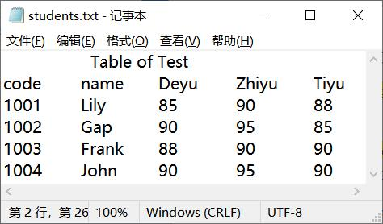
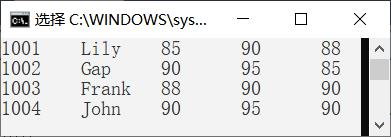
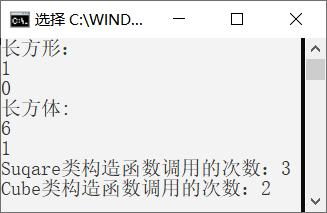
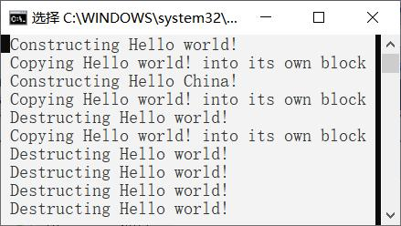

# 样卷

<!-- page: 1 -->

… … … … … … … … … … … … … … … … … 密… … … … … … … … … … … … … … … … … … 封… … … … … … … … … … … … … … … 线… … … … … … … … … … … … … …

姓名                学号
  学院                  专业班级                     座位号

诚信应考，考试作弊将带来严重后果！

华南理工大学本科生期末考试

注意事项：1. 开考前请将密封线内各项信息填写清楚；

2. 所有答案请直接答在答题纸上；
3．考试形式：闭卷；

4. 本试卷共（四）大题，满分100 分，
考试时间120 分钟。

<!-- question: cpp-043-Q1 -->

一、选择题：共20 题，每题1 分，共20 分。
1. 在下列函数原型中，可以作为类Student 析构函数的是（
）。
A.
void ~Student;
B.
Student();
C.
~Student()const;
D. ~Student() ;

2．Student 是一个类，那么执行语句“Student s1, s2[2], *ps3=&s1;”调用了（
）
次构造函数。

A. 1
B. 2
C. 3
D. 4

( 密 封 线 内 不 答 题 )

3.若有以下类Xclass 说明，则函数fun1 中访问成员data 错误的是（
）。
class Xclass
{
static int data;
public:

static void fun1(Xclass&);
};
int Xclass::data=0;
A.void Xclass::fun1(Xclass&obj1)
{
obj1.data =1;
}
B.void Xclass::fun1(Xclass&obj1)
{
this->data = 0;
}
C.void Xclass::fun1(Xclass&obj1)
{
cout<<obj1.data;
}
D.void Xclass::fun1(Xclass&obj1)
{
Xclass::data = 0;
}

4．若有以下类Xclass 说明，则函数fun1 的正确定义是（
）。
class Xclass
{
int data;
public:

void fun1(int&) const;
};

A.void Xclass::fun1( int&par )const
{
par = data;
}
B.void Xclass::fun1( int&par )const
{
par = data++;
}
C.void Xclass::fun1( int&par )const
{
cin>> data;
}
D.void Xclass::fun1( int&par )const
{
data =par;
}

5. 下列只能用成员函数重载的运算符是（
）。
A. = 和()
B. () 和+

《
高级语言程序设计(C++)(二)
》试卷A 第1 页共12 页

<!-- page: 2 -->

C. + 和=
D. ++ 和--

6. 如果表达式j++ * k 中的++和*都是重载的友元运算符，则采用运算符函数调用格
式，该表达式还可以表示为（
）。
A.operator*(j.operator++(),k)
B. operator*(operator++(j，0),k)
C.operator++(j).operator*(k)
D. operator*(operator++(j),)

7. 假设有类Xclass，Type 为类型标识符，可以是基本类型或类类型，Type_Value 为
Type 类型的表达式，那么，类型转换函数的形式为（
）。
A.Xclass :: operator Type(Type t)
{
… return Type_Value;
}
B.friend Xclass :: operator Type()
{
… return Type_Value;
}
C.Xclass :: operator Type()
{
… return Type_Value;
}
D.Type Xclass :: operator Type()
{
… return Type_Value;
}

8.
设有基类Base, 派生类Derived, 在Base 中定义了静态成员num,则下列描述正
确的是：

A.num 只被所有的Base 类对象共享
B.在Derived 中不能再定义静态成员
C.不管Derived 以何种方式继承Base，num 在Base 和Derived 中访问性质相同
D.num 被所有的Base 类和Derived 类对象共享

9.在析构具有对象成员的派生类对象时，需要调用①基类的析构函数、②派生类的析
构函数、③对象成员所在类的析构函数，这些析构函数执行的顺序是（
）。
A. ②③①
B. ①②③
C. ③②①
D. ③①②

10.下列关于派生类对象的初始化，叙述正确的是（
）。
A. 是由派生类的构造函数的实现的
B. 是由基类和派生类的构造函数实现的
C. 是由基类的构造函数实现的
D. 是系统自动完成的，不需要程序设计者干预

11. 下列声明area 为纯虚函数,正确的是（
）。
A. void area()=0;
B. virtual void area();
C. virtual void area()=0;
D. virtual void area(){ };

12. 假设figure 为抽象类，下列错误的声明语句是（
）。
A. figure& fun( int ) ;
B. figure * p ;
C. int fun( figure *) ;
D. figure
Obj ;

13. 基类指针与派生类指针，可以分别指向基类对象或派生类对象而形成4 种情形。
在这4 种情形中，需要进行强制类型转换的是（
）。
A.基类指针指向基类对象
B. 基类指针指向派生类对象
C. 派生类指针指向派生类对象
D.派生类指针指向基类对象

《
高级语言程序设计(C++)(二)
》试卷A 第2 页共12 页

<!-- page: 3 -->

14. 假设有函数模板定义如下，则下列选项正确的是（
）。
template <typename Type>
void Sum( Type a, Type b ,Type &c)
{
c = a + b;
}
A. int x, y; char z; Sum( x, y, z );
B. int x, y; float z; Sum( x, y, z );
C. double x, y, z; Sum( x, y, z );
D. float x; double y, z; Sum( x, y, z );

15.
若有以下类模板声明，则正确的说明语句是（
）。
template<typename Type>
class Xclass
{
Type data;
public:

Xclass(Type);
//…
};

A. Xclass(int) obj(10);
B. Xclass< int > obj(10);
B. Xclass<10> obj();
D. Xclass obj(10);

16. 在下列模板说明中，错误的是（
）。
A. template <typename Type1, Type2 >
B. template < class Type1, class Type2 >
C. template <typename Type1, typename Type2 >
D. template < typename
Type>

17. 以下语句的输出结果是（
）。
cout<<setfill('#')<<setw(10)<< setiosflags(ios::left)<<"SCUT!"<<endl;

A. SCUT!#####
B. #####SCUT!
C. ###SCUT!##
D. ##SCUT!###

18. 下列打开文件的语句中，（
）是错误的。
A.ofstream ofile; ofile.open("student.txt",ios::binary);
B.ifstream ifile("student.txt",ios::out);
C.fstream iofile; iofile.open("student.txt",ios::ate);
D.ifstream ifile("student.txt",ios::in);

19. 设有double number; 以二进制代码方式把number 的值写入输出文件流对象fout
中，正确的语句是（
）。
A.fout.write( &number, sizeof(double));
B.fout.write( &number, data);
C.fout.write((char ) &number, sizeof(double));
D.fout.write((char ) &number, data);

《
高级语言程序设计(C++)(二)
》试卷A 第3 页共12 页

<!-- page: 4 -->

20. 把二进制数据文件流fout 的写指针移到文件头的语句是（
）。
A. fdat.seekg( 0, ios::beg);
B. fdat.tellg( 0, ios::beg );
D. fdat.seekp( 0, ios::beg);
D. fdat.tellp( 0, ios::beg );

<!-- question: cpp-043-Q2 -->

二、写出程序的运行结果：共6 题，每题5 分，共30 分。
1.
#include<iostream>
using namespace std;
class Xclass
{
public :

Xclass( int x=0, int y=0 )
{
data1 = x; data2 = y;
cout << "调用构造函数." << endl;
cout << data1 << ends << data2 << endl;
}
Xclass( Xclass &d )
{ cout << "调用复制构造函数." << endl;

data1=d.data1;data2=d.data2;

cout << d.data1 << ends << d.data2 << endl;
}
~Xclass() { cout << "调用析构函数."<<endl; }
Xclass &fun(Xclass &para1 )
{
Xclass temp;
temp.data1=data1+para1.data1;
temp.data2=data2+para1.data2;
cout<<temp.data1<<ends<<temp.data2<<endl;
return temp;
}
private :

int data1, data2;
};
int main()
{
Xclass d1( 4, 8 );
Xclass d2( d1 );
d1.fun(d2);
}

2.
#include <iostream>
using namespace std;
class Xclass
{
public :

《
高级语言程序设计(C++)(二)
》试卷A 第4 页共12 页

<!-- page: 5 -->

Xclass(int x=0,int y=0,int z=0)
{
a = x; b = y; c = z;
}
void get( int &i, int &j, int &k )
{
i = a; j = b; k = c;
}
Xclass operator+ ( Xclass obj );
private:

int a, b, c;
};
Xclass Xclass::operator+( Xclass obj )
{
Xclass tempobj;
tempobj.a = a + obj.a;
tempobj.b = b + obj.b;
tempobj.c = c + obj.c;
return tempobj;
}
int main()
{
Xclass obj1( 1,2,3 ), obj2( 5,5,5 ), obj3;
int a, b, c;
obj3 = obj1 + obj2;
obj3.get( a, b, c );
cout<<"a = "<<a<<ends<<"b = "<<b<<ends<<"c = "<<c<<'\n';
(obj2+obj3).get( a, b, c );
cout<<"a = "<<a<<ends<<"b = "<<b<<ends<<"c = "<<c<<'\n';
}

3.
#include<iostream>
using namespace std;
class Base1{
protected:

int data1;
public :

Base1( int i ){

data1=i;
cout << "调用基类Base1 的构造函数:" << data1 << endl;
}
int get(){return data1;}
};
class Base2{
protected:

int data2;
public:

Base2( int j ){

data2=j;
cout << "调用基类Base2 的构造函数:" << data2 << endl;
}
int get(){return data2;}
};

《
高级语言程序设计(C++)(二)
》试卷A 第5 页共12 页

<!-- page: 6 -->

class Derived : public Base1, public Base2
{
public :

Derived( int a,int b,int c,int d,int e ):Base2(b),Base1(c),b2(a),b1(d)
{

data3=e;
cout << "调用派生类的构函数:" << data1+data2+data3+b1.get()+b2.get()
<< endl;
}
protected:

Base1 b1;
Base2 b2;
int data3;
};
int main()
{
Derived obj( 1, 2, 3, 4, 5 );
}

4.
#include <iostream>
using namespace std;
class Base{
public:

virtual void getxy( int i,int j = 0 ) {

x = i;
y = j;
}
virtual void fun() = 0;
protected:

int x , y;
};
class A : public Base{
public:

void fun() {

cout<<x<<ends<<x*x<<endl;
}
};
class B : public Base{
public:

void fun(){

cout <<x << ends <<
y << endl;
cout << x / y << endl;
}
};
int main(){

《
高级语言程序设计(C++)(二)
》试卷A 第6 页共12 页

<!-- page: 7 -->

Base
*pb;
A obj1;
B obj2;
pb = &obj1;
pb -> getxy( 20 );
pb -> fun();
pb = &obj2;
pb -> getxy( 80, 10 );
pb -> fun();
}

5.
#include <iostream>
using namespace std;
template <typename T>
void fun(T *x, int size)
{

int i, work;
T temp;
for( int pass = 1; pass < size; pass++)
{
work = 1;
for( i = 0;
i < size-pass; i++ )
if( x[i] > x[i+1] ){

temp = x[i];x[i] = x[i+1];x[i+1] = temp;
work = 0;
}
if( work ) break;
}
}
template <typename T>
void show(T *x, int size)
{

int i;
for(i=0;i<size;i++)

cout<<x[i]<<ends;
cout<<endl;
}
int main()
{ int a[] = { 80,75,90,60,88};

double b[] = { 80.5,75.5,90.5,60.5,88.5};
show(a,sizeof(a)/sizeof(int) );
fun( a,sizeof(a)/sizeof(int) );
show(a,sizeof(a)/sizeof(int) );
show(b,sizeof(b)/sizeof(double) );

《
高级语言程序设计(C++)(二)
》试卷A 第7 页共12 页

<!-- page: 8 -->

fun( b,sizeof(b)/sizeof(double));
show(b,sizeof(b)/sizeof(double) );
}

6.
#include<iostream>
#include<iomanip>
using namespace std;
void main()
{
double x=123.456;
cout.width (10);
cout.setf(ios::dec,ios::basefield);
cout<<x<<endl;
cout.setf(ios::left);
cout<<x<<endl;
cout.width(15);
cout.setf(ios::right, ios::left);
cout<<x<<endl;
cout.setf(ios::showpos);
cout<<x<<endl;
cout.setf(ios::scientific);
cout<<x<<endl;
}

<!-- question: cpp-043-Q3 -->

三、程序填空：共15 空，每空2 分，共30 分。
1.请在以下程序的划线处补充适当的内容，使程序运行能得到如下结果。
#include<iostream>
using namespace std;
class Aclass{
public :

Aclass(int i) {

(1)
;
}

(2)
;
protected :

int val;
};
class Bclass : public Aclass{
public:

Bclass(int i) :
(3)
{ }
void Display()const{

cout << "十六进制:" << hex << val << endl;
}

《
高级语言程序设计(C++)(二)
》试卷A 第8 页共12 页

<!-- page: 9 -->

};
class Cclass : public Aclass{
public:

Cclass(int i) : Aclass(i)
{ }
void Display() const{

cout << "十进制: " << dec << val << endl;
}
};
class Dclass : public Aclass{
public:

Dclass(int i) : Aclass(i)
{ }
void Display()const{

(4)
;
}
};
void fun( Aclass * n ){

(5)
;
}
int main(){

Bclass n1(20);
fun(&n1);
Cclass n2(20);
fun(&n2);
Dclass n3(20);
fun(&n3);
}
2. 请在以下程序的划线处补充适当的内容，使程序运行能得到如下结果。

#include<iostream>
using namespace std;
class Complex{
public:

Complex(
(6)
);
friend Complex operator+( const Complex &c1, const Complex &c2 );

(7)
operator<< (ostream&, const Complex);
Complex operator-();
private:

double
Real, Image;
};
Complex::Complex( double r, double i ){

Real = r;
Image = i;

《
高级语言程序设计(C++)(二)
》试卷A 第9 页共12 页

<!-- page: 10 -->

}
Complex operator+( const Complex &c1, const Complex &c2 ){

double r = c1.Real + c2.Real;
double i = c1.Image+c2.Image;
return
(8)
;
}

(9)
operator- (){
return Complex(-Real, -Image );
}
ostream&
operator<< (ostream& out, const Complex c){
cout << '(' << c.Real << ", " << c.Image << ')' << endl;

(10)
;
}
int main(){

Complex
c1( 1,2 ), c2(3, 4 );
Complex c;
c =3 + c2;
cout << c;
c = c2 + 3;
cout << c;
c = - c1;
cout << c;
}
3. 学生年度综合测评成绩由德育成绩、智育成绩和体育成绩组成，以下程序的功能是
将如下左图所示的存有综合测评成绩的文本文件（d:\students.txt）转换为二进制文
件(d:\students.dat)，程序的运行结果如下右图所示，请在划线处填入适当的内容，
使程序完整。

#include<iostream>
#include<fstream>

using namespace std;
struct Test
{
int number;

《
高级语言程序设计(C++)(二)
》试卷A 第10 页共12 页

<!-- page: 11 -->

char name[30];
int deyu;
int zhiyu;
int tiyu;
};
const Test mark = { 0, "noName\0", 0, 0, 0};
int main()
{

char s[80];
Test stu;
fstream instuf(
(11)
);
fstream outf(
(12)
);
if ( !instuf |!outf ){

cerr<<"File could not be open."<<endl;
abort();
}
instuf.getline( s, 80 );
instuf.getline( s, 80 );
while(
(13)
){
cout<<stu.number<<'\t'<<stu.name<<'\t'<<stu.deyu<<'\t'<<stu.zhiyu<<'\t'<<s
tu.tiyu<<'\n';

outf.write((char*)&stu, sizeof(Test));
}
outf.write(
(14)
);
instuf.close();

(15)
;
}
<!-- question: cpp-043-Q4 -->

四、编程题：共2 题，每题10 分，共20 分。

1.以下程序实现由Square 类派生Cube 类，程序的运行结果如下。请根据主程序和下
面运行结果，补充Square 类和Cube 类的设计。
#include <iostream>
using namespace std;

void display(Suqare &p){

cout<<p.area()<<endl;
cout<<p.volume()<<endl;
}

int main(){

Suqare cobj(1,1), &rs = cobj;
cout << "长方形："<<endl;
display(rs);
Cube ccobj(1,1,1), *pc = new Cube(2,2,2);

《
高级语言程序设计(C++)(二)
》试卷A 第11 页共12 页

<!-- page: 12 -->

cout << "长方体:" << endl;
display(ccobj);
cout<<"Suqare 类构造函数调用的次数：";
Suqare::show();
cout<<"Cube 类构造函数调用的次数：";
Cube::show();
}

2. 请补全下面程序中Strings 类的设计，使程序能正确运行，并得到下图的结果。

#include<iostream>
#include<cstring>
using namespace std;
class
Strings
{
public :
Strings(const char * pN = "\0" );
Strings( const Strings & );
Strings & operator=( Strings );
~ Strings();
protected :
char*
pString;
int size;
};

int main()
{

Strings Obj1( "Hello world!" );
Strings Obj2 = Obj1;
Strings Obj3( "Hello China!" );
Obj3 = Obj2 = Obj1;
}

《
高级语言程序设计(C++)(二)
》试卷A 第12 页共12 页

