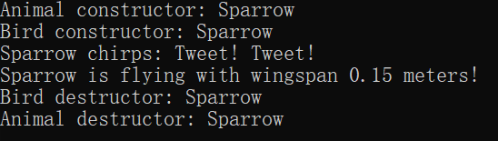
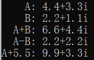

# （A）试卷

**诚信应考，考试作弊将带来严重后果！**

**华南理工大学本科生期末考试**

**2025-2026-1学期《高级语言程序设计** **(C++)(二)》A卷**

**注意事项：1.** **开考前请将密封线内各项信息填写清楚；**

**2.** **所有答案请直接答在** **答题纸** **上；**

**3．考试形式：闭卷；**

**4.** **本试卷共 （ 四 ）大题，满分100分，**	**考试时间120分钟**。

**一、单项选择题：共18题，每题2分，共36分。**

<!-- question: cpp-044-Q1 -->

1．下列类的定义中正确的是（    ）。

（A）class a{int x=0;int y=1;}                	（B）class b{int x=0;int y=1;};

（C）class c{int x;int y;}                          	（D）class d{int x;int y;};

<!-- question: cpp-044-Q2 -->

2．下面对构造函数的不正确描述是（    ）。

（A）用户定义的构造函数不是必须的

（B）构造函数可以重载

（C）构造函数可以有参数，也可以有返回值

（D）构造函数可以设置默认参数

<!-- question: cpp-044-Q3 -->

3．下面对友元的错误描述是（    ）。

（A）关键字friend用于声明友元

（B）一个类中的成员函数可以是另一个类的友元

（C）友元函数访问对象的成员不受访问特性影响

（D）友元函数通过this指针访问对象成员

<!-- question: cpp-044-Q4 -->

4．若有以下说明，则对n的正确访问语句是（    ）。

class Y

{    //…;

public:

staticint n;

};

int Y::n=0;

Y objY;

（A）n=1;					（B）Y::n=1;			（C）objY::n=1;			（D）Y->n

<!-- question: cpp-044-Q5 -->

5．设有类A的对象Aobject，若用友元函数重载后置自减表达式，那么Aobject--被编译器解释为（    ）。

（A）Aobject.operator--  ()					（B）operator--  (Aobject,0)

（C）--  (Aobject,0)								（D）--  (Aobject,0)

<!-- question: cpp-044-Q6 -->

6．下列关于类层次中重名成员的描述，错误的是（    ）。

（A）C++允许派生类的成员与基类成员重名

（B）在派生类中访问重名成员时，屏蔽基类的同名成员

（C）在派生类中不能访问基类的同名成员

（D）如果要在派生类中访问基类的同名成员，可以显式地使用作用域符指定

<!-- question: cpp-044-Q7 -->

7．在创建派生类对象时，构造函数的执行顺序是（    ）。

（A）对象成员构造函数—基类构造函数—派生类本身的构造函数

（B）派生类本身的构造函数—基类构造函数—对象成员构造函数

（C）基类构造函数—派生类本身的构造函数—对象成员构造函数

（D）基类构造函数—对象成员构造函数—派生类本身的构造函数

<!-- question: cpp-044-Q8 -->

8．下列关于多继承的描述，错误的是（     ）。

（A）一个派生类对象可以拥有多个直接或间接基类的成员

（B）在多继承时不同的基类可以有同名成员

（C）对于不同基类的同名成员，派生类对象访问它们时不会出现二义性

（D）对于不同基类的不同名成员，派生类对象访问它们时不会出现二义性

9．基类的指针与派生类指针，可以分别指向基类对象或派生类对象而形成4种情形。在这4种情形中，需要进行强制类型转换的是（    ）。

（A）基类指针指向基类对象		（B）基类指针指向派生类对象

（C）派生类指针指向基类对象		（D）派生类指针指向派生类对象

<!-- question: cpp-044-Q9 -->

10.  下列函数中，不能说明为虚函数的是（    ）。

（A）析构函数						（B）构造函数

（C）公有成员函数				（D）私有成员函数

<!-- question: cpp-044-Q10 -->

11.  在C++中，要实现动态联编，必须使用（    ）调用虚函数。

（A）基类指针		（B）对象名	（C）派生类指针	（D）类名

<!-- question: cpp-044-Q11 -->

12.  在下面函数原型中，（    ）声明了fun为纯虚函数。

（A）void fun()=0;					（B）virtual void fun()=0;

（C）virtual void fun();				（D）virtual void fun(){ };

<!-- question: cpp-044-Q12 -->

13.  假设Aclass为抽象类，下列正确的说明语句是（    ）。

（A）Aclass fun( int ) ;				（B）Aclass * p ;

（C）int fun( Aclass ) ;						（D）Aclass Obj ;

<!-- question: cpp-044-Q13 -->

14．假设有函数模板定义如下，则下列选项正确的是（    ）。

template <typename T>

Max( T a, T b ,T &c)

{  c = a + b;  }

（A）int x, y; char z; Max( x, y, z );

（B）double x, y, z; Max( x, y, z );

（C）int x, y; float z; Max( x, y, z );

（D）float x; double y, z; Max( x, y, z );

<!-- question: cpp-044-Q14 -->

15．若一个类模板定义了静态数据成员，正确的叙述的是（    ）。

（A）每一个实例化的模板类都有自己的静态数据成员副本

（B）类模板的静态数据成员在声明类模板时定义和初始化

（C）一个类模板实例化的不同模板类的全部对象共享一个静态数据成员

（D）一个类模板实例化后的每个对象都有自己的静态数据成员副本

<!-- question: cpp-044-Q15 -->

16．能够从输入流中提取指定长度的字节序列的函数是（    ）。

（A）get						（B）getline				（C）read						（D）cin

<!-- question: cpp-044-Q16 -->

17．以下关于文件操作的叙述中，不正确的是（    ）。

（A）打开文件的目的是使文件对象与磁盘文件建立联系

（B）文件的读写过程中，程序将直接与磁盘文件进行数据交换

（C）关闭文件的目的之一是保证输出的数据写入硬盘文件中

（D）关闭文件的目的之一是释放内存中的文件对象

18.  设已定义浮点型变量double data，以二进制代码方式把data的值写入输出文件流对象outfile中，正确的语句是（    ）。

（A）outfile.write((double  ) &data, sizeof(double));

（B）outfile.write((double  ) &data, data);

（C）outfile.write((char  ) &data, sizeof(double));

（D）outfile.write((char  ) &data, data);

**二、读程序写结果：共6题，每题5分，共30分**

<!-- question: cpp-044-Q17 -->

1.  #include<iostream>

using namespace std;

class T

{

public:

T(int x) { a = x; b += x; };

static void display(T c) { cout << "a=" << c.a << '\t' << "b=" << c.b << endl; }

private:

int a;

static int b;

};

int T::b = 5;

int main()

{

T A(3), B(5);

T::display(A);

T::display(B);

}

<!-- question: cpp-044-Q18 -->

2.  #include<iostream>

using namespace std;

class A

{

public:

A() { a = 5; }

void printa() { cout << "A:a = " << a << endl; }

private:

int a;

friend  class B;

};

class B

{

public:

void display1(A t)

{

t.a++; cout << "display1:a = " << t.a << endl;

};

void display2(A& t)

{

t.a--; cout << "display2:a = " << t.a << endl;

};

};

int main()

{

A obj1;

B obj2;

obj1.printa();

obj2.display1(obj1);

obj1.printa();

obj2.display2(obj1);

obj1.printa();

}

<!-- question: cpp-044-Q19 -->

3.  #include<iostream>

using namespace std;

class Base1

{

public:

Base1(int i)

{

cout << "Base1:" << i << endl;

}

};

class Base2

{

public:

Base2(int j)

{

cout << "Base2:" << j << endl;

}

};

class A : public Base1, public Base2

{

public:

A(int a, int b, int c, int d) :Base2(b), Base1(c), b2(a), b1(d)

{

cout << "A:" << a + b + c + d << endl;

}

private:

Base1 b1;

Base2 b2;

};

int main()

{

A obj(1, 2, 3, 4);

}

<!-- question: cpp-044-Q20 -->

4.  #include<iostream>

using namespace std;

class A

{

public:

A(int i, int j) { a = i; b = j; }

void Add(int x, int y) { a += x;  b += y; }

void show() { cout << a << "\t" << b << endl; }

private:

int a, b;

};

class B : public A

{

public:

B(int i, int j, int m, int n) : A(i, j), x(m), y(n) {}

void show() { cout << x << "\t" << y << endl; }

void fun() { Add(4, 4); }

void ff() { A::show(); }

private:

int x, y;

};

int main()

{

A a(1, 2);

a.show();

B b(3, 4, 5, 6);

b.A::show();

b.show();

b.fun();

b.A::show();

b.show();

}

<!-- question: cpp-044-Q21 -->

5.  #include <iostream>

using namespace std;

template <typename T>

void fun(T &x, T &y)

{

T temp;

temp = x;  x = y;  y = temp;

}

int main()

{

int i, j;

i = 10; j = 20;

fun(i, j);

cout << "i = " << i << '\t' << "j = " << j << endl;

double a, b;

a = 1.1; b = 2.2;

fun(a, b);

cout << "a = " << a << '\t' << "b = " << b << endl;

}

<!-- question: cpp-044-Q22 -->

6.  #include<iostream>

#include<iomanip>

using namespace std;

void main()

{

cout.width(10);

double x = 123.456;

cout << x << endl;

cout.setf(ios::left);

cout << x << endl;

cout.width(10);

cout.setf(ios::right);

cout << x << endl;

cout.width(10);

cout.fill('+');

cout << x << endl;

cout.setf(ios::scientific);

cout << x << endl;

}

**三、读程序填空：共6个空，每空2分，共12** **分**

#include <iostream>

#include <string>

using namespace std;

//  基类定义

class Animal {

protected:

string name;

public:

//声明带参数的构造函数

Animal(const string& n) : name(n) {

cout << "Animal constructor: " << name << endl;

}

//声明析构函数

<!-- question: cpp-044-Q23 -->

（1）                                         {

cout << "Animal destructor: " << name << endl;

}

//声明speak函数

<!-- question: cpp-044-Q24 -->

（2）                                        {

cout << name << " makes a sound." << endl;

}

};

//  派生类定义

class Bird : public Animal {

private:

double wingspan;

public:

//构造函数调用基类构造函数，并初始化Animal和wingspan

Bird(const string& n, double w) :（3）                                               {

cout << "Bird constructor: " << name << endl;

}

//声明析构函数

~Bird() {

cout << "Bird destructor: " << name << endl;

}

//重写speak函数

void speak(){

cout << name << " chirps: Tweet! Tweet!" << endl;

}

void fly() const {

cout << name << " is flying with wingspan " << wingspan << " meters!" << endl;

}

};

int main() {

Animal* pA = new Bird("Sparrow", 0.15);  //构建动态对象

（4）                                                    ;  		  		//使用指针pA  调用speak函数

（5）                                                    ;  //使用指针pA  调用fly函数

（6）                                                    ;  //  删除指针pA  指向的对象

return 0;

}

**输出结果：**

****

**四、编程题：共2题，第1题10分，第2题12分，共22分**

1、建立一个复数类，类名称为Complex，数据成员包括实部real  和虚部imag  。下面给出了主函数中对类的使用和输出结果。完成类Complex的设计（包括必需的数据成员、构造函数、运算符重载函数等）。

#include <iostream>

using namespace std;

//定义类Complex

int main()

{

//使用4.4和3.3作为实部和虚部构建对象A，使用2.2和1.1作为实部和虚部构建对象B

Complex A(4.4, 3.3), B(2.2, 1.1);

cout << "    A: " << A.real << "+" << A.imag << "i" << endl;

cout << "    B: " << B.real << "+" << B.imag << "i" << endl;

cout << "  A+B: " << (A + B).real << "+" << (A + B).imag << "i" << endl;

cout << "  A-B: " << (A - B).real << "+" << (A - B).imag << "i" << endl;

cout << "A+5.5: " << (A + 5.5).real << "+" << (A + 5.5).imag << "i" << endl;

}

输出结果：

2、有一个运输类Transport，将它作为基类派生航空运输类Plane  、铁路运输类Railway，下面给出了主函数，其运行结果类似如下图所示，请给出三个类Transport,Plane , Railway的定义。类Plane的运输费用计算规则：假设单价为price  元/（公斤*小时），飞行速度为speed公里/小时，距离为distance  公里，货物重量为weight  公斤，则运输费用为  price*weight*（distance/speed）元；类Railway的运输费用计算规则：假设单价为price  元/（箱*公里），每箱装货量为wPer公斤/箱，距离为distance  公里，货物重量为weight  公斤，则运输费用为  price*（weight/wPer）*distance。

#include <iostream>

using namespace std;

//定义运输类 Transport、航空运输类Plane ‌，铁路运输类Railway

int main()

{

Transport *pt;

//使用单价5，距离1200，重量1800，速度600  构造对象P

Plane P( 5, 1200, 1800, 600 );

//使用单价1，距离1200，重量1800，每个集装箱的装货量600  构造对象R

Railway R( 1, 1200, 1800, 600 );

pt = &P;

pt->Run();//输出运输信息

pt = &R;

pt->Run();//输出运输信息

}

运行结果如下：

