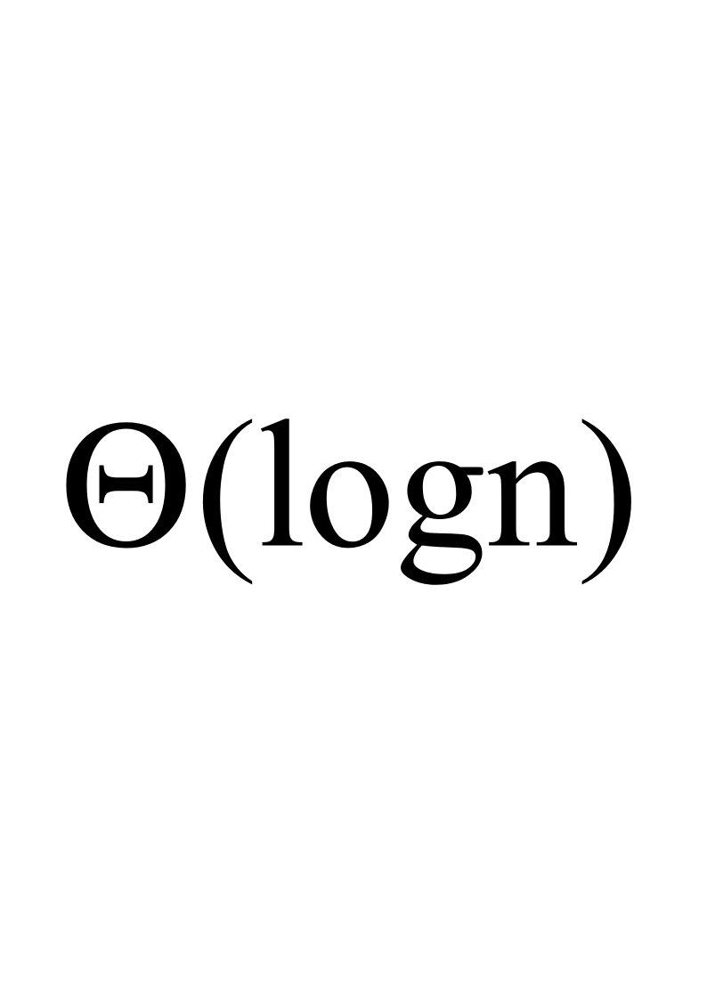
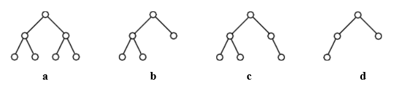
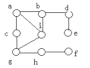
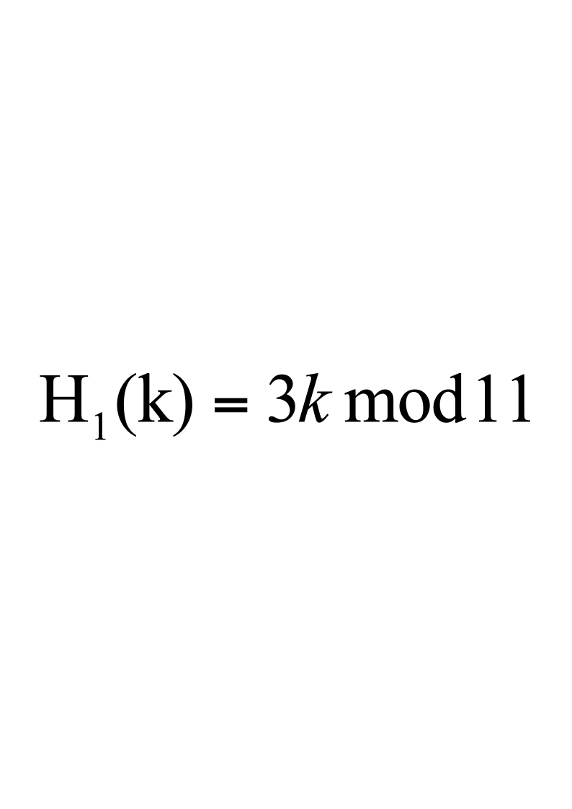
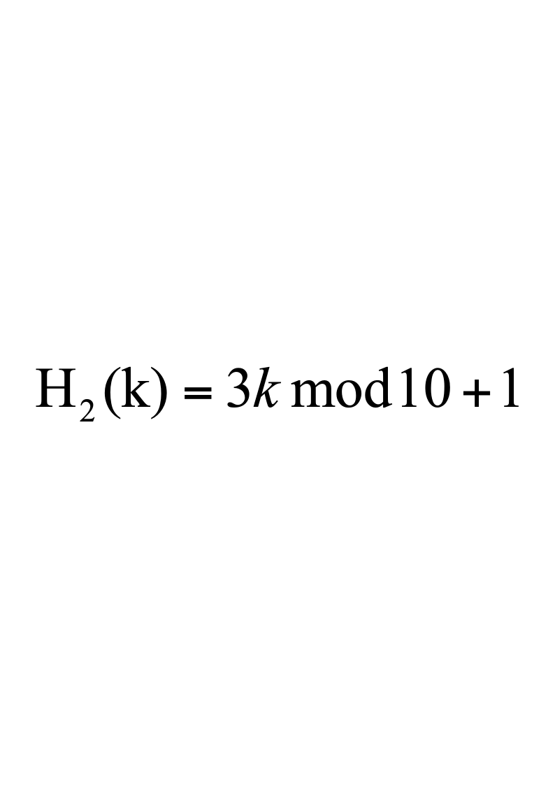
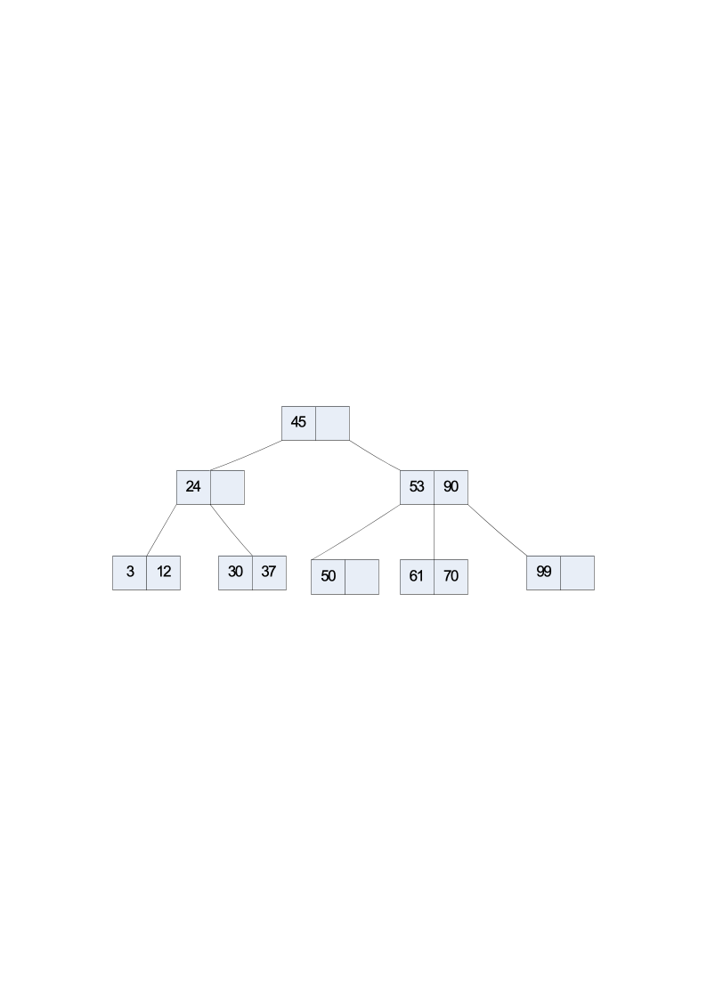
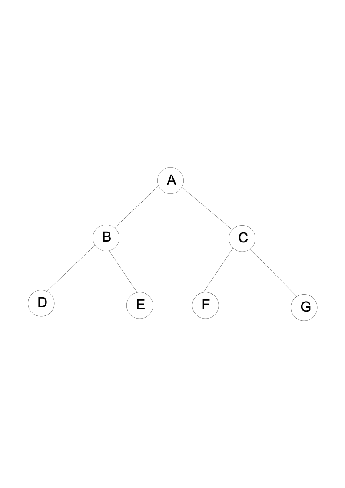

# 2015级数据结构试卷B

**诚信应考,考试作弊将带来严重后果！**

**华南理工大学期末考试**

**《**Data Structure**》试卷** **B**

**注意事项：1.** **考前请将密封线内填写清楚；**

**2.** **所有答案请答在答题纸上；**

**3．考试形式：闭卷；**

**4.** **本试卷共十大题，满分100分，考试时间120分钟**。

| **题 号** | **一** | **二** | **三** | **四** | **五** | **六** | **七** | **八** | **九** | **十** | **总分** |
|---|---|---|---|---|---|---|---|---|---|---|---|
| **得 分** |  |  |  |  |  |  |  |  |  |  |  |
| **评卷人** |  |  |  |  |  |  |  |  |  |  |  |

1. Select the correct choice.        (20 scores, each 2 scores)

(1)There is an algorithm with inserting an item to an ordered Array-based List and still keeping the Array-based List ordered. The computational efficiency of this inserting algorithm is  (    )?

(A)  O(1)        (B)O(logn)                 (C)  O(n)         (D)  O(n2)

<!-- question: data-structure-013-Q1 -->

(2) Linear  indexing is good for all EXCEPT  (     )?

(A) Range queries										(B) Exact match queries

(C) Insertion / Deletion                          (D) In-memory applications

(3)  The most important advantage of a 2-3 tree over a BST is that:  (   )?

(A)  The 2-3 tree has fewer nodes.    (B) The 2-3 tree has a higher branching factor.

(C) The 2-3 tree is height balanced.  (D)  None  of all above.

(4) The number of keyword in every node except root in a B- tree of order 5 is  (   )at least.

(A)  1        (B)2                 (C)  3         (D)  4

(5) When sorting a record sequence with 20 keys using merge sorting, how many passes,  will it execute  (     )?

(A)  2       (B)  3                   (C)  4         (D)  5

(6)  Tree indexing methods are meant to overcome what deficiency in hashing  (     )?

(A)  Inability to handle range queries.                (B)  Inability to handle updates.

(C) Inability to handle large data sets.                (D)  None  of all above.

(7) An input into a stack is like 1,2,3,4,5,6. Which output is impossible?  (    )

(A) 2,4,3,5,1,6          (B) 3,2,5,6,4,1              (C) 1,5,4,6,2,3              (D) 4,5,3,6,2,1

(8)  The time cost of the following code fragment is:  (    )

*sum1 = 0;*

*for (k=1; k<=n; k*=2)*

*for (j=1; j<=n; j++)*

*sum1++;*

(A) $O(n)$                (B)  $O(n^2)$                (C)  $O(nlogn)$                (D)  

(9) In the following four Binary Trees, is not a complete Binary Tree.  (     )

(10) For the following graph, one of results of breadth-first traversal is: (   )

(A)  acbdieghf      (B)  abcideghf      (C)  abcdefghi        (D)  abcidgehf
1. A certain binary tree has the preorder enumeration as  ABCEDFGHIJ  and the inorder enumeration as  CEBFDAHGJI. Try to draw the binary tree and give the postorder enumeration. (The process of your solution is required!!!)  (7  scores)

3. Build the Huffman coding tree and determine the codes for the following set of letters and weights:

| A | B | C | D | E | F | G | H |
|---|---|---|---|---|---|---|---|
| 15 | 5 | 13 | 26 | 10 | 11 | 16 | 4 |

Draw the Huffman coding tree and give the Huffman code for each letters. What is the expected length in bits of a message containing n characters for this frequency distribution?  (The process of your solution is required!!!)   (10  scores)

4.  Show the max-heap that results from running buildHeap with values stored in an array:

10    4   7    13   9    16    8    20   11   25 .   (8  scores)
<!-- question: data-structure-013-Q2 -->

1. Inserting the values into the heap one by one.
<!-- question: data-structure-013-Q3 -->

1. Values are available at the same time.
1. Given a hash table of size 11, assume thatand are  two hash functions, where  $H_1$ is  used to get home position and  $H_2$ is  used to  resolve  collision for method double hashing.  Please insert keys 20,  31,  43,  26, 30, 13, 12,  67, 1  into the hash table in order.         (10  scores)

6. Please insert  8，55，17 into  the  following  2-3 tree. Inserting a key, draw a picture for the resulted 2-3 tree.  Thus  you should draw 3 pictures.  (10 scores)

7.  List the detail processes in which the edges of the graph are visited when running Kruskal’s MST algorithm.  (5  scores)

.

8.  Assume a disk drive is configured as follows. The total storage is approximately 1.5G divided among 15 surfaces. Each surface has 512 tracks; there are 256 sectors/track, 1024 byte/sector, and 32 sectors/cluster. The disk turns at  5400rmp (11.1 ms/r). The track-to-track seek time is 20 ms, and the average seek time is  50 ms. Now how  long  does it take to read all of the data in a 640 KB file on the disk? Assume that the file’s clusters are spread randomly across the disk. A seek must be performed each time the I/O reader moves to a new track. Show your calculations. (The process of your solution is required!!!)    (10  scores)

9. Fill the blank with correct C++ codes  to implement program for Topological Sort.  (12  scores)

void topsort(Graph* G, Queue<int>* Q) {

int* Count = new int[G->n()];

int v, w;

for (v=0; v<G->n(); v++) _____①_____; // Initialize

for (v=0; v<G->n(); v++)   // Process every edge

for (w=G->first(v); w<G->n(); w = G->next(v,w))

______②______;                     // Add to v2's prereq

for (v=0; v<G->n(); v++)   // Initialize queue

if (Count[v] == 0)       // Vertex has no prerequisites

_______③______;

while (Q->length() != 0) { // Process the vertices

_______④______;

printout(v);             // PreVisit for "v"

for (w=G->first(v); w<G->n(); w = G->next(v,w)) {

_____⑤________;            // One less prerequisite

if  ____⑥_______;     // This vertex is now free

Q->enqueue(w);

}

}

//free the memory

delete [] Count;

Count = NULL;

}

10.  Write a program to visit all of the nodes of a Binary Tree in breadth-first search (BFS) order. E.g. the follow Tree, the traversal result is ABCDEFG.  (8  scores)

