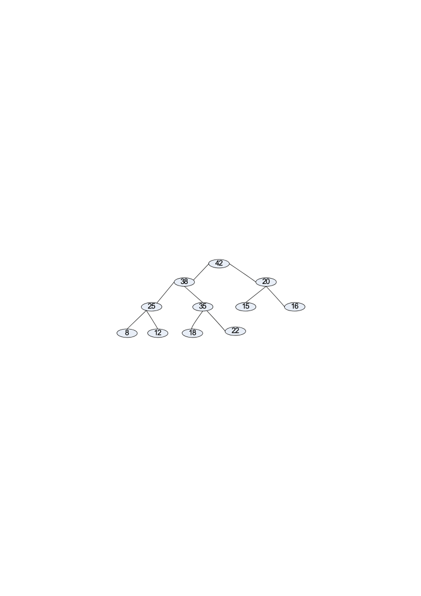
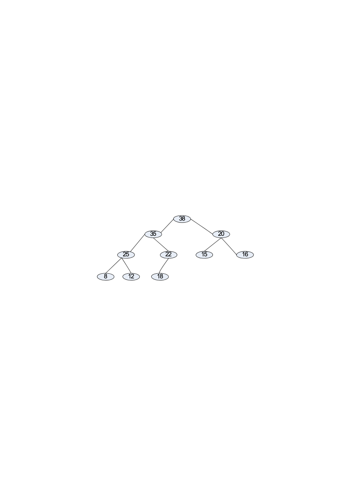
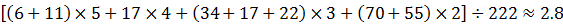
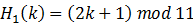
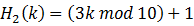
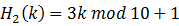
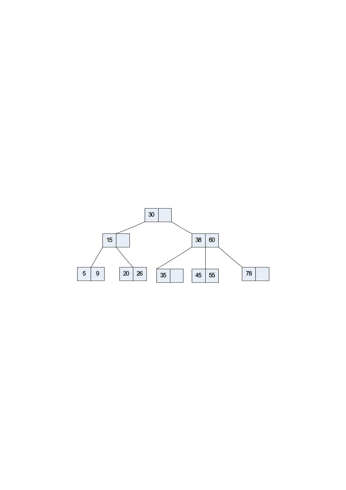
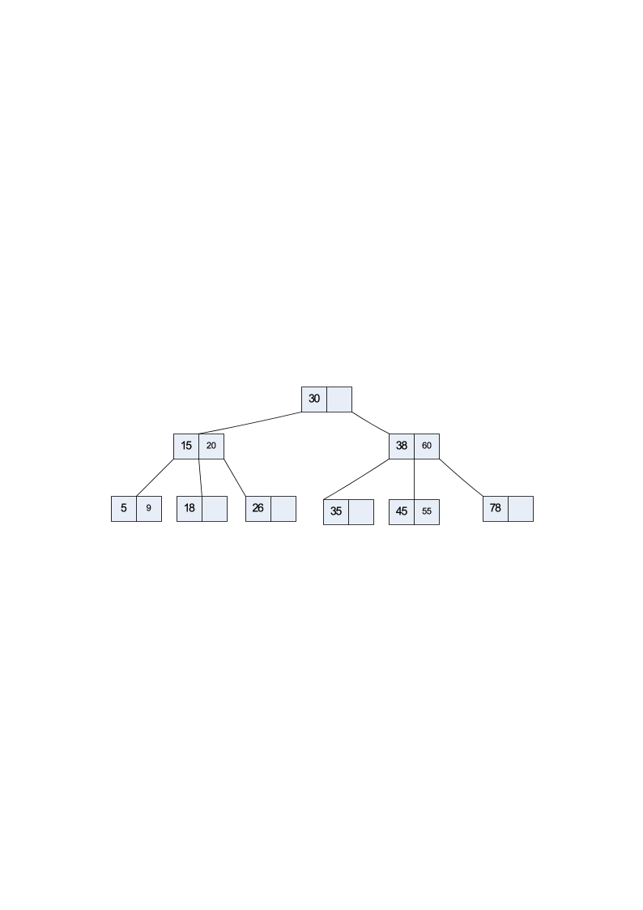
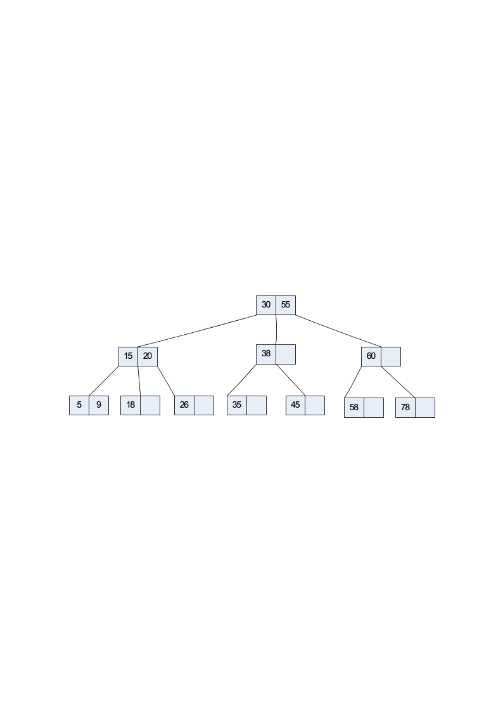
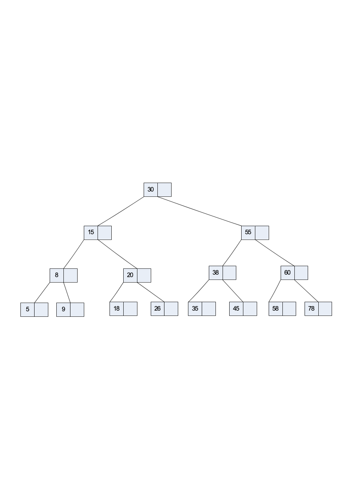

# 2016数据结构试卷B及答案

**诚信应考,考试作弊将带来严重后果！**

**华南理工大学期末考试**

**《**   Data Structure    **》试卷** **B**

**注意事项：1. 考前请将密封线内填写清楚；**

**2.** **所有答案请答在答题纸上；**

**3．考试形式：闭卷；**

**4. 本试卷共十大题，满分100分，考试时间120分钟**。

| **题 号** | **一** | **二** | **三** | **四** | **五** | **六** | **七** | **八** | **九** | **十** | **总分** |
|---|---|---|---|---|---|---|---|---|---|---|---|
| **得 分** |  |  |  |  |  |  |  |  |  |  |  |
| **评卷人** |  |  |  |  |  |  |  |  |  |  |  |

1. Select the correct choice.        (30 scores, each 2 scores)

(1) If a data element requires 4 bytes and a pointer requires  2  bytes, then a  linked  list representation will be more space efficient than a standard array representation when the fraction of non-zero elements is less than about:  (      A          )

(A)  2/3            (B)  3/4              (C) 1/3                    (D)  1/2

(2)  Assume array A contains a random permutation of the values from 0 to n  -  1,  the time cost of the following code fragment is:  (  B   )

sum = 0;

for (i=0; i<n; i++)

for (j=0; A[j]!=i; j++)

sum++;

(A) $Theta(n)$              (B)  $\Theta(n^2)$                  (C)                    (D)  

(3)   Which statement is  **not**  correct among the following four:    (  D   )
- In a BST, the left child of any node is less than the right child, but in a heap, the left child of any node could be less than or greater than the right child.
- The number of empty subtrees in a non-empty binary tree is one more than the number of nodes in the tree.
- A general tree can be  transferred  to a  binary tree with the root having only  left child.
- A  heap  must be a full binary tree.

(4)   An algorithm must be or do all of the following EXCEPT:    (    B    )

(A) Correct      (B)  Ambiguous    (C)  Concrete step    (D)  terminable

(5) In the following sorting algorithms, which is the best one to find the first 10 biggest elements in the 1000 unsorted elements?  (        C        )

(A)  Insert sort.				      	      (B)  Quicksort.

(C)  Heap sort.				      	      (D)  Shell sort.

(6) Which of the following is the max-heap constructed by a sequence of key (48, 76,  54, 32, 40, 85) ?    (  B  )

(A)76, 85,  54,  32,  48, 40       (B)  85,  76,  54,  32, 40,  48

(C)  85,  54,  76,  48, 32, 40       (D)  85,  76,  54,  32, 40,  48

(7) If there is 1MB working memory,  4KB  each  block, and yield  256  blocks for working memory.  By the multi-way merge in external  sorting, the average run size  and the  sorted  size  in one pass  of multi-way  merge on average respectively are :(        C      )

(A)    1MB, 256  MB		         	         (B) 1MB,  512  MB

(C)    2MB, 512 MB				  	  (D)  2MB, 1024MB

(8)  The  golden rule of  a disk-based program  design  is to:  (    A    )

(A)  Minimize the number of disk accesses.    (B)  Eliminate the recursive calls.

(C) Improve the basic operations.           (D) Reduce main memory use.

(9) The time cost of Quicksort in the worst case is (    D    ).

(A)  O(n)    (B)  O(log2  n)    (C)  O(n log2  n)    (D)  O(n2)

(10) The function of replacement selection sort is (        B          ).

(A)  Select the maximal element.	  	  (B)  Generate the initial sorted  merge  files.

(C)  Merge the sorted file.			   (D) Replace some record.

(11)  Tree indexing methods are meant to overcome what deficiency in hashing?  (    D    )

(A)  Inability to handle range queries.

(B)  Inability to handle  largest key value queries.

(C) Inability to handle queries in key order

(D)  All above.

(12)   Which statement is not correct among the following four:    (    A    )
- The  worst  case for my algorithm is  n  becoming larger and larger  because that is the  slowest.
- A cluster is the smallest unit of allocation for a file, so all files occupy a multiple of the  cluster  size.
- The selection sort is an unstable sorting algorithm.
- The number of leaves in a non-empty full binary tree is one more than the number of internal node.

(13) Assume that we have eight records, with key values A to H, and that they are      initially placed in alphabetical order. Now, consider the result of applying the     following access pattern:  F D F G G F A D F G,  if the list is organized by      frequency count  (count will store the records in the order of frequency that has      actually occurred so far), then the final list will be (    A    ).
- A B F G D C E H                      (B) E G F D A B C H

(C)  A G F D B C E H           (D) F E G D A B C H

(14) In the hash function, collision refers to (      B      ).

(A)  Two elements have the same sequence number.

(B)  Different keys are mapped to the same address of hash table.

(C)  Two records have the same key.        (D)  Data elements are too much.

(15)  For the following graph, one of results of Depth-first traversal is: (  C   )

A. acbdieghf   B. abighfcde   C. abdeigchf   D. abcdefghi

2. Arrange the following expressions by growth rate from slowest to fastest.    (4 scores)

3n2     log3n     n!        10n        2n    20      log2n        8n2/3

Answer:  20＜log3n＜log2n＜8n2/3＜10n＜3n2＜2n＜n!

3.  Draw the general tree represented by the following sequential representation for general trees:        RAC)M)PL)V)))NW)J)))                                          (6  scores)

Answer:

R

A                                          N

C           M          P                       W    J

L     V

4.  Please apply Quicksort  Algorithm to sort  the array  in ascending order:  265,  301,751,  129,  937,  863,  742,  694,  076,  438.  Note that the pivot value is selected based on the following function, Parameters  *i* and  *j*  define the start and end indices of the Array  *A*, respectively.                                           (10 scores)

*template <typename E>*

*inline int findpivot(E A[], int i, int j)*

*{ return* *A[i]**; }*

Answer:

Initial：  [265 301 751 129 937 863 742 694 076 438]

1st pass：  [076 129] 265 [751 937 863 742 694 301 438]

2nd pass：  076 [129] 265 [438 301 694 742] 751 [863 937]

3rd pass：  076 129 265 [301] 438 [694 742] 751 863 [937]

4th pass：  076 129 265 301 438 694 [742] 751 863 937

5th pass：  076 129 265 301 438 694 742 751 863 937

5.  Please draw pictures to show the heaps that results from  (6  scores)

1)  add  38 to  the following heap；

2)  then  delete  42  from  the  result heap of 1)；

Answer:

1）

2）

6.  Please give the  Huffman  codes for the letters of the following table, draw pictures to show how to  obtain  the  Huffman  tree step by step, and compute the expected bit-length per letter.  What’s  the advantage of  Huffman  code scheme.    (8  scores)

| Letter | a | b | c | d | e | f | g | h |
|---|---|---|---|---|---|---|---|---|
| Frequency | 55 | 34 | 17 | 6 | 70 | 11 | 17 | 22 |

Answer:

$$
222138683417d6f11c17b34e708439g17h22a55
$$

2）expected bit-length

3）advantage

Huffman  code scheme saves text length in most cases.

7.  Given a hash table of size 11, assume that  and   are  two hash functions, where  $H_1$ is  used to get home position  and  $H_2$ is  used to  resolve  collision  for method double hashing. Please  insert keys  9,  17,  63,  55,  22,  27,  88,  41  into the hash table  in order.      (10  scores)

Answer:

H1(9)=8, H1(17)=2, H1(63)=6, H1(55)=1, no conflict

When H1(22)=1, H2(22)=7  （1+2*7）%11=4，so  22  enters the  4  slot  (pass by  1,8);

H1(27)=0  so  27  enters the  0  slot;

H1(88)=1, H2(88)=5    (1+3*5)%11=  5      so  88  enters  5  (pass by  1,  6,  0  );

H1(41)=6, H2(41)=4      (6+1*4)%11= 10    so  41  enters 10(pass by  6)

| 27 | 55 | 17 |  | 22 | 88 | 63 |  | 9 |  | 41 |
|---|---|---|---|---|---|---|---|---|---|---|
| 0 | 1 | 2 | 3 | 4 | 5 | 6 | 7 | 8 | 9 | 10 |

8.  Please insert  18，58，8  into  the  following  2-3 tree. Inserting a key,  draw  a  picture for the  resulted 2-3 tree. Thus  you should draw 3 pictures. (10  scores)

Answer:

1）

2）

3）

9.  Complete the insert, remove functions of the Link-based List class.  (6  scores)

template <class Elem> class LList: public List<Elem> {

private:

Link<Elem>* head;//Point to list header

Link<Elem>* tail;//Pointer to last Elem

Link<Elem>* fence;//Last element on left

int leftcnt;  //Size of left

int rightcnt; //Size of right

public:

**bool LList<Elem>::insert(const Elem& item) { }**

**template <class Elem> bool LList<Elem>::remove(Elem& it) {** **}**

Solution:

**// Insert at front of right partition**

**template <class Elem>**

**bool LList<Elem>::insert(const Elem& item) {fence->next =**

**new Link<Elem>(item, fence->next);**

**if (tail == fence) tail = fence->next; rightcnt++;**

**return true;}**

**// Remove and return first Elem in right**

**// partition**

**template <class Elem> bool LList<Elem>::remove(Elem& it) {**

**if (fence->next == NULL) return false;**

**it = fence->next->element; //Remember val**

**// Remember link node**

**Link<Elem>* ltemp = fence->next;**

**fence->next = ltemp->next; // Remove**

**if (tail == ltemp) // Reset tail**

**tail = fence;**

**delete ltemp;      // Reclaim space**

**rightcnt--;**

**return true;**

**}**

10.  Assume a disk drive is configured as follows. The total storage is approximately  1.5G divided among  15 surfaces. Each surface has 512 tracks; there are  256  sectors/track, 1024  byte/sector, and 32  sectors/cluster. The disk turns at 7200rmp (8.33 ms/r). The track-to-track seek time is  3  ms, and the average seek time is  10 ms. Now how  long  does it take to read all of the data in a  960  KB file on the disk? Assume that the file’s clusters are spread randomly across the disk. A seek must be performed each time the I/O reader moves to a new track. Show your calculations.  (The process of your solution is required!!!)        (8  scores)

Solution：

The first question is how many  clusters the file requires?

A  cluster  holds 32*1K =  32K.   Thus, the file requires  960K/32K=30  clusters

The time to read a cluster is seek time to the

cluster+ latency time + (rotation time).

Average seek time is defined to be  10 ms. Latency time is 0.5  *  8.33  ms  (60/7200≈8.33ms),  and cluster rotation time is  (32/256)*8.33.

Seek time for the total file read time is

30* (10 + 0.5  *  8.33+ (32/256)*8.33 ) ≈456ms

11. The following graph is a communication network in some area, whose edge presents the channel between two cities with the weight as the channel’s cost. How to choose the cheapest path from A to other cities? And how to get cheapest paths connecting all cities? You can draw all choices if there is more than one path.

(10  scores )

Solution：

a. Get the shortest paths from A to other cities                                      (6  scores )

|  | A | B | C | D | E | F | G |
|---|---|---|---|---|---|---|---|
| Process A |  | 12 | 5 | 4 | ∞ | ∞ | ∞ |
| Process D |  | D:10 | 5 |  | ∞ | D:  13 | D:15 |
| Process C |  |  |  |  | ∞ | C:  11 |  |
| Process B |  |  |  |  | B:12 |  |  |
| Process  F |  |  |  |  |  |  |  |
| Process  E |  |  |  |  |  |  | E:14 |
| Process G |  | D:10 | A:5 | A:4 | B:12 | C:  11 | E:14 |

A to D:  4  (A,D);  A to C:  5(A,C);  A to B:  10(A,D,B);  A to E:  12(A,D,B,E);    A to F: 11(A,C,F);  A to G:14(A,D,B,E,G)

b. Draw the MST                                                (4  scores )
