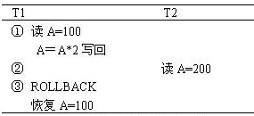

# 数据库考试样题

<!-- page: 1 -->

… … … … … … … … … … … … … … … … 密… … … … … … … … … … … … … … … … … … 封… … … … … … … … … … … … … … … 线… … … … … … … … … … … … … …

姓名                学号
  学院                  专业                     座位号

诚信应考,考试作弊将带来严重后果！

 华南理工大学期末考试

《数据库系统概论》样题

注意事项：1. 考前请将密封线内各项信息填写清楚；
<!-- question: database-004-Q1 -->

          2. 所有答案请直接答在答题纸；
<!-- question: database-004-Q2 -->

          3．考试形式：闭卷；

<!-- question: database-004-Q3 -->

          4. 本试卷共 五  大题，满分100 分，考试时间120 分钟。

题 号
一
二
三
四
五
总分
得 分
评卷人

<!-- question: database-004-Q4 -->

一、单项选择题（共30分，每题1分）

<!-- question: database-004-Q5 -->

1. 进行自然联接运算的两个关系必须具有（       ）

A．公共属性   B.相同关系名  C．相同属性个数 D.相同关键字

<!-- question: database-004-Q6 -->

2. 在数据库系统中死锁属于（       ）

A．系统故障  B.程序故障  C．事务故障
D.介质故障

3. 命令SELECT 学号，AVG(成绩) AS ‘平均成绩’ FROM XS_KC  GROUP BY 学号 HAVING

_____________ ________

( 密 封 线 内 不 答 题 )

AVG(成绩)>=85，表示（        ）。

A．查找XS_KC 表中平均成绩在85 分以上的学生的学号和平均成绩

B．查找平均成绩在85 分以上的学生

C．查找XS_KC 表中各科成绩在85 分以上的学生

D．查找XS_KC 表中各科成绩在85 分以上的学生的学号和平均成绩

<!-- question: database-004-Q7 -->

4. E-R 图有三个要素，其中不包括（       ）

A．实体   B．属性   C．实体之间的联系       D．实体标识符

<!-- question: database-004-Q8 -->

5. 一般视图在数据库中只存放（       ）

A．操作    B．对应的数据    C．定义    D．限制

<!-- question: database-004-Q9 -->

6. 设有一个关系：DEPT(DNO，DNAME)，如果要找出倒数第三个字母为W，其他为任意字母

的DNAME，则查询条件子句应写成 WHERE DNAME LIKE （       ）

    A.'_ _W _%'    B.'%W _ %'    C.'%W _ _'    D.' _ %W _ _'

<!-- question: database-004-Q10 -->

7. 关系模型中，候选码（         ）

A．可由多个任意属性组成       B．至多由一个属性组成

C．可由一个或多个其值能惟一标识该关系模式中任何元组的属性组成

D．以上都不是

<!-- question: database-004-Q11 -->

8. 在关系数据库设计中，设计关系模式是（       ）的任务。

A．需求分析阶段 B．概念设计阶段 C．逻辑设计阶段 D．物理设计阶段

《 数据库系统概论 》试卷第 1 页 共 5 页

<!-- page: 2 -->

<!-- question: database-004-Q12 -->

9. 设有两个事务T1、T2，其并发操作如下所示，下列评价正确的是（       ）。

A．该操作不存在问题       B．该操作丢失修改

C．该操作不能重复读       D．该操作读“脏”数据

<!-- question: database-004-Q13 -->

10. 由于某种原因，造成系统停止运行，致使事务在执行过程中以非控制方式终止，这时内

存中的信息丢失，而存储在外存上的数据未受影响，这种情况称为（       ）。

A．事务故障  B．系统故障  C．介质故障  D．运行故障

<!-- question: database-004-Q14 -->

11. 恢复和并发控制的基本单位是（       ）。

A．事务    B．数据冗余  C．日志文件  D．数据转储

<!-- question: database-004-Q15 -->

12. 一个事务的执行不能被其他事务干扰，叫做事务的（       ）。

A．原子性   B．一致性    C．持续性   D．隔离性

<!-- question: database-004-Q16 -->

13. 若事务T 对数据对象A 加上S 锁，则（       ）。

A．事务T 可以读A 和修改A，其它事务只能再对A 加S 锁，而不能加X 锁。

B．事务T 可以读A 但不能修改A，其它事务能对A 加S 锁和X 锁。

C．事务T 可以读A 但不能修改A，其它事务只能再对A 加S 锁，而不能加X 锁。

D．事务T 可以读A 和修改A，其它事务能对A 加S 锁和X 锁。

<!-- question: database-004-Q17 -->

14. 以下（       ）封锁违反两段锁协议。

A. Slock A … Slock B … Xlock C ………… Unlock A … Unlock B … Unlock C

B. Slock A … Slock B … Xlock C ………… Unlock C … Unlock B … Unlock A

C. Slock A … Slock B … Xlock C ………… Unlock B … Unlock C … Unlock A

D. Slock A …Unlock A ……Slock B … Xlock C …………… Unlock B … Unlock C

<!-- question: database-004-Q18 -->

15. 下列 SQL 语句中，修改表结构的是（       ）。

A．CREATE  B．ALTER   C．UPDATE   D．INSERT

<!-- question: database-004-Q19 -->

16. 关系代数表达式的优化策略中，首先要做的是（       ）

A. 对文件进行预处理                  B. 尽早执行选择运算

C. 执行笛卡儿积运算                  D. 投影运算

<!-- question: database-004-Q20 -->

17. SQL 中，下列涉及空值的操作，不正确的是 （       ）

A. AGE IS NULL         B. AGE IS NOT NULL

C. AGE = NULL          D. NOT (AGE IS NULL)

<!-- question: database-004-Q21 -->

18. 数据库管理系统中（       ）故障的恢复需要DBA 的介入

《 数据库系统概论 》试卷第 2 页 共 5 页

<!-- page: 3 -->

A.介质故障       B.事务故障       C.系统故障
D.死锁

<!-- question: database-004-Q22 -->

19. 关于查询优化正确的说法有（       ）

A. 选择运算应尽可能后做      B. 在执行投影操作前对关系适当进行预处理

C. 将投影运算与其前面或后面的双目运算结合  D. 投影运算应尽可能先做

<!-- question: database-004-Q23 -->

20. 在规范化的关系中，下列说法正确的是（      ）。

A．行列顺序有关                          B．属性名允许重名

C．任意两个元组不允许重复                D．列是非同质的

<!-- question: database-004-Q24 -->

21. 在SQL 语言中，建立索引用（       ）。

A.CREATE SCHMA 命令                   B.CREATE TABLE 命令

C.CREATE VIEW 命令                    D.CREATE INDEX 命令

<!-- question: database-004-Q25 -->

22. 下列SQL 语句中，能够实现实体完整性控制的子句是（       ）。

A. FOREIGN KEY                         B. PRIMARY KEY

C. REFERENCES                          D. FOREIGN KEY 和 REFERENCES

<!-- question: database-004-Q26 -->

23. 一般不适合建立索引的属性有（        ）。

A．主键码和外键码                  B．可以从索引直接得到查询结果的属性

C．对于范围查询中使用的属性        D．经常更新的属性

<!-- question: database-004-Q27 -->

24. SQL 的 SELECT 语句中，“ HAVING 条件表达式”用来筛选满足条件的（       ）。

A .列    B .行    C .关系     D .分组

<!-- question: database-004-Q28 -->

25. 任何一个满足2NF 但不满足3NF 的关系模式都不存在（     ）

A.主属性对候选键的部分依赖
B.非主属性对候选键的部分依赖

C.主属性对候选键的传递依赖
D.非主属性对候选键的传递依赖

<!-- question: database-004-Q29 -->

26. 学校数据库中有学生和宿舍两个关系：

学生（学号，姓名）  和  宿舍（楼名，房间号，床位号，学号）

假设有的学生不住宿，床位也可能空闲。如果要列出所有学生住宿和宿舍分配的情况，

包括没有住宿的学生和空闲的床位，则应执行（       ）

A.全外联接   B.左外联接  C.右外联接
D.自然联接

<!-- question: database-004-Q30 -->

27. 如下面的数据库表中，如果部门表的主关键字是部门号,职工表的主关键字是职工号，

外键为部门号，哪个SQL 操作不能执行？（
）

《 数据库系统概论 》试卷第 3 页 共 5 页

<!-- page: 4 -->

职工号
职工名
部门号
工资

部门号
部门名
主任

001
张三
02
1300

01
人事处
高书

002
李四
02
2100

02
财务处
李散

003
钱五
03
3125

03
宣传处
陈旭

004
王二
04
782

04
后勤处
龚途

职工表
部门表

 A．将职工号为’003’的工资改为2900

B．从职工表中删除行(‘004’,’王二’，’04’，782)

C．将行(‘005’,’乔庄’，’05’，1736)插入到职工表中

D．将部门号为’01’的主任改为’江晴’

<!-- question: database-004-Q31 -->

28. 有学生关系：学生(学号，姓名，年龄，系号)，对学生关系的查询语句如下：

SELECT 系号，AVG(年龄) FROM 学生 GROUP BY 系号

如果要提高查询效率，应该建索引的属性是（       ）。

A.学号        B.姓名     C.年龄
 D.系号

<!-- question: database-004-Q32 -->

29. 下列聚合函数中不忽略空值 (null) 的是（       ）。

A. SUM (列名)   B. MAX (列名)  C. COUNT ( * )   D. AVG (列名)

<!-- question: database-004-Q33 -->

30. （
 ）用来记录对数据库中数据进行的每一次更新操作

A.后援副本  B.日志文件   C.数据库
 D.缓冲区

<!-- question: database-004-Q34 -->

二、判断题（10分，每题1分，正确打√，错误打╳，请将答案填在答题纸上）

<!-- question: database-004-Q35 -->

31. 当局部E-R 图合并成全局E-R 图时可能出现的合并冲突中包含了命名冲突。

<!-- question: database-004-Q36 -->

32. 数据库恢复的基本原理是利用存储在后备副本、日志文件和数据库镜像中的冗余数据来

重建数据库。

<!-- question: database-004-Q37 -->

33. 产生死锁的原因是两个或多个事务都已封锁了一些数据对象，然后又都请求对已为其他

事务封锁的数据对象加锁，从而出现死等待。

<!-- question: database-004-Q38 -->

34. 将所有事务串行起来的调度策略一定是正确的调度策略。

<!-- question: database-004-Q39 -->

35. 数据库完整性约束包括实体完整性、参照完整性和用户自定义完整性。

<!-- question: database-004-Q40 -->

36. бF1 (бF2(E))等价бF1∧ F2(E)，其中E 为关系表，F1、F2 为条件。

<!-- question: database-004-Q41 -->

37. 并发操作带来的数据不一致性有丢失修改、不可重复读和读脏数据。

<!-- question: database-004-Q42 -->

38. 数据库必须先写数据库文件再写日志文件。

<!-- question: database-004-Q43 -->

39. 将一个2NF 关系分解为多个3NF 的关系后，并不能完全消除关系模式中的各种异常情况

和数据冗余。

<!-- question: database-004-Q44 -->

40. 事务遵守两段锁协议是可串行化调度的必要条件，而不是充分条件。

《 数据库系统概论 》试卷第 4 页 共 5 页

<!-- page: 5 -->

<!-- question: database-004-Q45 -->

三、简答题（共10分，每题5分，请将答案填在答题纸上）

<!-- question: database-004-Q46 -->

41. 简述数据库系统中可能发生的三种故障及相应的恢复策略。

<!-- question: database-004-Q47 -->

42. 简述三级封锁协议

<!-- question: database-004-Q48 -->

四、SQL语言应用（共35分，每题5分，请将答案填在答题纸上）

在Students 数据库中包括以以下几个表

⚫
Department 表(系部表)：DepartNo (系部号)、DepartName (系部名称)，DepartNo

为主键

⚫
Class 表（班级表）：ClassNo(班级号)、DepartNo(系部号)、ClassName (班级名称)，

ClassNo 为主键，DepartNo 为外键

⚫
Student 表（学生表）：StuNo (学号)、ClassNo (班级号)、StuName (姓名)、StuSex

(性别)，birth(出生日期)，Stuflag(学籍管理)。StuNo 为主键，ClassNo 为外键

⚫
Course 表（课程表）：CourseNo (课程号)、CourseName（课程名称）、Kind (课程

分类)、Credit(学分)、Teacher(教师)，DepartName (系部名称)，CourseNo 为主

键

⚫
Score(成绩表)：StuNo (学号)、grade (成绩)、CourseNo (课程号) ，StuNo、CourseNo

为外键

<!-- question: database-004-Q49 -->

43. 写出创建班级表（假设系部表存在）的SQL 语句（含主键外键）。

<!-- question: database-004-Q50 -->

44. 编写一条INSERT 语句，向系部表添加如下数据： 3001  计算机科学与技术

<!-- question: database-004-Q51 -->

45. 将班级号等于“101102”的班级名称改为“计算机科学与技术1 班”。

<!-- question: database-004-Q52 -->

46. 用关系代数表示：查询考试成绩有不及格的学生学号，姓名，课程名称、成绩。

<!-- question: database-004-Q53 -->

47. 在学生表中查询出生年月在“1982-01-01”至“1986-01-01”之间的女生情况，并按出

生年月日升序排列。

<!-- question: database-004-Q54 -->

48. 创建“计算机科学与技术”系的学生信息视图。

<!-- question: database-004-Q55 -->

49. 输出平均成绩超过60 分的学生学号及平均成绩。

<!-- question: database-004-Q56 -->

五、综合题（本题15分，请将答案填在答题纸上）

某公司的业务规则如下：

⚫
每位职工可以参加几个不同的工程，且每个工程有多名职工参与；

⚫
每位职工有一个职位，且多名职工可能有相同的职位；

⚫
职位决定小时工资，公司按照职工在每一个工程中完成的工时，计算酬金；

⚫
职工的属性有职工号、姓名、职位和小时工资；

⚫
工程的属性有工程编号和工程名称。

根据上述业务规则：

<!-- question: database-004-Q57 -->

50. 画出E－R 图，要求在图中标注实体的属性及联系的类型；

<!-- question: database-004-Q58 -->

51. 将E-R 图转换成关系模型，并符合第三范式，并指出每个关系模式的主键和外键。

《 数据库系统概论 》试卷第 5 页 共 5 页
