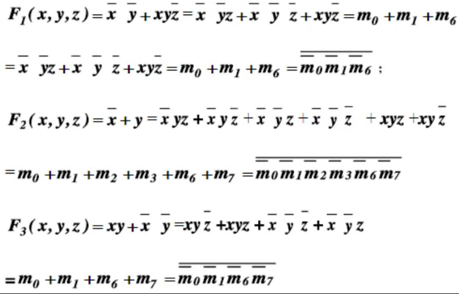
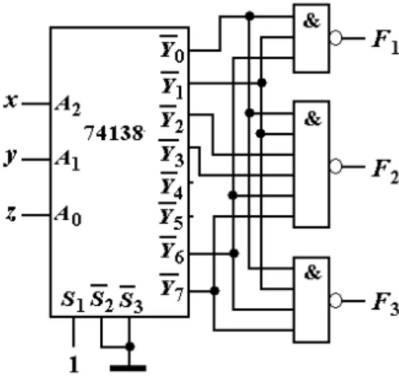
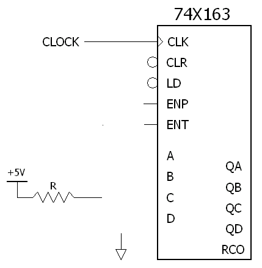

# 数字逻辑作业

1.

2.函数f(A,B,C,D)=AB+AB否 可以简化为f(A,B)=A,因为无论B的值如何,只要A为1,函

数值就为1。

要使用74153实现这个函数,可以将A和B分别连接到选择输入SO和S1,然后将使能端G接高电平(1)。数据输入D0-D3可以设置为:

· D0=0(当SOS1=00时,输出为0)

·D1=0(当SOS1=01时,输出为0)

· D2=1(当SOS1=10时,输出为1)

· D3=1(当S0S1=11时,输出为1)

这样,无论A和B的组合如何,只要A为1,输出Y就会为1,满足函数f(A,B)=A的要求。

3.列出函数L=AB+BC+AC 的真值表：

| A | B | C | L |
|---|---|---|---|
| 0 | 0 | 0 | 0 |
| 0 | 0 | 1 | 0 |
| 0 | 1 | 0 | 0 |
| 0 | 1 | 1 | 1 |
| 1 | 0 | 0 | 0 |
| 1 | 0 | 1 | 1 |
| 1 | 1 | 0 | 1 |
| 1 | 1 | 1 | 1 |

接下来，将这些值分配给74151的数据输入D0-D7。选择输入S0-S2对应于A、B和C的值。

D0 = 0 （当S0S1S2 = 000时，输出为0）

D1 = 0 （当S0S1S2 = 001时，输出为0）

D2 = 0 （当S0S1S2 = 010时，输出为0）

D3 = 1 （当S0S1S2 = 011时，输出为1）

D4 = 0 （当S0S1S2 = 100时，输出为0）

D5 = 1 （当S0S1S2 = 101时，输出为1）

D6 = 1 （当S0S1S2 = 110时，输出为1）

D7 = 1 （当S0S1S2 = 111时，输出为1）

这样，无论A、B和C的组合如何，只要满足 𝐴𝐵+𝐵𝐶+𝐴𝐶AB+BC+AC 的条件，输出Y就会为1

4.

5. 设计一个奇偶校验器

可以使用XOR门来实现这个功能。

奇数校验器设计：

将所有输入位连接到一个XOR门的输入端。

XOR门的输出将是1，如果输入位中1的个数是奇数；输出将是0，如果输入位中1的个数是偶数。

偶数校验器设计：

在奇数校验器的基础上，添加一个NOT门。

将XOR门的输出连接到NOT门的输入端。

NOT门的输出将是1，如果输入位中1的个数是偶数；输出将是0，如果输入位中1的个数是奇数。

6.分别用摩尔逻辑和米里逻辑设计”101”信号检测

摩尔逻辑设计：

摩尔逻辑使用状态机来实现序列检测。对于序列”101”，可以设计一个具有三个状态的状态机：S0（初始状态），S1（检测到"1"），S2（检测到"101"）。

S0：初始状态。如果输入是1，转移到S1。

S1：如果输入是0，转移到S2；如果输入是1，保持在S1。

S2：如果输入是1，输出1并回到S0；如果输入是0，回到S1。

米里逻辑设计：

米里逻辑与摩尔逻辑类似，但输出不仅依赖于当前状态，还依赖于输入。

S0：初始状态。如果输入是1，转移到S1。

S1：如果输入是0，转移到S2；如果输入是1，保持在S1。

S2：如果输入是1，输出1并回到S0；如果输入是0，回到S1。

在米里逻辑中，输出条件可以直接在状态转移中指定，而不需要额外的输出逻辑。

7.首先，需要确定函数的最小项。

函数L=AB+BC+AC 的最小项是：

AB 对应于最小项 m5​（A=1, B=1, C=0）

BC 对应于最小项 m6​（A=0, B=1, C=1）

AC 对应于最小项 m7​（A=1, B=0, C=1）

接下来，可以设计PLA的AND阵列和OR阵列。

AND阵列：

每个AND门对应一个最小项，输入为变量A、B和C的某种组合。对于的函数，需要三个AND门，每个门对应一个最小项。

OR阵列：

OR阵列将所有AND门的输出组合起来，形成最终的输出L。

下面是PLA的简化表示：

输入  |  AND |  OR  | 输出

-------------------------

A B C  |   m5 |   m6 |   m7 | L

------------------------

0 0 0  |  0  |  0  |  0  |  0

0 0 1  |  0  |  0  |  0  |  0

0 1 0  |  0  |  0  |  0  |  0

0 1 1  |  0  |  1  |  0  |  1

1 0 0  |  0  |  0  |  1  |  1

1 0 1  |  1  |  0  |  0  |  1

1 1 0  |  1  |  0  |  0  |  1

1 1 1  |  0  |  0  |  0  |  0

根据这个真值表来配置AND阵列和OR阵列的连接。每个AND门的输出对应于一个最小项，而OR门则将这些最小项组合起来形成最终的输出。

可编程逻辑器件的特点及开发语言。

8.可编程逻辑器件（如FPGA和CPLD）具有可重构性、灵活性和并行处理能力。它们通常使用硬件描述语言（HDL）进行开发，如VHDL和Verilog。

9.

Verilog是一种硬件描述语言，用于模拟和综合数字系统。它的特点是：

行为、数据流和结构化建模。

丰富的语法，支持模块化设计。

支持并行性和同步性。

易于理解和学习。

10.

FPGA（现场可编程门阵列）的主要特点包括：

可编程性：用户可以根据需要重新配置逻辑功能。

灵活性：可以快速适应新的设计需求。

并行处理能力：可以同时执行多个操作。

低功耗：与ASIC相比，FPGA通常具有较低的功耗。

快速上市时间：由于可编程性，FPGA可以快速部署新设计。
