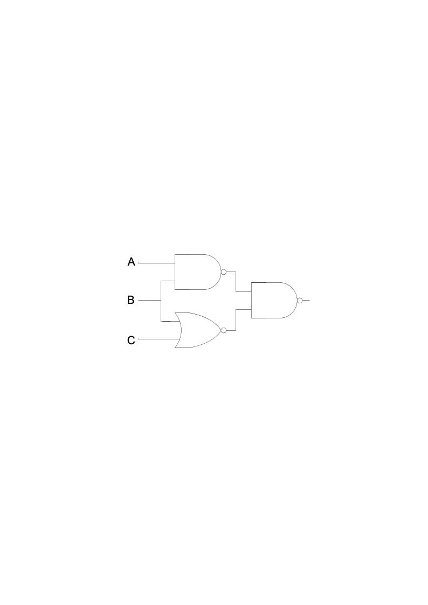
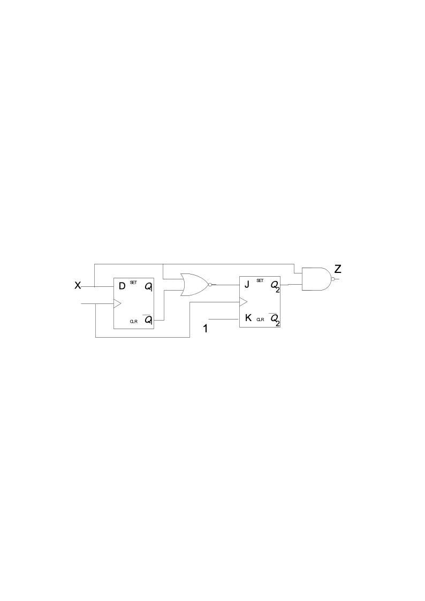
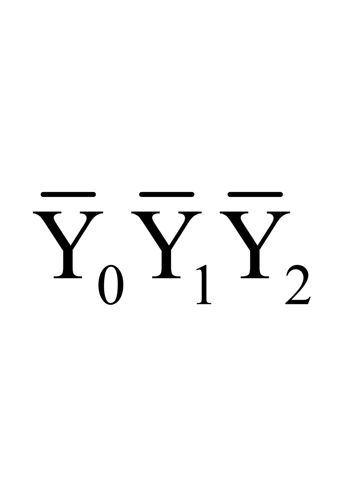
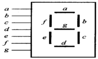
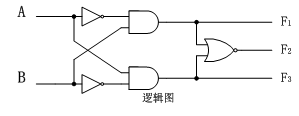
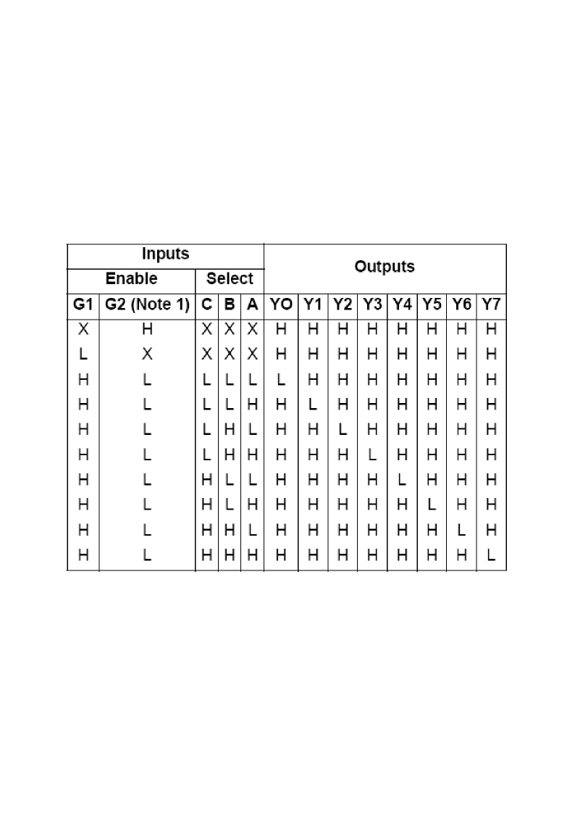
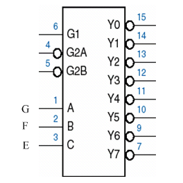
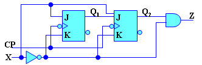

# 2012级计算机学院数字逻辑试卷 A卷题目

**诚信应考,考试作弊将带来严重后果！**

**华南理工大学期末考试**

**《2012级计算机学院数字逻辑》试卷** **A卷**

**2014年1月15日**

**注意事项：1.** **考前请将密封线内填写清楚；**

**2.** **所有答案请直接答在试卷或答题纸上；**

**3．考试形式：闭卷；**

**4.** **本试卷共  三  大题，满分100分，考试时间120分钟**。

| **题 号** | **一** | **二** | **三** | **总分** |
|---|---|---|---|---|
| **得 分** |  |  |  |  |
| **评卷人** |  |  |  |  |

**一.** **选择题，请把选项填入下列的方框内（每题2分，共20分）**

| **1** | **2** | **3** | **4** | **5** | **6** | **7** | **8** | **9** | **10** |
|---|---|---|---|---|---|---|---|---|---|
|  |  |  |  |  |  |  |  |  |  |

<!-- question: digital-logic-002-Q1 -->

1.下列逻辑表达式中正确的是（      C      ）

A.、A+A=1   B.$A\cdot A=0$    C.A+A=A   D.A+B = A

<!-- question: digital-logic-002-Q2 -->

2.逻辑表达式中$(A+1)(B+\overline {C})$的对偶式是(   B   )

A.$\overline {A}+\overline {B}\overline {C}$

B.$\hat {A}\cdot 0+\hat {B}\cdot C$

C. $\hat {A}\cdot 0+B\cdot \hat {C}$

D. $A\cdot 1+B\cdot \hat {C}$

3 .组合逻辑电路通常由（      A      ）组合而成。

A.门电路        B.触发器        C.计数器        D.寄存器

<!-- question: digital-logic-002-Q3 -->

4.八路数据选择器的接线如下图所示，该电路实现的逻辑表达式F=(   B   )

A.  $\hat {A}B+A\hat {B}$

B.  $\hat {A}B+AB$

C. $\hat {A}\hat {B}+A\hat {B}$

D. $A+B$

<!-- question: digital-logic-002-Q4 -->

5．如图所示的组合电路中，其逻辑函数F=  （     ）

A．  $\overline {AB}\cdot \overline {(B+C)}$

B.    $\sum {m}^{3}(1,2,3,5,6,7)$

C.    $\sum {m}^{3}(2,3,4,5,6,7)$

D.    以上都不对

<!-- question: digital-logic-002-Q5 -->

6.电路如下图所示，经CP脉冲作用后，${Q}^{n+1}$=(      )。

A. 1   B. 0   C.  *X*        D.  $\hat {X}$

7．8线—3线优先编码器的输入为I0-I7，当有限级别最高的I7有效时，其输出 的值是（        ）。

A.  111    B.  010    C.  000  D.  101

<!-- question: digital-logic-002-Q6 -->

8.  设计一个28进制的计数器，至少需要（      ）个触发器。

A.4      B.5       C.14       D. 28

<!-- question: digital-logic-002-Q7 -->

9. 2048*8位EPROM芯片，其地址线有（     ）条，数据线有（     ）条。

A.8, 2048   B.2048, 8    C. 8, 11     D. 11, 8

<!-- question: digital-logic-002-Q8 -->

10. FPGA指的是（      C      ）。

A.门阵列                                          B.  可编程逻辑阵列

C.现场可编程门阵列                      D.  可擦写编程的只读存储器

**二．填空题，请在空格内填入正确的内容（每题1分，共20分）**
1. 假设m13是变量A、B、C、D、E的一个最小项，用这些变量写出该最小项是       01101              。
<!-- question: digital-logic-002-Q9 -->

1. 将BCD8421码0101转换成余3码是      1000                。
<!-- question: digital-logic-002-Q10 -->

1. 时序逻辑电路任一时刻的输出状态与电路原来所处的状态            有关                。
1. 数字电路按逻辑功能的不同特点分为两大类：组合逻辑电路和              时序逻辑电路              。
1. 完整地描述一个实现逻辑电路的功能，需要3个方程，分别是：输出方程、激励方程和              次态方程              。
1. VHDL的基本组成包括3个部分，分别是：参数部分——library库 、接口部分—设计实体和        描述部分-结构体              。
1. 触发器是具有记忆功能的电路，它是                时序            逻辑电路中最基本的单元电路。
<!-- question: digital-logic-002-Q11 -->

1. 某同步时序电路有9个状态，该电路需要       4            个触发器。
<!-- question: digital-logic-002-Q12 -->

1. 只读存储器的英文缩写为ROM，这种存储器具有断电后信息仍              的特点。
1. （82）10=（             1010                        ）8421BCD。
<!-- question: digital-logic-002-Q13 -->

1. n个变量的函数的全体最小项之或恒为      1                 。
<!-- question: digital-logic-002-Q14 -->

1. 若要某共阳极数码管显示数字“3”，则显示代码abcdefg

为       1111001              （0000000~1111111）。

<!-- question: digital-logic-002-Q15 -->

1. 对于n输入端的与非门，要使输出为1，则必有一输入端取值为      0                 。
1. 74LS138是3线—8线译码器，译码为输出低电平有效，若输入为A2A1A0=110时，输出Y7Y6Y5  Y4Y3  Y2Y1  Y0应为      10111111                。
1. 三态门除了具有高电平和低电平两种状态外，还有第三种状态叫            高阻态              。
<!-- question: digital-logic-002-Q16 -->

1. 八进制的基数为     8                  。
<!-- question: digital-logic-002-Q17 -->

1. 触发器有2个稳态，分别是0态和        1            态。
<!-- question: digital-logic-002-Q18 -->

1. 一个逻辑函数，如果有k个变量，则有              个最小项。
1. 将一个包含有32768个基本存储单元的存储电路设计16位为一个字节的ROM。该ROM有11根地址线，有              根数据读出线。
<!-- question: digital-logic-002-Q19 -->

1. 存储器必须有控制线、地址线和              。

**三．分析设计题（共计60分）**
<!-- question: digital-logic-002-Q20 -->

1. （10分）逻辑电路如图所示，试写出逻辑式，并化简之，列出真值表，并说明它的逻辑功能。

<!-- question: digital-logic-002-Q21 -->

1. （10分）设计一个优先排队电路，其优先顺序为：

当E=F=G=0时，所有的灯都不亮。

当E=1时，不论F、G为何值，X灯亮，其余灯不亮。

当E=0，F=1时，不论G为何值，Y灯亮，其余灯不亮。

当E=F=0，G=1时，Z灯亮，其余灯不亮。

注：灯亮表示输出“1”，灯不亮表示输出“0”。
<!-- question: digital-logic-002-Q22 -->

1. 列出真值表。（4分）

<table>
<tr><td>输入</td><td>输出</td></tr>
<tr><td>E</td><td>F</td><td>G</td><td>X</td><td>Y</td><td>Z</td></tr>
<tr><td>0</td><td>0</td><td>0</td><td></td><td></td><td></td></tr>
<tr><td>0</td><td>0</td><td>1</td><td></td><td></td><td></td></tr>
<tr><td>0</td><td>1</td><td>0</td><td></td><td></td><td></td></tr>
<tr><td>0</td><td>1</td><td>1</td><td></td><td></td><td></td></tr>
<tr><td>1</td><td>0</td><td>0</td><td></td><td></td><td></td></tr>
<tr><td>1</td><td>0</td><td>1</td><td></td><td></td><td></td></tr>
<tr><td>1</td><td>1</td><td>0</td><td></td><td></td><td></td></tr>
<tr><td>1</td><td>1</td><td>1</td><td></td><td></td><td></td></tr>
</table>

<!-- question: digital-logic-002-Q23 -->

1. 写出输出逻辑表达式。（3分）

<!-- question: digital-logic-002-Q24 -->

（3）已知一种集成芯片的功能表如下表，试用该片芯片和若干门电路来实现上述逻辑函数，直接补全该电路图。（3分）

H=High Level，L=Low Level, X=don’t care, Note 1:  $G2=\overline {G2A}+\overline {G2B}$

<!-- question: digital-logic-002-Q25 -->

1. （12分）分析下图所示同步时序逻辑电路，作出状态转移表和状态图，说明这个电路能对何种序列进行检测？

1. （12分）设计一个奇偶校验器，数输入信号X中1的个数，如果X中1的个数为奇数，输出Z为1；若X中1的个数为偶数，则输出Z为0，画出状态图和状态表，并使用D触发器实现该电路。
<!-- question: digital-logic-002-Q26 -->

1. （6分）用一个ROM实现下列函数，请画出该ROM的阵列结构图

${F}_{1}=AB+CD;{F}_{2}=BC+\overline {A}$
<!-- question: digital-logic-002-Q27 -->

1. （10分）补全全加器的VHDL源码。

**library IEEE;**

**use IEEE.std_logic_1164.all;**

**entity full_adder is**

**port (**

**A, B, Cin:** **in std_logic**         **;**

**Cout,s: out std_logic**       **);**

**end full_adder;**

**architecture**   **add_arc of full_adder is**

**begin**

**S**                                     **;**

**Cout**                                  **;**

**end full_adder_arch;**
