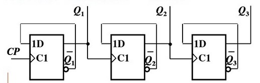
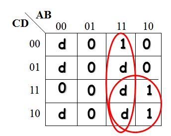
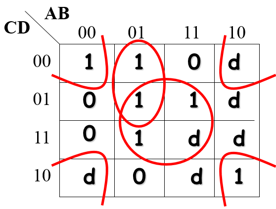
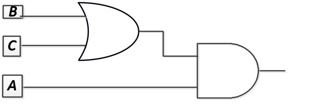

# 22a

<!-- page: 1 -->

华南理工大学大学期末考试试题（闭卷）

（2022 学年第2 学期）A 卷答案及评分标准

课程号：304051030 课序号：课程名称：数字逻辑任课教师：成绩：

适用专业年级：学生人数：印题份数：学号：姓名：

一、单项选择题（本大题共10 小题，每小题2 分，共20 分）提示：在每小题列出的四个备选项中只有

一个是符合题目要求的，请将其代码填写在题后的括号内。错选、多选或未选均无分。

1.
和逻辑函数F=A⊕( A ⊕B)的值相等的表达式是（ A）。

（A）B（B）A（C）A⊕B（D）A' ⊙B

微信公众号：五山情报站

2.
若只有变量A、B 全为1 时输出F=0，则输入与输出的关系是（C）。

（A）异或（B）同或（C）与非（D）或非

3.
所有的布尔表达式都可以由什么来实现?（D）

（A）只用与非门（B）只用或非门

（C）与门、或门和反相器的组合（D）上述的任何一种

4.
下列哪个表达式是最小项之和形式？（C）

（A）
（B）

（C）
（D）

5.
如果一个8-3 优先编码器的输入端I 0，I2，I 5，I 6都为有效电平，优先级最高的为I 7，输出

为高电平有效，则其二进制输出为：（ B）。

（A）010
（B）110
（C）101
（D）000

6.
一个8421BCD 码计数器至少需要（C）个触发器。

（A）8
（B）3
（C）4
（D）6

7.
以下触发器中（B）不能实现保持功能。

（A）JK 触发器
（B）D 触发器（C）T 触发器
（D）RS 触发器

8.
同步时序逻辑电路和异步时序逻辑电路的区别在于异步时序逻辑电路（B）。

（A）没有触发器（B）没有统一的时钟脉冲控制

（C）没有稳定状态（D）输出只与内部状态有关

9.
下列器件中，具有串行—并行数据转换功能的是（D）。

<!-- page: 2 -->

更多考试真题

请扫码获取

<!-- page: 3 -->

（A）译码器（B）数据比较器（C）计数器（D）移位寄存器

10. 异步计数器如下图所示，若触发器当前状态Q3Q2Q1为110，则在时钟作用下，计数器的下一

状态为（A）

（A）101（B）111           （C）010（D）000

ACDCB CBBDA

二、填空题（本大题共8 小题，每空2 分，共20 分）。

微信公众号：五山情报站

1.
按要求完成如下数值转换：(1011110.101 )2 = (5E.A)16 = (94.625)10

2.
时序逻辑电路在任一时刻的稳定输出不仅与当时的输入有关，而且还与_输入信号作用前面电

路所处的状态_有关。

3.
若D 触发器的D 端连在Q 端上，经100 个脉冲作用后，其次态为0，则现态为__0__。

4.
有一个左移移位寄存器，当预先置入1011 后，其串行输入固定接0，在3 个移位脉冲CP 作用

下，其状态为1000。

5.
一位二进制比较器有2 个数据输入和3 个比较结果输出。

6.
一个十六路数据选择器，其地址输入端有4 个。

7.
计数器工作时，对时钟脉冲出现的个数进行计数。

8.
对JK 触发器，若J=K，则可完成T 触发器的逻辑功能。

三、简答题（本大题共5 小题，每小题5 分，共25 分）。

1．（5 分）用卡诺图化简表达式F(A,B,C,D) = m(0,4,5,7,10,13) + d(2,8,9,11,14,15)

<!-- page: 4 -->

F(A,B,C,D) =
（图2 分，圈2 分，表达式1 分）

2．（5 分）如图电路中，写出表达式，并画出真值表，并描述功能。

微信公众号：五山情报站

解：输出函数f0=C,   f1=B⊕C,f2=A’B+ A’C+AB’C’ （2 分）

A
B
C
f2
f1
f0

0
0
0
0
0
0
0
0
1
1
1
1
0
1
0
1
1
0
0
1
1
1
0
1
1
0
0
1
0
0
1
0
1
0
1
1
1
1
0
0
1
0
1
1
1
0
0
1
(表2 分)

功能描述：ABC 与f2f1f0互为补数（以2 为基）。(1 分)

<!-- page: 5 -->

3．（5 分）用八选一数据选择器实现函数F(A,B,C,D) = m(0,4,5,8,12,13,14)，要求选用B、C、D

作为选择信号，画出逻辑图。

D0=D4=D5=1,D6=A，D1=D2=D3=D7=0（2 分）

（D0-D7 1 分，BCD 1 分， F 1 分）

4．（5 分）列出一位二进制全减器的真值表。

A
B
Ci-1
S
Ci
0
0
0
0
0
0
0
1
1
1
0
1
0
1
1
0
1
1
0
1
1
0
0
1
0
1
0
1
0
0
1
1
0
0
0
1
1
1
1
1

微信公众号：五山情报站

（输入输出1 分，每2 行1 分）

5．（5 分）完成由负边沿触发的T 触发器的时序图。

C lock

T

Q T
0

C lo ck

T

Q T

（2 个周期1 分）

四、分析题（本大题共3 小题，共35 分）。

<!-- page: 6 -->

1.
设计一个逻辑电路，判别余3 码（下表）所表示的十进制数的值是否大于6。(1)列出真值表。

(2)画出卡诺图并化简，写出最简逻辑函数表达式。(3)画出电路图。

十进制
余3 码
十进制
余3 码
0
0011
5
1000

1
0100
6
1001

2
0101
7
1010

3
0110
8
1011

4
0111
9
1100

该判别电路输入变量为余3 码，4 位二进制，设为A、B、C、D，输出函数为F，为1 表示大

于6，否则为0 。（1 分）

十进制
A
B
C
D
F

0
0
0
1
1
0

1
0
1
0
0
0

微信公众号：五山情报站

2
0
1
0
1
0

3
0
1
1
0
0

4
0
1
1
1
0

5
1
0
0
0
0

6
1
0
0
1
0

7
1
0
1
0
1

8
1
0
1
1
1

9
1
1
0
0
1

其余
d

（2 分）
F=∑m(10,11,12)+∑d(0,1,2,13,14,15) （2 分）
卡诺图（2 分）

化简得： F= AC+AB=A(B+C)。（2 分）

（2 分）

<!-- page: 7 -->

2.
（12 分）电路输入为A,B,C,输出为F，波形图如图所示，设计满足波形图的逻辑电路。要求：

(1)列出真值表并写出逻辑方程；(2)用与非门和非门实现；(3)用74LS138 实现。

F=（A，B，C）=∑

(4,5,7)（4 分）

m

微信公众号：五山情报站

F=AB+AC=A B∙AC=（2 分）

（图2 分）

<!-- page: 8 -->

（ABC 接对1 分，EN1 分，F2 分）

3.
（12 分）分析下图所示的时序电路的逻辑功能，写出电路的激励方程、状态方程和输出方程，

列出状态表，画出电路的状态转换图，并说明该电路是否能自启动。

微信公众号：五山情报站

n
Q
D
3
1 
n
Q
D
1
2 
n
n
Q
Q
D
2
1
3



激励方程：
；
；
(1 分)

n
n
Q
Q
Y
3
1 


输出方程：
(1 分)

n
n
Q
Q
3
1
1


n
n
Q
Q
1
1
2


n
n
n
Q
Q
Q
2
1
1
3




状态方程：
；
；
(3 分)

n
Q3

n
Q2

n
Q1

1
3

n
Q
1
2

n
Q
1
1

n
Q

CP
 Y

1
 0   0   0
 0    0    1      1

2
 0   0   1
 0    1    1      1

3
 0   1   0
 0    0    1      0

4
 0   1   1
 1    1    1      1

5
 1   0   0
 0    0    0      0

6
 1   0   1
 0    1    0      0

7
 1   1   0
 0    0    0      0

8
 1   1   1
 1    1    0      1

<!-- page: 9 -->

(表2 分图3 分)

100
010
101

/1

/1

000
001

Q3 Q2 Q1/Y

/0

011
111
110

/1
/1

电路具有自启功能。(2 分)

微信公众号：五山情报站

