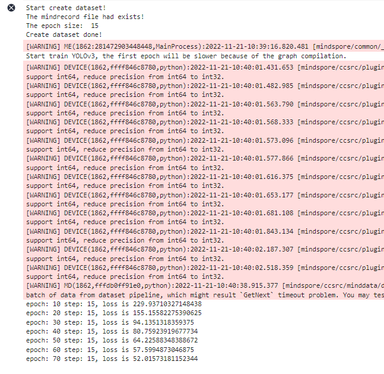
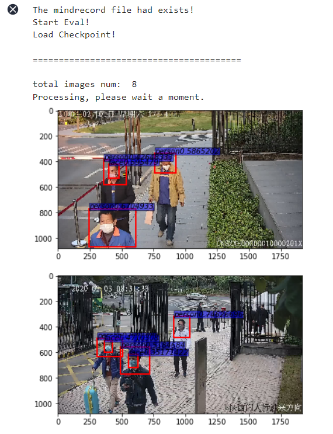
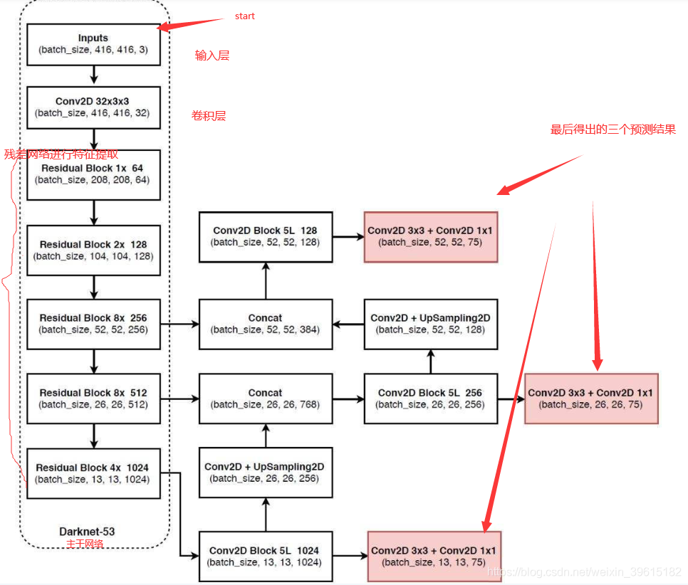

# Mindspore口罩检测（yolov3）

**Mindspore口罩检测（yolov3）**

**1.文件组织结构**

进入华为云ModelArts平台，点击开发环境-notebook后创建，镜像类别选择tensorflow1.15-mindspore1.3.0。等待创建完成后打开该notebook，进入JupyterLab，在左上角菜单栏，新建、上传代码文件和数据集，最终目录结构如下

| JSON    ├──code      ├──src         ├──config.py          ├──dataset.py          ├──utils.py          ├──yolov3.py      ├──main.ipynb      ├──data         ├──train    # 训练数据集.             ├──jpg        # 训练集图片             ├──xml        # 训练集标签         ├──test      # 测试数据集                          ├──jpg         # 测试集图片 |
|---|

文件下载见附录1

**2.相关代码文件**

**2.1 dataset.py**

数据预处理文件在code/src/dataset.py，无需执行。

数据预处理包括：
- 原始数据格式整理，将原始图片和xml标签处理为mindrecord格式；
- mindrecord格式数据处理，将mindrecord格式的原始数据处理为网络需要的数据特征。即使用MindDataset创建YOLOv3数据（dataset.py / create_yolo_dataset）

**2.2 yolov3.py(具体网络结构见附录与参考资料)**

为了让模型简单，我们选用ResNet-18作为我们的主干网络，定义文件在code/src/yolov3.py，无需执行。
- 定义ResNet18主干网络
- 定义YOLOv3网络
- 定义检测网络-DetectionBlock
- 定义IoU
- 定义loss计算-YoloLossBlock
- YOLOv3验证网络结构-YoloWithEval

**2.3 utils.py**

评价指标定义文件在code/src/utils.py，无需执行。

非极大值抑制NMS算法：

由于滑动窗口，同一个class可能有好几个框(每一个框都带有一个分类器得分)，我们的目的就是要去除冗余的检测框，保留最好的一个。于是我们就要用到非极大值抑制，来抑制那些冗余的框： 抑制的过程是一个迭代-遍历-消除的过程。
- 将person类别所有框的得分排序，选中最高分及其对应的框A：
- 遍历其余的框，如果和当前最高分框A的重叠面积(IOU)大于一定阈值，我们就将框删除。
- 从剩下的person类别框中继续选一个得分最高的（非A，A已经确定），重复上述过程，指导找到所有满足与之的person类别框。
- 重复上述过程，找到所有满足条件的facce类别框和mask类别框。

**2.4 config.py**

通过定义一个类  ConfigYOLOV3ResNet18来定义所有超参数。

**3.项目执行文件main.py**

目标检测项目的执行文件为code/main.ipynb，里面包含四个框架，分别为训练网络定义与训练、测试网络的定义与测试。

**3.1训练网络**

环境的导入

| JSON  import os import argparse import ast from easydict import EasyDict as edict import shutil   import numpy as np import mindspore.nn as nn from mindspore import context, Tensor from mindspore.communication.management import init from mindspore.train.callback import CheckpointConfig, ModelCheckpoint, LossMonitor, TimeMonitor from mindspore.train import Model from mindspore.context import ParallelMode from mindspore.train.serialization import load_checkpoint, load_param_into_net from mindspore.common.initializer import initializer from mindspore.common import set_seed   import sys sys.path.insert(0,'./yolov3/yolov3_resnet18/')      #yours code path #sys.path.insert(0,'./yolov3/code/') from src.yolov3 import yolov3_resnet18, YoloWithLossCell, TrainingWrapper from src.dataset import create_yolo_dataset, data_to_mindrecord_byte_image from src.config import ConfigYOLOV3ResNet18   import moxing as mox      set_seed(1) |
|---|

执行训练函数的定义

| JSON  # 定义学习率 def get_lr(learning_rate, start_step, global_step, decay_step, decay_rate, steps=False):     """Set learning rate."""     lr_each_step = []     for i in range(global_step):         if steps:             lr_each_step.append(learning_rate * (decay_rate ** (i // decay_step)))         else:             lr_each_step.append(learning_rate * (decay_rate ** (i / decay_step)))     lr_each_step = np.array(lr_each_step).astype(np.float32)     lr_each_step = lr_each_step[start_step:]     return lr_each_step  # 定义网络初始化参数 def init_net_param(network, init_value='ones'):     """Init the parameters in network."""     params = network.trainable_params()     for p in params:         if isinstance(p.data, Tensor) and 'beta' not in p.name and 'gamma' not in p.name and 'bias' not in p.name:             p.set_data(initializer(init_value, p.data.shape, p.data.dtype))  # 定义训练网络 def main(args_opt):     context.set_context(mode=context.GRAPH_MODE, device_target="Ascend", device_id=args_opt.device_id)     if args_opt.distribute:         device_num = args_opt.device_num         context.reset_auto_parallel_context()         context.set_auto_parallel_context(parallel_mode=ParallelMode.DATA_PARALLEL, gradients_mean=True,                                           device_num=device_num)         init()         rank = args_opt.device_id % device_num     else:         rank = 0         device_num = 1      loss_scale = float(args_opt.loss_scale)          # When create MindDataset, using the fitst mindrecord file, such as yolo.mindrecord0.     dataset = create_yolo_dataset(args_opt.mindrecord_file,     #利用mindrecord格式文件创建yolo格式的数据集                                   batch_size=args_opt.batch_size, device_num=device_num, rank=rank)     dataset_size = dataset.get_dataset_size()     print('The epoch size: ', dataset_size)     print("Create dataset done!")      net = yolov3_resnet18(ConfigYOLOV3ResNet18())     net = YoloWithLossCell(net, ConfigYOLOV3ResNet18())     #声明由ResNet-18作为主干网络的yolov3网络     init_net_param(net, "XavierUniform")     #初始化网络参数      # checkpoint     ckpt_config = CheckpointConfig(save_checkpoint_steps=dataset_size * args_opt.save_checkpoint_epochs,                                   keep_checkpoint_max=args_opt.keep_checkpoint_max)     ckpoint_cb = ModelCheckpoint(prefix="yolov3", directory=cfg.ckpt_dir, config=ckpt_config)   #保存训练网络结构与权重参数      if args_opt.pre_trained:         if args_opt.pre_trained_epoch_size <= 0:             raise KeyError("pre_trained_epoch_size must be greater than 0.")         param_dict = load_checkpoint(args_opt.pre_trained)         load_param_into_net(net, param_dict)     total_epoch_size = args_opt.epoch_size     if args_opt.distribute:         total_epoch_size = 160     lr = Tensor(get_lr(learning_rate=args_opt.lr, start_step=args_opt.pre_trained_epoch_size * dataset_size,                        global_step=total_epoch_size * dataset_size,                        decay_step=1000, decay_rate=0.95, steps=True))     opt = nn.Adam(filter(lambda x: x.requires_grad, net.get_parameters()), lr, loss_scale=loss_scale)  #定义优化器     net = TrainingWrapper(net, opt, loss_scale)          callback = [LossMonitor(10*dataset_size), ckpoint_cb]     model = Model(net)     dataset_sink_mode = cfg.dataset_sink_mode     print("Start train YOLOv3, the first epoch will be slower because of the graph compilation.")          model.train(args_opt.epoch_size, dataset, callbacks=callback, dataset_sink_mode=dataset_sink_mode)  #开始训练 |
|---|

开始训练

| JSON  # ------------yolov3 train ----------------------------- #初始化超参数 cfg = edict({     "distribute": False,     "device_id": 0,     "device_num": 1,     "dataset_sink_mode": True,      "lr": 0.001,     "epoch_size": 60,     "batch_size": 32,     "loss_scale" : 1024,      "pre_trained": None,     "pre_trained_epoch_size":0,      "ckpt_dir": "./ckpt",     "save_checkpoint_epochs" :1,     'keep_checkpoint_max': 1,      "data_url": 'obs://bucket-lim/口罩检测/data/train/', #     "train_url": 's3://yyq-2/DATA/code/yolov3/yolov3_out/', })  #设置模型和数据集路径 if os.path.exists(cfg.ckpt_dir):     shutil.rmtree(cfg.ckpt_dir) data_path = './data/'  if not os.path.exists(data_path):     mox.file.copy_parallel(src_url=cfg.data_url, dst_url=data_path)  mindrecord_dir_train = os.path.join(data_path,'mindrecord/train')  print("Start create dataset!") # 调用data_to_mindrecord_byte_image将图片数据集转为mingrecord格式，创建mindrecord文件 prefix = "yolo.mindrecord" cfg.mindrecord_file = os.path.join(mindrecord_dir_train, prefix) if os.path.exists(mindrecord_dir_train+'/'+prefix):#!!!!     print('The mindrecord file had exists!') else:     image_dir = os.path.join(data_path, "train") #!!!!     if not os.path.exists(mindrecord_dir_train):         os.makedirs(mindrecord_dir_train)     print("Create Mindrecord.")     data_to_mindrecord_byte_image(image_dir, mindrecord_dir_train, prefix, 1)     print("Create Mindrecord Done, at {}".format(mindrecord_dir_train))     # if you need use mindrecord file next time, you can save them to yours obs.     #mox.file.copy_parallel(src_url=args_opt.mindrecord_dir_train, dst_url=os.path.join(cfg.data_url,'mindspore/train')  main(cfg)  # mox.file.copy_parallel(src_url=cfg.ckpt_dir, dst_url=cfg.train_url) |
|---|

数据集训练结果（warning消息可以忽略），可以自行设置epoch参数

并在当前目录下生成ckpt文件夹，里面保存有训练模型文件yolov3-70_15.ckpt。

**3.2 测试网络**

测试网络函数的定义

| JSON  """Test for yolov3-resnet18""" import os import argparse import time from easydict import EasyDict as edict  import matplotlib.pyplot as plt from PIL import Image import PIL import numpy as np  import sys #sys.path.insert(0,'./yolov3/code/') sys.path.insert(0,'./')                   # yours code path import moxing as mox from mindspore import context, Tensor from mindspore.train.serialization import load_checkpoint, load_param_into_net from src.yolov3 import yolov3_resnet18, YoloWithEval from src.dataset import create_yolo_dataset, data_to_mindrecord_byte_image   #使用MindDataset创建YOLOv3数据（dataset.py / create_yolo_dataset） from src.config import ConfigYOLOV3ResNet18 from src.utils import metrics  #训练过程中在每个网络中的产生多个预测框，应用nms算法，选择iou得分最高 的预测框作为输出，与该输出重叠的部分去掉，重复直到所有备选处理完毕 def apply_nms(all_boxes, all_scores, thres, max_boxes):     """Apply NMS to bboxes."""     x1 = all_boxes[:, 0]     y1 = all_boxes[:, 1]     x2 = all_boxes[:, 2]     y2 = all_boxes[:, 3]     areas = (x2 - x1 + 1) * (y2 - y1 + 1)      order = all_scores.argsort()[::-1]     keep = []      while order.size > 0:         i = order[0]         keep.append(i)          if len(keep) >= max_boxes:             break          xx1 = np.maximum(x1[i], x1[order[1:]])         yy1 = np.maximum(y1[i], y1[order[1:]])         xx2 = np.minimum(x2[i], x2[order[1:]])         yy2 = np.minimum(y2[i], y2[order[1:]])          w = np.maximum(0.0, xx2 - xx1 + 1)         h = np.maximum(0.0, yy2 - yy1 + 1)         inter = w * h          ovr = inter / (areas[i] + areas[order[1:]] - inter)          inds = np.where(ovr <= thres)[0]          order = order[inds + 1]     return keep #计算预测框类型与得分 def tobox(boxes, box_scores):     """Calculate precision and recall of predicted bboxes."""     config = ConfigYOLOV3ResNet18()     num_classes = config.num_classes     mask = box_scores >= config.obj_threshold     boxes_ = []     scores_ = []     classes_ = []     max_boxes = config.nms_max_num     for c in range(num_classes):         class_boxes = np.reshape(boxes, [-1, 4])[np.reshape(mask[:, c], [-1])]         class_box_scores = np.reshape(box_scores[:, c], [-1])[np.reshape(mask[:, c], [-1])]         nms_index = apply_nms(class_boxes, class_box_scores, config.nms_threshold, max_boxes)         #nms_index = apply_nms(class_boxes, class_box_scores, 0.5, max_boxes)         class_boxes = class_boxes[nms_index]         class_box_scores = class_box_scores[nms_index]         classes = np.ones_like(class_box_scores, 'int32') * c         boxes_.append(class_boxes)         scores_.append(class_box_scores)         classes_.append(classes)      boxes = np.concatenate(boxes_, axis=0)     classes = np.concatenate(classes_, axis=0)     scores = np.concatenate(scores_, axis=0)      return boxes, classes, scores #加载训练模型并利用验证网络YoloWithEval进行验证 def yolo_eval(cfg):     """Yolov3 evaluation."""     ds = create_yolo_dataset(cfg.mindrecord_file, batch_size=1, is_training=False)     config = ConfigYOLOV3ResNet18()     net = yolov3_resnet18(config)     eval_net = YoloWithEval(net, config)     print("Load Checkpoint!")     param_dict = load_checkpoint(cfg.ckpt_path)     load_param_into_net(net, param_dict)      eval_net.set_train(False)     i = 1.     total = ds.get_dataset_size()     start = time.time()     pred_data = []     print("\n========================================\n")     print("total images num: ", total)     print("Processing, please wait a moment.")          num_class={0:'person', 1: 'face', 2:'mask'}     for data in ds.create_dict_iterator(output_numpy=True):         img_np = data['image']         image_shape = data['image_shape']         #print(image_shape)         annotation = data['annotation']         image_file = data['file']         image_file = image_file.tostring().decode('ascii')                  eval_net.set_train(False)         output = eval_net(Tensor(img_np), Tensor(image_shape))         for batch_idx in range(img_np.shape[0]):             boxes = output[0].asnumpy()[batch_idx]             box_scores = output[1].asnumpy()[batch_idx]             image = img_np[batch_idx,...]             boxes, classes, scores =tobox(boxes, box_scores)             #print(classes)             #print(scores)             fig = plt.figure()   #相当于创建画板             ax = fig.add_subplot(1,1,1)   #创建子图，相当于在画板中添加一个画纸，当然可创建多个画纸，具体由其中参数而定             image_path = os.path.join(cfg.image_dir, image_file)             f = Image.open(image_path)              img_np = np.asarray(f ,dtype=np.float32)  #H，W，C格式              ax.imshow(img_np.astype(np.uint8))  #当前画纸中画一个图片                  for box_index in range(boxes.shape[0]):                 ymin=boxes[box_index][0]                 xmin=boxes[box_index][1]                 ymax=boxes[box_index][2]                 xmax=boxes[box_index][3]                 #print(xmin,ymin,xmax,ymax)                 #添加方框，(xmin,ymin)表示左顶点坐标，(xmax-xmin),(ymax-ymin)表示方框长宽                 ax.add_patch(plt.Rectangle((xmin,ymin),(xmax-xmin),(ymax-ymin),fill=False,edgecolor='red', linewidth=2))                 #给方框加标注，xmin,ymin表示x,y坐标，其它相当于画笔属性                 ax.text(xmin,ymin,s = str(num_class[classes[box_index]])+str(scores[box_index]),                         style='italic',bbox={'facecolor': 'blue', 'alpha': 0.5, 'pad': 0})                          plt.show() |
|---|

开始测试

| JSON  # ---------------yolov3  test------------------------- context.set_context(mode=context.GRAPH_MODE, device_target="Ascend")  ckpt_path = './ckpt/' if not os.path.exists(ckpt_path):     mox.file.copy_parallel(src_url=args_opt.ckpt_url, dst_url=ckpt_path) cfg.ckpt_path = os.path.join(ckpt_path, "yolov3-20_15.ckpt") # 看一下在ckpt文件夹下，保存的文件名  data_path = './data/'  if not os.path.exists(data_path):     mox.file.copy_parallel(src_url=data_url, dst_url=data_path)  mindrecord_dir_test = os.path.join(data_path,'mindrecord/test')    prefix = "yolo.mindrecord" cfg.mindrecord_file = os.path.join(mindrecord_dir_test, prefix) cfg.image_dir = os.path.join(data_path, "test") #!!!! if os.path.exists(mindrecord_dir_test+'/'+prefix): #!!!!     print('The mindrecord file had exists!') else:     if not os.path.isdir(mindrecord_dir_test):         os.makedirs(mindrecord_dir_test)     prefix = "yolo.mindrecord"     cfg.mindrecord_file = os.path.join(mindrecord_dir_test, prefix)     print("Create Mindrecord.")     data_to_mindrecord_byte_image(cfg.image_dir, mindrecord_dir_test, prefix, 1)     print("Create Mindrecord Done, at {}".format(mindrecord_dir_test))     # if you need use mindrecord file next time, you can save them to yours obs.     #mox.file.copy_parallel(src_url=args_opt.mindrecord_dir_test, dst_url=os.path.join(cfg.data_url,'mindspore/test') print("Start Eval!")    yolo_eval(cfg) |
|---|

测试输出结果如下

**附录1.相关文件**

**[mask_detection.rar]**

**附录2.yolov3网络结构**

YOLOv3相比YOLOv2最大的改进点在于借鉴了SSD的多尺度判别，即在不同大小的特征图上进行预测。对于网络前几层的大尺寸特征图，可以有效地检测出小目标，对于网络最后的小尺寸特征图可以有效地检测出大目标。此外，YOLOv3的backbone选择了DarkNet53网络，网络结构更深，特征提取能力更强了。YOLOv3的网络结构如下图所示，左侧中的红色框部分为去掉输出层的DarkNet53网络：

对于YOLOv3网络结构，有以下几点需要注意的：
1. 由于网络较深，使用了残差结构。
1. DarkNet53网络用步长为2的卷积代替了池化层。
1. 所有的网络层不包含全连接层，因此，输入图像的大小也是可以调整的（有些地方看到的可能是608x608，其实是一样的），而输入图像的大小同样是最小的输出特征图的32倍。
1. YOLOv3分别在三个尺寸的特征图进行了预测，每个尺寸的特征图使用了3个锚点。因此，输出层的维度计算方法为：(4+1+80)x3=255，因此，最后一层1x1的卷积层的数量为255。
1. 13 x 13的特征图会通过上采样层和之前的26 x 26的特征图在通道维度拼接在一起，26 x 26的特征图再经过上采样和52 x 52的特征图拼接。

**参考资料**

**yolov3网络结构：**参考资料1 参考资料2

**mns算法原理与python实现：**https://blog.csdn.net/a1103688841/article/details/89711120

[实验参考资料](https://www.hiascend.com/zh/developer/courses/detail/1550050672463138817)
