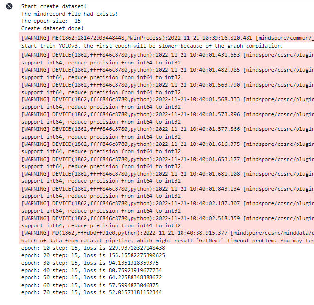
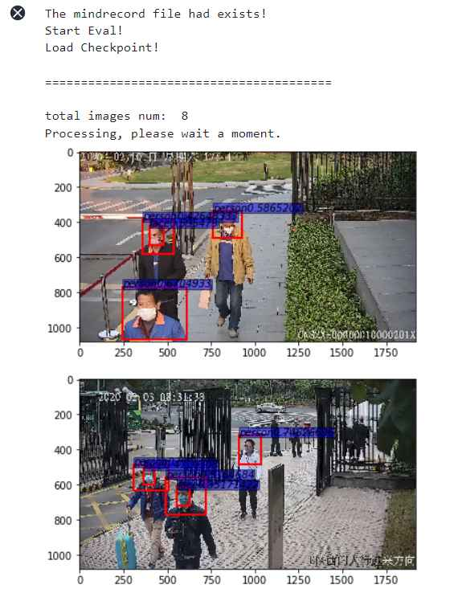
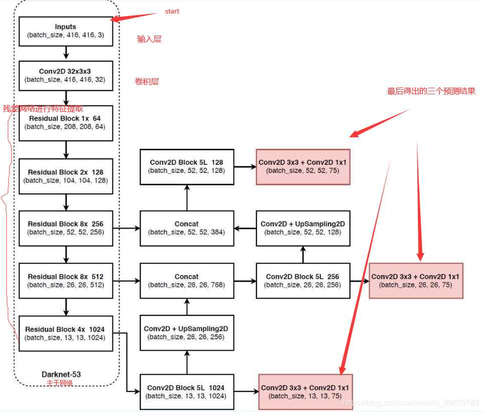

# Mindspore口罩检测（yolov3）

<!-- page: 1 -->

Mindspore口罩检测（yolov3）​

1.文件组织结构​

进入华为云ModelArts平台，点击开发环境-notebook后创建，镜像类别选择tensorflow1.15-

mindspore1.3.0。等待创建完成后打开该notebook，进入JupyterLab，在左上角菜单栏，新建、上

传代码文件和数据集，最终目录结构如下

1

 ├──code​

2

     ├──src​

3

        ├──config.py ​

4

        ├──dataset.py ​

5

        ├──utils.py ​

6

        ├──yolov3.py ​

7

    ├──main.ipynb ​

8

    ├──data​

9

        ├──train    # 训练数据集.​

10

            ├──jpg        # 训练集图片​

11

            ├──xml        # 训练集标签​

12

        ├──test      # 测试数据集​

13

            ├──jpg         # 测试集图片​

文件下载见附录1​

2.相关代码文件​

2.1 dataset.py​

数据预处理文件在code/src/dataset.py ，无需执行。

数据预处理包括：

• 原始数据格式整理，将原始图片和xml标签处理为mindrecord格式；​

• mindrecord格式数据处理，将mindrecord格式的原始数据处理为网络需要的数据特征。即使用

MindDataset创建YOLOv3数据（dataset.py / create_yolo_dataset）​

2.2 yolov3.py(具体网络结构见附录与参考资料)​

为了让模型简单，我们选用ResNet-18 作为我们的主干网络，定义文件在

code/src/yolov3.py ，无需执行。

<!-- page: 2 -->

• 定义ResNet18主干网络​

• 定义YOLOv3网络​

• 定义检测网络-DetectionBlock​

• 定义IoU​

• 定义loss计算-YoloLossBlock​

• YOLOv3验证网络结构-YoloWithEval​

2.3 utils.py​

评价指标定义文件在code/src/utils.py ，无需执行。

非极大值抑制NMS算法：​

由于滑动窗口，同一个class可能有好几个框(每一个框都带有一个分类器得分)，我们的目的就是要去

除冗余的检测框，保留最好的一个。于是我们就要用到非极大值抑制，来抑制那些冗余的框： 抑制的

过程是一个迭代-遍历-消除的过程。​

• 将person类别所有框的得分排序，选中最高分及其对应的框A：​

• 遍历其余的框，如果和当前最高分框A的重叠面积(IOU)大于一定阈值，我们就将框删除。​

• 从剩下的person类别框中继续选一个得分最高的（非A，A已经确定），重复上述过程，指导找到

所有满足与之的person类别框。​

• 重复上述过程，找到所有满足条件的facce类别框和mask类别框。​

2.4 config.py​

通过定义一个类 ConfigYOLOV3ResNet18 来定义所有超参数。​

3.项目执行文件main.py​

目标检测项目的执行文件为code/main.ipynb ，里面包含四个框架，分别为训练网络定义与训

练、测试网络的定义与测试。

3.1训练网络​

环境的导入

1

import os

2

import argparse

3

import ast

4

from easydict import EasyDict as edict

5

import shutil

<!-- page: 3 -->

6

7

import numpy as np

8

import mindspore.nn as nn

9

from mindspore import context, Tensor

10

from mindspore.communication.management import init

11

from mindspore.train.callback import CheckpointConfig, ModelCheckpoint, LossMoni

12

from mindspore.train import Model

13

from mindspore.context import ParallelMode

14

from mindspore.train.serialization import load_checkpoint, load_param_into_net

15

from mindspore.common.initializer import initializer

16

from mindspore.common import set_seed

17

18

import sys

19

sys.path.insert(0,'./yolov3/yolov3_resnet18/')      #yours code path

20

#sys.path.insert(0,'./yolov3/code/')

21

from src.yolov3 import yolov3_resnet18, YoloWithLossCell, TrainingWrapper

22

from src.dataset import create_yolo_dataset, data_to_mindrecord_byte_image

23

from src.config import ConfigYOLOV3ResNet18

24

25

import moxing as mox

26

27

set_seed(1)

执行训练函数的定义

1

# 定义学习率

2

def get_lr(learning_rate, start_step, global_step, decay_step, decay_rate, steps

3

   """Set learning rate."""

4

   lr_each_step = []

5

   for i in range(global_step):

6

       if steps:

7

           lr_each_step.append(learning_rate * (decay_rate ** (i // decay_step)

8

       else:

9

           lr_each_step.append(learning_rate * (decay_rate ** (i / decay_step))

10

   lr_each_step = np.array(lr_each_step).astype(np.float32)

11

   lr_each_step = lr_each_step[start_step:]

12

   return lr_each_step

13

14

# 定义网络初始化参数

15

def init_net_param(network, init_value='ones'):

16

   """Init the parameters in network."""

17

   params = network.trainable_params()

18

   for p in params:

19

       if isinstance(p.data, Tensor) and 'beta' not in p.name and 'gamma' not i

20

           p.set_data(initializer(init_value, p.data.shape, p.data.dtype))

<!-- page: 4 -->

21

22

# 定义训练网络

23

def main(args_opt):

24

   context.set_context(mode=context.GRAPH_MODE, device_target="Ascend", device_

25

   if args_opt.distribute:

26

       device_num = args_opt.device_num

27

       context.reset_auto_parallel_context()

28

       context.set_auto_parallel_context(parallel_mode=ParallelMode.DATA_PARALL

29

                                         device_num=device_num)

30

       init()

31

       rank = args_opt.device_id % device_num

32

   else:

33

       rank = 0

34

       device_num = 1

35

36

   loss_scale = float(args_opt.loss_scale)

37

38

   # When create MindDataset, using the fitst mindrecord file, such as yolo.min

39

   dataset = create_yolo_dataset(args_opt.mindrecord_file,     #利用mindrecord格

40

                                 batch_size=args_opt.batch_size, device_num=dev

41

   dataset_size = dataset.get_dataset_size()

42

   print('The epoch size: ', dataset_size)

43

   print("Create dataset done!")

44

45

   net = yolov3_resnet18(ConfigYOLOV3ResNet18())

46

   net = YoloWithLossCell(net, ConfigYOLOV3ResNet18())     #声明由ResNet-18作为主

47

   init_net_param(net, "XavierUniform")     #初始化网络参数

48

49

   # checkpoint

50

   ckpt_config = CheckpointConfig(save_checkpoint_steps=dataset_size * args_opt

51

                                 keep_checkpoint_max=args_opt.keep_checkpoint_m

52

   ckpoint_cb = ModelCheckpoint(prefix="yolov3", directory=cfg.ckpt_dir, config

53

54

   if args_opt.pre_trained:

55

       if args_opt.pre_trained_epoch_size <= 0:

56

           raise KeyError("pre_trained_epoch_size must be greater than 0.")

57

       param_dict = load_checkpoint(args_opt.pre_trained)

58

       load_param_into_net(net, param_dict)

59

   total_epoch_size = args_opt.epoch_size

60

   if args_opt.distribute:

61

       total_epoch_size = 160

62

   lr = Tensor(get_lr(learning_rate=args_opt.lr, start_step=args_opt.pre_traine

63

                      global_step=total_epoch_size * dataset_size,

64

                      decay_step=1000, decay_rate=0.95, steps=True))

65

   opt = nn.Adam(filter(lambda x: x.requires_grad, net.get_parameters()), lr, l

66

   net = TrainingWrapper(net, opt, loss_scale)

67

<!-- page: 5 -->

68

   callback = [LossMonitor(10*dataset_size), ckpoint_cb]

69

   model = Model(net)

70

   dataset_sink_mode = cfg.dataset_sink_mode

71

   print("Start train YOLOv3, the first epoch will be slower because of the gra

72

   model.train(args_opt.epoch_size, dataset, callbacks=callback, dataset_sink_m

开始训练

1

# ------------yolov3 train -----------------------------

2

#初始化超参数

3

cfg = edict({

4

   "distribute": False,

5

   "device_id": 0,

6

   "device_num": 1,

7

   "dataset_sink_mode": True,

8

9

   "lr": 0.001,

10

   "epoch_size": 60,

11

   "batch_size": 32,

12

   "loss_scale" : 1024,

13

14

   "pre_trained": None,

15

   "pre_trained_epoch_size":0,

16

17

   "ckpt_dir": "./ckpt",

18

   "save_checkpoint_epochs" :1,

19

   'keep_checkpoint_max': 1,

20

21

   "data_url": 'obs://bucket-lim/口罩检测/data/train/',​

22

#     "train_url": 's3://yyq-2/DATA/code/yolov3/yolov3_out/',

23

})

24

#设置模型和数据集路径

25

if os.path.exists(cfg.ckpt_dir):

26

   shutil.rmtree(cfg.ckpt_dir)

27

data_path = './data/'

28

if not os.path.exists(data_path):

29

   mox.file.copy_parallel(src_url=cfg.data_url, dst_url=data_path)

30

31

mindrecord_dir_train = os.path.join(data_path,'mindrecord/train')

32

33

print("Start create dataset!")

34

# 调用data_to_mindrecord_byte_image将图片数据集转为mingrecord格式，创建mindrecord文件

35

prefix = "yolo.mindrecord"

36

cfg.mindrecord_file = os.path.join(mindrecord_dir_train, prefix)

37

if os.path.exists(mindrecord_dir_train+'/'+prefix):#!!!!

<!-- page: 6 -->

38

   print('The mindrecord file had exists!')

39

else:

40

   image_dir = os.path.join(data_path, "train") #!!!!

41

   if not os.path.exists(mindrecord_dir_train):

42

       os.makedirs(mindrecord_dir_train)

43

   print("Create Mindrecord.")

44

   data_to_mindrecord_byte_image(image_dir, mindrecord_dir_train, prefix, 1)

45

   print("Create Mindrecord Done, at {}".format(mindrecord_dir_train))

46

   # if you need use mindrecord file next time, you can save them to yours obs.

47

   #mox.file.copy_parallel(src_url=args_opt.mindrecord_dir_train, dst_url=os.pa

48

49

main(cfg)

50

# mox.file.copy_parallel(src_url=cfg.ckpt_dir, dst_url=cfg.train_url)

数据集训练结果（warning消息可以忽略），可以自行设置epoch参数​

并在当前目录下生成ckpt文件夹，里面保存有训练模型文件yolov3-70_15.ckpt 。​

<!-- page: 7 -->

3.2 测试网络​

测试网络函数的定义

1

"""Test for yolov3-resnet18"""

2

import os

3

import argparse

4

import time

5

from easydict import EasyDict as edict

6

7

import matplotlib.pyplot as plt

8

from PIL import Image

9

import PIL

10

import numpy as np

11

12

import sys

13

#sys.path.insert(0,'./yolov3/code/')

14

sys.path.insert(0,'./')                   # yours code path

15

import moxing as mox

16

from mindspore import context, Tensor

17

from mindspore.train.serialization import load_checkpoint, load_param_into_net

18

from src.yolov3 import yolov3_resnet18, YoloWithEval

19

from src.dataset import create_yolo_dataset, data_to_mindrecord_byte_image   #使用

20

from src.config import ConfigYOLOV3ResNet18

21

from src.utils import metrics

22

23

#训练过程中在每个网络中的产生多个预测框，应用nms算法，选择iou得分最高 的预测框作为输出，与该

24

def apply_nms(all_boxes, all_scores, thres, max_boxes):

25

   """Apply NMS to bboxes."""

26

   x1 = all_boxes[:, 0]

27

   y1 = all_boxes[:, 1]

28

   x2 = all_boxes[:, 2]

29

   y2 = all_boxes[:, 3]

30

   areas = (x2 - x1 + 1) * (y2 - y1 + 1)

31

32

   order = all_scores.argsort()[::-1]

33

   keep = []

34

35

   while order.size > 0:

36

       i = order[0]

37

       keep.append(i)

38

39

       if len(keep) >= max_boxes:

40

           break

41

42

       xx1 = np.maximum(x1[i], x1[order[1:]])

<!-- page: 8 -->

43

       yy1 = np.maximum(y1[i], y1[order[1:]])

44

       xx2 = np.minimum(x2[i], x2[order[1:]])

45

       yy2 = np.minimum(y2[i], y2[order[1:]])

46

47

       w = np.maximum(0.0, xx2 - xx1 + 1)

48

       h = np.maximum(0.0, yy2 - yy1 + 1)

49

       inter = w * h

50

51

       ovr = inter / (areas[i] + areas[order[1:]] - inter)

52

53

       inds = np.where(ovr <= thres)[0]

54

55

       order = order[inds + 1]

56

   return keep

57

#计算预测框类型与得分

58

def tobox(boxes, box_scores):

59

   """Calculate precision and recall of predicted bboxes."""

60

   config = ConfigYOLOV3ResNet18()

61

   num_classes = config.num_classes

62

   mask = box_scores >= config.obj_threshold

63

   boxes_ = []

64

   scores_ = []

65

   classes_ = []

66

   max_boxes = config.nms_max_num

67

   for c in range(num_classes):

68

       class_boxes = np.reshape(boxes, [-1, 4])[np.reshape(mask[:, c], [-1])]

69

       class_box_scores = np.reshape(box_scores[:, c], [-1])[np.reshape(mask[:,

70

       nms_index = apply_nms(class_boxes, class_box_scores, config.nms_threshol

71

       #nms_index = apply_nms(class_boxes, class_box_scores, 0.5, max_boxes)

72

       class_boxes = class_boxes[nms_index]

73

       class_box_scores = class_box_scores[nms_index]

74

       classes = np.ones_like(class_box_scores, 'int32') * c

75

       boxes_.append(class_boxes)

76

       scores_.append(class_box_scores)

77

       classes_.append(classes)

78

79

   boxes = np.concatenate(boxes_, axis=0)

80

   classes = np.concatenate(classes_, axis=0)

81

   scores = np.concatenate(scores_, axis=0)

82

83

   return boxes, classes, scores

84

#加载训练模型并利用验证网络YoloWithEval进行验证

85

def yolo_eval(cfg):

86

   """Yolov3 evaluation."""

87

   ds = create_yolo_dataset(cfg.mindrecord_file, batch_size=1, is_training=Fals

88

   config = ConfigYOLOV3ResNet18()

89

   net = yolov3_resnet18(config)

<!-- page: 9 -->

90

   eval_net = YoloWithEval(net, config)

91

   print("Load Checkpoint!")

92

   param_dict = load_checkpoint(cfg.ckpt_path)

93

   load_param_into_net(net, param_dict)

94

95

   eval_net.set_train(False)

96

   i = 1.

97

   total = ds.get_dataset_size()

98

   start = time.time()

99

   pred_data = []

100

   print("\n========================================\n")

101

   print("total images num: ", total)

102

   print("Processing, please wait a moment.")

103

104

   num_class={0:'person', 1: 'face', 2:'mask'}

105

   for data in ds.create_dict_iterator(output_numpy=True):

106

       img_np = data['image']

107

       image_shape = data['image_shape']

108

       #print(image_shape)

109

       annotation = data['annotation']

110

       image_file = data['file']

111

       image_file = image_file.tostring().decode('ascii')

112

113

       eval_net.set_train(False)

114

       output = eval_net(Tensor(img_np), Tensor(image_shape))

115

       for batch_idx in range(img_np.shape[0]):

116

           boxes = output[0].asnumpy()[batch_idx]

117

           box_scores = output[1].asnumpy()[batch_idx]

118

           image = img_np[batch_idx,...]

119

           boxes, classes, scores =tobox(boxes, box_scores)

120

           #print(classes)

121

           #print(scores)

122

           fig = plt.figure()   #相当于创建画板

123

           ax = fig.add_subplot(1,1,1)   #创建子图，相当于在画板中添加一个画纸，当然可

124

           image_path = os.path.join(cfg.image_dir, image_file)

125

           f = Image.open(image_path)

126

           img_np = np.asarray(f ,dtype=np.float32)  #H，W，C格式

127

           ax.imshow(img_np.astype(np.uint8))  #当前画纸中画一个图片

128

129

           for box_index in range(boxes.shape[0]):

130

               ymin=boxes[box_index][0]

131

               xmin=boxes[box_index][1]

132

               ymax=boxes[box_index][2]

133

               xmax=boxes[box_index][3]

134

               #print(xmin,ymin,xmax,ymax)

135

               #添加方框，(xmin,ymin)表示左顶点坐标，(xmax-xmin),(ymax-ymin)表示方框

136

               ax.add_patch(plt.Rectangle((xmin,ymin),(xmax-xmin),(ymax-ymin),f

<!-- page: 10 -->

137

               #给方框加标注，xmin,ymin表示x,y坐标，其它相当于画笔属性

138

               ax.text(xmin,ymin,s = str(num_class[classes[box_index]])+str(sco

139

                       style='italic',bbox={'facecolor': 'blue', 'alpha': 0.5,

140

           plt.show()

开始测试

1

# ---------------yolov3  test-------------------------

2

context.set_context(mode=context.GRAPH_MODE, device_target="Ascend")

3

4

ckpt_path = './ckpt/'

5

if not os.path.exists(ckpt_path):

6

   mox.file.copy_parallel(src_url=args_opt.ckpt_url, dst_url=ckpt_path)

7

cfg.ckpt_path = os.path.join(ckpt_path, "yolov3-20_15.ckpt") # 看一下在ckpt文件夹下

8

9

data_path = './data/'

10

if not os.path.exists(data_path):

11

   mox.file.copy_parallel(src_url=data_url, dst_url=data_path)

12

13

mindrecord_dir_test = os.path.join(data_path,'mindrecord/test')

14

prefix = "yolo.mindrecord"

15

cfg.mindrecord_file = os.path.join(mindrecord_dir_test, prefix)

16

cfg.image_dir = os.path.join(data_path, "test") #!!!!

17

if os.path.exists(mindrecord_dir_test+'/'+prefix): #!!!!

18

   print('The mindrecord file had exists!')

19

else:

20

   if not os.path.isdir(mindrecord_dir_test):

21

       os.makedirs(mindrecord_dir_test)

22

   prefix = "yolo.mindrecord"

23

   cfg.mindrecord_file = os.path.join(mindrecord_dir_test, prefix)

24

   print("Create Mindrecord.")

25

   data_to_mindrecord_byte_image(cfg.image_dir, mindrecord_dir_test, prefix, 1)

26

   print("Create Mindrecord Done, at {}".format(mindrecord_dir_test))

27

   # if you need use mindrecord file next time, you can save them to yours obs.

28

   #mox.file.copy_parallel(src_url=args_opt.mindrecord_dir_test, dst_url=os.pat

29

print("Start Eval!")

30

31

yolo_eval(cfg)

测试输出结果如下

<!-- page: 11 -->

附录1.相关文件​

mask_detection.rar

78.66MB

附录2.yolov3网络结构​

<!-- page: 12 -->

YOLOv3相比YOLOv2最大的改进点在于借鉴了SSD的多尺度判别，即在不同大小的特征图上进行预

测。对于网络前几层的大尺寸特征图，可以有效地检测出小目标，对于网络最后的小尺寸特征图可以

有效地检测出大目标。此外，YOLOv3的backbone选择了DarkNet53网络，网络结构更深，特征提取

能力更强了。YOLOv3的网络结构如下图所示，左侧中的红色框部分为去掉输出层的DarkNet53网络：​

对于YOLOv3网络结构，有以下几点需要注意的：​

1. 由于网络较深，使用了残差结构。

2. DarkNet53网络用步长为2的卷积代替了池化层。​

3. 所有的网络层不包含全连接层，因此，输入图像的大小也是可以调整的（有些地方看到的可能是

608x608，其实是一样的），而输入图像的大小同样是最小的输出特征图的32倍。

4. YOLOv3分别在三个尺寸的特征图进行了预测，每个尺寸的特征图使用了3个锚点。因此，输出层的

维度计算方法为：(4+1+80)x3=255，因此，最后一层1x1的卷积层的数量为255。​

5. 13 x 13的特征图会通过上采样层和之前的26 x 26的特征图在通道维度拼接在一起，26 x 26的特征

图再经过上采样和52 x 52的特征图拼接。​

<!-- page: 13 -->

参考资料

yolov3网络结构：参考资料1 参考资料2​

mns算法原理与python实现：https://blog.csdn.net/a1103688841/article/details/89711120​

实验参考资料
