# 昇腾MindSpore作业描述参考

<!-- page: 1 -->

             昇腾MindSpore 实例开发报告

1.华为昇腾AI 芯片

如今飞速发展的深度神经网络对芯片算力的需求日益严苛，为了适应算力提速及针
对深度神经网络进行特殊优化的要求，华为昇腾AI芯片的出现正是为了解决上述问题。
昇腾芯片具有强大的算力及在在硬件体系结构上对于深度神经网络进行了特殊的优化。
它的其中几个特性如下：
架构：
华为昇腾AI 芯片采用自研华为达芬奇架构。达芬奇架构基于ARM 架构，是华为自研的
面向AI 计算特征的全新计算架构，本质上是为了适应AI 领域的常见应用和算法。因
此其应用更具有针对性也更为高效。
计算单元：
计算单元是AI Core 中提供强大算力的核心单元,相当于AI Core 的主力军。AI Core 计
算单元主要包含矩阵计算单元、向量计算单元、标量计算单元和累加器。华为昇腾AI 芯
片集成丰富的计算单元，提高AI 计算完备度和效率，进而扩展该芯片的适用性。
可扩展性：
华为昇腾AI 芯片由于采用了模块化的设计,可以很方便地通过叠加模块的方法提高后
续芯片的计算力。各个模块间通过基于 CHI 协议的片上环形总线相连, 实现模块间的
数据连接通路并保证数据的共享和一致性。
2.MindSpore AI 计算框架

MindSpore 是端边云全场景按需协同的华为自研AI 计算框架，提供全场景统一API，
为全场景AI 的模型开发、模型运行、模型部署提供端到端能力。MindSpore 采用端-边
-云按需协作分布式架构、微分原生编程新范式以及AI Native 新执行模式，实现更好
的资源效率、安全可信。
特性：
开发门槛大大降低：
相比于TensorFlow、PyTorch  等流行深度学习框架，MindSpore 最大的特点就是开发
门槛大大降低，提高开发效率，这样可以显著减少模型开发时间。MindSpore 带来了简
单的开发体验，灵活的调试模式，充分发挥硬件潜能，全场景快速部署。
具体架构：
MindSpore 框架架构总体分为MindSpore 前端表示层、MindSpore 计算图引擎和
MindSpore 后端运行时三层。
· MindSpore 前端表示层（MindExpression，简称ME）
该部分包含Python API、MindSpore IR（Intermediate representation，简称IR）、
计算图高级别优化（Graph High Level Optimization，简称GHLO）三部分。
o Python API 向用户提供统一的模型训练、推理、导出接口，以及统一的数据处理、增
强、格式转换接口。
o GHLO 包含硬件无关的优化（如死代码消除等）、自动并行和自动微分等功能。

<!-- page: 2 -->

o MindSpore IR 提供统一的中间表示，MindSpore 基于此IR 进行pass 优化。
· MindSpore 计算图引擎（GraphEngine，简称GE）
该部分包含计算图低级别优化（Graph Low Level Optimization，简称GLLO）、图执行。
o GLLO 包含硬件相关的优化，以及算子融合、Buffer 融合等软硬件结合相关的深度优
化。
o 图执行提供离线图执行、分布式训练所需要的通信接口等功能。
· MindSpore 后端运行时
该部分包含云、边、端上不同环境中的高效运行环境。

3.口罩识别案例开发说明

3.1 开发环境建立

1.先按照教程创建好了自己的桶（obs）

2.建立好文件夹框架

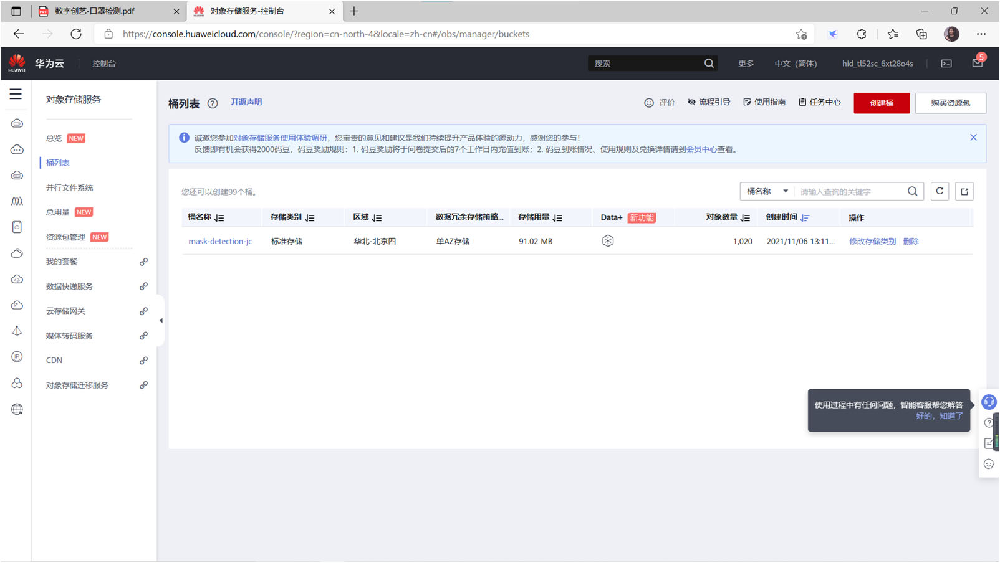

<!-- page: 3 -->

3.1.1 建立和上传数据集

1.往train 文件夹中上传训练集

2.往test 文件夹中上传测试集

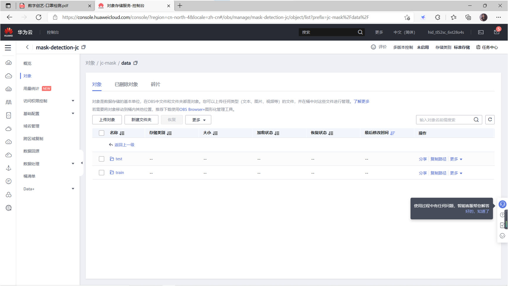

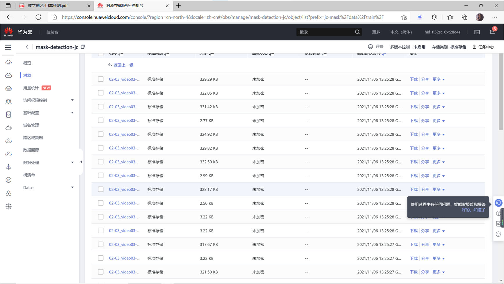

<!-- page: 4 -->

3.扩充数据集
（i）创建自己上传的一个文件夹，并上传要扩充的图片。

（ii）在Modelart 中创建数据集，并进行标注。

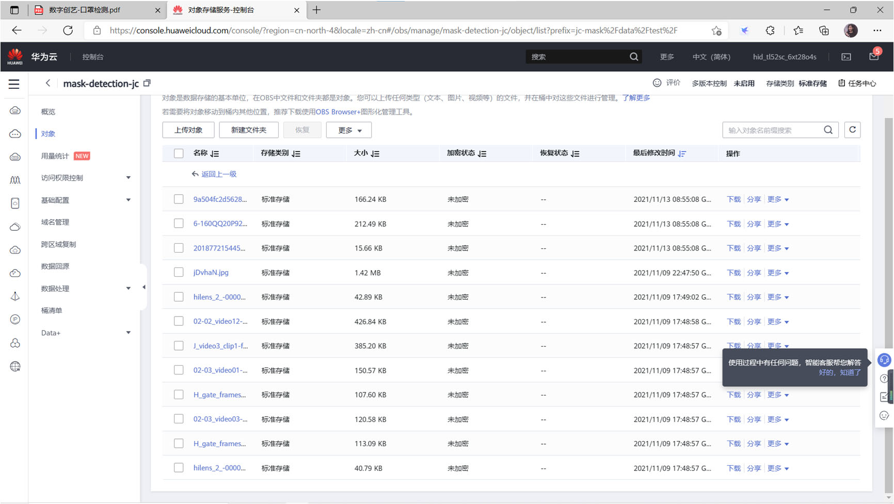

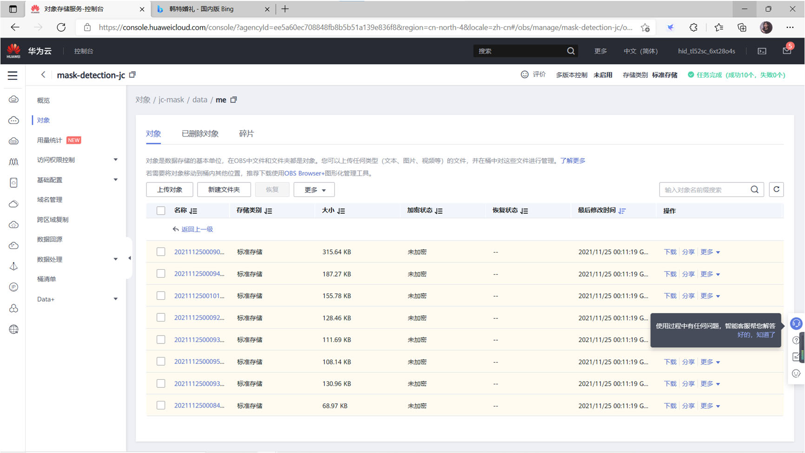

<!-- page: 5 -->

（iii）将标注数据集导出到train 中

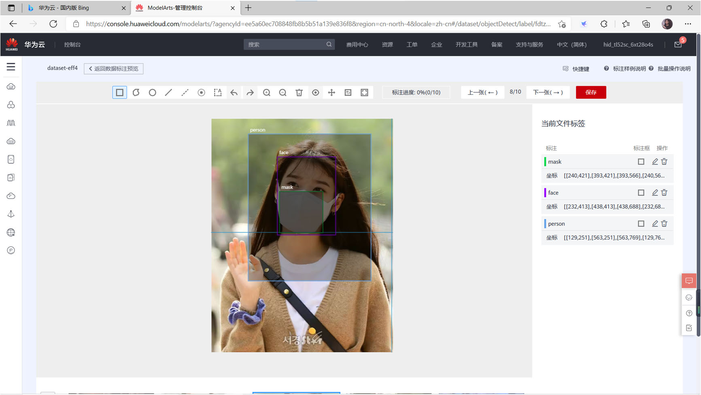

<!-- page: 6 -->

3.1.2 选择运算处理器平台

选择华为昇腾AI 处理器进行运作。

3.1.3 编辑器说明

1.创建notebook

2.上传代码文件

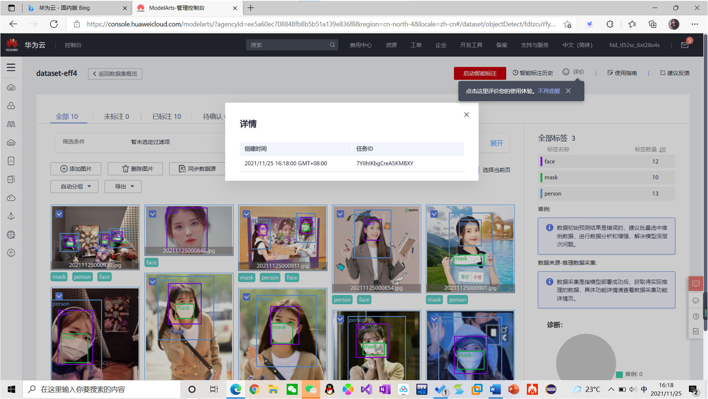

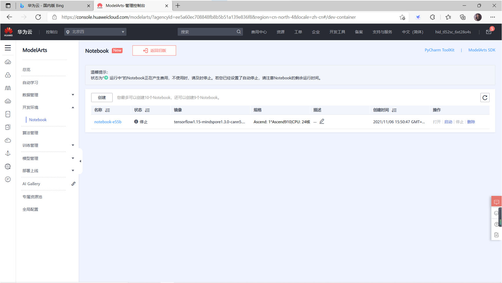

<!-- page: 7 -->

3.在代码块2 中改变data 路径

总结：在notebook 中上传代码文件十分方便，且能方便连接自己之前所创建的

桶。

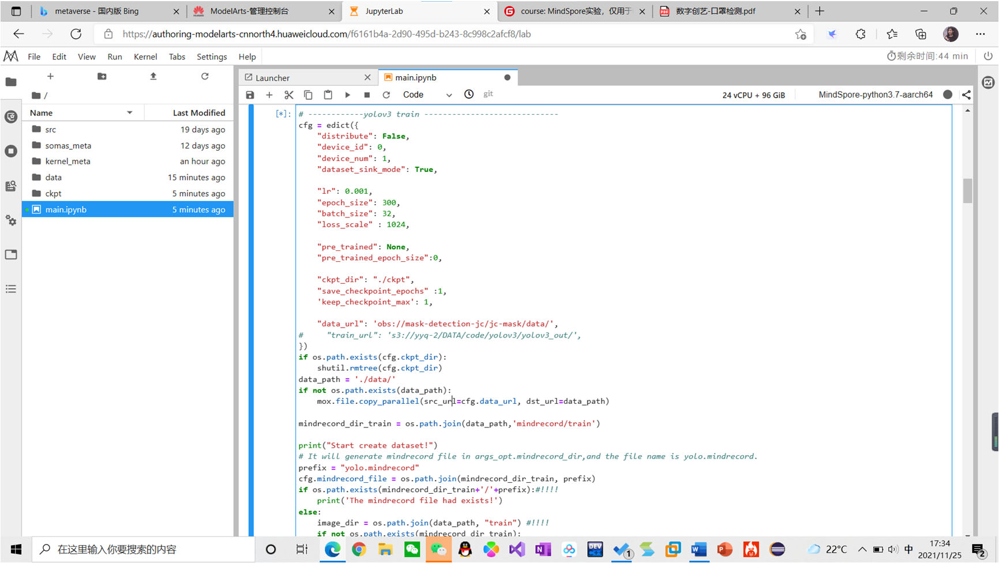

<!-- page: 8 -->

3.2 构建数据集说明

在先前数据集基础上增添自己的图片：

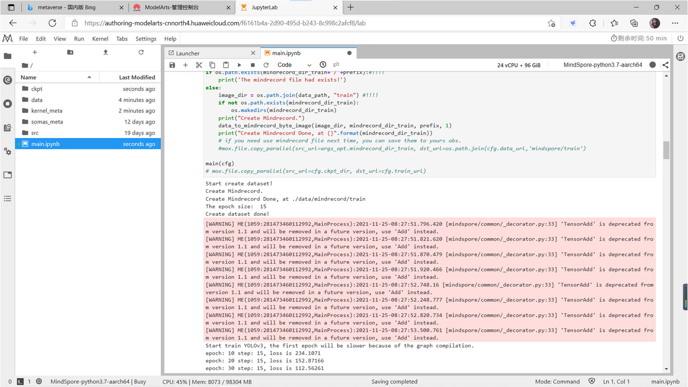

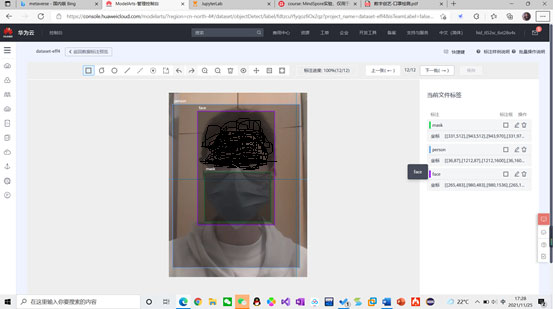

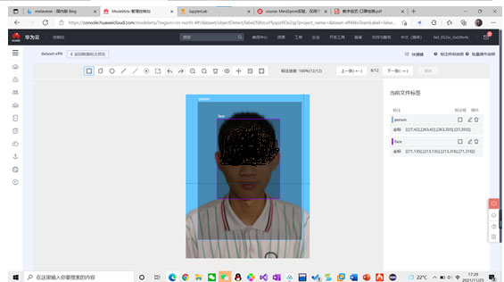

<!-- page: 9 -->

3.3 训练模型

3.3.1  训练代码说明


main.ipynb：训练和测试入口文件；


config.py：配置文件；


yolov3.py : yolov3 网络定义文件；


dataset.py: 数据预处理文件；


utils.py: 工具类文件；

3.3.2  训练过程说明

1.训练过程中loss 的变化。

可以看见，随着epoch 的增加，loss 有比较明显的下降趋势，但随着epoch 的

增大，loss 就会趋向于某个固定值，上下波动。

2.epoch_size & batch_size 的改变对运行时间的影响

观察到的现象：
epoch_size 的增加对训练时间的增加基本上是线性的，而如果调大batch_size，
则会使训练时间大大增加。
学习心得：

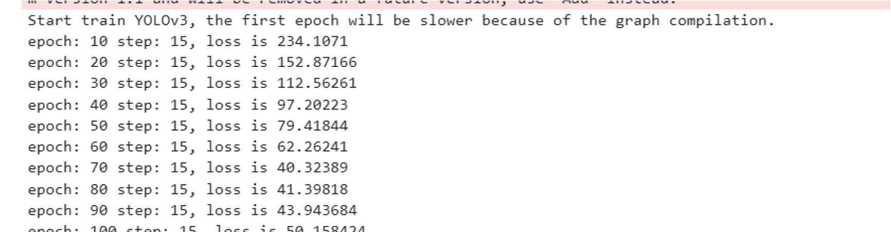

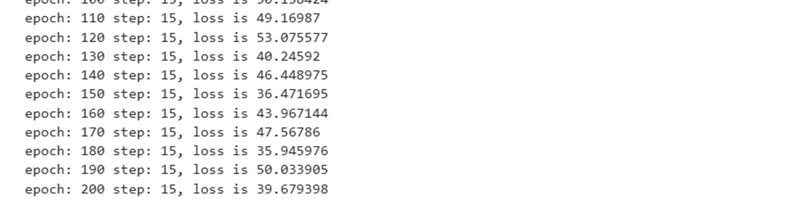

<!-- page: 10 -->

经过网上搜索资料，大致了解了epoch_size 和batch_size 的具体含义。
首先定义：
梯度下降
这是一个在机器学习中用于寻找最佳结果（曲线的最小值）的迭代优化算法。
梯度的含义是斜率或者斜坡的倾斜度。
下降的含义是代价函数的下降。
算法是迭代的，意思是需要多次使用算法获取结果，以得到最优化结果。梯度下
降的迭代性质能使欠拟合的图示演化以获得对数据的最佳拟合。
机器学习中，往往数据量非常庞大，在这种情况下，一次性将数据输入计算机是
不可能的。因此，为了解决这个问题，我们需要把数据分成小块，一块一块的传
递给计算机，在每一步的末端更新神经网络的权重，拟合给定的数据。
Batch_size 是每次喂给模型的样本数量。
batchsize 的正确选择是为了在内存效率和内存容量之间寻找最佳平衡。

适当的增加Batchsize 的优点：

1.通过并行化提高内存利用率。

2.单次epoch 的迭代次数减少，提高运行速度。（单次epoch=（全部训练样本
/batchsize） / iteration =1）

3.适当的增加Batch_Size，梯度下降方向准确度增加，训练震动的幅度减小。

Epoch_size 是训练所有样本总的次数（即每个样本被训练的次数相当于
iteration）。
  在神经网络中传递完整的数据集一次是不够的，而且我们需要将完整的数据
集在同样的神经网络中传递多次。仅仅更新权重一次或者说使用一
个 epoch 是不够的。随着 epoch 数量增加，神经网络中的权重的更新次数
也增加，曲线从欠拟合变得过拟合。
经验总结：
对于epoch_size 选择：

不幸的是，这个问题并没有正确的答案。对于不同的数据集，答案是不一样
的。但是数据的多样性会影响合适的 epoch 的数量。

可以先设定一个固定的Epoch 大小（100 轮）

一般当模型的loss 不再持续减小，且精度不在10 轮内提升，就可以提前停止
训练了。（设置条件来停止epoch）

对于batch_size 的选择:

<!-- page: 11 -->

相对于正常数据集，如果Batch_Size 过小，训练数据就会非常难收敛，从而导
致underfitting。

增大Batch_Size，相对处理速度加快。

增大Batch_Size，所需内存容量增加（epoch 的次数需要增加以达到最好结
果）。

这里我们发现上面两个矛盾的问题，因为当epoch 增加以后同样也会导致耗时
增加从而速度下降。因此我们需要寻找最好的batch_size。

3.4 测试

3.4.2 测试过程说明

按顺序跑代码3 和代码4，跑代码4 的时候要注意改ckpt 的路径。

熟悉操作后，多次改变epoch_size 和batch_size 的值，观察结果的不同。

3.4.3 测试结果说明

以下展示了我在多次调整参数的情况下测试结果

*epoch_size=60 batch_size=32

 训练效果不佳，只识别了几个人，口罩完全没能识别出来。

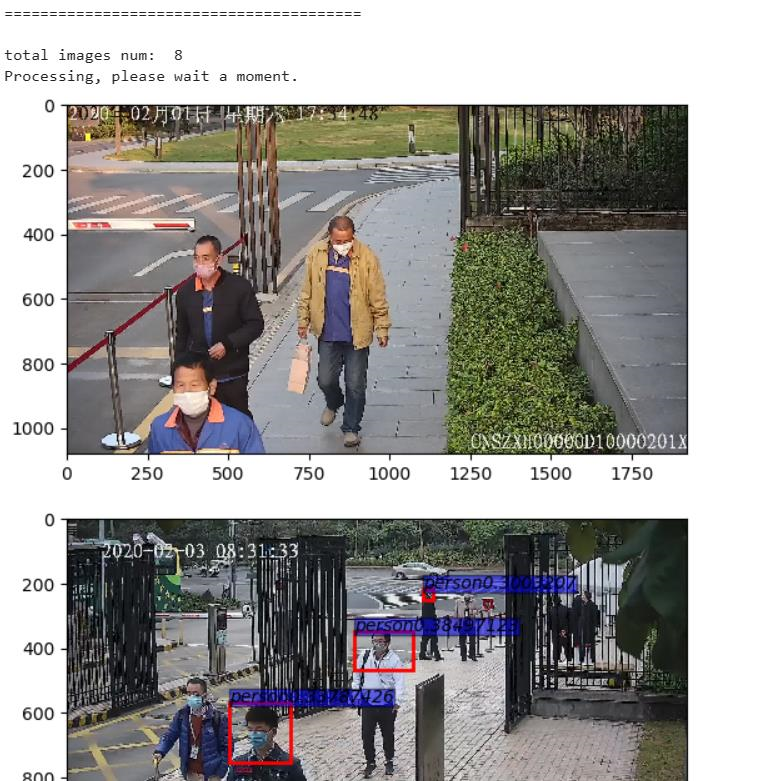

<!-- page: 12 -->

*epoch_size=100 batch_size=32

 效果比60 的好了一些，能识别出口罩，多人的也能识别出来了。

*epoch_size=100 batch_size=42

 尝试着调整了以下batch_size 的取值（后面知道了batch_size 一般取2 的幂

次），最直观的感受就是训练时间大大增长了。但效果却适得其反，仅识别出了

几个，效果远没有32 时候的好。

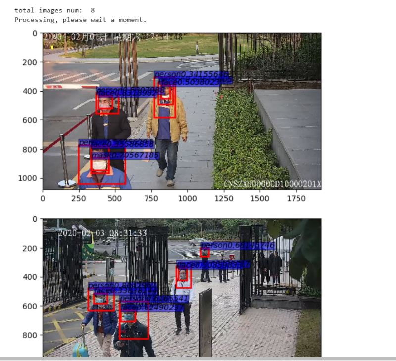

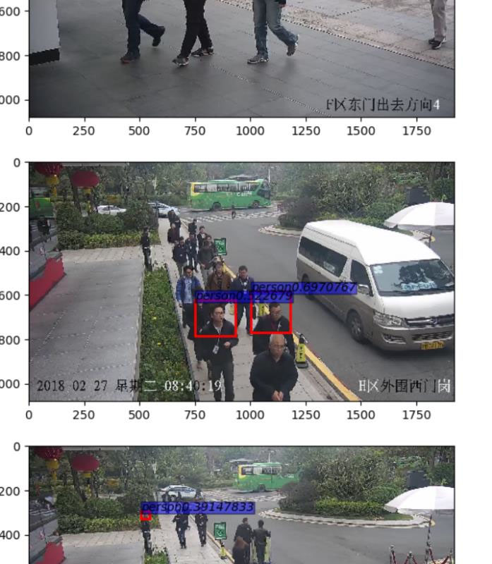

<!-- page: 13 -->

*epoch_size=200 batch_size=32

 效果非常好，多人的都识别出来了，而且识别的精确度也提升了很多。

*300 35

 效果与上面差不多，还不错。

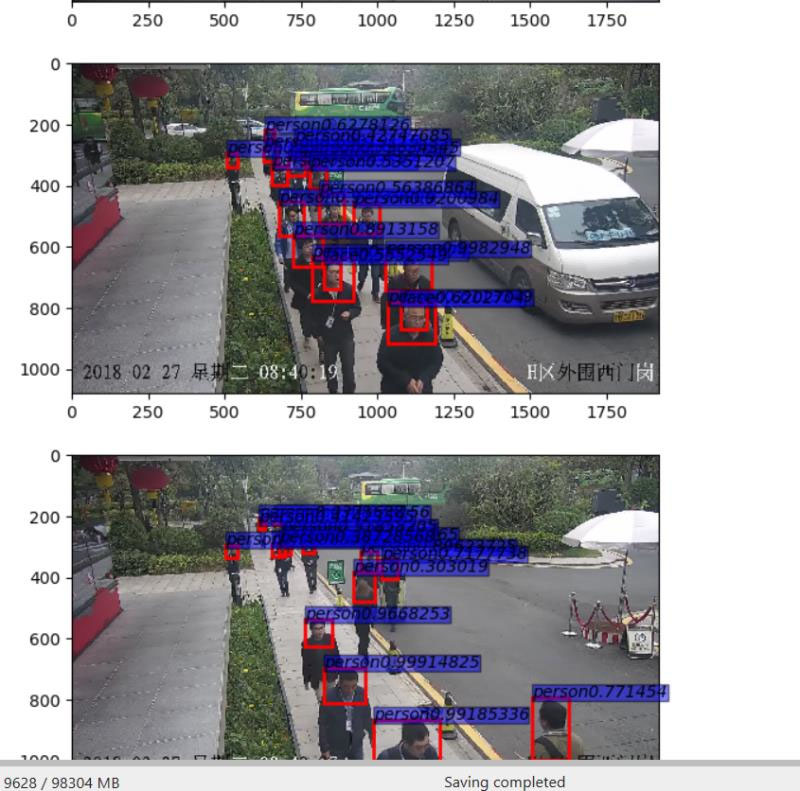

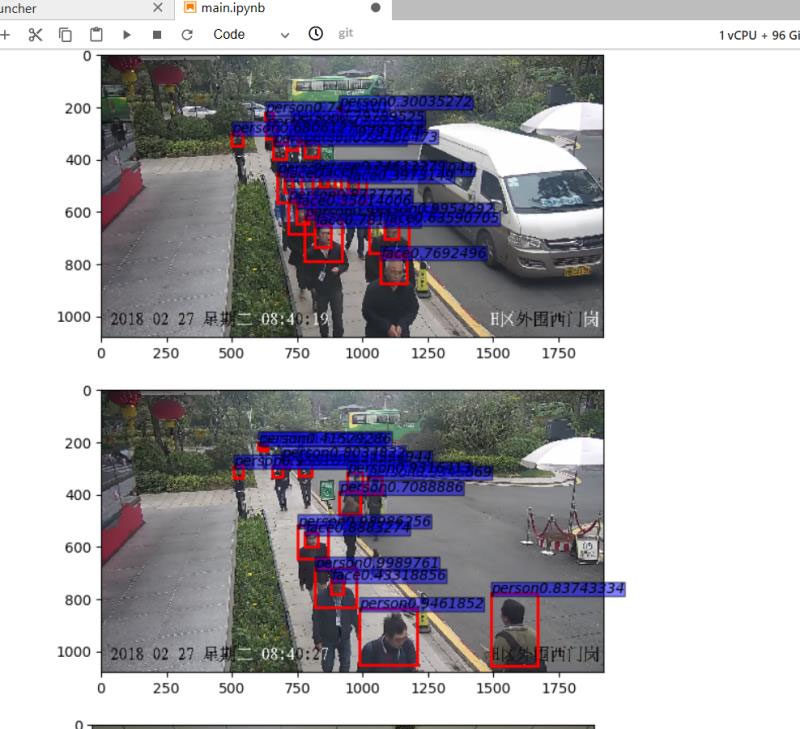

<!-- page: 14 -->

*扩充了自己增加的数据集，epoch_size=300 batch_size=32

 总体效果还算不错，自己上传的合照能识别到多人。但自拍那张未能识别到口

罩。

4. 总结

     经过了大概20 天断断续续的完成该项目，令我收获颇丰，主要

体现在以下几个方面：

1. 对华为云平台的操作更加熟悉。

本次口罩识别项目全程在华为云平台上完成，从桶的创建，到数

据集的扩充标记，再到notebook 编辑器的运行，虽然过程中遇到

了一些由于不熟悉所造成的困难，但总体来说华为云平台的操作

十分简单易懂，且易上手。让几近小白的我在经过了一两次操作

后选择已经能熟练的运用华为云平台。同时也让我有机会了解到

了类似于华为昇腾AI 芯片及MindSpore 计算框架的优势与如今的

应用领域，了解到了许多华为自研产品的发展情况以及国内对应

领域的技术难点，为今后的学习拓展了眼界。

2. 对人工智能及机器学习算法的初步认识。

此次口罩识别项目，涉及到了许多人工智能的相关知识有，虽然

我们都有了给定的代码，我们只需调整其中的几个参数，对于现

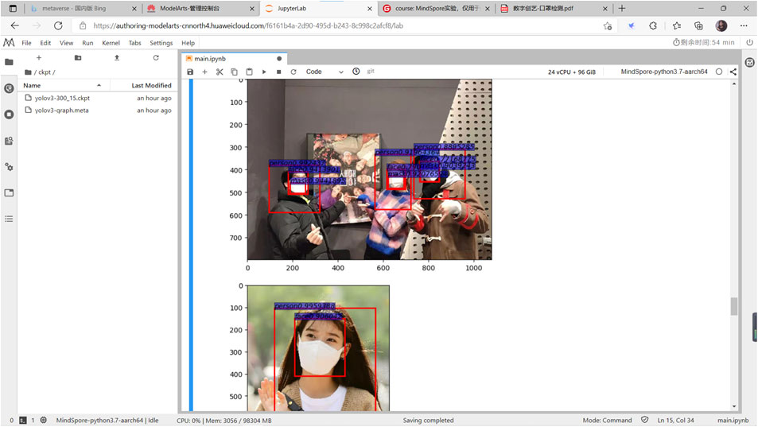

<!-- page: 15 -->

阶段的自己而言，想要完全理解代码细节也显然不现实。但着并

不影响我初步了解人工智能入门知识的兴趣。正如前文提到的梯

度下降、epoch、batch_size 的定义，都是我自己在网上搜索的资

料，虽然没有相关的先导知识。但通过阅读相关博客，也浅显的了

解到了许多人工智能的基础知识，这也将为我以后真正深入学习

人工智能提供了很多基础知识。以实践带动学习，我想这是我在

此次口罩识别项目的最大收获。

最后，感谢华为云平台给我们提供的此次免费学习机会，让我们

有机会了解到了许多前沿的技术和知识。同时也感谢老师与助教

姐姐的耐心的解答疑惑，感谢！
