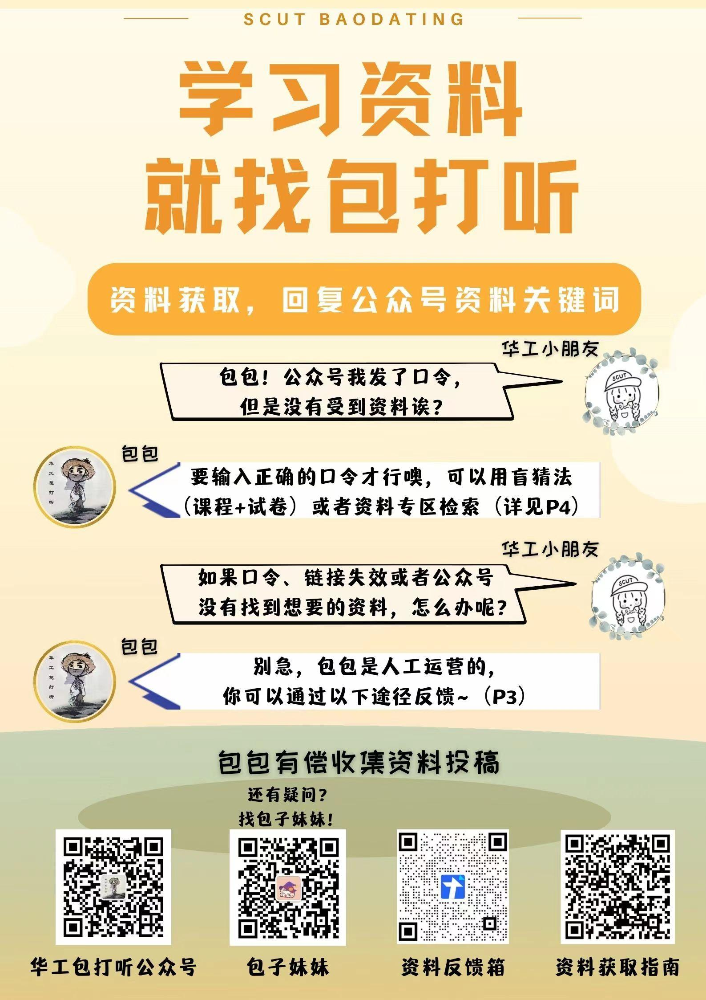
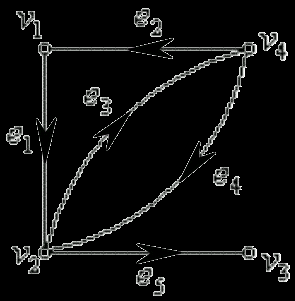

# 离散数学试卷（中文）

<!-- page: 1 -->

<!-- page: 2 -->

<!-- page: 3 -->

… … … … … … … … … … … … … … … … 密… … … … … … … … … … … … … … … … … … 封… … … … … … … … … … … … … … … 线… … … … … … … … … … … … … …

姓名                学号
  学院                  专业                     座位号

诚信应考,考试作弊将带来严重后果！

 华南理工大学期末考试

《离散数学》试卷A

注意事项：1. 考前请将密封线内填写清楚；
          2. 所有答案请直接答在试卷上；
          3．考试形式：闭卷；

          4. 本试卷共  五  大题，满分100 分，
考试时间120 分钟。
题 号
一
二
三
四
五
总分
得 分
评卷人

<!-- question: discrete-mathematics-003-Q1 -->

一、填空题(本大题共12 小题，每小题2 分，共24 分)

1．求合式公式xP(x)→xQ(x,y)的前束范式________________。

2．设集合A={a, b, {a,b}, }, B = {{a,b}, }，求B-A=_____________．

_____________ ________

( 密 封 线 内 不 答 题 )

3．设p 与q 的真值为0, ,r s 的真值为1 则命题
(
(
(
)))
(
)
s
q
r
p
r
p






的

真值是__________.

4．设R 是在正整数集合Z 上如下定义的二元关系



,
( ,
)
(
10)
R
x y
x y
Z
x
y







，

则它一共有         个有序对，且有自反性、对称性、传递性、反自反

性和反对称性各性质中的                   性质。

5．公式x(P(x)→Q(x,y))→S(x)中的自由变元为________________，约束变元为

________________。

6．设有命题T(x): x 是火车，C(x): x 是汽车，Q(x, y): x 跑得比y 快，那么命题

“有的汽车比一些火车跑得快”的逻辑表达式是______________________.

7．设G 是n 阶m 条边的无向图，若G 连通且m=__________则G 是无向树.

8．设X={1，2，3}，f：X→X，g：X→X，f={<1, 2>,<2,3>,<3,1>},

g={<1,2>,<2,3>,<3,3>}，则f-1 g=________________，gf=________________。

9. 不能再分解的命题称为________________，至少包含一个联结词的命题称为

《离散数学》试卷A 第 1 页 共 6 页

<!-- page: 4 -->

________________．

10. 连通无向图G 含有欧拉回路的充分必要条件是                      .
11．设集合A={,{a}}，则A 的幂集P(A)=                                      ，
     |P(A)|=_____________________________。

12. 设G = <V, E>, G’ = <V’, E’>为两个图(同为无向图或有向图), 若E’ Í E 且
_______________, 则称G’是G 的子图, 若E’ Í E 且_______________, 则称G’
是G 的生成子图。
<!-- question: discrete-mathematics-003-Q2 -->

二、单选题 (本大题共12 小题，每小题2 分，共26 分)

1．下列命题公式为重言式的是（  b ）

A. (p∨┐p)→q．  B．p→ (p∨q)  C．q∧┐q   D．( p→p)→q

2．下列语句中为命题的是( d)

 A．你好吗？

 B．人有6 指.

 C．我所说的是假的.

 D．明天是晴天.

3. 设D=<V, E>为有向图，V={a, b, c, d, e, f}, E={<a, b>, <b, c>, <a, d>, <d, e>,

<f, e>}是（ c ）

A．强连通图
B．单向连通图

C．弱连通图
D．不连通图

4．集合A＝{a，b，c}上的下列关系矩阵中符合偏序关系条件的是( d  )














1
0
1
0
0
1 1
0
0
0
1 1
1 1
0
1


































1
0
1
0
1
0
1
0
1

1
0
1
1 1
0
0
0
1

1 1 1
0
1
0
0
1 1

A．

 B．

  C．

  D．

5．设A={1，2，3}，A 上二元关系S={<1，1>，<1，2>，<3，2>，<3，3>}，则S 是

（  b   ）

   A．自反关系 B．传递关系C．对称关系  D． 反自反关系

6. 设A={a,b,c,d}，A 上的等价关系R={<a, b>, <b, a>, <c, d>, <d, c>}∪IA，则对

应于R 的A 的划分是（ d ）

A．{{a},{b, c},{d}}
B．{{a, b},{c}, {d}}

C．{{a},{b},{c},{d}}
D．{{a, b}, {c,d}}

《离散数学》试卷A 第 2 页 共 6 页

<!-- page: 5 -->

7. 以下非负整数列可简单图化为一个欧拉图的是( d )

A. {2, 2, 2, 2, 0}               B. {4, 2, 6, 2, 2}

C. {2, 2, 3, 4, 1}               D. {4, 2, 2, 4, 2}

8. 设论域D＝{a，b }，与公式xA(x)等价的命题公式是(c )

  A．A(a)∧A(b)  B．A(a)→A(b)  C．A(a)∨A(b)  D．A(b)→A(a)

9. 一棵树有3 个4 度顶点，4 个2 度顶点其余都是树叶，求这棵树有多少个树叶

顶点( b  )

A. 12     B. 8     C. 10       D. 13

10. 有ABC 三个人猜测甲乙丙三个球队中的冠军.各人的猜测如下:

   A: 冠军不是甲,也不是乙. B: 冠军不是甲,而是丙. C: 冠军不是丙,而是甲.

   已知其中有一个人说的完全正确.一个人说的都不对,而另外一人恰有一半说

对了.据此推算,冠军应该是( a  )

A．甲        B. 乙   C. 丙       D. 不确定

11．如第11 题图所示各图，其中存在哈密顿回路的图是 ( c   )
12．设C(x): x 是国家级运动员，G(x): x 是健壮的，则命题“没有一个国家级运动员不是健
壮的”可符号化为 (  d  )
))
(
)
(
(
)
A
(
x
G
x
C
x



))
(
)
(
(
)
B
(
x
G
x
C
x



))
(
)
(
(
)
C
(
x
G
x
C
x



))
(
)
(
(
)
D
(
x
G
x
C
x




(A)       (B)         (C)           (D)      

                                                    
                                          
                     第11 题图

三．计算题(30 分)

1．用等值演算法求取求下列公式：(PQ)(P∨Q)的合取范式（5 分）

《离散数学》试卷A 第 3 页 共 6 页

<!-- page: 6 -->

2．图G 如下图所示，求图G 的最小生成树.（5 分）
3．有向图D 如图所示，求D 的关联矩阵M(D) （5 分）

3

12
6

4

9
9
7

10

8
5

7

4.化简表达式
)
(
)))
(
(
)
))
(
(((
A
C
A
B
B
A
C
B
A








（7 分）

《离散数学》试卷A 第 4 页 共 6 页

<!-- page: 7 -->

5．设R={<2，1>，<2，5>，<2，4>，<3，4>，<4，4>，<5，2>}，求r(R)和s(R)，
并作出它们及R 的关系图(8 分)

五．证明题(22 分)
1．构造下面推理的证明(5 分)

前提：p
q

，p
r
，s
t
 ，
s
r
，
t


结论：q

2．设A={1, 2, 3, 4}, 在A A

定义的二元关系R，

,
,
,
A A, < , >R< , >
+ = +
u v
x y
u v
x y
u y x v






证明R 是A A

上的等价关系。(5 分)

《离散数学》试卷A 第 5 页 共 6 页

<!-- page: 8 -->

3．已知A、B、C 是三个集合，证明A-(B∪C)=(A-B)∩(A-C) （6 分）

4． 无向图G = <V,E>，且|V|=n, |E|=m, 试证明以下两个命题是等价命题
1）G 中每对顶点间具有唯一的通路，
2）G 连通且n=m+1。（6 分）

《离散数学》试卷A 第 6 页 共 6 页
