# 机试

<!-- page: 1 -->

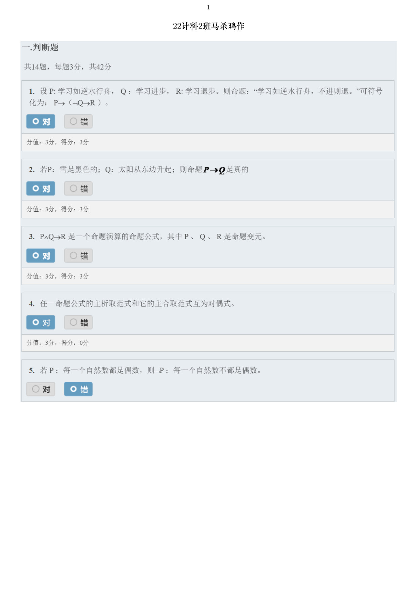

<!-- page: 2 -->

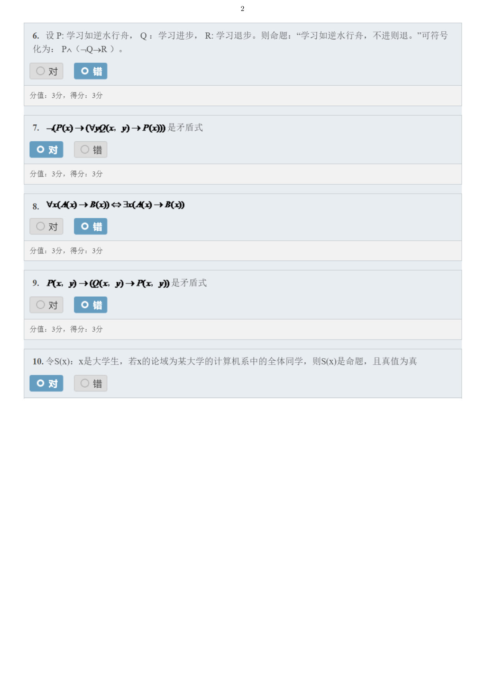

<!-- page: 3 -->

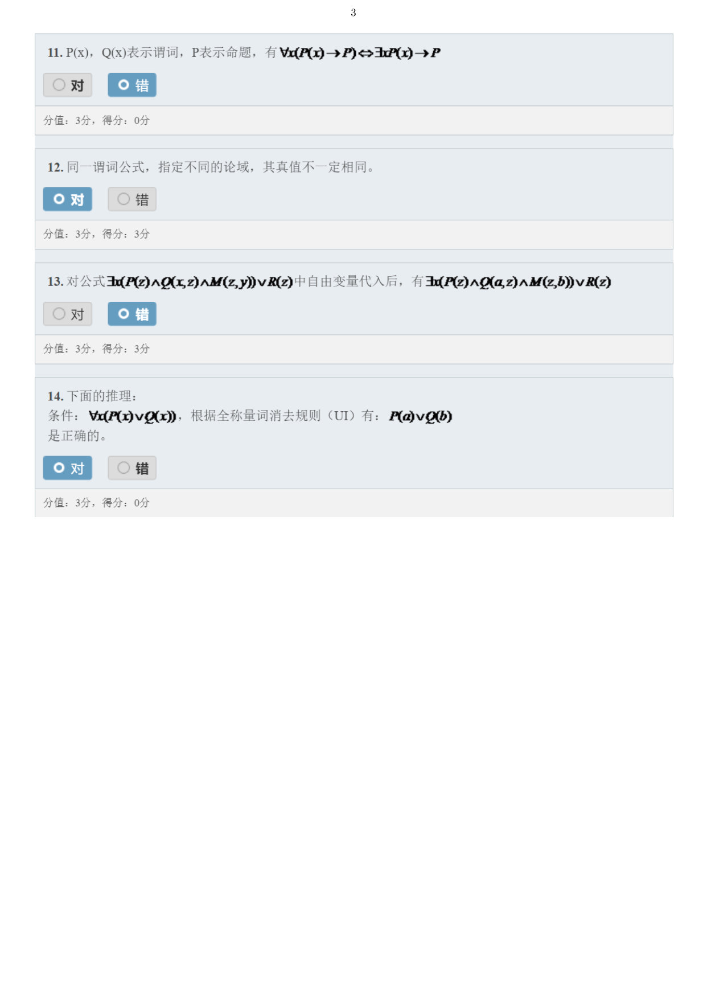

<!-- page: 4 -->

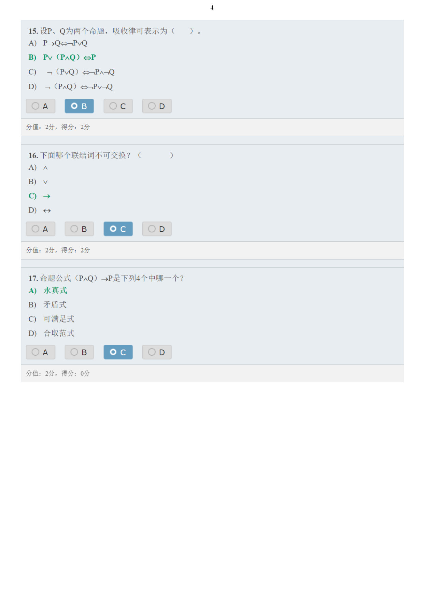

<!-- page: 5 -->

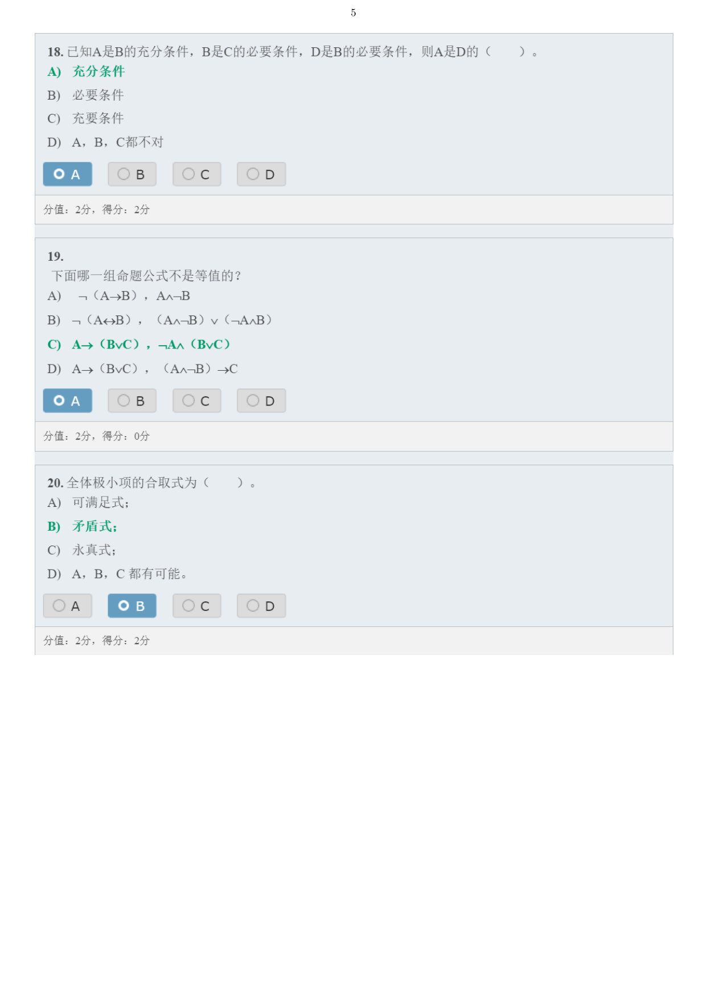

<!-- page: 6 -->

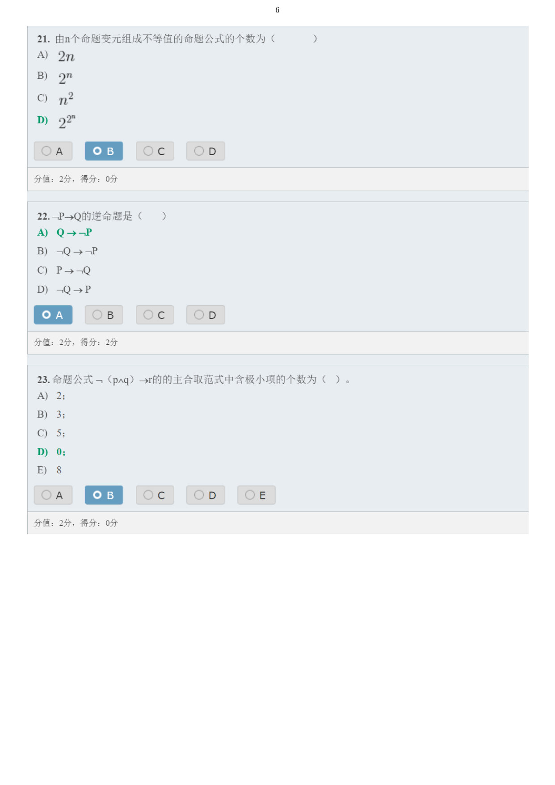

<!-- page: 7 -->

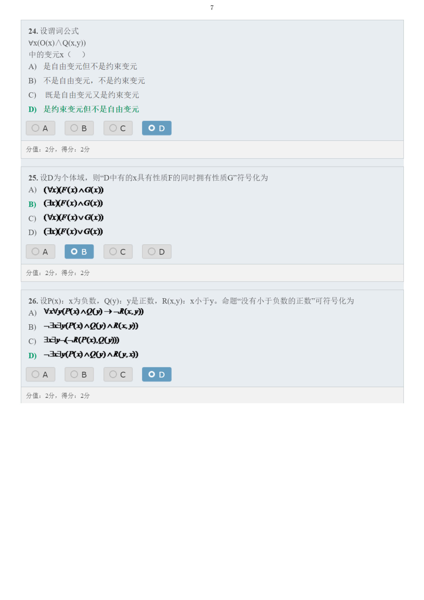

<!-- page: 8 -->

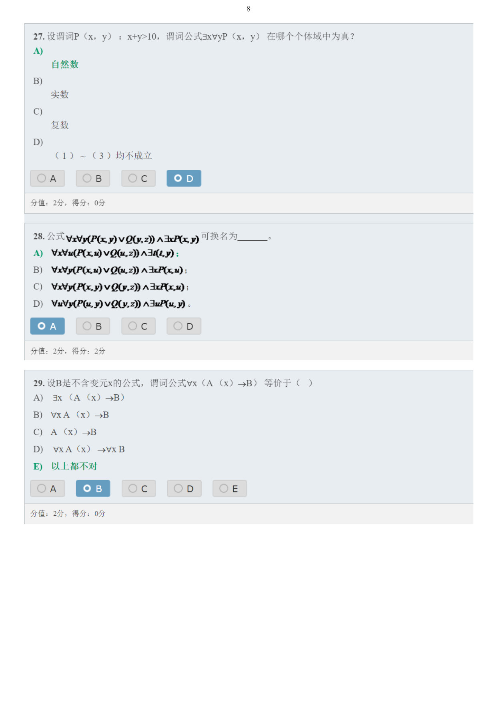

<!-- page: 9 -->

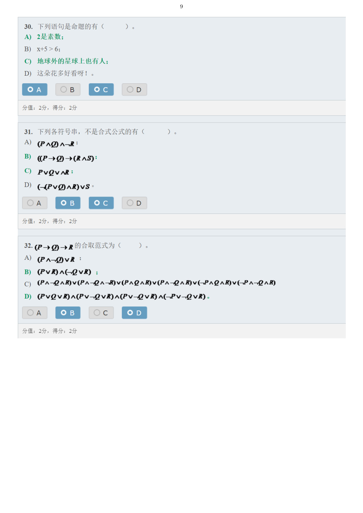

<!-- page: 10 -->

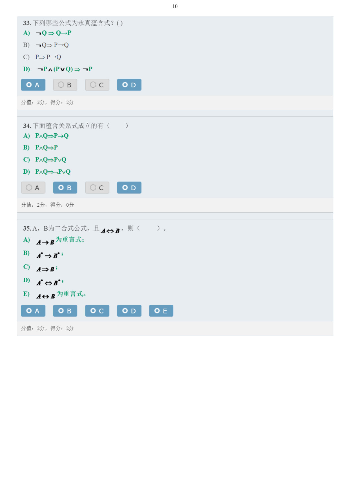

<!-- page: 11 -->

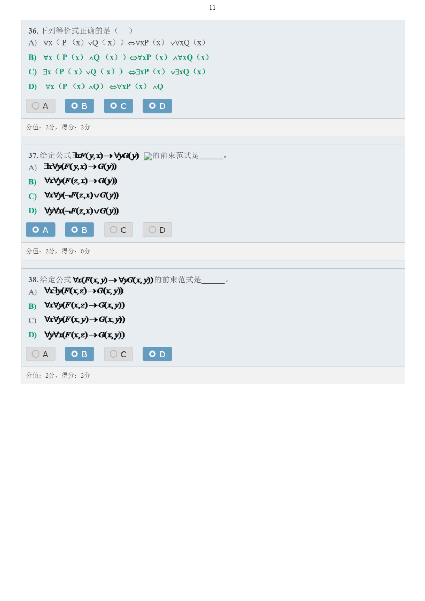

<!-- page: 12 -->

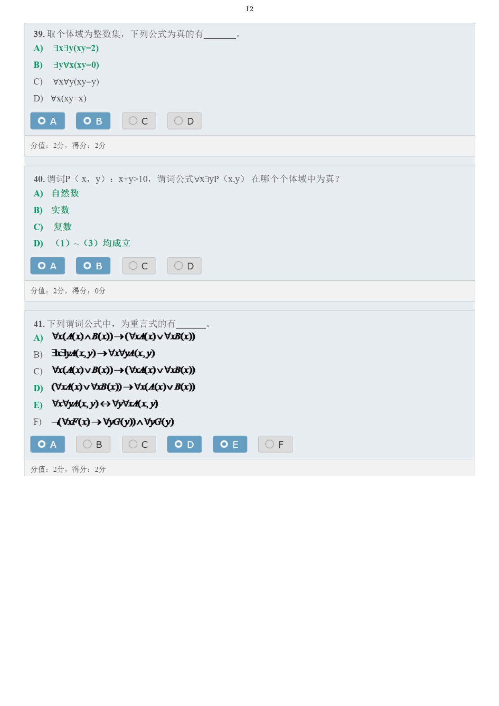

<!-- page: 13 -->

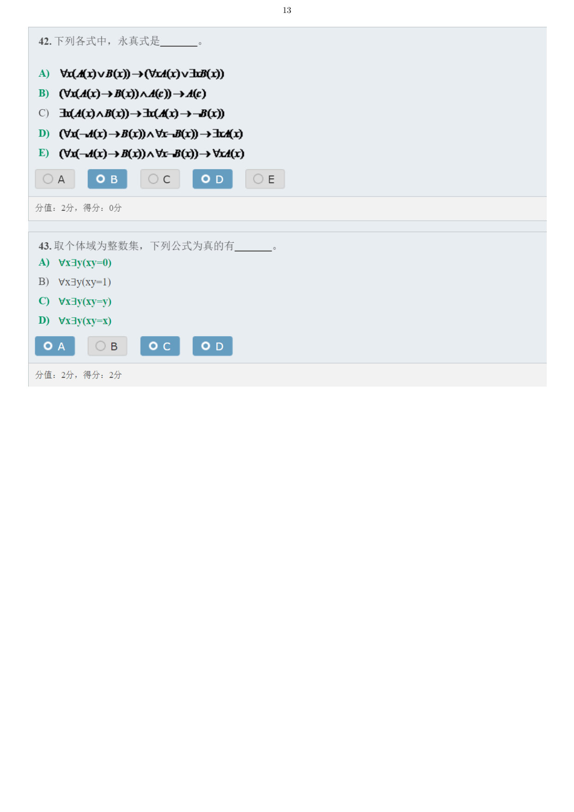
