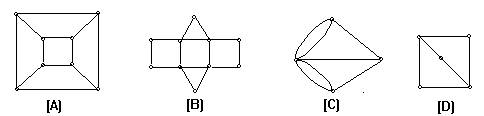

# 机试

<!-- page: 1 -->

22计科2马杀鸡制作

考生须知

<!-- question: discrete-mathematics-006-Q1 -->

1.本次考试形式采用闭卷方式
<!-- question: discrete-mathematics-006-Q2 -->

2.请各位同学抓紧时间考试

<!-- question: discrete-mathematics-006-Q3 -->

3.请自觉遵守考场纪律
<!-- question: discrete-mathematics-006-Q4 -->

4.填空题，只要填写最终的作答结果，不用填写解答过程，多个填空位请在答题区标明答案对应的序号

本试卷共3大题，满分100分，考试时间60分钟。

一.单项选择题

共14题，每题2分，共28分

1.

设G=<V，E>为有向图，V={a,b,c,d,e,f}，E={<a,b>,<b,c>,<a,d>,<d,e>,<f,e>}是（     ）。

A)

强连通图

B)

单向连通图

C)

弱连通图

D)

不连通图

A
B
C
D

分值：2分，得分：2分

2.
A)

一个有n个结点的图，最多有（    ）个连通分支。

0

B)

1

C)

n-1

D)

n

A
B
C
D

分值：2分，得分：2分

3.

有向图D如图,
到
长度为1，2，3，4的回路数为（        ）；

A)

0,0,4,0

B)

0,1, 4, 0

C)

0,2,0,0

D)

0, 2, 1, 1

A
B
C
D

分值：2分，得分：2分

<!-- page: 2 -->

4.

设图G和它的补图
的边数分别为
和
，G的阶数为（      ）。

A)

B)

C)

D)

A
B
C
D

分值：2分，得分：2分

5.

设n阶无向简单图为3-正则图，且边数m与n满足2n-3=m，则n为（         ）。

A)

5

B)

6

C)

7

D)

8

A
B
C
D

分值：2分，得分：2分

6.

对Cn(n为偶数)图的结点着色，最少用几种颜色？

A)

2

B)

3

C)

n-1

D)

n

A
B
C
D

分值：2分，得分：2分

7.

在如下各图中（     ）欧拉图。

A)

A

B)

B

C)

C

D)

D

A
B
C
D

分值：2分，得分：2分

<!-- page: 3 -->

8.

在Peterson图
中，至少填加（       ）条边才能构成Euler图。

A)

1

B)

2

C)

4

D)

5

A
B
C
D

分值：2分，得分：2分

9.

把平面分成x个区域，每两个区域都相邻，问x最大为（      ）。

A)

6

B)

4

C)

5

D)

3

A
B
C
D

分值：2分，得分：2分

若完全图G中有n个结点（n³2）,m条边，则当（         ）时，图G是欧拉图。

10.

A)

n为奇数

B)

n为偶数

C)

m为奇数

D)

m为偶数

A
B
C
D

分值：2分，得分：2分

11.

有7结点的所有非同构的无向树有多少棵？

A)

6

B)

7

C)

11

D)

20

A
B
C
D

分值：2分，得分：2分

12.
A)

下面给出的各符号串集合，哪个不是前缀码？

{11,00,10,01}

B)

{a,b,c,ac,abc,bc}

C)

{11,101,010,0001,0011}

D)

{a,b,cb,cde}

<!-- page: 4 -->

A
B
C
D

分值：2分，得分：2分

13.

有4结点的所有非同构的无向树有多少棵？

A)

2

B)

3

C)

4

D)

5

A
B
C
D

分值：2分，得分：2分

14.

设G是一棵树，n,m分别表示结点树和边数，则（         ）成立。

A)

n=m

B)

m=n+1

C)

n=m+1

D)

不能确定

A
B
C
D

分值：2分，得分：2分

二.多项选择题

共14题，每题3分，共42分

15.

无向图G如图，
，下面(           )是点割集。

A)

{a, b}

B)

{b, e}

C)

{a,c}

D)

{d}

A
B
C
D

分值：3分，得分：3分

16.
A)

用邻接矩阵表示无向图，下列说法正确的是(               ).

全零的行对应的是孤立点

B)

矩阵的所有元素之和等于无向图的边数

C)

完全图的邻接矩阵的元素全都为1

D)

邻接矩阵关于主对角线对称

A
B
C
D

分值：3分，得分：3分

17.

当n为偶数时，下面哪些图是二分图？

<!-- page: 5 -->

A)

Kn

B)

Cn

C)

Wn

D)

Qn

A
B
C
D

分值：3分，得分：3分

18.

在二分图K3,3中有长度为（          ）的回路。

A)

3

B)

4

C)

5

D)

6

A
B
C
D

分值：3分，得分：3分

19.

用邻接矩阵表示有向图，下列说法正确的是(               ).

A)

全零的行对应的是孤立点

B)

矩阵的所有元素之和等于有向图的边数

C)

主对角线的元素不为0表示对应的结点有环

D)

邻接矩阵关于主对角线对称

A
B
C
D

分值：3分，得分：3分

20.

给设d=（d1,d2,…,dn），其中di为正数，i=1,2, …,n。若存在n个结点的简单图，使得结点vi的度数为di，

则称d是可图解的。下面给出的各序列中(            )是可图解的。

A)

（1，1，1，2，3）

B)

（2，3，3，4，4，5）

C)

（3，3，3，3）

D)

（2，3，4，4，5）

E)

（1，3，3，3）

A
B
C
D
E

分值：3分，得分：3分

21.

下面哪些图是平面图？

A)

K10

B)

C10

C)

Q10

D)

W10

A
B
C
D

<!-- page: 6 -->

分值：3分，得分：0分

22.

在下图中，（    ）是欧拉图。

<!-- question: discrete-mathematics-006-Q5 -->

（1）                  （2）              （3）             （4）

A)

1

B)

2

C)

3

D)

4

A
B
C
D

分值：3分，得分：3分

23.

设Kr,s为完全二分（部）图，当r,s为(        )时，Kr,s为哈密顿图。

A)

r=s且均为大于1的奇数

r¹ s且均为大于1的奇数

B)

C)

r=s且均为大于1的偶数

r¹ s且均为大于1的偶数

D)

E)

r,s中一个为偶数，一个为奇数

A
B
C
D
E

分值：3分，得分：3分

24.

对于完全图Kn，下面（           ）是正确的

A)

都可以一笔画出

B)

都不可以一笔画出

当n¹1且为奇数时，可以一笔画出

C)

当n¹1且为偶数时，可以一笔画出

D)

当n¹1且为偶数时，可以n/2笔画出

E)

A
B
C
D
E

分值：3分，得分：3分

25.

下面命题正确的是（    ）。

A)

非平凡无向树一定是平面图。

B)

非平凡无向树一定不是二分图。

C)

非平凡无向树一定不是欧拉图。

D)

非平凡无向树一定是哈密顿图。

A
B
C
D

分值：3分，得分：3分

<!-- page: 7 -->

26.

下面哪几种图是树（       ）。

A)

无简单回路的连通图

B)

有n个结点，n-1条边的图

C)

每对结点间都有通路的图

D)

连通但删去任意一条边则不连通的图。

A
B
C
D

分值：3分，得分：0分

27.

下面命题正确的是(                 ).

A)

任何树T都至少有2片树叶。

n(n³2)阶树至少有2片树叶。

B)

C)

图G中的每条边都是割边，则G必是树。

D)

一棵完全二元树，必有奇数个结点。

A
B
C
D

分值：3分，得分：0分

28.

设Ｇ是一棵根树，则G一定是（     ）。

A)

强连通图

B)

单向连通图

C)

弱连通图

D)

有向连通图

A
B
C
D

分值：3分，得分：3分

三.判断题

共15题，每题2分，共30分

29.

有向图中每个结点必属于一个强分图，每条有向边都一定属于一个强分图。

对
错

分值：2分，得分：2分

30.

若无向图G的边e不包含在G的任一简单回路中，则e是G的割边。

对
错

分值：2分，得分：2分

31.

正则图必有偶数个结点

对
错

分值：2分，得分：2分

32.

两个图同构，当且仅当它们的邻接矩阵相同。

对
错

<!-- page: 8 -->

分值：2分，得分：2分

33.

有3个结点的有向完全图，它的包含4条边的不同构的子图有4个。

对
错

分值：2分，得分：2分

34.

如果一个有向图D是强连通图，则D是欧拉图

对
错

分值：2分，得分：0分

35.

若无向图G是欧拉图，G中不存在割边。

对
错

分值：2分，得分：2分

36.

Km,n，当m等于n且大于等于2时是哈密顿图。

对
错

分值：2分，得分：2分

37.

Km,n，当m等于n时是哈密顿图。

对
错

分值：2分，得分：0分

38.

设图G有11个结点，则G或G的补图是非平面图。

对
错

分值：2分，得分：2分

39.

除平凡树外，树都不是哈密顿图。

对
错

分值：2分，得分：2分

n(n³2)阶无向树都是二分图。

40.

对
错

分值：2分，得分：2分

41.

不存在既是欧拉图，又是哈密顿图的树。

对
错

分值：2分，得分：2分

42.

任何树T都至少有2片树叶。

对
错

<!-- page: 9 -->

分值：2分，得分：2分

43.

T为完全二元树，有t片树叶，则其边的总数e=2t-1。

分值：2分，得分：2分
对
错
