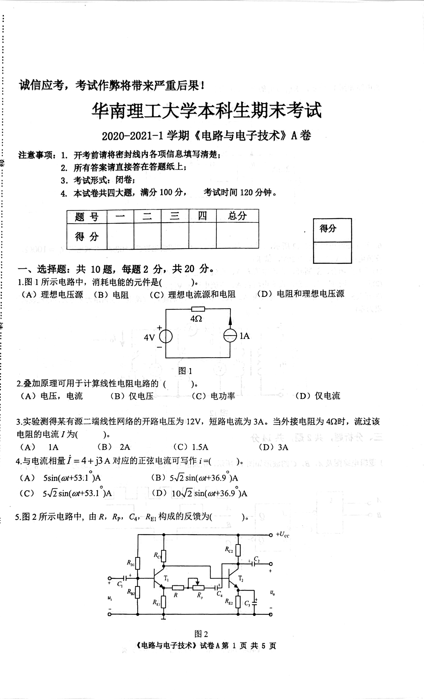
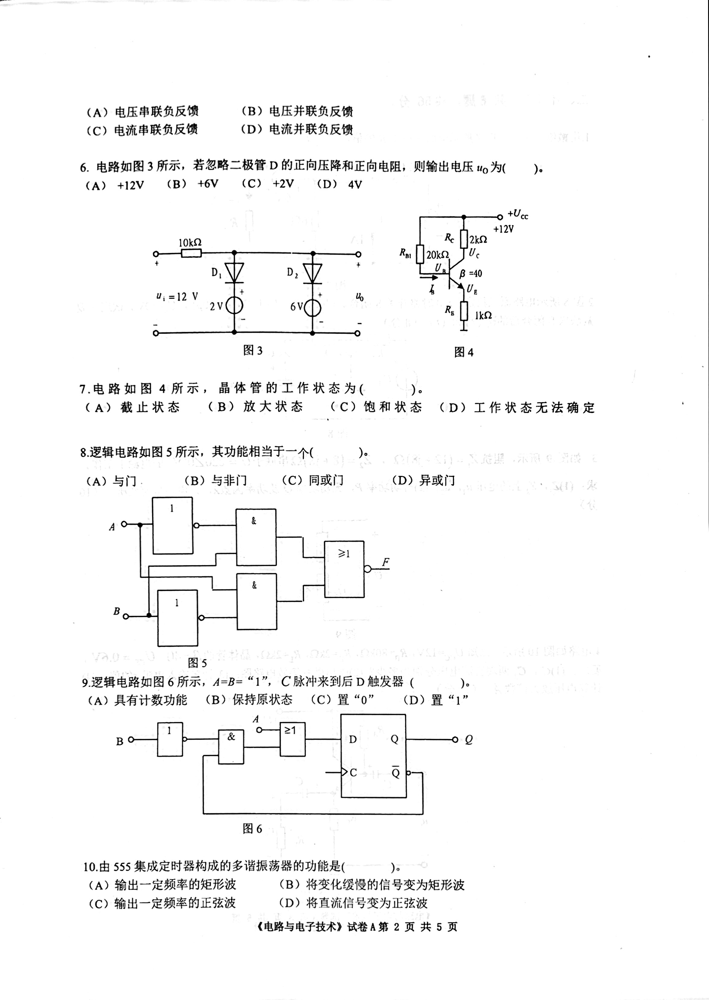
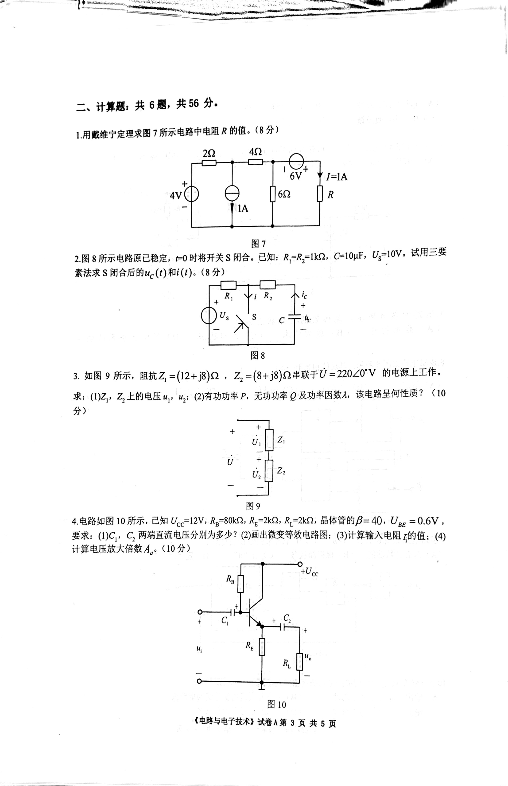
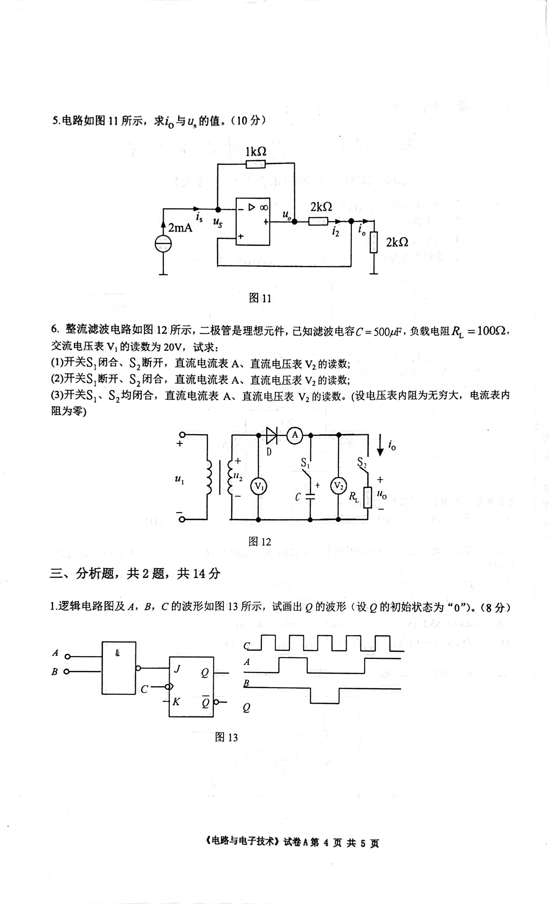
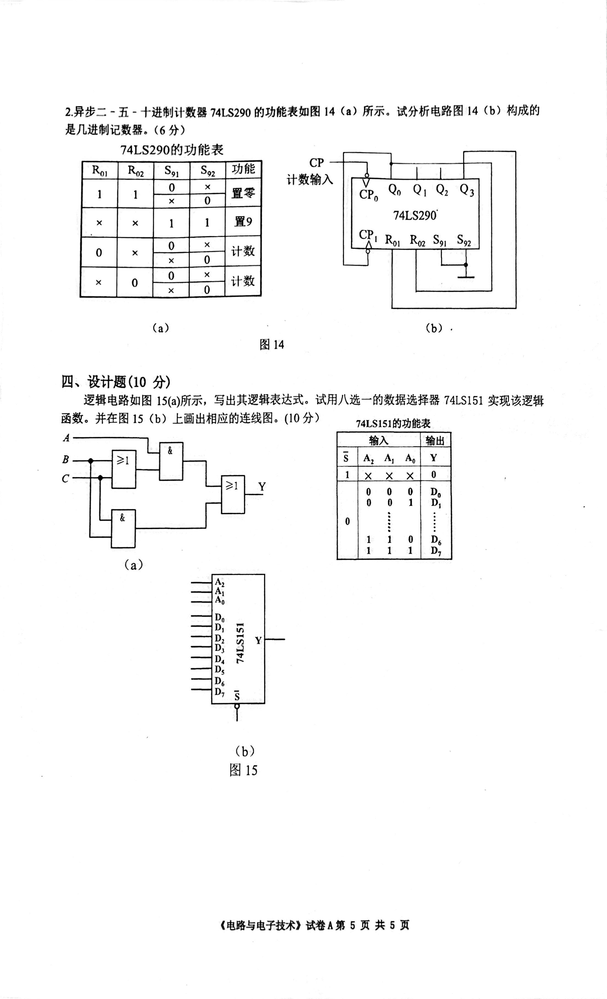

# 2020电工学a卷

<!-- page: 1 -->

:

2020-2021-1
(
S7R)
A#
#**A 1. #O##N
MBHIA:
ESUKE;
2.i
3. $
t: #
4. *
#K #100,
120.

:

:

-,AA0:#10, #2 , #20t.
1.1iRB ,WÉL TAR(
(A)
KA
(B) A

).
(C)
iAM
SA

(D) EÃI
EA

:

492

1A

4V

2.nATATHRE
(
(A)K,
(B) (2E
(C)J

(D)
i
3.NI4*AA-
F EH12V, 3A. 1
4QR,t

(A)
1A
(B)
2A
(C) 1.5A
(D) 3A

Ssin(or+53.1)A
(B) 5/2sin(cart36.9)A
(A)

sV2sin(ar+53.1)A
(C)
(D) 10/2sin(ott36.9)A

5.92 Ar
, HR,Rp»CayRgi BÌỂIRB

Rea
R

T

R
R

2

Created with Scanner Mini

<!-- page: 2 -->

(B)
R#KAAA
(D)
iEARA

(A)
Æ#ARS
(C)i
iR

6. tn3 iR, #
–BD EAE#AEMEEAH, WMHkuo
(A)
+12V
(B)
+6V
(C)
+2V
(D)
4V

-o +Uc

+12V

10KS2
R
R J20k3 TU.

D

U;=12
V

2v

3
4

7.
n
4
,
# NI# #
h(
).
(A) t #
B) * *
(D) I
*EtKN

(A) 5]
(B) 5#J
(C) AIT
(D) tii

&

A

>1

9.
tn 6
iT, A-B=“1", CĐxhEJEDÅdA

).

(
(D)
"1"
(A)
AAtDiË
(B) RARE

(C) o"

B
D

6

(A)
-
EE
(C)
-ŻM
E3A

(B)
#Ek9TASHEBA
(D) #İi ASAE

Created with Scanner Mini

<!-- page: 3 -->

=, +: #6, #56}.
LA
IIRN7
ARSÅ.(8)

22
42

6V
YI=1A

R
4v)
||62
|IA

2.8BB
LEŻ, FO B#HAS WA. BA: R-R,-1k2,C=10uF,U,=10v. itHE
K**S
AMu-()li (1).(8+)

R,

C

8
3.tn 9 BrT. AZ =(12+j8)Q, Z,=(8+j8)2TỦ=220/Z0'V
MAEI{F.

u,, u,: (2)AH
P, EJHJ)
Q BIH
A, i
t? (10
*: (1)Z,,Z,EM
4)

+

U

U,

9
4.
10Pr, BI U=12V,R-80k2,R-2kS2,R-2ks2.i
NB=40.Uạg=0.6V,
WR:(1)C,,, 5 WEEA B$}?(2) HAGN%: ()t
Azthi: (4)
it EK#MA,. (10+)

Uec

+

R,

R

10
( TtR) tA3
#5

Created with Scanner Mini

<!-- page: 4 -->

S.BMn 11 7, *i, 5u, $i. (10+)

Iks2

2kS2

4 2mA
2k2

6. *hMA Mtn R12BiR, –R
NA,
B1UC=
500_f.A2RBHR,=10002.
3TiARRV, AS 20V, R:
(1)ĦAS,Ht,S,iF. İAAK A,
* V,%A;
(2)*S,BH,S,WAHMAAKA, AK
V, ;
(3)F*S, S,
t,
H
hKA, H
K#V,HRK. (KAMAEHR,
ARI
FAE)

u,

12

E,
, #2U.#14

1.2##MA,
B,C IAKMA 13Brk,
t#o
#AR (OMDAARS} "o").(8)

B

B

13

(
TR)
# A# 4A # 5

Created with Scanner Mini

<!-- page: 5 -->

2.R#- i-
+#*0#74LS290
#MTHAEUE14(a)BiF. A
LIMEA. (64)

14
(b) R BAN)

74LS290
shh

CP
itA
CP,
2
Q3

Ro

S10
10
0

Ro2

1

0

X
X
9
it
it

74LS290

1

Ci Ro RozSg1 S2

0
X
0

X

0
0

(a)
(b)
14

29.
(10)
E#U 15(a)M,
GHAEMREt.\Ë-
A.
#EIS (b) EEHANNE. (10+)

74LS151E

74LS151T

A

sA, A, A

Y
1X X x0
0
0
D,
D,

1
0

D,
D.

1
1

1
(a)

(b)
15

(
R)A#5
5

Created with Scanner Mini

