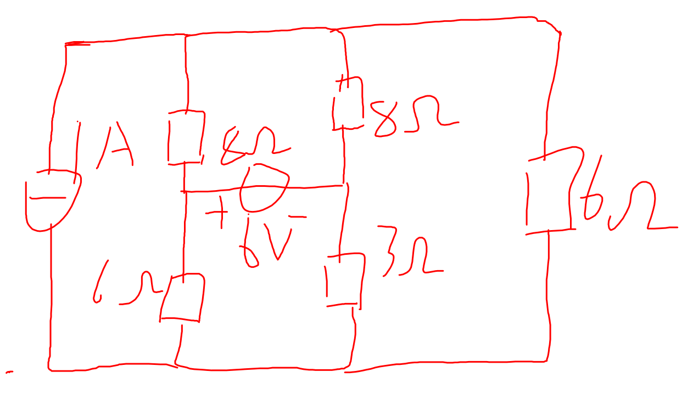
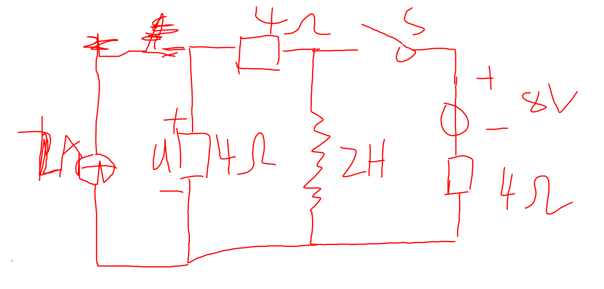
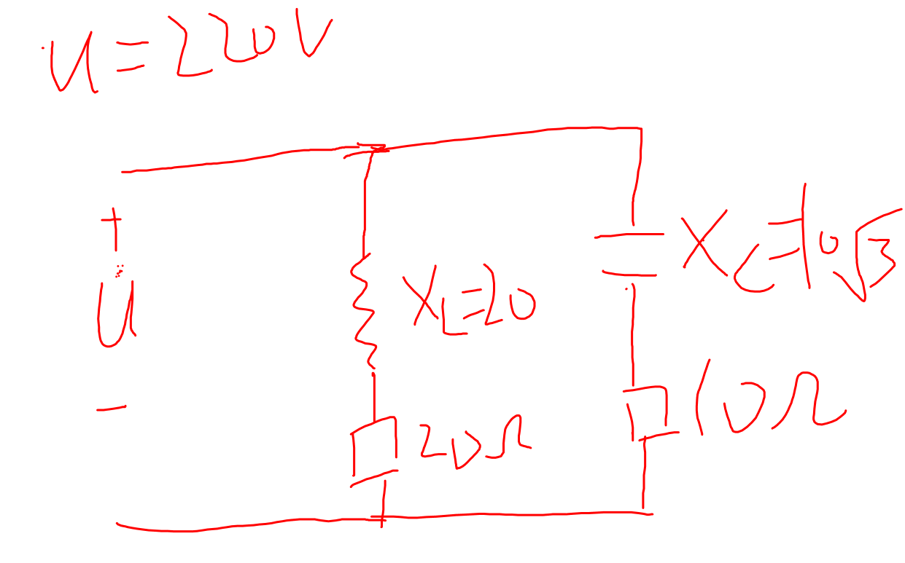
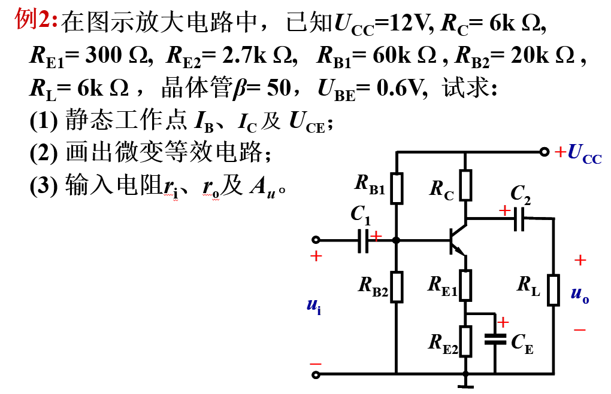
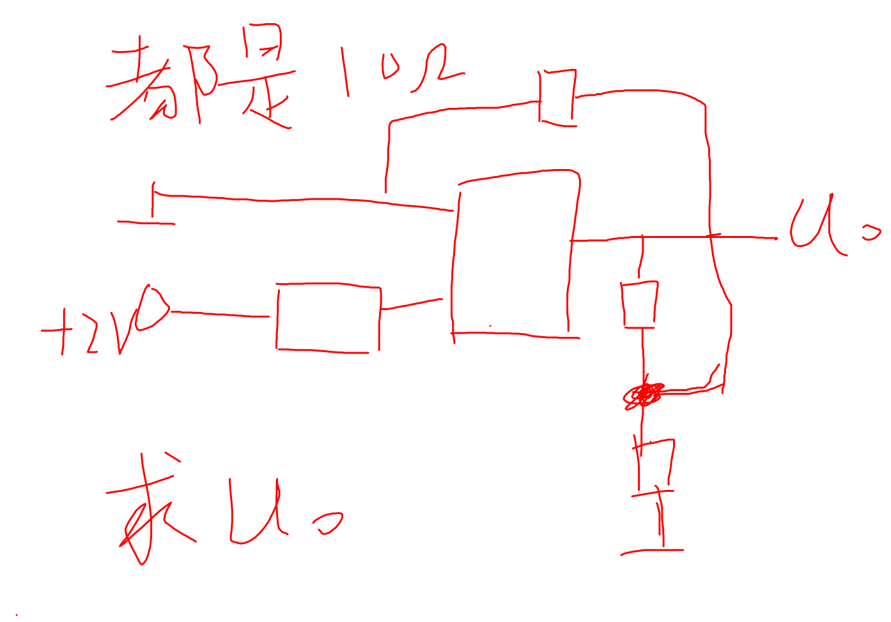
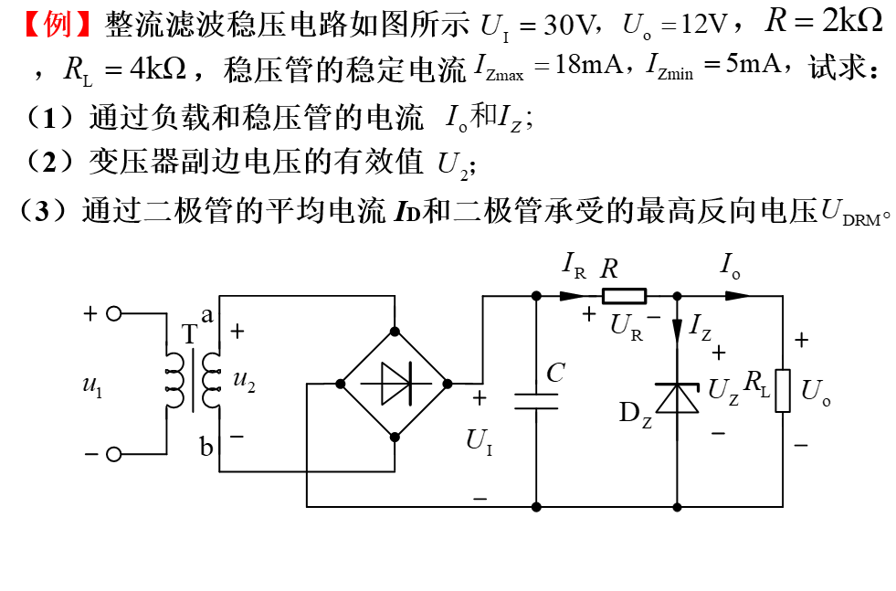
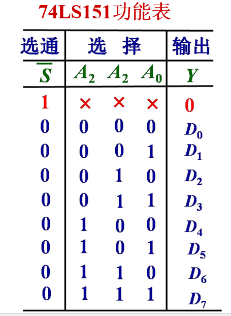
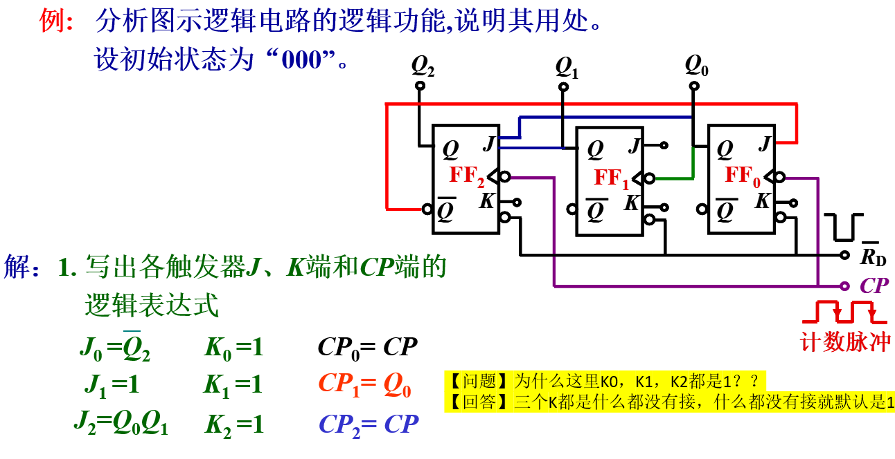
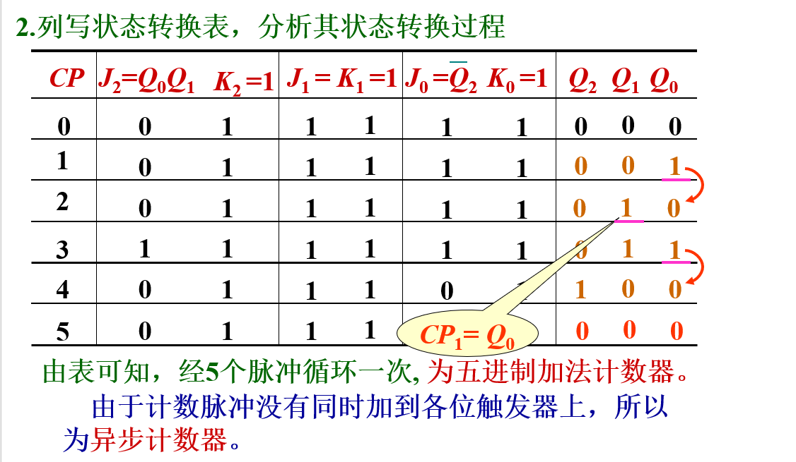
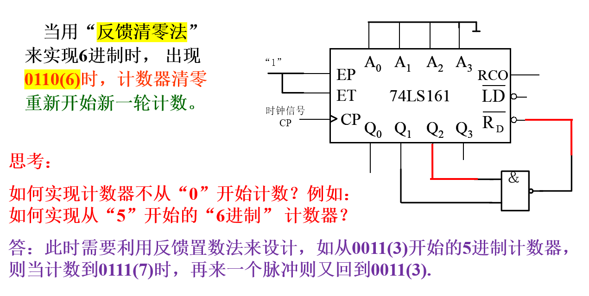

# 2022级电工回忆版

2022级电工回忆版

前言：考完已经一段时间了，凭记忆写了一些感想，只是起到“给一些经验，提醒要学什么知识点“的作用

回忆了86分，今年的有点比以前的要难，题型分布大概是2*10+10+8+8+12+8+8+8*3，明天要考离散了，已经回忆半个小时了，不想回忆选择题了

选择题不想细说，很难想，前几题都是第二章的那些基础

第十七章就是来考选择题的，考负反馈，串并联电压流四个排列组合，考了一道。

结点电压法考了一道。

考了一道给出电路然后写逻辑表达式的很简单，数字逻辑的老底了。

第一道大题是戴维宁定理，求最右边那条支路的电压

第二道刚开始是闭合稳定的，然后断开，求u（t）

第三道求各支路电流和U处的P、Q

第四道大题是这样的图，数据近似

第五题

第六题考这个图，问法类似

设计与分析

第一道考74LS151型8选1数据选择器，取D2,D3,D6,D7，没有一点难度

第二题考七进制，类似于这种，让你写JK表达式和3个Q的值

第三题是置零、清零，类似这个器件，不过是连在Q3、Q2上面

