# ch12嵌入式操作系统

<!-- slide: 1 -->

## 第12章 嵌入式操作系统

- 嵌入式微控制器原理及设计
- —基于STM32及Proteus仿真开发
- 配套PPT

<!-- slide: 2 -->

<!-- slide: 3 -->

- 第12章 嵌入式操作系统
- 12.1 嵌入式操作系统介绍
- 12.2 uC/OS-II嵌入式操作系统
- 12.3 uC/OS-II操作系统移植
- 12.4 uΜC/OS-II内核结构
- 12.5 uC/OS-II任务、时间及事件控制块
- 12.6 互斥信号量MUTEX
- 12.7 信号量
- 12.8 事件标志组
- 12.9 消息邮箱
- 12.10 消息队列
- 12.11 动态内存管理

<!-- slide: 4 -->

- 12.1 嵌入式操作系统介绍
- 嵌入式操作系统是指用于嵌入式系统的操作系统。嵌入式操作系统是一种用途广泛的系统软件，通常包括与硬件相关的底层驱动软件、系统内核、设备驱动接口、通信协议、图形界面、标准化浏览器等。
- 当前嵌入式操作系统主要分为两大类型：
- （1）支持内存管理单元（MMU）的大型嵌入式操作系统，例如Linux、鸿蒙、Android、iOS、Vxworks和WinCE等操作系统。
- （2）可在微控制器上运行的小型嵌入式操作系统，例如RT-Thread、Amazon FreeRTOS、μC/OS、华为Lite OS、AliOSThings、ARM mbed和Tencent OStiny等，这类操作系统的内核较为简单，主要由任务管理、时间管理、互斥量、信号量和内存管理等操作系统最基本的元素组成，整个程序也很小一般小于4KB，因此可以直接部署在微控制器的静态存储器上，整个启动也可以通过地址总线访问直接运行。

<!-- slide: 5 -->

- 12.1.1 传统小型嵌入式操作系统
- 基于嵌入式操作系统主要是μC/OS和FreeRTOS等，内容包括任务管理、实时调度、时间管理、中断管理、内存管理、消息队列、信号量、互斥锁、事件标志等模块，因此只要掌握一种嵌入式操作系统使用的思路，其他都类似。
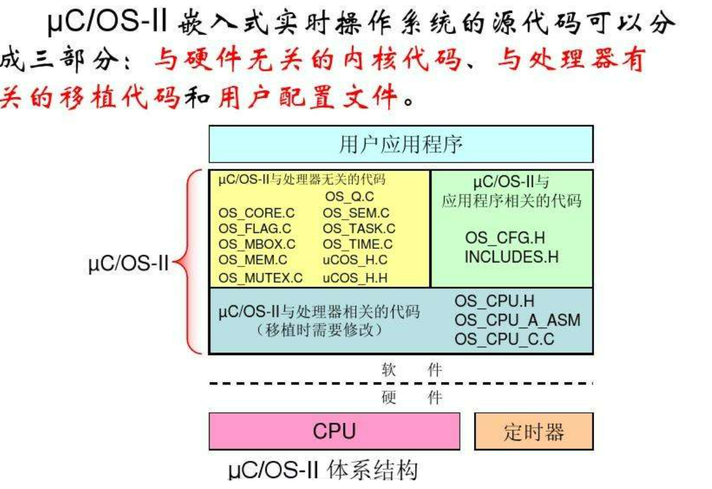

<!-- slide: 6 -->

- 12.1.2 嵌入式小型物联网操作系统
- 嵌入式小型物联网操作系统，主要是在小型物联网操作系统的基础上添加了网络和软件模块，从而使整个系统更有利于物联网应用开发。
- 物联网操作系统是指以操作系统内核（可以是RTOS、Linux等）为基础，包括如文件系统、图形库等较为完整的中间件组件，具备低功耗、安全、通信协议支持和云端连接能力的软件平台，RT-Thread就是一个IoT OS。
- 内核层：RT-Thread内核，是RT-Thread的核心部分，包括内核系统中对象的实现。
- 组件与服务层：组件是基于RT-Thread内核之上的上层软件。
- RT-Thread软件包：运行于RT-Thread物联网操作系统平台上，面向不同应用领域的通用软件组件，由描述信息、源代码或库文件组成。
- 物联网相关的软件包：Paho MQTT、WebClient、mongoose、WebTerminal等。
- 脚本语言相关的软件包：目前支持JerryScript、MicroPython。
- 多媒体相关的软件包：Openmv、mupdf。
- 工具类软件包：CmBacktrace、EasyFlash、EasyLogger、SystemView。
- 系统相关的软件包：RTGUI、Persimmon UI、lwext4、partition、SQLite等。
- 外设库与驱动类软件包：RealTek RTL8710BN SDK。

<!-- slide: 7 -->

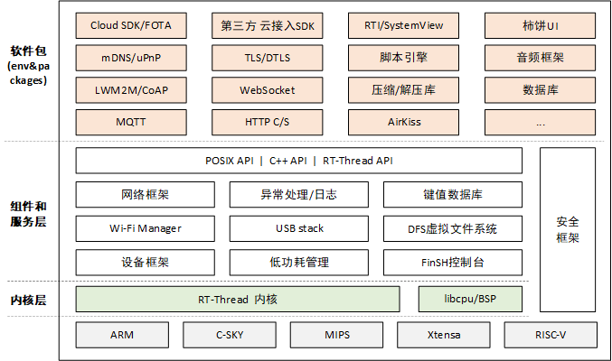
- RT-Thread架构图

<!-- slide: 8 -->

- 12.1.3 嵌入式操作系统实时性特点
- （1）实时系统的属性。实时系统有两个基本属性：可预测性和可靠性。
- （2）实时系统的实时性能主要根据其三个主要指标来衡量。1）响应时间。2）吞吐量。3）生存时间。
- （3）实时操作系统常用的调度方法。1）基于优先级的调度算法。2）时钟驱动调度算法。3）基于比例共享的调度算法。4）非周期性任务的调度。
- （4）临界资源和代码临界区。临界资源指的是一段时间只容许一个进程访问的资源。共享临界资源的各个进程必须互相访问临界资源。代码的临界区是指处理时不可分割的代码。
- （5）优先级反转和对策。有时候会出现一种比较奇怪的现象：由于多进程共享资源，具有最高优先级的进程被低优先级进程阻塞，反而使具有中优先级的进程先于高优先级的进程执行，从而导致系统崩溃。这就是优先级反转。目前通常使用两种方法来解决优先级反转。一种方法是采用优先级封顶协议，另一种方法是采用优先级继承协议。

<!-- slide: 9 -->

- 12.2 uC/OS-II嵌入式操作系统
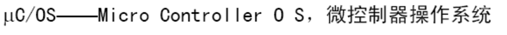
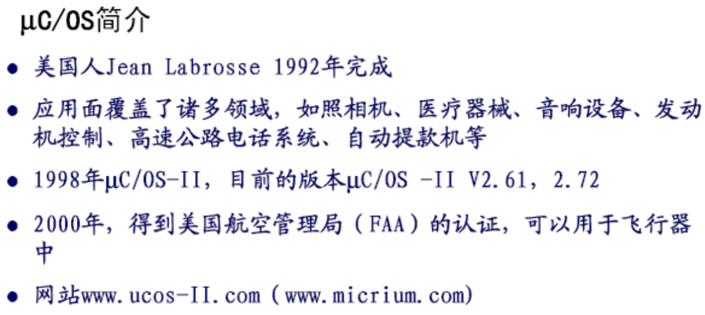

<!-- slide: 10 -->

- 12.2.1 μC/OS-II嵌入式操作系统特性
- 1. 公开源代码；
- 2. 可移植性（Portable）：绝大部分μC/OS-II的源码是用移植性很强的ANSI C写的。和微处理器硬件相关的那部分是用汇编语言写的。汇编语言写的部分已经压到最低限度，使得μC/OS-II便于移植到其他微处理器上。μC/OS-II可以在绝大多数8位、16位、32位以至64位微处理器、微控制器、数字信号处理器（DSP）上运行。
- 3. 可固化（ROMable）：μC/OS-II是为嵌入式应用而设计的，这就意味着，只要读者有固化手段（C编译、连接、下载和固化），μC/OS-II可以嵌入到读者的产品中成为产品的一部分。
- 4. 可裁剪（Scalable）：可以只使用μC/OS-II中应用程序需要的那些系统服务。也就是说，某产品可以只使用很少几个μC/OS-II调用，而另一个产品则使用了几乎所有μC/OS-II的功能，这样可以减少产品中的μC/OS-II所需的存储器空间（RAM和ROM）。这种可剪裁性是靠条件编译实现的。

<!-- slide: 11 -->

- 5. 占先式（Preemptive）：μC/OS-II是完全可剥夺型的实时内核，μC/OS-II总是运行就绪条件下优先级最高的任务。
- 6. 多任务：μC/OS-II可以管理64个任务，然而，目前这一版本保留8个给系统。应用程序最多可以有256个任务。
- 7. 可确定性：全部μC/OS-II的函数调用与服务的执行时间具有可确定性。
- 8. 任务栈：每个任务有自己单独的栈，μC/OS-II允许每个任务有不同的栈空间，以便压低应用程序对RAM的需求。
- 9. 系统服务：μC/OS-II提供很多系统服务，例如邮箱、消息队列、信号量、块大小固定的内存的申请与释放、时间相关函数等。
- 10.中断管理：中断可以使正在执行的任务暂时挂起，如果优先级更高的任务被该中断唤醒，则高优先级的任务在中断嵌套全部退出后立即执行，中断嵌套层数可达255层。
- 11. 稳定性与可靠性：μC/OS-II是基于μC/OS的，μC/OS自1992年以来已经有数百个商业应用。μC/OS-II与μC/OS的内核是一样的，只是提供了更多的功能。另外，2000年7月，μC/OS-II在一个航空项目中得到了美国联邦航空管理局对商用飞机的、符合RTCA DO –178B 标准的认证。这一结论表明，该操作系统的质量得到了认证，可以在任何应用中使用。

<!-- slide: 12 -->

- 12.2.2 μC/OS-II主要代码说明
- 1. OS_CORE.C
- 核心调度代码，其功能：系统初始化、启动多任务调度、任务创建管理与调度、任务创建管理与调度、TCB初始化、就绪表初始化、ECB初始化、任务事件就绪表、空闲任务等。
- 2. OS_FLAG.C
- 事件标志管理，包括标志创建、删除、检查和查询等。
- 3. OS_MBOX.C
- 邮箱管理，包括邮箱的创建和删除，邮箱的各种消息处理。
- 4. OS_MEM.C
- 内存管理，创建分区，获得存储块等。
- 5. OS_MUTEX.C
- 互斥信号量管理，创建、删除、检测、挂起、发送和查询互斥信号量。
- 6. OS_Q.C
- 消息队列管理，从队列中检测消息，创建、刷新或删除消息队列，挂起队列等待消息，发送消息到一个队列等。

<!-- slide: 13 -->

- 7. OS_SEM.C
- 信号量管理，创建、检查、挂起、释放一个信号量。
- 8. OS_TASK.C
- 任务管理，改变任务的优先级，创建或删除任务，挂起任务，恢复被挂起的任务等。
- 9. OS_TIME.C
- 时间管理，延时若干时钟节拍(或者一个特定时间)执行任务，恢复被延时的任务，获得任务时间等。
- 10. μCOS_II.C
- 与应用无关的宏定义常量，条件编译数据结构，宏定义结构型变量。
- 11. μCOS_II.H
- 与应用无关的宏定义常量，条件编译数据结构，宏定义结构型变量。
- 12. OS_CFG.H
- 宏定义μC/OS-II的各种参数常量值或者参数开关。

<!-- slide: 14 -->

- 13. INCLUDE.H
- μC/OS-II的总包含文件，它包含所有需要的*.H文件，它本身又被各个.C文件所包含。
- 14. OS_CPU.H
- 数据类型定义，开中断和关中断的宏定义等。
- 15. OS_CPU_C.C
- 创建任务的自用栈空间，定义用户接口HOOK函数原型等。
- 16. OS_CPU_A.ASM
- 符合特定硬件平台的汇编语言程序。

<!-- slide: 15 -->

- 从整个μC/OS-II程序架构中，和CPU有关的程序是OS_CPU.H、OS_CPU_C.C、OS_CPU.H程序。所以移植也主要和这几个程序有关。
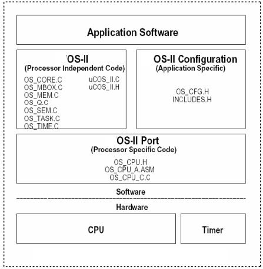

<!-- slide: 16 -->

- 12.2.3 μC/OS-II的启动过程
- Bootloader执行完毕后，调用应用程序主文件(通常是main.c)里的main()函数。main()函数在执行过程中，除硬件初始化函数和用户函数外，按以下次序执行三个函数：
- （1）操作系统初始化函数OSInit()；
- （2）任务创建函数OSTaskCreate；
- （3）任务调度开始函数OSStart()。
- 一旦OSStart()函数开始执行，就标志着μC/OS-II进入了多任务调度的正常运行状态。

<!-- slide: 17 -->

- 12.3 uC/OS-II操作系统移植
- 要使μC/OS-II正常运行，处理器必须满足以下要求：（1）处理器的C编译器能产生可重入代码；（2）用C语言就可以打开和关闭中断；（3）处理器支持中断，并且能产生定时中断（通常在10至100Hz之间）；（4）处理器支持能够容纳一定量数据（可能是几KB）的硬件堆栈；（5）处理器有将堆栈指针和其他CPU寄存器读出和存储到堆栈或内存中的指令。
- STM32微控制器满足以上的条件，所以可以把μC/OS-II移植到此芯片中。要移植一个操作系统到一个特定的CPU 体系结构上并不是一件很容易的事情，它对移植者有以下要求：（1）对目标体系结构要有很深了解；（2）对OS原理要有较深入的了解；（3）对所使用的编译器要有较深入的了解；（4）对需要移植的操作系统要有相当的了解；（5）对具体使用的芯片也要一定的了解。

<!-- slide: 18 -->

- 12.3.1移植规划
- 移植μC/OS-II需要在OS_CPU.H包含几个类型的定义和几个常数的定义；在OS_CPU_C.C和OS_CPU_A.ASM中包含几个函数的定义和时钟节拍中断服务程序的代码。实际上，还有一个includes.h文件需要关注，因为每一个应用都包含独特的includes.h 文件。
- 移植文件说明
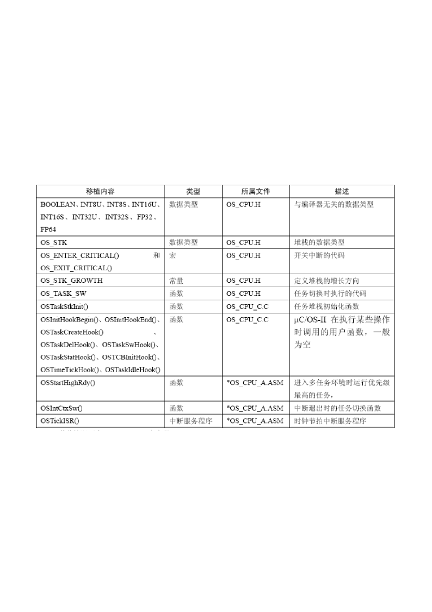

<!-- slide: 19 -->

- 12.3.2 修改代码
- 1.编写os_cpu.h
- （1）不依赖于编译的数据类型
- μC/OS-II不使用C语言中的short、int、long等数据类型的定义，因为它们与处理器类型有关，隐含着不可移植性。代之以移植性强的整数数据类型，这样，既直观又可移植，不过这就成了必须移植的代码。
- （2）OS_STK_GROWTH
- μC/OS-II使用结构常量OS_STK_GROWTH中指定堆栈的生长方式：
- 置OS_STK_GROWTH为0，表示堆栈从下往上长。
- 置OS_STK_GROWTH为1，表示堆栈从上往下长。
- 虽然ARM处理器核对于两种方式均支持，但RealView MDK的C语言编译器仅支持一种方式，即从上往下长，并且必须是满递减堆栈，所以OS_STK_GROWTH的值为1，代码见程序清单：
- #define OS_STK_GROWTH  1     /* Stack grows from HIGH to LOW memory on ARM */

<!-- slide: 20 -->

- （3）打开和关闭中断方式
- 在μC/OS-II中，有些代码在执行过程中不容许被打断，这部分代码称为临界区代码。在执行临界区代码的过程中，一定要关闭中断；在执行后要打开中断。在打开和关闭中断有三种方式。所以在这部分代码中要选择所使用的方式。
- 如：#define  OS_CRITICAL_METHOD    3
- 我们选择第三种方式。在μC/OS-II中，可以通过：OS_ENTER_CRITICAL()和OS_EXIT_CRITICAL()来控制系统关闭或者打开中断。
- #if      OS_CRITICAL_METHOD == 3
- #define OS_ENTER_CRITICAL() (cpu_sr = OSCPUSaveSR()) /* Disable interrupts*/
- #define  OS_EXIT_CRITICAL() (OSCPURestoreSR(cpu_sr)) /* Restore  interrupts*/
- #endif

<!-- slide: 21 -->

- 2. 编写os_cpu_c.c
- （1）OSTaskStkInit()
- 在编写此函数之前，必须先确定任务的堆栈结构。而任务的堆栈结构是与CPU的体系结构、编译器有密切的关联。本移植的堆栈结构如图所示。
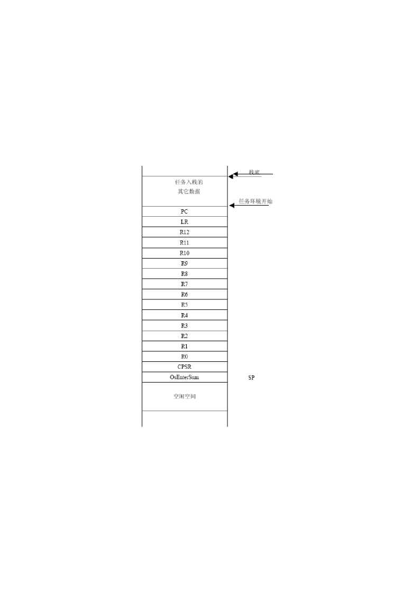
- （2）…Hook()函数
- μC/OS-II有很多由用户编写的…Hook()函数，它在本移植中全为空函数，用户可以按照μC/OS-II的要求修改它。

<!-- slide: 22 -->

- 3. 编写os_cpu_a.s
- （1）OSStartHighRdy()函数
- 此函数是在osstart()多任务启动之后，负责从最高优先级任务的tcb控制块中获得该任务的堆栈指针SP，通过SP依次将CPU现场恢复，这时系统就将控制权交给用户创建的该任务进程，直到该任务被阻塞或者被其他更高优先级的任务抢占CPU。
- 该函数仅仅在多任务启动时被执行一次，用来启动第一个，也就是最高优先级的任务执行，之后多任务的调度和切换就是由下面的函数来实现。
- （2）void OSCtxSw(void)函数
- 任务级的上下文切换，它是当任务因为被阻塞而主动请求CPU调度时被执行，由于此时的任务切换都是在非异常模式下进行的，因此区别于中断级别的任务切换。它的工作是先将当前任务的CPU现场保存到该任务堆栈中，然后获得最高优先级任务的堆栈指针，从该堆栈中恢复此任务的CPU现场，使之继续执行。这样就完成了一次任务切换。

<!-- slide: 23 -->

- （3）void OSIntCtxSw(void)函数
- 中断级的任务切换，它是在时钟中断isr（中断服务例程）中发现有高优先级任务等待的时钟信号到来，则需要在中断退出后并不返回被中断任务，而是直接调度就绪的高优先级任务执行。这样做的目的主要是能够尽快地让高优先级的任务得到响应，保证系统的实时性能。它的原理基本上与任务级的切换相同，但是由于进入中断时已经保存过了被中断任务的CPU现场，因此这里就不用再进行类似的操作，只需要对堆栈指针做相应的调整，原因是函数的嵌套。
- （4）OSPendSV()函数
- OSPendSV()是PendSV Handler的中断处理函数名称，它实现了上下文切换。这种实现方式对于 ARM Cortex-M3来说是强烈推荐的。这是因为对于任何异常，ARM Cortex-M3 可以自动的保存（进入异常）和恢复上下文（退出异常）的一部分内容。因此，PendSV handler 只需要保存和恢复R4-R11和堆栈指针这些剩余的上下文。使用了PendSV的异常机制，意味着，无论是由任务触发还是由中断或异常触发的上下文切换都可以用同一种方法实现。

<!-- slide: 24 -->

- 12.4 μC/OS-II内核结构
- μC/OS-II的各种服务都是以任务的形式出现的。在μC/OS-II中，每个任务都有一个唯一的优先级。它是基于优先级可剥夺型内核，适合应用于对实时性要求较高的地方。
- 12.4.1 μC/OS-II的任务状态
- μC/OS-II的每个任务都是一个无限的循环。每个任务都处在休眠态、就绪态、运行态、挂起态和被中断态中的某种状态。
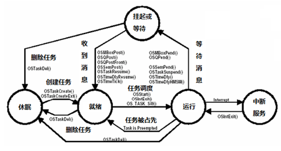

<!-- slide: 25 -->

- （1）休眠(DOEMANT)
- 指任务驻留在程序空间之中，还没有交给μC/OS-II管理，把任务交给μC/OS-II是通过调用下述两个函数之一：OSTaskCreate()或OSTaskCreateExt()。任务一旦建立，这个任务就进入就绪态准备运行。
- （2）就绪(READY)
- 在这种状态下意味着该任务已经准备好，可以运行了，但由于该任务的优先级比正在运行的任务的优先级低，所以还暂时不能运行。
- （3）运行(RUNNING)
- 指得到了CPU控制权正在运行之中的任务状态。因为μC/OS-II是抢占式内核，所以处于运行态的任务一定是当前就绪任务集里优先级最高的任务。
- （4）挂起(PENDING)或等待(WAITING)
- 这是指正在运行的任务由于调用延时函数OSTimeDly()，或等待事件信号量而将自身挂起的状态。
- （5）被中断(INTTERRUPT)
- 发生中断时，CPU提供相应的中断服务，原来正在运行的任务暂停时停止运行，从而进入被中断状态。

<!-- slide: 26 -->

- 12.4.2 任务控制块OS_TCB
- 内核对任务的管理通过任务控制块OS_TCB(Task Control Block)进行。任务控制块是一个数据结构，在任务创建时内核会申请一个空白TCB，然后进行初始化，将创建的任务信息填入该TCB的各个字段。
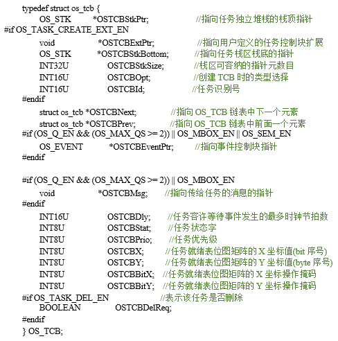

<!-- slide: 27 -->

- 12.4.3 μC/OS-II的任务调度
- 1.μC/OS-II的就绪表
- μC/OS-II的就任务记录在就绪表(ready task table)中。就绪表由变量OSRdyGrp和OSRdyTbl[ ]构成。OSRdyGrp是一个单字节整数变量，OSRdyTbl[OS_LOWEST_PRIO/8+1]是单字节整数数组，其元素个数定义为最低优先级除以8加1，最多可有8个元素（字节）。实质OSRdyTbl[ ]是就绪表的位图映像矩阵，每一位代表一个优先级任务的就绪状态，称为就绪位。
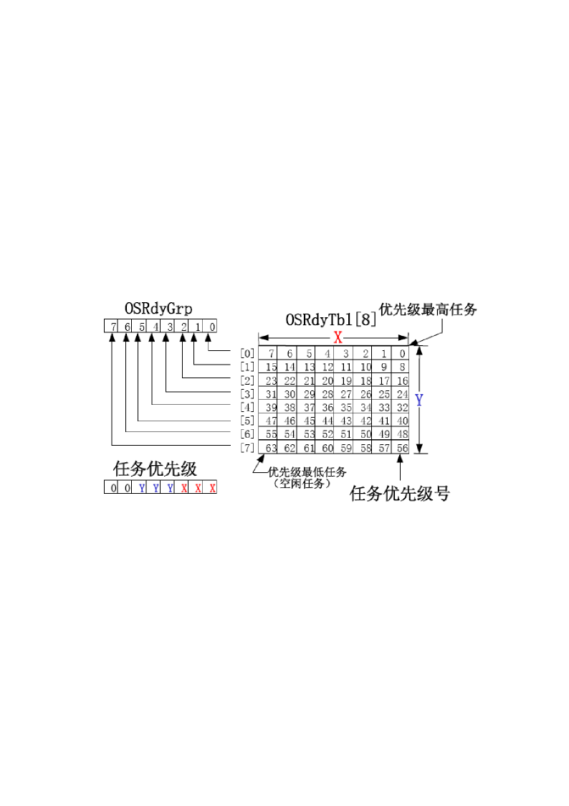

<!-- slide: 28 -->

- 2.任务就绪表的操作
- （1）登记一个新就绪任务：
- OSRdyGrp |= OSMapTbl | [prio>>3];
- OSRdyTbl[prio>>3] |= OSMapTbl[prio & 0x07];
- 例 ：下面操作详细说明如何把优先级为42的任务登记在就绪表中。
- INTU8 prio = 42
- prio >> 3 = 00000101;      //得到Y值
- OSMapTbl[prio>>3] = OSMapTbl[101] = 0b00100000    //得到Y值的位模式字节
- OSRdyGrp |= 0b00100000                 //在OSRdyGrp的第5位置1
- prio & 0x07 = 0b00000010               //得到X值
- OSMapTbl[prio & 0x07] = 0b00000100   //得到X值的位模式字节
- OSRdyTbl[101] = 0b00000100      //在OSRdyTbl[5]的第2位置1
- （2）删除不再处于就绪态任务的指令段：
- if((OSRdyTbl[prio >> 3] &= ~OSMapTbl[prio & 0x07]) ==0)
- OSRdyGrp &= ~OSMapTbl[prio >> 3];
- （3）从就绪表中找到最高优先级的任务
- 以变量OSRdyGrp的值为入口，从常量型的优先级判定表OSUnMapTbl[ ]中得到一个就绪表位图的Y值，然后再以Y值为入口再一次查找OSUnMapTbl[ ]，这样就获得了就绪表位图的X值。最高优先级=8*Y+X。

<!-- slide: 29 -->

- 12.4.4 μC/OS-II的任务切换
- 任务切换(task switch)也称为上下文切换(context switch)。它实质是指任务的CPU寄存器内容的切换。当μC/OS-II内核决定运行另一个任务时，它保存正在运行任务的上下文（也称为工作现场，这就是全部CPU控制寄存器中的内容，有时还包括通用寄存器中的内容）。这些内容保存在任务的自用堆栈中。上下文入栈工作完成后，把下一个将要运行的任务的上下文从该任务自用堆栈中装入CPU的寄存器，然后开始运行该任务。
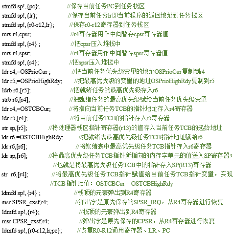

<!-- slide: 30 -->

- 12.4.5 μC/OS-II的中断处理
- μC/OS-II中的中断服务子程序主要用汇编语言编写而成。中断服务子程序在执行前将被中断任务的执行现场保存在自用堆栈，其中断服务过程中有可能释放某些任务所需要的资源，从而使这些任务处于就绪态。当中断服务子程序返回时，如果中断嵌套已经全部退出并且有更高优先级的任务就绪，则优先级最高的就绪任务投入执行。μC/OS-II容许中断嵌套，嵌套层数可达255层。
- 中断服务子程序执行事件处理有两种方法。一种方法是通过OSMBoxPost()、OSQPost()、OSSemPost()等函数去通知真正执行事件处理的任务，让该任务完成中断事件的处理。另一种方法是由中断服务子程序本身完成处理。这两种方法只能选择一种。

<!-- slide: 31 -->

- 12.5 μC/OS-II任务、时间及事件控制块
- 12.5.1 任务管理
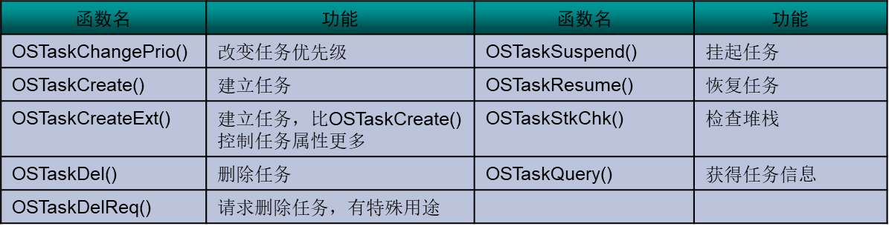
- 其中，OSTaskCreate (void (*task)(void *pd), void *pdata, OS_STK *ptos, INT8U prio)，OSTaskCreate()需要4个参数：task是任务代码的指针，pdata是当任务开始执行时传递给任务的参数的指针，ptos是分配给任务的堆栈的栈顶指针prio是分配给任务的优先级。

<!-- slide: 32 -->

- 每个任务都有自己的堆栈空间。堆栈必须声明为OS_STK类型，并且由连续的内存空间组成。用户可以静态分配堆栈空间(在编译时分配)，也可以动态地分配堆栈空间(在运行时分配)。静态堆栈申明：
- static OS_STK  MyTaskStack[stack_size];
- 或 OS_STK  MyTaskStack[stack_size];
- OS_STK    LEDStk[TASK_STK_SIZE];   //定义任务LED的堆栈
- int main(void) {
- OSInit();                               //函数初始化μC/OS-II内部变量
- OSTaskCreate(LEDTask, (void *)0, &LEDStk[TASK_STK_SIZE - 1], 0);   //创建LED任务
- OSStart();                              //函数启动多任务环境
- }
- 创建一个LEDTask()任务，程序如下：

<!-- slide: 33 -->

- 12.5.2 时间管理
- μC/OS-II能够提供周期性的时钟信号：时钟节拍(clock tick)，用于实现任务的正确延时和超时确认。

| 函数名 | 功能 | 备注 |
|---|---|---|
| OSTimeDly() | 以时钟节拍为单位延时 |  |
| OSTimeDlyHMSM() | 以钟时分秒毫秒为单位延时 |  |
| OSTimeDlyResume() | 恢复延时的任务 | OSTimeDlyHMSM()可能需要多次才能恢复 |
| OSTimeGet() | 获得系统时间 | 以时钟节拍为单位 |
| OSTimeSet() | 设置系统时间 | 以时钟节拍为单位 |
| OSTimeTick() | 时钟节拍处理函数 | 由时钟节拍中断处理程序调用，用户很少使用 |

- 1.时钟节拍中断
- 时钟节拍是由CPU的一个定时器中断来提供的，用户必须在多任务系统启动以后也就是调用OSStart()之后，做的第一件事是初始化定时器中断。
- 2. 时钟管理函数

<!-- slide: 34 -->

- 实例：控制一个LED以一个2个时钟节拍的时间闪烁。
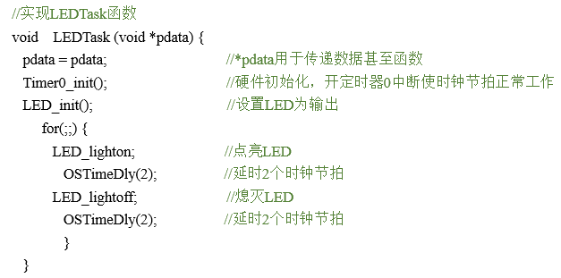

<!-- slide: 35 -->

- 12.5.3 事件控制块
- 一个任务或者中断服务子程序可以通过事件控制块ECB（Event Control Blocks）来向另外的任务发信号。
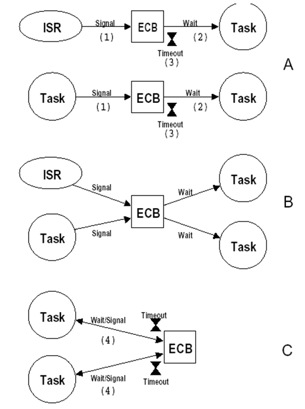
- 事件控制块是信号量管理、互斥型信号量管理、消息邮箱管理和消息队列管理的基本数据结构。
- OSEventPtr指针，只有在所定义的事件是邮箱或者消息队列时才使用。当所定义的事件是邮箱时，它指向一个消息，而当所定义的事件是消息队列时，它指向一个数据结构。
- OSEventTbl[]和OSEventGrp包含的是等待某事件的任务。
- OSEventCnt 当事件是一个信号量时，OSEventCnt是用于信号量的计数器。
- OSEventType定义了事件的具体类型。它可以是信号量、邮箱或消息队列中的一种。
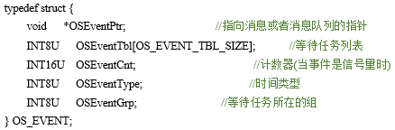

<!-- slide: 36 -->

- 12.6互斥信号量mutex
- 12.6.1 互斥信号量mutex介绍
- 在嵌入式应用中互斥信号量mutex的作用主要是：
- 1. 实现对资源的独占式访问（二值信号量）。
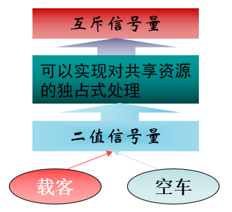

<!-- slide: 37 -->

- 优先级列表
- 任务1
- 任务2
- 任务3
- 高
- 低
- 共享资源
- 假设任务1和任务3共享一个资源，任务2为优先级介于任务1和任务3之间的一个与该共享资源无关任务，分析优先级反转问题。
- 任务2优先级高于任务3而进入运行状态
- 任务1申请共享资源而处于等待状态
- 此时，虽然任务1比任务2优先级更高，但却在任务2之后运行，这种现象就是优先级反转。
- 任务3得到共享资源而处于运行状态
- 优先级反转问题。

<!-- slide: 38 -->

- 假设任务1和任务3共享一个资源，使用互斥信号量进行资源同步，任务2为优先级介于任务1和任务3之间的一个与该共享资源无关任务，通过互斥信号量解决优先级反转问题。
- 此时，任务2无法在任务1之前得到运行，不发生优先级反转
- 2. 解决优先级反转问题。
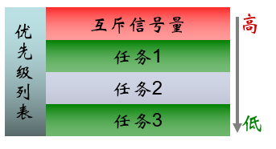
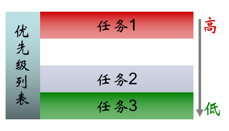
- 任务1获得CPU，且优先级升到互斥信号量优先级
- 任务2优先级不够高无法获得CPU

<!-- slide: 39 -->

- 互斥信号量操作:
- （1）在嵌入式，经常使用互斥信号量访问共享资源实现资源的同步。通过OSMutex()函数实现互斥信号量的创建。
- （2）OSMutexPost()发送互斥信号量函数与OSMutexPend()等待互斥信号量函数必须成对出现在同一个任务调用的函数中。
- （3）信号量最好在系统初始化时创建，不要在系统运行的过程动态低创建和删除。在确保成功创建信号量之后，才可对信号量进行接收和发送操作。
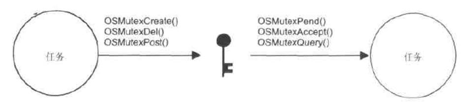
- 其中在互斥信号量(mutex)操作中，涉及如下函数：互斥信号量创建函数OSMutexCreate()；互斥信号量删除函数OSMutexDel()；发送互斥信号量OSMutexPost()；等待互斥信号量OSMutexPend()；查看互斥信号量OSMutexAccept(；取得互斥信号量的状态OSMutexQuery()。

<!-- slide: 40 -->

- 12.6.2 互斥信号量mutex实例
- 【例12.1】 有两个任务Task1和Task2，它们都调用SendBuf()函数--向串口发送出”hello/r/n”（注/r/n表示换行符）。
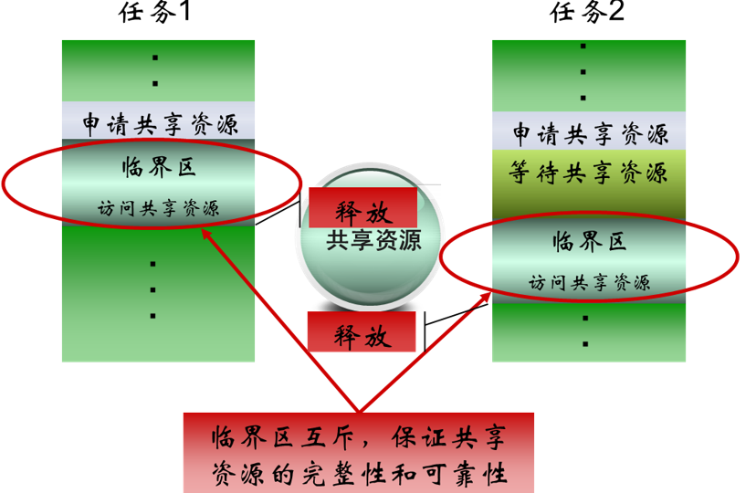

<!-- slide: 41 -->

- 具体程序：
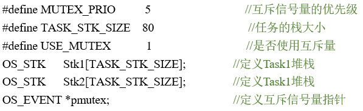
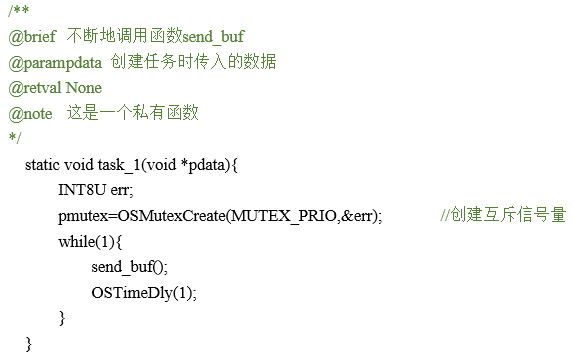
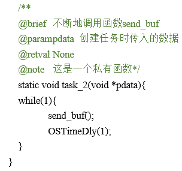
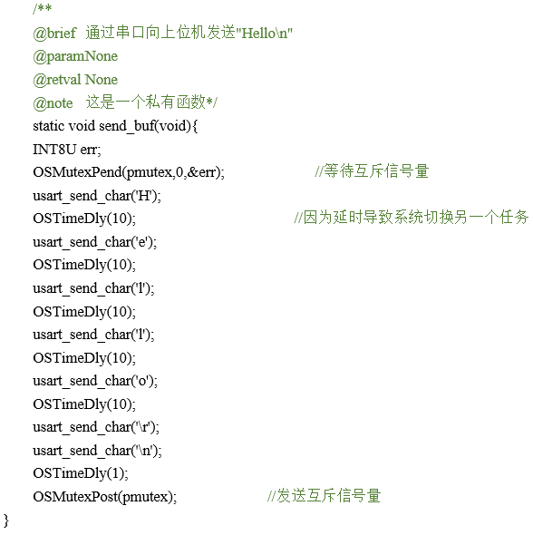
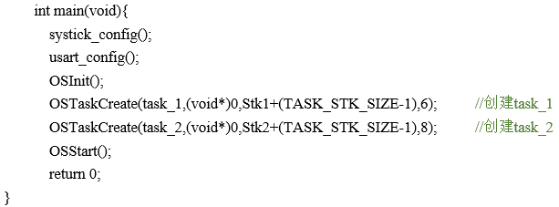

<!-- slide: 42 -->

- 在程序中没有用到互斥信号量和用了互斥量的两种结果分别如:
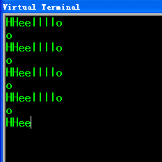
- 没用互斥量的结果
- 用互斥量的结果
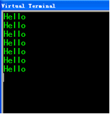

<!-- slide: 43 -->

- 在实时多任务系统中，信号量被广泛用于：任务间对共享资源的互斥、任务和中断服务程序之间的同步、任务之间的同步。
- 12.7 信号量
- 12.7.1 概述
- μC/OS-II提供了5个对信号量进行操作的函数。它们是：建立一个信号量OSSemCreate()，等待一个信号量OSSemPend()，发送一个信号量OSSemPost()，无等待地请求一个信号量OSSemAccept()和查询一个信号量的当前状态OSSemQuery()函数。

- 计数信号量与互斥信号量做对比

<!-- slide: 44 -->

- 信号量值加1
- 信号量值减1
- 当任务调用OSSemPost()函数发送信号量时:
- 当信号量值大于0，任务调用OSSemPend()函数接收信号量时:
- 在使用一个信号量之前，首先要建立该信号量，也即调用OSSemCreate()函  数。当任务调用OSSemPost()函数发送信号时，信号量加1。
- 如果任务调用OSSemPend()函数接收信息时信号量大于0，即信号量有效，则信号量的值减1，等待信号量的任务执行。如果OSSemPend()函数接收信息时信号量等于0，则等待信号量的任务处于等待的状态。

<!-- slide: 45 -->

- μC/OS-II不允许在中断服务程序中等待信号量。
- 信号量到来，正常返回
- 延时到，无信号量，返回超时错误
- 当信号量值等于0，任务调用OSSemPend()函数接收信号量时。
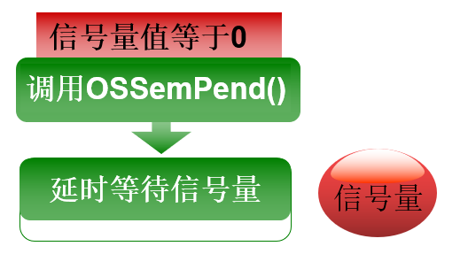
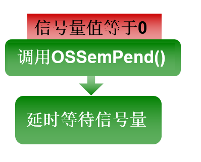

<!-- slide: 46 -->

- 在实际的应用中，常用信号量实现任务间的同步，OSSemPend()和OSSemPost()会出现在不同任务的不同函数中，但不一定成对出现。
- 注意：在实际的应用中，还有多对多、一对多信号量操作的情况，但很不常见，建议读者不要设计出这样的操作方式，因为这样会带来很多的麻烦。
- 一对一同步
- 多对一同步
- 12.7.2信号量任务同步实例

<!-- slide: 47 -->

- 【例12.2】  创建2个任务，1个任务向串口分别发送“A”和”B”，另一个任务向串口发送”C”和“D”。这两个任务分别不用信号量同步和使用信号量同步。
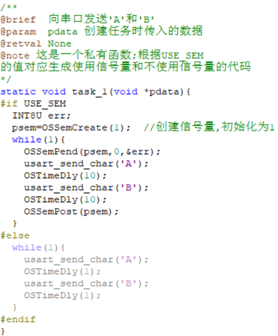
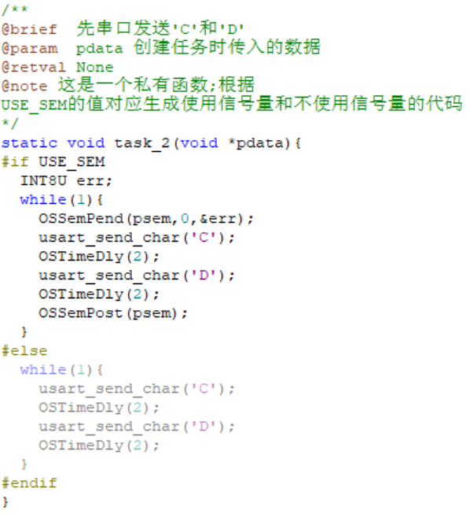
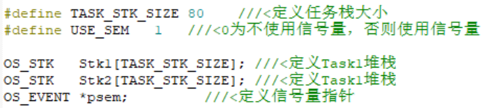

<!-- slide: 48 -->

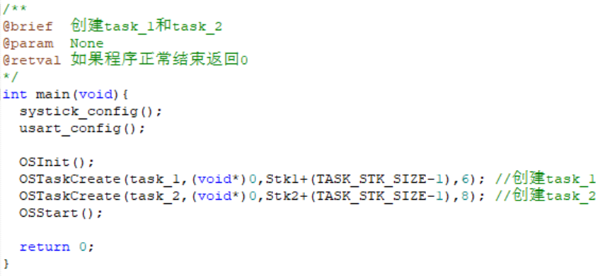
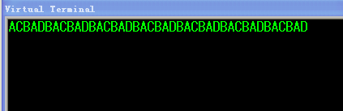
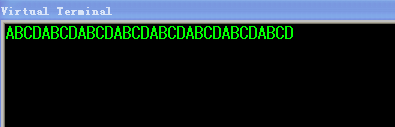
- 没有使用信号量实现同步
- 用信号量实现同步

<!-- slide: 49 -->

- 12.7.3信号量资源共享实例
- 在嵌入式系统中，经常使用信号量访问共享资源来实现资源同步。在使用时，注意发送信号量函数OSSemPost()与等待信号量函数OSSemPend()必须成对出现在同一个任务调用的函数中，才能实现资源同步。
- 在嵌入式系统中，经常使用信号量来实现多个任务之间的同步。而用来实现任务间同步的信号量在创建时初始值可以为0或者1，这是由OSSemCreate()函数来实现的。
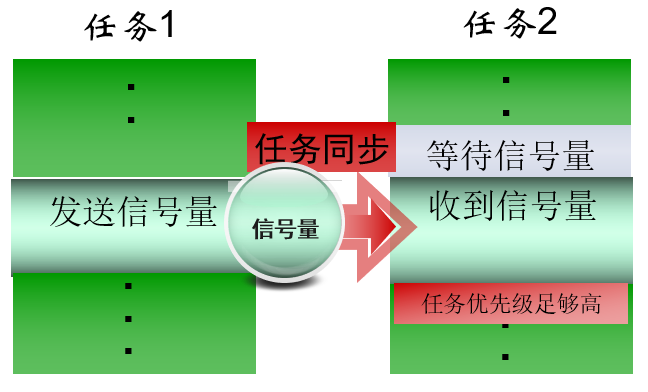

<!-- slide: 50 -->

- 【例12.3】  有两个任务Task1和Task2，它们都调用SendBuf()函数向串口发送出”hello/r/n”（注/r/n表示换行符）。在这个过程中需要用到信号量。
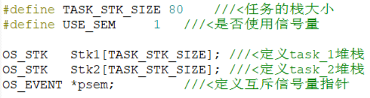
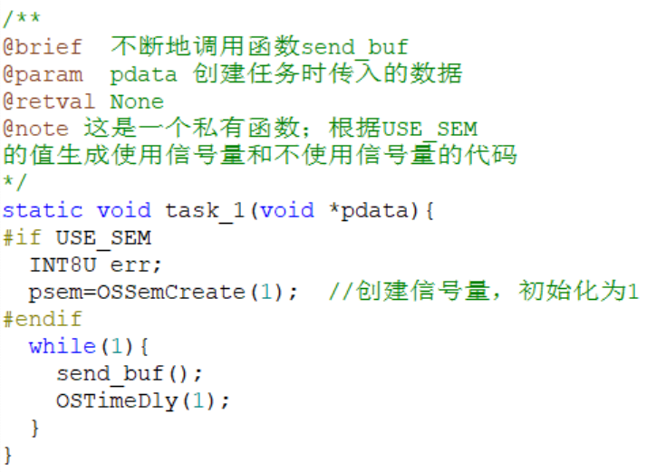
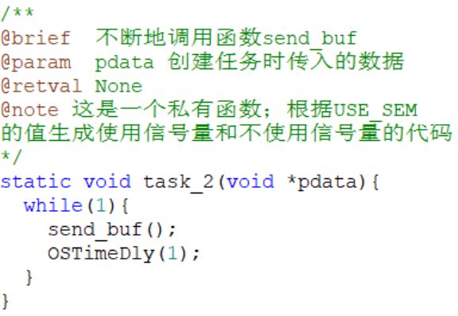

<!-- slide: 51 -->

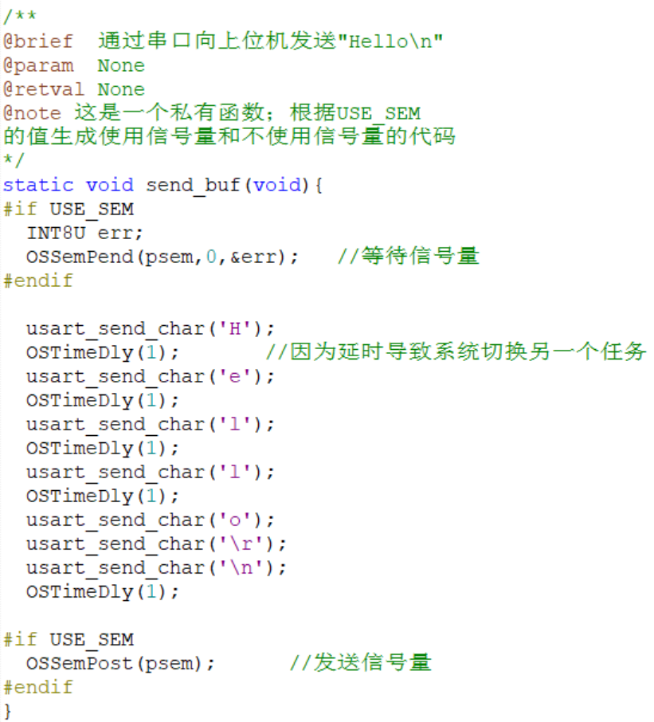
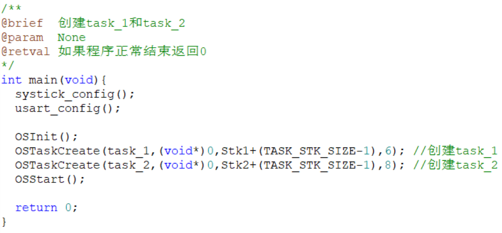
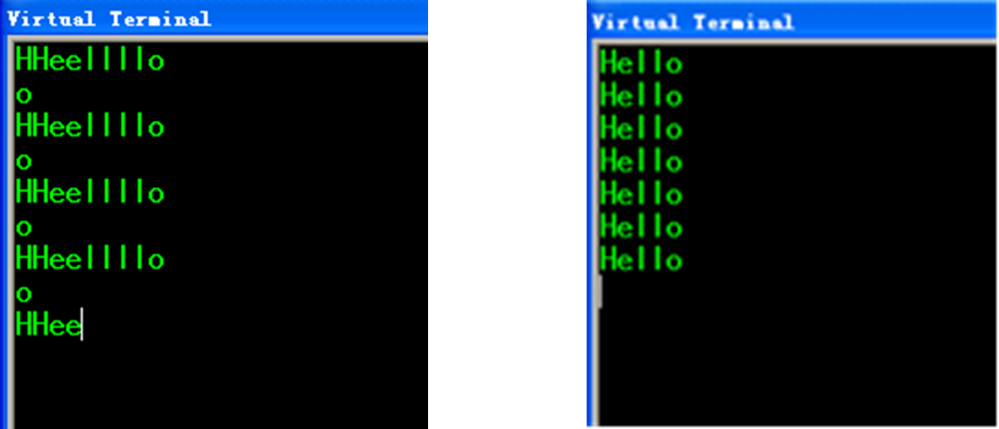
- 使用信号量
- 不使用信号量

<!-- slide: 52 -->

- 12.7.4 ISR与任务同步
- 【例12.4】 按钮接到STM32芯片引脚PD2。如图12.13所示，当按钮按下产生外部中断，在外部中断中写数据到Buf，本例中是把从0开始每次按下按钮累加1的数据写到Buf（当数据大于或等于256时，又从0开始累加）；同时创建一个任务Task1，不停地通过串口发送Buf的数据。
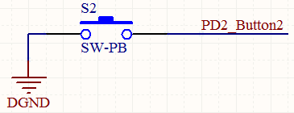
- 在程序中没有用到信号量和用了信号量的两种结果分别如下：
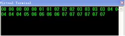

- 没有用到信号量的结果
- 在中断服务程序发送信号量

<!-- slide: 53 -->

- 主要程序清单
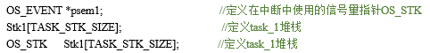
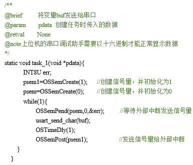
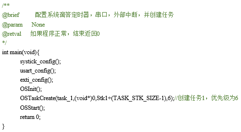
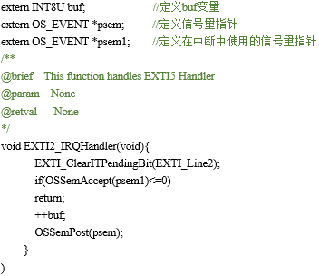

<!-- slide: 54 -->

- 12.8 事件标志组
- 当任务要与多个事件同步时，就要使用事件标志组。一个事件标志就是一个二值信号，事件标志组是若干二值信号的组合。使用事件标志组同步任务分为独立性同步和关联性同步。假设一个任务与3个事件标志有关。
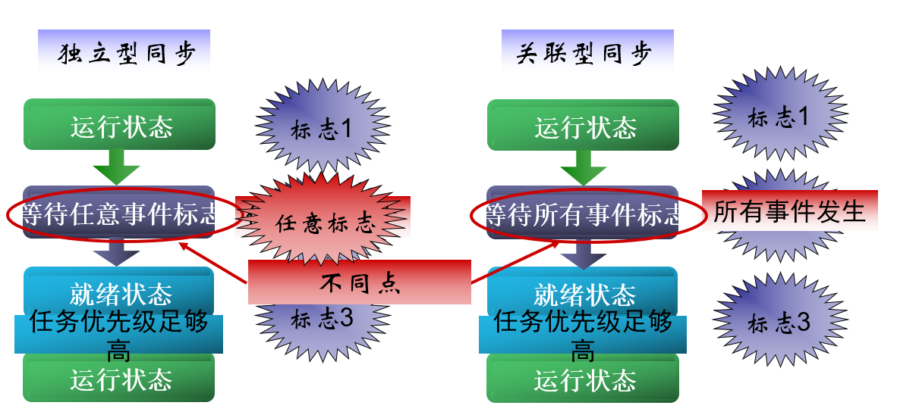

<!-- slide: 55 -->

- 可以用多个事件的组合发信号给多个任务，典型的有8个、16个或32个事件可以组合在一起。每个事件占1位(bit)，以32位的情况较多。任务或中断服务可以给某一位置位或复位，当任务所需的事件都发生了，该任务继续执行，至于哪个任务该继续执行了，是在一组新的事件发生时判定的，也就是在事件位进行置位时做判断。事件标志组与任务、中断关系图如下：
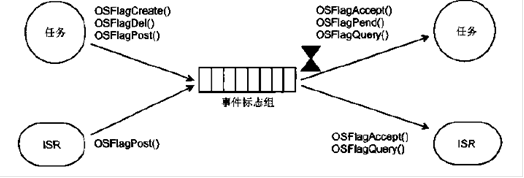
- 事件标志组相关函数有：建立并初始化一个事件标志组OSFlagCreate()，设置事件标志位OSFlagPost()，用于取得事件标志组的状态OSFlagQuery()函数，等待事件标志组的指定事件标志OSFlagPend()，删除事件标志组OSFlagDel()函数和无等待地获取标志组中的指定事件标志OSFlagAccept()。

<!-- slide: 56 -->

- 12.8.2事件标志组操作
- 1.标志“与”操作
- 以下例来说明如何使用标志事件组实现任务与若干个事件都发生同步。注意在用事件标志组操作时，要在OS_CFG.H文件中#define  OS_FLAG_EN  1。
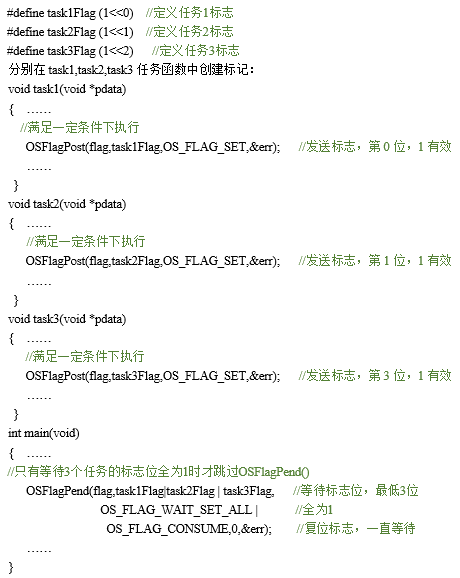

<!-- slide: 57 -->

- 如果采用标志“或”操作，只需修改对应OSFlagPend函数的参数如下：
- OSFlagPend(flag,task1Flag|task2Flag | task3Flag,         //等待标志位，最低3位
- OS_FLAG_WAIT_SET_ANY |                                         //任意为1
- OS_FLAG_CONSUME,0,&err);                     //复位标志，一直等待
- 2. 标志“或”操作

<!-- slide: 58 -->

- 12.9消息邮箱
- 12.9.1 概述
- 消息是任务之间的一种通信手段，当同步过程需要传输具体内容时就不能使用信号量，此时可以选择消息邮箱，即通过内核服务可以给任务发送带具体内容的消息。
- 一个邮箱只能存放一个消息指针
- 用来传递消息缓冲区指针的数据结构就是消息邮箱。
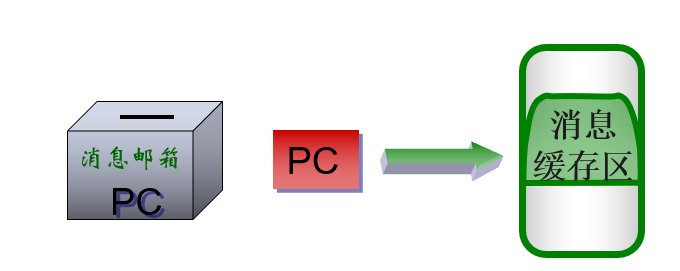

<!-- slide: 59 -->

- （1）向消息邮箱发送消息
- 1.邮箱服务 和 2.邮箱状态
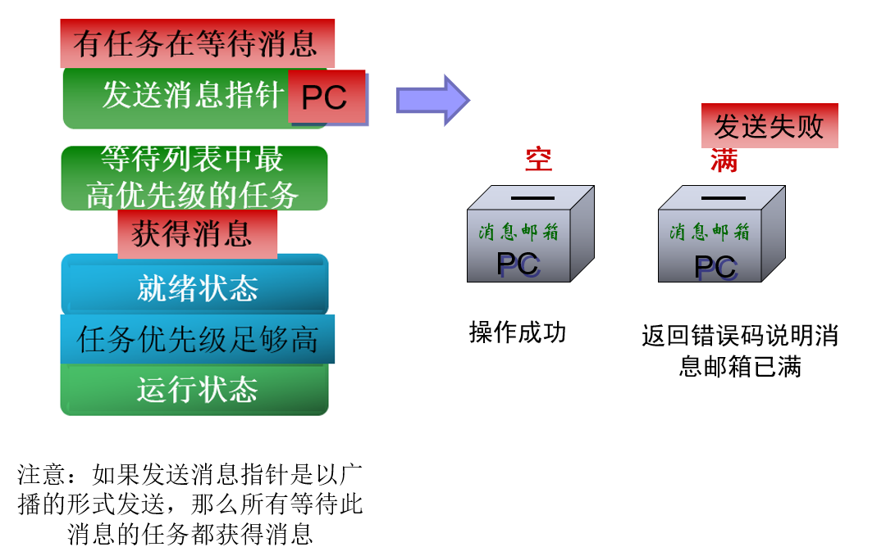

<!-- slide: 60 -->

- （2）从消息邮箱接收消息
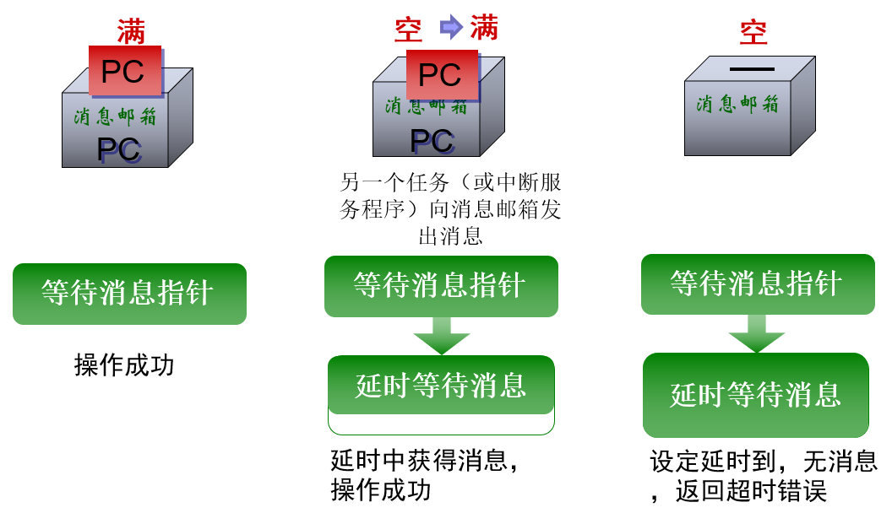

<!-- slide: 61 -->

- 3.消息邮箱的工作方式
- （1）一对一
- （2）多对一
- 这种工作方式最简单，也是最常用的
- 这种工作方式也经常使用

<!-- slide: 62 -->

- （3）一对多
- 这种工作方式虽然不常见，但还是有极少场合使用，比如智能仪器仪表常常采用声、光与短信报警信号输出功能就是典型的一对多工作方式的应用
- 消息邮箱函数有：建立并初始化一个消息邮箱OSMboxCreate()、任务等待消息OSMboxPend()、取得消息邮箱的信息OSMboxQuery()，通过消息邮箱向任务发送消息OSMboxPost()，查看指定的消息邮箱是否有需要的消息OSMboxAccept()，删除消息邮箱OSMboxDel()和OSMboxPost()的扩展OSMboxPostOpt()。

<!-- slide: 63 -->

- 12.9.2 消息邮箱操作
- 用一个一对多的消息邮箱通信实例来描述消息邮箱操作的过程。
- 【例12.5】 通过一个按钮（引脚连接PB2）控制LED，当按钮按下时，点亮LED，并向串口发送0x55；当按钮弹开时，熄灭LED，并向串口发送0x88。
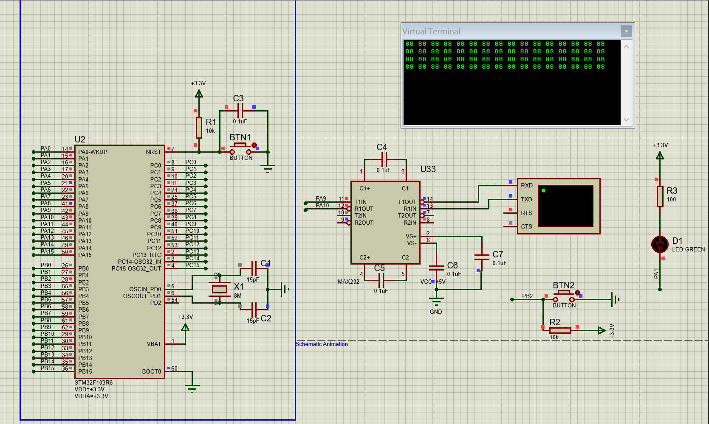

<!-- slide: 64 -->

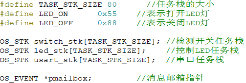
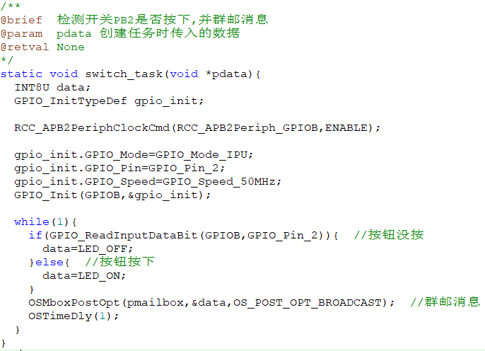
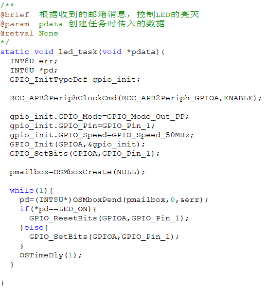
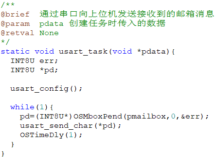
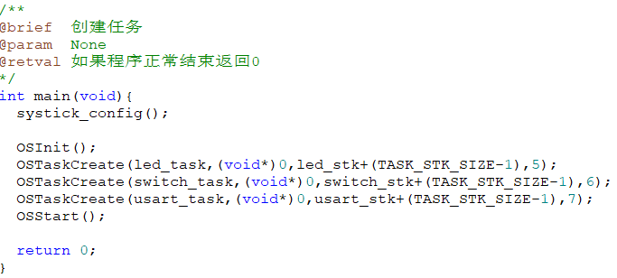

<!-- slide: 65 -->

- 消息队列的使用方法类似于邮箱，其遵循先进先出(FIFO)的原则，μC/OS-II也容许使用后进先出方式(LIFO)，即提高该消息在队列中的优先级实现LIFO算法。
- 通过消息队列实现任务与任务之间及ISR发送和接收消息，实现数据的通信和同步。消息队列具有一定的容量，可以容纳多条消息，因此可以看成是多个邮箱的组合。
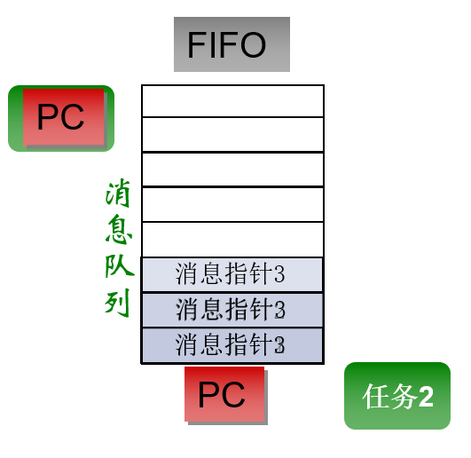
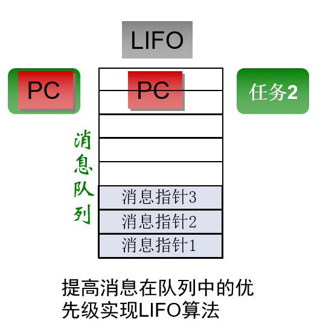
- 12.10 消息队列
- 12.10.1 概述

<!-- slide: 66 -->

- 1.内核提供以下消息队列服务
- （1）消息队列初始化，队列初始化时总是清为空。
- （2）将消息放入队列中去(POST)。
- （3）等待消息的到来(PEND)，允许用户定义一个最长的等待时间Timeout作为它的参数，这样可以避免该任务无休止地等待下去。
- PEND
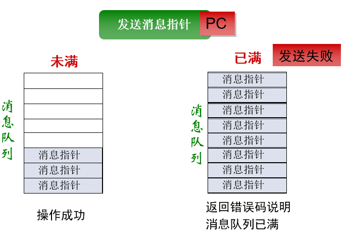
- POST
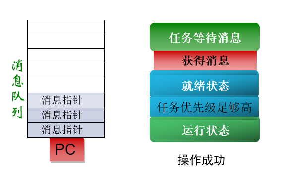
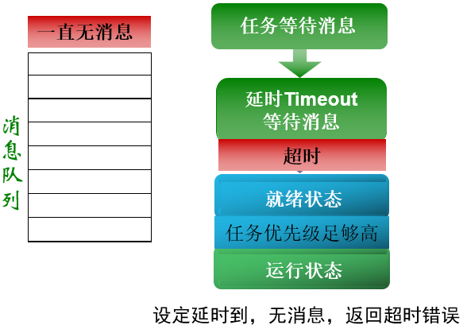

<!-- slide: 67 -->

- 2.消息队列的状态
- （1）空状态。消息队列中没有任何消息。
- （2）满状态。消息队列中的每个存储单元都存放了消息。
- （3）正常状态。消息队列中有消息但又没有到满的状态。
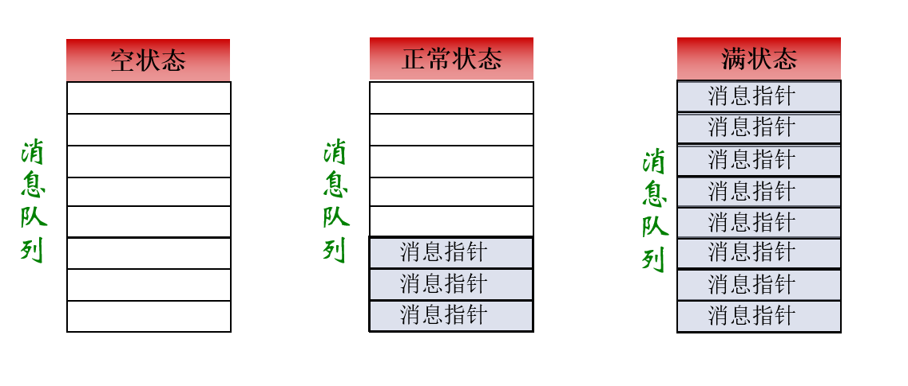

<!-- slide: 68 -->

- 3.消息队列工作方式
- （1）一对一工作方式。即发送一个任务发送消息到消息队列，而另一个任务从消息队列中读取消息。
- （2）多对一工作方式。即多个任务发送消息到同一个消息队列，而另外有一个任务从这个队列中读取消息。

- （3）一对多的工作方式。即只有一个任务发送消息到消息队列，而另外有多个任务从这个消息队列中读取消息。
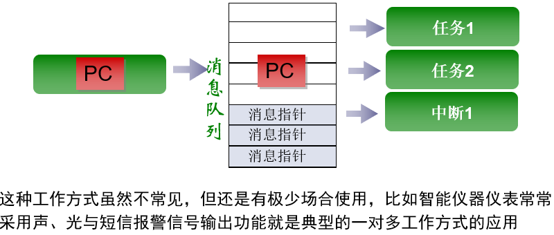

<!-- slide: 69 -->

- 消息队列的主要函数有：建立一个消息队列OSQCreate()，任务等待消息OSQPend()，通过消息队列向任务发送消息OSQPost()，通过消息队列以LIFO方式向任务发送消息OSQPostFront()，检查消息队列中是否已经有需要的消息OSQAccept()，清空消息队列OSQFlush()，取得消息队列的信息OSQQuery()函数和删除消息队列OSQDel()。
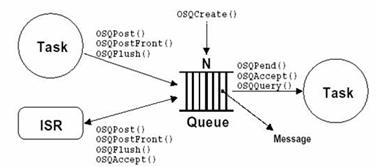
- 消息队列和任务、中断之间关系图

<!-- slide: 70 -->

- 12.10.2 消息队列操作
- 【例12.6】 利用按钮控制串口的输出，当按钮（PD2）按下时，串口发送AA BB两个字节；当按钮打开时，串口发送11 22两个字节。
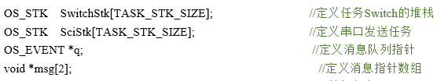
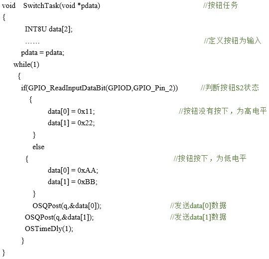
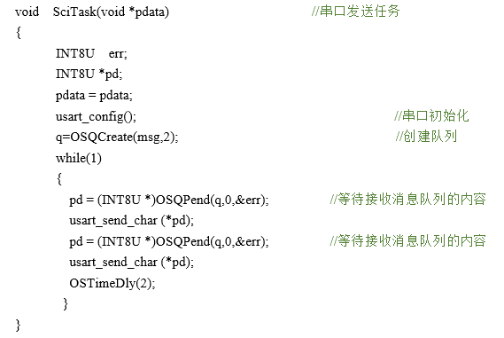
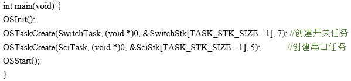

<!-- slide: 71 -->

- 12.11动态内存管理
- 12.11.1 概述
- 在ANSI C中可以用malloc()和free()两个函数动态地分配内存和释放内存。但是，在嵌入式实时操作系统中，多次这样做会把原来很大的一块连续内存区域，逐渐地分割成许多非常小而且彼此又不相邻的内存区域，也就是内存碎片。由于这些碎片的大量存在，使得程序到后来连非常小的内存也分配不到。
- μC/OS-II设计了一套动态内存分配系统。μC/OS-II对malloc()和free()函数进行了改进，使得它们可以分配和释放固定大小的内存块。这样一来，malloc()和free()函数的执行时间也是固定的了。块的大小可以由用户来定义，且可以管理多个堆，每个堆中的块的大小可以不一样。
- 动态内存管理函数主要有：建立并初始化一块内存区OSMemCreate()，释放一个内存块OSMemPut()，从内存区分配一个内存块OSMemGet()，得到内存区的信息OSMemQuery()。

<!-- slide: 72 -->

- 12.11.2动态内存操作实例
- 【例12.7】 使用动态内存管理来实现数据通信。
- 1.初始化
- 2.申请内存
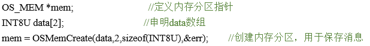
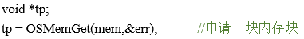

- 3.释放内存

<!-- slide: 73 -->

- 谢谢!
