# ch13综合设计实例

<!-- slide: 1 -->

## 第13章综合设计实例

- 嵌入式微控制器原理及设计
- —基于STM32及Proteus仿真开发
- 配套PPT

<!-- slide: 2 -->

<!-- slide: 3 -->

- 第13章  综合设计实例
- 13.1 嵌入式系统开发流程
- 13.2 嵌入式系统整体开发实例

<!-- slide: 4 -->

- 13.1 嵌入式系统开发流程
- （1）功能：这是用户首先提出的，涉及产品的用途、应用领域、主要功能等方面。
- （2）性能：体现在处理器的处理速度上，产品采用的处理器速度越高，性能越好，而成本就越高，性能和成本相互矛盾。
- （3）成本：产品的成本包含两部分——开发成本和制造成本。
- （4）规格：包括产品的尺寸、重量、功耗等。
- 1.需求分析阶段

<!-- slide: 5 -->

- 2.方案设计阶段
- （1）体系结构设计
- 包括系统是硬实时系统还是软实时系统；软件组成；主要元器件选择；系统的成本、尺寸和耗电量；硬件与软件的划分。
- （2）硬件设计
- 主要完成硬件目标板的设计、调试、测试工作，包括将整个硬件目标板根据功能分成子系统，每个子系统用一个模块完成其功能；元器件选型；设计电路原理图；给出硬件的编程参数。
- （3）软件设计
- 软件设计应采用Top-Down的设计方法，具体为：软件的总体功能设计；模块划分；把模块分解成函数或子程序，定义函数的原型、输入/输出参数和算法，规定函数之间的接口和调用关系；设计出错处理方案。

<!-- slide: 6 -->

- 3.科研开发阶段
- 科研开发阶段主要是根据设计方案，选择开发平台进行软件和硬件开发，完成系统样机。
- （1）选择开发平台：硬件平台、软件平台（嵌入式操作系统）、编程语言和开发工具。
- （2） 硬件开发：根据硬件目标板的设计方案，进行电路原理图的设计、印制电路板设计、制作、焊接、调试、测试等工作。
- （3）软件开发：包括准备交叉开发环境，进行软件开发，编译连接和定位，下装到目标板，调试和测试、代码优化等。

<!-- slide: 7 -->

## 4.系统测试阶段

- （1）硬件测试
- 要完成硬件目标板电路的功能和指标的测试，重点在于指标。
- （2）软件测试
- a. 正确性测试：找到软件中的错误和缺陷并加以修改，以降低产品的维护成本，减少风险。测试方法：黑盒测试、白盒测试、 灰盒测试。
- b. 性能测试：从统计学方面测量其运行时间。
- （3）软件和硬件协同工作测试

<!-- slide: 8 -->

- 13.2 嵌入式系统整体开发实例
- 本书一个小车系统作为实例，介绍一个嵌入式系统整体的开发实例，小车是一个电动车项目，通过直流电机模拟车轮转动，由电位器调节电压控制速度，红外对管进行电机测速，DS18B20检测车内温度，中控OLED显示屏（128×64）显示车辆信息，还有蜂鸣器模拟喇叭，超声波测距模块用于倒车雷达。
- 整个实例的实现功能：通过电位器调速模块可以控制小车的前进速度，当通过超声波测距模块测量到距离信息小于一定数值时，小车停止运动，蜂鸣器会发出声音；在此过程中通过小车轮速测速模块通过PID控制保持小车在一定速度前进，同时可以通过OLED模块可以显示车内的温度数据，障碍物距离信息和小车轮速数据。

<!-- slide: 9 -->

- 13.2.1 小车实例及整体设计
- 整个小车以STM32F103R6为主控芯片，主要由如下几部分构成：（1）STM32F103R6主芯片模块；（2）电位器调速模块；（3）车内温度测量模块；（4）小车轮速测量模块；（5）轮速驱动模块；（6）超声波测距模块；（7）蜂鸣器发声模块；（8）OLED液晶屏显示模块；（9）串行通信模块。
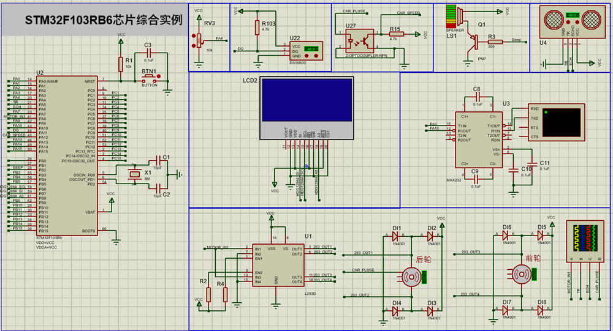

<!-- slide: 10 -->

- 13.2.2 硬件设计说明
- 1. STM32F103R6主芯片电路
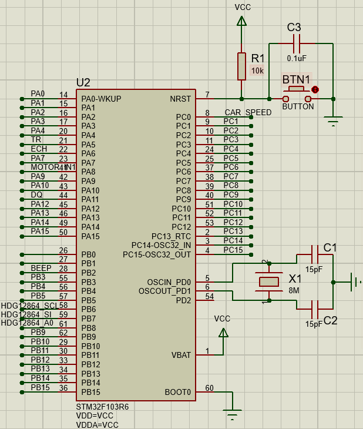
- 主控芯片STM32F103R6电路为芯片正常运行提供了基本电路，其中包括：电源、时钟电路和Reset电路；同时引出相应的接口和整个项目的各模块电路进行通信。

<!-- slide: 11 -->

- 2. 电位器调速电路
- 电位器调速模块主要是通过调节滑动变阻器改变电压，此信号连接在STM32F103R6芯片上的ADC接口，从而可以根据采集到电压的大小控制轮速。具体电路如图13.3所示，滑动变阻器输出连接STM32F103R6芯片的PA4引脚。
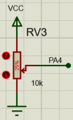

<!-- slide: 12 -->

- 3. 车内温度测量电路
- 车内温度测量主要通过温度传感器芯片DS18B20来实现。
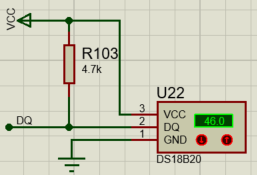
- DS18B20芯片的DQ引脚连接STM32F103R6芯片的PA11引脚。其中DS18B20是常用的数字温度传感器，其输出的是数字信号，采用单总线的接口方式与微控制器连接时仅需要一条口线即可实现微处理器与DS18B20的双向通信。DS18B20的测量范围为-55~+125℃；在-10~+85℃范围内，精度为± 0.5℃。

<!-- slide: 13 -->

- 4. 小车轮速测量电路
- 小车轮速测量是通过对电机的码盘信号进行获取
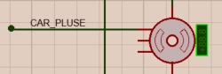
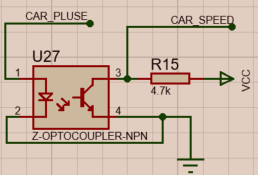
- 小车轮子驱动电机的码盘输出CAR_PLUSE引脚通过一个光电隔离芯片（U27）输出CAR_SPEED引脚并最终与PA12（TIM1_ETR）引脚相连接，电机在转动时候会产生出一系列脉冲，通过对脉冲进行计数从而可以获得电机的转动速度。

<!-- slide: 14 -->

- 5. 轮速驱动模块
- 通过对小车前后2组轮子进行驱动控制小车向前运动
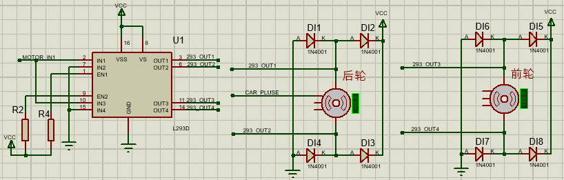
- 为了便于在Proteus中仿真演示，图中“前轮”表示小车前面两个轮子，“后轮”表示小车后面两个轮子，此小车只具有前进和后退功能，并且前轮和后轮控制同时被控制转动。轮子的驱动电路采用L293D驱动芯片实现，它是一款双桥驱动芯片，可同时驱动两路直流电机或一路步进电机，输出电流可达600mA，峰值输出电流可达1.2A，内部自带ESD保护。L293D芯片的293_OUT1和293_OUT2引脚驱动后轮电机转动，293_OUT3和293_OUT4引脚驱动前轮电机转动。
- L293D芯片驱动表
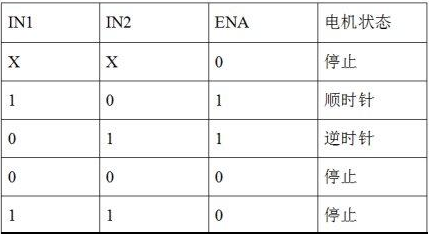

<!-- slide: 15 -->

- 6.超声波测距电路
- 利用超声波测速的原理就是通过超声波发射头发射出一个超声波脉冲，目前常采用40khz，当前方没有障碍物的时候，超声波会一直发射出而不会发生反射，所以在超声波发射头旁边的超声波接收头不可能接收到反射回来超声波信号；但当前方有障碍物时候，超声波传感器发射出的超声波信号在碰到障碍物以后会发生反射，此时在超声波发射头旁边的超声波接收头会接收到反射回来的超声波信号，此时由于接收信号会触发到与控制芯片的连接管脚，从而使控制芯片知道前方有障碍物，并且控制芯片在发送超声波信号的时候会开始定时，当接收到有反射信号返回时，会停止计数，从而获得这一段时间值，并通过这段时间值可计算出障碍物的距离。
- 具体计算公式为
- D=C×T/2
- 式中，D为计算出的障碍物和传感器之间的距离；C为声音的传播速度；T为从发出超声波信号到检测到超声波信号返回的时间间隔。
- Proteus仿真提供了超声波仿真模组，TR连接STM32F103R6芯片的PA5引脚，ECH连接STM32F103R6芯片的PA6引脚（TIM3_CH1捕获口）。
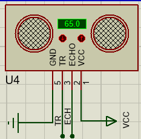

<!-- slide: 16 -->

- 7.蜂鸣器发声电路
- 蜂鸣器电路主要是控制蜂鸣器发出声音。
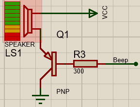
- 蜂鸣器电路输入引脚Beep连接STM32F103R6芯片的PB2引脚，通过控制PB2引脚高电平，蜂鸣器会发声。

<!-- slide: 17 -->

- 8.OLED液晶屏电路
- OLED液晶屏采用HDG12864F-1，该液晶屏是Hantronix的产品，液晶屏控制器采用爱普生SED1565系列芯片，是一种点阵式液晶屏，数据采用串行通信方式，其中液晶屏SI引脚表示接收数据引脚；SCL引脚为串行通信时钟线；A0引脚确定接收到的数据是数据还是控制指令。电路图中OLED液晶屏的SI引脚连接STM32F103R6芯片的PB7引脚，SCI引脚连接STM32F103R6芯片的PB6引脚，A0引脚连接STM32F103R6芯片的PB8引脚。
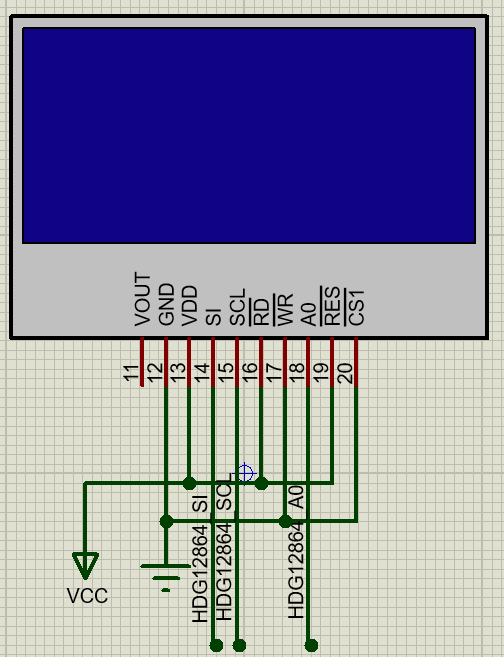

<!-- slide: 18 -->

- 9. 串行通信电路
- STM32F103R6芯片的串口1（UART1）的PA9(TXD)和PA10(RXD)引脚连接到串行虚拟终端上，用于调试信息输出及数据输出。
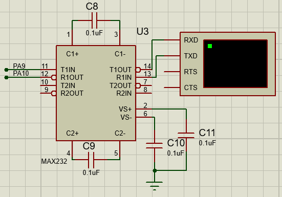

<!-- slide: 19 -->

- 13.2.3 软件设计说明
- 对应硬件设计模块功能，整个软件系统设计如图所示。

<!-- slide: 20 -->

- 若采用裸机实现此系统，整个软件可规划为主程序和中断处理程序两部分：（1）在主程序中，主要运行对时间间隔要求不高的程序，可以包括：电位器调速程序、超声波测距程序、蜂鸣器发声程序、车内温度测量程序、OLED液晶屏显示程序；（2）在中断处理程序中，主要采用定时器更新中断，从而可满足在一定控制周期内实现根据实际小车轮速对小车轮速的驱动控制。
- 根据硬件连接关系，TIM1定时器可能用于小车轮速脉冲计数，TIM3定时器可能用于对超声波传感器返回脉冲宽度的捕获，因此在整体架构中定时中断可以用TIM2定时器来实现。同时在实现定时中断的时间长度方面考虑上，可根据轮速的控制周期进行设定。

<!-- slide: 21 -->

- 1.电位器调速程序
- 通过调节滑动变阻器的数值，从而改变电位器输入到STM32F103R6芯片PA4（ADC12_IN4）引脚的电压值，利用ADC中断或DMA方式对ADC通道4上的输入电压数据进行采集，会获取到一个12位数据，并作为小车轮速的设定值Wm。
- 2. 车内温度测量程序
- 通过读取连接温度传感器芯片DS18B20输出引脚的STM32F103R6芯片PA11引脚上的数据，从而获得当前的车内温度。
- 具体实现思路：通过PA11引脚模拟产生出获取DS18B20温度传感器写信号和读信号，从而配置和获取温度传感器数据。具体的配置命令以及读数据的时序可以参考DS18B20芯片的手册。例如，温度转换指令：0x44（44H），启动DS18B20启动转换温度；读暂存器指令：0xBE（BEH），读取暂存器中的九字节数据等。

<!-- slide: 22 -->

- 3. 超声波传感器测距程序
- Proteus仿真环境模拟HCSR04超声波传感器模块，通过STM32F103R6芯片的PA5引脚向超声波传感器TR引脚发送高电平，脉宽不小于10μs的信号，此时超声波传感器内部会循环发出8个40kHz的脉冲；当前方有障碍物时候，此时超声波传感器ECH引脚会接收到一个如下图那样的回响信号传送给STM32F103R6芯片的PA6引脚（TIM3_CH1捕获口）。其中，高电平持续的时间就是超声波从发射到返回的时间。
- 测试距离=(高电平时间*声速(340M/S))/2
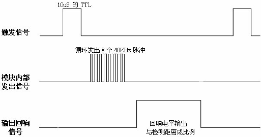
- 程序思路：PA5设置为输出，产生出高电平信号开始进行测距；同时利用捕获模式对回响信号的脉冲宽度进行测量，从而可计算出障碍物距离。注意：在一定的延迟时间内，若检测不到回响信号，则认为前方没有障碍物时，跳出超声波测距程序。

<!-- slide: 23 -->

- 4. 蜂鸣器发生程序
- 编写程序实现对蜂鸣器的控制，通过控制连接蜂鸣器Beep引脚的STM32F103R6芯片PB2引脚为高电平，蜂鸣器发出声音；反之，蜂鸣器没有声音。
- 5.小车轮速测量程序
- 小车轮速测量原理是根据在一定时间内电机码盘产生出脉冲数个数可以计算出小车轮子转动的速度。根据硬件连接图，通过STM32F103R6芯片的PA12（TIM1_ETR）引脚实现对码盘脉冲个数的计数，可以采用两种思路进行程序编程：利用PA12（TIM1_ETR）引脚的外部计数功能实现对外部脉冲的计数；或利用PA12引脚外部中断功能，通过在中断处理程序中做累加计数操作从而实现对外部脉冲的计数。然后根据小车轮子的参数可计算出实际车轮转动的速度和距离，用以作为闭环控制算法中的测量速度Wm和测量距离Dm。

<!-- slide: 24 -->

- 6.小车轮速驱动控制程序
- 根据小车轮速设定速度Ws和测量速度Wm，实现对小车轮速的闭环控制，从而使小车按照设定速度转动。
- （1）闭环控制方法
- 本设计采用PID控制法来对小车的车轮转动的速度进行控制，PID控制器的核心步骤就是：先测量被控量，然后将被控量与人们对它的设定值进行比较，最后通过调整比例参数、微分参数和积分参数对被控量进行修正。

<!-- slide: 25 -->

- 本实例为小车左右轮设计的PID控制算法主要由控制器和被控对象组成，被控对象是小车车轮，被控量是车轮转速，通过码盘测量被控量的值。由于微控制器是数字系统，同时为了减少计算复杂度和中间过程的存储空间，采用增量式PID控制法，只需要记住相邻前两次的输入偏差，就可以得到当前控制量的增量，因此只需要保存上一个控制量的值，通过计算控制量增量便可得到当前控制量的值，计算过程为:
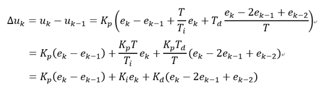
- 其中，T是采样的时间间隔，可用本书前面提到的TIM2定时更新中断实现，PID控制器的输出u(t)是由微控制器输出的PWM信号。Kp、Ki和Kd分别是PID控制器的比例、积分和微分控制系统，这三个参数的调整十分关键，有关对PID控制参数调节的经验如下：
- 1）比例调节的输出与偏差成比例关系，可以直接快速进行调节。
- 2）积分调节的输出是偏差的积分，可以消除比例调节产生的稳态误差。
- 3）微分调节的输出是偏差的变化率，可以超前调节，提前防止过调。

<!-- slide: 26 -->

- （2）PWM控制信号输出
- 控制小车轮速转动PWM控制信号根据硬件电路连接关系，STM32F103芯片PA8引脚（可使用PWM输出功能）连接L293D芯片的IN1和IN3引脚（MOTOR_IN1），通过编写程序在PA8引脚产生出和PID控制器输出u(t)相对应PWM脉宽波形，从而实现对小车车轮的闭环控制。

<!-- slide: 27 -->

- 7.OLED液晶屏程序
- OLED液晶屏HDG12864F-1的SI引脚连接STM32F103R6芯片的PB7引脚，SCL引脚连接STM32F103R6芯片的PB6引脚，A0引脚连接STM32F103R6芯片的PB8引脚。当A0=”H”时，表示是显示的点阵数据，当A0=”L”时，表示是液晶屏的控制数据；/WR为写有效线；/RD为读有效线；/RES引脚当为”L”时初始化液晶屏；/CS1引脚为选通信号，当为”L”时选通此液晶屏。微控制器可以通过向液晶屏SI引脚并配合一定的SCL时钟依次发送串行D7-D0 8位数据，实现对液晶屏数据和控制指令的传送。传送数据就是直接向液晶屏传送显示的数据，而控制指令主要实现对液晶屏的开关、刷新、显示位置控制等内容。
- 例如控制液晶屏显示开或者关的控制指令如下：
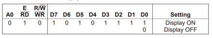
- 其他有关的控制指令操作，可参见HDG12864F-1驱动芯片SED1565系列芯片手册。
- 具体编写程序思路是针对STM32F103R6芯片的PB7（连接SI引脚）、PB6引脚（连接SCL引脚）和PB8引脚（连接A0引脚），控制这些引脚产生出驱动芯片SED1565的读写脉冲波形，并根据手册中的指令数据说明实现对控制指令和显示数据的写入。

<!-- slide: 28 -->

- 8.串口调试显示程序
- 直接调用串口通信程序实现显示整个系统运行过程中的调试信息以及数据信息。
- 9.整体决策程序
- 此部分程序主要是实现各模块程序之间状态切换，可以根据状态机的思路实现如下功能：通过电位器调速模块可以控制小车的前进速度，当通过超声波测距模块测量到距离信息小于一定数值时，小车停止运动，蜂鸣器会发出声音；在此过程中通过小车轮速测速模块通过PID控制保持小车在一定速度前进，同时可以通过OLED模块可以显示车内的温度数据，障碍物距离信息和小车轮速数据。

<!-- slide: 29 -->

- 10.嵌入式操作系统实现方案
- 前面说明程序的实现过程主要是基于裸机程序方案进行实现的。本实例也可以在嵌入式操作系统下进行实现，只需要根据各个程序子模块的内容设计出合适的任务数和内容。
- 最简单的思路就是每个子程序都设计成一个任务，例如针对本实例就可以设计出9个任务出来，依次设置好相应的优先级，启动运行这9个任务即可。

<!-- slide: 30 -->

- 任务划分的目标；
- （1）首要目标是满足“实时性”指标：即使在最坏的情况下，系统中所有对实时性有要求的功能都能够正常实现；
- （2）任务数目合理：对于同一个应用系统，合理的合并一些任务，使任务数目适当少一些还是比较有利；
- （3）简化软件系统：一个任务要实现其功能，除需要操作系统的调度功能支持外，还需要操作系统的其他服务功能支持，合理划分任务，可以减少对操作系统的服务要求，简化软件系统；
- （4）降低资源需求：合理划分任务，减少或简化任务之间的同步和通信需求，就可以减少相应数据结构的内存规模，从而降低对系统资源的需求。

<!-- slide: 31 -->

- 任务的优先级安排原则如下：
- （1）频繁性：对于周期性任务，执行越频繁，则周期越短，允许耽误的时间也越短，故应该安排的优先级也越高，以保障及时得到执行；
- （2）中断关联性：与中断服务程序（ISR）有关联的任务应该安排尽可能高的优先级，以便及时处理异步事件，提高系统的实时性。如果优先级安排得比较低，CPU有可能被优先级比较高的任务长期占用，以至于在第二次中断发生时连第一次中断还没有处理，产生信号丢失现象；
- （3）关键性：任务越关键安排的优先级越高，以保障其执行机会；
- （4）快捷性：在前面各项条件相近时，越快捷（耗时短）的任务安排的优先级越高，以使其他就绪任务的延时缩短；
- （5）紧迫性：因为紧迫任务对响应时间有严格要求，在所有紧迫任务中，按响应时间要求排序，越紧迫的任务安排的优先级越高。紧迫任务通常与ISR关联；
- （6）传递性：信息传递的上游任务的优先级高于下游任务的优先级。如信号采集任务的优先级高于数据处理任务的优先级。

<!-- slide: 32 -->

- 谢谢!
