# ch1嵌入式系统与微控制器

<!-- slide: 1 -->

## 第1章嵌入式系统与微控制器

- 嵌入式微控制器原理及设计
- —基于STM32及Proteus仿真开发
- 配套PPT

<!-- slide: 2 -->

<!-- slide: 3 -->

## 第1章 嵌入式系统与微控制器

- 1.1 嵌入式系统相关概念
- 1.2 微控制器系统
- 1.3 嵌入式系统开发
- 1.4 微控制器芯片的发展趋势

<!-- slide: 4 -->

## 1.1 嵌入式系统相关概念

- 1.1.1 什么是嵌入式系统？
- 内涵上定义：嵌入式系统是以应用为中心、计算机技术为基础，软、硬件可裁剪，适应应用系统对功能、可靠性、成本、体积、功耗严格要求的专用计算机系统。
- 外延上定义：把数字计算机系统分成通用计算机和嵌入式系统两大类。通用计算机是指如微型计算机(PC)、大型计算机、服务器等，除此之外的计算机称为嵌入式系统。

<!-- slide: 5 -->

- 1.1.2 嵌入式系统的特点
- 嵌入式系统有如下特点：嵌入式系统功耗低，体积小，专用性强。
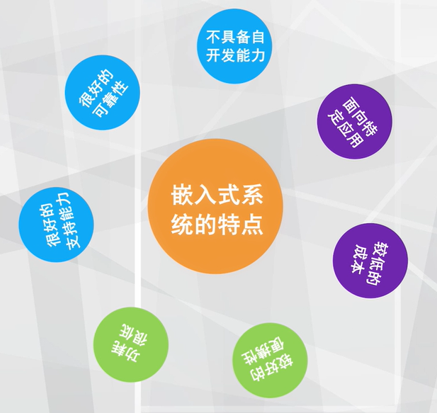

<!-- slide: 6 -->

- 1.1.3 嵌入式系统的主要组成
- 1.基本电路—电源
- 电源电路为嵌入式系统提供工作电源，目前嵌入式系统芯片常用的电源为5V和3.3V两种电压，一般常用稳压芯片例如78XX或LM1113-XX等系列稳压芯片产生供电电压。
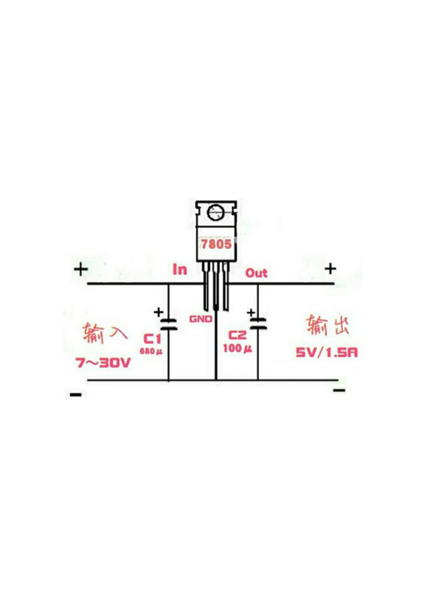
- 产生5V电压：

<!-- slide: 7 -->

- 2.基本电路—重启电路
- 重启电路主要包括上电重启电路和按钮重启电路：
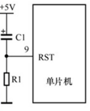
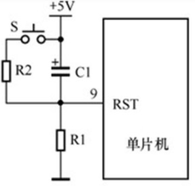
- 上电复位
- 按钮复位

<!-- slide: 8 -->

- 3.基本电路—时钟电路
- 常用外部有源时钟源或无源晶振振荡电路连接嵌入式芯片的时钟输入接口，从而提供工作时钟，根据芯片的特点时钟源一般从几KB到几百MB。
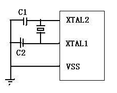
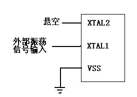
- 外接外部有源时钟
- 无源晶振电路
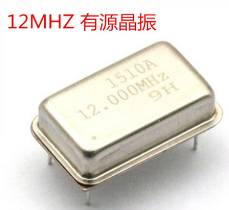
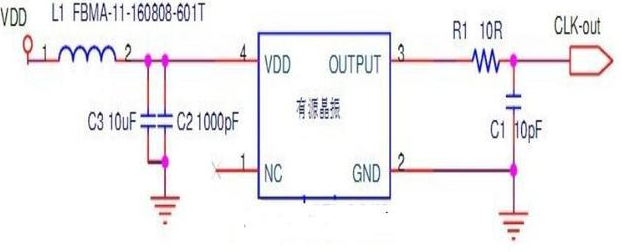
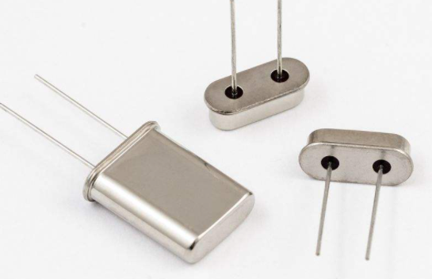

<!-- slide: 9 -->

- 4.存储电路
- 嵌入式芯片需要存储程序和数据才能实现正常工作，所以存储电路也是必不可少的。存储芯片主要分为RAM和ROM两大类别，其中RAM主要用于存放数据，ROM主要用于存放程序。

<!-- slide: 10 -->

- 随机存储器RAM
- 随机存储器（RAM）的任意存储单元都可以以任意次序进行读/写操作。主要有静态RAM (SRAM)和动态RAM(DRAM)两种类型。
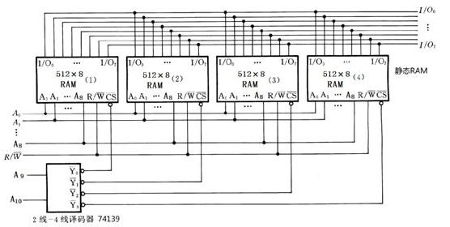
- 静态RAM连接示例图
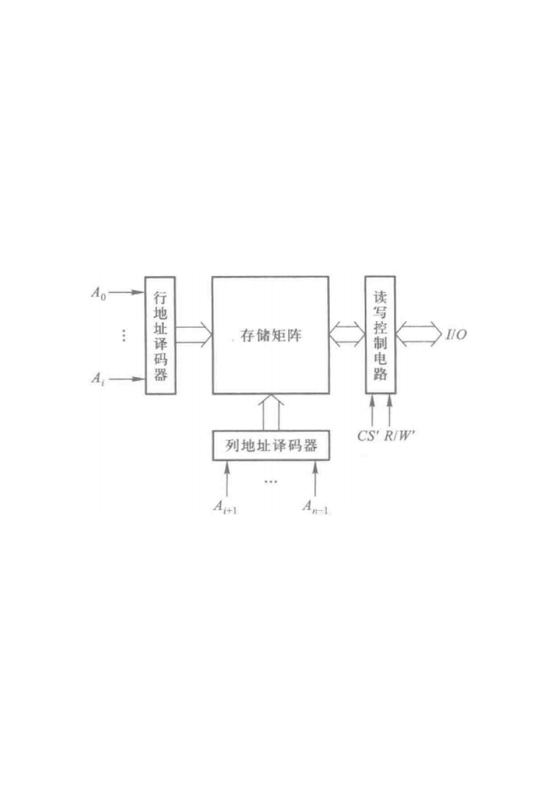
- 动态RAM内部结构

<!-- slide: 11 -->

- 只读存储器ROM
- 掩模ROM：掩膜ROM中的信息是厂家根据用户给定的程序或数据对芯片进行掩膜（一种半导体工艺）而制造出来的。
- PROM：PROM属于一次性编程的只读存储器。它出厂时处于未被编程的状态，里面的内容全是1。
- EPROM：EPROM是可以被擦除并且反复被编程的，EPROM的擦除需要使用紫外线。
- EEPROM：EEPROM是电可擦除可编程的。
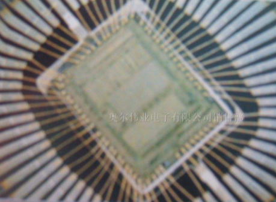
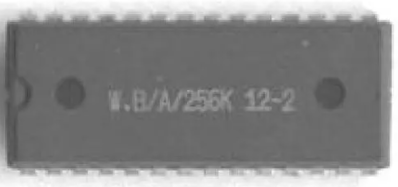
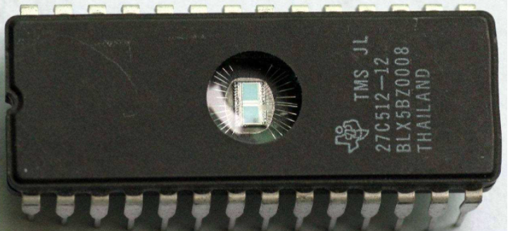
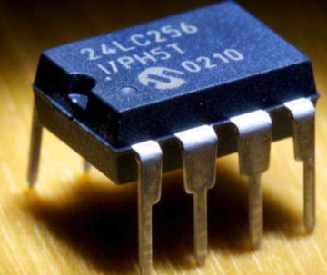
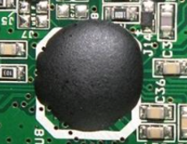

<!-- slide: 12 -->

- Flash存储器：快闪存储器（Flash）技术是存储器技术的最新发展，使用标准电压擦写和编程。主要有两类：NAND Flash和NOR Flash。
- NAND Flash主要有两种用途：一种是用作存储卡；另一种用途是用作嵌入式系统的程序存储器；NAND Flash使用复杂的I/O口来串行地存取数据，各个产品或厂商的方法可能各不相同。
- NOR Flash有两种形式，一种是嵌入式处理器上集成了Flash，另一种是片外扩展Flash，操作包括写入和读出。
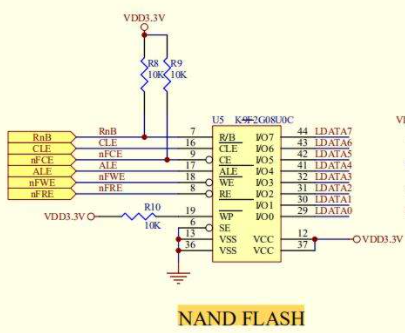
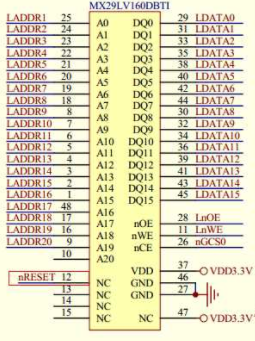

<!-- slide: 13 -->

- 其他常用接口电路
- 通用输入/输出接口(GPIO)：GPIO是I/O的最基本形式，它是一组输入引脚或输出引脚。
- 按键接口：按键输入使用。
- 显示接口：8段数码管LED显示和LCD显示。
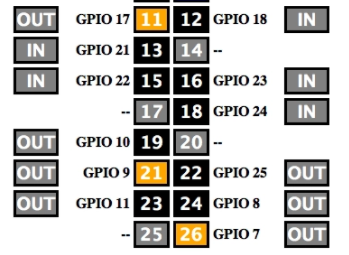
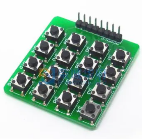
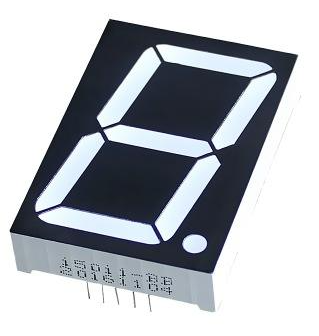
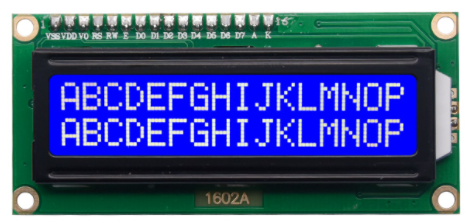

<!-- slide: 14 -->

- 串口：串行通信是指使数据一位一位地进行传输而实现的通信。与并行通信相比，串行通信具有传输线少、成本低等优点，特别适合远距离传送；缺点是速度慢。目前常见的通信模式有UART（异步串行通信）和SPI（同步串行通信）。
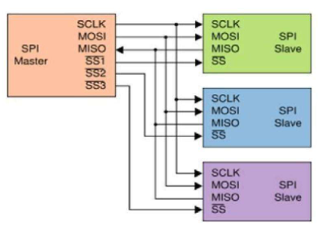
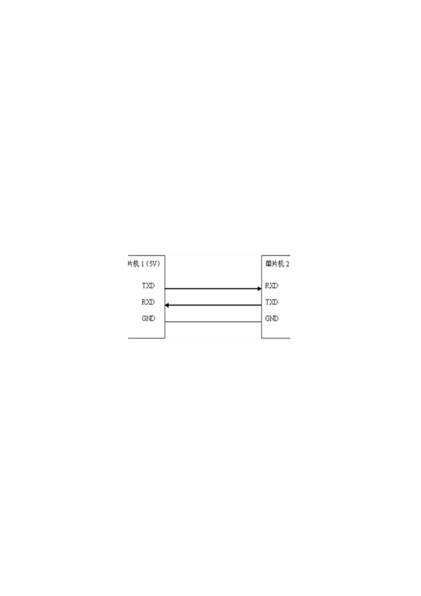
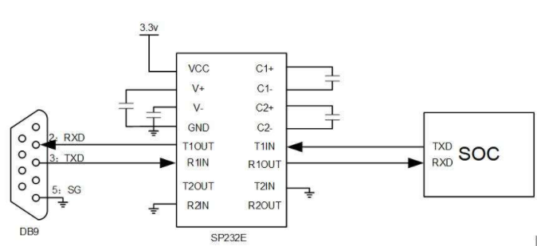
- UART
- UART to RS232
- SPI

<!-- slide: 15 -->

- 总线接口：I2C总线(双向二线制半双工同步串行总线)，CAN总线(控制器局域网总线)，RS-485总线（半双工工作方式，支持多点异步串行数据通信）。
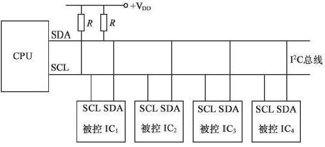
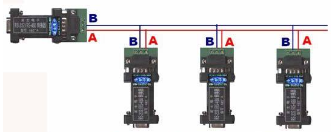
- I2C总线
- RS-485总线
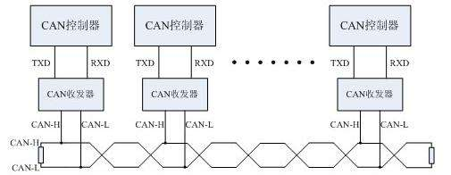
- CAN总线

<!-- slide: 16 -->

## 1.1.4 嵌入式系统类型

- 嵌入式系统芯片可以分成4类：嵌入式微控制器(Microcontroller Unit，MCU）、嵌入式微处理器(MPU，Microprocessor Unit)、嵌入式数字信号处理器（DSP，Digital Signal Processing）和嵌入式片上系统(System On Chip，SOC)。
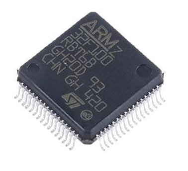
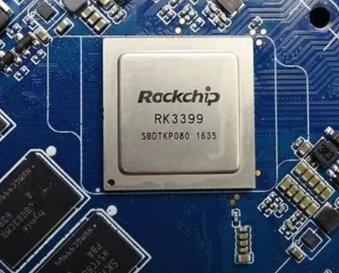
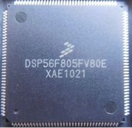
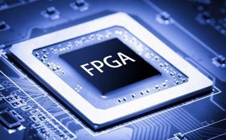
- MCU
- MPU
- DSP
- SOC

<!-- slide: 17 -->

- 嵌入式微控制器:有很好的集成性，把RAM、Flash和各种外设都集成在一个芯片中，因此芯片最大程度地单片化，集成度高；
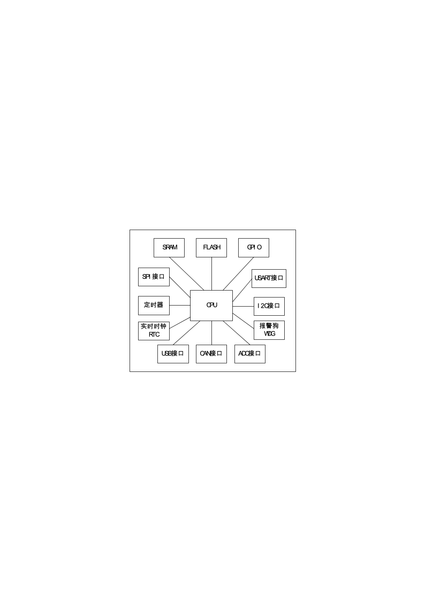

<!-- slide: 18 -->

- 嵌入式微处理器芯片:采用外部的DDR SDRAM内存存储数据，外部的NAND Flash存储器来存储程序，并且嵌入式微处理器芯片内部集成了内存管理单元(MMU)，所以嵌入式微处理器芯片可以运行Linux系统、Android系统、苹果系统等大型嵌入式操作系统。
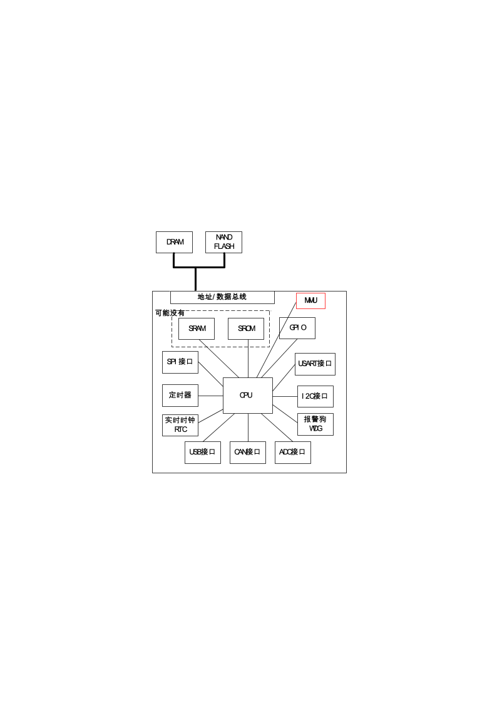

<!-- slide: 19 -->

- 嵌入式数字信号处理器（DSP）:芯片内部集成了硬件乘法器、浮点运算单元以及卷积运算器等运算硬件模组，因此可以采用一个指令就可以实现浮点乘法运算，这就很大提高了运算效率。
- （1）多总线结构。
- （2）流水线操作。
- （3）专用的硬件乘法器。
- （4）特殊的DSP指令。
- （5）多机并行运行特性。
- （6）快速的指令周期。
- （7）低功耗。
- （8）高的运算精度。
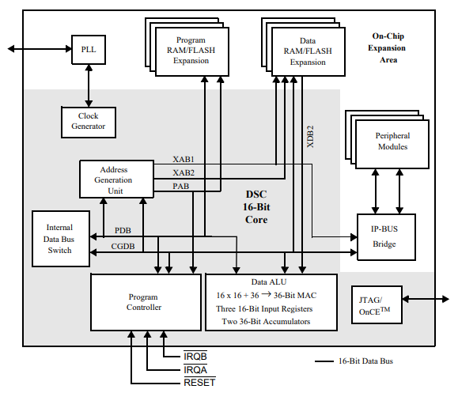
- XAB1和XAB2两条数据总线
- DSP56F805 DSP芯片存储结构

<!-- slide: 20 -->

- 嵌入式片上系统（SOC）:例如FPGA芯片，可以通过硬件逻辑语言VHDL或Verilog直接实现硬件功能，因此可编程芯片在做开发过程中有很大的灵活性，可以开发自己专有内核，即IP核。同时由于随着并行技术的发展，可编程逻辑芯片程序可以由任意多个进程控制模块组成，因此十分适合开发并行计算。
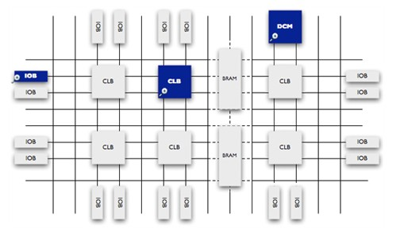
- 可编程门阵列 (FPGA) 是由通过可编程互连连接的可配置逻辑块 (CLB) 矩阵构成的可编程半导体器件。

<!-- slide: 21 -->

## 1.2 微控制器系统

- 嵌入式微控制器(MicroController Unit，MCU)，最大特点是单片化，体积大大减小，从而使功耗和成本下降、可靠性提高，因此也称为单片机。从70年代末单片机出现到今天，虽然已经经过了20多年的历史，但这种８位的电子器件目前在嵌入式设备中仍然有着极其广泛的应用。微控制器芯片内部集成ROM/EPROM、RAM、总线、总线逻辑、定时/计数器、看门狗、I/O、串口、脉宽调制输出、A/D、D/A、Flash RAM、EEPROM等各种必要功能和外设。微控制器是目前嵌入式系统工业的主流。微控制器的片上外设资源一般比较丰富，适合于控制，因此称为微控制器。
- 1.2.1 嵌入式微控制器特点

<!-- slide: 22 -->

- 最早内核是由Intel公司(80C31、80C51、87C51，80C32、80C52、87C52) 提出，后来衍生出多家公司的51单片机。
- 如：STC51系列 宏晶科技（国产）目前出货量很大
- ATMEL公司：89C51、89C52、89C2051等；
- 还有Philips、华邦、Dallas、Siemens(Infineon)等公司的许多产品
- 51系列单片机（8位单片机）
- 1.2.2 微控制器芯片型号及发展历史

<!-- slide: 23 -->

## AVR系列单片机(www.atmel.com)

- 1997年,由ATMEL公司挪威设计中心的A先生与V先生利用ATMEL公司的Flash新技术, 共同研发出RISC精简指令集的高速8位单片机，简称AVR。相对于出现较早也较为成熟的51系列单片机，AVR系列单片机片内资源更为丰富，接口也更为强大，同时由于其价格低等优势，在很多场合可以替代51系列单片机。
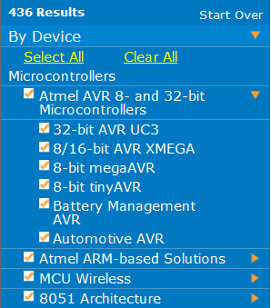

<!-- slide: 24 -->

## PIC系列单片机

- 由美国微芯科技公司，美国微芯半导体　　Microchip公司设计生产（www.microchip.com)。
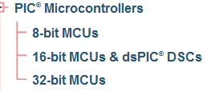
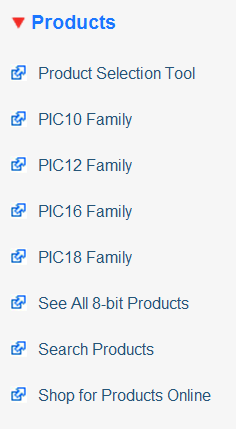

<!-- slide: 25 -->

## 飞思卡尔（freescale）系列单片机

- 由美国飞思卡尔公司(原Motorola公司) 生产http://www.freescale.com.cn
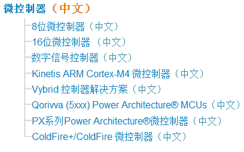
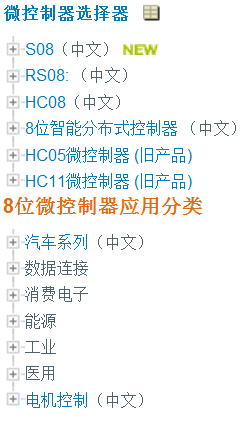

<!-- slide: 26 -->

- 恩智浦(NXP)系列单片机
- NXP（恩智浦）是2006年末从飞利浦公司独立出来的半导体公司，其业务已拥有五十年的悠久历史，主要提供各种半导体产品与软件，为移动通信、消费类电子、安全应用、非接触式付费与连线，以及车内娱乐与网络等产品带来更优质的感知体验。芯片内核主要采用51单片机核(如P89LPC系列)和ARM内核(如LPC1100, LPC1200, LPC1300等系列)。

<!-- slide: 27 -->

- TI MSP430系列单片机
- TI MSP430系列单片机是一个16位的单片机，采用了精简指令集（RISC）结构，可编制出高效率的源程序。
- 运算速度快：MSP430 系列单片机能在25MHz晶体的驱动下，实现40ns的指令周期。并且16位的数据宽度、40ns的指令周期以及多功能的硬件乘法器（能实现乘加运算）相配合，能实现数字信号处理的某些算法（如FFT等）。
- 同时超低功耗:MSP430 单片机之所以有超低的功耗，是因为其在降低芯片的电源电压和灵活而可控的运行时钟方面都有其独到之处。

<!-- slide: 28 -->

- ST公司 STM8 系列单片机
- STM8系列是意法半导体公司生产的8位的单片机。该型号单片机分为STM8A、STM8S、STM8L三个系列。STM8A：汽车级应用;STM8S：标准系列;STM8L：超低功耗MCU。高级STM8内核，具有3级流水线的哈佛结构。

<!-- slide: 29 -->

## ARM单片机(Cortex-M)

- 近年来ARM公司开始设计针对单片机的ARM内核，并设计出了cortex-M 系列单片机内核。
- Cortex-M 系列针对成本和功耗敏感的 MCU 和终端应用（如智能测量、人机接口设备、汽车和工业控制系统、大型家用电器、消费性产品和医疗器械）的混合信号设备进行过优化。
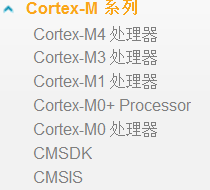
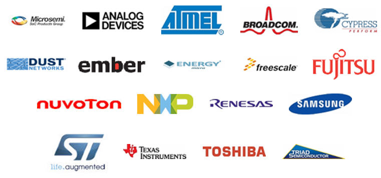

<!-- slide: 30 -->

## 常用的Cortex-M系列芯片内核

- （1）ST（意法半导体）的STM32单片机采用Cortex-M3内核，如STM32F103，STM32F105, STM32F107等系列单片机。
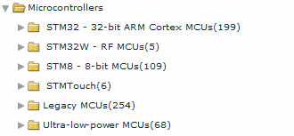
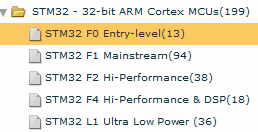

<!-- slide: 31 -->

## （2）NXP公司的ARM核芯片

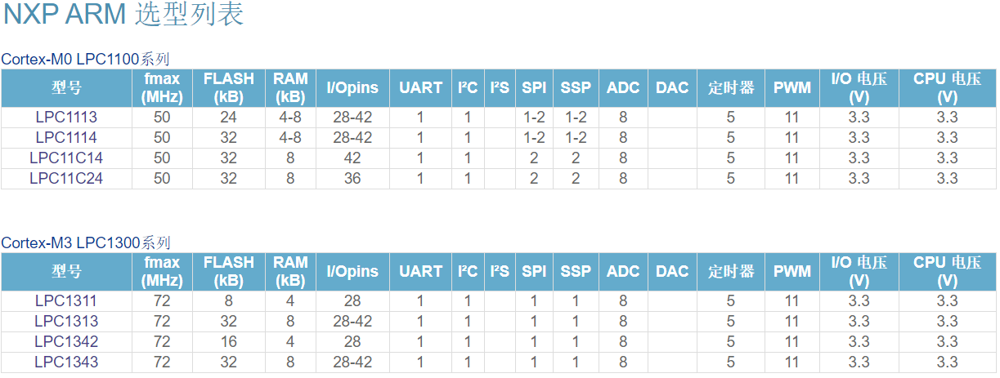
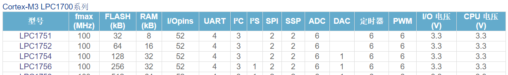
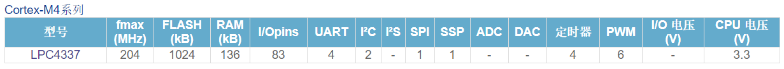

<!-- slide: 32 -->

## （3）Ti（德州仪器公司）的Stellaris MCU 系列，采用了Cortex内核。

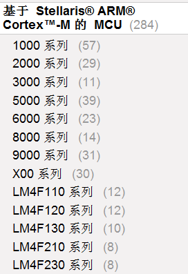
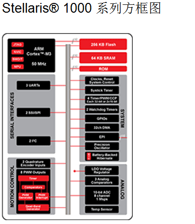

<!-- slide: 33 -->

- ARM 开芯计划
- http://www.freecpu-china.com/

<!-- slide: 34 -->

- RISC-V架构
- RISC-V（发音为“risk-five”）是一个基于精简指令集（RISC）原则的开源指令集架构（ISA）。
- 与大多数指令集相比，RISC-V指令集可以自由地用于任何目的，允许任何人设计、制造和销售RISC-V芯片和软件。
- 嘉楠勘智K210芯片
- 阿里玄铁910
- 芯来科技芯片
- NXP织女星开发板
- ……
- https://github.com/riscv

<!-- slide: 35 -->

- 嘉楠勘智K210芯片

<!-- slide: 36 -->

- 阿里玄铁910
- 玄铁910，“玄铁”之名取自金庸笔下第一神剑，号称是目前业界性能最强的一款RISC-V处理器，可应用于5G、人工智能以及自动驾驶等领域。这款IP Core将向开发者开放，全球开发者可以免费下载该处理器的FPGA代码。
- 1）玄铁C910官网介绍：
- https://www.t-head.cn/product/c910?spm=a2ouz.12987056.0.0.2cb96245CRx1Tp&lang=zh
- 对910感兴趣的话，
- 可以a) 申请910的远程云评估或者：
- b) 申请FPGA代码申请请发送信息（姓名、所属公司及职位、联系电话、公司邮箱）致邮箱xuantie910_service@service.alibaba.com
- 2）：资源下载地址，如有提示登陆，请简单注册后再打开该地址。
- C910 Linux Buildroot: Buildroot包，内置依赖的软件包免下载，make编译后按readme可在qemu上运行linux
- C910 Linux image: 编译好的image包，按照readme可直接在qemu上运行https://occ.t-head.cn/community/download_detail?id=575996958993285120
- 玄铁910仿真平台：含使用视频，指导手册，支持Synopsys的VCS和Cadence的IRUN。https://occ.t-head.cn/community/download_detail?id=643604837828657152

- 玄铁902: https://github.com/T-head-Semi/wujian100_open

<!-- slide: 37 -->

- 芯来科技芯片

<!-- slide: 38 -->

- NXP织女星开发板

- 主控芯片：恩智浦的RV32M1， 四核异构：两个ARM核，两个RISC-V核，自带无线功能。
- 板载调试器：基于LPC4322的FreeLink调试器，默认为CMSIS固件，升级为Jlink固件后可调试ARM核和RISC-V内核。
- 调试接口：两个ARM核共用一个JTAG调试口，两个RISC-V核共用一个JTAG调试口，可能是由于PCB空间大小的限制，这两个2*5P的接口并不是通用的2.54mm间距的排针，而是比较少用的1.25的排针，对于手头没有这种接口排线的朋友，可能不是很方便的使用，不过我们有万能的淘宝。
- RF射频电路：板载有射频电路，当然也留有了J16天线端子的位置。
- 串行Flash：美信的MX25R3235FZNIL0，4MB串行闪存，可以存储一些非易失性数据。
- 加速度和磁力传感器：恩智浦的FXOS8700CQ，六轴传感器，IIC接口
- SDHC卡槽：PCB背面留有位置，但是并没有焊接。
- 光敏传感器：PCB留有位置，没有焊接。
- 按键：4个用户按键，板载的两侧各2个，可以实现人机交互操作。
- LED指示：1个RGB和1个状态指示LED 。
- Arduino接口：内部的两排插座，是兼容Arduino的，如果之前玩过Arduino，那么它的一些扩展模块，可以直接使用，而无需连线。
- 调试跳线：板子中部留有两排跳线，一边是FreeLink调试器的输出，一边是RV32M1芯片的ARM调试接口，如果想使用板载调试器调试ARM内核，那么只需要使用几个跳线帽直接短接排针即可，但是如果想使用板载调试调试RISC-V内核，需要将跳线断开，并使用导线将FreeLink的调试输出和RISV-V调试接口J17相连接。
- https://open-isa.cn/

<!-- slide: 39 -->

- 1.2.3 ARM嵌入式微控制器介绍

- Cortex-M0处理器是市场上现有的最小、能耗最低、最节能的ARM处理器。Cortex-M0是基于ARMv6M架构，该处理器能耗非常低、门数量少、代码占用空间小，使得MCU开发人员能够以8位处理器的价位，获得32位处理器的性能。超低门数还使其能够用于模拟信号设备和混合信号设备及MCU应用中，可望明显节约系统成本。

<!-- slide: 40 -->

- Cortex-M3处理器具有较高的性能和较低的动态功耗，因而能够提供领先的能效。Cortex-M3是基于ARMv7M架构，将集成的睡眠模式与可选的状态保留功能相结合。该处理器执行包括硬件除法、单周期乘法和位字段操作在内的Thumb®-2指令集以获取最佳性能和代码大小。Cortex-M3 NVIC在设计时是高度可配置的，最多可提供240个具有单独优先级、动态重设优先级功能和集成系统时钟的系统中断。

<!-- slide: 41 -->

- Cortex-M4处理器是由ARM专门开发的最新嵌入式处理器，用以满足需要有效且易于使用的控制和信号处理功能混合的数字信号控制市场，针对Cortex-M3添加了快速数字信号处理模块。具有高性能的数字信号控制，它采用扩展的单周期乘法累加(MAC)指令、优化的SIMD运算、饱和运算指令和一个可选的单精度浮点单元(FPU)、具备最佳的数字信号控制操作所需的所有功能，还结合了深受市场认可的Cortex-M系列处理器的低功耗特点。

<!-- slide: 42 -->

- 1.2.4 STM32 32位ARM Cortex-M微控制器
- STM32系列微控制器专为要求高性能、低成本、低功耗的嵌入式应用设计的ARM Cortex-M0，M0+，M3，M4和M7内核。按内核架构分为不同产品：主流产品（STM32F0、STM32 G0、STM32F1、STM32F3和STM32G4），超低功耗产品（STM32L0、STM32L1、STM32L4、STM32L4+和STM32L5），高性能产品（STM32F2、STM32F4、STM32F7和STM32H7（含ARM Cortex-M7和Cortex-M4双核产品）和无线系列产品（STM32 WB（Cortex-M0+无线协处理器））。

<!-- slide: 43 -->

- 1.3 嵌入式系统开发
- 1.3.1 方案设计及芯片选型
- 需求分析阶段确定目标系统的基本特点
- 系统结构设计阶段将系统的功能分解为主要的构架
- 编码阶段主要进行程序的编写和调试
- 测试阶段检测错误
- 维护阶段，主要负责修改代码以适应环境的变化，并改正错误、升级
- 方案设计采用瀑布模型，由5个主要阶段构成：

<!-- slide: 44 -->

- 芯片选型:
- （1）功能：主要取决于处理器所集成的存储器的数量和外部设备接口的种类和数量。
- （2）字长：指参与运算的数的基本位数，它决定了寄存器、运算器和数据总线的位数，因而直接影响硬件的复杂程度。
- （3）处理速度：在单位时间内各类指令的平均执行条数。
- （4）工作温度。
- （5）功耗。
- （6）寻址能力：取决于处理器地址线的数目。
- （7）平均故障间隔时间：指在相当长的运行时间内，机器工作时间除以运行期间内的故障次数。
- （8）性能价格比。
- （9）工艺：半导体工艺和设计工艺。
- （10）电磁兼容性指标：取决于器件的选择、电路的设计、工艺、设备的外壳等。
- （11）芯片封装类型：取决于嵌入式产品的大小，如便于携带的手环电路，常采用小封装的芯片，如BGA或QFN封装等。

<!-- slide: 45 -->

- 选择处理器的原则：
- （1）够用原则：
- 1）低端简单应用；
- 2）中端的复杂应用；
- 3）涉及数字信号处理和数学计算的应用。
- （2）成本原则：
- 1）电路的成本；
- 2）印制电路板的成本。

<!-- slide: 46 -->

- 1.3.2 嵌入式系统硬件开发
- （1）电源确定
- 电压: 嵌入式系统需要各种量级的电源比如常见的5V、3.3V、1.8V等，为尽量减小电源的纹波，在嵌入式系统中尽量使用低压差线性稳压器（LDO）器件。
- 电流: 嵌入式系统的正常运行不但需要稳定足够的电源，还要有足够的电流，因此在选择电源器件时需要考虑其负载，建议设计时一般留有30%的余量。

<!-- slide: 47 -->

- （2）晶振确定
- 常见的晶振有无源晶振和有源晶振，首先要确定其振荡频率，其次要确定晶振类型。使用无源晶振时，选择合适的匹配电容和电阻，这部分一般依据参考手册。有源晶振具有更好的、更准确的时钟信号，但是相比之下，比无源晶振价格高，因此这也是在硬件电路设计中需要关注的成本。在做电路板设计时，需要注意晶振走线尽量靠近芯片，关键信号远离时钟走线。在条件允许的情况下增加接地保护环。

<!-- slide: 48 -->

- 在嵌入式调试阶段，在引脚资源丰富的情况下，通常预留一个I/O口连接指示灯和按钮接口，为下一步软件的编写作铺垫。在嵌入式系统运行过程中适当控制该I/O口，从而判断系统是否正常运行。
- （3）预留测试I/O口
- （4）外扩存储设备
- 一个嵌入式系统最重要的就是通过各种接口来控制外围模块，达到设计者预设的目的。
- （5）功能接口
- （6）屏幕

<!-- slide: 49 -->

- 1.3.3 嵌入式系统软件系统
- 1.嵌入式裸机软件系统
- 循环轮换：
- 把系统的功能分解为若干个不同的任务，然后把它们包含在一个永不结束的循环语句当中，按照顺序逐一执行。当执行完一轮循环后，又回到循环体的开头重新执行。
- 前后台系统：
- 前后台系统就是在循环轮换方式的基础上，增加了中断处理功能。中断服务程序构成前台程序，负责处理异步事件，称为事件处理级程序。后台程序一般是一个无限的循环，负责掌管整个嵌入式系统软、硬件资源的分配、管理以及任务调度，是一个系统管理调度程序，称为任务级程序。

<!-- slide: 50 -->

- 2.嵌入式操作系统软件系统
- 利用操作系统，应用程序的开发不是直接面对嵌入式硬件设备，而是在操作系统的基础上编写，易于实现功能复杂、系统庞大的应用。

<!-- slide: 51 -->

- 3.嵌入式系统软件设计模型
- （1）状态机模型
- 有限状态机（Finite-State Machine，FSM）是一个基本的状态机模型，可以用一组可能的状态来描述系统的行为，系统在任何时刻只能处于其中一个状态，也可以描述由输入确定的状态转移，最后可以描述在某个状态下或状态转移期间可能发生的操作，状态机模型特别适合描述以控制为主的系统。

<!-- slide: 52 -->

- （2）数据流模型
- 数据流模型是并发多任务模型派生出的一种模型，该模型将系统的行为描述为一组节点和边，其中节点表示变换，边表示从一个节点到另一个节点的数据流向。每个节点使用来自其输入边的数据，执行变换并在其输出边上产生数据，数据流模型可以很好地描述数据处理和转换问题。
- 例如左图所示是计算 z=(a-c)×(b+d)的数据流模型。

<!-- slide: 53 -->

- （3）并发进程模型
- 并发进程模型是由一组进程构成，每个进程是一个顺序执行的过程，各进程间可以并发执行。并发进程模型提供创建、终止、暂停、恢复和连接进程的操作。进程在执行中可以相互通信，交换数据。进程间通信可以采用两种方式：共享变量和消息传递。信号量、临界区、管程和路径表达式等用来对并发进程的操作进行同步。其中，嵌入式系统的多进程可以通过中断或DMA服务来实现。

<!-- slide: 54 -->

- 1.3.4 嵌入式芯片代码编译
- 嵌入式软件的生成主要是在宿主机上进行，利用各种工具完成对应用程序的编辑、交叉编译和链接工作，生成可供调试或固化的目标程序。主要包括三个过程，主要包括：源代码程序的编写；编译成各个目标模块；链接成可供下载调试或固化的目标程序。

<!-- slide: 55 -->

- 1.3.5 嵌入式芯片代码下载及调试
- 嵌入式系统开发中常用到的硬件调试器是：ROM Monitor、ROM Emulator、In-Circuit Emulator和On Chip Debugging。
- ARM Cortex-M3内核的STM32F103系列芯片主要采用On Chip Debugging （OCD）调试结构的方式。

<!-- slide: 56 -->

- 1.4 微控制器芯片的发展趋势
- 随着人工智能、物联网和移动计算等新技术的发展，嵌入式系统也拓展了新的应用领域，根据这些新的应用领域，嵌入式系统芯片的功能和结构也不断地进行改变。
- （1）微控制器芯片的网络化。
- （2）微控制器芯片高集成化。
- （3）微控制器芯片的多核化。
- （4）微控制器芯片内核开发集成化。
- （5）微控制器芯片智能化。

<!-- slide: 57 -->

## 谢谢！
