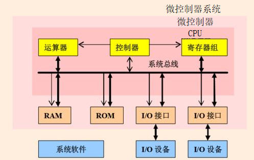
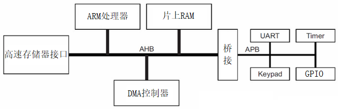
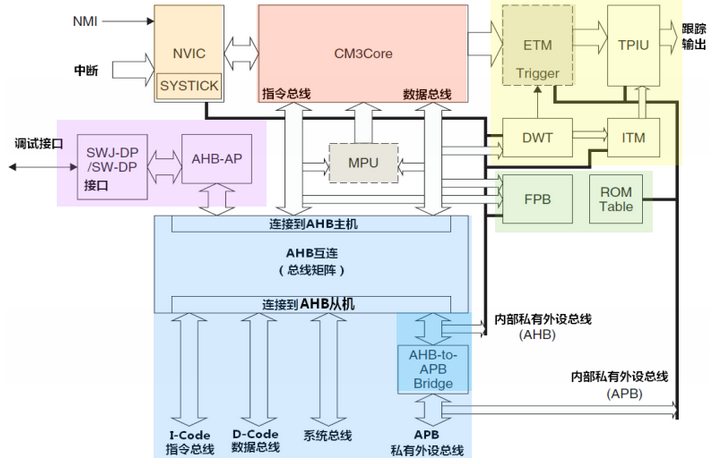
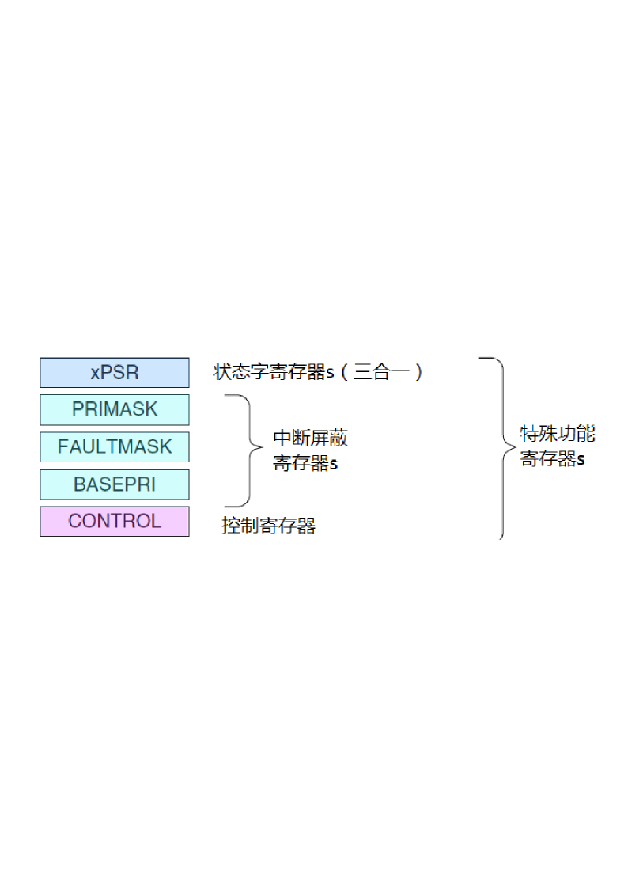
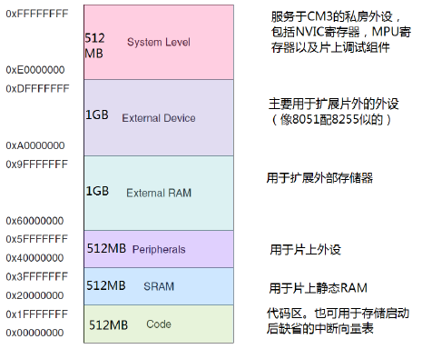
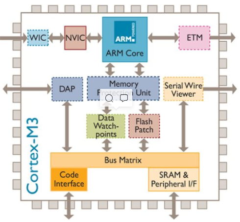
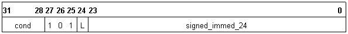
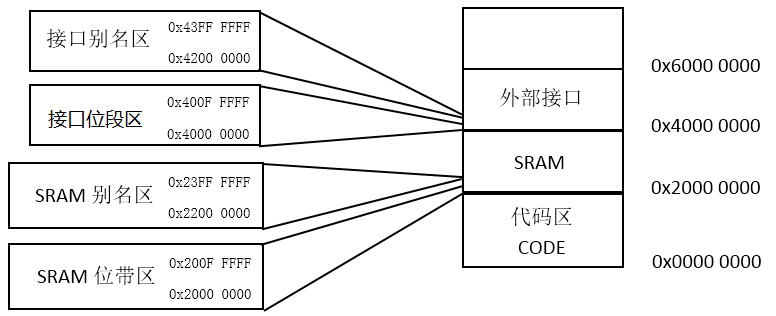
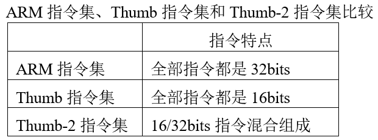

# ch2微控制器体系结构及汇编语言

<!-- slide: 1 -->

## 第2章微控制器体系结构及汇编语言

- 嵌入式微控制器原理及设计
- —基于STM32及Proteus仿真开发
- 配套PPT

<!-- slide: 2 -->

<!-- slide: 3 -->

## 第2章 微控制器体系结构及汇编语言

- 2.1芯片内核体系架构
- 2.2 汇编指令寻址方式
- 2.3 ARM汇编
- 2.4 THUMB指令集

<!-- slide: 4 -->

- 2.1芯片内核体系架构
- 嵌入式微控制器系统的集成度远远高于计算机系统，CPU、存储器、总线及外部输入/输出接口等模块都可集成在微控制器一个芯片里，所以微控制器也俗称单片机。

<!-- slide: 5 -->

- 2.1.1 Cortex-M3总体架构
- Cortex-M3是一个32位处理器内核。内部的数据路径是32位的，寄存器是32位的，存储器接口也是32位；采用哈佛结构；三级流水线；有内存保护单元MPU；内部集成了调试组件。
- AMBA总线规范是ARM公司提出的总线规范，包括：AHB、ASB和APB三种。AHB用于高性能、高时钟频率的系统结构。APB用于连接外部设备，对性能要求不高，而考虑低功耗问题。ASB是AHB的一种替代方案。

<!-- slide: 6 -->

- Cortex-M3 内核架构：包括Cortex-M3处理器核心、可嵌套中断向量控制器NVIC、总线阵列、存储保护单元MPU、闪存地址重载及断点单元FPB、数据监测点与跟踪DWT、仪表跟踪宏单元ITM、嵌入跟踪宏单元ETM、跟踪端口接口单元TPIU、AHB访问端口和JTAG调试口等。

<!-- slide: 7 -->

- 2.1.2 Cortex M3的总线接口
- (1)I-Code总线
- I-Code 总线是一条基于AHB-Lite总线协议的 32 位总线，负责在 0x0000_0000 – 0x1FFF_FFFF 之间的取指操作。
- (2)D-Code总线
- D-Code 总线也是一条基于 AHB-Lite 总线协议的 32 位总线，负责在0x0000_0000 – 0x1FFF_FFFF之间的数据访问操作。
- (3)系统总线
- 系统总线也是一条基于 AHB-Lite 总线协议的 32 位总线，负责在0x2000_0000 – 0xDFFF_FFFF 和0xE010_0000– 0xFFFF_FFFF 之间的所有数据传送，取指和数据访问都算上。
- (4)外部私有外设总线
- 这是一条基于 APB 总线协议的 32 位总线。此总线来负责 0xE004_0000 – 0xE00F_FFFF 之间的私有外设访问。

<!-- slide: 8 -->

- 2.1.3 Cortex-M3寄存器
- （1）通用寄存器 R0-R12
- R0-R12都是32位通用寄存器，用于数据操作。
- （2）堆栈指针R13
- Cortex-M3拥有两种堆栈指针，支持两个堆栈，分别是进程堆栈和主堆栈，这两种堆栈都指向R13，任一时刻进程堆栈或主堆栈中只有一个是可见的。
- （3）链接寄存器R14
- R14是链接寄存器（LR）。在一个汇编程序中，可以把它写做LR或R14。LR用于在调用子程序时存储返回地址，也用于异常返回。
- （4）程序计数寄存器R15
- R15是程序计数器，在汇编代码中将其称为PC（Program Counter）。因为Cortex-M3内部使用了指令流水线，读PC时返回的值是当前指令的地址+4。

<!-- slide: 9 -->

- （5）特殊功能寄存器

- 2）PRIMASK，1位寄存器。当置位时，它允许NMI和硬件默认异常，所有其他的中断和异常将被屏蔽。
- 3）FAULTMASK，1位寄存器。当置位时，它只允许NMI，所有中断和默认异常处理被忽略。
- 4）BASEPRI，9位寄存器。它定义了屏蔽优先级。当它置位时，所有同级的或低级的中断被忽略。
- 5）CONTROL，定义特权状态（见后续部分对特权的叙述），并且决定使用哪一个堆栈指针。

<!-- slide: 10 -->

- 1）xPSR：所有处理器模式下都可访问当前程序状态寄存器CPSR。在每种异常模式下都有一个对用的程序状态寄存器SPSR。当异常出现时，SPSR用于保存CPSR的状态，以便异常返回后恢复异常发生时的工作状态。

<!-- slide: 11 -->

- 2.1.4 Cortex-M3操作模式
- Cortex-M3处理器支持两种处理器的操作模式，还支持两级特权操作。两种操作模式分别为：处理者模式(handler mode)和线程模式（thread mode）。
- 处理模式
- 线程模式
- 特权访问
- 用户访问
- 始终特权访问

<!-- slide: 12 -->

- 特权执行可以访问所有资源。
- 非特权执行时对有些资源的访问受到限制或不允许访问。
- 如部分指令的使用 (设置FAULTMASK和PRIMASK的CPS指令 )
- 对系统控制空间（SCS）的大部分寄存器的访问。
- 特权访问和用户访问(非特权访问)的区别
- FAULTMASK
- PRIMASK
- SCS
- ……
- 用户访问
- 特权访问
- Cortex-M3特权级别有特权级和用户级。这可以提供一种存储器访问的保护机制，使得普通的用户程序代码不能意外地，甚至是恶意地执行涉及要害的操作。

<!-- slide: 13 -->

- 1. 线程模式
- Cortex-M3处理器支持两种工作模式：
- 线程模式和处理者模式
- 2.处理者模式
- 在复位时处理器进入线程模式
- 异常返回时处理器进入线程模式
- 特权和用户（非特权）代码能够在线程模式下运行
- 出现异常时处理器进入处理者模式
- 在处理模式中，所有代码都是特权访问的

<!-- slide: 14 -->

- 线程模式
- 特权访问
- 复位
- 处理模式
- 特权访问
- 异常
- 线程模式
- 用户访问
- 异常
- 异常退出
- CONTROL[0] = 1
- CONTROL[0] = 0
- MSR指令置位
- CONTROL[0]

<!-- slide: 15 -->

- CONTROL[0]
- 特权访问
- 用户访问
- 1
- 0
- 特权访问和用户访问的切换
- 控制寄存器的第0位
- 在处理模式下，通过MSR指令清零CONTROL[0],
- 退出处理模式进入线程模式时切换到特权访问 。
- MRS     R0     CONTROL
- ORR     R0,   R0,   #0x01
- MSR    CONTROL   R0
- 在处理模式下，通过MSR指令置位CONTROL[0],
- 退出处理模式进入线程模式时切换到用户访问 。
- 在线程模式特权访问下，通过MSR指令置位CONTROL[0],即可由特权访问进入用户访问 。
- MOV    R0    #0X00
- MSR    CONTROL   R0

<!-- slide: 16 -->

- 2.1.5 Cortex-M3存储器映射
- 总体来说，Cortex-M3支持4GB存储空间。

<!-- slide: 17 -->

- 内存中有两种格式存储字数据，称之为大端格式和小端格式。
- 大端格式：字数据的高字节存储在低地址中，而字数据的低字节则存放在高地址中。
- 小端格式：与大端存储格式相反，低地址中存放的是字数据的低字节，高地址存储存放的是字数据的高字节。
- Cortex-M3处理器支持的数据类型有32位字、16位半字和8位字节。Cortex-M3处理器支持非对齐的传送，数据存储器的访问无须对齐。

<!-- slide: 18 -->

- 2.1.6 流水线
- Cortex-M3处理器使用一个3级流水线，分别是取指、解码和执行。
- 指令1
- 指令2
- 指令3
- 指令4
- ……
- ……
- 程序存储器
- 周期1
- 周期2
- 周期3
- 周期4
- 周期5
- 周期6
- 取指   译码   执行
- 取指   译码   执行
- 取指   译码   执行
- 取指   译码   执行
- 周期2
- 周期1
- 周期3
- 周期4
- 处理器执行一条指令的三个阶段
- 在第4个周期，指令1执行完成，指令2和指令3流水线推进一级，同时开始指令4的取指处理。
- 4

<!-- slide: 19 -->

## Cortex-M3带分支预测的3级流水线推演过程

- MOV     R0, #00
- ADDS    R0,  R0,  #1
- CMP     R0,  #0x7D0
- BNE      0x00000202
- BX         0X00000300
- LDR     R1, #00
- ……
- MOV     R2, #20
- 0x0200
- 0x0202
- 0x0204
- 0x0208
- 0x020A
- 0X020C
- ……
- 0x0300
- 地址
- 指令
- 取指
- 译码
- 执行
- MOV
- --
- --
- step1
- ADDS
- MOV
- --
- step2
- CMP
- ADDS
- MOV
- step3
- BNE
- CMP
- ADDS
- step4
- ADDS
- BNE
- CMP
- step5
- 因为带分支预测，跳转
- 指令在译码时就被识别，
- 取指时流水线自动加载跳转后地址的指令。
- CMP
- ADDS
- BNE
- step6
- BX
- BNE
- CMP
- APSR的Z=0
- APSR的Z!=0

<!-- slide: 20 -->

- 2.1.7异常和中断
- Cortex-M3处理器有哪些异常？
- Cortex-M3处理器中存在多种异常类型，系统复位、NMI（不可屏蔽中断）、硬件故障、存储器管理、总线故障、使用故障、SVCall（软件中断）、调试监控和IRQ中断等。IRQ中断也分为CortexM3内自带的PendSV（系统服务请求）、SysTick(系统节拍定时器)，和与芯片外设相关的外部中断。

<!-- slide: 21 -->

- 异常类型表

| 异常类型 | 位置 | 优先级 | 描述 |
|---|---|---|---|
| - | 0 | - | 复位时载入向量表的第一项作为栈顶地址。 |
| 复位 | 1 | -3（最高） | 在上电和热复位时调用。在执行第一条指令时，优先级将降为最低（也就是所谓的激活（中断）的基础级别）。这是异步的。 |
| 不可屏蔽中断（NMI） | 2 | -2 | 不可停止，也不会被复位之外的任何异常抢占。这是异步的。 NMI仅可由软件通过NVIC中断控制状态寄存器来产生。 |
| 硬故障 | 3 | -1 | 当故障由于优先级或者是可配置的故障处理程序被禁能的原因而无法激活时，所有类型的故障都会以硬故障的方式激活。这是同步的。 |
| 存储器管理 | 4 | 可调整 | MPU不匹配，包括访问冲突(access violation)和不匹配。这是同步的。 这种异常的优先级可被改变。 |
| 总线故障 | 5 | 可调整 | 预取指故障、存储器访问故障和其它地址/存储器相关的故障。当为精确的总线故障时是同步的，为不精确的总线故障时是异步的。 你可以使能或禁能这种故障。 |

<!-- slide: 22 -->

- 异常类型表

| 异常类型 | 位置 | 优先级 | 描述 |
|---|---|---|---|
| 使用故障 | 6 | 可调整 | 使用故障，例如执行未定义的指令或试图进行非法的状态转变。这是同步的。 |
| - | 7-10 | - | 保留。 |
| SVCall | 11 | 可调整 | 使用SVC指令的系统服务调用。这是同步的。 |
| 调试监控器 | 12 | 可调整 | 调试监控器（当没有暂停(Halt)时）。这是同步的，但仅在使能时有效。如果它的优先级比当前激活的处理程序的优先级更低，那么调试监控器不能激活。 |
| - | 13 | - | 保留。 |
| PendSV | 14 | 可调整 | 系统服务的可挂起(pendable)请求。这是异步的且仅通过软件挂起。 |
| SysTick | 15 | 可调整 | 系统节拍定时器已启动(fired)。这是异步的。 |
| 外部中断 | ≥16 | 可调整 | 中断在ARM Cortex-M3内核之外发出且通过NVIC返回（区分优先级）。这些都是异步的。 |

- 上表其实也是一张完整向量表。当异常产生后，处理器根据中断号从在向量表中取出异常处理函数入口（函数指针）。

<!-- slide: 23 -->

- Cortex-M3 异常有哪些特点？
- 自动的状态保存和恢复。处理器在进入ISR之前将状态寄存器和部分寄存器自动压栈，退出ISR之后它们自动出栈，不需要多余的指令。
- 自动读取代码存储器或SRAM中包含ISR地址的向量表入口。该操作与状态保存同时执行。
- 支持末尾连锁，在末尾连锁中，处理器在两个ISR之间不需要对寄存器进行出栈和压栈操作的情况下处理背对背中断。
- 中断优先级可动态重新设置。
- Cortex-M3与NVIC之间采用紧耦合（closely-coupled）接口，通过该接口可以及早地对中断和高优先级的迟来中断进行处理。
- 中断数目可配置为1～240。
- 中断优先级的数目可配置为1～8位（1～256级。Stellaris系列单片机只支持8级）。处理模式和线程模式具有独立的堆栈和特权等级。
- 使用C/C++标准的调用规范：ARM架构的过程调用标准（PCSAA）执行ISR控制传输。
- 优先级屏蔽支持临界区（关中断，使程序不被高优先级异常中断）。

<!-- slide: 24 -->

- 异常基于优先级的动作
- 占先
- 用户程序
- 中断1
- 中断2
- 优先级3
- 优先级2
- 中断1
- 中断2
- 压栈
- 压栈
- 出栈
- 出栈

<!-- slide: 25 -->

- Cortex-M3有一个可选的存储器保护单元。配上它之后，就可以对特权级访问和用户级访问分别施加不同的访问限制。
- 2.1.8存储器保护单元（MPU）
- 最常见的就是由操作系统使用 MPU，以使特权级代码的数据，包括操作系统本身的数据不被其它用户程序弄坏。MPU 在保护内存时是按区管理的(“区”的原文是 region，以后不再中译此名词)。它可以把某些内存 region 设置成只读，从而避免了那里的内容意外被更改；还可以在多任务系统中把不同任务之间的数据区隔离。一句话，它会使嵌入式系统变得更加健壮，更加可靠。
- MPU提高系统的可靠性：
- 阻止用户应用程序破坏操作系统使用的数据。
- 阻止一个任务访问其它任务的数据区，从而把任务隔开。
- 可以把关键数据区设置为只读，从根本上消除了被破坏的可能。
- 检测意外的存储访问，如，堆栈溢出，数组越界。
- 还可以通过MPU设置存储器regions的其它访问属性，比如，是否缓区，是否缓冲等。

<!-- slide: 26 -->

## 2.2 汇编指令寻址方式

- 寻址方式分类
- 寻址方式是根据指令中给出的地址码字段来实现寻找真实操作数地址的方式。ARM处理器具有9种基本寻址方式。
- 1.寄存器寻址；		2.立即寻址；
- 3.寄存器移位寻址；		4.寄存器间接寻址；
- 5.基址寻址；			6.多寄存器寻址；
- 7.堆栈寻址；			8.相对寻址。

<!-- slide: 27 -->

## 寻址方式分类——寄存器寻址

- 操作数的值在寄存器中，指令中的地址码字段指出的是寄存器编号，指令执行时直接取出寄存器值来操作。寄存器寻址指令举例如下：
- MOV  R1,R2	    ;将R2的值存入R1
- SUB  R0,R1,R2    ;将R1的值减去R2的值，结果保存到R0
- 0xAA
- 0x55
- R2
- R1
- MOV  R1,R2
- 0xAA

<!-- slide: 28 -->

## 寻址方式分类——立即寻址

- 立即寻址指令中的操作码字段后面的地址码部分即是操作数本身，也就是说，数据就包含在指令当中，取出指令也就取出了可以立即使用的操作数(这样的数称为立即数)。立即寻址指令举例如下：
- SUBS	R0,R0,#1     ;R0减1，结果放入R0，并且影响标志位
- MOV	R0,#0xFF000  ;将立即数0xFF000装入R0寄存器
- 0x55
- R0
- MOV  R0,#0xFF00
- 程序存储
- MOV  R0,#0xFF00
- 0xFF00
- 从代码中获得数据

<!-- slide: 29 -->

## 寻址方式分类——寄存器移位寻址

- 寄存器移位寻址是ARM指令集特有的寻址方式。当第2个操作数是寄存器移位方式时，第2个寄存器操作数在与第1个操作数结合之前，选择进行移位操作。寄存器移位寻址指令举例如下：
- MOV	R0,R2,LSL #3	    ;R2的值左移3位，结果放入R0，			    ;即是R0=R2×8
- ANDS	R1,R1,R2,LSL R3  ;R2的值左移R3位，然后和R1相			    ;“与”操作，结果放入R1
- 0x55
- R0
- R2
- 0x01
- MOV  R0,R2,LSL #3
- 0x08
- 0x08
- 逻辑左移3位

<!-- slide: 30 -->

## 寻址方式分类——寄存器间接寻址

- 寄存器间接寻址指令中的地址码给出的是一个通用寄存器的编号，所需的操作数保存在寄存器指定地址的存储单元中，即寄存器为操作数的地址指针。寄存器间接寻址指令举例如下：
- LDR	R1,[R2]	;将R2指向的存储单元的数据读出
- ;保存在R1中
- SWP	R1,R1,[R2]	;将寄存器R1的值和R2指定的存储
- ;单元的内容交换
- 0x55
- R0
- R2
- 0x40000000
- 0xAA
- 0x40000000
- LDR  R0,[R2]
- 0xAA

<!-- slide: 31 -->

## 寻址方式分类——基址寻址

- 基址寻址就是将基址寄存器的内容与指令中给出的偏移量相加，形成操作数的有效地址。基址寻址用于访问基址附近的存储单元，常用于查表、数组操作、功能部件寄存器访问等。基址寻址指令举例如下：
- LDR	R2,[R3,#0x0C]	  ;读取R3+0x0C地址上的存储单元
- ;的内容，放入R2
- STR	R1,[R0,#-4]!	  ;先R0=R0-4，然后把R1的值寄存
- ;到保存到R0指定的存储单元
- 0x55
- R2
- R3
- 0x40000000
- 0xAA
- 0x4000000C
- LDR  R2,[R3,#0x0C]
- 0xAA
- 将R3+0x0C作为地址装载数据

<!-- slide: 32 -->

## 寻址方式分类——多寄存器寻址

- 多寄存器寻址一次可传送几个寄存器值，允许一条指令传送16个寄存器的任何子集或所有寄存器。多寄存器寻址指令举例如下：
- LDMIA	R1!,{R2-R7,R12}  ;将R1指向的单元中的数据读出到
- ;R2～R7、R12中(R1自动加1)
- STMIA	R0!,{R2-R7,R12}  ;将寄存器R2～R7、R12的值保
- ;存到R0指向的存储; 单元中
- ;(R0自动加1)
- 0x40000000
- R1
- R2
- 0x??
- 0x01
- 0x40000000
- 0x??
- R3
- R4
- 0x??
- R6
- 0x??
- 0x02
- 0x03
- 0x04
- 0x40000004
- 0x40000008
- 0x4000000C
- 存储器
- LDMIA  R1!,{R2-R4,R6}
- 0x01
- 0x02
- 0x03
- 0x04
- 0x40000010

<!-- slide: 33 -->

## 寻址方式分类——堆栈寻址

- 堆栈是一个按特定顺序进行存取的存储区，操作顺序为“后进先出” 。堆栈寻址是隐含的，它使用一个专门的寄存器(堆栈指针)指向一块存储区域(堆栈)，指针所指向的存储单元即是堆栈的栈顶。存储器堆栈可分为两种：
  - 向上生长：向高地址方向生长，称为递增堆栈
  - 向下生长：向低地址方向生长，称为递减堆栈

<!-- slide: 34 -->

## 寻址方式分类——堆栈寻址

- 栈底
- 栈顶
- 栈区
- SP
- 堆栈存储区
- 栈顶
- 栈底
- 栈区
- SP
- 向下增长
- 向上增长
- 0x12345678
- 0x12345678
- 堆栈压栈
- 堆栈压栈

<!-- slide: 35 -->

## 寻址方式分类——堆栈寻址

- 栈顶
- SP
- 栈顶
- SP
- 栈底
- 空堆栈
- 栈底
- 满堆栈
- 堆栈指针指向最后压入的堆栈的有效数据项，称为满堆栈；堆栈指针指向下一个待压入数据的空位置，称为空堆栈。
- 0x12345678
- 0x12345678
- 栈顶
- SP
- 0x12345678
- 栈顶
- SP
- 压栈
- 压栈

<!-- slide: 36 -->

## 寻址方式分类——堆栈寻址

- 所以可以组合出四种类型的堆栈方式：
- 满递增：堆栈向上增长，堆栈指针指向内含有效数据项的最高地址。指令如LDMFA、STMFA等；
- 空递增：堆栈向上增长，堆栈指针指向堆栈上的第一个空位置。指令如LDMEA、STMEA等；
- 满递减：堆栈向下增长，堆栈指针指向内含有效数据项的最低地址。指令如LDMFD、STMFD等；
- 空递减：堆栈向下增长，堆栈指针向堆栈下的第一个空位置。指令如LDMED、STMED等。

<!-- slide: 37 -->

## 寻址方式分类——相对寻址

- 相对寻址是基址寻址的一种变通。由程序计数器PC提供基准地址，指令中的地址码字段作为偏移量，两者相加后得到的地址即为操作数的有效地址。相对寻址指令举例如下：
- BL	SUBR1		;调用到SUBR1子程序
- BEQ	LOOP		;条件跳转到LOOP标号处
- ...
- LOOP	MOV	R6,#1
- ...
- SUBR1	...

<!-- slide: 38 -->

## 2.3 ARM汇编

- 简介
- ARM处理器是基于精简指令集计算机(RISC)原理设计的，指令集和相关译码机制较为简单。ARM具有32位ARM指令集和16位Thumb指令集，ARM指令集效率高，但是代码密度低;而Thumb指令集具有较高的代码密度，却仍然保持ARM的大多数性能上的优势，它是ARM指令集的子集。所有的ARM指令都是可以有条件执行的，而Thumb指令仅有一条指令具备条件执行功能。ARM程序和Thumb程序可相互调用，相互之间的状态切换开销几乎为零。

<!-- slide: 39 -->

## ARM微处理器的指令集是加载/存储型的，即指令集仅能处理寄存器中的数据，而且处理结果都要放回寄存器中，而对系统存储器的访问则需要通过专门的加载/存储指令来完成。
ARM微处理器的指令集可以分为六大类 :
跳转指令
数据处理指令
程序状态寄存器（PSR）处理指令
加载/存储指令
协处理器指令
异常产生指令

<!-- slide: 40 -->

## 简单的ARM程序

- ;文件名：TEST1.S
- ;功能：实现两个寄存器相加
- ;说明：使用ARMulate软件仿真调试
- AREA	Example1,CODE,READONLY	  ;声明代码段Example1
- ENTRY				  ;标识程序入口
- CODE32				  ;声明32位ARM指令
- START 	MOV	R0,#0			  ;设置参数
- MOV	R1,#10
- LOOP	BL	ADD_SUB	    		  ;调用子程序ADD_SUB
- B	LOOP			  ;跳转到LOOP
- ADD_SUB
- ADDS	R0,R0,R1		  ;R0 = R0 + R1
- MOV	PC,LR	     		  ;子程序返回
- END				  ;文件结束
- 使用“；”进行注释
- 标号顶格写
- 实际代码段
- 声明文件结束

<!-- slide: 41 -->

## 简单的ARM程序

- ;文件名：TEST1.S
- ;功能：实现两个寄存器相加
- ;说明：使用ARMulate软件仿真调试
- AREA	Example1,CODE,READONLY	  ;声明代码段Example1
- ENTRY				  ;标识程序入口
- CODE32				  ;声明32位ARM指令
- START 	MOV	R0,#0			  ;设置参数
- MOV	R1,#10
- LOOP	BL	ADD_SUB	    		  ;调用子程序ADD_SUB
- B	LOOP			  ;跳转到LOOP
- ADD_SUB
- ADDS	R0,R0,R1		  ;R0 = R0 + R1
- MOV	PC,LR	     		  ;子程序返回
- END				  ;文件结束

<!-- slide: 42 -->

## 2.3.1指令基本形式

- ARM指令的基本格式如下：
- ARM指令集——指令格式
- <opcode> {<cond>} {S}    <Rd> ,<Rn>{,<operand2>}
- 其中<>号内的项是必须的，{}号内的项是可选的。各项的说明如下：
- opcode：指令助记符；	cond：执行条件；
- S：是否影响CPSR寄存器的值；
- Rd：目标寄存器；		 Rn：第1个操作数的寄存器；
- operand2：第2个操作数；

<!-- slide: 43 -->

## ARM指令集——第2个操作数

- ARM指令的基本格式如下：
- <opcode> {<cond>} {S}    <Rd> ,<Rn>{,<operand2>}
- 灵活的使用第2个操作数“operand2”能够提高代码效率。它有如下的形式：
  - #immed_8r——常数表达式；
  - Rm——寄存器方式；
  - Rm,shift——寄存器移位方式；

<!-- slide: 44 -->

## ARM指令集——第2个操作数

- #immed_8r——常数表达式
- 该常数必须对应8位位图，即必须是一个8位的常数通过循环右移偶数位可以得到的数。
- 循环右移10位
- 0x12
- 0
- 0
- 0
- 1
- 0
- 0
- 1
- 0
- 0x00
- 0
- 0
- 0
- 0
- 0
- 0
- 0
- 0
- 0x00
- 0
- 0
- 0
- 0
- 0
- 0
- 0
- 0
- 0x00
- 0
- 0
- 0
- 0
- 0
- 0
- 0
- 0
- 0x00
- 0
- 0
- 0
- 0
- 0
- 0
- 0
- 0
- 0x00
- 0
- 0
- 0
- 0
- 0
- 0
- 0
- 0
- 0x80
- 1
- 0
- 0
- 0
- 0
- 0
- 0
- 0
- 0x04
- 0
- 0
- 0
- 0
- 0
- 1
- 0
- 0
- 移位前的8位常数0x12
- 移位后得到的常数0x04800000

<!-- slide: 45 -->

## ARM指令集——第2个操作数

- #immed_8r——常数表达式
- 该常数必须对应8位位图，即必须是一个8位的常数通过循环右移偶数位可以得到的数。
- 例如：
- MOV	R0,#1
- AND	R1,R2,#0x0F
- MOV	R1,#0xC000	;0xC000可由0x03循环右移16位得到

<!-- slide: 46 -->

- √
- 可以由0x4A循环右移10位得到
- ×
- 2.请列举2个8位图立即数？
- 思考与练习
- ?
- 1.以下8位图立即数是否合法？
- 0x0103C000
- 0x12800000
- 0x4000003B（0xED循环右移2位）
- 0x0016C000（0x5B循环右移18位）

<!-- slide: 47 -->

## ARM指令集——第2个操作数

- Rm——寄存器方式
- 在寄存器方式下，操作数即为寄存器的数值。
- 例如：
- SUB	R1,R1,R2
- MOV	PC,R0

<!-- slide: 48 -->

## ARM指令集——第2个操作数

- Rm,shift——寄存器移位方式
- 将寄存器的移位结果作为操作数，但Rm值保持不变，移位方法如下：

| 操作码 | 说明 | 操作码 | 说明 |
|---|---|---|---|
| ASR  #n | 算术右移n位 | ROR  #n | 循环右移n位 |
| LSL  #n | 逻辑左移n位 | RRX | 带扩展的循环右移1位 |
| LSR  #n | 逻辑右移n位 | Type  Rs | Type为移位的一种类型，Rs为偏移量寄存器，低8位有效。 |

<!-- slide: 49 -->

## ARM指令集——第2个操作数

- LSL移位操作：
- 0
- LSR移位操作：
- 0
- ASR移位操作：
- ROR移位操作：
- RRX移位操作：
- C

<!-- slide: 50 -->

## ARM指令集——第2个操作数

- Rm,shift——寄存器移位方式
- 例如：
- ADD	R1,R1,R1,LSL #3	;R1=R1+R1*8=9R1
- SUB	R1,R1,R2,LSR R3	;R1=R1-(R2/2R3)

<!-- slide: 51 -->

## ARM指令集——条件码

- ARM指令的基本格式如下：
- <opcode> {<cond>} {S}    <Rd> ,<Rn>{,<operand2>}
- 使用条件码“cond”可以实现高效的逻辑操作，提高代码效率。
- 绝大部分的ARM指令都可以条件执行，而Thumb指令只有B（跳转）指令具有条件执行 功能。如果指令不标明条件代码，将默认为无条件（AL）执行。
- 2.3.2 ARM指令集条件码

<!-- slide: 52 -->

| 操作码 | 条件助记符 | 标志 | 含义 |
|---|---|---|---|
| 0000 | EQ | Z=1 | 相等 |
| 0001 | NE | Z=0 | 不相等 |
| 0010 | CS/HS | C=1 | 无符号数大于或等于 |
| 0011 | CC/LO | C=0 | 无符号数小于 |
| 0100 | MI | N=1 | 负数 |
| 0101 | PL | N=0 | 正数或零 |
| 0110 | VS | V=1 | 溢出 |
| 0111 | VC | V=0 | 没有溢出 |
| 1000 | HI | C=1,Z=0 | 无符号数大于 |
| 1001 | LS | C=0,Z=1 | 无符号数小于或等于 |
| 1010 | GE | N=V | 有符号数大于或等于 |
| 1011 | LT | N!=V | 有符号数小于 |
| 1100 | GT | Z=0,N=V | 有符号数大于 |
| 1101 | LE | Z=1,N!=V | 有符号数小于或等于 |
| 1110 | AL | 任何 | 无条件执行 (指令默认条件) |
| 1111 | NV | 任何 | 从不执行(不要使用) |

- 指令条件码表

<!-- slide: 53 -->

## ARM指令集——条件码

- C代码：
- if(a > b)
- a++;
- else
- b++;
- 对应的汇编代码：
- CMP	R0,R1	    ;R0与R1比较
- ADDHI	R0,R0,#1  ;若R0>R1，则R0=R0+1
- ADDLS	R1,R1,#1  ;若R0≤R1，则R1=R1+1
- 示例：

<!-- slide: 54 -->

- 2.3.3 ARM指令种类
- 1.存储器访问指令
- 2.数据处理指令
- 3.乘法指令
- 4.ARM分支指令
- 5.协处理器指令
- 6.杂项指令
- 7.伪指令

<!-- slide: 55 -->

- 为什么要掌握部分常用ARM指令？
  - 熟悉ARM体系结构：通过指令的学习可以更深入的了解ARM硬件结构的特点；
  - 修改启动代码：启动代码为了满足大部分系统的顺利运行，通常将系统硬件配置在最低性能，通过调整启动代码中的参数使其更适合自己的硬件系统；
  - 调试程序：通过观察反汇编代码了解程序执行情况，比如某个变量的操作是否被编译器优化掉了。
  - 阅读已有的汇编代码；

<!-- slide: 56 -->

- ARM指令种类
- 1.存储器访问指令
- 2.数据处理指令
- 3.乘法指令
- 4.ARM分支指令
- 5.协处理器指令
- 6.杂项指令
- 7.伪指令

<!-- slide: 57 -->

## ARM指令集——存储器访问指令

- ARM处理器是典型的RISC处理器，对存储器的访问只能使用加载和存储指令实现。
- 存储器访问指令分为单寄存器操作指令和多寄存器操作指令。

<!-- slide: 58 -->

## ARM存储器访问指令——单寄存器存取

- LDR/STR指令用于对内存变量的访问、内存缓冲区数据的访问、查表、外围部件的控制操作等。若使用LDR指令加载数据到PC寄存器，则实现程序跳转功能，这样也就实现了程序散转。
- 所有单寄存器加载/存储指令可分为“字和无符号字节加载存储指令”和“半字和有符号字节加载存储指令。

<!-- slide: 59 -->

## ARM存储器访问指令——单寄存器存取

- 装载指令：LDR    目标寄存器,源地址
- 存储指令：STR    源寄存器,目标地址
- 存储器
- 源地址
- 目标寄存器
- 存储器
- 目标地址
- 源寄存器

<!-- slide: 60 -->

## ARM存储器访问指令——单寄存器存取

- 装载指令：LDR
- 存储指令：STR
- x
- x
- LDR/STR指令搭配不同的后缀实现不同方式的单寄存器存取操作:
- 字/半字/字节数据控制
- 是/否用户模式控制
- 无/有符号控制

<!-- slide: 61 -->

| 助记符 | 说明 | 操作 | 条件码位置 |
|---|---|---|---|
| LDR    Rd,addressing | 加载字数据 | Rd←[addressing]， addressing索引 | LDR{cond} |
| LDRB   Rd,addressing | 加载无符号字节数据 | Rd←[addressing]， addressing索引 | LDR{cond}B |
| LDRT   Rd,addressing | 以用户模式加载字数据 | Rd←[addressing]， addressing索引 | LDR{cond}T |
| LDRBT  Rd, addressing | 以用户模式加载无符号 字节数据 | Rd←[addressing]， addressing索引 | LDR{cond}BT |
| LDRH   Rd, addressing | 加载无符号半字数据 | Rd←[addressing]， addressing索引 | LDR{cond}H |
| LDRSB  Rd, addressing | 加载有符号字节数据 | Rd←[addressing]， addressing索引 | LDR{cond}SB |
| LDRSH  Rd, addressing | 加载有符号半字数据 | Rd←[addressing]，addressing索引 | LDR{cond}SH |

- ARM存储器访问指令——装载指令

<!-- slide: 62 -->

| 助记符 | 说明 | 操作 | 条件码位置 |
|---|---|---|---|
| STR     Rd, addressing | 存储字数据 | [addressing]←Rd， addressing索引 | STR{cond} |
| STRB    Rd,addressing | 存储字节数据 | [addressing]←Rd， addressing索引 | STR{cond}B |
| STRT    Rd,addressing | 以用户模式存储字数据 | [addressing]←Rd，  addressing索引 | STR{cond}T |
| STRBT   Rd,addressing | 以用户模式存储字节数据 | [addressing]←Rd， addressing索引 | STR{cond}BT |
| STRH    Rd,addressing | 存储半字数据 | [addressing] ←Rd， addressing索引 | STR{cond}H |

- ARM存储器访问指令——保存指令

<!-- slide: 63 -->

- ARM存储器访问指令——地址形式
- 装载指令：LDR    目标寄存器,  源地址
- 保存指令：STR    源寄存器,     目标地址
- 立即数：立即数可以是一个无符号的数值。这个数据可以加到基址寄存器，也可以从基址寄存器中减去这个数值。
- 如：LDR  R1,[R0,#0x12]
- 寄存器：寄存器中的数值可以加到基址寄存器，也可以从基址寄存器中减去这个数值。
- 如：LDR  R1,[R0,R2]
- 寄存器及移位常数：寄存器移位后的值可以加到基址寄存器，也可以从基址寄存器中减去这个数值。
- 如：LDR  R1,[R0,R2,LSL #2]

<!-- slide: 64 -->

- ARM存储器访问指令——寻址方式
- 装载指令：LDR    目标寄存器,  源地址
- 保存指令：STR    源寄存器,     目标地址
- 零偏移：           如：LDR  Rd,[Rn]
- 前索引偏移:	如：LDR  Rd,[Rn,#0x04]!
- 程序相对偏移:	如：LDR  Rd,labe1
- 后索引偏移:	如：LDR  Rd,[Rn],#0x04
- 注意：大多数情况下，必须保证字数据操作的地址是32位对齐的。

<!-- slide: 65 -->

- 0x55
- R2
- R5
- 0x40000000
- 0x12345678
- 0x40000000
- 存储器
- 地址
- 应用示例：
- LDR	R2,[R5]    ;将R5指向地址的字数据存入R2
- 0x12345678
- ARM存储器访问指令——单寄存器转载应用

<!-- slide: 66 -->

- 0x12345678
- R1
- R2
- 0x40000000
- 0x??
- 0x40000004
- 存储器
- 地址
- 应用示例：
- STR	R1,[R2,#0x04]  ;将R1的数据存储到R2+0x04地址
- 0x12345678
- +4
- ARM存储器访问指令——单寄存器保存应用

<!-- slide: 67 -->

## ARM存储器访问指令——多寄存器存取

- 多寄存器加载/存储指令可以实现在一组寄存器和一块连续的内存单元之间传输数据。LDM为加载多个寄存器；STM为存储多个寄存器。允许一条指令传送16个寄存器的任何子集或所有寄存器。它们主要用于现场保护、数据复制、常数传递等。

<!-- slide: 68 -->

## ARM存储器访问指令——多寄存器存取

- 装载指令：LDM    源地址,目标寄存器列表
- 存储指令：STM    目标地址,源寄存器列表
- 存储器
- 源地址
- 目标寄存器1
- 目标寄存器n
- 存储器
- 目标地址
- 源寄存器1
- 源寄存器n

<!-- slide: 69 -->

## ARM存储器访问指令——多寄存器存取

- 装载指令：LDM
- 存储指令：STM
- x
- x
- LDM/STM指令搭配不同的后缀实现不同方式地址增长方式：
- IA： 每次传送后地址加4
- IB： 每次传送前地址加4
- DA：每次传送后地址减4
- DB：每次传送前地址减4

<!-- slide: 70 -->

- ARM存储器访问指令——多寄存器存取
- 数据块传送指令操作过程如右图所示，其中R1为指令执行前的基址寄存器，R1’则为指令执行后的基址寄存器。
- R5
- R6
- R7
- R1  
- R1’ 
- 指令STMIA  R1!,{R5-R7}
- 4008H
- 4004H
- 4000H
- 4014H
- 4010H
- 400CH
- R5
- R6
- R7
- R1  
- R1’ 
- 指令STMDA  R1!,{R5-R7}
- 4008H
- 4004H
- 4000H
- 4014H
- 4010H
- 400CH
- R5
- R6
- R7
- R1  
- R1’ 
- 指令STMIB  R1!,{R5-R7}
- 4008H
- 4004H
- 4000H
- 4014H
- 4010H
- 400CH
- R5
- R6
- R7
- R1’  
- R1 
- 指令STMDB  R1!,{R5-R7}
- 4008H
- 4004H
- 4000H
- 4014H
- 4010H
- 400CH

<!-- slide: 71 -->

## ARM存储器访问指令——多寄存器存取

- 多寄存器存取指令与堆栈操作指令的关系如下表所示。

| 模式 | 说明 | 模式 | 说明 |
|---|---|---|---|
| IA | 每次传送后地址加4 | FD | 满递减堆栈 |
| IB | 每次传送前地址加4 | ED | 空递减堆栈 |
| DA | 每次传送后地址减4 | FA | 满递增堆栈 |
| DB | 每次传送前地址减4 | EA | 空递增堆栈 |
| 数据块传送操作 |  | 堆栈操作 |  |

<!-- slide: 72 -->

## ARM存储器访问指令——多寄存器存取

- 多寄存器存取指令与堆栈操作指令的关系如下表所示。

| 数据块传送 存储 | 堆栈操作 压栈 | 说明 |  | 数据块传送 加载 | 堆栈操作 出栈 | 说明 |
|---|---|---|---|---|---|---|
| STMDA | STMED | 空递减 |  | LDMDA | LDMFA | 满递减 |
| STMIA | STMEA | 空递增 |  | LDMIA | LDMFD | 满递增 |
| STMDB | STMFD | 满递减 |  | LDMDB | LDMEA | 空递减 |
| STMIB | STMFA | 满递增 |  | LDMIB | LDMED | 空递增 |

<!-- slide: 73 -->

- 0x40000000
- R1
- R2
- 0x??
- 0x01
- 0x40000000
- 0x??
- R3
- R4
- 0x??
- R6
- 0x??
- 0x02
- 0x03
- 0x04
- 0x40000004
- 0x40000008
- 0x4000000C
- 存储器
- 0x01
- 0x02
- 0x03
- 0x04
- 0x40000000
- 应用示例：
- LDMIA R1!,{R2-R4,R6}
- 将R1指向的内存数据读取到R0-R4和R6寄存器中
- ARM存储器访问指令——多寄存器存取

<!-- slide: 74 -->

- 应用示例：
- STMFD SP!,{R0-R7,LR}
- ARM存储器访问指令——满递减压栈操作
- 栈
- 顶
- 0x01
- ……
- 0x07
- ARM7内核
- 内部寄存器
- 存储器
- 0x00
- 0x4020
- ……
- R0
- R1
- R7
- SP
- 0x??
- 0x4004
- 0x4000
- 0x400C
- 0x4008
- 0x??
- 0x??
- 0x??
- 0x??
- 0x??
- 0x??
- 0x??
- 0x4014
- 0x4010
- 0x4020
- 0x4018
- 地址
- 0x??
- 0x401C
- 0x??
- 0x3FFC
- 0x0123
- 0x??
- 0x3FF8
- LR
- 1.压栈操作前寄存器和堆栈区的状态；
- 2.压栈操作前堆栈指针指向栈顶；

<!-- slide: 75 -->

- 应用示例：
- STMFD SP!,{R0-R7,LR}
- ARM存储器访问指令——满递减压栈操作
- 0x01
- ……
- 0x07
- ARM7内核
- 内部寄存器
- 存储器
- 0x00
- 0x4020
- ……
- R0
- R1
- R7
- SP
- 0x??
- 0x4004
- 0x4000
- 0x400C
- 0x4008
- 0x??
- 0x??
- 0x??
- 0x??
- 0x??
- 0x??
- 0x??
- 0x4014
- 0x4010
- 0x4020
- 0x4018
- 地址
- 0x??
- 0x401C
- 0x??
- 0x3FFC
- 0x0123
- 0x??
- 0x3FF8
- LR
- 1.压栈操作前寄存器和堆栈区的状态；
- 2.压栈操作前堆栈指针指向栈顶；
- 3.执行压栈操作指令保存R0-R7和LR
- 0x01
- 0x02
- 0x03
- 0x04
- 0x05
- 0x07
- 0x00
- 0x06
- 0x0123
- 0x3FFC
- 栈
- 顶

<!-- slide: 76 -->

- 应用示例：
- LDMFD SP!,{R0-R7,PC}
- ARM存储器访问指令——满递减出栈操作
- 1.出栈操作前寄存器和堆栈区的状态；
- 2.出栈操作前堆栈指针指向栈顶；
- 栈
- 顶
- 0x??
- 0x??
- 存储器
- 0x??
- 0x??
- 0x4004
- 0x4000
- 0x400C
- 0x4008
- 0x??
- 0x??
- 0x??
- 0x??
- 0x??
- 0x??
- 0x??
- 0x4014
- 0x4010
- 0x4020
- 0x4018
- 地址
- 0x??
- 0x401C
- 0x??
- 0x3FFC
- 0x??
- 0x3FF8
- 0x01
- 0x02
- 0x03
- 0x04
- 0x05
- 0x07
- 0x00
- 0x06
- 0x0123
- ……
- ARM7内核
- 0x4020
- ……
- R0
- R1
- R7
- SP
- 0x????
- LR
- 0x3FFC
- PC
- 0x????

<!-- slide: 77 -->

- 应用示例：
- LDMFD SP!,{R0-R7,PC}
- ARM存储器访问指令——满递减出栈操作
- 1.出栈操作前寄存器和堆栈区的状态；
- 2.出栈操作前堆栈指针指向栈顶；
- 栈
- 顶
- 0x??
- 0x??
- 存储器
- 0x??
- 0x??
- 0x4004
- 0x4000
- 0x400C
- 0x4008
- 0x??
- 0x??
- 0x??
- 0x??
- 0x??
- 0x??
- 0x??
- 0x4014
- 0x4010
- 0x4020
- 0x4018
- 地址
- 0x??
- 0x401C
- 0x??
- 0x3FFC
- 0x??
- 0x3FF8
- 0x01
- 0x02
- 0x03
- 0x04
- 0x05
- 0x07
- 0x00
- 0x06
- 0x0123
- ……
- ARM7内核
- 0x4020
- ……
- R0
- R1
- R7
- SP
- 0x????
- LR
- 0x3FFC
- PC
- 0x????
- 3.执行出栈操作指令恢复R0-R7和PC
- 0x4020
- 0x01
- 0x07
- 0x00
- 0x01
- 0x02
- 0x03
- 0x04
- 0x05
- 0x07
- 0x00
- 0x06
- 0x0123
- 0x0123

<!-- slide: 78 -->

- 带状态寄存器恢复的出栈操作：
- LDMFD SP!,{R0-R7,PC}^
- ARM存储器访问指令——满递减出栈操作
- 1.出栈操作前寄存器和堆栈区的状态；
- 2.出栈操作前堆栈指针指向栈顶；
- 栈
- 顶
- 0x??
- 0x??
- 存储器
- 0x??
- 0x??
- 0x4004
- 0x4000
- 0x400C
- 0x4008
- 0x??
- 0x??
- 0x??
- 0x??
- 0x??
- 0x??
- 0x??
- 0x4014
- 0x4010
- 0x4020
- 0x4018
- 地址
- 0x??
- 0x401C
- 0x??
- 0x3FFC
- 0x??
- 0x3FF8
- 0x01
- 0x02
- 0x03
- 0x04
- 0x05
- 0x07
- 0x00
- 0x06
- 0x0123
- ……
- ARM7内核
- 0x4020
- ……
- R0
- R1
- R7
- SP
- 0x????
- LR
- 0x3FFC
- PC
- 0x????
- 0x????
- CPSR
- SPSR
- 0x????

<!-- slide: 79 -->

- 栈
- 顶
- 带状态寄存器恢复的出栈操作：
- LDMFD SP!,{R0-R7,PC}^
- ARM存储器访问指令——满递减出栈操作
- 1.出栈操作前寄存器和堆栈区的状态；
- 2.出栈操作前堆栈指针指向栈顶；
- 0x??
- 0x??
- 存储器
- 0x??
- 0x??
- 0x4004
- 0x4000
- 0x400C
- 0x4008
- 0x??
- 0x??
- 0x??
- 0x??
- 0x??
- 0x??
- 0x??
- 0x4014
- 0x4010
- 0x4020
- 0x4018
- 地址
- 0x??
- 0x401C
- 0x??
- 0x3FFC
- 0x??
- 0x3FF8
- 0x01
- 0x02
- 0x03
- 0x04
- 0x05
- 0x07
- 0x00
- 0x06
- 0x0123
- ……
- ARM内核
- 0x4020
- ……
- R0
- R1
- R7
- SP
- 0x????
- LR
- 0x3FFC
- PC
- 0x????
- 0x????
- CPSR
- SPSR
- 0x????
- 0x4020
- 0x01
- 0x07
- 0x00
- 0x01
- 0x02
- 0x03
- 0x04
- 0x05
- 0x07
- 0x00
- 0x06
- 0x0123
- 0x0123
- 3.执行出栈操作指令恢复R0-R7和PC

<!-- slide: 80 -->

- SWP指令用于将一个内存单元(该单元地址放在寄存器Rn中)的内容读取到一个寄存器Rd中，同时将另一个寄存器Rm的内容写入到该内存单元中。使用SWP可实现信号量操作。
- ARM存储器访问指令——寄存器和存储器交换指令

<!-- slide: 81 -->

- ARM存储器访问指令——寄存器和存储器交换指令
- 装载指令：
- SWP    读入寄存器,输出寄存器,目标地址
- 存储器
- 目标地址
- 读入寄存器
- 输出寄存器

<!-- slide: 82 -->

- ARM存储器访问指令——寄存器和存储器交换指令
- 装载指令：
- SWP    读入寄存器,输出寄存器,目标地址

| 助记符 | 说明 | 操作 | 条件码位置 |
|---|---|---|---|
| SWP      Rd,Rm,Rn | 寄存器和存储器字数据交换 | Rd←[Rn]，[Rn]←Rm (Rn≠Rd或Rm) | SWP{cond} |
| SWPB    Rd,Rm,Rn | 寄存器和存储器字节数据交换 | Rd←[Rn]，[Rn]←Rm (Rn≠Rd或Rm) | SWP{cond}B |

<!-- slide: 83 -->

- 0x12345678
- R1
- R2
- 0x??
- 0x11223344
- 0x40000000
- 存储器
- 地址
- R0
- 0x40000000
- ARM存储器访问指令——寄存器和存储器交换指令
- 应用示例：
- SWP	R2,R1,[R0]
- 将R1的内容与R0指向的存储单元的内容进行交换
- 0x12345678
- 0x11223344

<!-- slide: 84 -->

- ARM指令种类
- 1.存储器访问指令
- 2.数据处理指令
- 3.乘法指令
- 4.ARM分支指令
- 5.协处理器指令
- 6.杂项指令
- 7.伪指令

<!-- slide: 85 -->

## ARM指令集——ARM数据处理指令

- 数据处理指令大致可分为3类：
  - 数据传送指令；
  - 算术逻辑运算指令；
  - 比较指令。
- 数据处理指令只能对寄存器的内容进行操作，而不能对内存中的数据进行操作。所有ARM数据处理指令均可选择使用S后缀，并影响状态标志。

<!-- slide: 86 -->

## 数据传送指令

- MOV指令将8位图立即数或寄存器传送到目标寄存器（Rd），可用于移位运算等操作。
- 装载指令：
- MOV    目标寄存器，操作数
- 目标寄存器
- 操作数

<!-- slide: 87 -->

## 数据传送指令

- MOV指令将8位图立即数或寄存器传送到目标寄存器（Rd），可用于移位运算等操作。
- 同类型的指令还有MVN，它可以实现数据的非传递，即把操作数取反后送至目标寄存器。
- MVN    目标寄存器，操作数
- 目标寄存器
- 操作数取反

<!-- slide: 88 -->

## 数据传送指令

- 应用示例：
- MOV	R3,R1,LSL #3    ;R3=R1×8
- 0x55
- R3
- R1
- 0x01
- 0x08
- 0x08
- 逻辑左移3位

<!-- slide: 89 -->

- 思考与练习
- ?
- 1.MOV指令与LDR指令都是往目标寄存器中传送数据，但是它们有什么区别吗？

<!-- slide: 90 -->

- 参考答案
- 1.MOV指令与LDR指令都是往目标寄存器中传送数据，但是它们有什么区别吗？
- MOV指令用于将数据从一个寄存器传送到另一个寄存器中，或者将一个常数传送到一个寄存器中，但是不能访问内存。LDR指令用于从内存中读取数据放入寄存器中。

<!-- slide: 91 -->

## 算术逻辑运算指令

- 算术逻辑运算指令包括“加/减”以及“与/或/异或”等指令，它们的格式如下：
- OpCode    结果寄存器，运算寄存器，第二操作数
- 运算寄存器
- 第二操作数
- 运算符
- 结果寄存器

<!-- slide: 92 -->

## 算术逻辑运算指令

- OpCode
- 部分算术运算符：
- ADD：加法运算
- ADC：带进位加法运算
- SUB：减法运算
- RSB：逆向减法运算
- SBC：带进位减法运算
- RSC：带进位逆向减法运算

<!-- slide: 93 -->

## 算术逻辑运算指令

- OpCode
- 部分逻辑运算符：
- AND：逻辑“与”运算
- ORR ：逻辑“或”运算
- EOR：逻辑“异或”运算
- BIC：位清除运算

<!-- slide: 94 -->

## 算术逻辑运算指令

- 应用示例：
- ADD	R3,R1, #0x08    ;R3=R1+8
- 0x00000005
- 0x08
- 加法
- 0x??
- R1
- 第二操作数
- R3
- 0x0000000D

<!-- slide: 95 -->

## 算术逻辑运算指令

- 应用示例：
- AND	R3,R1, #0xFF    ;R3=R1 & 0x000000FF
- 0x12345678
- 0x000000FF
- 与
- 0x??
- R1
- 第二操作数
- R3
- 0x00000078

<!-- slide: 96 -->

## 算术逻辑运算指令

- 应用示例：
- ORR	R3,R1, R2    ;R3=R1|R2
- 0x00112233
- 0xAA000000
- 或
- 0x??
- R1
- R2
- R3
- 0xAA112233

<!-- slide: 97 -->

## 算术逻辑运算指令

- 0x000000FF
- 0x00000011
- 异或
- 0x??
- R1
- R2
- R3
- 0x??
- 操作数
- 应用示例：
- EOR	R3,R1, R2,LSL 0x03   ;R3=R1 ^ (R2 ×8)
- 0x00000077
- 逻辑左移3位
- 0x00000088

<!-- slide: 98 -->

- 思考与练习
- ?
- 1.用R1寄存器的最低字节替换掉R2寄存器的最低字节，并且不要影响条件标志位，请写出主要汇编语言实现。
- R1
- R2
- BYTE2
- BYTE3
- BYTE1
- BYTE0
- BYTE2
- BYTE3
- BYTE1
- BYTE0
- BYTE0
- BYTE0

<!-- slide: 99 -->

- 参考答案
- AND    R1，R1，#0x000000FF
- AND    R2，R2，#0xFFFFFF00
- ORR    R2，R2，R1

<!-- slide: 100 -->

## 比较指令

- 比较指令将两个数值进行的特定运算，根据运算结果影响CPSR的相关标志位，用于后面程序的条件执行，但是运算结果不予保存。
- OpCode    运算寄存器，操作数
- 运算寄存器
- 操作数
- 运算符
- 影响标志位

<!-- slide: 101 -->

## 比较指令

- OpCode
- 比较运算符：
- CMP：数值比较
- CMN：负数比较
- TST：位测试
- TEQ：相等测试

<!-- slide: 102 -->

## 比较指令

- 0x00000005
- 0x08
- 减法
- 条件标志
- R1
- R3
- 应用示例：
- CMP	R3,R1     ;R3减R1并影响标志位
- 无符号小于

<!-- slide: 103 -->

## 比较指令

- 应用示例：
- TST	R3,#0x02     ;测试R3的第2位并影响标志位
- 0x00000005
- 0x02
- 相与
- 条件标志
- R3
- 操作数
- 为1

<!-- slide: 104 -->

## 比较指令

- 应用示例：
- TEQ	R3,R2     ; R3与R2是否相等并影响标志位
- 0x000000AA
- 0x000000CC
- 异或
- 条件标志
- R3
- R2
- 不等
- 与CMP的区别在于TEQ不影响C和V位，也就是只能判断是否相等，而不能判断是否大于，或小于。

<!-- slide: 105 -->

- ARM指令种类
- 1.存储器访问指令
- 2.数据处理指令
- 3.乘法指令
- 4.ARM分支指令
- 5.协处理器指令
- 6.杂项指令
- 7.伪指令

<!-- slide: 106 -->

## ARM指令集——乘法指令

- ARM7TDMI具有三种乘法指令，分别为：
  - 32×32位乘法指令；
  - 32× 32位乘加指令；
  - 32× 32位结果为64位的乘/乘加指令。

<!-- slide: 107 -->

## ARM指令集——乘法指令

| 助记符 | 说明 | 操作 | 条件码位置 |
|---|---|---|---|
| MUL  Rd,Rm,Rs | 32位乘法指令 | RdRm*Rs    (Rd≠Rm) | MUL{cond}{S} |
| MLA  Rd,Rm,Rs,Rn | 32位乘加指令 | RdRm*Rs+Rn (Rd≠Rm) | MLA{cond}{S} |
| UMULL   RdLo,RdHi,Rm,Rs | 64位无符号乘法指令 | (RdLo,RdHi)Rm*Rs | UMULL{cond}{S} |
| UMLAL   RdLo,RdHi,Rm,Rs | 64位无符号乘加指令 | (RdLo,RdHi)Rm*Rs+(RdLo,RdHi) | SMLAL{cond}{S} |
| SMULL   RdLo,RdHi,Rm,Rs | 64位有符号乘法指令 | (RdLo,RdHi)Rm*Rs | SMULL{cond}{S} |
| SMLAL   RdLo,RdHi,Rm,Rs | 64位有符号乘加指令 | (RdLo,RdHi)Rm*Rs+(RdLo,RdHi) | SMLAL{cond}{S} |

<!-- slide: 108 -->

## ARM指令集——32×32位乘法指令

- MUL    目标寄存器，运算寄存器，第二操作数
- 运算寄存器
- 第二操作数
- 乘法
- 目标寄存器

<!-- slide: 109 -->

## ARM指令集——32×32位乘法指令

- 应用示例：
- MUL	R3,R2,R1     ; R3=R2×R1
- 0x00000002
- 0x00000008
- 乘法
- 0x??
- R1
- R2
- R3
- 0x00000010

<!-- slide: 110 -->

## ARM指令集——32×32位乘加法指令

- MLA    目标寄存器，运算寄存器1，运算寄存器2，第二操作数
- 运算寄存器1
- 运算寄存器2
- 乘法
- 中间结果
- 加法
- 第二操作数
- 目标寄存器

<!-- slide: 111 -->

## ARM指令集——32×32位乘加法指令

- 应用示例：
- MLA	R3,R2,R1,R0     ; R3=R2×R1 + R0
- 0x00000002
- 0x00000008
- 乘法
- 中间结果
- 加法
- 0x00000005
- ?
- R2
- R1
- R0
- R3
- 0x00000010
- 0x00000015

<!-- slide: 112 -->

- ARM指令种类
- 1.存储器访问指令
- 2.数据处理指令
- 3.乘法指令
- 4.ARM分支指令
- 5.协处理器指令
- 6.杂项指令
- 7.伪指令

<!-- slide: 113 -->

## ARM指令集——程序如何跳转

- 在ARM中有两种方式可以实现程序的跳转：
  - 1.直接向PC寄存器赋值实现跳转；
  - 例：      MOV      PC,R14
  - 2.使用分支指令直接跳转。

<!-- slide: 114 -->

## ARM指令集——

- 分支指令
- OpCode    跳转目标
- 程序代码
- 跳转指令
- 跳转目标

<!-- slide: 115 -->

## ARM指令集——

- 程序代码
- 跳转指令
- 跳转目标
- 分支指令
- OpCode    跳转目标
- 分支指令种类：
- B：分支指令
- BL：带链接的分支指令
- BX：带状态切换的分支指令

<!-- slide: 116 -->

- 指令执行的条件码
- 24位常数，跳转目标地址
- （基于PC的偏移量）
- 操作码表示区
- ARM指令——分支指令
- B/BL指令编码格式
- 因为用来表示目标地址的位数有限，所以B/BL指令无法实现4G（32位）范围内的任意跳转

<!-- slide: 117 -->

## ARM指令集——

- B指令为简单的跳转指令，不附带其它功能。跳转范围限制在当前指令的±32M字节地址内(ARM指令为字对齐，最低2位地址固定为0)。
- 程序代码
- B  main
- xx
- main
- 分支指令
- “B”

<!-- slide: 118 -->

- BL     Label
- 程序代码
- BL  Label
- xxx
- xxx
- Label
- xxx
- MOV PC,LR
- Addr1
- Addr2
- xxx
- xxx
- LR
- PC
- ARM指令——分支指令
- 带链接的分支指令——BL指令除了具有跳转功能，还能在跳转之前将下一条指令的地址拷贝到R14(即LR) 链接寄存器中，它适用于子程序调用。跳转范围限制在当前指令的±32M字节地址内。指令格式如下：
- Addr1
- Label
- Addr2
- Addr2
- 1.当程序执行到BL跳转指令时，硬件将下一条指令的地址Addr2装入LR寄存器，并把跳转地址装入程序计数器（PC）
- 2. 程序跳转到目标地址Label继续执行，当子程序执行结束后，将LR寄存器内容存入PC，返回调用函数继续执行
- “BL”
- 例如： BL        DelayNS		;调用子程序DelayNS

<!-- slide: 119 -->

- BX     Rn
- ARM指令——分支指令
- 带状态切换的分支指令——BX指令除了具有跳转功能，还能在跳转的同时切换处理器状态。其跳转范围不受限制。指令格式如下：
- “BX”
- 最低位为1？
- Y
- N
- 切换到Thumb状态
- 切换到ARM状态

<!-- slide: 120 -->

- ARM指令——分支指令
- 带状态切换的分支指令——BX指令除了具有跳转功能，还能在跳转的同时切换处理器状态。其跳转范围不受限制。指令格式如下：
- “BX”
- BX     Rn
- 例如：
- ADRL	R0,T_Fun+1       ;将Thumb程序的入口地址加1存入R0
- BX	R0		    ; 跳转到R0指定的地址，
- ;并根据R0的最低位来切换处理器状态

<!-- slide: 121 -->

- ARM指令种类
- 1.存储器访问指令
- 2.数据处理指令
- 3.乘法指令
- 4.ARM分支指令
- 5.协处理器指令
- 6.杂项指令
- 7.伪指令

<!-- slide: 122 -->

## ARM指令集——协处理器指令

- ARM内核支持协处理器操作，协处理器的控制要通过协处理器命令实现。
- ARM内核与协处理器的关系
- ARM内核
- 协处理器A
- 协处理器B
- 握手信号
- 数据地址总线
- …

<!-- slide: 123 -->

| 助记符 | 说明 | 操作 | 条件码位置 |
|---|---|---|---|
| CDP   coproc,opcode1,CRd,CRn, CRm{,opcode2} | 协处理器数据操作指令 | 取决于协处理器 | CDP{cond} |
| LDC{L}	coproc, CRd,<地址> | 协处理器数据读取指令 | 取决于协处理器 | LDC{cond}{L} |
| STC{L}   coproc, CRd,<地址> | 协处理器数据写入指令 | 取决于协处理器 | STC{cond}{L} |
| MCR   coproc,opcode1,Rd,CRn, CRm{,opcode2} | ARM寄存器到协处理器寄存器的数据传送指令 | 取决于协处理器 | MCR{cond} |
| MRC   coproc,opcode1,Rd,CRn, CRm{,opcode2} | 协处理器寄存器到ARM寄存器到的数据传送指令 | 取决于协处理器 | MCR{cond} |

- ARM指令——协处理器指令

<!-- slide: 124 -->

- ARM指令种类
- 1.存储器访问指令
- 2.数据处理指令
- 3.乘法指令
- 4.ARM分支指令
- 5.协处理器指令
- 6.杂项指令
- 7.伪指令

<!-- slide: 125 -->

## ARM指令集——杂项指令

- 在ARM指令集中杂项指令共有3条，它们非常重要，特别是与操作系统的使用息息相关：
  - 1.软件中断产生指令：SWI
  - 2. 程序状态寄存器读指令：MRS
  - 3. 程序状态寄存器写指令：MSR

<!-- slide: 126 -->

## ARM指令集——软中断指令

- SWI指令用于产生软中断，主要用于用户程序调用操作系统的系统服务。执行该指令后，处理器将完成以下动作：
  - 1. 切换到管理模式
  - 2. 将CPSR备份到管理模式下的SPSR寄存器
  - 3. 程序跳转到软件中断入口
- “SWI”

<!-- slide: 127 -->

- 用户模式
- ……
- 管理模式
- ……
- 任务1
- 任务2
- 其它代码
- 功能1：打开中断
- 功能2：关闭中断
- 功能n：任务调度
- CPSR寄存器
- SPSR寄存器
- 1.使用操作系统后，为了防止出错的任务影响其它任务的执行，通常将任务放在用户模式执行，以限制其权限；
- 2.对于一些重要的操作，如中断的开关，必须由操作系统完成。使用软件中断指令即可完成系统功能调用；
- ARM杂项指令——软中断指令

<!-- slide: 128 -->

## ARM指令集——软中断指令

- SWI指令格式如下所示：
- “SWI”
- SWI    immed_24
- 可以利用指令中的这个24位立即数向软中断服务程序传递参数，比如请求的服务类型

<!-- slide: 129 -->

- ARM杂项指令——软中断指令
- 根据SWI指令传递的参数SWI异常处理程序可以作出相应的处理。SWI指令传递参数有以下两种方法，
  - 指令中的24位立即数指定了用户请求的服务类型，参数通过通用寄存器传递。
  - MOV    R0,#34		;设置子功能号为34
  - SWI    12		;调用12号软中断
  - 指令中的24位立即数被忽略，用户请求的服务类型由寄存器R0的值决定，参数通过其它的通用寄存器传递。
  - MOV    R0,#12		;调用12号软中断
  - MOV    R1,#34		;设置子功能号为34
  - SWI    0

<!-- slide: 130 -->

- ARM杂项指令——软中断指令
- 在SWI异常中断处理程序中，取出SWI指令中立即数的步骤为：
  - 首先确定引起软中断的SWI指令是ARM指令还是Thumb指令，这可通过对SPSR访问得到；
  - 然后取得该SWI指令的地址，这可通过访问LR寄存器得到；
  - 接着读出该SWI指令，分解出立即数。
- SWI_Handler
- STMFD  SP!, {R0-R3, R12, LR}	; 现场保护
- MRS    R0, SPSR	    	; 读取SPSR
- STMFD  SP!, {R0} 	    	; 保存SPSR
- TST    R0, #0x20      	; 测试T标志位
- LDRNEH R0, [LR,#-2]	    	; 若是Thumb指令，读取指令码(16位)
- BICNE  R0, R0, #0xFF00	; 取得Thumb指令的8位立即数
- LDREQ  R0, [LR,#-4]	    	; 若是ARM指令，读取指令码(32位)
- BICEQ  R0, R0, #0xFF000000  	; 取得ARM指令的24位立即数
- ...
- LDMFD   SP!, {R0-R3, R12, PC}^	; SWI异常中断返回

<!-- slide: 131 -->

## ARM指令集——状态寄存器读指令

- 在ARM处理器中，只有MRS指令可以对状态寄存器CPSR和SPSR进行读操作。通过读CPSR可以了解当前处理器的工作状态。读SPSR寄存器可以了解到进入异常前的处理器状态。指令格式如下所示：
- “MRS”
- MRS    目标寄存器，psr
- 目标寄存器
- PSR

<!-- slide: 132 -->

## ARM指令集——状态寄存器读指令

- 应用示例：
- MRS    R1,CPSR	    ; 读取CPSR状态寄存器到R1
- MRS    R2,SPSR	    ; 读取SPSR状态寄存器到R2
- “MRS”

<!-- slide: 133 -->

- ARM杂项指令——状态寄存器写指令
- 在ARM处理器中，只有MSR指令可以对状态寄存器CPSR和SPSR进行写操作。与MRS配合使用，可以实现对CPSR或SPSR寄存器的读-修改-写操作，可以切换处理器模式等操作。
- “MSR”
- MSR      psr_field，操作数
- 操作数分为两种：
- 1.寄存器
- 2.8位图立即数
- PSR寄存器被分为四个8位的域：
- 1.状态位域：用s表示
- 2.扩展位域：用x表示
- 3.条件标志位域：用f表示
- 4.控制位域：用c表示

<!-- slide: 134 -->

## ARM指令集——状态寄存器写指令

- 示例，将R0的内容写入CPSR寄存器的控制位域
- MSR    CPSR_c,R0
- “MSR”
- 条件代码标志
- 保留
- 控制位域
- Byte0
- Byte3,      Byte2,      Byte1
- R0
- CPSR
- N
- Z
- C
- V
- —
- —
- I
- M0
- M1
- M2
- M3
- M4
- T
- F
- —
- . . .
- 31    30    29   28   27    26                      8      7     6      5      4      3      2      1      0
- Byte0

<!-- slide: 135 -->

- ARM杂项指令——状态寄存器写指令
- “MSR”
- 启动代码堆栈初始化应用示例：
- INITSTACK
- MOV R0,LR
- ;设置管理模式堆栈
- MSR CPSR_C,#0xD3
- LDR SP,StackSvc
- ;设置中断模式堆栈
- MSR CPSR_C,#0xD2
- LDR SP,StackIrq
- ......
- 模式位
- 状态位
- IRQ禁止位
- FIQ禁止位
- N
- Z
- C
- V
- I
- F
- T
- M4
- M3
- M2
- M1
- M0
- 31
- 30
- 29
- 28
- 27
- 26
- 7
- 6
- 5
- 4
- 3
- 2
- 1
- 0
- 配置值0xD3
- 1
- 1
- 0
- 1
- 0
- 0
- 1
- 1
- 禁止FIQ中断
- 禁止IRQ中断
- ARM状态
- 管理模式
- MSR CPSR_C,#0xD3
- CPRS寄存器

<!-- slide: 136 -->

- ARM杂项指令——状态寄存器写指令
- “MSR”
- 启动代码堆栈初始化应用示例：
- INITSTACK
- MOV R0,LR
- ;设置管理模式堆栈
- MSR CPSR_C,#0xD3
- LDR SP,StackSvc
- ;设置中断模式堆栈
- MSR CPSR_C,#0xD2
- LDR SP,StackIrq
- ......
- 模式位
- 状态位
- IRQ禁止位
- FIQ禁止位
- N
- Z
- C
- V
- I
- F
- T
- M4
- M3
- M2
- M1
- M0
- 31
- 30
- 29
- 28
- 27
- 26
- 7
- 6
- 5
- 4
- 3
- 2
- 1
- 0
- 配置值0xD2
- 1
- 1
- 0
- 1
- 0
- 0
- 1
- 0
- 禁止FIQ中断
- 禁止IRQ中断
- ARM状态
- IRQ模式
- MSR CPSR_C,#0xD2
- CPRS寄存器

<!-- slide: 137 -->

- 思考与练习
- ?
- 1. 使用MSR和MRS指令，通过修改CPSR寄存器，实现打开/关闭IRQ中断的两个子程序，注意不能影响其它位。

<!-- slide: 138 -->

- (1)
- (2)
- (3)
- (4)
- ;子程序：使能IRQ中断
- Enable_IRQ
- MRS    R0, CPSR
- BIC     R0, R0,#0x80
- MSR    CPSR_c,R0
- MOV    PC,LR
- ;子程序：禁能IRQ中断
- Disable_IRQ
- MRS    R0 CPSR
- ORR    R0, R0,#0x80
- MSR    CPSR_c,R0
- MOV    PC,LR
- 1.将CPSR寄存器内容读出到R0；
- 2.修改对应于CPSR中的I控制位；
- 3.将修改后的值写回 CPSR寄存器的对应控制域；
- 4.返回上一层函数；
- 参考答案

<!-- slide: 139 -->

- ARM指令种类
- 1.存储器访问指令
- 2.数据处理指令
- 3.乘法指令
- 4.ARM分支指令
- 5.协处理器指令
- 6.杂项指令
- 7.伪指令

<!-- slide: 140 -->

## ARM伪指令

- ARM伪指令不属于ARM指令集中的指令，是为了编程方便而定义的。伪指令可以像其它ARM指令一样使用，但在编译时这些指令将被等效的ARM指令代替。
- 反汇编代码
- 源程序
- 伪指令
- 实际指令
- 编译器
- 实际指令
- 实际指令

<!-- slide: 141 -->

## ARM伪指令

- ARM伪指令有四条：
  - 1.小范围地址读取指令：ADR
  - 2.中等范围地址读取指令：ADRL
  - 3.大等范围地址读取指令：LDR
  - 4.空操作指令：NOP

<!-- slide: 142 -->

- ARM伪指令——小范围的地址读取
- ADR伪指令将基于PC相对偏移的地址值或基于寄存器相对偏移的地址值读取到寄存器中。在汇编编译器编译源程序时，ADR伪指令被编译器替换成一条合适的指令，若不能用一条指令实现，则产生错误，编译失败。
- ADR      目标寄存器,表达式
- 目标寄存器
- 表达式

<!-- slide: 143 -->

- ARM伪指令——小范围的地址读取
- ADR      目标寄存器,表达式
- 目标寄存器
- 表达式
- 地址表达式expr的取指范围：
- 当地址值不是字对齐时，其取指范围为±255；
- 当地址值是字对齐时，其取指范围为±1020；
- 当地址值是16字节对齐时，其取指范围将更大。

<!-- slide: 144 -->

- ARM伪指令——小范围的地址读取
- ...
- ADR     R0,Delay
- ...
- Delay
- MOV     R0,r14
- ...
- 应用示例（源程序）：
- 使用伪指令将程序标号Delay的地址存入R0
- ...
- 0x20    ADD    r0,pc,#0x3c
- ...
- ...
- 0x64    MOV    r0,r14
- ...
- 编译后的反汇编代码：
- 地址
- 程序代码

<!-- slide: 145 -->

- ARM伪指令——小范围的地址读取
- ...
- ADR     R0,Delay
- ...
- Delay
- MOV     R0,r14
- ...
- 应用示例（源程序）：
- 使用伪指令将程序标号Delay的地址存入R0
- ...
- 0x20    ADD    r0,pc,#0x3c
- ...
- ...
- 0x64    MOV    r0,r14
- ...
- 编译后的反汇编代码：
- ADR伪指令被汇编成一条指令

<!-- slide: 146 -->

- ARM伪指令——小范围的地址读取
- ;查表应用示例：
- ADR    R0,DISP_TAB	;加载转换表地址
- LDRB   R1,[R0,R2]	; 使用R2作为参数，进行查表
- …
- DISP_TAB
- DCB   0xC0,0xF9,0xA4,0xB0,0x99, 0x92,0x82,0xF8

<!-- slide: 147 -->

- ARM伪指令——中等范围的地址读取
- ADRL伪指令将基于PC相对偏移的地址值或基于寄存器相对偏移的地址值读取到寄存器中，比ADR伪指令可以读取更大范围的地址 。在汇编编译器编译源程序时，ADRL伪指令被编译器替换成两条合适的指令。若不能用两条指令实现，则产生错误，编译失败。
- ADRL      标寄存器,表达式
- 目标寄存器
- 表达式

<!-- slide: 148 -->

- ARM伪指令——中等范围的地址读取
- 地址表达式expr的取指范围：
- 当地址值不是字对齐时，其取指范围为±64K
- 当地址值是字对齐时，其取指范围为±256K
- 当地址值是16字节对齐时，其取指范围将更大
- ADRL      标寄存器,表达式
- 目标寄存器
- 表达式

<!-- slide: 149 -->

- ARM伪指令——中等范围的地址读取
- ...
- ADRL    R0,Delay
- ...
- Delay
- MOV     R0,r14
- ...
- 应用示例（源程序）：
- 使用伪指令将程序标号Delay的地址存入R0
- ...
- 0x20   ADD     r0,pc,#40
- 0x24   ADD     r0,r0,#0
- ...
- 0x68   MOV     r0,r14
- ...
- 编译后的反汇编代码：
- 地址
- 程序代码

<!-- slide: 150 -->

- ARM伪指令——中等范围的地址读取
- ...
- ADRL    R0,Delay
- ...
- Delay
- MOV     R0,r14
- ...
- 应用示例（源程序）：
- 使用伪指令将程序标号Delay的地址存入R0
- ...
- 0x20   ADD     r0,pc,#40
- 0x24   ADD     r0,r0,#0
- ...
- 0x68   MOV     r0,r14
- ...
- 编译后的反汇编代码：
- ADRL伪指令被汇编成两条指令，尽管第2条指令并没有意义

<!-- slide: 151 -->

- ARM伪指令——大范围的地址读取
- LDR伪指令用于加载32位的立即数或一个地址值到指定寄存器。在汇编编译源程序时，LDR伪指令被编译器替换成一条合适的指令。若加载的常数未超出MOV或MVN的范围，则使用MOV或MVN指令代替该LDR伪指令，否则汇编器将常量放入文字池，并使用一条程序相对偏移的LDR指令从文字池读出常量。
- LDR      标寄存器,＝表达式
- 目标寄存器
- 表达式
- 地址表达式expr的取指范围为任意值

<!-- slide: 152 -->

- ARM伪指令——大范围的地址读取
- ...
- LDR    R0,=Delay
- ...
- Delay
- MOV     R0,r14
- ...
- 应用示例（源程序）：
- 使用伪指令将程序标号Delay的地址存入R0
- ...
- 0x60    LDR     R0,0xb4
- ...
- 0x64    MOV     R0, LR
- ...
- 0xb4    DCD     0x64
- 编译后的反汇编代码：
- 地址
- 程序代码

<!-- slide: 153 -->

- ARM伪指令——大范围的地址读取
- ...
- LDR    R0,=Delay
- ...
- Delay
- MOV     R0,r14
- ...
- 应用示例（源程序）：
- ...
- 0x60    LDR     R0,0xb4
- ...
- 0x64    MOV     R0, LR
- ...
- 0xb4    DCD     0x64
- 编译后的反汇编代码：
- LDR伪指令被汇编成一条LDR指令，并在文字池中定义了一个常量，该常量为Delay标号的地址
- 使用伪指令将程序标号Delay的地址存入R0
- 必须小于4KB
- 必须加入”=”

<!-- slide: 154 -->

## ARM伪指令——空操作伪指令

- NOP伪指令在汇编时将会被代替成ARM中的空操作，比如可能是“MOV  R0,R0”指令等。NOP可用于延时操作。
- 指令格式：
- “NOP”
- NOP

<!-- slide: 155 -->

- 思考与练习
- ?
- 1.请使用NOP伪指令、比较指令、条件跳转指令等完成一个软件延时子程序，延时长度由R0寄存器的数值控制？

<!-- slide: 156 -->

- 参考答案
- 1.请使用NOP伪指令、比较指令、条件跳转指令等完成一个软件延时子程序，延时长度由R0寄存器的数值控制？
- Delay
- NOP		 ;空操作
- NOP
- NOP
- SUBS    R0,R0,#1 	 ;循环次数减一
- BNE      Delay	 ;如果循环未结束,跳转Delay继续
- MOV     PC,LR	 ;子程序返回

<!-- slide: 157 -->

- 地址对准
- 32位的地址对准称字对准，16位的地址对准称半字对准。当如果一个字访问的地址是0x0003时，此时为非地址对准，将产生数据异常。
- 程序中可以使用一些措施保证地址对准，最方便的方法就是使用地址对准伪指令ALIGN；除此以外，也可以填充空指令NOP，空指令NOP被编译成2字节。Cortex-M3虽然支持非对准的地址访问，但是只对下列指令可以：LDR，LDRT，LDRH，LDRHT，LDRSH，LDRSHT，STR，STRT，STRH，STRHT；而对于其他指令仍然不支持非对准的访问。因此需要注意地址对准的应用，不可以随意使用非地址对准方法。

<!-- slide: 158 -->

- 位段操作
- Cortex-M3也可以实现位的操作，但并不是所有的存储区域都可以实现位操作，只有两个位操作区，也称为位域。

<!-- slide: 159 -->

- 地址0x4000000-0x400FFFFF称为接口位段区，芯片所有的外部接口的寄存器都位于这个区内，地址0x42000000-0x43FFFFFF称为接口别名区，含义是：外部接口寄存器中的每一位，在这里都对应另一个名称（别名），这个别名实际是一个地址对应着接口位段区的每一个位，具体的对应关系如下式所示：
- 别名地址=0x42000000+(寄存器地址偏移*32)+（位号*4）
- 其中，寄存器地址偏移=寄存器地址-0x40000000
- 例如，寄存器ADC1_CR2的地址是0x4001 2408，其中要访问的位ADON是第0位，计算如下：
- ADON的别名地址 = 0x42000000 + 0x12408*32+0*4=0x42248100
- 所以，使用位操作方法设置ADC1_CR2寄存器中的ADON位置为1，可以写为：
- LDR  R1,=0x42248100     ;指定地址
- MOV  R5，#01                         ;赋值
- STR  R5,[R1]

<!-- slide: 160 -->

- 地址0x20000000-0x200FFFFF称为SRAM位段区，在这个区内所有的SRAM存储器都可以实现位操作。SRAM位带区的别名区位于0x22000000-0x23FFFFFF之间，这个别名实际是一个地址对应着SRAM位段区的每一个位，具体的对应关系如下式所示：
- 别名地址=0x22000000+（存储器地址偏移*32）+(位号*4)
- 其中，存储器地址偏移=存储器器地址-0x20000000。
- 例如:SRAM地址为0x20000300的字节中的第2位,对应别名区地址是:
- 0x22006008 = 0x22000000+(0x300*32)+(2*4)

<!-- slide: 161 -->

- 地址的前缀和后缀
- ①LDR R2,[R3,#0x30]     ②LDR R2,[R3],#0x30
- ③LDR R2,[R3,#-0x20]    ④LDR R2,[R3],#-0x20
- ⑤LDR R2,[R3,#0x20+0x20/2]   ⑥LDR R2,[R3],#0x20*4-0x10
- 第1条语句是地址前缀，这个前缀的含义是把R3+0x30地址处的数据加载给R2,注意先把R3加0x30；第2条语句是后缀，这个后缀的含义是把R3地址处的数据加载给R3，然后计算R3=R3+0x30，注意后把R3加0x30。

<!-- slide: 162 -->

- 指令可选后缀-S后缀
- S后缀的含义是：使用S后缀时，指令执行后程序状态寄存器的条件标志位将刷新；不使用S后缀，指令执行后程序状态寄存器的条件标志位将不发生变化。
- 指令举例如下：
- ADD R1,R2,R3
- ;R1<-R2+R3，没有使用S后缀，条件标志位不刷新
- ADDS R1,R2,R3
- ;R1<-R2+R3，使用S后缀，条件标志位刷新

<!-- slide: 163 -->

- !后缀
- ！后缀的含义是：在指令的地址表达式中含有!后缀时，指令执行后，基址寄存器中的地址将发生变化，变化的结果如下：
- 指令举例如下：
- LDR R2,[R1,#02]
- ;没有!后缀，结果是把R1加2作为地址指针存储的数据赋给R2，R1值不变
- LDR R2,[R1,#02]！
- ;有!后缀，果是把R1加2作为地址指针存储的数据赋给R2，R1加2的结果送
- 到R1中

<!-- slide: 164 -->

- B后缀和H后缀
- B后缀的含义是：指令所涉及的数据是一个8位字节,不是一个字或半字。
- H后缀的含义是：指令所涉及的数据是一个16位半字，不是一个字或字节。
- 指令举例：
- LDR  R2,[R0,#20]       ;R2<-[R0+0x20]传送一个32位字
- LDRB R2,[R0,#20]       ;R2<-[R0+0x20]传送一个8位字节
- LDRH R2,[R0,#20]       ;R2<-[R0+0x20]传送一个半字

<!-- slide: 165 -->

- 2.4 Thumb指令集
- Cortex-M3芯片，采用Thumb-2指令。

- Thumb指令集没有协处理器指令，信号量指令以及访问CPSR或SPSR的指令，没有乘加指令及64位乘法指令等，且指令的第二操作数受到限制；
- 除跳转指令B有条件执行功能外，其他指令均为无条件执行；
- 大多数Thumb数据处理指令采用2地址格式。

<!-- slide: 166 -->

- Thumb指令集与ARM指令集的区别如下：
- （1）跳转指令：程序相对转移，特别是条件跳转与ARM代码下的跳转相比，在范围上有更多的限制，转向子程序是无条件的转移。
- （2）数据处理指令：
- 数据处理指令是对通用寄存器进行操作，在大多数情况下，操作的结果须放入其中一个操作数寄存器中，而不是第3个寄存器中。数据处理操作比ARM状态的更少，访问寄存器R8～R15受到一定限制。除MOV和ADD指令访问R8～R15外，其他数据处理指令总是更新CPSR中的ALU状态标志。
- （3）单寄存器加载和存储指令
- 在Thumb状态下，单寄存器加载和存储指令只能访问寄存器R0～R7。
- （4）批量寄存器加载和存储指令
- LDM和STM指令可以将任何范围为R0～R7的寄存器子集加载或存储。
- PUSH和POP指令使用堆栈指令R13作为基址实现满递减堆栈。除R0～R7外，PUSH指令还可以存储链接寄存器R14，并且POP指令可以加载程序指令PC。

<!-- slide: 167 -->

- 谢谢!
