# ch3微控制器硬件系统

<!-- slide: 1 -->

## 第3章微控制器硬件系统

- 嵌入式微控制器原理及设计
- —基于STM32及Proteus仿真开发
- 配套PPT

<!-- slide: 2 -->

<!-- slide: 3 -->

- 3.1微控制器概述
- 3.2微控制器基本电路
- 3.3微控制器低功耗模式
- 第3章  微控制器硬件系统

<!-- slide: 4 -->

- 3.1微控制器概述
- 3.1.1 STM32F103内部结构
- 1.STM32F103总线
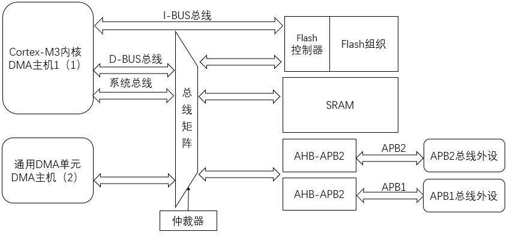
- STM32的Cortex-M3内核通过指令总线与Flash存储器连接；数据总线、系统总线和先进高速总线AHB相连。STM32的内部SRAM和DMA单元直接与AHB总线相连，外部设备使用两条先进设备总线APB连接，而每一条APB总线又都与AHB总线矩阵相连。

<!-- slide: 5 -->

- ①代码区（0x00000000~0x1FFFFFFF）：该区用来存放程序。
- ②SRAM区（0x20000000~0x3FFFFFFF）: 该区用于片内SRAM。
- ③片上外设区（0x40000000~0x5FFFFFFF）: 该区用于片上外设。
- ④静态存储器控制器(FSMC)区（0x60000000~0x9FFFFFFF），使用FSMC控制器后，可以把FSMC提供的FSMC_A[25:0]作为地址线，而把FSMC提供的FSMC_D[15:0]作为数据总线，使用FSMC为外部存储器和设备提供地址、数据和控制总线。
- ⑤在0xA0000000到0xDFFFFFFF的1GB的地址存储空间是用于片外外设扩展；
- ⑥在0xE0000000到0xFFFFFFFF的512MB的地址存储空间是用于NVIC、MPU及调试组件等使用，是私有外设和供应商制定功能区。
- 2.STM32F103存储区

<!-- slide: 6 -->

- 代码区起始地址从0x00000000开始；片上SRAM从0x20000000开始；用户设备的存储映射从0x40000000开始，其中设备寄存器地址位于外设位带区；Cortex-M3内核寄存器地址从0xE0000000处开始。
- Flash存储区由三部分组成，如图中间所示，首先用户Flash区从0x08000000开始；其次系统存储区是一个4KB的Flash存储空间，存储出厂启动引导（Bootloader）;最后一部分从0x1FFFF800开始，含有一组可配置字节，允许用户对STM32进行系统配置。Bootloader的主要作用是允许用户通过USART1将代码下载进STM32的RAM中，随后将这些代码写进内部用户Flash。

<!-- slide: 7 -->

- 3.1.2微控制器常用接口
- 针对STM32F103芯片主要接口如下：

> 备注：（1）内存SRAM，用于存放数据的存储空间。（2）Flash，用于存放程序的存储空间。（3）GPIO接口，用于输入/输出口。（4）USART接口，用于同步/异步串行通信的接口。（5）定时器，用于对内部时钟信号进行计数，从而实现定时功能；对外部的时钟信号进行计数从而实现计数功能。一般借助定时器有相应的扩展功能，如通过定时器对外部脉冲宽度进行计数从而实现捕获功能，通过对脉宽宽度（PWM）进行调整从而输出不同大小的电压。（6）SPI接口，实现同步串行通信的接口。（7）ADC接口，实现模拟量转为数字量的接口。（8）CAN接口，实现CAN总线通信接口。（9）USB接口，实现USB Slave接口的功能。（10）I2C接口，实现I2C总线通信接口。（11）实时时钟RTC，实现时间定时功能。（12）报警狗WDG，实现报警狗功能（13）SysTick，实现滴答定时器的功能，由Cortex-M3内核提供。

<!-- slide: 8 -->

| STM32 | STM32代表ARM Cortex-M内核的32位微控制器 |
|---|---|
| F | F代表芯片子系列。 |
| 103 | 103代表增强型系列。 |
| R | R这一项代表引脚数，其中T代表36脚，C代表48脚，R代表64脚，V代表100脚，Z代表144脚，I代表176脚。 |
| B | B这一项代表内嵌Flash容量，其中6代表32K字节Flash，8代表64K字节Flash，B代表128K字节Flash，C代表256K字节Flash，D代表384K字节Flash，E代表512K字节Flash，G代表1M字节Flash。 |
| T | T这一项代表封装，其中H代表BGA封装，T代表LQFP封装，U代表VFQFPN封装。 |
| 6 | 6这一项代表工作温度范围，其中6代表-40——85℃，7代表-40——105℃。 |

- 3.1.3 STM32F103微控制器系列介绍
- STM32F103系列属于中低端的32位Cortex-M3 ARM微控制器，最高72MHz工作频率。

<!-- slide: 9 -->

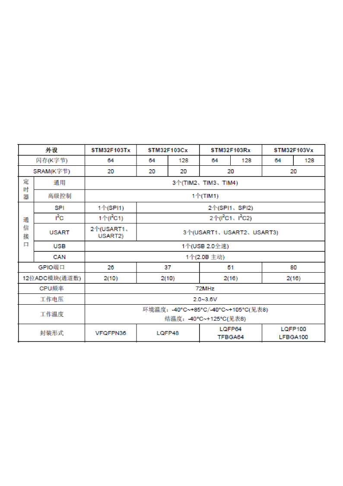
- STM32F103系列微控制器内部资源

> 备注：STM32F103微控制器有一系列的产品，包括有不同的型号，主要有大小不同的SRAM和闪存（Flash），以及接口的数量不一样，封装方面也有区别。本书主要以STM32F103R6为主，此芯片程序Flash是32KB；数据RAM是10KB；工作频率72MHz；3个16位定时器，有12个输入捕捉接口（IC），12个输出比较接口（OC）和14个脉宽宽度调制输出接口（PWM）；1个SPI接口；1个I2C接口；2个USART接口；1个USB接口，1个CAN接口；总计有51个I/O口，电压范围2到3.6V；封装为LQFP64。

<!-- slide: 10 -->

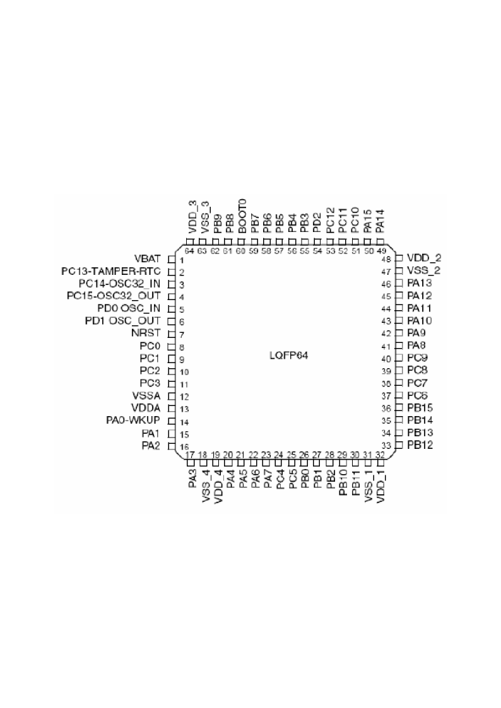

> 备注：其中，PAx、PBx、PCx是芯片通用输入/输出接口(GPIO)，也可以复用为专用功能接口，例如PA2既可以作为通用输入/输出接口又可以复用为串口2的发送口（USART2_TX）；VDDx是数字电源，STM32F103系列芯片采用3.3V电压，从抗干扰以及功率均衡方面考虑，芯片常常有多路电源接口，VSSx是数字地；VDDA和VSSA是模拟电源和模拟地，也采用3.3V电压，为了避免数字信号对模拟部分的干扰，所以模拟电源单独提供；VBAT当使用电池或其他电源连接到VBAT脚上时，当VDD断电时，可以保存备份寄存器的内容和维持RTC的功能。如果应用中没有使用外部电池，VBAT引脚应接到VDD引脚上；PD0-OSC_IN和PD1-OSC_OUT是芯片高频时钟输入/输出接口；PC14-OSC32_IN和PC15-OSC32_OUT是芯片低频时钟输入/输出接口；PA0-WKUP是芯片唤醒接口，用于把芯片从低功耗状态唤醒；PC13-TAMPER-RTC是侵入事件检测，当TAMPER引脚上的信号从0变成1或者从1变成0(取决于备份控制寄存器BKP_CR的TPAL位)，会产生一个侵入检测事件，侵入检测事件将所有数据备份寄存器内容清除。

<!-- slide: 11 -->

- STM32芯片官方手册
- 《STM32F103xC_D_E芯片说明手册》，这个资料主要侧重对具体的芯片的管脚定义，功能模块，封装等进行说明，资料总页数就100多页
- 《STM3210xxx系列芯片开发手册》这个资料主要侧重有关芯片开发讲解，对时钟、存储器架构、各个外设和寄存器都描述得清清楚楚，资料总页数达到了1000页，如何开发程序及配置寄存器都要看开发手册。
- STM32芯片开发主要采用了调用库函数的方式进行，因此ST公司也提供了库函数帮助手册，例如：stm32f10x_stdperiph_lib_um.chm库函数帮助文件。
- 详细了解内核的架构和特性，可以通过阅读《ARM Cortex-M3权威指南》手册来实现。

<!-- slide: 12 -->

- 3.2微控制器基本电路
- 3.2.1 电源电路
- STM32F103系列微控制器采用的电源工作范围是2.0~3.6V，常规设计一般选用3.3V电源。
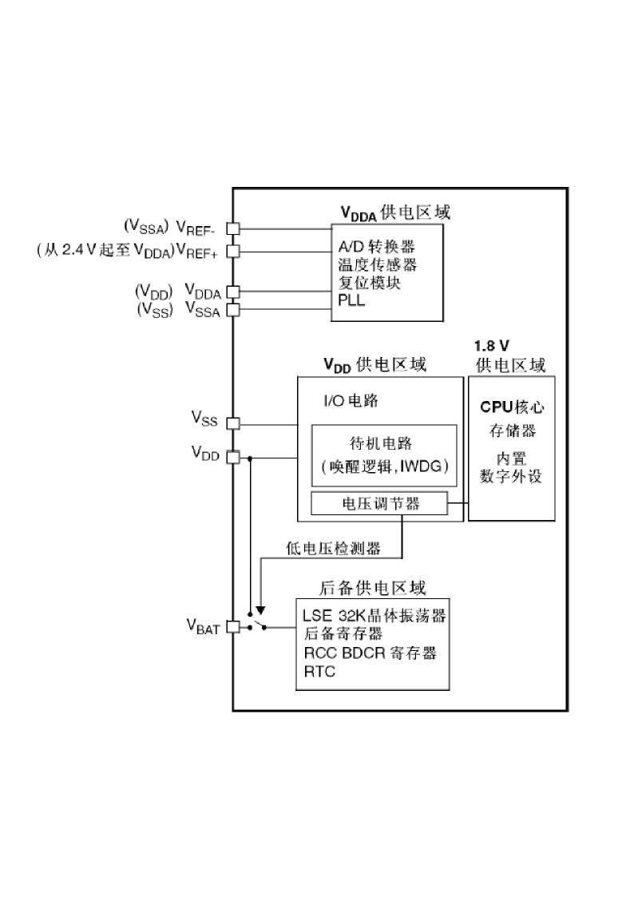
- (1) 主电源VDD和VSS
- (2) 备用电源VBAT
- (3)模拟电压VDDA
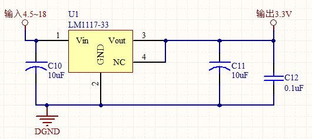
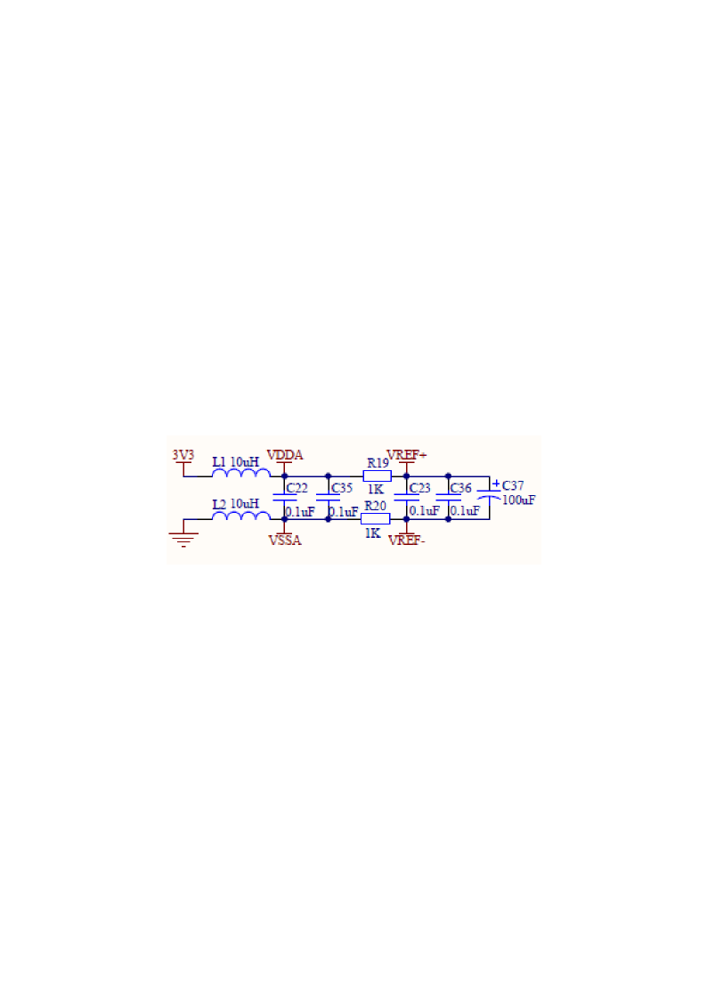

<!-- slide: 13 -->

- 3.2.2 复位（Reset）电路
- STM32F103支持3种复位形式，即系统复位、电源复位和备份区域复位。
- ①NRST引脚上出现低电平（如外部按钮复位）。其复位效果与需要的时间、微控制器供电电压、复位阈值等相关。为了使其充分复位，在工作电压3.3V时，复位时间200ms。复位入口地址为0x00000004。
- ②窗口看门狗计数终止(WWDG复位) ；
- ③独立看门狗计数终止（IWDG复位）；
- ④软件复位（SW复位），通过设置相应的控制寄存器位来实现；
- ⑤低功耗管理复位，进入待机模式或停止模式时引起的复位。
- 1.系统复位

<!-- slide: 14 -->

- 2.电源复位
- 电源复位能复位除备份域寄存器外的所有寄存器。当以下事件发生时，将产生电源复位。
- 利用上电瞬时通过电容短路的特点以及常态断路的特点，产生一个脉冲信号，并连接到芯片NRST引脚从而产生RESET。
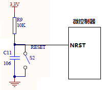

<!-- slide: 15 -->

- 当以下事件中之一发生时，产生备份区域复位：
- ①软件复位后，备份区域复位可由设置备份区域控制寄存器RCC_BDCR中的BDRST位产生。
- ②在VDD和VBAT两者掉电的前提下，VDD或VBAT上电将引发备份区域复位。
- 3.备份域复位

<!-- slide: 16 -->

- 3.2.3 时钟源
- (1) 高速外部时钟（HSE）
- (2) 低速外部时钟（LSE）
- (3) 高速内部时钟（HSI）
- (4) 低速内部时钟（LSI）
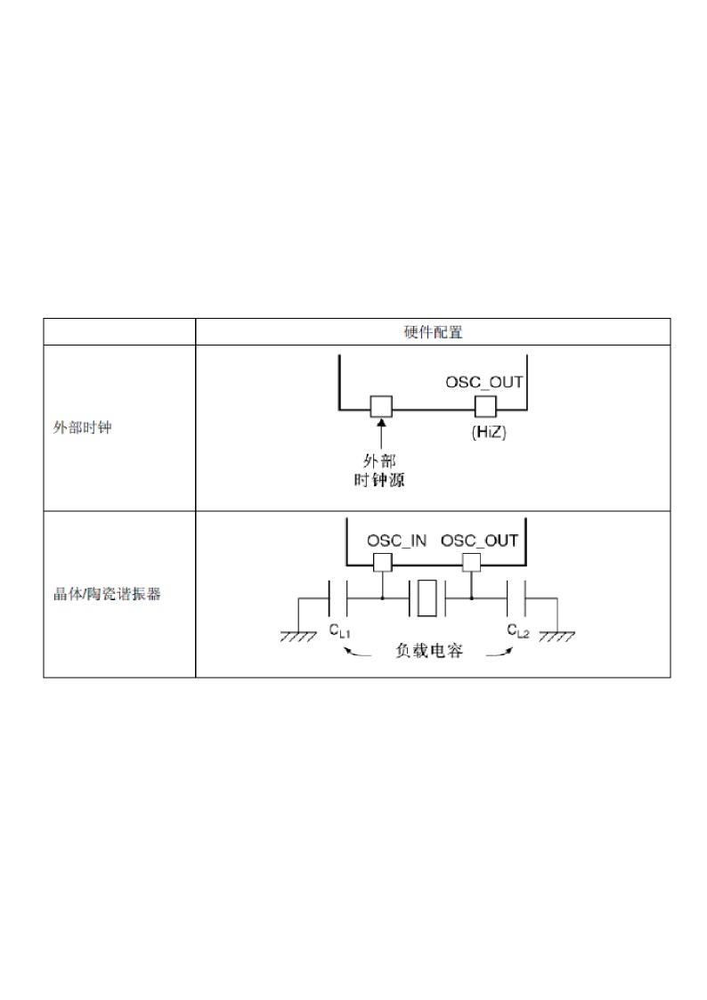
- 外部时钟
- 内部时钟
- (5) 锁相环倍频输出( PLL)

> 备注：1. 高速外部时钟（HSE）
晶体/陶瓷谐振器可以选择4~16MHz的外部振荡器，为系统提供更为精确的主时钟。外部时钟源主要作为STM32处理器和外设的驱动时钟，一般称为高速外部振荡器（HSE_OSC）。用户提供的外部时钟，频率最高可达25MHz，连接到芯片SOC_IN引脚，波形可以是 50%左右占空比的方波、正弦波或三角波。
2. 低速外部时钟（LSE）
STM32还可以使用第2个外部振荡器，称为低速外部振荡器（LSE_OSC）。一般用于驱动实时时钟（RTC）以及窗口看门狗（IWDG）。像高速外部振荡器那样，LSE也可以使用外部晶振或者用户自行供给，时钟波形也可以是方波、三角波和正弦波，要求具有50%左右的占空比。LSE的典型频率值为32.768kHz，因为这样可以给实时时钟提供准确的时钟频率。
3. 高速内部时钟（HSI）
HSI时钟信号由内部8MHz的RC振荡器产生，可直接作为系统时钟或在2分频后作为PLL输入。HSI的RC振荡器能够在不需要任何外部器件的条件下提供系统时钟。它的启动时间比HSE晶体振荡器短。然而，即使在校准后它的时钟频率精度仍较差。
4. 低速内部时钟（LSI）
LSI是一个低功耗时钟源，它可以在停机模式或待机模式下保持运行，为独立看门狗和自动唤醒单元提供时钟。LSI时钟频率大约40kHz（在30~60kHz之间）。
5. 锁相环倍频输出(PLL) 
PLL为锁相环倍频输出，其时钟输入源可选择为HSI/2、HSE或者HSE/2。倍频可选择为2~16倍，但是其输出频率最大不得超过72MHz。

<!-- slide: 17 -->

- 3.2.4 STM32时钟管理
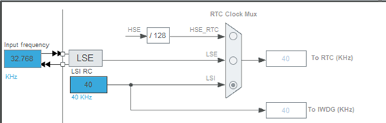
- 其中，40kHz的LSI供独立看门狗IWDG使用，另外它还可以被选择为实时时钟RTC的时钟源。另外，实时时钟RTC的时钟源还可以选择LSE，或者是HSE的128分频。

<!-- slide: 18 -->

- STM32中有一个全速功能的USB模块，当需使用到USB模块时，PLL必须使能，并且时钟配置为48MHz或72MHz。
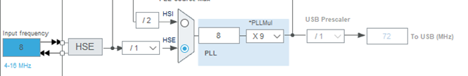
- STM32还可以选择一个时钟信号输出到MCO脚(PA.8)上，可以选择为PLL输出的2分频、HSI、HSE或者系统时钟。
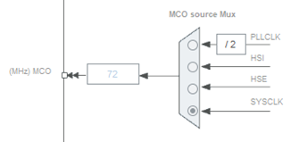

<!-- slide: 19 -->

- 系统时钟SYSCLK，它是提供STM32中绝大部分部件工作的时钟源。系统时钟可以选择为PLL输出、HSI、HSE。系统时钟最大频率为72MHz，它通过AHB分频器输出的时钟送给5大模块使用：
- （1）送给AHB总线、内核、内存和DMA使用的HCLK时钟；
- （2）通过8分频后送给Cortex的系统定时器时钟STCLK；
- （3）直接送给Cortex的空闲运行时钟FCLK；
- （4）送给APB1分频器。
- （5）送给APB2分频器。
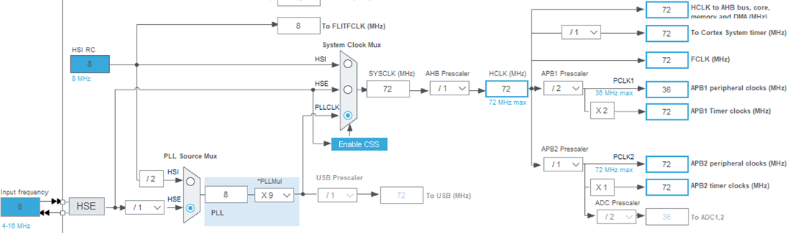

> 备注：APB1和APB2连接的模块：
（1）连接在APB1(低速外设)上的设备有：电源接口、备份接口、CAN、USB、I2C1、I2C2、UART2、UART3、SPI2、窗口看门狗、Timer2、Timer3、Timer4。注意USB模块虽然需要一个单独的48MHz的时钟信号，但是它应该不是供USB模块工作的时钟，而只是提供给串口引擎(SIE)使用的时钟。USB模块的工作时钟应该是由APB1提供的。
（2）连接在APB2（高速外设）上的设备有：UART1、SPI1、Timer1、ADC1、ADC2、GPIOx(PA~PE)、第二功能I/O口。

<!-- slide: 20 -->

- STM32F103系列微控制器的下载调试系统支持两种接口标准：5针的JTAG端口和2针的SWD串口，这两种接口需要牺牲通用I/O口来供给调试器仿真器使用。
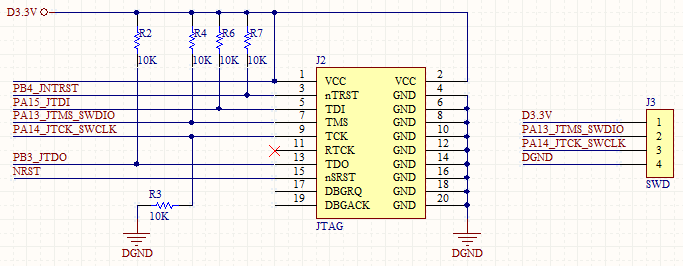
- 3.2.5 下载电路

> 备注：JTAG IEEE标准建议在JTDI、JTMS和JNTRST引脚上添加上拉电阻，但是对JTCK没有特别建议，针对STM32单片机JTCK一般接下拉电阻。
SWD调试方式主要有SWDCLK、SWDIO两根信号线，SWDCLK为主机到STM32目标板的时钟信号，SWDIO为双向数据信号。
也可以通过更改启动方式，从系统存储器启动，利用ST公司提供的Bootloader程序利用串口实现对程序的下载。

<!-- slide: 21 -->

- 3.2.6 启动配置电路
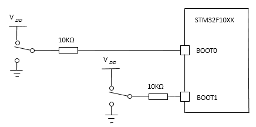
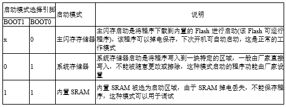

> 备注：（1）从Flash存储器启动，Flash存储器被映射到启动空间（0x00000000），同时仍能在原有的地址（0x08000000）访问它，即从芯片内置的Flash启动。
（2）从系统存储器启动，系统存储器被映射到启动空间（0x00000000），同时仍然能在原有的地址（0x1FFFF000）访问它，芯片内部一块特定的区域，芯片出厂时在这个区域预置了一段Bootloader。这个区域的内容在芯片出厂后没有人能够修改或擦除，即它是一个ROM区。
（3）从内置SRAM启动，只能在0x20000000开始的地址区访问SRAM，即从芯片内置的RAM区启动，一般在调试时使用。注意，当从内置SRAM启动，在应用程序的初始化代码中，必须使用NVIC的异常表和偏移寄存器，重新映射向量表到SRAM中。

<!-- slide: 22 -->

- 3.3微控制器低功耗模式
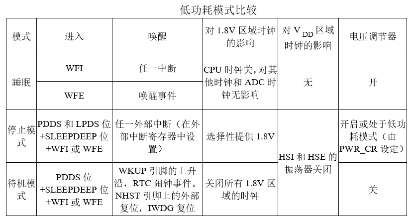
- STM32F103系列芯片支持3种低功耗模式，即睡眠模式（Sleep mode）、停止模式（Stop mode）和待机模式（Standby mode）。

> 备注：睡眠模式：电压调节器工作正常，Cortex-M3处理器停止运行，但Cortex-M3的内部外设仍然正常运行，PLL、HSE、HSI也正常运行；所有的SRAM和寄存器的内容被保留；所有的I/O引脚都保持它们在运行模式时的状态；功耗相对于正常模式得到降低。
停止模式：也称为“深度睡眠模式”。电压调节器工作在停止模式，选择性地为某些模块提供1.8V电源；Cortex-M3停止运行，Cortex-M3的内部外设停止运行；STM32时钟PLL、HSE和HIS被关断；所有的SRAM和寄存其的内容被保留。
待机模式：整个1.8V区域断电；Cortex-M3处理器停止运行，内部外设停止运行；STM32的PLL、HSE和HIS被关断；SRAM和寄存器内的内容丢失；备份寄存器内容保留；待机电路维持供电。

<!-- slide: 23 -->

- STM32芯片最小化系统
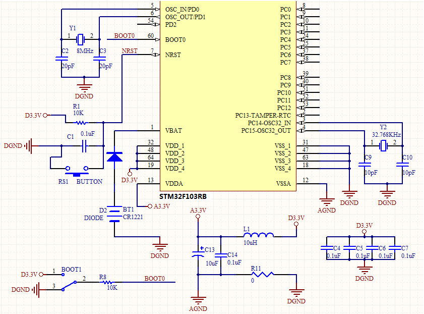

<!-- slide: 24 -->

- 谢谢!
