# ch4微控制器软件开发

<!-- slide: 1 -->

## 第4章 微控制器软件开发

- 嵌入式微控制器原理及设计
- —基于STM32及Proteus仿真开发
- 配套PPT

<!-- slide: 2 -->

<!-- slide: 3 -->

- 4.1 微控制器开发语言
- 4.2 微控制器开发库函数
- 4.3 微控制器开发环境
- 4.4微控制器虚拟仿真环境
- 4.5微控制器程序调试和下载
- 第4章 微控制器软件开发

<!-- slide: 4 -->

- 4.1 微控制器开发语言
- 4.1.1 开发语言介绍
- 用户从C语言main()函数开始编写代码就好，典型执行过程：从CPU复位时的指定地址开始执行；跳转至汇编代码startup处执行如下内容：初始化堆栈指针SP、初始化程序计数器指针PC、设置堆、栈的大小、设置异常向量表的入口地址、配置外部SRAM作为数据存储器、设置C库的分支入口__main（最终用来调用main函数）；接着跳转至用户主程序main执行，用户的应用程序主要在此实现。
- 需要对整个程序根据功能进行划分，C语言是一种结构化的设计语言，可根据功能划分为多个模块：
- （1）每个模块是一个.c文件和一个.h文件的结合，头文件（.h）中是对于该模块接口的声明。
- （2）若某个模块被其他模块调用，其函数及数据需在.h中文件中冠以extern关键字声明。
- （3）模块内的私有函数和全局变量需在.c文件开头冠以static关键字声明。

<!-- slide: 5 -->

- 许多编译开发商在标准C上增加了对中断的支持，提供新的关键字用于标示中断服务程序（ISR），类似于__interrupt、#program interrupt等。当一个函数被定义为ISR时，编译器会自动为该函数增加中断服务程序所需要的中断现场入栈和出栈代码。中断服务程序需要满足如下要求：
- 中断服务程序需要满足如下要求：
- （1）不能有返回值；
- （2）中断服务程序尽可能短小；
- （3）中断服务程序不能传递参数；
- （4）中断和主程序共用的全局变量，建议定义为volatile类型，从而避免编译器优化过程中去除此变量。
- （5）printf(char * lpFormatString,…)函数会带来重入和性能问题，不能在ISR中采用。

<!-- slide: 6 -->

- 4.1.2 嵌入式C语言
- 1.数据类型
- C语言支持常用的字符型，整型，浮点型变量，常见的数据类型有char、short、int、long、unsigned、float和double等。
- 2.运算符
- 算术运算符有=（赋值）、+（加法）、-（减法）、*（乘法）、/（除法）、%（求余）和^(方根)，结果对应数学的运算结果。
- 逻辑运算符有&&（逻辑与）、||（逻辑或）和!（逻辑非)，逻辑运算符输出为真（True）或假（False）。
- 比较运算符有==（是否等于）、>（是否大于）、>=(是否大于等于)、<（是否小于）和<=(是否小于等于)，比较运算符的输出为真（True）或假（False）。
- 3.位操作符
- 位操作符有<<（左移）、>>（右移）、&（位与）、|（位或）和~（位取反）。位操作在嵌入式C语言代码中经常出现，尤其是在对寄存器进行直接操作时。

<!-- slide: 7 -->

- 4.数据存储关键字
- 数据存储常用的关键字有auto、static、extern、volatile、const和register等。
- （1）使用auto修饰的变量，是具有自动存储器的局部变量。
- （2）static在文件作用域和代码块作用域的意义是不同的：在文件作用域用于
- 限定函数和变量的外部链接性(能否被其他文件访问)，在代码块作用域则用于将
- 变量分配到静态存储区。
- 针对文件作用域，当一个函数的全局变量被声明为static后，称为静态全局变量，它只在定义它的源文件内有效，其他源文件无法访问它。
- （3）extern可以声明其他文件内定义的变量，它可以声明多次，但类型必须完全一样，定义只有一次。

<!-- slide: 8 -->

- （4）volatile限定一个对象可被外部进程（操作系统、硬件或并发进程等）改变，
- volatile与变量连用，可以让变量被不同的线程访问和修改。volatile修饰符就是明
- 确告诉编译器不准把这个变量优化到寄存器上，只能放内存里。
- 一般volatile用在如下几个地方：
- 1）中断服务程序中修改的供其他程序检测的变量需要加volatile
- 2）多任务环境下各任务间共享的标志应该加volatile；
- 3）存储器映射的硬件寄存器通常也要加volatile说明，因为每次对它的读写都可
- 能有不同意义。
- （5）const本意为变量只读，微控制器的编译器会把const修饰的全局变量存放ROM中，因此把常量数据申明为const，作为只读的变量，不允许再次赋值。
- （6）register限制变量定义在寄存器上的修饰符，定义快速访问的变量，放在寄存器内计算速度更快。

<!-- slide: 9 -->

- 5. 内存管理和存储架构
- 嵌入式C语言按照在硬件的区域不同，内存分配常有三种方式：
- （1）静态存储区域分配。在程序编译时内存就已经分配好，这块内存在程序的整个运行期间都存在，例如全局变量，static变量。
- （2）栈上创建。执行函数时，函数内局部变量的存储单元都可以在栈上创建，函数执行结束时这些存储单元自动被释放。栈内存分配运算内置于处理器的指令集中，效率很高，但是分配的内存容量有限。
- （3）堆上创建，亦称动态内存分配。程序在运行时，用malloc或new申请任意多少的内存，但程序员需负责在何时用free或delete释放内存，动态内存的生存期由程序员决定，使用灵活，但若内存不及时释放会造成内存溢出。

<!-- slide: 10 -->

- 6.数组和指针
- 数组是由相同类型元素构成，当被声明时，编译器就根据内部元素的特性在内存中分配一段连续空间，另外C语言也提供多维数组。数组从0开始获取值，以length-1作为结束，通过[0, length)半开半闭区间访问。
- 指针和数组有着联系，其实数组就是一个连续地址存放着常数，例如int arry[3]={1,2,3};那么arry就是该数组的首地址，*arry就是该数组首地址存放的数据1，*(arry+1)则为该数组的第二个位置存放的数据2。
- char strval[] = "hello";                                        int intval[] = {1, 2, 3, 4};
- int arr_val[][2] = {{1, 2}, {3, 4}};                      const char *pconst = "hello";
- char *p;                                                                int *pi;
- int *pa;                                                                 int **par;
- p = strval;                                                             pi = intval;
- pa = arr_val[0];                                                    par = arr_val;

<!-- slide: 11 -->

- 7. 结构类型
- C语言提供自定义数据类型来描述一类具有相同特征的数据，主要支持的有结构体，枚举和联合体。
- (1) 枚举通过别名限制数据的访问，可以让数据更直观，易读，实现如下：
- typedef enum DAY
- {
- MON=1, TUE, WED, THU, FRI, SAT, SUN
- } day；
- Day d1=TUE;
- (2) 联合体的是能在同一个存储空间里存储不同类型数据的数据类型，对于联合体的占用空间，则是以其中占用空间最大的变量为准，如下：
- typedef union {
- char c;
- int i;
- } UNION_VAL;
- UNION_VAL val;
- val.i = 2;

<!-- slide: 12 -->

- (3) 结构体则是将具有共通特征的变量组成的集合，通过自定义数据类型，函数指针，仍然能够实现很多类似于类的操作，对于大部分嵌入式项目来说，结构化处理数据对于优化整体架构以及后期维护大有便利。
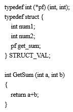
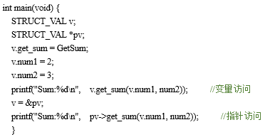
- 程序运行结果：
- Sum:5
- Sum:5

<!-- slide: 13 -->

- 8. 预处理机制
- C语言提供了丰富的预处理机制；#include包含文件命令；#define宏定义；#if..#elif...#else...#endif，#ifdef..#endif，#ifndef...#endif条件选择判断，条件选择主要用于切换代码块；#undef取消定义的参数，避免重定义问题；#error，#warning用于用户自定义的告警信息，配合#if，#ifdef使用，可以限制错误的预定义配置；#pragma带参数的预定义处理，常见的#pragma pack(1)，使用后会导致后续的整个文件都以设置的字节对齐。
- 例如在STM32芯片库文件.h常用到预处理，如下：
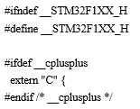

<!-- slide: 14 -->

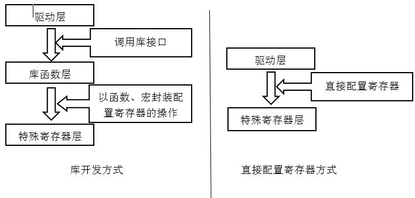
- ST公司针对STM32提供函数接口，即API(Application Program Interface)，开发者可通过调用这些函数接口来配置STM32的寄存器，使得开发人员可以脱离最底层的寄存器操作，有开发快速、易于阅读和维护成本低等优点。
- 4.2 微控制器开发库函数
- 4.2.1 STM32开发库函数介绍

<!-- slide: 15 -->

- STM32采用的Cortex-M3内核是ARM公司提出的，采用ARM公司的CMSIS标准库：
- 包括：
- ①内核函数层：其中包含用于访问内核寄存器的名称、地址定义，主要由ARM公司提供。
- ②设备外设访问层：提供了片上的核外外设的地址和中断定义，主要由芯片生产商提供。

<!-- slide: 16 -->

- ST公司推出了标准库（STD库)、HAL库和LL库三种不同版本库函数：
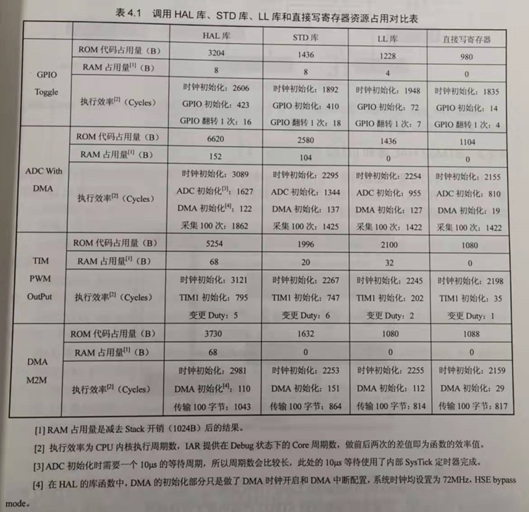

> 备注：根据时间顺序ST公司最早推出的是标准库，因此现在很多延续早期STM32芯片代码版本的方案往往还是采用标准库函数的方式。近年来ST公司逐步淘汰标准库函数，生产出新型号芯片已不支持标准库，转而主要支持HAL库和LL库，这两种库是ST公司同步推出的，并可以配合STM32CubeMX软件，让开发者进行傻瓜式开发，很方便。LL库和HAL库两者相互独立，只不过LL库更底层，部分HAL库会调用LL库（如USB驱动），同样LL库也会调用HAL库。

<!-- slide: 17 -->

- 4.2.2 STM32标准库（STD）
- 标准外设库仍然接近于寄存器操作，主要就是将一些基本的寄存器操作封装成了C函数。开发者需要关注所使用的外设是在哪个总线之上，具体寄存器的配置等底层信息。标准外设库的文件基本架构并不复杂。
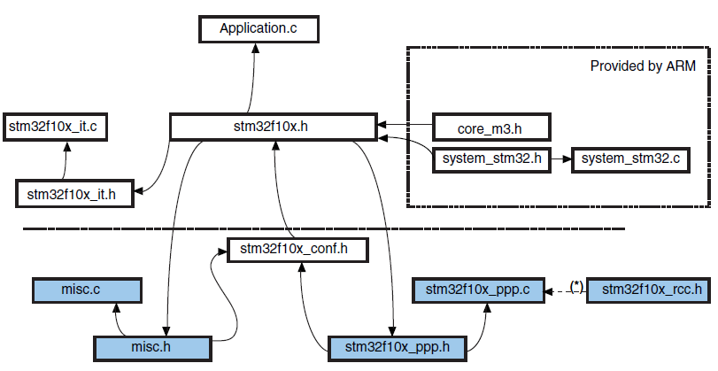
- stm32f10x_ppp程序是在项目中使用的各个外设代码，例如针对GPIO外设有stm32fl0x_gpio.c和stm32f10x_gpio.h

<!-- slide: 18 -->

- 4.2.3 STM32HAL库和LL库
- ST公司专门为开发了配套的桌面软件STM32CubeMX，开发者可以直接使用该软件进行可视化配置，大大节省开发时间，这其中就包含HAL库和最近新增的LL库。
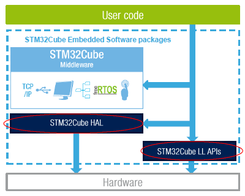

<!-- slide: 19 -->

- 1. HAL库
- HAL库是ST公司目前主力推的开发方式，全称就是Hardware Abstraction Layer（硬件抽象层）。HAL库是ST为STM32最新推出的抽象层嵌入式软件，可以更好地确保跨STM32产品的最大可移植性。该库提供了一整套一致的中间件组件，如RTOS、USB、TCP/IP和图形等。
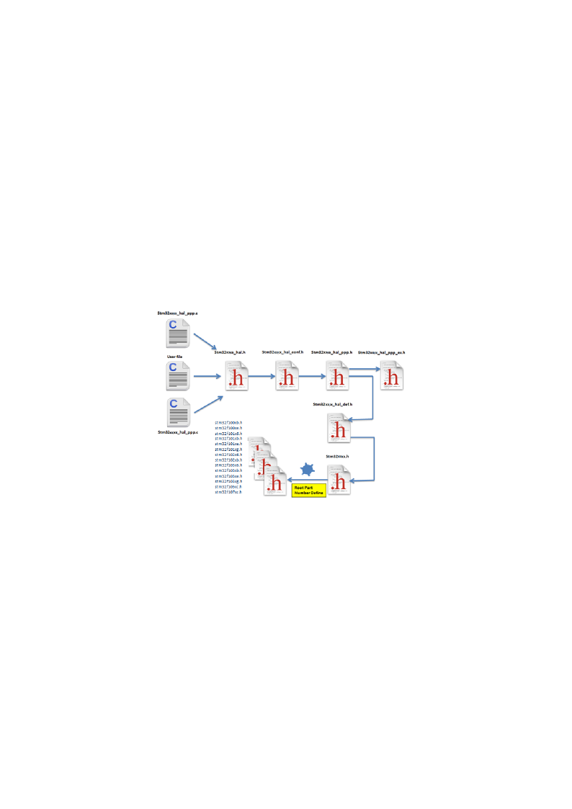

> 备注：stm32xxxx.h主要包含STM32同系列芯片的不同具体型号的定义、是否使用HAL库等的定义，接着，其会根据定义的芯片信号包含具体的芯片型号的头文件。
stm32xxxx_hal.h：主要实现HAL库的初始化、系统滴答定时器相关函数及CPU的调试模式配置。
stm32xxxx_hal_conf.h：该文件是一个用户级别的配置文件，用来实现对HAL库的裁剪，其位于用户文件目录，不要放在库目录中。
stm32xxxx_hal_ppp.c和stm32xxxx_hal_ppp.h程序是在项目中使用的各个外设代码，例如针对GPIO外设有stm32fl0x_gpio.c和stm32f10x_gpio.h。
HAL库文件名均以stm32f2xx_hal开头，后面加上_外设或者模块名（如：stm32xxxx_hal_adc.c）：
根据HAL库的命名规则，其API可以分为以下三大类：
初始化/反初始化函数：HAL_PPP_Init(), HAL_PPP_DeInit()
I/O操作函数：HAL_PPP_Read(), HAL_PPP_Write(),HAL_PPP_Transmit(), HAL_PPP_Receive()
控制函数：HAL_PPP_Set (), HAL_PPP_Get().
状态和错误：HAL_PPP_GetState(), HAL_PPP_GetError().

<!-- slide: 20 -->

- 2. LL库
- ST在推行HAL库时，逐渐停止了对于标准库的更新（新出的芯片已经不再提供标准库了），但也意识到了HAL库效率较低的问题，因此同时也推出了LL（Low-layer）库，针对一些低性能（M0）或者低功耗(L系列)的芯片编程，相对于HAL库的低效率，寄存器操作的复杂，标准库的逐渐淘汰问题，LL库就成为替代HAL库一个比较好的选择了。
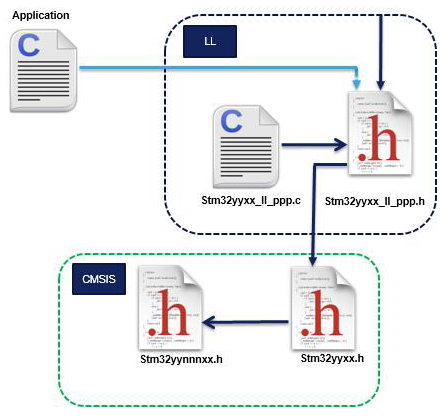

> 备注：stm32yynnnxx.h和stm32yyxx.h主要包含STM32同系列芯片的不同具体型号的定义，会根据定义的芯片信号包含具体的芯片型号的头文件。stm32yyxx_ll_ppp.c和stm32yyxx_ll_ppp.h程序是在项目中使用的各个外设代码，例如针对GPIO外设有stm32fl0x_gpio.c和stm32f10x_gpio.h。
LL库更接近硬件层，对需要复杂上层协议栈的外设不适用，直接操作寄存器。其支持所有外设。使用方法：独立使用，该库完全独立实现，可以完全抛开HAL库，只用LL库编程完成；混合使用，和HAL库结合使用。

<!-- slide: 21 -->

- 目前针对ARM Cortex-M系列微控制器的开发环境平台有ARM公司的MDK开发环境，Embedded Workbench公司的IAR For ARM开发环境，以及自己采用ARM gcc编译器，并选择合适的编辑器搭建开发一个开发平台。
- 4.3 微控制器开发环境

<!-- slide: 22 -->

- 4.3.1 MDK开发环境
- MDK即RealView MDK（Microcontroller Development Kit），是ARM公司目前最新推出的针对各种嵌入式处理器的软件开发工具。
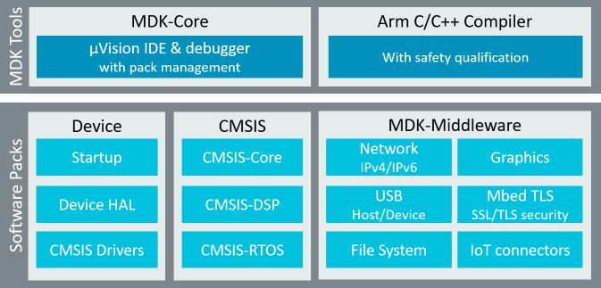

<!-- slide: 23 -->

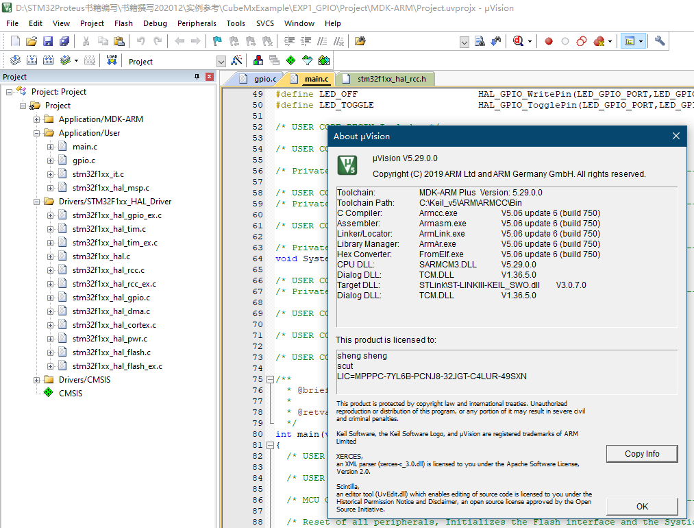

<!-- slide: 24 -->

- 4.3.2 STM32CubeMX软件
- STM32CubeMX的特性如下：
- （1）直观的选择STM32微控制器；
- （2）微控制器图形化配置：自动处理引脚冲突，动态设置确定的时钟树，可以动态确定参数设置的外围和中间件模式和初始化和功耗预测；
- （3）C代码工程生成器覆盖了STM32微控制器初始化编译软件，如IAR、KEIL、GCC。
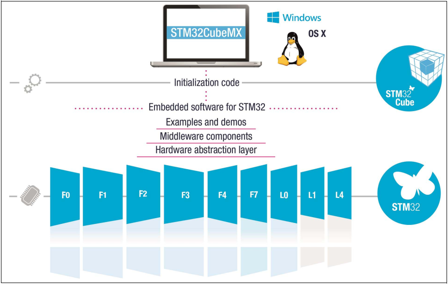

<!-- slide: 25 -->

- STM32CubeMX平台包括STM32Cube HAL和LL库。再加上兼容的一套中间件（RTOS、USB、TCP/IP和图形），所有内嵌软件组件附带了例程。
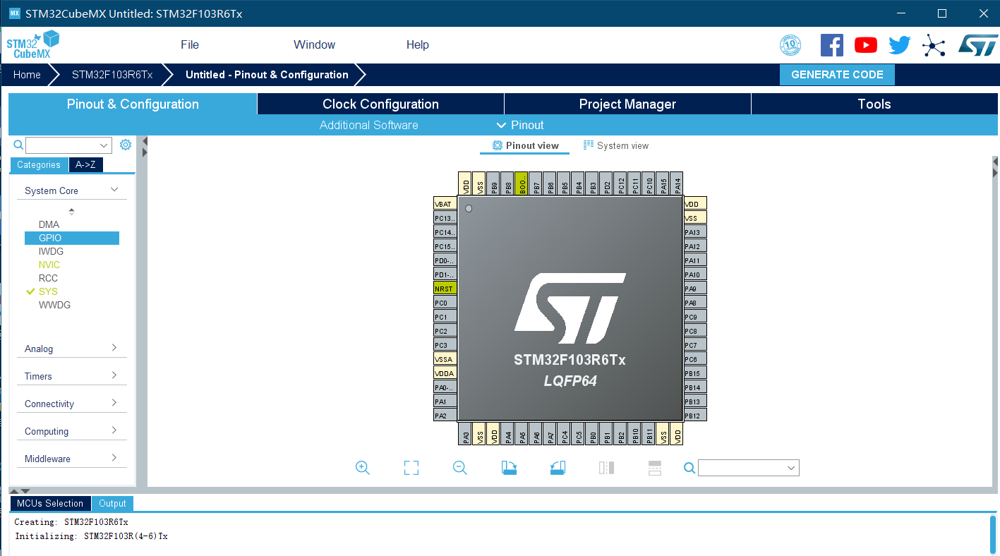

<!-- slide: 26 -->

- 4.4微控制器虚拟仿真环境
- Proteus是由Lab Center Electronics公司推出的电子设计自动化（EDA）软件，并且能仿真微控制器及其外围器件。
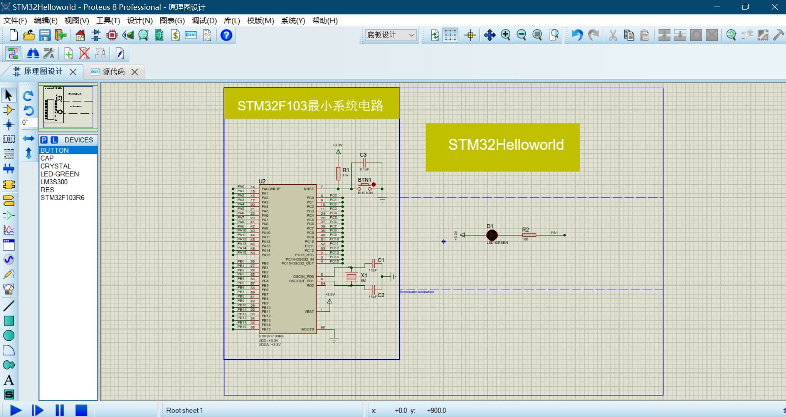

<!-- slide: 27 -->

- 4.5微控制器程序调试和下载
- 有关程序的调试和下载可以通过J-Link、ST-Link、DAPLink和U-Link工具来实现，同时ST公司提供的Bootloader串口下载工具也可以实现程序的下载。
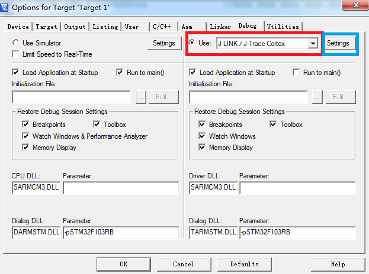

<!-- slide: 28 -->

- 谢谢!
