# ch6微控制器中断

<!-- slide: 1 -->

## 第6章  微控制器中断

- 嵌入式微控制器原理及设计
- —基于STM32及Proteus仿真开发
- 配套PPT

<!-- slide: 2 -->

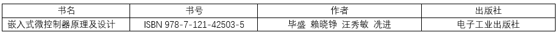

<!-- slide: 3 -->

- 6.1 STM32中断介绍
- 6.2嵌套向量中断控制器
- 6.3 EXTI外部中断
- 6.4 EXTI中断应用实例
- 第6章  微控制器中断

<!-- slide: 4 -->

- 6.1 STM32中断介绍
- STM32F103系列芯片目前支持的中断总计为76个（10个内核异常+60个外部中断），其中10个内核异常是与Cortex-M3内核有关，因此这10个内部异常是任何半导体商也改不了的；60个外部中断和STM32F103系列芯片的接口有关。
- 中断是微控制器中的重要组成部分，加强了CPU对多任务事件的处理能力，通过中断CPU可以暂时停止当前程序的执行转而执行处理新情况的程序和执行过程。

<!-- slide: 5 -->

- 中断向量表
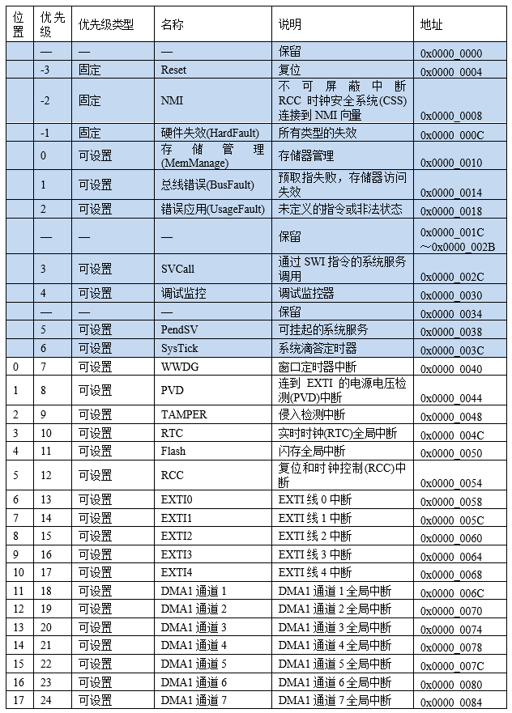
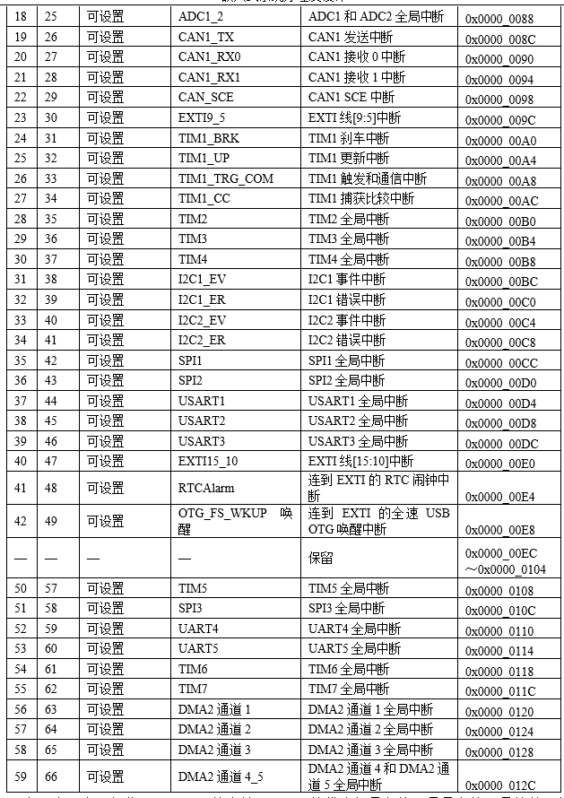

> 备注：有三个异常：复位、NMI、硬件失效（fault）的优先级是负的，是最高的，是软件不能编程的，比其他任何异常都高。
再来看其他的异常及中断，随着编号的增大而优先级降低，但它们的优先级都是可以编程的，软件优先级数字越大优先级越低。

<!-- slide: 6 -->

- 6.2嵌套向量中断控制器
- STM32中有一个强大而方便的嵌套向量中断控制器(Nested Vectored Interrupt Controller，NVIC)，它是属于Cortex-M3内核的器件，内核异常和外部中断都由它来处理。
- 6.2.1 NVIC寄存器
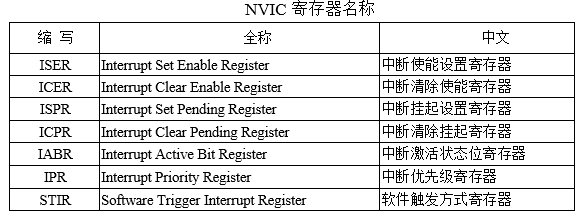
- 其中NVIC寄存器表如下：

<!-- slide: 7 -->

- 6.2.2系统控制寄存器（SCB）
- 系统控制寄存器组（SCB）也是和Cortex-M3内核相关的寄存器，并且在中断配置时用到。
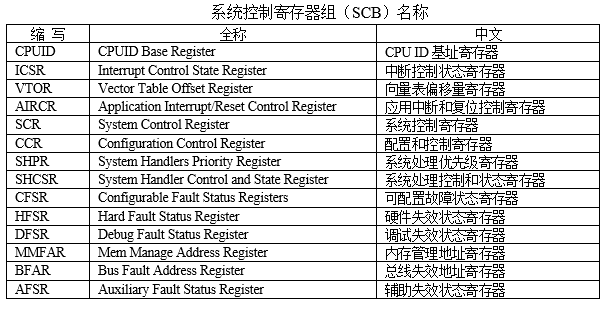

<!-- slide: 8 -->

- 6.2.3中断和异常处理
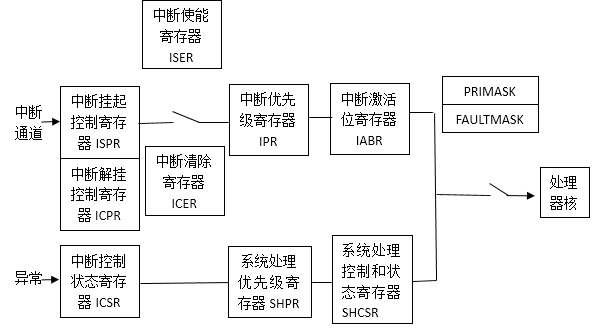
- TM32芯片的中断和异常是分别处理的，其内部处理结构也是分开的

> 备注：中断挂起设置寄存器（ISPR），作用是挂起暂停正在进行的中断，即ISPR寄存器相应位设置为1，而执行更高级别的中断；随后可以通过中断清除挂起寄存器（ICPR）来解除被挂起的中断，即ICPR寄存器相应位设置为1。中断使能设置寄存器（ISER），对相应的中断进行使能使其可以中断响应，即ISER寄存器相应位设置为1；如果不让相应的中断进行响应，则通过中断清除使能寄存器（ICER，类似“屏蔽寄存器”）对相应的中断进行屏蔽使其不能中断响应，即ICER寄存器相应位设置为1。中断优先级寄存器（IPR）用来设置中断的优先级，具体设置在后面内容会详细讲解。中断激活状态位寄存器（IABR）类似中断标志寄存器，若IABR寄存器某位为1，则表示该位所对应的中断正在被执行，这是一个只读寄存器，通过此寄存器可知道当前正在执行的中断，在中断执行完成后，该位由硬件自动清零。
异常通过中断控制状态寄存器（ICSR）来管理，对于NMI、SysTick定时器及PendSV，可以通过此寄存器手工悬起它们；另外，在该寄存器中，有好多位段都用于调试目的；在大多数情况下，它们对于应用软件都没有什么用处，只有悬起位对应用程序常常比较有参考价值。系统处理优先级寄存器（SHPR）：用于对优先级进行配置；以及系统处理控制和状态寄存器（SHCSR）：由于硬件fault，总线fault以及存储器管理fault都是特殊的异常，因此给它们开了小灶，它们的使能控制都是通过SHCSR寄存器来实现，各种faults的悬起状态和大多数系统异常的活动状态也都在该寄存器中。
最后，STM32还可以通过屏蔽寄存器（PRIMASK），可以屏蔽除不可屏蔽中断（NMI）和硬件失效（fault）以外的其他中断/异常；当通过屏蔽错误中断寄存器（FAULTMASK）把当前优先级改为-1，连硬件失效(fault)都可以进行屏蔽，所以除NMI不可屏蔽中断外，其他中断/异常都可以进行屏蔽。屏蔽寄存器虽然能一手遮天，却都动不了NMI，因为NMI是用在最危急的情况下的。

<!-- slide: 9 -->

- 6.2.4 STM32中断优先级
- （1）具有高抢占式优先级的中断可以在具有低抢占式优先级的中断处理过程中被响应，即中断嵌套，或者说高抢占式优先级的中断可以嵌套低抢占式优先级的中断。
- （2）当两个中断源的抢占式优先级相同时，这两个中断将没有嵌套关系，当一个中断到来后，如果正在处理另一个中断，这个后到来的中断就要等到前一个中断处理完之后才能被处理。如果这两个中断同时到达，则中断控制器根据他们的响应优先级高低来决定先处理哪一个；如果他们的抢占式优先级和响应优先级都相等，则根据他们在中断表中的排位顺序（即硬件默认位置）决定先处理哪一个。
- （3）响应优先级不可以中断嵌套。
- STM32(Cortex-M3)中有两个优先级的概念——抢占式优先级和响应优先级。

<!-- slide: 10 -->

- STM32 目前支持的中断共为16级，用4位表示：
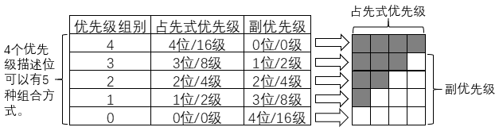
- 可以通过调用STM32的固件库中的函数NVIC_PriorityGroupConfig()选择使用哪种优先级分组方式，这个函数的参数有下列5种：
- NVIC_PriorityGroup_0 => 选择第0组     NVIC_PriorityGroup_1 => 选择第1组     NVIC_PriorityGroup_2 => 选择第2组     NVIC_PriorityGroup_3 => 选择第3组     NVIC_PriorityGroup_4 => 选择第4组
- 可以由void NVIC_PriorityGroupConfig(u32 NVIC_PriorityGroup)库函数进行中断分组设置。

<!-- slide: 11 -->

- 指定中断源的优先级设定
- Cortex-M3为每个中断通道都配备了8位中断优先级控制字IP_n，STM32芯片中只使用该字节高4位，这4位被分成2组，从高位开始，前面是定义抢占优先级的位，后面用于定义响应式优先级，必须根据中断优先级分组中设置好的位数来在该寄存器中设置相应的数值。假如你选择中断优先级分组的第3组：最高3位用于指定抢占优先级，最低1位用于指定响应优先级，那么抢占优先级就有000～111共8种数据选择，也就是有8个中断嵌套，而响应优先级中有0和1两种，总共有8×2=16种优先级。

<!-- slide: 12 -->

- 在STM32F103XX处理器中，外部中断/事件控制器由用于产生事件/中断请求的19个边沿检测器组成，其中16个中断通道EXTI0-EXTI15对应GPIOx_Pin0-GPIOx_Pin15，另外3个是EXTI16连接PVD（Programmable Votage Detector 可编程电压监测器，作用是监视供电电压）输出，EXTI17连接到RTC（Real Time Clock，实时时钟）和EXTI18连接到USB唤醒事件。
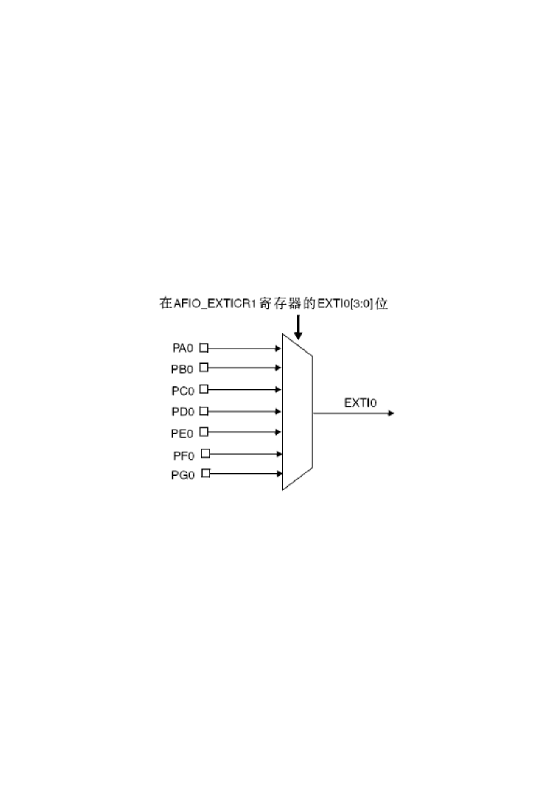
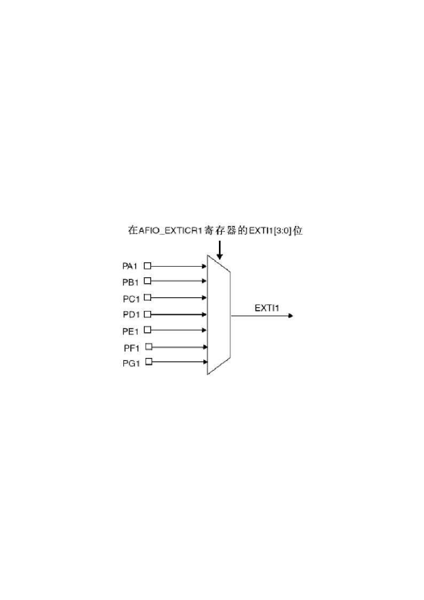
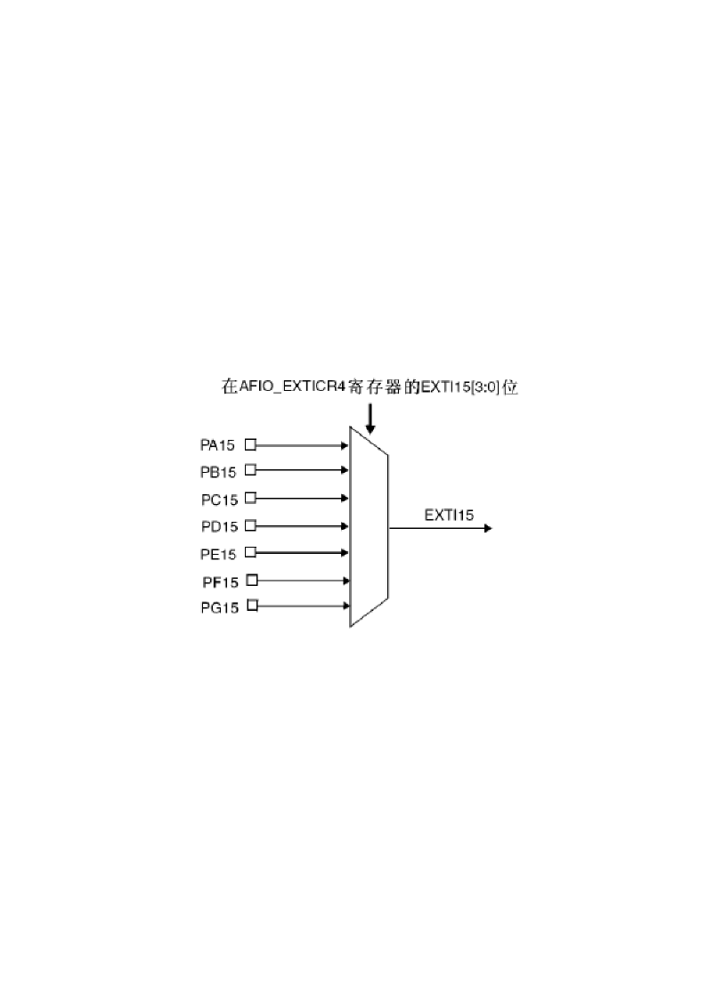
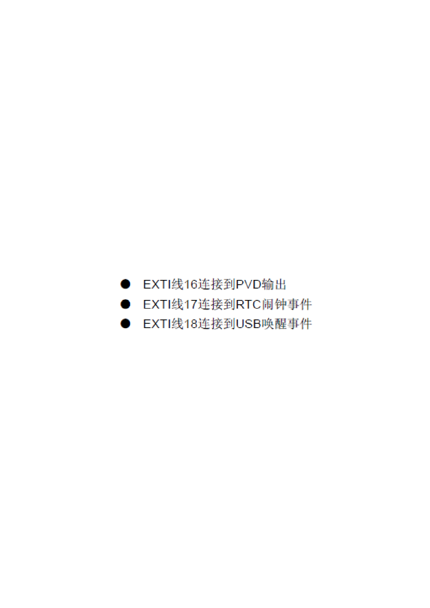
- 6.3 EXTI外部中断
- 6.3.1 EXTI硬件结构

> 备注：每根外部中断输入线也均可以被单独屏蔽，并且处理器通过一个挂起寄存器保存中断请求的状态。外部中断/事件控制器EXTI的主要特性如下所示：
（1）每根外部中断/事件输入线上均可独立触发和屏蔽
（2）每根外部中断/事件输入线都具有专门的状态标志位
（3）最多可产生19个软件事件/中断请求
（4）可捕获脉宽频率低于APB时钟的外部信号

<!-- slide: 13 -->

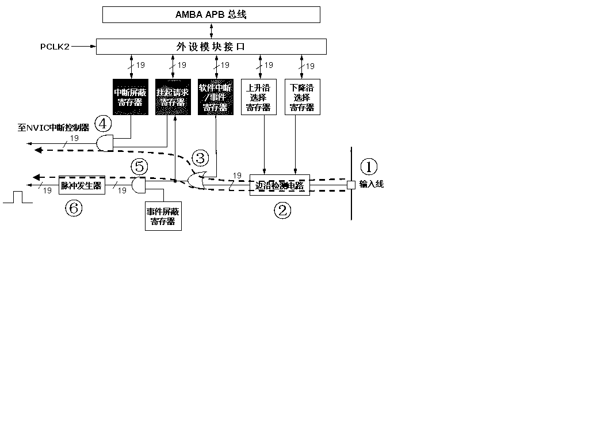
- EXTI硬件结构如图所示，给出了STM32处理器中某一条外部中断线或外部事件线的信号结构图，图中虚线标出了外部中断信号的传输路径。外部中断/事件信号从芯片引脚1输入，经过边沿检测电路2后，通过或门3进入中断“挂起请求寄存器”，最后经过与门4将外部信号输出到NVIC中断控制器。

<!-- slide: 14 -->

- 6.3.2 EXTI中断操作
- STM32外围接口直接通过中断请求通道（IRQ Channel）与NVIC接口关联，而GPIO外部中断（EXTI）则要通过控制器EXTI与NVIC接口。GPIO与EXTI之间的接口称为EXTI line；而EXTI与NVIC之间则为中断请求通道。
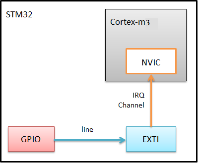

<!-- slide: 15 -->

- 对于编程而言，需要对GPIO、EXTI、NVIC 3个模块分别进行配置和操作。把中断可以简单分为3部分，即中断通道、中断处理和中断响应。
- （1）首先设定好中断通道，具体就是配置GPIO的引脚为输入中断方式，可选择上升沿(GPIO_MODE_IT_RISING)、下降沿(GPIO_MODE_IT_FALLING)和上升下降沿(GPIO_MODE_IT_RISING_FALLING)三种方式。
- （2）接着是中断处理，配置EXTI触发条件，配置相应NVIC，根据中断编号对应到中断向量表查找中断服务函数xxx_IRQHandler(void)的入口地址，即函数指针。
- （3）最后是中断响应，当达到中断触发条件时，内核从主程序先跳转到相应的中断向量处，然后根据中断向量提供地址信息，又跳转到中断服务函数入口地址，并在执行完中断服务函数程序后，返回主程序处恢复执行。

> 备注：（1）可通过HAL库的void HAL_NVIC_SetPriority(IRQn_Type IRQn, uint32_t PreemptPriority, uint32_t SubPriority)和void HAL_NVIC_EnableIRQ(IRQn_Type IRQn)设置相应的中断号。
（2）EXTI函数void EXTIx_IRQHandler(void)的实现在stm32f3xx_it.c中，它实际上仅仅调用了HAL库的HAL_GPIO_EXTI_IRQHandler()函数，将端口号作为参数传递进去。
（3）HAL库处理中断响应的程序在stm32f1xx_hal_gpio.c中，在HAL_GPIO_EXTI_IRQHandler()函数中调用了一个回调函数HAL_GPIO_EXTI_Callback()，而该回调函数的默认实现声明为__weak属性，__weak是一个弱化标识，带有这个标识的函数就是一个弱化函数，就是你可以在其他地方写一个名称和参数都一模一样的函数，编译器就会忽略这一个函数，而去执行你写的那个函数，因此可以在用户文件中进行覆盖。

<!-- slide: 16 -->

- 6.4 EXTI中断应用实例
- 利用外部中断对按钮进行检测，在检测到按钮按下时，控制LED信号反转一次。
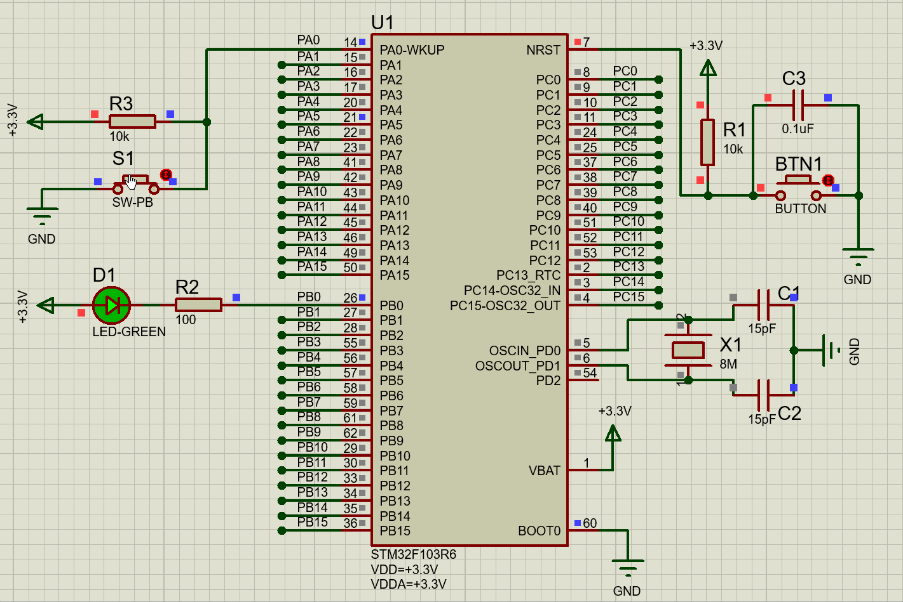

<!-- slide: 17 -->

- 首先在STM32CubeMX软件中设置PA0口为外部中断输入，PB0为输出，时钟配置和前面的例子一样，并在NVIC中使能EXTI line0，4位抢占型优先级，优先级为1；0位响应性优先级，优先级为0。
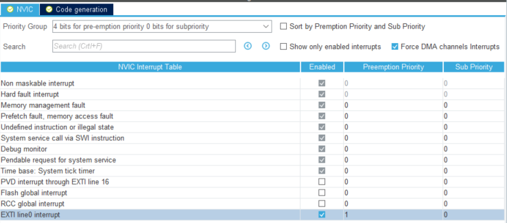

<!-- slide: 18 -->

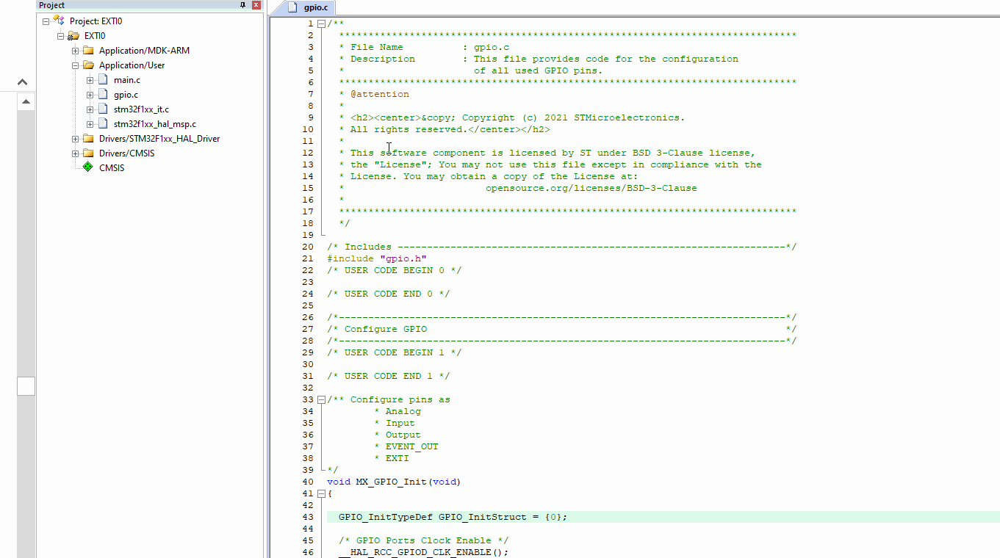

<!-- slide: 19 -->

- 基于HAL库生成实现对外部中断引脚的初始化程序如下：
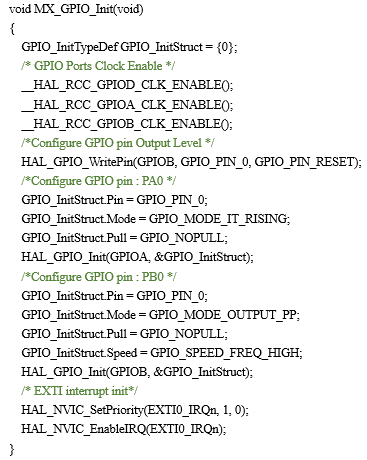

<!-- slide: 20 -->

- 并在生成的main.c程序中添加中断处理函数如下：
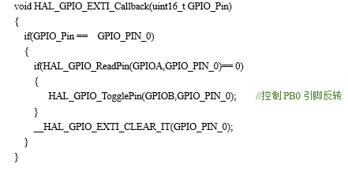

<!-- slide: 21 -->

- 谢谢!
