# ch8定时器

<!-- slide: 1 -->

## 第8章 定时器

- 嵌入式微控制器原理及设计
- —基于STM32及Proteus仿真开发
- 配套PPT

<!-- slide: 2 -->

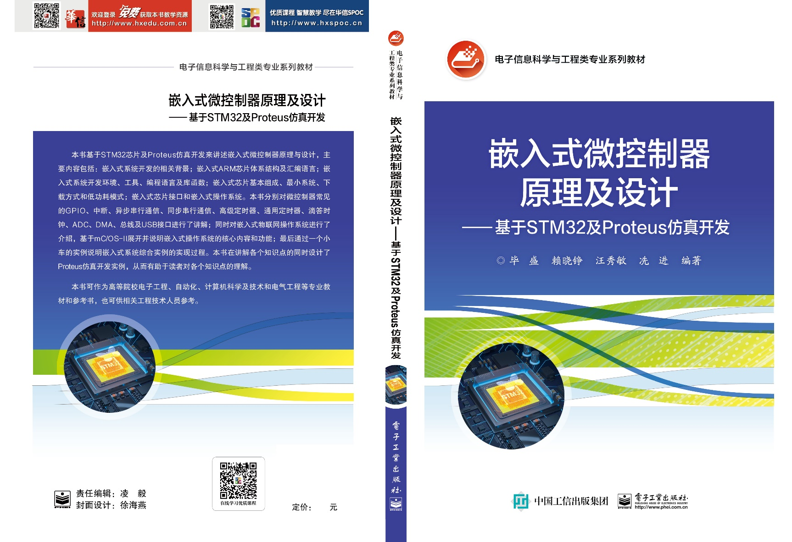

<!-- slide: 3 -->

- 8.1定时器概述
- 8.2定时器操作
- 8.3 系统滴答定时器（SYSTICK）
- 8.4 看门狗定时器（WATCHDOG）
- 8.5 实时时钟（RTC）
- 第8章 定时器

<!-- slide: 4 -->

- 8.1定时器概述
- 微控制器的工作运行过程中都有定时或外部时钟信号计数的功能，因此常常会被应用于时间控制、程序延时、对外部脉冲计数和检测等方面，例如汽车轮速计算过程就是定时一段时间内对轮子转动产生的脉冲进行计数。
- （1）STM32F103R6芯片具有1个高级定时器TIM1和2个通用定时器TIM2、TIM3。
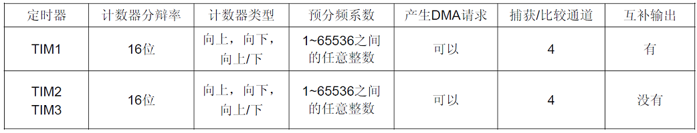
- 每个定时器有多达4个用于输入捕获/输出比较/PWM或脉冲计数的通道和增量编码器输入；1个高级16位定时器，带死区控制和紧急刹车，用于电机控制的PWM高级控制定时器

<!-- slide: 5 -->

- （2）系统滴答定时器（SysTick），Cortex-M3在内核部分封装了一个滴答定时器SysTick，主要是操作系统需要一个滴答定时器周期性产生中断，以产生系统运行的节拍。
- （3）看门狗定时器（WDT，Watch Dog Timer），在由微控制器的工作常常会受到来自外界电磁场的干扰，造成程序的跑飞，而陷入死循环；或者因为用户配置代码出现BUG，导致芯片无法正常工作，出于对微控制器运行状态进行实时监测的考虑，便产生了一种专门用于监测程序运行状态的模块或者芯片，俗称“看门狗”(WatchDog)。
- （4）实时时钟（RTC），实时时钟为系统提供了一个可靠的时间，并且在断电的情况下，RTC实时时钟也可以通过电池供电，一直运行下去。RTC模块之所以具有实时时钟功能，是因为它内部维持了一个独立的定时器，通过配置，可以让它准确地每秒中断一次。

<!-- slide: 6 -->

- 8.1.1 通用定时器
- STM32F103R6的TIM2和TIM3是通用定时器，功能包括：
- （1）16位向上、向下、向上/向下自动装载计数器。
- （2）16位可编程(可以实时修改)预分频器，计数器时钟频率的分频系数为1～65536之间的任意数值。
- （3）4个独立通道：输入捕获、输出比较、PWM生成（边缘或中间对齐模式）和单脉冲模式输出。
- （4）使用外部信号控制定时器和定时器互连的同步电路。
- （5）如下事件发生时产生中断/DMA：
- 1）更新：计数器向上溢出/向下溢出，计数器初始化（通过软件或者内部/外部触发）。
- 2）触发事件（计数器启动、停止、初始化或者由内部/外部触发计数）。
- 3）输入捕获。
- 4）输出比较。
- （6）支持针对定位的增量（正交）编码器和霍尔传感器电路。
- （7）触发输入作为外部时钟或者按周期的电流管理。

<!-- slide: 7 -->

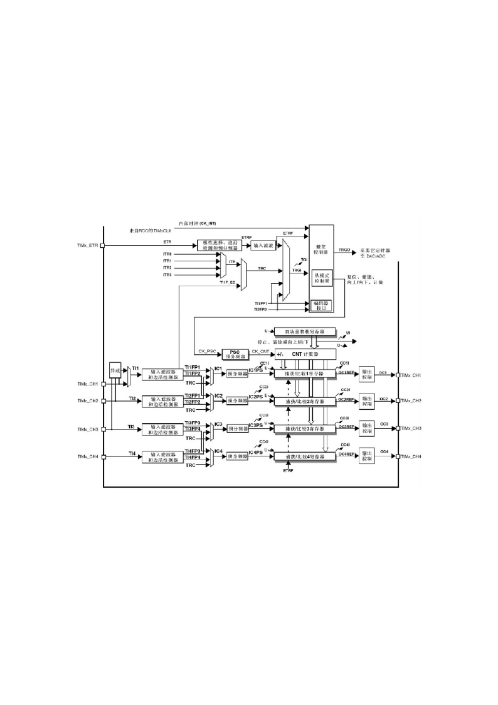

<!-- slide: 8 -->

- 8.1.2 高级定时器
- 高级定时TIM1相对于通用定时器，主要增加了如下功能：
- （1）死区时间可编程的互补PWM输出，因此对应的TIM1引脚输出有TIM1_CH1和TIM1_CH1N正反互补输出，而通用定时器TIM2和TIM3只有TIMx_CHx正输出。
- （2）允许在指定数目的计数器周期之后更新定时器寄存器的重复计数器。
- （3）电机刹车输入信号可以将定时器输出信号置于复位状态或者一个已知状态。
- （4）电机刹车信号输入产生中断/DMA。
- 高级定时器多出来的功能主要是对三相电机的控制接口功能。

<!-- slide: 9 -->

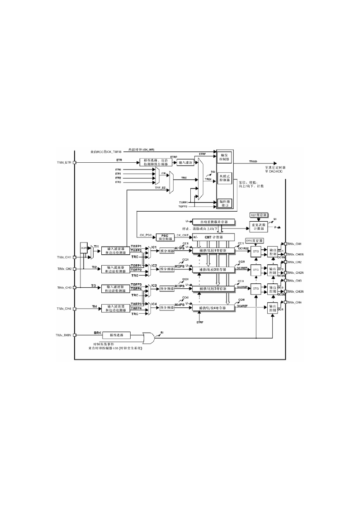

<!-- slide: 10 -->

- 8.1.3 高级/通用定时器接口
- （1）TIMx_ETR接口: 外部触发输入接口，连接其输入引脚可用于外部计数功能。
- （2）左侧的TIMx_CH1，TIMx_CH2，TIMx_CH3和TIMx_CH4接口：可用于外部输入捕获，可以计算波形的脉宽。
- （3）TIMx_BKIN接口：断路功能，主要用于保护由TIM1定时器产生的PWM信号所驱动的功率开关。
- （4）TRGO内部输出通道：主要用于定时器级联，ADC和DAC的定时器触发。
- （5）4组输出比较单元OC1到OC4：OC1到OC4有对应的输出引脚，主要用于内部控制。
- （6）右侧的输出比较通道TIMx_CH1，TIMx_CH1N，TIMx_CH2，TIMx_CH2N，TIMx_CH3，TIMx_CH3N和TIMx_CH4：主要用于PWM输出，注意CH1到CH3有互补输出，而CH4没有互补输出。
- （7）内部接口：CK_INT为内部时钟；ITRx为内部触发输入，可用于一个定时器作为另一个定时器的预分频器；ETRP为分频后的外部触发输入；ETRF为滤波后的外部触发输入；TI1F_ED为TI的边沿检测器；TI1FP1/2为滤波后定时器1/2的输入；TRGI为触发输入；TRGO为触发输出；CK_PSC为分频器时钟输入；ICx为输入比较通道；ICxPS为分频后的ICx；OCxREF为输出参考信号。

<!-- slide: 11 -->

- 8.1.4 定时器引脚和寄存器
- TIMx_ETR, TIMx_CH1, TIMx_CH2, TIMx_CH3, TIMx_CH4, TIMx_BKIN复用功能口对应的I/O口说明。
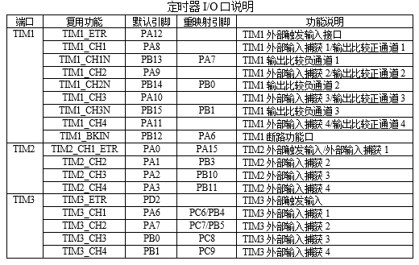
- TIM2_CH1_ETR表示TIM2_CH1和TIM2_ETR共用一个引脚，但是不能同时使用，因此标记为TIM2_CH1_ETR。TIM2_CH2重映射引脚中的PB3是和下载有关的JTDO口，TIM3_CH1重映射引脚中的PB4也是和下载有关的NJTRST口，因此在使用这两个引脚时需要配置下载功能失效，才能正常使用。

<!-- slide: 12 -->

- CHx和ETR接口在设置过程中，其中CHx针对不同Channel进行配置，ETR从时钟源进行配置：
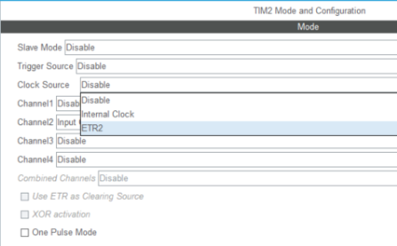
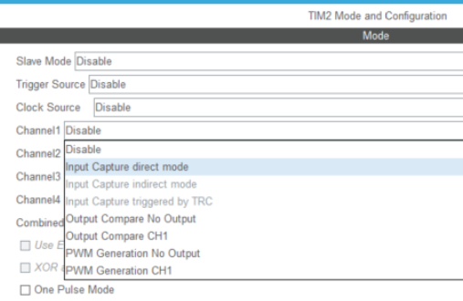
- 定时器TIMx主要寄存器功能
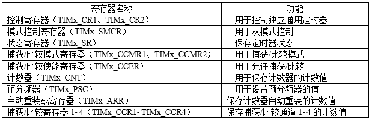

<!-- slide: 13 -->

- 8.1.5 定时器时钟源
- 定时器主要功能就是对时钟脉冲进行计数，从而获取一定定时时间和脉冲数，所以时钟源是定时器操作过程中重要部分，定时器时钟主要可以由下述时钟源提供。
- 1.内部时钟源（CK_INT）
- 内部时钟源作为时钟时，定时器时钟不是直接来自APB1或APB2，而是来自于输入为APB1或APB2的一个倍频器。
- 2.外部时钟源
- 包括外部时钟模式1：外部输入脚（Tix）和外部时钟模式2：外部触发输入（ETR）。通过外部输入脚（Tix）可以实现对外部输入脉冲的计数功能；外部触发输入（ETR）既可作为时钟输入可用作外部时钟计数，也可作为触发输入。
- 3. 内部触发输入（ITRx）
- 内部触发输入（ITRx）：使用一个定时器作为另一个定时器的预分频器，如可以配置一个定时器Timer1而作为另一个定时器Timer2的预分频器。

> 备注：当APB1和APB2的预分频系数为1时，这个倍频器不起作用，定时器的时钟频率等于APB1和APB2的频率；当APB1和APB2的预分频系数为其他数值（预分频系数为2、4、8或16）时，这个倍频器起作用，定时器的时钟频率等于APB1和APB2的频率2倍，例如微控制器时钟频率72MHz时，由于APB1最高频率是36MHz，因此APB1会二分频为36MHz，但通过时钟源时钟单元，故连接APB1的TIM2可自动2倍频至72MHz。通过倍频器给定时器时钟的好处是：APB1和APB2不但要给通用定时器提供时钟，还要为其他的外设提供时钟；设置这个倍频器可以保证在其他外设使用较低时钟频率时，通用定时器仍然可以得到较高的时钟频率。

<!-- slide: 14 -->

- 8.1.6定时器计数模式
- STM32芯片的定时器有3种计数模式：
- 1.向上计数模式。
- 在向上计数模式中，计数器从0计数到自动加载值（TIMx_ARR计数器的值），然后重新从0开始计数并且产生一个计数器溢出事件。
- 2.向下计数模式。
- 在向下模式中，计数器从自动装入的值（TIMx_ARR计数器的值）开始向下计数到0，然后从自动装入的值重新开始并且产生一个计数器向下溢出事件。
- 3.中央对齐模式（向上/向下计数）。
- 在中央对齐模式，计数器从0开始计数到自动加载的值（TIMx_ARR寄存器）−1，产生一个计数器溢出事件，然后向下计数到1并且产生一个计数器下溢事件；然后从0开始重新计数。
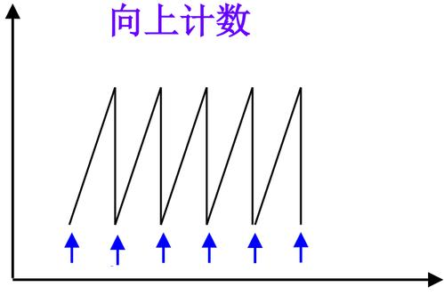
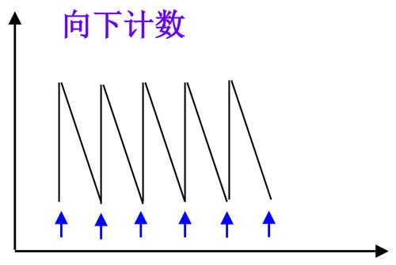
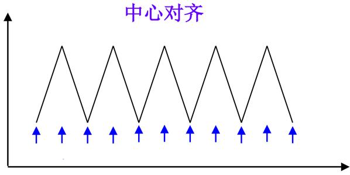

<!-- slide: 15 -->

- 8.2定时器操作
- 8.2.1定时功能及实例
- 定时器具有定时的功能，即对内部的时钟脉冲进行计数，当达到设定数值时触发定时器更新事件，在更新事件处理程序中停止计数或者继续计数，根据更新事件的次数以及设定数值从而可获得定时的时间。
- 【例8.1】 利用TIM1定时器实现定时0.1s延时，通过PB0引脚控制LED闪烁，即0.1s亮0.1s灭依次交替。
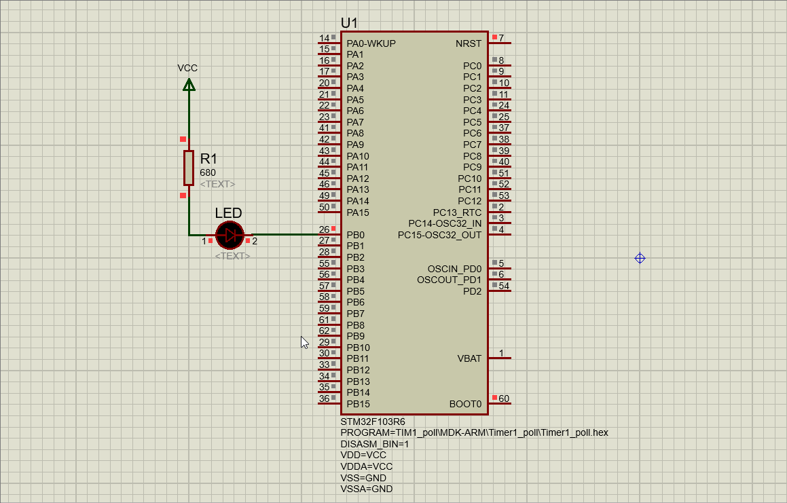

<!-- slide: 16 -->

- 定时器输入的时钟为72MHz，为实现定时0.1s需要进行分频操作，并设置合适的周期值（计数更新值）。例如7200分频后结果为72000000/7200=10000Hz，因此当周期值为1000时，可实现0.1s的定时。
- 利用STM32CubeMX工具实现对TIM1的配置：
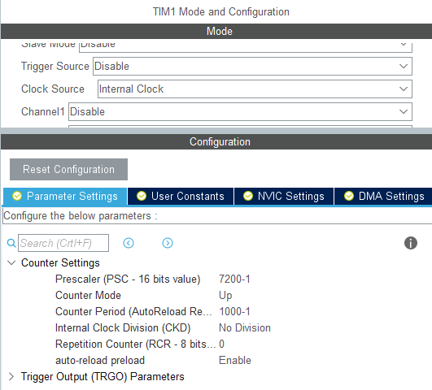
- Prescaler是设置时钟分频值，根据计算设置为7200；
- Counter Mode是设置计数模式，设置为向上计数模式；
- Counter Period为定时器周期即更新值，即计数到此数值时定时器产生更新事件，本实例根据计算设置为10000；
- Internal Clock Division(CKD)设置时钟分割，对时钟再次进行分频，若不使用则设置为0；
- Repetition Counter(RCR-8 bits value)设置重复计数，更改这个值的大小是为了改变进入TIM1中断的时间，避免在进入中断计算量较大时，在一个开关周期计算不完出现错误，例如采用向上计数模式，Repetition Counter(RCR-8 bits value)设置为2时，两倍的开关时间进一次中断，本实例不适用重复计数功能，因此可以设置为0。
- auto-reload preload 设置是否自动装载定时器周期值，由于本实例是一个不断循环的过程，因此使能自动装载功能。

<!-- slide: 17 -->

- 在tim.c中产生出TIM1初始化的代码如下：
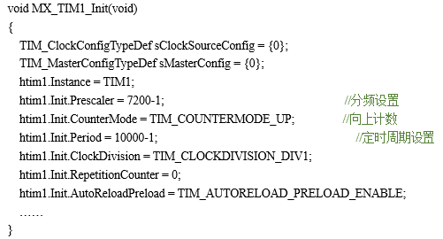
- 在响应定时时间是否到达定时周期过程中，可以采用查询和中断两种方式来完成，查询方式通过__HAL_TIM_GET_FLAG(&htim2,TIM_FLAG_UPDATE)函数判断TIM_FLAG_UPDATE是否变为1，从而确定定时周期是否达到。
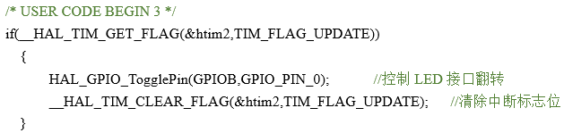

<!-- slide: 18 -->

- 中断方式通过开启定时器更新中断，当达到定时周期时会触发定时器更新中断，在中断方式时，利用STM32CubeMX工具实现对TIM1的更新中断配置：
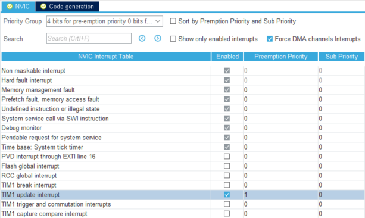

<!-- slide: 19 -->

- 开启TIM1更新中断，当达到1s的计数值时触发更新中断，在中断中控制LED状态翻转，并重新开始装载计数；配置抢占优先级为1，相应优先级为0。在tim.c程序中产生出开启中断的代码，如下：
- TIM1更新中断通过调用中断处理函数，本实例在main.c中重写此函数：
- __weak void HAL_TIM_PeriodElapsedCallback(TIM_HandleTypeDef *htim)
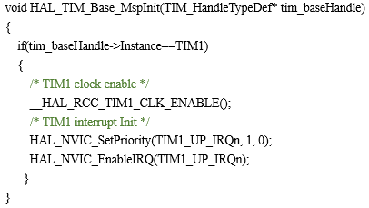
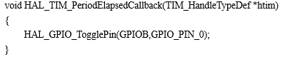

<!-- slide: 20 -->

- 8.2.2 计数功能及实例
- STM32的定时器具有计数功能，在实际应用中可以用来对引脚上的外部输入信号进行计数，其输入信号作为计数时钟，输入引脚可以为TIMx_ETR引脚。
- 【例8.2】 通过外部计数功能对按键引脚（TIM1_ETR(PA12)）的按下次数进行计数，并通过串口发送出来。
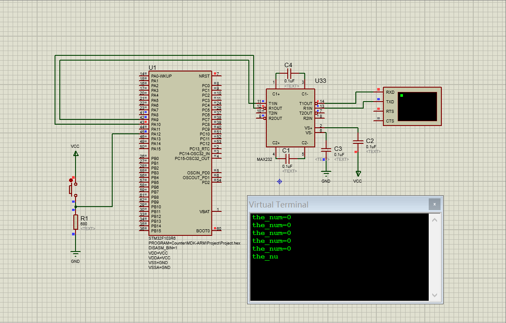

<!-- slide: 21 -->

- 采用TIM1_ETR(PA12)引脚作为输入计数源，计数模式采用向上计数，并根据电路采用上升沿触发，输入源不进行分频和滤波处理，所以在STM32CubeMX的配置如图：
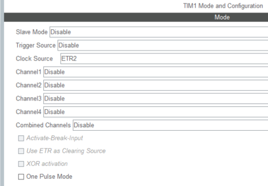
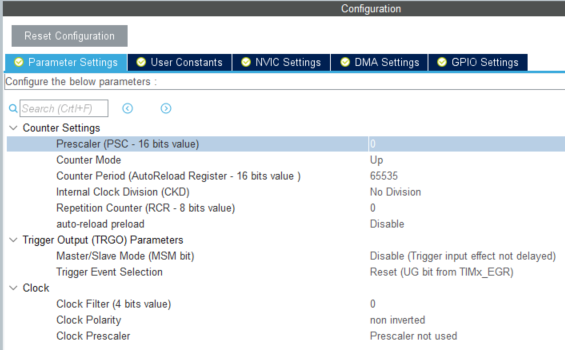

<!-- slide: 22 -->

- 主要有关计数的程序如下：
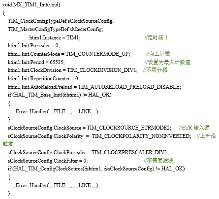
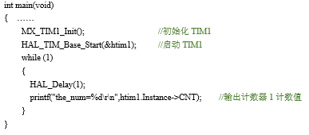

<!-- slide: 23 -->

- 8.2.3 捕获功能及实例
- 定时器可作为输入捕获使用，输入捕获模式可以用来测量脉冲宽度或者测量频率。STM32的输入捕获，简单来说，就是通过检测TIMx_CHx上的边沿信号，在边沿信号发生跳变（如上升沿/下降沿）时，将当前定时器的值（TIMx_CNT）存放到对应的通道的捕获/比较寄存器（TIMx_CCRx）里面，完成一次捕获。
- 【例8.3】 通过外部捕获功能对按键引脚（TIM3_CH1(PA6)）的按下脉宽宽度进行计数，并通过串口发送出来。
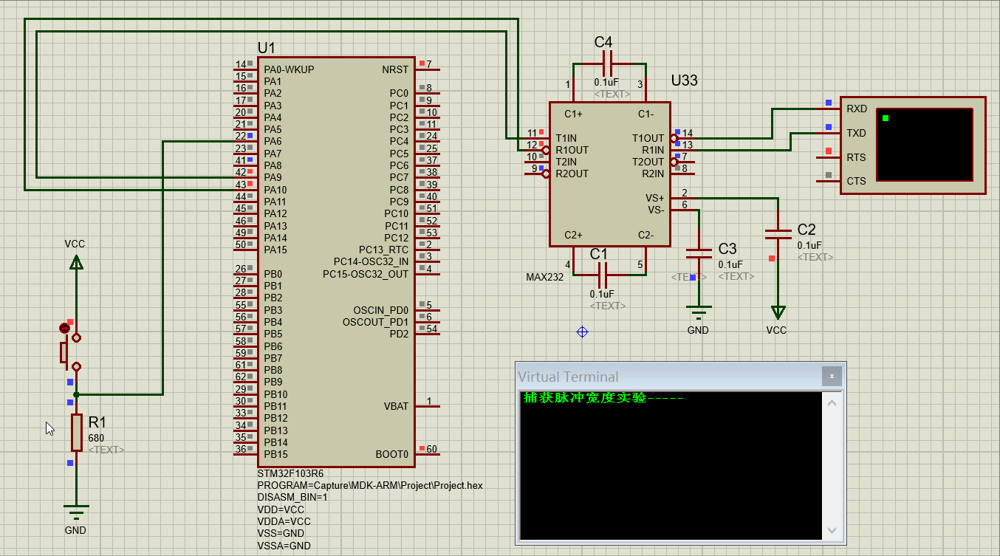

<!-- slide: 24 -->

- 采用TIM3_CH1(PA6)引脚作为输入捕获源，计数模式采用向上计数，并根据电路采用上升沿触发，输入源进行72分频，不进行滤波处理，所以在STM32CubeMX的配置如图：
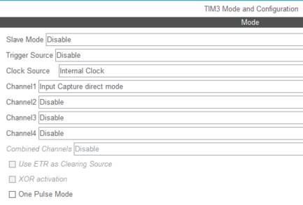
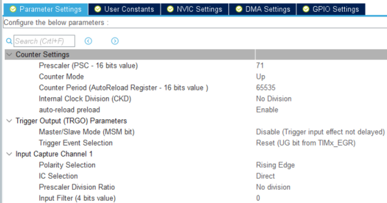
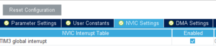

<!-- slide: 25 -->

- （1）TIM3初始化
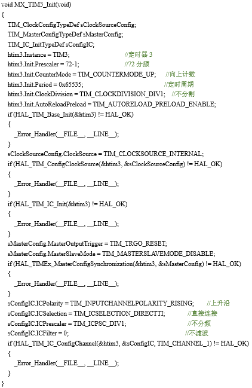
- （2）定时器中断的回调函数
- （3）主程序
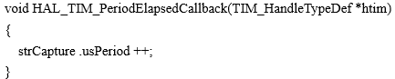
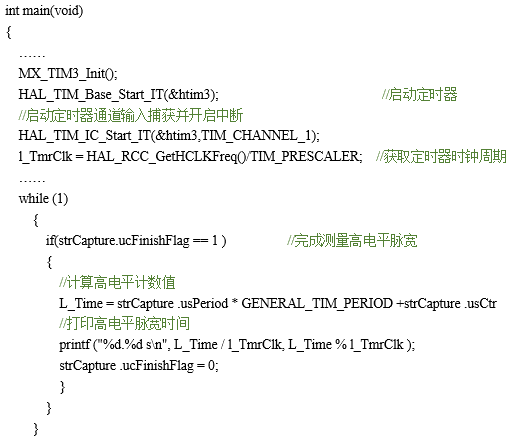

<!-- slide: 26 -->

- 8.2.4 输出PWM模式及实例
- PWM(Pulse Width Modulation，脉冲宽度调制)技术，通过对一系列脉冲的宽度进行调制，来等效地获得所需要波形(含形状和幅值)。
- PWM信号仍然是数字的，因为在给定的任何时刻，满幅值的直流供电要么完全有(ON)，要么完全无(OFF)。电压或电流源是以一种通(ON)或断(OFF)的重复脉冲序列被加到模拟负载上去的。通的时候即是直流供电被加到负载上时，断的时候即是供电被断开时。只要带宽足够，任何模拟值都可以使用PWM进行编码。利用PWM可以控制直流电机的转速和灯的亮、灭等。PWM的一个优点是从处理器到被控系统信号都是数字形式的，无须进行数模转换。

<!-- slide: 27 -->

- STM32微控制器的每个通用定时器都有4路PWM输出TIMx_CH1~TIMx_CH4，对应相应的引脚；高级定时器有更多路PWM输出。
- STM32芯片PWM配置过程：若配置脉冲计数器TIMx_CNT为向上计数，而重载寄存器TIMx_ARR被配置为N，即TIMx_CNT的当前计数值数值X在TIMxCLK时钟源的驱动下不断累加，当TIMx_CNT的数值X大于N时，会重置TIMx_CNT数值为0重新计数。      而在TIMx_CNT计数的同时，TIMx_CNT的计数值X会与比较寄存器TIMx_CCR预先存储了的数值A进行比较，当脉冲计数器TIMx_CNT的数值X小于比较寄存器TIMx_CCR的值A时，输出高电平（或低电平），相反地，当脉冲计数器的数值X大于或等于比较寄存器的值A时，输出低电平（或高电平）。如此循环，得到的输出脉冲周期就为重载寄存器TIMx_ARR存储的数值(N+1)乘以触发脉冲的时钟周期，其脉冲宽度则为比较寄存器TIMx_CCR的值A乘以触发脉冲的时钟周期，即输出PWM的占空比为A/(N+1)。

<!-- slide: 28 -->

- 【例8.4】 利用PWM脉冲宽度功能通过TIM3_CH2 (PA7)引脚控制电机的速度。
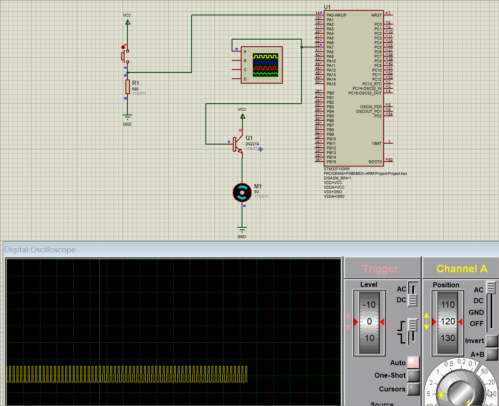

<!-- slide: 29 -->

- 采用TIM3_CH2(PA7)引脚控制电机的速度，计数模式采用向上计数，输入源进行36分频，周期为1000，输出PWM1模式，输出为正极性，所以在STM32CubeMX的配置：
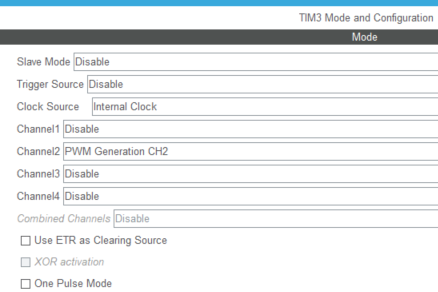
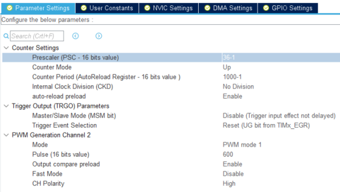

<!-- slide: 30 -->

- （1）TIM3初始化
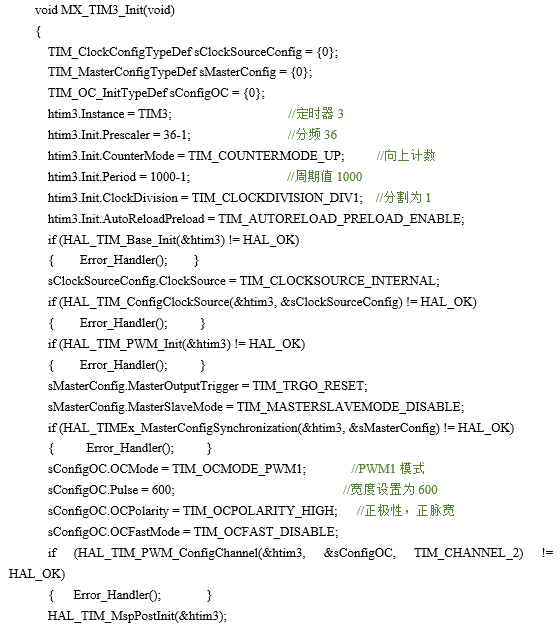
- （2）主程序
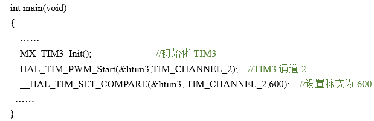

<!-- slide: 31 -->

- 8.2.5 其他功能模式
- 1.定时器输出比较模式
- 此项功能是用来控制一个输出波形，或者指示一段给定的时间已经到时。当一个通道工作于比较模式时，用户程序将比较数值写入比较寄存器，定时器会不停地将该寄存器的内容与计数器的内容进行比较，一旦比较条件成立，则产生相应的输出。如果使能中断，则产生中断；如果使能引脚输出，则按照控制电路的设置产生输出波形。
- 2.PWM输入捕获模式
- 输入捕获功能是指TIMx可以检测某个通道对应引脚上的电平边沿，并在电平边沿产生的时刻将当前定时器计数值写入捕获/比较寄存器中。PWM输入捕获功能可以测量定时器某个通道上的PWM信号频率与占空比。

<!-- slide: 32 -->

- 3.编码器接口模式
- 编码器的示意图如下，中间是一个带光栅的码盘，光通过光栅，接收管接收到高电平，没通过，接收到低电平。电机旋转一圈，码盘上有多少光栅，接收管就会接收多少个高电平。例如，371电机中的码盘就是这样的，它是334线码盘，具有较高的测速精度，也就是电机转一圈输出334个脉冲，芯片上已集成了脉冲整形触发电路，输出的是矩形波，直接接微控制芯片I/O口就行。
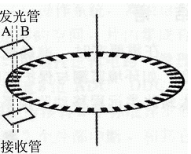

<!-- slide: 33 -->

- A、B两点对应两个光敏接收管，A、B两点间距为S2，码盘的光栅间距分别为S0和S1。S0+S1的距离是S2的4倍，这样保证了A、B波形相位相差90度。旋转的反向不同，锯齿波A、B先到达高电平的顺序就会不同，如图左侧所示，顺序的不同，就可以得到旋转的方向。
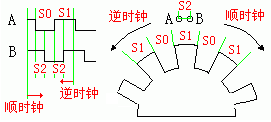
- 增量式旋转编码器通过内部两个光敏接收管转化其角度码盘的时序和相位关系，得到其角度码盘角度位移量增加（正方向）或减少（负方向）。
- STM32芯片定时器的两个输入TI1和TI2被用来作为增量编码器的接口，假定计数器已经启动(TIMx_CR1寄存器中的CEN=1)，则计数器由每次在TI1FP1或TI2FP2上的有效跳变驱动。TI1FP1和TI2FP2是TI1和TI2在通过输入滤波器和极性控制后的信号；如果没有滤波和变相，则TI1FP1=TI1，TI2FP2=TI2。根据两个输入信号的跳变顺序，产生了计数脉冲和方向信号。然后通过读取所用的计数器信息，可以得到电机的速度；并通过读取控制寄存器CR1的DIR位来判断旋转方向。

<!-- slide: 34 -->

- 4.单脉冲模式
- 单脉冲模式(OPM)是前述众多模式的一个特例。这种模式允许计数器响应一个激励，并在一个程序可控的延时之后，产生一个脉宽可程序控制的脉冲。可以通过从模式控制器启动计数器，在输出比较模式或者PWM模式下产生波形。设置TIMx_CR1寄存器中的OPM位将选择单脉冲模式，这样可以让计数器自动地在产生下一个更新事件UEV时停止。仅当比较值与计数器的初始值不同时，才能产生一个脉冲。启动之前(当定时器正在等待触发)，必须如下配置：向上计数方式，CNT < CCRx ≤ ARR (特别地，0 < CCRx)；向下计数方式，CNT > CCRx。
- 针对高级/通用定时器还有强置输出模式、定时器输入异或功能、定时器和外部触发的同步模式，单独针对高级定时器还有互补输出和死区插入、使用刹车功能、在外部事件时清除OCxREF信号、产生六步PWM输出和与霍尔传感器的接口模式。

<!-- slide: 35 -->

- 8.3 系统滴答定时器（SYSTICK）
- SysTick定时器被绑定在NVIC中，用于产生SYSTICK异常（异常号：15）。在以前，大多操作系统需要一个硬件定时器来产生操作系统需要的滴答中断，作为整个系统的时基。
- 例如，操作系统可以为多个任务许以不同数目的时间片，确保没有一个任务能霸占系统；或者把每个定时器周期的某个时间范围赐予特定的任务等，还有操作系统提供的各种定时功能，这都与这个滴答定时器有关。因此，需要一个定时器来产生周期性的中断，而且最好还让用户程序不能随意访问它的寄存器，以维持操作系统“心跳”的节律。
- Cortex-M3在内核部分包含SysTick，该定时器的时钟源可以是内部时钟（FCLK，Cortex-M3上的自由运行时钟），或者是外部时钟（Cortex-M3处理器上的STCLK信号）。

<!-- slide: 36 -->

- 8.3.1 SysTick工作分析及配置
- SysTick是一个24位的定时器，即一次最多可以计数224个时钟脉冲，这个脉冲计数值被保存到当前值寄存器STK_VAL（SysTick current value register）中，只能向下计数，每接收到一个时钟脉冲STK_VAL的值就向下减1，直至0。当减至0时，由硬件自动把重载寄存器STK_LOAD（SysTick reload value register）中保存的数据加载到STK_VAL，重新向下计数。当STK_VAL的值被计数至0时，触发异常，就可以在中断服务函数中处理定时器事件了。
- 要使SysTick进行以上工作必须要进行配置，主要配置寄存器STK_CTRL：
- （1）Bit0:ENABLE，1时使能SysTick定时器，0时关闭SysTick定时器；
- （2）Bit1:TICKINT，1时当STK_VAL计数到0时会触发异常，为0时不触发异常；
- （3）Bit2:CLKSOURCE，1时选择AHB为时钟，0时选择AHB/8为时钟；
- （4）Bit16:COUNTFLAG，为计数为0标志位，当计数为0时此标志位被置1。

<!-- slide: 37 -->

- 8.3.2 SysTick功能实现
- 利用STM32CubeMX进行实现，使能SysTick
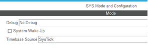
- 在STM32CubeMX产生的函数中会有SystemClock_Config()函数，对SysTick进行初始化：
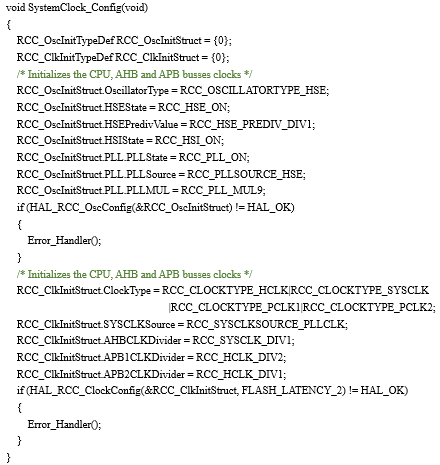
- 当使能SysTick功能后，STM32CubeMX工具会自动产生的代码，因此可以直接调用例如HAL_Delay(1000)，可产生出1000ms的延时。

<!-- slide: 38 -->

- 初始化时，STM32CubeMX默认设置SysTick中断优先级为最高优先级，中断周期由函数HAL_SYSTICK_Config(SystemCoreClock/(1000U/uwTickFreq)确定，默认值为1ms，STM32CubeMX产生的代码如下：
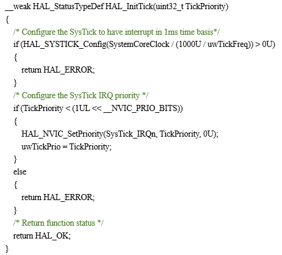

<!-- slide: 39 -->

- 中断频率可以通过修改HAL_TICK_FREQ_DEFAULT参数修改，stm32f1xx_hal中给出10Hz、100Hz、1kHz三种选项，如下：
- 根据以上配置，从而可以产生出HAL_Delay()函数的时基为1ms，HAL_Delay()函数由STM32CubeMX产生如下代码：
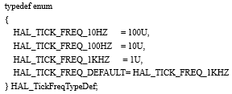
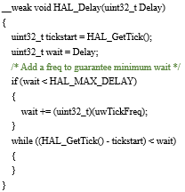

<!-- slide: 40 -->

- 8.4 看门狗定时器（WATCHDOG）
- 看门狗定时器（WDT，Watch Dog Timer）是微控制器的一个组成部分，它实际上是一个计数器，一般给看门狗一个数字，程序开始运行后看门狗开始倒计数。如果程序运行正常，过一段时间CPU应发出指令让看门狗复位，重新开始倒计数。如果看门狗减到0，就认为程序没有正常工作，强制整个系统复位。
- 在STM32F103XX系列处理器中，看门狗WatchDog模块包含2个内容：独立看门狗和窗口看门狗。独立看门狗是基于一个12位的递减计数器和一个8位的预分频器。该模块由一个内部独立的40kHz的RC振荡器提供时钟。由于这个RC振荡器独立于主时钟，因此可以运行在停机和待机模式。除独立看门狗外，STM32系列ARM处理器的看门狗模块中还包含窗口看门狗模块。窗口看门狗内包含一个7位的递减计数器，并可以设置成自由运行的模式。

<!-- slide: 41 -->

- 8.4.1 独立看门狗
- 独立看门狗(IWDG)使用的是独立时钟。IWDG由专用的32kHz的低速时钟来驱动；因此，即使主时钟发生故障它仍然有效。IWDG最适合应用于那些需要看门狗作为一个在主程序之外，能够完全独立工作，并且对时间精度要求较低的场合；独立看门狗的主要寄存器：键值寄存器(IWDG_KR)、预分频寄存器（IWDG_PR）、重装载寄存器（IWDG_RLR）和状态寄存器（IWDG_SR）。

<!-- slide: 42 -->

- 独立看门狗使能和开启的操作步骤如下：
- （1）向IWDG_KR写入0x5555，通过这步取消IWDG_PR和IWDG_RLR的写保护，使后面可以操作这两个寄存器。设置IWDG_PR和IWDG_RLR的值，分别设置看门狗的分频系数和重装载的值。由此，就可以知道看门狗的喂狗时间，该时间的计算方式：Tout = 40kHz/（4×2^rlr）当然这个值是粗略的计算值，因为时钟不准确，所以无法得到准确的喂狗时间；
- （2）向IWDG_KR写入0xAAAA，这步将使STM32芯片重新加载IWDG_RLR的值到看门狗计数器里面，即用该命令来喂狗。
- （3）向IWDG_KR写入0XCCCC，通过这步启动看门狗；
- 通过上面3步，我们启动了STM32芯片的看门狗，使能了看门狗，在程序里面就必须间隔一定时间来喂狗，否则将导致程序复位。

<!-- slide: 43 -->

- 通过STM32CubeMX可以使能独立看门狗，如图
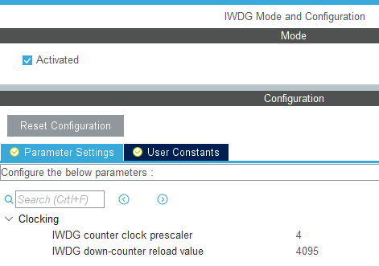
- 其中，IWDG时钟预分频系数4分频，计数器重装载值（IWDG_RLR）为4095，产生出代码HAL_IWDG_Init(IWDG_HandleTypeDef *hiwdg)。
- 产生出代码HAL_IWDG_Refresh(IWDG_HandleTypeDef *hiwdg)函数，利用此函数可实现看门狗操作。
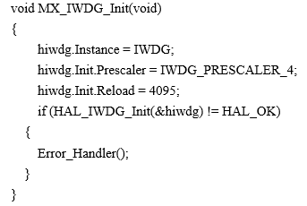

<!-- slide: 44 -->

- 8.4.2 窗口看门狗
- 窗口看门狗跟独立看门狗一样，也是一个递减计数器，不断往下递减计数，当减到一个固定值0x3F时还不喂狗，产生复位，这个值叫窗口的下限，是固定的值，不能改变。窗口看门狗之所以称为窗口，就是因为其喂狗时间是在一个有上下限的范围内（计数器减到某个值~计数器减到0x3F），在这个范围内才可以喂狗，可以通过设定相关寄存器，设定其上限时间（但是下限是固定的0x3F）。
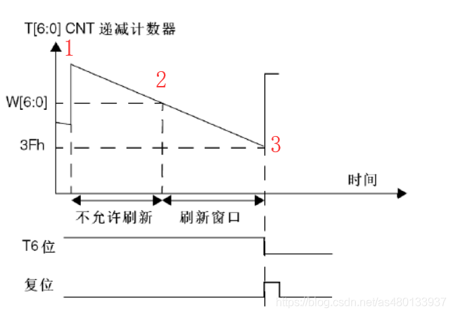
- 1计数器的初始值，是我们设置的上窗口（W[6:0]）值，3是下窗口值(0x3F)；窗口看门狗计数器的值只有在2和3之间(上窗口和下窗口之间)才可以喂狗，窗口看门狗还可以使能中断，如果使能了提前唤醒中断，系统出现问题，喂狗函数没有生效，那么在计数器由减到0x40 (0x3f+1)时，便会先进入中断，之后才会复位，也可以在中断里面喂狗。

<!-- slide: 45 -->

- 通过STM32CubeMX可以使能窗口看门狗
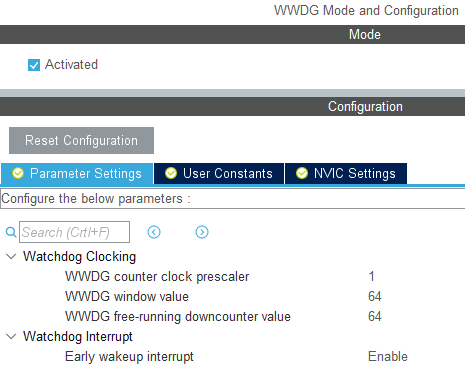
- WWDG时钟预分频系数为1，WWDG上窗口值为64，WWDG计数器值为64，使能窗口看门狗中断。产生的代码看门狗初始化HAL_WWDG_Init(WWDG_HandleTypeDef *hwwdg)
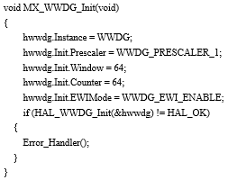
- 产生代码喂狗操作HAL_WWDG_Refresh(WWDG_HandleTypeDef *hwwdg)，利用此函数可实现看门狗操作；看门狗中断处理函数HAL_WWDG_IRQHandler(WWDG_HandleTypeDef *hwwdg)，判断中断是否正常，并进入中断回调函数；看门狗中断回调函数__weak HAL_WWDG_EarlyWakeupCallback(hwwdg)，在HAL库中，每进行完一个中断，并不会立刻退出，而是会进入到中断回调函数中。

<!-- slide: 46 -->

- 8.4.3独立看门狗与窗口看门狗区别
- 独立看门狗与窗口看门狗区别如下：
- （1）独立看门狗没有中断，窗口看门狗有中断。
- （2）独立看门狗有硬件、软件之分，窗口看门狗只能软件控制。
- （3）独立看门狗只有下限，窗口看门狗又下限和上限。
- （4）独立看门狗是12位递减的。窗口看门狗是7位递减的。
- （5）独立看门狗是用的内部的大约40kHz RC振荡器，窗口看门狗是用的系统时钟APB1ENR。
- （6）独立看门狗Iwdg——独立于系统之外，因为有独立时钟，所以不受系统影响的系统故障探测器。
- 窗口看门狗wwdg——系统内部的故障探测器，时钟与系统相同。如果系统时钟不走了，这个狗也就失去作用了。主要用于监视软件错误。
- （7）独立看门狗没有中断功能，窗口看门狗有中断。

> 备注：独立看门狗没有中断功能，只要在计数器减到0（下限）之前，重新装载计数器的值，就不会产生复位，独立看门狗有硬件和软件之分，硬件是通过烧写器的“设定选项”等配置，一旦开启了硬件看门狗，那么就停不下来了，只能在重新配置“设定选项”等才能关掉硬件看门狗，软件看门狗只需要设置IWDG->KR=0XCCCC;，就可以启动看门狗了，软件狗可以在系统复位时关掉，如果在初始化里开启软件看门狗，那就开启了软件看门狗，独立看门狗是12位递减的寄存器，使用片内的RC振荡器，这个振荡器是关不掉的。
窗口看门狗有中断，这个中断的作用是在计数器达到下限0x40时，产生中断，让你喂狗，如果你不喂狗，计数器的值变为0x3f时，将会产生系统复位，即使是喂狗，也应该在中断里快速喂狗，要不时间长了计数器减一也会变成0x3f产生复位，这个时间根据芯片手册的公式进行计算即可得到，窗口看门狗只有软件开启方式，还有一个上限值，这个值如果大于计数器的初始值，那么就没有任何作用了，这个值小于计数器的初始值得时候，当计数器的值大于上限值时你对计数器进行装载，将会产生复位，只有在计数器减到小于上限值时，你才能重新装载计数器，意思就是说只有计数器的值在上限值和下限值之间你才能装载计数器，否则就会产生系统复位，当上限值小于下限值，也没有意义。

<!-- slide: 47 -->

- 8.5 实时时钟（RTC）
- RTC（Real-Time Clock)实时时钟为操作系统提供了一个可靠的时间，并且在断电的情况下，RTC实时时钟也可以通过电池供电，一直运行下去。RTC模块之所以具有实时时钟功能，是因为它内部维持了一个独立的定时器，通过配置，可以让它准确地每秒中断一次。简单描述STM32芯片RTC时钟工作原理：一个32位的计数器，从0向上计数，假设每加一就是1s，那么一个32位的计数器跑到溢出需要100多年已经很长了，这里时钟自带一个秒中断，当每加一时就会触发一次秒中断，通过往秒中断中写更新时间的函数来达到时间同步的效果。
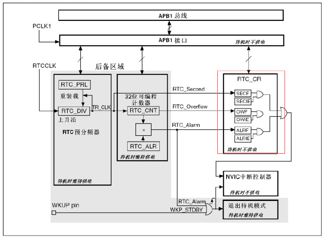

<!-- slide: 48 -->

- STM32的RTC模块拥有一组连续计数的计数器，在相应软件配置下，可提供时钟日历的功能。修改计数器的值可以重新设置系统当前的时间和日期。由于时钟只需要配置一次，下次开机不需要重新配置（开发板有电池的情况下），所以需要用到备份区域（BKP）来标记是否配置过时钟。
- 备份区域（BKP）寄存器是42个16位的寄存器，可用来存储84字节的用户应用程序数据。它们处在备份域里，当VDD电源被切断，它们仍然由VBAT维持供电。即使系统在待机模式下被唤醒，或系统复位或电源复位时，它们也不会被复位。
- RCT特征：可编程的预分频系数，分频系数最高2的20次方；32位可编程计数，用于较长时间段的测量；2个分离的时钟；可以选择3种RTC时钟源：HSE/128；LSE振荡器；LSI振荡器；2个独立的复位类型：APB1由系统复位；RTC由后备域复位；三个专门的可屏蔽中断：闹钟中断、秒中断（一个可编程周期，最长可达1s）和溢出中断。

<!-- slide: 49 -->

- 配置RTC前须知：
- BKP：RTC模块和时钟配置系统的寄存器是在后备区域的（BKP），通过BKP后备区域来存储RTC配置的数据可以让其在系统复位或待机模式下唤醒后，RTC里面配置的数据维持不变。
- PWR为电源的寄存器，我们需要用到的是电源控制寄存器（PWR_CR），通过使能PWR_CR的DBP位来取消后备区域BKP的写保护。
- RTC由一组可编程计数器组成，分成两个模块。第一个模块是RTC的预分频模块，它可编程产生最长为1s的RTC时间基准TR_CLK。RTC的预分频模块包含一个20位的可编程分频器（RTC）TR_CLK周期中RTC产生一个中断（秒中断）。第二个模块是一个32位的可编程计数器，可被初始化为当前的系统时间。系统时间按TR_CLK周期累加并与存储在RTC_ALR寄存器中的可编程时间相比较，如果RTC_CR控制寄存器中设置了相应允许位，比较匹配时，将产生一个闹钟中断。

<!-- slide: 50 -->

- （1）RTC初始化，设置当前的时间
- 有关RTC初始化的STM32CubeMX设置如图:
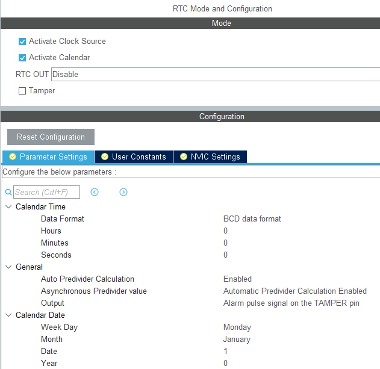
- 使能RTC时钟以及日历功能，并初始化当前的年月日及时间如上图所示。

<!-- slide: 51 -->

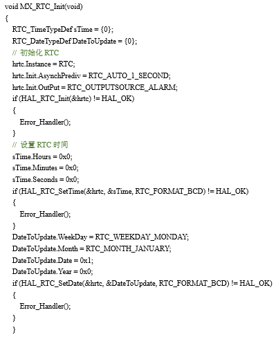
- 产生代码如下：
- HAL_RTC_Init()函数初始化RTC；HAL_RTC_SetTime()设置具体时间；HAL_RTC_SetDate()设置具体日期。

<!-- slide: 52 -->

- （2）读取时间和日期。
- 在操作过程中，使用HAL_RTC_GetTime()函数获取当前时间，使用HAL_RTC_GetDate()获取当前日期。
- （3）备份区域寄存器操作
- RTC模块和时钟配置系统的寄存器是在后备区域的（BKP），通过BKP后备区域来存储RTC配置的数据可以让其在系统复位或待机模式下唤醒后，RTC里面配置的数据维持不变。
- 在具体开发程序过程中HAL_RTCEx_BKUPWrite()函数写数据到RTC备份数据寄存器，HAL_RTCEx_BKUPRead()函数从RTC备份数据寄存器读取数据。
- 使能操作备份寄存器如下：
- // 使能PWR(电源管理外设)时钟和使能获取备份域
- __HAL_RCC_PWR_CLK_ENABLE();
- HAL_PWR_EnableBkUpAccess();
- // 使能备份时钟：备份寄存器
- __HAL_RCC_BKP_CLK_ENABLE();

<!-- slide: 53 -->

- （4）RTC闹钟功能使用
- 使用STM32CubeMX生成RTC工程如下图
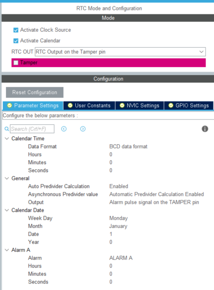
- RTC闹钟功能使用时，使能RTC外部输出从而产生闹钟信号，并且在配置中可设置闹钟的时间。

<!-- slide: 54 -->

- （5）RTC中断有计时秒中断，溢出中断和闹钟中断，若使能这些中断，配置如下：
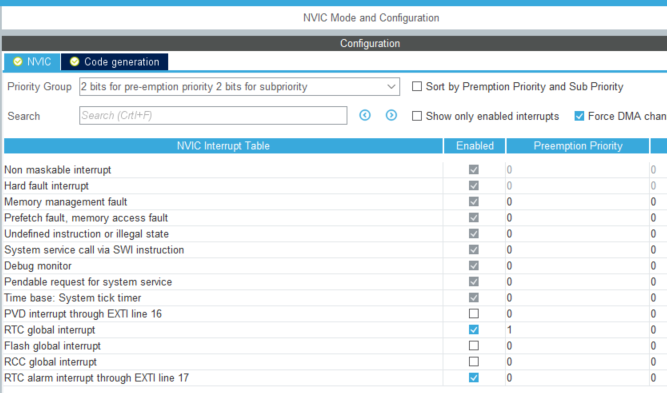
- 使用HAL_RTCEx_SetSecond_IT(&hrtc)函数针对hrtc对应的RTC时钟进行设置，通过秒中断处理函数
- HAL_RTCEx_RTCEventCallback(RTC_HandleTypeDef *hrtc)实现秒中断处理过程；闹钟中断处理函数HAL_RTC_AlarmAEventCallback(RTC_HandleTypeDef *hrtc)实现闹钟处理过程。

<!-- slide: 55 -->

- 谢谢!
