# ch9ADC

<!-- slide: 1 -->

## 第9章  ADC

- 嵌入式微控制器原理及设计
- —基于STM32及Proteus仿真开发
- 配套PPT

<!-- slide: 2 -->

<!-- slide: 3 -->

- 第9章  ADC
- 9.1 ADC概述
- 9.2 ADC应用实例

<!-- slide: 4 -->

- 9.1 ADC概述
- 将模拟量转换为数字量的过程称为模式（A/D）转换，完成这一转换的期间成为模数转换器（简称ADC）。
- STM32在片上集成的ADC外设非常强大，12位ADC是一种逐次逼近型模拟数字转换器。它有多达18个通道，可测量16个外部和2个内部信号源。各通道的A/D转换可以单次、连续、扫描或间断模式执行。ADC的结果可以左对齐或右对齐方式存储在16位数据寄存器中。模拟看门狗特性允许应用程序检测输入电压是否超出用户定义的高/低阀值。ADC的输入时钟不得超过14MHz，它是由PCLK2经分频产生。

<!-- slide: 5 -->

- 9.1.1 STM32的ADC功能及结构
- STM32F103rb系列产品内嵌2个12位的模拟/数字转换器(ADC)，每个ADC共用多达16个外部通道，可以实现单次或扫描转换。
- ADC的分辨率为12位；供电为2.4~3.6V；输入范围为0~3.6V（VREF-≤VIN≤VREF+）；转换时间是可编程的，采样一次至少要用14个ADC时钟周期，而ADC的时钟频率最高为14MHz，也就是说它的采样时间最短为1us，足以胜任中、低频数字示波器的采样工作。具体功能：1）规则转换和注入转换均有外部触发选型；2）在规则通道转换期间，可以产生DMA请求；3）自校准，在每次ADC开始转换前进行一次自校准；4）通道采样间隔时间可编程；5）带内嵌数据一致性的数据对齐；6）可设置成单次、连续、扫描、间断模式；7）双ADC模式，带2个ADC设备ADC1和ADC2，有8种转换方式；转换结束、注入转换结束和发生模拟看门狗事件时产生中断。

<!-- slide: 6 -->

- 9.1.2 STM32芯片ADC结构
- STM32芯片A/D转换可以由外部事件触发(例如定时器捕获，EXTI线)。如果设置了EXTTRIG控制位，则外部事件就能够触发转换。EXTSEL[2:0]和JEXTSEL2:0]控制位允许应用程序选择8个可能的事件中的某一个，可以触发规则和注入组的采样。当外部触发信号被选为ADC规则或注入转换时，只有它的上升沿可以启动转换。
- ADC1和ADC2用于规则通道的外部触发
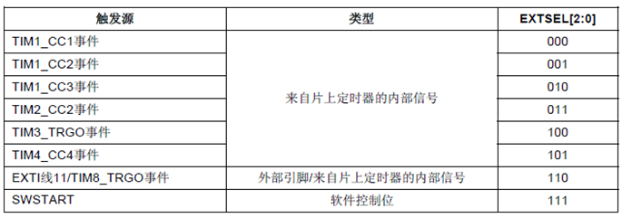
- ADC1和ADC2用于注入通道的外部触发
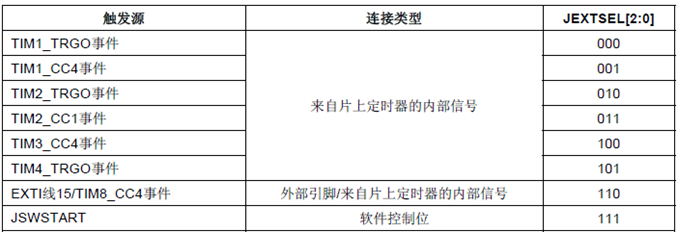

<!-- slide: 7 -->

- ADC硬件结构主要由4个部分组成：
- （1）模拟信号通道。 共有18个通道，可测16个外部信号源和2个内部信号源。其中16个外部通道对应ADCx_IN0到ADCx_IN15；2个内部通道连接到温度传感器和内部参考电压（VREFINT=1.2V）。
- （2）A/D转换器。转换原理为逐次逼近型A/D转换，分为注入通道和规则通道。每个通道都有相应的触发电路，注入通道的触发电路为注入组，规则通道的触发电路为规则组；每个通道也有相应的转换结果寄存器，分别称为规则通道数据寄存器和注入通道数据寄存器。
- （3）模拟看门狗部分。用于监控高低电压阈值，可作用于一个、多个或全部转换通道，当检测到的电压低于或高于设定电压阈值时，可以产生中断。

<!-- slide: 8 -->

- （4）中断电路。有3种情况可以产生中断，即转换结束、注入转换结束和模拟看门狗事件。ADC1和ADC2的中断映射在同一个中断向量上。
- ADC中断
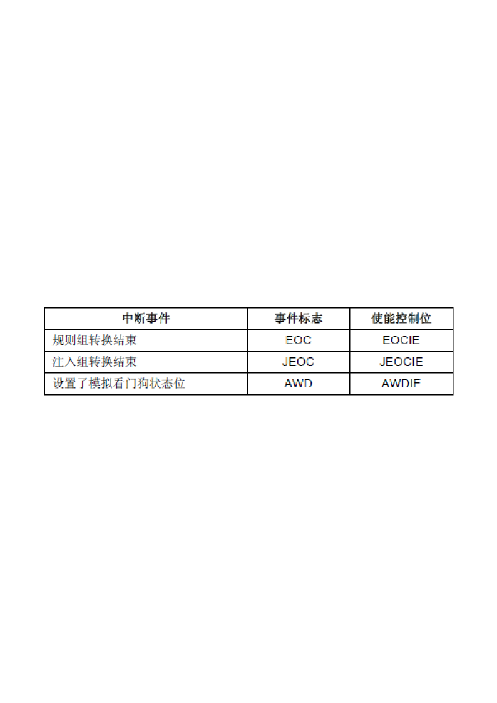

<!-- slide: 9 -->

- 9.1.3 ADC芯片引脚
- VDD和VSSA应该分别连接到VDD和VSS，传感器信号通过任意一路通道进入ADC并被转换成数字量，该数字量会被存入一个16位的数据寄存器中，在DMA使能的情况下，STM32的存储器可以直接读取转换后的数据。ADC必须在时钟ADCCLK的控制下才能进行A/D转换，ADCCLK的值是由时钟控制器控制，与高级外设总线APB2同步。时钟控制器为ADC时钟提供了一个专用的可编程预分频器，默认的分频值为2。
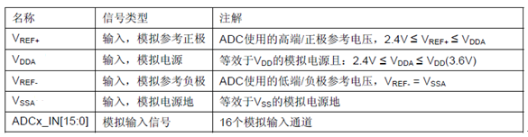

<!-- slide: 10 -->

- 9.1.4 STM32的ADC工作模式
- STM32的每个ADC模块可以通过内部的模拟多路开关切换到不同的输入通道并进行转换。在任意多个通道上以任意顺序进行的一系列转换构成成组转换。例如，可以如下顺序完成转换：通道3、通道8、通道2、通道2、通道0、通道2、通道2、通道15。
- 规则组由多达16个转换组成。规则通道和它们的转换顺序在ADC_SQRx寄存器中选择。规则组中转换的总数应写入ADC_SQR1寄存器的L[3:0]位中。注入组由多达4个转换组成。注入通道和它们的转换顺序在ADC_JSQR寄存器中选择。注入组里的转换总数目应写入ADC_JSQR寄存器的L[1:0]位中。如果ADC_SQRx或ADC_JSQR寄存器在转换期间被更改，当前的转换被清除，一个新的启动脉冲将发送到ADC以转换新选择的组。

<!-- slide: 11 -->

- 1.单次转换模式
- 单次转换模式下，ADC只执行一次转换。该模式既可通过设置ADC_CR2寄存器的ADON位(只适用于规则通道)启动也可通过外部触发启动(适用于规则通道或注入通道)，这时CONT位为0。然后ADC停止。
- 一旦选择通道的转换完成： 如果一个规则通道被转换，转换数据被储存在16位ADC_DR寄存器中，EOC(转换结束)标志被设置，如果设置了EOCIE，则产生中断。如果一个注入通道被转换，转换数据被储存在16位的ADC_DRJ1寄存器中，JEOC(注入转换结束)标志被设置，如果设置了JEOCIE位，则产生中断。然后ADC停止。
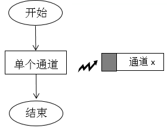

<!-- slide: 12 -->

- 2.连续转换模式
- 在连续转换模式中，当前面ADC转换一结束马上就启动另一次转换。此模式可通过外部触发启动或通过设置ADC_CR2寄存器上的ADON位启动，此时CONT位是1。每个转换后：如果一个规则通道被转换，转换数据被储存在16位的ADC_DR寄存器中，EOC(转换结束)标志被设置，如果设置了EOCIE，则产生中断。如果一个注入通道被转换，转换数据被储存在16位的ADC_DRJ1寄存器中，JEOC(注入转换结束)标志被设置，如果设置了JEOCIE位，则产生中断。
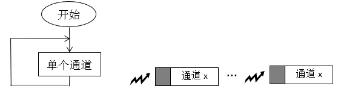

<!-- slide: 13 -->

- 3.扫描模式
- 此模式用来扫描一组模拟通道。 扫描模式可通过设置ADC_CR1寄存器的SCAN位来选择。一旦这个位被设置，ADC扫描所有被ADC_SQRX寄存器(对规则通道)或ADC_JSQR(对注入通道)选中的所有通道。在每个组的每个通道上执行单次转换。在每个转换结束时，同一组的下一个通道被自动转换。如果设置了CONT位，转换不会在选择组的最后一个通道上停止，而是再次从选择组的第一个通道继续转换。 如果设置了DMA位，在每次EOC后，DMA控制器把规则组通道的转换数据传输到SRAM中。而注入通道转换的数据总是存储在ADC_JDRx寄存器中。
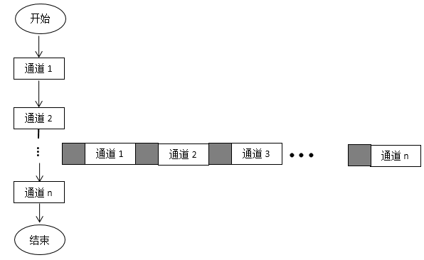

<!-- slide: 14 -->

- 4.间断模式
- STM32有16个多路通道。可以把转换组织成两组：规则组和注入组。在任意多个通道上以任意顺序进行的一系列转换构成成组转换。规则通道组：相当正常运行的程序，最多16个通道；注入通道组：相当于中断，最多4个通道。因为规则通道相当于程序正常运行，而注入通道相当于中断。也就是说，注入通道的转换可以打断规则通道的转换，当注入通道执行完以后继续执行规则通道。当只有规则通道时顺序执行（自行设置顺序），当加入注入通道以后就相当于触发中断，执行完注入通道以后再执行规则通道。
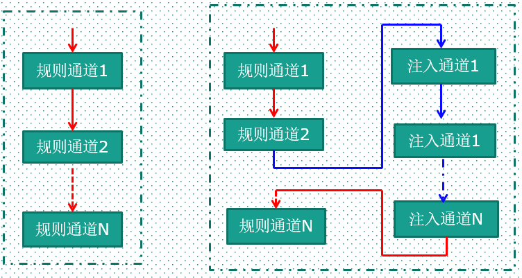

<!-- slide: 15 -->

- （1）规则组
- 此模式通过设置ADC_CR1寄存器上的DISCEN位激活。它可以用来执行一个短序列的n次转换(n<=8)，此转换是ADC_SQRx寄存器所选择的转换序列的一部分。数值n由ADC_CR1寄存器的DISCNUM[2:0]位给出。 一个外部触发信号可以启动ADC_SQRx寄存器中描述的下一轮n次转换，直到此序列所有的转换完成为止。总的序列长度由ADC_SQR1寄存器的L[3:0]定义。
- 举例： n=3，被转换的通道 = 0、1、2、3、6、7、9、10 第一次触发：转换的序列为 0、1、2 第二次触发：转换的序列为 3、6、7 第三次触发：转换的序列为 9、10，并产生EOC事件 第四次触发：转换的序列 0、1、2。注意： 当以间断模式转换一个规则组时，转换序列结束后不自动从头开始。 当所有子组被转换完成，下一次触发启动第一个子组的转换。在上面的例子中，第四次触发重新转换第一子组的通道 0、1和2。

<!-- slide: 16 -->

- （2）注入组
- 此模式通过设置ADC_CR1寄存器的JDISCEN位激活。在一个外部触发事件后，该模式按通道顺序逐个转换ADC_JSQR寄存器中选择的序列。 一个外部触发信号可以启动ADC_JSQR寄存器选择的下一个通道序列的转换，直到序列中所有的转换完成为止。总的序列长度由ADC_JSQR寄存器的JL[1:0]位定义。
- 举例： n=1，被转换的通道 = 1、2、3 第一次触发：通道1被转换。第二次触发：通道2被转换。第三次触发：通道3被转换，并且产生EOC和JEOC事件。第四次触发：通道1被转换。注意：当完成所有注入通道转换，下个触发启动第1个注入通道的转换；在上述例子中，第四个触发重新转换第1个注入通道1。不能同时使用自动注入和间断模式。必须避免同时为规则和注入组设置间断模式。间断模式只能作用于一组转换。

<!-- slide: 17 -->

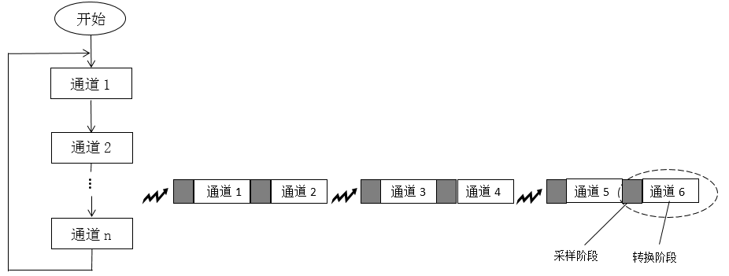

<!-- slide: 18 -->

- 5.校准
- ADC有一个内置自校准模式。校准可大幅减小因内部电容器组的变化而造成的准精度误差。在校准期间，在每个电容器上都会计算出一个误差修正码(数字值)，这个码用于消除在随后的转换中每个电容器上产生的误差。 通过设置ADC_CR2寄存器的CAL位启动校准。一旦校准结束，CAL位被硬件复位，可以开始正常转换。建议在上电时执行一次ADC校准。校准阶段结束后，校准码储存在ADC_DR中。

<!-- slide: 19 -->

- 6.数据对齐
- ADC_CR2寄存器中的ALIGN位选择转换后数据储存的对齐方式。数据可以左对齐或右对齐，如图9.5 和图9.6所示。注入组通道转换的数据值已经减去了在ADC_JOFRx寄存器中定义的偏移量，因此结果可以是一个负值。SEXT位是扩展的符号值。 对于规则组通道，不需减去偏移值，因此只有12个位有效。
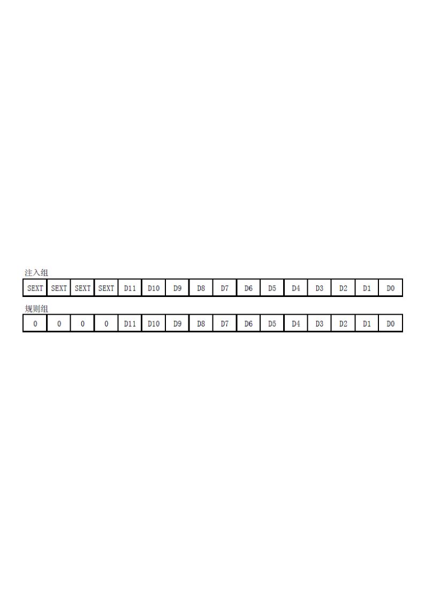
- 数据右对齐
- 数据左对齐
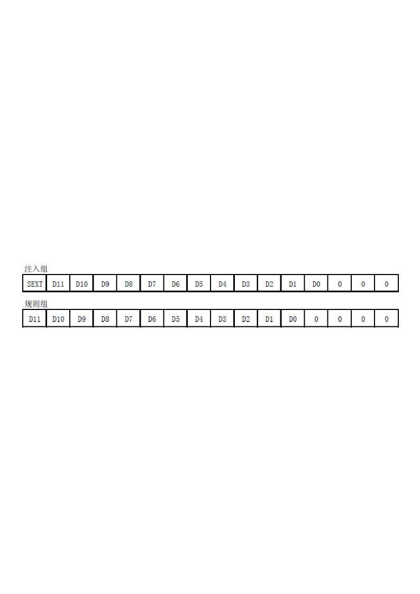

<!-- slide: 20 -->

- 7.可编程的通道采样时间
- ADC使用若干个ADC_CLK周期对输入电压采样，采样周期数目可以通过ADC_SMPR1和ADC_SMPR2寄存器中的SMP[2:0]位更改。每个通道可以分别用不同的时间采样。 总转换时间如下计算：TCONV = 采样时间+ 12.5个周期；例如： 当ADCCLK=14MHz，采样时间为1.5周期 TCONV = 1.5 + 12.5 = 14周期 = 1μs。
- 因为规则通道转换的值存储在一个仅有的数据寄存器中，所以当转换多个规则通道时需要使用DMA，这可以避免丢失已经存储在ADC_DR寄存器中的数据。只有在规则通道的转换结束时才产生DMA请求，并将转换的数据从ADC_DR寄存器传输到用户指定的目的地址。注：只有ADC1和ADC3拥有DMA功能。由ADC2转化的数据可以通过双ADC模式，利用ADC1的DMA功能传输。
- 8. DMA请求

<!-- slide: 21 -->

- 9.双ADC模式
- 在有2个或以上ADC模块的产品中，可以使用双ADC模式。 在双ADC模式里，根据ADC1_CR1寄存器中DUALMOD[2:0]位所选的模式，转换的启动可以是ADC1主和ADC2从的交替触发或同步触发。 注意： 在双ADC模式里，当转换配置成由外部事件触发时，用户必须将其设置成仅触发主ADC，从ADC设置成软件触发，这样可以防止意外的触发从转换。但是，主和从ADC的外部触发必须同时被激活。共有6种可能的模式： 同步注入模式、同步规则模式、快速交叉模式、慢速交叉模式、交替触发模式和独立模式。还有可以用下列方式组合使用上面的模式：同步注入模式 + 同步规则模式、同步规则模式 + 交替触发模式和同步注入模式 + 交叉模式。注意： 在双ADC模式里，为了在主数据寄存器上读取从转换数据，必须使能DMA位，即使不使用DMA传输规则通道数据。

<!-- slide: 22 -->

- 10.温度传感器
- 温度传感器可以用来测量器件周围的温度(TA)。 温度传感器在内部和ADC1_IN16输入通道相连接，此通道把传感器输出的电压转换成数字值。温度传感器模拟输入推荐采样时间是17.1μs。当没有被使用时，传感器可以置于关电模式。注意： 必须设置TSVREFE位激活内部通道：ADC1_IN16(温度传感器)和ADC1_IN17(VREFINT)的转换。温度传感器输出电压随温度线性变化，由于生产过程的变化，温度变化曲线的偏移在不同芯片上会有不同(最多相差45°C)。 内部温度传感器更适合于检测温度的变化，而不是测量绝对的温度。如果需要测量精确的温度，应该使用一个外置的温度传感器。

<!-- slide: 23 -->

- 9.1.5 STM32的ADC主要寄存器
- ADC主要寄存器功能
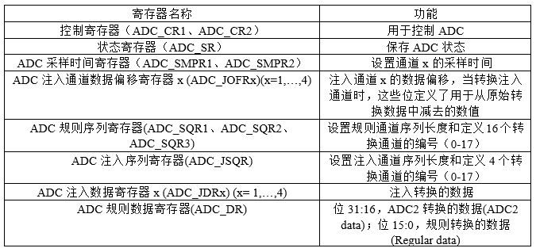

<!-- slide: 24 -->

- 9.2 ADC应用实例
- 利用滑动变阻器产生一定的电压，并通过STM32芯片的PC0/ADC10引脚采集这个电压，并把这个电压值通过数码管显示出来。
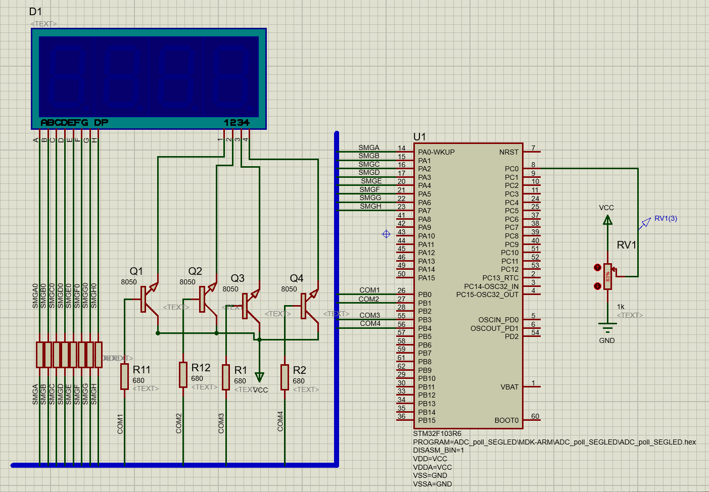

<!-- slide: 25 -->

- 9.2.1 实例主要库函数说明
- ADC采集开始函数：HAL_ADC_Start(&hadc1)，&hadc1为AD设备类型句柄。
- ADC采集校准函数：HAL_ADCEx_Calibration_Start(&hadc1)。
- ADC初始化函数：HAL_ADC_Init(&hadc1)，可配置ADC采集的ScanConvMode（扫描模式），ContinuousConvMode（连续转换模式），DiscontinuousConvMode（离散转换模式），ExternalTrigConv（外部触发模式），DataAlign（数据对齐方式）和NbrOfConversion（转换的通道数）属性。
- ADC通道配置函数：HAL_ADC_ConfigChannel(&hadc1, &sConfig)，可配置Channel（通道），Rank（采集顺序）和SamplingTime（采集时间）属性。
- 判断ADC采集是否完成：HAL_ADC_PollForConversion(&hadc1,100)表示等待ADC转换完成，超时为100ms。
- 判断ADC采集状态：HAL_ADC_GetState(&hadc1)，返回HAL_ADC_STATE_REG_EOC等状态信息。
- 读取ADC采集数值：HAL_ADC_GetValue(&hadc1)。
- 开启ADC采集中断：HAL_ADC_Start_IT(&hadc1)。
- ADC转换中断回调函数：HAL_ADC_ConvCpltCallback(hadc)。

<!-- slide: 26 -->

- 9.2.2 ADC查询和中断实例
- 【例9.1】ADC查询方式实例。
- 使用STM32CubeMX初始化ADC查询模式
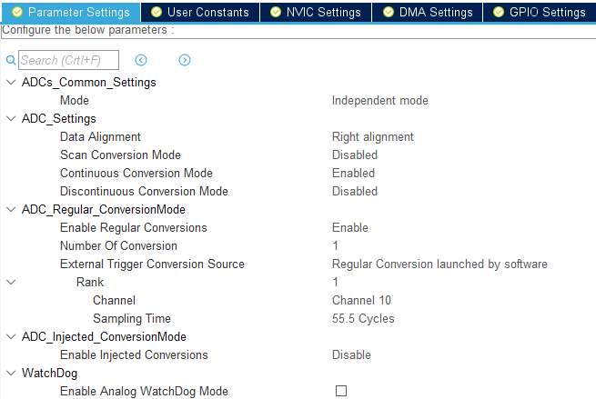
- ADC查询模式配置：采用独立工作模式、右对齐、连续模式、使能规则转换、1路转换、通道10、采集时间55.5周期。

<!-- slide: 27 -->

- （1）初始化配置，产生的代码如下：
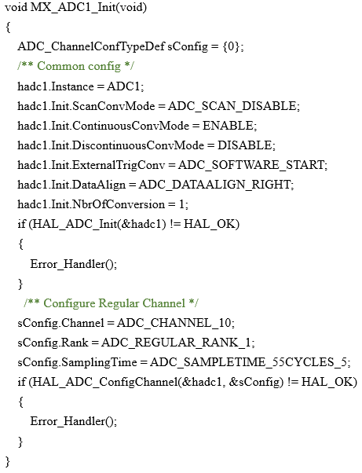
- （2）通过查询方式读取ADC采集结果，主要代码如下：
- （3）主程序main函数相关ADC采集的主要代码如下：
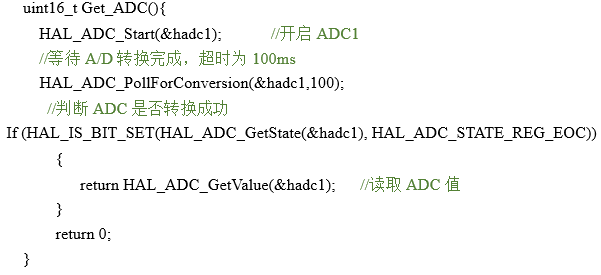
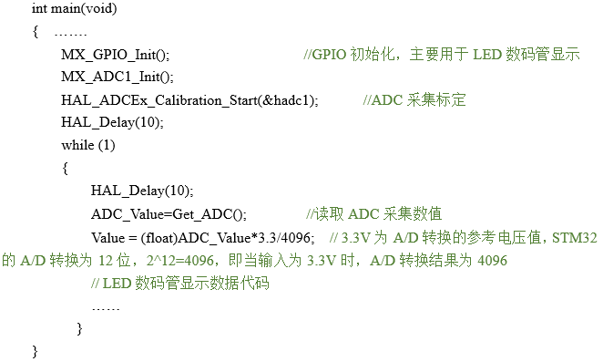

<!-- slide: 28 -->

- 【例9.2】ADC中断方式实例。
- 有关ADC初始化配置和查询一样，只是针对中断方式需要开启中断。

- void MX_ADC1_Init(void)和查询方式一样。
- A/D转换结束回调函数：
- 主程序main函数相关ADC采集的主要代码如下：
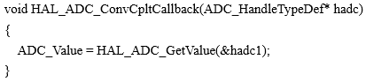
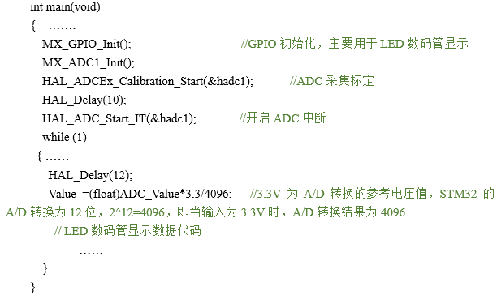

<!-- slide: 29 -->

- 谢谢!
