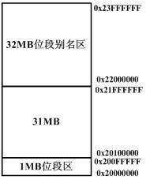
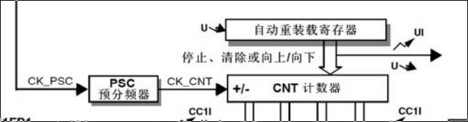
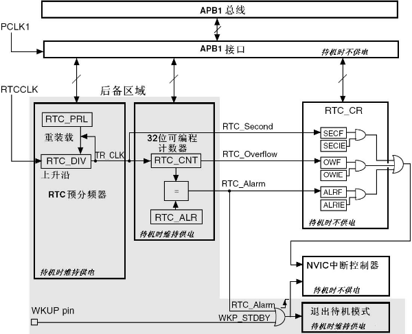
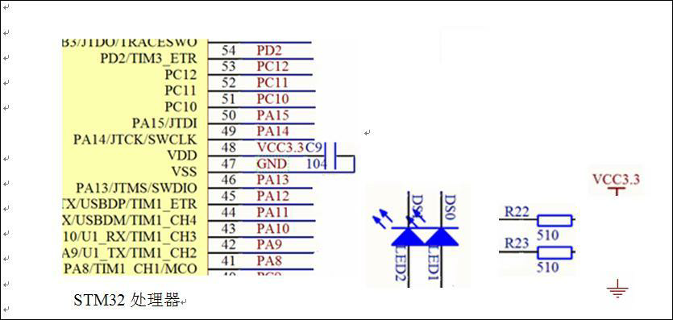
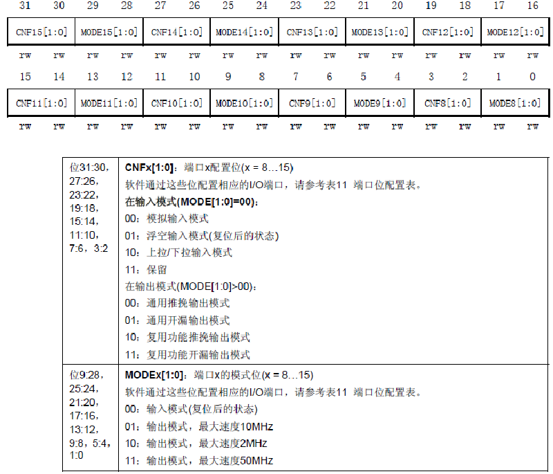
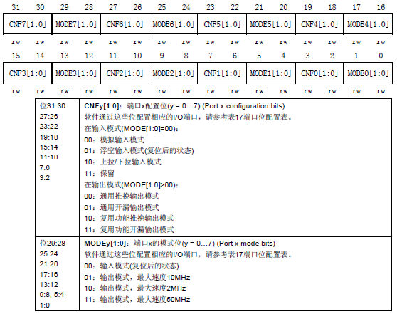
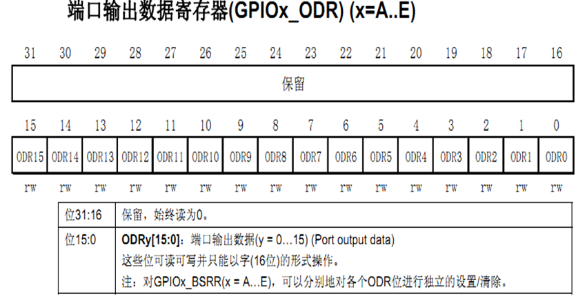

# 华南理工大学-嵌入式A卷

<!-- page: 1 -->

姓名

学号

_____________

诚信应考，考试作弊将带来严重后果！

________

学院

华南理工大学本科生期末考试

《
嵌入式系统
》A 卷

专业

注意事项：1. 开考前请将密封线内各项信息填写清楚；

班
座位

<!-- question: embedded-systems-014-Q1 -->

2. 所有答案请直接答在试卷上；
<!-- question: embedded-systems-014-Q2 -->

3．考试形式：闭卷；

课

<!-- question: embedded-systems-014-Q3 -->

4. 本试卷共（
）大题，满分100 分，考试时间120 分钟。

室

密封线内
不答题)
…………………
…………………
………
密
…………………
…………………
…
封
…………………
……………… 线
…………………
……………
线
…………………
………………

题号
一
二
三
总分

得分

<!-- question: embedded-systems-014-Q4 -->

一、单项选择题（20 分）（注意：从20 道中任选10 道完成，答题数超出10 道者，依序以前10

道已答题为准，每小题2 分，共20 分，本题答案填写在下表中有效）

1
2
3
4
5
6
7
8
9
10
得分

11
12
13
14
15
16
17
18
19
20

<!-- question: embedded-systems-014-Q5 -->

1、嵌入式处理器系统中访问速度最快存储器件的是
。
A. 寄存器
B. cache
C. Flash 存储器
D. SRAM

<!-- question: embedded-systems-014-Q6 -->

2、下列存储器中的能直接配置到嵌入式处理器内存空间的是
。
A. NAND Flash
B. NOR Flash
C. SD 卡
D. 串行存储器

<!-- question: embedded-systems-014-Q7 -->

3、STM32F103xxx 处理器系统中访问I/O 外设寄存器使用
。
A. 专门的I/O 指令
B. 机器指令
C. 与访问内存相同的指令
D. 以上都不是

《嵌入式系统》试卷第1 页共1 页

<!-- page: 2 -->

<!-- question: embedded-systems-014-Q8 -->

4、嵌入式处理器能直接执行的只有
。
A. 符号语言
B. 高级语言
C. 汇编语言
D.机器语言

<!-- question: embedded-systems-014-Q9 -->

5、STM32F103xxx 处理器上电复位后I/O 端口被配置成
模式。
A. 输入浮空
B. 输入上拉
C. 输入下拉
D. 输出

<!-- question: embedded-systems-014-Q10 -->

6、STM32F103xxx 处理器中的独立看门狗（IWDG）其计数脉冲由
提供。
A. HSI
B. LSI
C. HSE
D. LSE

<!-- question: embedded-systems-014-Q11 -->

7、Cortex™-M3 内核的工作电源电压为
。
A. 5V
B. 3.3V
C. 1.8V
D. 以上都不是

<!-- question: embedded-systems-014-Q12 -->

8、嵌入式处理器的体系结构
A. 仅采用冯•诺依曼体系结构
B. 仅采用哈佛体系结构
C. 即不采用冯•诺依曼体系结构，也不采用哈佛体系结构
D. 即可采用冯•诺依曼体系结构，也可采用哈佛体系结构

<!-- question: embedded-systems-014-Q13 -->

9、STM32F103xxx 处理器
模式功耗最低。
A. 待机模式
B. 停机模式
C. 睡眠模式
D. 运行模式

<!-- question: embedded-systems-014-Q14 -->

10、一个STM32F103xxx 的USART 异步传输过程：设每个字符对应一个起始位、8 个数据位、无校验、1
个停止位，如果波特率为2400bps，那么每秒钟能传输的字符（字节）数为               个。

A.
200
B. 240
C.
2400
D.
300

<!-- question: embedded-systems-014-Q15 -->

11、在STM32F103XX 系列处理器中，不属于它的通用数字输入输出IO 端口为（
）
A、PA
B、PD
C、PJ
D、PG

<!-- question: embedded-systems-014-Q16 -->

12、RS232-C 串口通信中，表示逻辑1 的电平是（
）。
A、0V
B、3.3V
C、+5V～+15V
D、-15V～-5V

<!-- question: embedded-systems-014-Q17 -->

13、关于中断嵌套说法正确的是（
）
A 只要抢占式优先级不一样就有可能发生中断嵌套
B 只要响应优先级不一样就有可能发生中断嵌套
C 只有抢占式优先级和响应优先级都不一样才有可能发生中断嵌套
D 以上说法都不对的

<!-- question: embedded-systems-014-Q18 -->

14、Context – M3 处理器的寄存器R15 代表（
）
A 通用寄存器
B 程序计数器
C 链接寄存器
D 程序状态寄存器

<!-- question: embedded-systems-014-Q19 -->

15、假设使用奇偶校验位，STM32 的UART 发送一个字节的数据，从idle 状态开始（及数据线为高），
到允许进行下一次发送动作态为止，至少需要（
）个时钟节拍。
A、8
B、9
C、11
D、10

《嵌入式系统》试卷第2 页共2 页

<!-- page: 3 -->

<!-- question: embedded-systems-014-Q20 -->

16、STM32 芯片内部集成的（）位ADC 是一种模拟/数字转换器，具有18 个通道，可测量16 个外
部和2 个内部信号源。

A.
14
B.
13
C.
11
D.
12

<!-- question: embedded-systems-014-Q21 -->

17、下列CPSR 寄存器标志位的作用说法错误的是（
）
A、V：借位
B、N：负数
C、C:进位
D、Z：零

<!-- question: embedded-systems-014-Q22 -->

18、STM32 的中断屏蔽器能屏蔽（
）。
A 所有中断和异常
B 除了NMI 外所有异常和中断
C 部分中断
D 除了NMI、异常所有其他中断

<!-- question: embedded-systems-014-Q23 -->

19、在STM32F103XX 系列处理器中，系统内部集成的模拟数字转换器ADC，（
）
A 只可实现扫描模数转换
B 只可实现单次模数转换
C 可实现单次模数转换或扫描模数转换D 没有正确答案

<!-- question: embedded-systems-014-Q24 -->

20、STM32 的高寄存器可以被所有的（）位汇编指令访问。
A、64
B、16
C、8
D、32

<!-- question: embedded-systems-014-Q25 -->

二、填空题（注意：从20 道中任选10 道完成，答题数超出10 道者，依序以前10 道已答题为准，

每小题2 分，共20 分）

<!-- question: embedded-systems-014-Q26 -->

1、在嵌入式计算机系统中，下列部件都能够存储信息：

①SRAM、②CPU 内的通用寄存器、③串行存储器。

按照嵌入式处理器存取速度排列，由快至慢依次为
。其中，不能直接

作为内存的是
。

<!-- question: embedded-systems-014-Q27 -->

2、嵌入式系统以应用为中心，以
为基础，
可裁减，

功能、可靠性、成本、体积、功耗严格有要求的专用计算机系统。

<!-- question: embedded-systems-014-Q28 -->

3、嵌入式系统硬件系统包括（至少写出2 个）：

。

<!-- question: embedded-systems-014-Q29 -->

4、与通用计算机系统技术发展方向不同，嵌入式计算机系统在技术发展方向追求对特

定对象系统的
。

《嵌入式系统》试卷第3 页共3 页

<!-- page: 4 -->

<!-- question: embedded-systems-014-Q30 -->

5、MCU 的最大特点是单片化，
大大减小，从而使
下降，可靠性提高。

<!-- question: embedded-systems-014-Q31 -->

6、嵌入式微处理器的指令系统即可采用
，又可以采

用
。

<!-- question: embedded-systems-014-Q32 -->

7、哈佛结构则是不同于冯·诺依曼结构的一种并行体系结构，系统中设置的两条总

线是
，从而使数据的吞吐率提高了约
倍。

<!-- question: embedded-systems-014-Q33 -->

8、嵌入式处理器中已采用和即将采用的先进技术有（至少写出2 个）：

，
，

。

<!-- question: embedded-systems-014-Q34 -->

9、32 位嵌入式系统存储体系中，每个字单元中包含4 个字节，有两种不同存放的格式。

分别为大端序格式（big-endian 格式）和小端序格式（little-endian 格式）。其小端序格式

的存储特点是

，
。

<!-- question: embedded-systems-014-Q35 -->

10、STM32F103xxx 处理器的4 个供电区域为：

，
，

，
。

<!-- question: embedded-systems-014-Q36 -->

11、微处理器控制I/O 端口或部件的数据传送方式有2 种:

程序查询方式和
方式。

<!-- question: embedded-systems-014-Q37 -->

12、GPIOX_
和GPIOX_BRR 寄存器的目的就是用来允许对GPIO 寄存器进行的读/修

改操作。

<!-- question: embedded-systems-014-Q38 -->

13、在ARM 的汇编程序中，关键字CODE 用于定义汇编
，DATA 用于

定义汇编数据段。

<!-- question: embedded-systems-014-Q39 -->

14、3 级流水线的ARM 处理器，指令的执行分为
、译码级和执行级。

《嵌入式系统》试卷第4 页共4 页

<!-- page: 5 -->

<!-- question: embedded-systems-014-Q40 -->

15、STM32 的所有端口都有外部中断能力。当使用外部中断线时，相应的引脚必须配置

成
。

<!-- question: embedded-systems-014-Q41 -->

16、STM32F103XX 片上FLASH 程序存储器的编程可以通过以下几种方式来实现：（1）通过

；（2）通过在系统编程ISP（In System Programming），即USART0 通讯接口；（3）通过应用

编程IAP（In Application Programming）。

<!-- question: embedded-systems-014-Q42 -->

17、STM32 通用定时器TIM 的16 位计数器可以采用三种方式工作，分别为向上计数模

式、
和中央对齐模式。

<!-- question: embedded-systems-014-Q43 -->

18、处理器芯片厂商预置的Bootloader 属于
启动模式（BOOT0=1，

BOOT1=0）

<!-- question: embedded-systems-014-Q44 -->

19、ARM 嵌入式系统中的常用的源文件类型，汇编程序文件为后缀为
的文件。

20、Cortex-M3 可支持4GB 存储空间，不同区域的划分，从0x00000000 至0x1FFFFFFF 是属于
区。

<!-- question: embedded-systems-014-Q45 -->

三、应用题（注意：从8 道中任选4 道完成，答题数超出4 道者，依序以前4 道已答题为准，每

小题15 分，共60 分）

<!-- question: embedded-systems-014-Q46 -->

1、Cortex™-M3 内核的SRAM 内存空间分配如图1，其中包含1 个位段(bit-band)区和1 个位段别名
区。位段区将位段别名区中的每个字（32bits，4bytes）映射到位段区的一个位，在位段别名区写入一
个字具有对位段区的目标位执行读-改-写操作的相同效果。

图1

《嵌入式系统》试卷第5 页共5 页

<!-- page: 6 -->

假设：
bit_word_addr 是位段别名区中字的地址，它映射到某个目标位；
bit_word_base 是位段别名区的起始地址，图中为0x22000000;
byte_offset 是包含目标位的字节在位段区里的偏移量，图中位段区起始地址为0x20000000;
bit_number 是目标位所在字节的位号；

（1）已知bit_band_base、byte_offset 和bit_number，写出求bit_word_addr 的计算公式。
<!-- question: embedded-systems-014-Q47 -->

（2）计算SRAM 地址为0x20000400 的字节中的位3 在位段别名区中的字地址。

<!-- question: embedded-systems-014-Q48 -->

2、STM32F103xxx 的通用定时器TIMx 时基电路关键部分如图2 所示。

图2
<!-- question: embedded-systems-014-Q49 -->

（1）、设CK_PSC 脉冲信号频率为72MHz，初始化时PSC 预分频器寄存器写入999，CNT 计数器寄
存器写入17999，CNT 计数器设置为向下计数，计算该定时器的定时时间。

<!-- question: embedded-systems-014-Q50 -->

（2）、设CK_PSC 脉冲信号频率为36MHz，要求该定时器的定时时间为1 秒，PSC 预分频器寄存器
仍设置为999，CNT 计数器寄存器应该初始化的值是多少？

《嵌入式系统》试卷第6 页共6 页

<!-- page: 7 -->

<!-- question: embedded-systems-014-Q51 -->

3、关于STM32F103xxx 的通用同步异步收发器USART。
<!-- question: embedded-systems-014-Q52 -->

（1）同步传输的波特率为何大于异步传输的波特率？
<!-- question: embedded-systems-014-Q53 -->

（2）你所知道的STM32F103xxx 同步模式有哪些？（至少写出2 个）
<!-- question: embedded-systems-014-Q54 -->

（3）请画出异步通信、1 个起始位、8 个数据位、无校验、1 个停止位，传输2 个字节0x35、0x55 的数
据帧图。

<!-- question: embedded-systems-014-Q55 -->

4、STM32F103xxx 内部的实时时钟RTC 单元如图3

图3

<!-- question: embedded-systems-014-Q56 -->

（1）实时时钟RTC 最多可以设置几个中断？分别是哪几个？
<!-- question: embedded-systems-014-Q57 -->

（2）如果图中RTCCLK 来自外部低速晶振，其晶振的标称频率为32768Hz，TR_CLK 周期为1 秒，如果
该晶振精度为20ppm（precision per million），这个RTC 一年的误差是多少秒？

《嵌入式系统》试卷第7 页共7 页

<!-- page: 8 -->

（3）设TR_CLK 周期为1 秒，将时钟初始化为2014 年6 月4 日10 点10 分10 秒，请计算RTC_CNT 初
始化值，要有必要的推导过程。（注：按一年365 天计算，①不考虑世纪年；②不考虑闰年，2 月份全
部为28 天）

《嵌入式系统》试卷第8 页共8 页

<!-- page: 9 -->

<!-- question: embedded-systems-014-Q58 -->

5、试使用ARM 汇编语言编写一个循环程序，实现从10 开始的8 个偶数的累加。

<!-- question: embedded-systems-014-Q59 -->

6、简述STM32 的高级控制定时器TIM1 的结构(包括：定时器的位数、是否可自动装载、主要用途、与
通用控制定时器TIMx 的关系等方面叙述)。

<!-- question: embedded-systems-014-Q60 -->

7、请描述Cortex – M3 处理器基本结构中，NVIC 支持的优先级分组方式。

《嵌入式系统》试卷第9 页共9 页

<!-- page: 10 -->

<!-- question: embedded-systems-014-Q61 -->

8、使用图4 的STM32 处理器电路进行实验，要求将两个LED 灯DS0 和DS1 交替闪烁（请使用PA 或PD
端口的2 个引脚）。请连接线路，并编写实验程序。

图4
使能PORTA 时钟指令为：RCC->APB2ENR|=(1<<2);
使能PORTD 时钟指令为：RCC->APB2ENR|=(1<<5);
系统时钟设置子程序为：Stm32_Clock_Init(9);
延时400 毫秒子程序为：delay_ms(400);
端口配置高寄存器(GPIOx_CRH) (x=A..E) ：

《嵌入式系统》试卷第10 页共10 页

<!-- page: 11 -->

端口配置低寄存器(GPIOx_CRL) (x=A..E) ：

《嵌入式系统》试卷第11 页共11 页

<!-- page: 12 -->

《嵌入式系统》试卷第12 页共12 页

