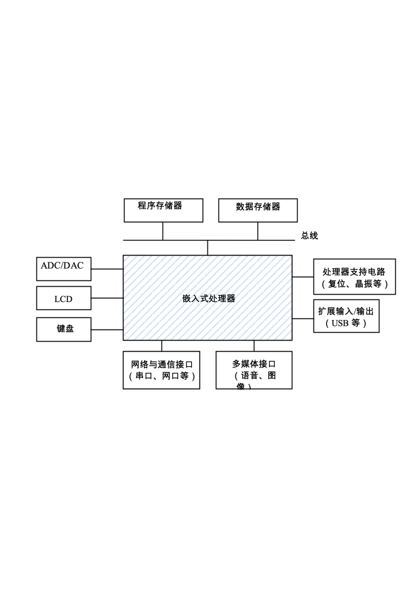
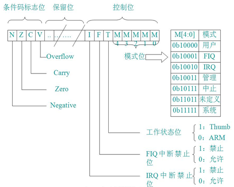
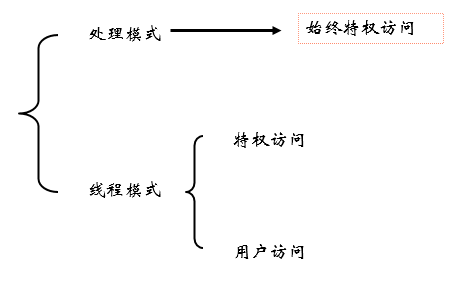
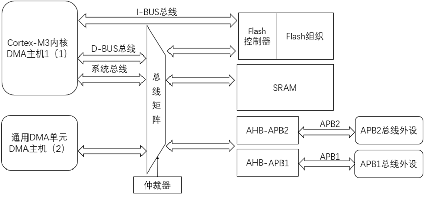
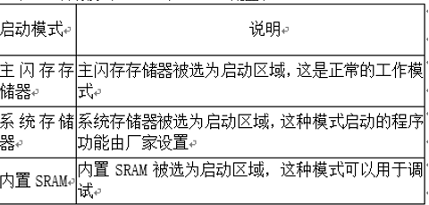

# 嵌入式系统复习2025

**2024年复习大纲**

**主要题型选择题，填空题，问答题，综合题。**

**第1章 嵌入式系统与微控制器**
1. 嵌入式系统的定义。

嵌入式系统的定义是什么？

2.嵌入式系统的特点。

嵌入式系统有哪些特点？嵌入式系统与通用计算机系统的区别?
1. 嵌入式系统芯片，嵌入式芯片的种类，以及各类芯片的特点。

嵌入式芯片有哪几类，每一类的特点是什么？

4.嵌入式系统硬件和软件系统基本组成。

（1）嵌入式系统硬件组成：

1）基本电路：电源、重启电路和时钟电路

2）存储电路：RAM和ROM，根据书中内容了解有哪些主要的RAM和ROM（Flash）,例如SRAM,DRAM,E2PROM, NAND FLASH NOR FLASH等，了解这些存储器芯片的主要特点和用途。

3）模拟电路-模数转换（AD）和数模转换(DA)

4）其他常用接口电路

（2）嵌入式系统软件系统

嵌入式系统软件开发的方法和流程。

1）嵌入式裸机软件系统

2）嵌入式操作系统软件系统

（3）嵌入式系统开发

1）嵌入式系统芯片选型。

能够列举出嵌入式系统芯片选型的依据。

2）嵌入式系统硬件设计。

嵌入式系统硬件

3）嵌入式软件开发及编译、下载（JTAG模式）。

能够简要说明嵌入式从开发、编译以及下载的过程，即怎样实现从借助开发环境例如CubeMX，Keil MDK开发软件、以及编译到下载到芯片的整个过程。

4）嵌入式系统及芯片应用及发展趋势。

了解嵌入式系统芯片发展的趋势。

**第2章 微控制器体系结构及汇编语言**

（1）了解ARM  及Cortex-M3内核

1）Cortex-M3内核特点，采用什么体系架构，大致了解。

Cortex-M3有哪四种总线：I-Code总线，D-Code总线，系统总线和外部私有外设总线，它们的各自主要功能是什么？

通用寄存器  R0-R12、堆栈指针R13、链接寄存器R14和程序计数寄存器R15。

特殊功能寄存器CPSR。CPSR中包含条件码标志、中断禁止位、当前处理器模式以及其他状态和控制信息。知道当一些运算操作时，会影响条件码标志位（N,Z,C,V）怎么改变。

2）Cortex-M3处理器支持两种处理器的操作模式，还支持两级特权操作。两种操作模式分别为：处理者模式(handler mode)和线程模式（thread mode）。

了解处理模式，线程模式，特权访问以及用户访问，说明ARM 体系结构采用这些模式的目的。

3）寄存器组说明

通用寄存器  R0-R12

堆栈指针R13

链接寄存器R14

程序计数寄存器R15

xPSR：所有处理器模式下都可访问当前程序状态寄存器CPSR。在每种异常模式下都有一个对用的程序状态寄存器SPSR。当异常出现时，SPSR用于保存CPSR的状态，以便异常返回后恢复异常发生时的工作状态。

4）大端格式和小端格式

知道什么是大端格式，什么是小端格式？

5）异常和中断，它们定义，以及大概说明它们区别。Cortex-M3处理器有哪些异常，知道3种；有哪些中断，知道3种。

6）存储器保护单元（MPU）是什么和有什么作用。

（4）ARM微处理器的指令系统

1）寻址方式：

知道有以下寻址方式类型，并在看到某个汇编程序时可判断具体的指令类别。

1.寄存器寻址；		2.立即寻址；

3.寄存器移位寻址；		4.寄存器间接寻址；

5.基址寻址；			6.多寄存器寻址；

7.堆栈寻址；			8.相对寻址。

2）汇编指令不会超出作业范围。

掌握MOV，SUB，ADD，LDR，STR，LDRB，STRB，AND，ORR指令的特点和使用，不超出习题范围。

**第3章 微控制器硬件系统**

（1）STM32F103rb芯片的特点和资源

例如采用什么内核，是多少位，有哪些主要接口，Flash和RAM大致有多大。

(2)了解系统结构

（3）STM32启动设置

STM32有哪三种启动方式？

（4）STM32芯片下载模式。

了解STM32芯片方式JTAG，SWD，Bootloader串口下载模式。

（5）STM32最小化系统

电源、Reset和时钟电路。认识电源电路，Reset电路，时钟电路，了解STM32 芯片的时钟源种类。

****

（6）低功耗模式

STM32有哪三种低功耗模式，主要特点有哪些？

**第4章 微控制器软件开发**

了解STM32芯片使用哪种开发环境，库函数开发方式的优缺点。本书主要以HAL库方式开发。

**第5章** **GPIO接口**

GPIO的特点，会编写程序实现输入和输出，包括GPIO初始化，输出，输入（考试中会给出相应的HAL库函数使用说明）。

**第6章 中断**

中断的特点？

中断优先级，什么抢占优先级，什么是响应优先级。

中断编程实现，会编写中断初始化程序，包括外部中断设置，中断优先级设置内容，以及中断回调处理函数实现，考试内容不超出实验。（考试中会给出相应的HAL库函数使用说明）。

**第7章 串行通信**

串口通信特点。

什么是同步，异步串行通信。

串行通信编程（USART），要求利用查询方式实现发送或接收，会配置串口通信初始化程序，以及发送和接收程序。（考试中会给出相应的HAL库函数使用说明）。

**第8章 定时器**

通用定时器的特点；定时（会通过定时初始化设置，实现一定时间的定时功能），计数，捕获和PWM（会PWM概念和根据PWM波形计算出电压值）的功能。

会编写定时器实现程序，实现一定的定时功能，包括初始化部分程序、定时程序实现。

滴答定时器（systic）：了解其作用和功能。

实时时钟（RTC）: 了解其作用和功能。

看门狗定时器：了解其作用和功能，主要了解独立看门狗。

**第9章** **ADC**

ADC的特点。

ADC计算，会计算模拟量和数字量转换。能够描述ADC查询、中断和DMA方式编写程序实现的过程。

**第10章** **DMA**

DMA的特点和作用？DMA的传输方式种类？DMA与查询方式和中断方式的区别有哪些？

**第11章 其他接口**

知道常用的I2C,  CAN和USB，知道其概念和特点。

**第12章嵌入式操作系统**

有哪些常见的小型嵌入式操作系统？小型嵌入式操作系统的特点?  功能？了解实验过程中一个小型嵌入式系统开发的过程？移植嵌入式操作系统的思路。了解μC/OS-II和openharmony嵌入式操作系统的特点及开发过程。

**第13章 综合设计实例**

会描述一个嵌入式系统开发过程，从硬件到软件开发整个过程。
