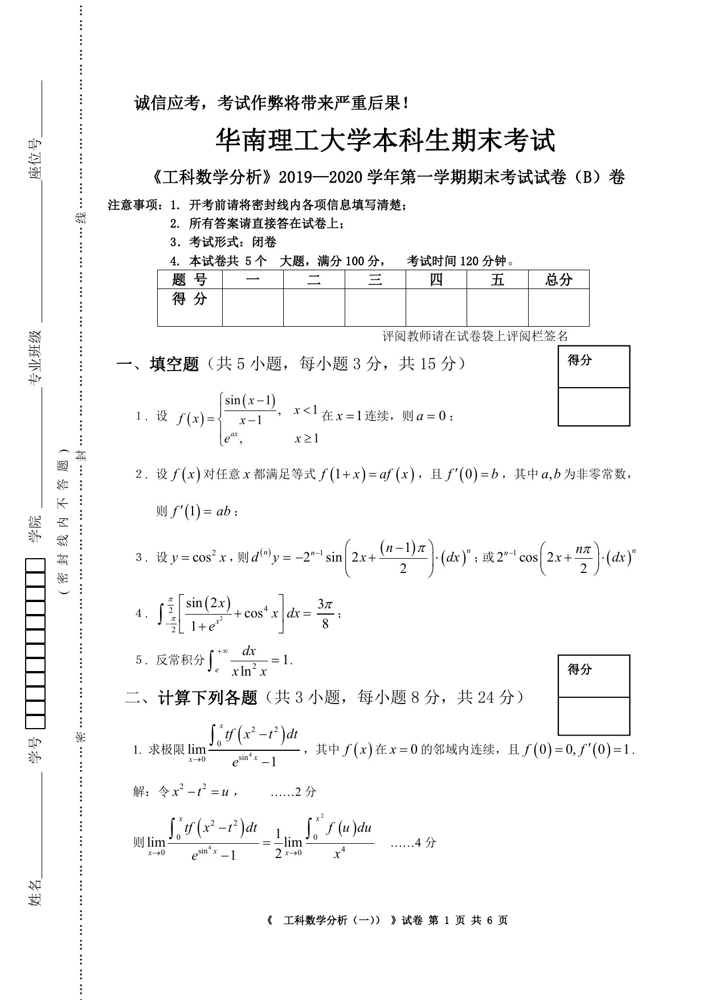
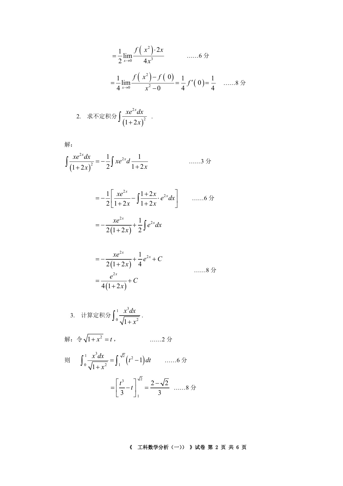
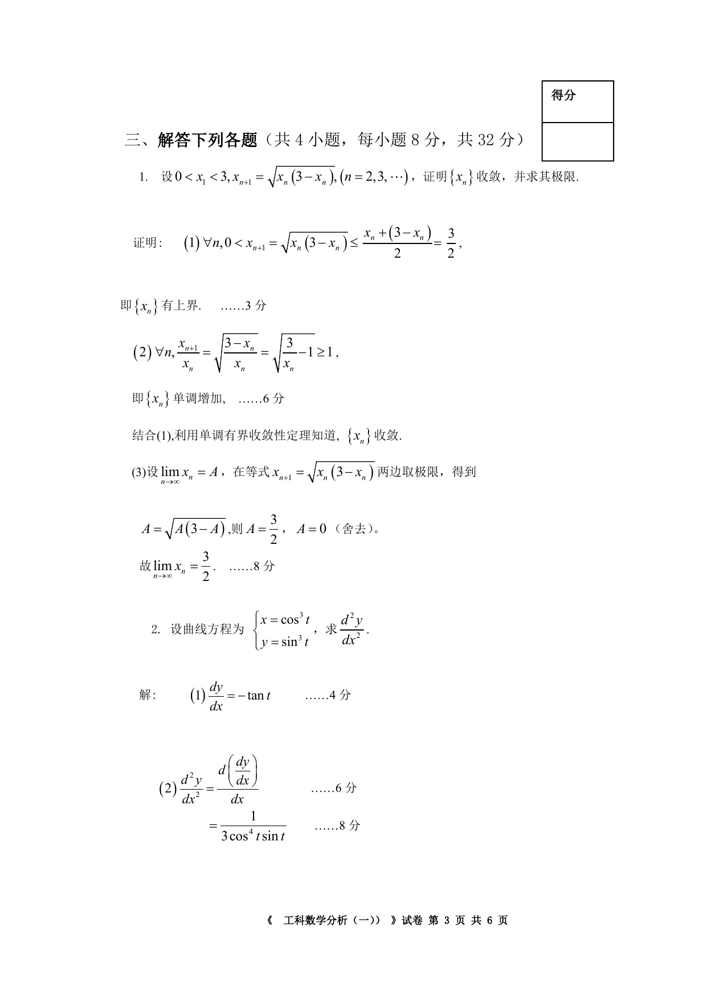
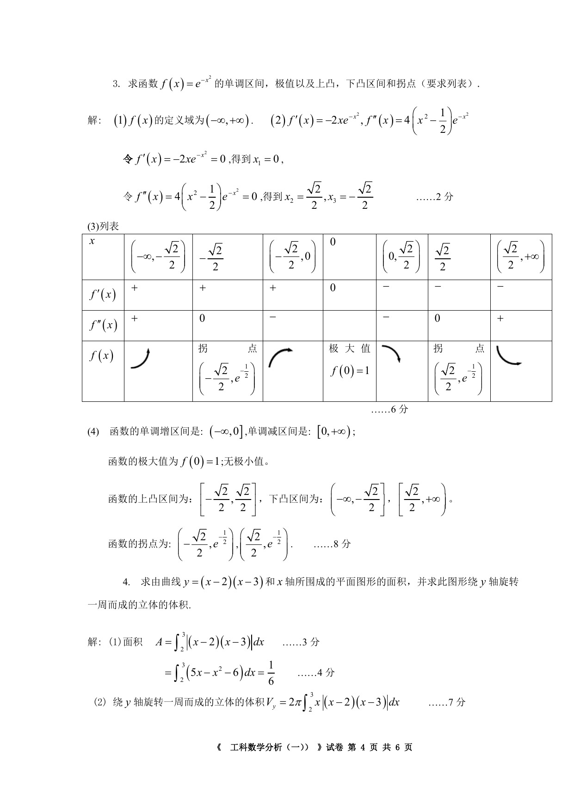
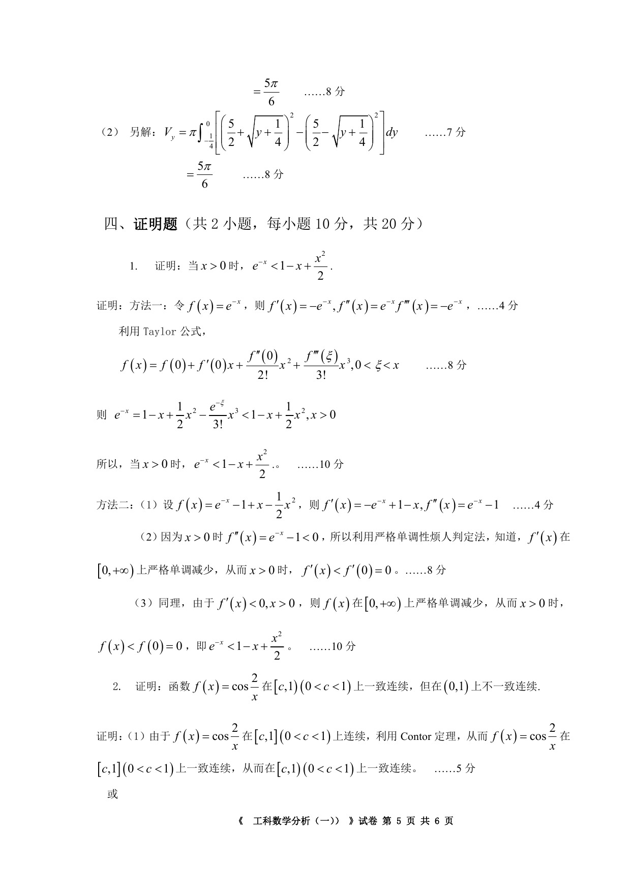
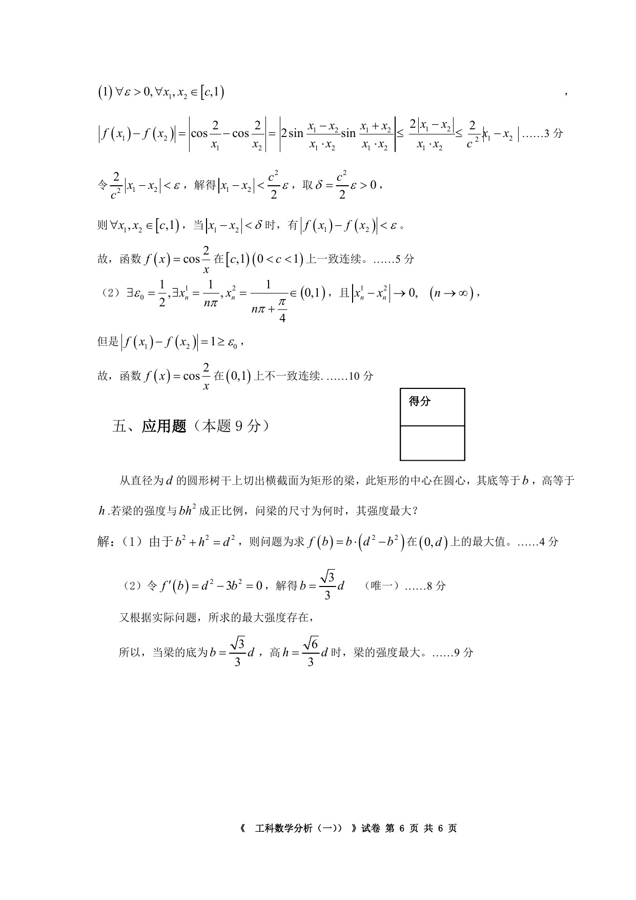

# 2019—2020 学年第一学期《工科数学分析（一）》期末考试试卷（B 卷，含答案）

<!-- page: 1 -->

## 第 1 页

<!-- page: 2 -->

## 第 2 页

<!-- page: 3 -->

## 第 3 页

<!-- page: 4 -->

## 第 4 页

<!-- page: 5 -->

## 第 5 页

<!-- page: 6 -->

## 第 6 页

