# 工数1~3章知识点及对应真题

<!-- slide: 1 -->

## 一

- 集合与函数
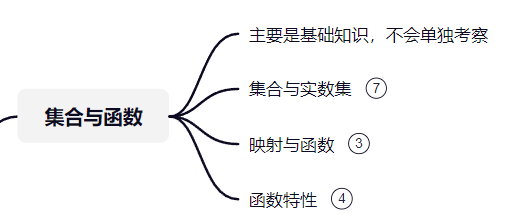

<!-- slide: 2 -->

## 二

- 极限与连续
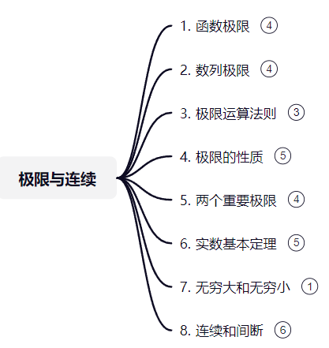

<!-- slide: 3 -->

- 极限与连续
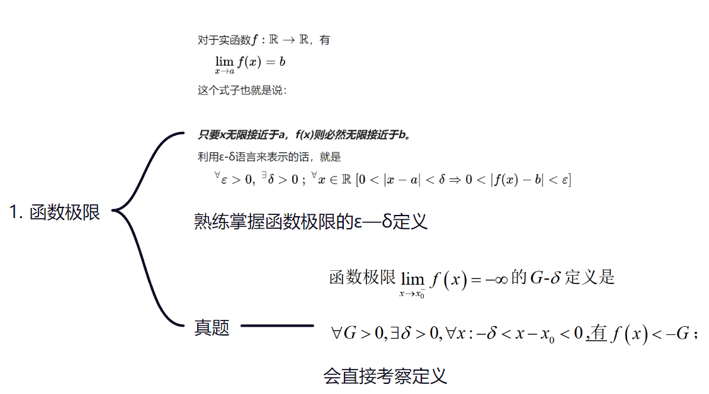

<!-- slide: 4 -->

- 极限与连续

<!-- slide: 5 -->

- 极限与连续
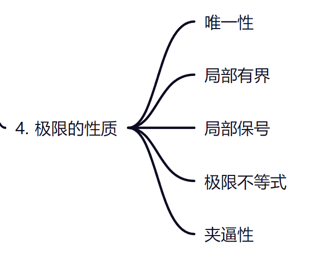

<!-- slide: 6 -->

- 极限与连续
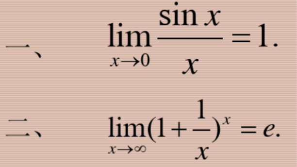
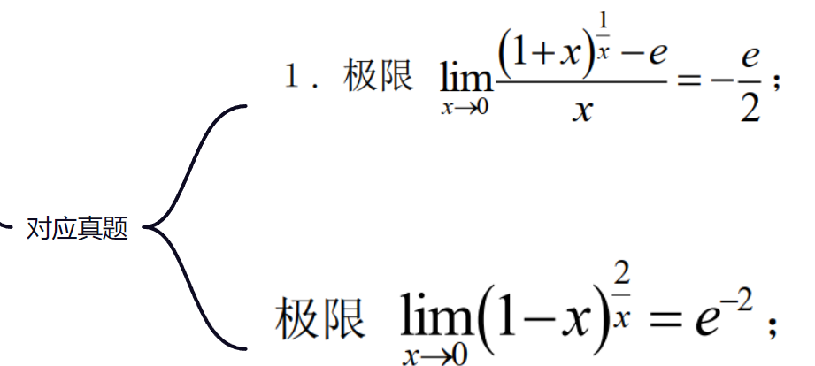

<!-- slide: 7 -->

- 极限与连续
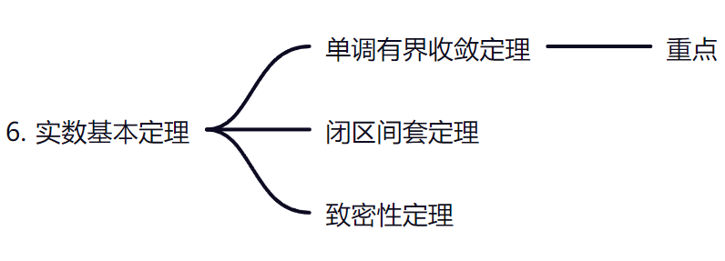

<!-- slide: 8 -->

- 极限与连续
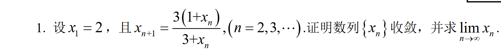
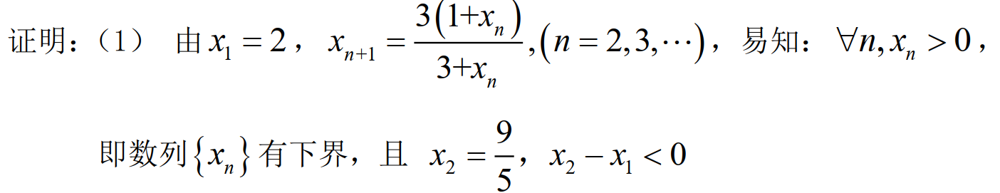
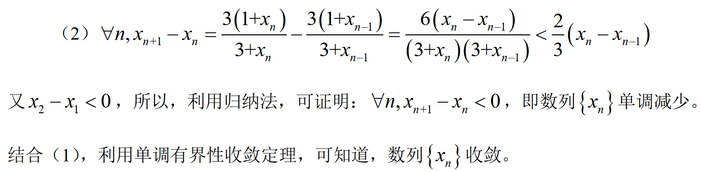
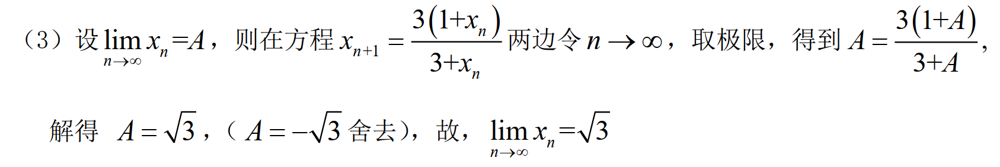

<!-- slide: 9 -->

- 极限与连续
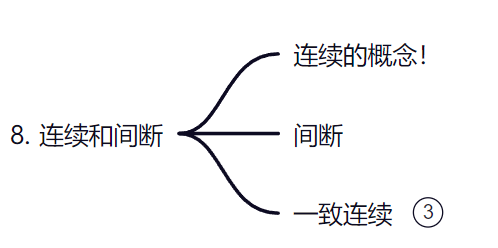
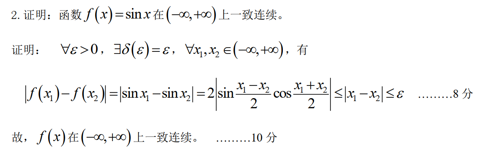

<!-- slide: 10 -->

- 极限与连续
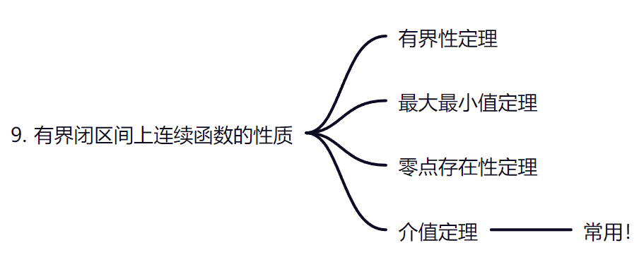

<!-- slide: 11 -->

## 三

- 一元函数微分学
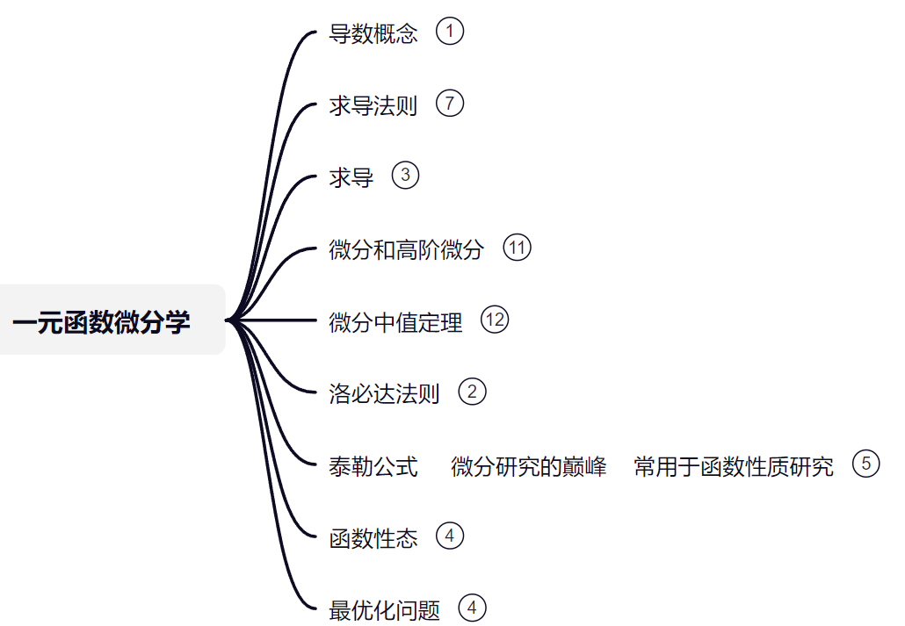

<!-- slide: 12 -->

- 一元函数微分学
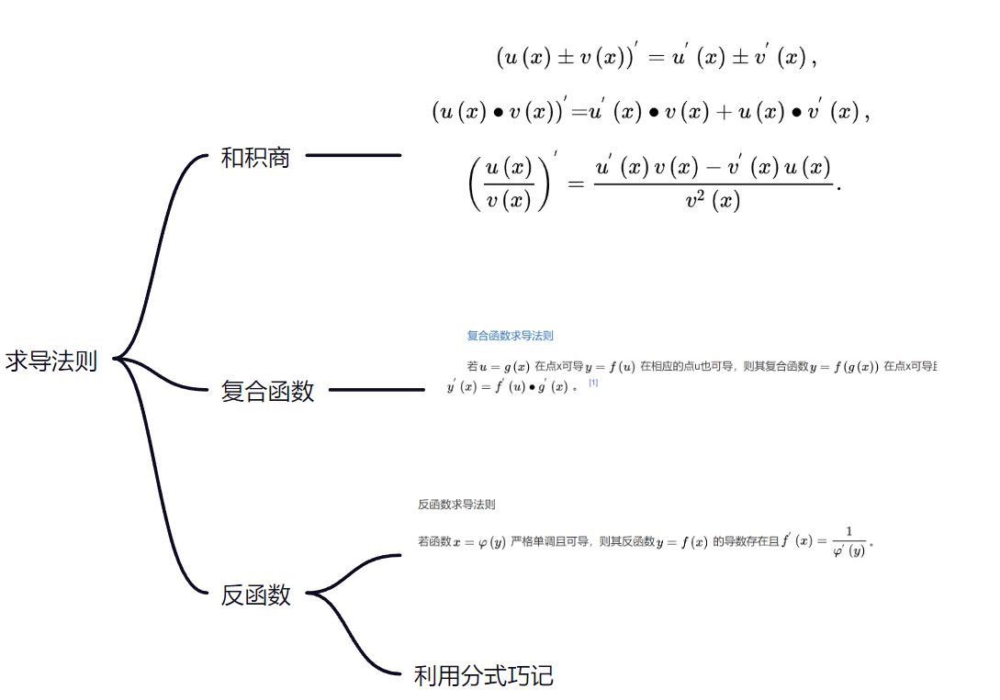

<!-- slide: 13 -->

- 一元函数微分学
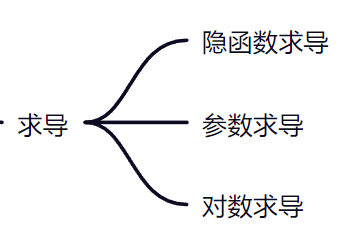

<!-- slide: 14 -->

- 一元函数微分学

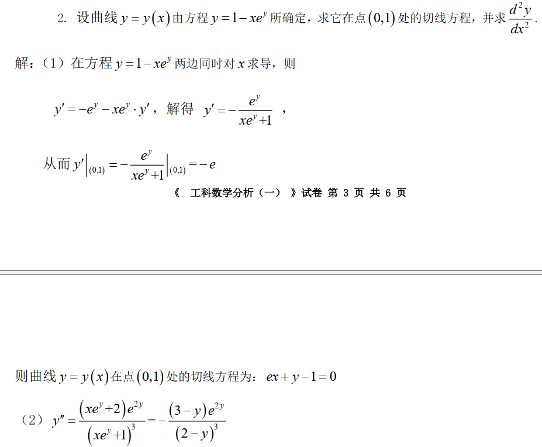

<!-- slide: 15 -->

- 一元函数微分学
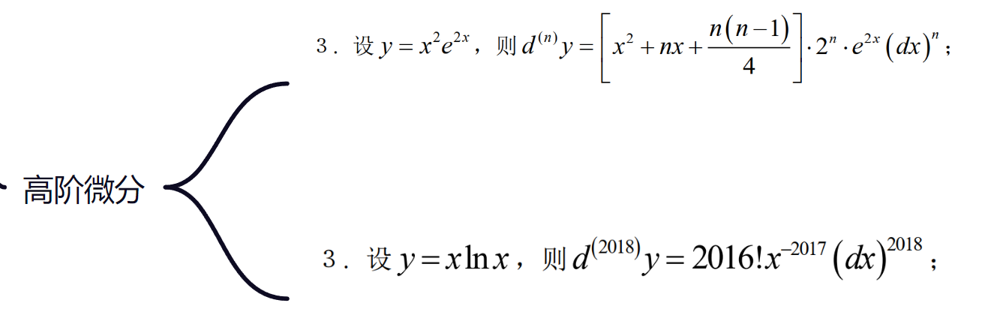

<!-- slide: 16 -->

- 一元函数微分学
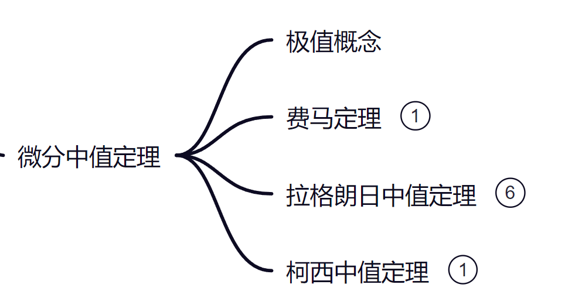

<!-- slide: 17 -->

- 一元函数微分学
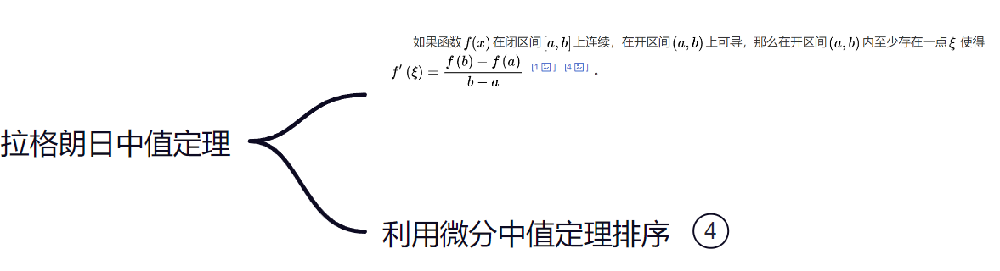
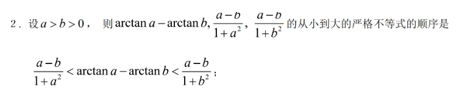

<!-- slide: 18 -->

- 一元函数微分学
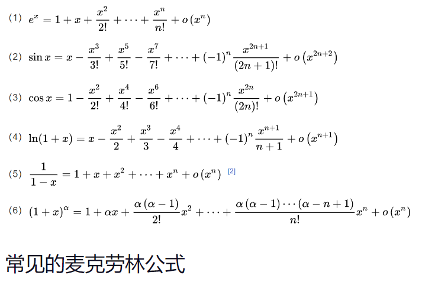

<!-- slide: 19 -->

- 泰勒公式     微分研究之巅    常用于函数性质研究
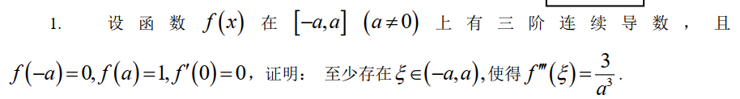
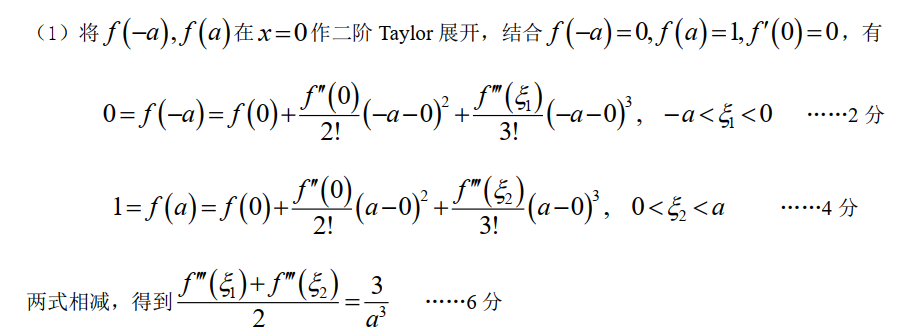

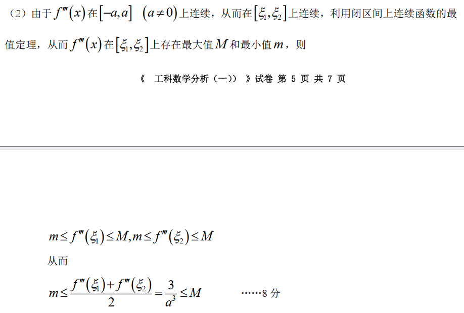
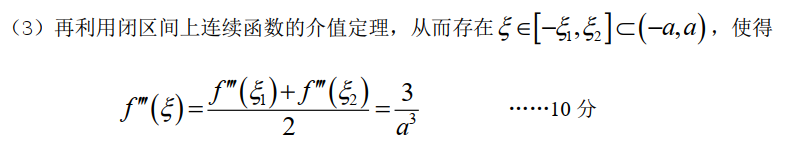

<!-- slide: 20 -->

- 一元函数微分学
- 一般步骤：求定义域-求一阶导数-求二阶导数-令一、二阶导数为0-列表-答题
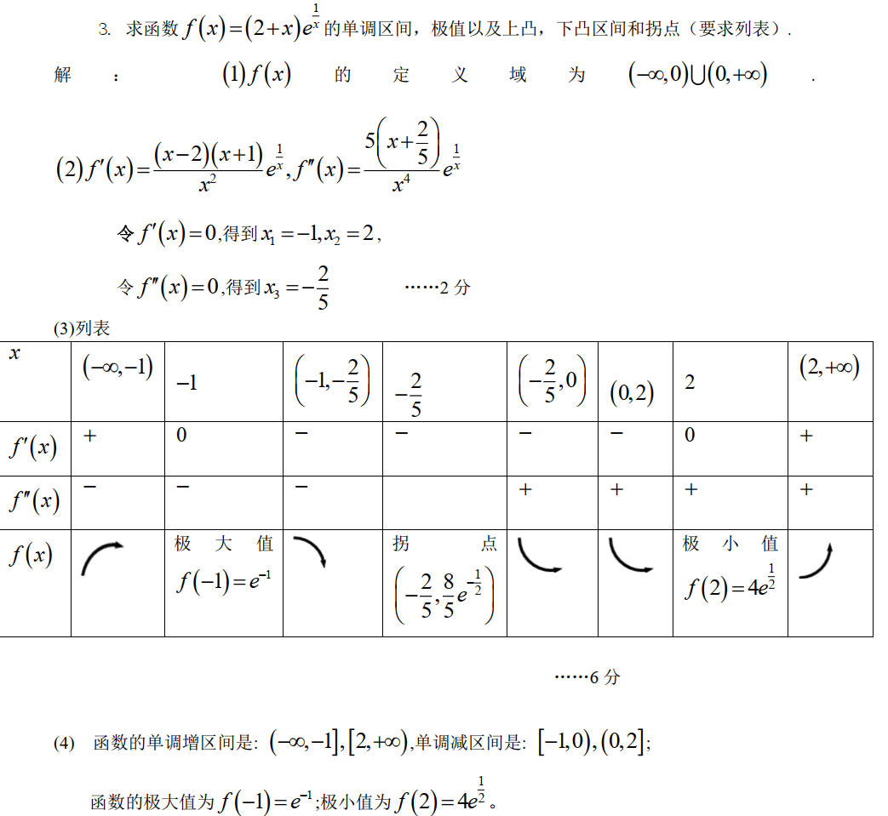

<!-- slide: 21 -->

- 一元函数微分学
- 一般步骤：列关系式-求导-求极值点-“又 根 据 实 际 意 义 ， 所 求 的 最 值 存 在 ”
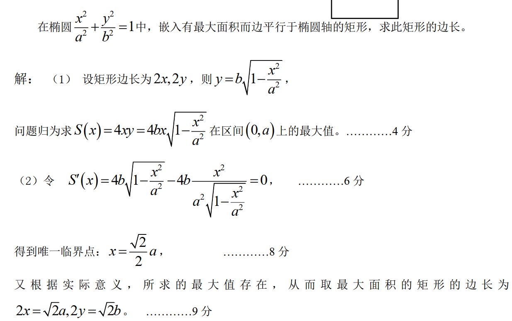

<!-- slide: 22 -->

## 三

- 真题感悟

<!-- slide: 23 -->

- 集合与函数
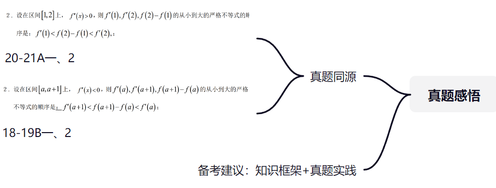
