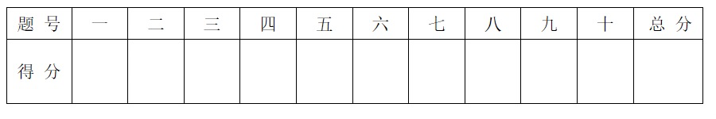

# 2021工科数学分析试卷A答案

<!-- page: 1 -->

… …… …… …… …… …… …… …… … …密…… …… …… …… …… …… …… …… …… 封… …… …… …… …… …… …… …… 线… …… …… …… …… …… … ……

姓名                学号
  学院                  专业班级                     座位号

诚信应考，考试作弊将带来严重后果！

华南理工大学本科生期末考试

2021-2022 第一学期《工科数学分析》A 卷

注意事项：1. 开考前请将密封线内各项信息填写清楚；
          2. 所有答案请直接答在试卷相应空白处；
          3．考试形式: 闭卷；

          4. 本试卷共十大题,满分100 分,考试时间120 分钟。

%√!#'

%

一）(10 分)用 " −\$ 定义证明 lim

(√!)' =

(.

得分

!→#\$

( 密 封 线 内 不 答 题 )

*→#\$ -. +
+

+

二）（10 分）计算极限 *+,

,0 *1 -2 +

*0 .

得分

《工科数学分析》试卷（A）第 1 页 共 8 页

<!-- page: 2 -->

三) (10 分)完成下面两题：
    (1). 令 3(5) = 789:715, 求 3(,.,+)(<).

得分

4
3
.

01

(2). 计算积分 ∫

2(1)3)(4)1)

《工科数学分析》试卷（A）第 2 页 共 8 页

<!-- page: 3 -->

四）(10 分)计算以下两题：

得分

(1). ∫
>+155?5;
6/,
.

(2). 设旋轮线的参数方程为

              A5 = B(C −>+1C),

D = B(2 −9E>C)        (B > <, C ∈[<, IJ]).

求旋轮线与 5 轴所围区域的面积。

《工科数学分析》试卷（A）第 3 页 共 8 页

<!-- page: 4 -->

五）(10 分)设 3(5) 在 (B, L) 上连续可微，且 3(B#) = *+,

1→3! 3(5) 与

得分

3(L)) = *+,
1→3" 3(5) 均存在，证明：存在 M ∈(B, L), 使得

 38(M) = 3(L)) −3(B#)

L −B
.

《工科数学分析》试卷（A）第 4 页 共 8 页

<!-- page: 5 -->

六）(12 分)设心脏线方程为 N = B(2 + 9E>O), 其中 N = P5, + D,, O =

得分

789:71
9

1 为极坐标。

     (1). 求心脏线上斜率为 2 的切线；
     (2). 求心脏线的全长。

《工科数学分析》试卷（A）第 5 页 共 8 页

<!-- page: 6 -->

∫;<#0;
\$
%
∫<#0;
\$
%

得分

七）(10 分)证明函数 Q(5) =

 在 (<, +∞) 内为单调增加的函数。

八）(10 分)证明 3(5) = 789:715 在 ℝ 上一致连续。

得分

《工科数学分析》试卷（A）第 6 页 共 8 页

<!-- page: 7 -->

九）(10 分)设 < < U < 2, B, L > <. 证明：

得分

(1). 3(5) = 5= 在 5 > < 时是凹函数；
(2). I=)+(B= + L=) ≤(B + L)= ≤B= + L=.

《工科数学分析》试卷（A）第 7 页 共 8 页

<!-- page: 8 -->

十）(8 分)已知

得分

              3(5) = WX) &

\$',   5 ≠<;
<,        5 = <.

试给出 3(5) 带皮亚诺余项的 . 阶麦克劳林展开。

《工科数学分析》试卷（A）第 8 页 共 8 页
