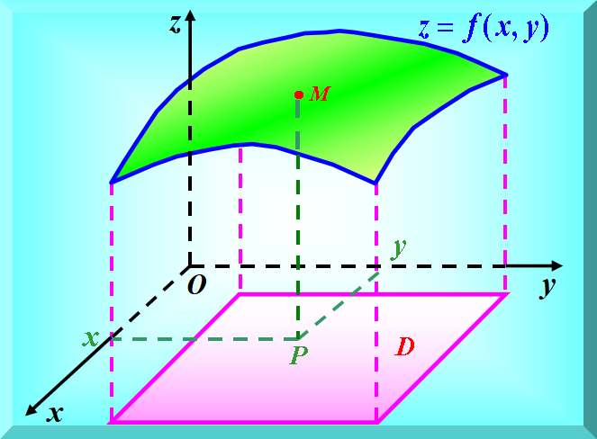
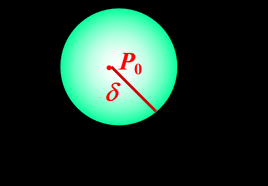
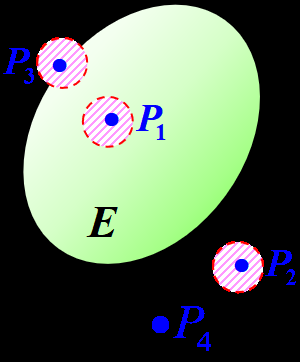
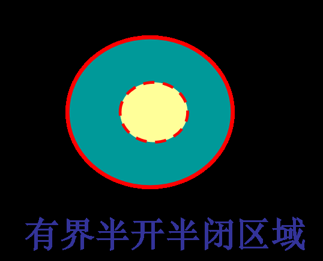

# 工科数分第1讲

<!-- page: 1 -->

工科数学分析下

李茂生

2024/2/29

李茂生
工科数学分析下–第1讲
2024/2/29
1 / 24

<!-- page: 2 -->

主讲老师联系方式

电话：13521759982

qq群：714567030 工程数学分析下2023计算机类

办公室：五山校区4号楼4225

email: lims21@scut.edu.cn

李茂生
工科数学分析下–第1讲
2024/2/29
2 / 24

<!-- page: 3 -->

期末总评与平时成绩

期末总评= 期末70%+平时成绩30%(作业10%，考勤5%，小测15%)

作业要求：

杜绝抄作业，若有发现，平时作业均作0分处理

要抄题，解答时要写“解”或“证明”

每周四上课前交前一周布置的作业

李茂生
工科数学分析下–第1讲
2024/2/29
3 / 24

<!-- page: 4 -->

教材与推荐的习题辅导书

1 李大华林益汤燕斌王德荣编, 工科数学分析下册第三版

2 吉米多维奇著数学分析习题集高等教育出版社（1986）

3 华苏扈志明莫骄编，微积分学习指导——典型例题精解. 科学出
版社（2004）

4 方企勤林渠源著，数学分析习题课教材北京大学出版社（1990）

李茂生
工科数学分析下–第1讲
2024/2/29
4 / 24

<!-- page: 5 -->

本学期的主要内容

1 微分方程(第五章)

2 多元函数微分学(第七章)

3 重积分(第八章)

4 曲线积分与曲面积分(第九章)

5 无穷级数(第十章)

本课程将按照第七、八、九、十、五章这个顺序讲

李茂生
工科数学分析下–第1讲
2024/2/29
5 / 24

<!-- page: 6 -->

第七章多元函数微分学

李茂生
工科数学分析下–第1讲
2024/2/29
6 / 24

<!-- page: 7 -->

7.1 n维欧氏空间中某些概念

n维欧氏空间

邻域

内点，外点，边界点，聚点

开集，闭集，区域

李茂生
工科数学分析下–第1讲
2024/2/29
7 / 24

<!-- page: 8 -->

n维欧氏空间

一维空间R：数轴点集

二维空间R2：平面点集

n 维空间Rn: n元有序数组(x1, x2, · · · , xn) 的全体，记为Rn，即

Rn = {(x1, x2, · · · , xn)|xj 2 R, 1 i n}.

对于X = (x1, x2, · · · , xn) 2 Rn, 定义

v
u
u
t

n
X

x2

||X|| =

i

i=1

称为X的范数.

李茂生
工科数学分析下–第1讲
2024/2/29
8 / 24

<!-- page: 9 -->

n维欧氏空间

8X = (x1, · · · , xn), Y = (y1, · · · , yn) 2 Rn, 定义

v
u
u
t

n
X

(xi −yi)2,

d(X, Y ) = ||X −Y || =

i=1

称为X, Y 的距离.

距离的基本性质：

正定性：8X, Y 2 Rn, d(X, Y ) ≥0, 并且d(X, Y ) = 0 当且仅当
X = Y .

对称性：8X, Y 2 Rn, 均有d(X, Y ) = d(Y , X).

三角不等式: 8X, Y , Z 2 Rn, 均有

d(X, Z) d(X, Y ) + d(Y , Z).

我们称(Rn, d) 为n维欧氏空间.

李茂生
工科数学分析下–第1讲
2024/2/29
9 / 24

<!-- page: 10 -->

邻域

一维空间中点P0 = x0的δ-邻域：(x0 −δ, x0 + δ)

二维空间中点P0 = (x0, y0)的δ-邻域：

q

U(P0, δ) = {(x, y) 2 R2|

(x −x0)2 + (y −y0)2 < δ}.

n维欧氏空间中点P0 2 Rn的δ-邻域：

U(P0, δ) = {P 2 Rn|d(P, P0) < δ}.

此外，我们把˚
U(P0, δ) := {P 2 Rn|0 < d(P, P0) < δ} 称为P0的去
心δ-邻域.

李茂生
工科数学分析下–第1讲
2024/2/29
10 / 24

<!-- page: 11 -->

内点，外点

固定E ✓R2，P0 2 R2,

内点：若9δ > 0, 使得U(P0, δ) ✓E, 则称点P0为E的一个内点. E的
所有内点的集合称为E的内部，记为E ◦.

外点：若9δ > 0, 使得U(P0, δ) \ E = ;, 则称点P0为E的一个外点.
E的所有外点的集合称为E的外部，记为Ext(E).

李茂生
工科数学分析下–第1讲
2024/2/29
11 / 24

<!-- page: 12 -->

边界点，聚点

固定E ✓R2，P0 2 R2,

边界点：若P0既不是E的内点也不是E的外点，则称其为E的一个边
界点. 等价地，P0为E的边界点当且仅当8δ > 0, U(P0, δ) \ E 6= ;,
U(P0, δ) \ (R2 \ E) 6= ;. E的边界点全体的集合称为E的边界，记
为@E.

聚点：若8δ > 0, 总有˚
U(P0, δ) \ E 6= ;, 则称点P0为E的一个聚点，
也称为极限点. E 的所有聚点的集合称为E的导集，记为E 0.

李茂生
工科数学分析下–第1讲
2024/2/29
12 / 24

<!-- page: 13 -->

例

求集合

E = {(x, y)|1 x2 + y2 < 2} [ {(6, 6)}

的所有内点、外点、边界点和聚点的集合，即E ◦, Ext(E), @E, E 0.

解：

E ◦= {(x, y)|1 < x2 + y2 < 2},

Ext(E) = {(x, y)|x2 + y2 < 1} [ {(x, y)|x2 + y2 > 2, (x, y) 6= (6, 6)},

@E = {(x, y)|x2 + y2 = 1} [ {(x, y)|x2 + y2 = 2} [ {(6, 6)},

E 0 = {(x, y)|1 x2 + y2 2}.

李茂生
工科数学分析下–第1讲
2024/2/29
13 / 24

<!-- page: 14 -->

开集，闭集

固定E ✓R2

开集：若E 中的所有点都是内点，则称E为开集.

闭集：若E 的余集为开集，则称E为闭集.

例

判断下列哪些是开集，哪些是闭集？

(1) E1 = {(x, y)|1 < x2 + y2 4}

(2) E2 = {(x, y)|x2 + y2 1} [ {(0, 2)}

(3) E3 = {(x, y)|x 6= 0, y 6= 0}

解：E1 既不是开集也不是闭集，E2为闭集，E3 为开集.

李茂生
工科数学分析下–第1讲
2024/2/29
14 / 24

<!-- page: 15 -->

连通性、开区域、闭区域

固定E ✓R2

称E为连通集，若E中任意两点都存在E中的折线将该两点连起来.
若E不是连通集，则称其为非连通集.

连通集的开集称为开区域; 开区域连同其边界,称为闭区域

例

(1) E1 = {(x, y)|1 < x2 + y2 < 4}, E2 = {(x, y)|x + y > 0}

(2) E3 = {(x, y)|1 x2 + y2 4}, E4 = {(x, y)|x + y ≥0}

李茂生
工科数学分析下–第1讲
2024/2/29
15 / 24

<!-- page: 16 -->

有界区域、无界区域

1 一个区域如果总可以被包围在一个以原点为中心、半径适当大的圆
内的区域，则称其为有界区域.

2 否则称为无界区域(可伸展到无限远处的区域).

注：也可以类似考虑有界集. 有界闭区域、有界闭集类似于一维情形的
有界闭区间、有界闭集, 在后面考虑多元连续函数的介值性和有界性有
很好的作用.

李茂生
工科数学分析下–第1讲
2024/2/29
16 / 24

<!-- page: 17 -->

李茂生
工科数学分析下–第1讲
2024/2/29
17 / 24

<!-- page: 18 -->

Rn中点列的收敛性

回顾：设{xk} 为R中的数列，x 2 R. 我们称{xk}收敛于x，如果8✏> 0,
9N 2 N 使得8k ≥N 都有|xk −x| < ✏.

定义(Rn中点列的收敛)

设{Xk} 为Rn中的点列，X 2 Rn. 我们称{Xk}收敛于X，如果8✏> 0,
9N 2 N 使得8k ≥N 都有||Xk −X|| < ✏. 我们记

lim
k!1 Xk = X.

定理(Rn中点列的收敛充要条件)

设{Xk = (x(1)

k , · · · , x(n)

k )} 为Rn中的点列，X = (x(1), · · · , x(n)) 2 Rn, 则
lim
k!1 Xk = X 当且仅当81 j n, 均有lim

k!1 x(j)

k
= x(j).

李茂生
工科数学分析下–第1讲
2024/2/29
18 / 24

<!-- page: 19 -->

k!1 Xk = X的定义得，8✏> 0, 9N 2 N 使得

证明：(必要性). 由lim

8k ≥N 都有||Xk −X|| < ✏. 另外，我们有

v
u
u
t

n
X

|x(j)

(x(i)

k
−x(i))2 = ||Xk −X||.

k
−x(j)| 

i=1

因而，|x(j)

k!1 x(j)

k
= x(j).

k
−x(j)| ||Xk −X|| < ✏. 即lim

k!1 x(j)

k
= x(j), 8✏> 0, 9Nj 2 N, 使得

(充分性). 若81 j n, 均有lim

8k ≥Nj 都有|x(j)
k
−x(j)| <
✏
pn. 取N := maxj{Nj}, 则8k ≥N均有

v
u
u
t

v
u
u
t

n
X

n
X

( ✏
pn)2 = ✏.

|X (j)

(x(i)

k
−x(i))2 <

k
−X (j)| 

i=1

i=1

因此, lim

k!1 Xk = X.

李茂生
工科数学分析下–第1讲
2024/2/29
19 / 24

<!-- page: 20 -->

7.2 多元函数的基本概念

二元函数多元函数

等高线与等位面

多元函数的极限

多元函数的连续性

李茂生
工科数学分析下–第1讲
2024/2/29
20 / 24

<!-- page: 21 -->

二元函数多元函数

回顾函数的定义：给定D ✓R,若存在对应法则f 使得8x 2 D 都存在唯
一一个实数y 与之对应，我们就称f 为定义在D的函数, 记为y = f (x),
x 2 D. D 称为该函数的定义域.

定义(n元函数)

设D ✓Rn,若存在对应法则f 使得8X 2 D 都存在唯一一个实数z与之对
应，我们就称f 为定义在D的n元函数, 记为z = f (X), X 2 D. D 称为该
函数的定义域.

李茂生
工科数学分析下–第1讲
2024/2/29
21 / 24

<!-- page: 22 -->

例

f : 长方形(长为a,宽为b) ! 面积A,可以看作是二元函数：
A = f (a, b) = ab.
g : 长方体(长为a,宽为b，高为c) ! 表面积S,可以看作是三元函数：
S = g(a, b, c) = 2(ab + bc + ca).

例

理想气体的状态方程是pV = RT (R为常数)，其中p为压强，V 为体积，
T为温度. 如温度T, 体积V 都在变化,则压强p依赖于V , T的关系为

p = RT

V

可看成是(0, +1) ⇥(0, +1)上的二元函数.

李茂生
工科数学分析下–第1讲
2024/2/29
22 / 24

<!-- page: 23 -->

关于n元函数的定义域

通常一个n函数的定义域D是会直接给定或按以下形式约定：

1 实际问题中的函数: 定义域为符合实际意义的自变量取值的全体.

2 纯数学问题的函数表达式: 定义域为使运算有意义的自变量取值的
全体.

李茂生
工科数学分析下–第1讲
2024/2/29
23 / 24

<!-- page: 24 -->

谢谢大家!

李茂生
工科数学分析下–第1讲
2024/2/29
24 / 24
