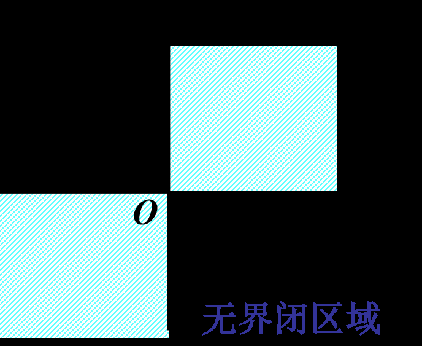
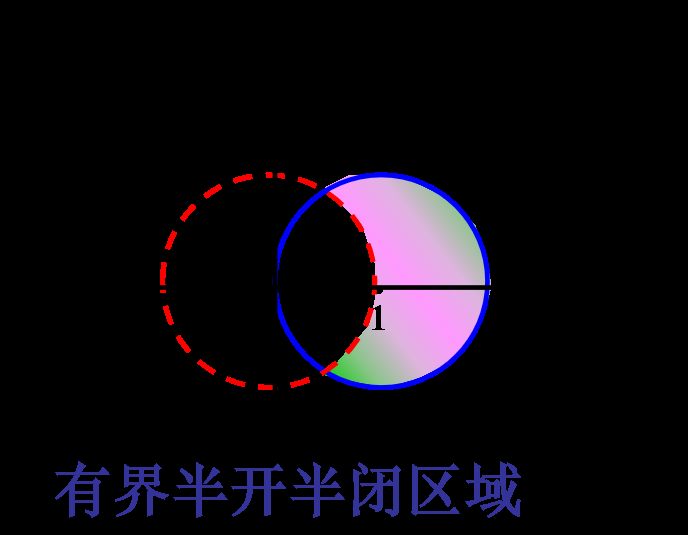
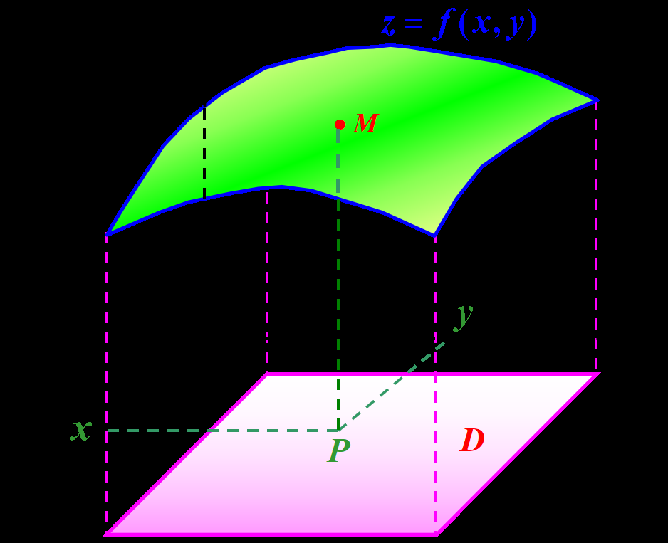
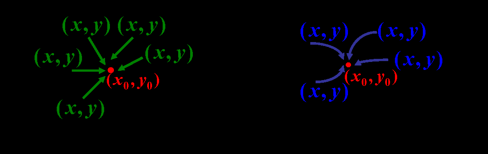
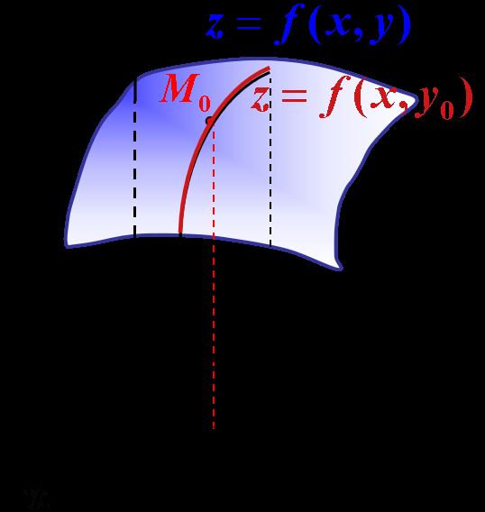
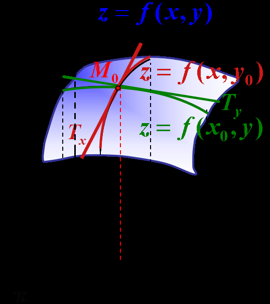

# 工科数分第2讲

<!-- page: 1 -->

工科数学分析下

李茂生

2024/3/1

李茂生
工科数学分析下–第2讲
2024/3/1
1 / 30

<!-- page: 2 -->

二元函数多元函数

回顾函数的定义：给定D ✓R,若存在对应法则f 使得8x 2 D 都存在唯
一一个实数y 与之对应，我们就称f 为定义在D的函数, 记为y = f (x),
x 2 D. D 称为该函数的定义域.

定义(n元函数)

设D ✓Rn,若存在对应法则f 使得8X 2 D 都存在唯一一个实数z与之对
应，我们就称f 为定义在D的n元函数, 记为z = f (X), X 2 D. D 称为该
函数的定义域.

李茂生
工科数学分析下–第2讲
2024/3/1
2 / 30

<!-- page: 3 -->

例

f : 长方形(长为a,宽为b) ! 面积A,可以看作是二元函数：
A = f (a, b) = ab.
g : 长方体(长为a,宽为b，高为c) ! 表面积S,可以看作是三元函数：
S = g(a, b, c) = 2(ab + bc + ca).

例

理想气体的状态方程是pV = RT (R为常数)，其中p为压强，V 为体积，
T为温度. 如温度T, 体积V 都在变化,则压强p依赖于V , T的关系为

p = RT

V

可看成是(0, +1) ⇥(0, +1)上的二元函数.

李茂生
工科数学分析下–第2讲
2024/3/1
3 / 30

<!-- page: 4 -->

关于n元函数的定义域

通常一个n函数的定义域D是会直接给定或按以下形式约定：

1 实际问题中的函数: 定义域为符合实际意义的自变量取值的全体.

2 纯数学问题的函数表达式: 定义域为使运算有意义的自变量取值的
全体.

李茂生
工科数学分析下–第2讲
2024/3/1
4 / 30

<!-- page: 5 -->

例

p

求下列函数的定义域：(1). z = pxy, (2). z =

2x−x2−y2
p

x2+y2−1 .

解：(1). 定义域为满足xy ≥0 的数对(x, y). 即

{(x, y)|x, y ≥0} [ {(x, y)|x, y 0}.

(2). 定义域为{(x, y)|(x −1)2 + y2 1} \ {(x, y)|x2 + y2 > 1}.

李茂生
工科数学分析下–第2讲
2024/3/1
5 / 30

<!-- page: 6 -->

二元函数的几何意义

二元函数的图形通常是一张曲面.
如，由空间解析几何知, 函数
z =

p

R2 −x2 −y2 的图形是以原点为中心, R为半径的上半球面.

对于二元函数，我们可以定义等高线：{(x, y) 2 D|z = f (x, y) = c}. 即
高度为c的所有点的集合. 类似地，对于三元函数可以定义等位面.

最后指出,从一元函数到二元函数,在内容和方法上都会出现一些实质性
的差别,而多元函数之间差异不大. 因此研究多元函数时,将以二元函
数为主.

李茂生
工科数学分析下–第2讲
2024/3/1
6 / 30

<!-- page: 7 -->

多元函数的极限

回顾一元函数的极限定义：设D ✓R, f : D ! R为定义在D上的函数，
x0 为D的极限点. 若存在a 2 R有8✏> 0, 9δ > 0 使得任意满
足0 < |x −x0| < δ, x 2 D 的x均有|f (x) −a| < ✏. 则称当x在D内趋
于x0时，f (x)的极限为a. 记为

lim
D3x!x0 f (x) = a.

定义(n元函数的极限✏-δ)

设D ✓Rn, f : D ! R为定义在D上的函数，X0 为D的极限点. 若存
在a 2 R有8✏> 0, 9δ > 0 使得任意满足0 < ||X −X0|| < δ, X 2 D 的X均
有|f (X) −a| < ✏. 则称当X在D内趋于X0时，f (X)的极限为a. 记为

lim
D3X!X0 f (X) = a.

通常X0为D的内点时，我们简记为
lim
X!X0 f (X) = a.

李茂生
工科数学分析下–第2讲
2024/3/1
7 / 30

<!-- page: 8 -->

多元函数极限与一元函数极限的异同之处

相同之处：极限的唯一性、保号性、四则运算法则等通常极限的性质；

不同之处：主要表现在X趋于X0时的路径和方向的多样性. 如下图

我们把二元函数的极限
lim
(x,y)!(x0,y0) f (x, y), 称作二重极限，通常也记

为lim
x!x0
y!y0

f (x, y).

李茂生
工科数学分析下–第2讲
2024/3/1
8 / 30

<!-- page: 9 -->

例

(x2 + y2) sin
1
x2 + y2 = 0.

证明：lim

x!0
y!0

证明：因为

|(x2 + y2) sin
1
x2 + y2 −0| |x2 + y2|,

p

所以8✏> 0, 令δ = p✏, 则当0 <

(x −0)2 + (y −0)2 < δ时，均有

|(x2 + y2) sin
1
x2 + y2 −0| x2 + y2 < δ2 = ✏.

李茂生
工科数学分析下–第2讲
2024/3/1
9 / 30

<!-- page: 10 -->

例

sin(x2 + y2)

计算极限：lim

x2 + y2
.

x!0
y!0

sin(x2 + y2)

sin ⇢

⇢=x2+y2

⇢
= 1.

解：lim

=
lim
⇢!0+

x2 + y2

x!0
y!0

例

xy
p

计算极限：lim

x2 + y2 .

x!0
y!0

解：由基本不等式xy x2+y2

2
, 得8(x, y) 2 R2 \ {(0, 0)} 都有

p

0 |
xy
p

x2 + y2.

x2 + y2 −0| 

xy
p

x2 + y2 = 0.

由夹逼原理可得，lim

x!0
y!0

李茂生
工科数学分析下–第2讲
2024/3/1
10 / 30

<!-- page: 11 -->

论证多元函数极限不存在的常用方法

回顾一元情形：极限存在的充要条件是左右极限存在且相等.其中任意
一个不存在或者两极限存在但不等时均可以说明函数的极限不存在. 关
键是计算

0
f (x), 和
lim
x!x+

lim
x!x−

0
f (x).

类似地，多元函数的极限lim

X!X0 f (X)存在的充要条件是X以任何路径趋

于X0时极限存在并相等. 因而，只用找出某种路径对应的极限不存在或
者某两条路径对应的极限不相等即可说明该多元函数在该点的极限是不
存在的.

李茂生
工科数学分析下–第2讲
2024/3/1
11 / 30

<!-- page: 12 -->

例

设函数

(
xy
x2+y2 ,
(x, y) 6= (0, 0)

f (x, y) =

0,
(x, y) = (0, 0),

f (x, y) 不存在.

证明：lim

x!0
y!0

证明：8(x, y) 6= (0, 0) 且y = kx, 有

xy
x2 + y2 =
kx2

x2 + k2x2 =
k
1 + k2 .

f (x, y) =
k
1 + k2 . 由此可知，所求极限不存在.

因此，lim

x!0
y=kx

李茂生
工科数学分析下–第2讲
2024/3/1
12 / 30

<!-- page: 13 -->

例

设函数

( x2y

x4+y2 ,
(x, y) 6= (0, 0)

f (x, y) =

0,
(x, y) = (0, 0),

f (x, y) ?

lim
x!0
y!0

kx3

x4 + k2x2 = 0. 但是

解：lim

f (x, y) = lim

x!0

x!0
y=kx

kx4

x4 + k2x4 =
k
1 + k2 .

lim
x!0
y=kx2

f (x, y) = lim

x!0

同样地，我们得到所求极限不存在.

李茂生
工科数学分析下–第2讲
2024/3/1
13 / 30

<!-- page: 14 -->

多元函数的连续性

定义(n元函数连续性)

设D ✓Rn, f : D ! R为定义在D上的函数，X0 为D的极限点且X0 2 D.
若有

lim
D3X!X0 f (X) = f (X0),

则称f 在点X0处连续.

本质上就是f 在点X0处极限存在并且极限刚好等于函数在该点的函数值.
用✏-δ语言：f 在点X0处连续当且仅当8✏> 0, 9δ > 0 使得8X 2 D 当
||X −X0|| < δ 时就有|f (X) −f (X0)| < δ.

若函数f 在X0处不连续，则称X0为函数f 的间断点.

李茂生
工科数学分析下–第2讲
2024/3/1
14 / 30

<!-- page: 15 -->

例

设函数

( x2y

x4+y2 ,
(x, y) 6= (0, 0)

f (x, y) =

0,
(x, y) = (0, 0),

(0, 0)是函数f (x, y)的间断点.

例

函数

f (x, y) = sin
1
1 −x2 −y2

在单位圆x2 + y2 = 1处处是间断点.

李茂生
工科数学分析下–第2讲
2024/3/1
15 / 30

<!-- page: 16 -->

多元连续函数的性质

同一元函数一样,连续的多元函数的和、差积、商（分母不为零）及
复合仍是连续的.

每个自变量的基本初等函数经有限次四则运算和有限次复合,由一
个式子表达的函数称为多元初等函数,在它们的定义域的内点处均
连续.

例

ex sin y

计算lim

1 + x2 + y3 .

x!0
y!0

解：该函数是二元初等函数且(0, 0)是定义域的内点，因而

1 + x2 + y3 =
e0 sin 0

ex sin y

1 + 02 + 03 = 1.

lim
x!0
y!0

李茂生
工科数学分析下–第2讲
2024/3/1
16 / 30

<!-- page: 17 -->

多元函数的极限的基本问题有三类

1 研究多元函数极限的存在性.

I 欲证明极限存在, 常用定义或夹逼定理.

I 欲证明极限不存在, 常选择两条不同路径,求出不同的极限值.

2 求极限值. 常按一元函数极限的求法求之.

例

sin(x2y)

计算lim

x2 + y2 .

x!0
y!0

解：8(x, y) 6= 0, 有sin(x2y)

x2+y2 = sin(x2y)

x2y
x2+y2 及| x2y

x2+y2 | < |y|. 因而，

x2y

sin(x2y)

sin(x2y)

x2y
x2 + y2 = 1 ⇥0 = 0.

lim
x!0
y!0

x2 + y2 = lim

x2y
lim
x!0
y!0

x!0
y!0

李茂生
工科数学分析下–第2讲
2024/3/1
17 / 30

<!-- page: 18 -->

例

xy
2 −p4 −xy .

求极限lim

x!0
y!0

解：8(x, y) 6= (0, 0) 但属于上述函数定义域的点(x, y)均有

xy
2 −p4 −xy = xy(2 + p4 −xy)
4 −(4 −xy)
= 2 +

p

4 −xy.

2 +
p

xy
2 −p4 −xy = lim
x!0
y!0

因此,lim

4 −xy = 4.

x!0
y!0

例

设函数

( sin xy(x+y)

x2+y2
,
(x, y) 6= (0, 0)

f (x, y) =

0,
(x, y) = (0, 0),

证明:函数f (x, y)在xOy平面上的都连续.

李茂生
工科数学分析下–第2讲
2024/3/1
18 / 30

<!-- page: 19 -->

有界闭区域上连续的多元函数的性质

定理(最值定理)

设D ✓Rn为有界闭集, 函数f 在D上连续，则f 在D上有最大值和最小值.

定理(介值定理)

在有界闭区域D上的多元连续函数f , 如果在D上取得两个不同的函数值,
则f 在D上取得介于这两值之间的任何值至少一次．

定理(一致连续性定理)

若多元函数f 在有界闭区域D上的连续, 则f 在D上一致连续. 即8✏> 0,
9δ > 0使得8X1, X2 2 D, 当||X1 −X2|| < δ时就有|f (X1) −f (X2)| < ✏.

李茂生
工科数学分析下–第2讲
2024/3/1
19 / 30

<!-- page: 20 -->

7.3 偏导数与全微分

偏导数

全微分

连续性与可微性

偏导数与可微性

李茂生
工科数学分析下–第2讲
2024/3/1
20 / 30

<!-- page: 21 -->

偏导数

定义(偏导数)

设二元函数z = f (x, y)定义在开区域D上，点(x0, y0) 2 D, 把y固定
为y0得到一元函数z = f (x, y0). 我们把该一元函数在点x0处的导数称为
二元函数f (x, y)在点(x0, y0)关于x的偏导数，记作

## x=x0

### x=x0

fx(x0, y0) 或@f

@x (x0, y0) 或@f

或zx(x0, y0) 或@z

@x (x0, y0) 或@z

.

@x

@x

y=y0

y=y0

等价地，

f (x0 + ∆x, y0) −f (x0, y0)

@f
@x (x0, y0) = lim

∆x
.

∆x!0

类似地，我们也可以考虑对y的偏导数.

李茂生
工科数学分析下–第2讲
2024/3/1
21 / 30

<!-- page: 22 -->

偏导数

定义(偏导数)

设X0 = (x(0)

1 , · · · , x(0)
n ) 2 Rn，f 在X0的一个邻域上有定义. 固
定1 i n, 若

f (x(0)

1 , · · · , x(0)
i−1, x(0)

i
+ h, x(0)

i+1, · · · x(0)

n ) −f (X0)
h

lim
h!0

存在，则称f 在X0处关于第i的分量的偏导存在, 把该值记为
@f
@xi (X0). 通
常也会将其记为f 0

xi(X0) 或fxi(X0)

本质上，f 关于第i的分量的偏导数是把除第i个分量以外的量均看作常
数, 而把f 仅看作是关于第i个分量的单变量函数来求导.

李茂生
工科数学分析下–第2讲
2024/3/1
22 / 30

<!-- page: 23 -->

例

设f (x, y) =
y2
x+1, 求该函数在(3, 2)点的偏导数.

例

求函数f (x, y, z) = (z −axy) sin ln x2 在点(1, 0, 2)处的偏导数.

解：fx(1, 0, 2) = [sin ln x2]0|x=1 = 2

x cos ln x2|x=1 = 2,

fy(1, 0, 2) = 00|y=0 = 0, fz(1, 0, 2) = 00|z=0 = 0.

求某一点的偏导数时,将其它变量的值代入,变为一元函数,求导,常常较简
单.

例

设函数

(

y ln(x2 + y2),
(x, y) 6= (0, 0)
0,
(x, y) = (0, 0),

f (x, y) =

求f (x, y)在原点的偏导数.

李茂生
工科数学分析下–第2讲
2024/3/1
23 / 30

<!-- page: 24 -->

例

已知理想气体的状态方程：pV = RT, 其中p为压强，V 为体积，T为温
度，R为常数. 证明：

@p
@V

@V
@T

@T

@p = −1.

证明：

V
得@p

由p = RT

@V = −RT

V 2 .

由V = RT

p
得@V

@T = R

p .

由T = pV

R 得@T

@p = V

R . 因而，

@p
@V

@V
@T

@T

@p = −RT

R

V

R = −RT

pV = −1.

V 2

p

偏导数的记号只是一个整体记号,不能像一元函数的导数那样可看成是
分子与分母的微分的商.

李茂生
工科数学分析下–第2讲
2024/3/1
24 / 30

<!-- page: 25 -->

偏导数的几何意义

二元函数z = f (x, y)的偏导数@f

@x (x0, y0)和@f

@y (x0, y0)实际表示的是平面曲
线
(

(

z = f (x, y)
y = y0

z = f (x, y)
x = x0

,

分别在x = x0和y = y0处切线的斜率.

李茂生
工科数学分析下–第2讲
2024/3/1
25 / 30

<!-- page: 26 -->

例(不连续但偏导存在的例子)

设函数

(
xy
x2+y2 ,
(x, y) 6= (0, 0)

f (x, y) =

0,
(x, y) = (0, 0),

求f (x, y)的偏导数.

解：当(x, y) 6= (0, 0)时，

fx(x, y)
=
y(x2+y2)−xy·2x

(x2+y2)2
=
y(y2−x2)

(x2+y2)2 ,

fy(x, y)
=
x(x2+y2)−xy·2y

(x2+y2)2
=
x(x2−y2)

(x2+y2)2 .

当(x, y) = (0, 0)时,由定义得

f (x, 0) −f (0, 0)

0
x = 0,

fx(0, 0)
=
lim
x!0

x
=
lim
x!0

f (0, y) −f (0, 0)

0
y = 0.

fy(0, 0)
=
lim
y!0

y
=
lim
y!0

李茂生
工科数学分析下–第2讲
2024/3/1
26 / 30

<!-- page: 27 -->

偏导数存在与连续的关系

一元函数中在某点导数存在) 连续

多元函数中在某点偏导数存在6) 连续

因偏导数fx(x0, y0)仅与函数f (x, y)在y = y0上的值有关,偏导数
fy(x0, y0)仅与函数f (x, y)在x = x0上的值有关,而与(x0, y0)邻域内其他点
上的函数值无关,所以偏导数存在不能保证函数有极限.

偏导数都存在,函数未必有极限,更保证不了连续性.另一方面, 连续当然
保证不了偏导的存在.

李茂生
工科数学分析下–第2讲
2024/3/1
27 / 30

<!-- page: 28 -->

例

计算

x+y+1
x+y−1 ,
(2). lim

(x + y) ln(x2 + y2).

(1). lim

(x + y)

x!0
y!1

x!0
y!0

x+y+1
x+y−1 u=x+y−1
=
lim
u!0(1 + u)

u+2

u
= e2.

解：(1). lim

(x + y)

x!0
y!1

x=r cos ✓

(x + y) ln(x2 + y2)

y=r sin ✓
=
lim
r!0+(cos ✓+ sin ✓)r ln r2 = 0.

(2). lim

x!0
y!0

例(思考题)

定义函数

( ln(1+xy)

x
,
x 6= 0,
y,
x = 0.

f (x, y) =

证明: 函数f 在定义域上连续.

李茂生
工科数学分析下–第2讲
2024/3/1
28 / 30

<!-- page: 29 -->

作业

习题7.2: (A) 6,7; (B) 4

习题7.3: (A) 2 奇数题，3.(1),(2).

李茂生
工科数学分析下–第2讲
2024/3/1
29 / 30

<!-- page: 30 -->

谢谢大家!

李茂生
工科数学分析下–第2讲
2024/3/1
30 / 30
