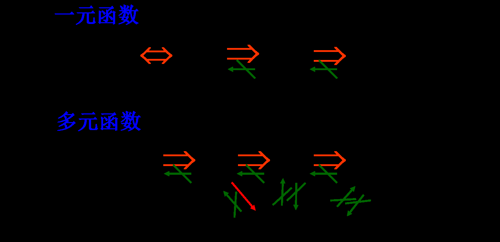

# 工科数分第3讲

<!-- page: 1 -->

工科数学分析下

李茂生

2024/3/4

李茂生
工科数学分析下–第3讲
2024/3/4
1 / 31

<!-- page: 2 -->

全微分

偏导数讨论的只是某一自变量变化时函数的变化率.

现在来讨论当各个自变量同时变化时函数的变化情况.

李茂生
工科数学分析下–第3讲
2024/3/4
2 / 31

<!-- page: 3 -->

全增量

为了引进全微分的定义,先来介绍全增量的概念.

定义(全增量)

设二元函数z = f (x, y)在点P(x, y)的某邻域内有定义，当变量x, y在
点(x, y)处分别有增量∆x, ∆y时，函数值对应的增量

∆z = f (x + ∆x, y + ∆y) −f (x, y)

称为f (x, y)在点(x, y)的全增量.

李茂生
工科数学分析下–第3讲
2024/3/4
3 / 31

<!-- page: 4 -->

全微分

定义(全微分)

设二元函数z = f (x, y)在点P(x, y)的某邻域内有定义，若z = f (x, y)在
点(x, y) 的全增量∆z = f (x + ∆x, y + ∆y) −f (x, y)可以表示为

∆z = A∆x + B∆y + o(⇢)

的形式时(其中A, B仅与x, y有关，而不依赖于∆x, ∆y的选取,
⇢=

p

∆x2 + ∆y2),则称函数f (x, y)在点(x, y)可微分，A∆x + B∆y称作
是f (x, y)的全微分. 记作dz, 即

dz = A∆x + B∆y.

李茂生
工科数学分析下–第3讲
2024/3/4
4 / 31

<!-- page: 5 -->

全微分

全微分有类似一元函数微分的两个性质:

dz是关于∆x, ∆y的线性函数;

∆z −dz 是比⇢更高阶的无穷小量.

若函数f (x, y)在(x0, y0)点可微，则

f (x, y) ⇡f (x0, y0) + A(x −x0) + B(y −y0).

即,二元函数f (x, y)在(x0, y0)点附近可局部线性化.

可微时，如何求解A, B？注意到一元情形可微和导数存在是等价的, 那
么我们自然要问多元情形可微和偏导存在有什么关系呢?

李茂生
工科数学分析下–第3讲
2024/3/4
5 / 31

<!-- page: 6 -->

连续性与可微性

定理(可微)连续)

若z = f (x, y)在点(x0, y0)处可微, 则f (x, y)在(x0, y0)处也连续.

证明：由题设知，9A, B 使得

f (x, y) −f (x0, y0) = A(x −x0) + B(y −y0) + o(⇢),

p

(x −x0)2 + (y −y0)2.于是，

其中⇢=

⇢!0+[A(x −x0) + B(y −y0) + o(⇢)] = 0.

(f (x, y) −f (x0, y0)) = lim

lim
x!x0
y!y0

故lim
x!x0
y!y0

f (x, y) = f (x0, y0).

不连续的函数一定不是可微的.

李茂生
工科数学分析下–第3讲
2024/3/4
6 / 31

<!-- page: 7 -->

偏导数与可微性

定理(可微)偏导存在)

若z = f (x, y)在点(x0, y0)处可微, 不妨设dz = A∆x + B∆y,
则f (x, y)在(x0, y0)处的两个偏导数都存在且有

A = fx(x0, y0), B = fy(x0, y0).

证明：由题设知，9A, B 使得

f (x, y) −f (x0, y0) = A(x −x0) + B(y −y0) + o(⇢),

p

(x −x0)2 + (y −y0)2. 特别地，若y = y0,则有

其中⇢=

f (x, y0) −f (x0, y0) = A(x −x0) + o(|x −x0|).

f (x, y0) −f (x0, y0)

A(x −x0) + o(|x −x0|)

因而，lim

= lim

= A.

x −x0

x −x0

x!x0

x!x0

即fx(x0, y0)存在且等于A. 同理可得，fy(x0, y0)存在且等于B.

李茂生
工科数学分析下–第3讲
2024/3/4
7 / 31

<!-- page: 8 -->

偏导数与可微性

设z = f (x, y)在(x0, y0)处两偏导数均存在，则f (x, y)在(x0, y0) 可微当且
仅当

∆z −fx(x0, y0)∆x −fy(x0, y0)∆y
p

∆x2 + ∆y2
= 0.

lim
∆x!0
∆y!0

判断函数z = f (x, y)在(x0, y0)处是否可微的一般思路:

1 判断f (x, y)在(x0, y0)处是否连续？若不连续则不可微.

2 判断f (x, y)在(x0, y0)处两偏导是否存在？若有不存在则不可微. 若
存在，继续利用偏导数的值计算上述极限是否存在并且等于0.

李茂生
工科数学分析下–第3讲
2024/3/4
8 / 31

<!-- page: 9 -->

偏导存在6)可微

例(偏导存在但不可微的例子)

设函数

8
<

xy
p

x2+y2 ,
(x, y) 6= (0, 0)

f (x, y) =

:

0,
(x, y) = (0, 0),

判断f (x, y)在(0, 0)处是否可微.

f (x, 0) −f (0, 0)

0
x = 0, lim

f (0, y) −f (0, 0)

0
y = 0.

解：lim

x
= lim

y
= lim

x!0

x!0

y!0

y!0

即fx(0, 0) = fy(0, 0) = 0. 8(∆x, ∆y) 6= (0, 0), 均有

f (∆x, ∆y) −f (0, 0) −fx(0, 0)∆x −fy(0, 0)∆y
p

∆x2 + ∆y2
=
∆x∆y
∆x2 + ∆y2 .

∆x∆y
∆x2 + ∆y2 不存在. 故f (x, y)在(0, 0)处不可微.

而lim

∆x!0
∆y!0

李茂生
工科数学分析下–第3讲
2024/3/4
9 / 31

<!-- page: 10 -->

可微的充分条件

定理(偏导连续)可微)

设函数z = f (x, y)在点(x0, y0)的邻域两偏导数均存在且该偏导数都在该
点连续,则函数在该点可微.

∆z −fx(x0, y0)∆x −fy(x0, y0)∆y
p

证明概要：我们需要证明lim

∆x2 + ∆y 2
= 0. 而

∆x!0
∆y!0

∆z
=
f (x0 + ∆x, y0 + ∆y) −f (x0, y0)

=
f (x0 + ∆x, y0 + ∆y) −f (x0, y0 + ∆y) + f (x0, y0 + ∆y) −f (x0, y0)

=
fx(x0 + ⇠∆x, y0 + ∆y)∆x + fy(x0, y0 + ✓∆y)∆y

∆z −fx(x0, y0)∆x −fy(x0, y0)∆y
p

0 ⇠, ✓1是均依赖于∆x, ∆y的量. lim
∆x!0
∆y!0

∆x2 + ∆y 2
=

[fx(x0 + ⇠∆x, y0 + ∆y) −fx(x0, y0)]∆x + [fy(x0, y0 + ✓∆y) −fy(x0, y0)]∆y
p

lim
∆x!0
∆y!0

∆x2 + ∆y 2

等于0.

李茂生
工科数学分析下–第3讲
2024/3/4
10 / 31

<!-- page: 11 -->

可微6) 偏导连续

例(可微但偏导不连续的例子)

设函数

(

(x2 + y2) sin
1
x2+y2 ,
(x, y) 6= (0, 0)

f (x, y) =

0,
(x, y) = (0, 0),

则f (x, y)在(0, 0)处存在偏导数且偏导数在该点不连续，但f (x, y)在该点
可微.

f (x, 0) −f (0, 0)

x!0 x sin 1

x2 = 0 得，fx(0, 0) = 0. 由函数

解：由lim

x
= lim

x!0

定义的对称性，类似可得fy(0, 0) = 0. 当(x, y) 6= (0, 0)时，有

fx(x, y) = 2x sin
1
x2+y2 −
2x
x2+y2 cos
1
x2+y2 ,

fy(x, y) = 2y sin
1
x2+y2 −
2y
x2+y2 cos
1
x2+y2 .

李茂生
工科数学分析下–第3讲
2024/3/4
11 / 31

<!-- page: 12 -->

fx(x, y) = 2x sin
1
x2+y2 −
2x
x2+y2 cos
1
x2+y2 ,

fy(x, y) = 2y sin
1
x2+y2 −
2y
x2+y2 cos
1
x2+y2 .

令y = x,易得fx(x, x) = 2x sin
1
2x2 −1
x cos
1
2x2 6! 0 (x ! 0).

故fx(x, y)在(0, 0)点不连续. 同样地，故fy(x, y)在(0, 0)点也不连续.

另外，8(∆x, ∆y) 6= (0, 0),

p

f (∆x, ∆y) −f (0, 0) −fx(0, 0)∆x −fy(0, 0)∆y
p

∆x2 + ∆y 2 sin
1
∆x2 + ∆y 2 .

∆x2 + ∆y 2
=

p

∆x2 + ∆y2 sin
1
∆x2 + ∆y2 = 0. 故f (x, y)在(0, 0)点可微.

而lim

∆x!0
∆y!0

李茂生
工科数学分析下–第3讲
2024/3/4
12 / 31

<!-- page: 13 -->

蕴含关系图示

李茂生
工科数学分析下–第3讲
2024/3/4
13 / 31

<!-- page: 14 -->

关于函数微分的记法

若z = f (x, y), 我们先前记f (x, y) 的微分为dz = A∆x + B∆y.

z = f (x, y) = x时，由@z

@x = 1, @z

@y = 0,得

dz = dx = ∆x.

z = f (x, y) = y时，由@z

@x = 0, @z

@y = 1,得

dz = dy = ∆y.

对于自变量来说，其增量与微分完全是一回事. 于是如果函数的微分存
在，我们就可以把它写成

dz = Adx + Bdy = @z

@x dx + @z

@y dy.

对于三元函数u = f (x, y, z)也类似：du = @u

@x dx + @u

@y dy + @u

@z dz.

李茂生
工科数学分析下–第3讲
2024/3/4
14 / 31

<!-- page: 15 -->

例

求函数z = x2 + 4xy2 + y4的全微分.

解：因偏导数

@z
@x = 2x + 4y2, @z

@y = 8xy + 4y2

在全平面连续，故该函数也在全平面可微. 并且有

dz = (2x + 4y2)dx + (8xy + 4y2)dy.

例

求函数u = 2x + cos y + eyz的全微分.

解：因偏导数为

@u
@x = 2, @u

@y = −sin y + zeyz, @u

@z = yeyz,

故有

du = 2dx + (zeyz −sin y)dy + yeyzdz.

李茂生
工科数学分析下–第3讲
2024/3/4
15 / 31

<!-- page: 16 -->

练习题

例

计算(1.03)1.98的近似值.

例

设函数

(
xy2
x2+y2 ,
(x, y) 6= (0, 0)

f (x, y) =

0,
(x, y) = (0, 0),

则该函数在(0, 0)点(
).

(A) 极限不存在

(B) 不连续

(C) 可微分

(D) 偏导存在

答案：D

李茂生
工科数学分析下–第3讲
2024/3/4
16 / 31

<!-- page: 17 -->

练习题

例

能推出函数f 在点(x0, y0)处可微且全微分df (x0, y0) = 0的条件是(
)

(A) fx(x0, y0) = fy(x0, y0) = 0;

(B) 函数f 在点(x0, y0)处的全增量∆f (x0, y0) =
∆x∆y
p

∆x2+∆y2 ;

(C) 函数f 在点(x0, y0)处的全增量∆f (x0, y0) = sin(∆x2+∆y2)
p

∆x2+∆y2 ;

(D) 函数f 在点(x0, y0)处的全增量∆f (x0, y0) = (∆x2 + ∆y 2) sin
1
∆x2+∆y 2 .

答案：D

李茂生
工科数学分析下–第3讲
2024/3/4
17 / 31

<!-- page: 18 -->

练习题

例

设函数

( x2y

x4+y2 ,
(x, y) 6= (0, 0)

f (x, y) =

0,
(x, y) = (0, 0),

该函数在(0, 0)点是否可微?

例

设函数

( x3−y3

x2+y2 ,
(x, y) 6= (0, 0)

f (x, y) =

0,
(x, y) = (0, 0),

该函数在(0, 0)点是否连续?是否可偏导？是否可微？

李茂生
工科数学分析下–第3讲
2024/3/4
18 / 31

<!-- page: 19 -->

练习题

例

8(x, y) 2 R2,定义函数

(

1−e−xy
x
,
x 6= 0,
y,
x = 0.

f (x, y) =

讨论函数f 的连续性、可微性及连续可偏导性.

李茂生
工科数学分析下–第3讲
2024/3/4
19 / 31

<!-- page: 20 -->

小结

偏导数的定义

偏导数的计算

偏导数的几何意义

偏导数存在与连续、极限的关系

全微分的定义、计算

可微分的必要条件、充分条件

元函数极限、连续、偏导、可微的关系

李茂生
工科数学分析下–第3讲
2024/3/4
20 / 31

<!-- page: 21 -->

7.4 多元复合函数的求导法则

复合函数的求导法则

全微分形式不变性

高阶偏导数与高阶微分

李茂生
工科数学分析下–第3讲
2024/3/4
21 / 31

<!-- page: 22 -->

复合函数的求导法则(链导法则)

回忆(一元情形)：y = f (u), u = '(x), 则

dy
dx = dy

du
dx .

du

问题

设而对于二元函数z = f (u, v), u = '(x, y), v = (x, y). 如何求

@z
@x , @z

@y ?

李茂生
工科数学分析下–第3讲
2024/3/4
22 / 31

<!-- page: 23 -->

复合函数的求导法则(链导法则)

定理

设二元函数u = '(x, y)和v = (x, y)都在点P(x, y)处有偏导数，且函
数z = f (u, v) 在对应点(u, v)有连续的偏导数，则复合函数

z = f ['(x, y), (x, y)]

在对应点(x, y)的偏导数存在且有以下计算公式：

@z
@x = @z

@u
@x + @z

@v
@x ,
@z
@y = @z

@u
@y + @z

@v
@y .

@u

@v

@u

@v

李茂生
工科数学分析下–第3讲
2024/3/4
23 / 31

<!-- page: 24 -->

网络图

李茂生
工科数学分析下–第3讲
2024/3/4
24 / 31

<!-- page: 25 -->

练习题

例

设z = ln(u2 + v), 而u = ex+y2, v = x2 + y. 求@z

@x , @z

@y .

例

设u = ex2+y2+z2, 而z = x2 sin y. 求@u

@x , @u

@y .

例

设z = f (xy, y

x ), f 有连续偏导，求@z

@x , @z

@y .

李茂生
工科数学分析下–第3讲
2024/3/4
25 / 31

<!-- page: 26 -->

练习题

例

设z = f (x, y, z) 为k次齐次函数，即f (tx, ty, tz) = tkf (x, y, z). 求证：

x @f

@x + y @f

@y + z @f

@z = kf (x, y, z).

李茂生
工科数学分析下–第3讲
2024/3/4
26 / 31

<!-- page: 27 -->

例

已知f (t)可微, 证明z =
y
f (x2−y2) 满足方程

1
x

@z
@x + 1

@z
@y = z

y2 .

y

李茂生
工科数学分析下–第3讲
2024/3/4
27 / 31

<!-- page: 28 -->

全微分形式不变性

设z = f (u, v)具有连续偏导数, 两偏导数均存在，若有u = '(x, y),
v = (x, y)时，则复合后关于x, y的二元函数z = f (u(x, y), v(x, y))有全
微分

dz = @z

@x dx + @z

@y dy.

此外我们有以下式子成立

dz = @z

@u du + @z

@v dv.

d(f (x(u, v))) = fx(x(u, v))dx.

李茂生
工科数学分析下–第3讲
2024/3/4
28 / 31

<!-- page: 29 -->

例

p

x2 + y2 + z2, 求du 以及@u

@x , @u

@y , @u

设u = ln

@z .

例

设u = f (x2 −y2, exy, z), 求@u

@x , @u

@y , @u

@z .

通过全微分求所有一阶偏导数,比链导法则求偏导数有时会更灵活方便.

李茂生
工科数学分析下–第3讲
2024/3/4
29 / 31

<!-- page: 30 -->

作业

习题7.3 (A)

I 3. (1) (4)

I 4.

I 6. 奇数题

I 7.(1) (2)

习题7.3 (B)

I 1. (4) (5) (6)

I 2.

I 4.

李茂生
工科数学分析下–第3讲
2024/3/4
30 / 31

<!-- page: 31 -->

谢谢大家!

李茂生
工科数学分析下–第3讲
2024/3/4
31 / 31
