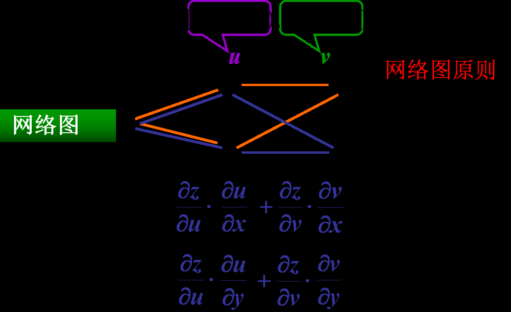
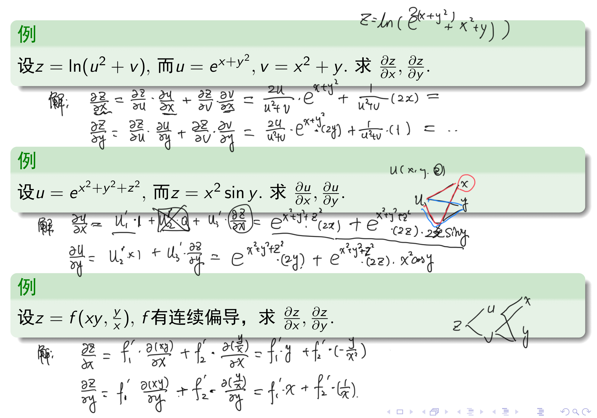
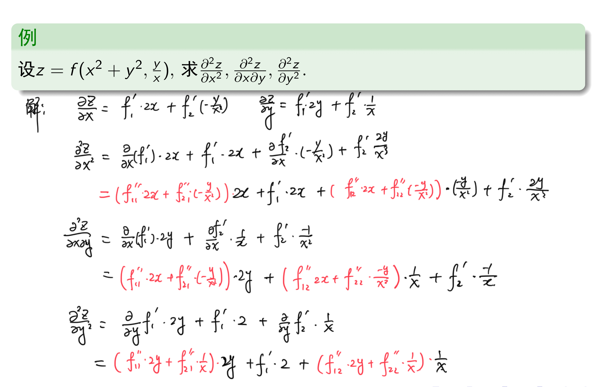
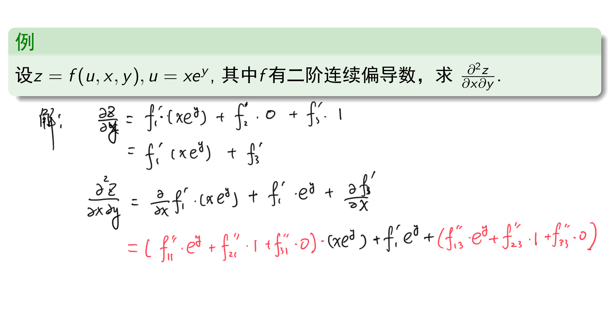

# 工科数分第4讲

<!-- page: 1 -->

工科数学分析下

李茂生

2024/3/7

李茂生
工科数学分析下–第4讲
2024/3/7
1 / 23

<!-- page: 2 -->

7.4 多元复合函数的求导法则

复合函数的求导法则

全微分形式不变性

高阶偏导数与高阶微分

李茂生
工科数学分析下–第4讲
2024/3/7
2 / 23

<!-- page: 3 -->

复合函数的求导法则(链导法则)

回忆(一元情形)：y = f (u), u = '(x), 则

dy
dx = dy

du
dx .

du

问题

设而对于二元函数z = f (u, v), u = '(x, y), v = (x, y). 如何求

@z
@x , @z

@y ?

李茂生
工科数学分析下–第4讲
2024/3/7
3 / 23

<!-- page: 4 -->

复合函数的求导法则(链导法则)

定理

设二元函数u = '(x, y)和v = (x, y)都在点P(x, y)处有偏导数，且函
数z = f (u, v) 在对应点(u, v)有连续的偏导数，则复合函数

z = f ['(x, y), (x, y)]

在对应点(x, y)的偏导数存在且有以下计算公式：

@z
@x = @z

@u
@x + @z

@v
@x ,
@z
@y = @z

@u
@y + @z

@v
@y .

@u

@v

@u

@v

李茂生
工科数学分析下–第4讲
2024/3/7
4 / 23

<!-- page: 5 -->

网络图

李茂生
工科数学分析下–第4讲
2024/3/7
5 / 23

<!-- page: 6 -->

练习题

例

设z = ln(u2 + v), 而u = ex+y2, v = x2 + y. 求@z

@x , @z

@y .

例

设u = ex2+y2+z2, 而z = x2 sin y. 求@u

@x , @u

@y .

例

设z = f (xy, y

x ), f 有连续偏导，求@z

@x , @z

@y .

李茂生
工科数学分析下–第4讲
2024/3/7
6 / 23

<!-- page: 7 -->

练习题

例

设z = f (x, y, z) 为k次齐次函数，即f (tx, ty, tz) = tkf (x, y, z). 求证：

x @f

@x + y @f

@y + z @f

921
xg
9

@z = kf (x, y, z).

证明
由fctx ty tz
tkfcxy.E
两边同时关于t

求导有
xfitxty.tztyfitxtg.t2tzfix.ty.to
ktktfixy.zl­lit.li

有
xfix.y.cz tyficx.y.zjtzfsix.g.tl kfx.y.z

李茂生
工科数学分析下–第4讲
2024/3/7
7 / 23

<!-- page: 8 -->

例

已知f (t)可微, 证明z =
y
f (x2−y2) 满足方程

1
x

@z
@x + 1

@z
@y = z

y2 .

y

我

二士
等
可

证明
叕

文姿坊等

二一装奖
求

二
题i

二亦

李茂生
工科数学分析下–第4讲
2024/3/7
8 / 23

<!-- page: 9 -->

全微分形式不变性

设z = f (u, v)具有连续偏导数, 两偏导数均存在，若有u = '(x, y),
v = (x, y)时，则复合后关于x, y的二元函数z = f (u(x, y), v(x, y))有全
微分

dz = @z

@x dx + @z

@y dy.

此外我们有以下式子成立

dz = @z

@u du + @z

@v dv.

d(f (x(u, v))) = fx(x(u, v))dx.

李茂生
工科数学分析下–第4讲
2024/3/7
9 / 23

<!-- page: 10 -->

例

p

x2 + y2 + z2, 求du 以及@u

@x , @u

@y , @u

设u = ln

@z .

到
2
X 𦭛岸之ᵈ2

du Ífzzdcx

二靠2 哥磊242

姴二前
哥

例

设u = f (x2 −y2, exy, z), 求@u

@x , @u

@y , @u

@z .

du
fidixiyytfi.de
tfidz
fi.la dx 2ydy
fieXY ydxtxdy tfidz­
pxfi
OyeyfidxtleXYfi zyfi
O
dytfidz
蔡
哥
器

通过全微分求所有一阶偏导数,比链导法则求偏导数有时会更灵活方便.

李茂生
工科数学分析下–第4讲
2024/3/7
10 / 23

<!-- page: 11 -->

高阶偏导数和高阶全微分

二阶偏导数: 对偏导函数的偏导数. 函数z = f (x, y)的二阶偏导数为

" @z

#

" @z

#

:= @2z

:=
@2z
@y@x := fxy(x, y),

@
@x

@x2 := fxx(x, y),
@
@y

@x

@x

⇣

⌘

⇣

⌘

:=
@2z
@x@y := fyx(x, y),
@
@y

:= @2z

@z
@y

@z
@y

@
@x

@y2 := fyy(x, y).

通常我们把fxy(x, y)和fyx(x, y)称作混合偏导数.

二阶及二阶以上的偏导数统称为高阶偏导数.

李茂生
工科数学分析下–第4讲
2024/3/7
11 / 23

<!-- page: 12 -->

例

求函数f (x, y) = y cos x + 3x2ey 的所有二阶偏导数.

cosx
3 2e

解
婪
ysmx
6xe
哥

肃
gcosxt6eY.ge
3 2e9 骑
sinxtxe
子
Sihxtbxe

例

求函数z = x2y3 + xy2 的所有二阶偏导数.

3ㄨy
2xy

解
癸
2xy3
y
哥

瑟
293
3
6xy年29 3
6Xyt2X
箭
6xy
2g

李茂生
工科数学分析下–第4讲
2024/3/7
12 / 23

<!-- page: 13 -->

改变次序的混合偏导数

例(混合偏导数的次序不一定能交换)

设函数

( x3y

x2+y2 ,
(x, y) 6= (0, 0)

f (x, y) =

0,
(x, y) = (0, 0),

求fxy(0, 0) 和fyx(0, 0).

解
ㄨ9 北
装
斑
7子
哥

二ii
pjin_iin_xig­go.io
lǒmot 一二
0 yang
个
一如品

fgcno d
hu
e
1

fgxci.co ghǒnf
f09

0

李茂生
工科数学分析下–第4讲
2024/3/7
13 / 23

<!-- page: 14 -->

改变次序的混合偏导数

定理(混合偏导数可改变次序的充分条件)

如果函数z = f (x, y)的两个混合偏导数fxy(x, y)和fyx(x, y)在一个区
域D上连续，则在该区域内该两混合偏导数都相等, 即

fxy(x, y) = fyx(x, y), (x, y) 2 D.

一般地，多元函数的高阶混合偏导数如果连续就与求导的次序无关.

李茂生
工科数学分析下–第4讲
2024/3/7
14 / 23

<!-- page: 15 -->

例

x ), 求@2z

@x2 , @2z

@x@y , @2z

设z = f (x2 + y2, y

@y2 .

李茂生
工科数学分析下–第4讲
2024/3/7
15 / 23

<!-- page: 16 -->

高阶全微分

定义(二阶全微分)

设函数z = f (x, y) 在开区域D上每一点都存在全微分，则当自变量的改
变量∆x 和∆y任意固定时，全微分dz是关于x, y的函数. 因此，可考
虑dz关于自变量的同一改变量的全微分. 即若

dz = fxdx + fydy,

则函数的二阶全微分d(dz) = d2z. 实际上，

d2z = fxxdx2 + 2fxydxdy + fyydy2.

李茂生
工科数学分析下–第4讲
2024/3/7
16 / 23

<!-- page: 17 -->

例

求z = x sin y 的二阶全微分.

0 剟

二xang 器

二any

解
琹

二sing
景

靠
X SMX

dz
2cosydxdy
x.mx dy

李茂生
工科数学分析下–第4讲
2024/3/7
17 / 23

<!-- page: 18 -->

多元函数的偏导数常常用于建立某些偏微分方程.偏微分方程是描述自
然现象、反映自然规律的一种重要手段.例如方程

@2z
@x2 = a@2z

@y2

(a是常数)称为波动方程, 它可用来描述各类波的运动.又如方程

∆z := @2z

@x2 + @2z

@y2 = 0

称为拉普拉斯(Laplace)方程,它在热传导、流体运动等问题中有着重要的
作用.

李茂生
工科数学分析下–第4讲
2024/3/7
18 / 23

<!-- page: 19 -->

例

设f 满足Laplace 方程@11f + @22f = 0. 证明：

u(x, y) = f (
x
x2 + y2 ,
y
x2 + y2 )

也满足Laplace方程.

李茂生
工科数学分析下–第4讲
2024/3/7
19 / 23

<!-- page: 20 -->

例

设z = f (u, x, y), u = xey, 其中f 有二阶连续偏导数，求
@2z
@x@y .

李茂生
工科数学分析下–第4讲
2024/3/7
20 / 23

<!-- page: 21 -->

例

设z = f (2x −y, y sin x), 其中f 有二阶连续偏导数，求
@2z
@x@y .

二fic ijtfi.sn x

二fi
2
fiyasx
等

解
琹

二灵哥
2tfiycosx
1

簃

后2 fiycosx
sinx

tfiosx
2fi
ycosxfitzsinxfiitycosxsmxfi­tfi.co

x

李茂生
工科数学分析下–第4讲
2024/3/7
21 / 23

<!-- page: 22 -->

作业

习题7.4 (A)

I 2. 奇数题

I 3. 奇数题

I 6. (3) (4)

I 7. 偶数题

I 10.

习题7.4 (B)

I 1. (2) (3) (5)

I 2.

李茂生
工科数学分析下–第4讲
2024/3/7
22 / 23

<!-- page: 23 -->

谢谢大家!

李茂生
工科数学分析下–第4讲
2024/3/7
23 / 23
