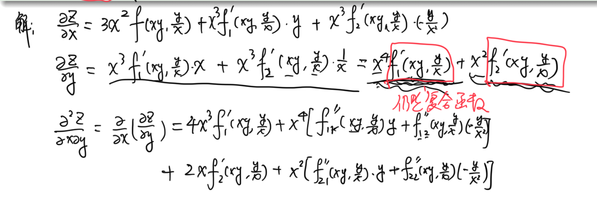
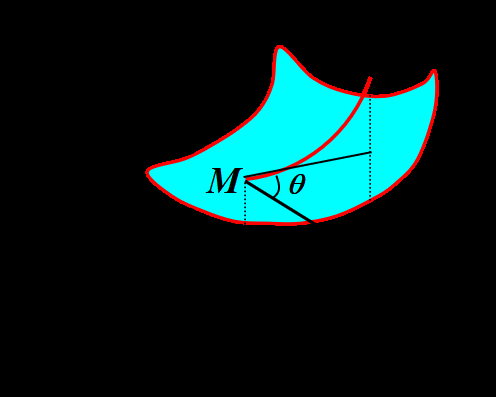

# 工科数分第5讲

<!-- page: 1 -->

工科数学分析下

李茂生

2024/3/8

李茂生
工科数学分析下–第5讲
2024/3/8
1 / 29

<!-- page: 2 -->

练习题

例

@y , @2z

设z = x3f (xy, y

x ) 其中f 为二阶连续可导函数. 求@z

@x , @z

@x@y .

对复合函数求高阶偏导数时,需注意:导函数仍是复合函数.故对导函数再
求偏导数时,仍需用复合函数求导的方法.

李茂生
工科数学分析下–第5讲
2024/3/8
2 / 29

<!-- page: 3 -->

7.5 方向导数与梯度

方向导数概念与计算公式

梯度概念与计算

李茂生
工科数学分析下–第5讲
2024/3/8
3 / 29

<!-- page: 4 -->

方向导数概念

设z = f (x, y)为二元函数，偏导数刻画
了函数沿着坐标轴正方向的变化率，接
下来我们讨论的是函数沿着任意方向
~` = (cos ↵, cos β)的变化率.

定义(方向导数)

二元函数z = f (x, y) 定义在区域D上，P = (x0, y0) 2 D.
设~` = (cos ↵, cos β) 为单位向量，其中↵, β分别为该向量与x,y轴的夹角.
若下列极限存在

f (x0 + t cos ↵, y0 + t cos β) −f (x0, y0)

lim
t!0+

t
,

则称之为f (x, y)在P(x0, y0)处沿~`方向的方向导数. 记作@f (P)

@~` .

李茂生
工科数学分析下–第5讲
2024/3/8
4 / 29

<!-- page: 5 -->

方向导数的几何意义

由z = f (x, y)定义的几何图像为曲
面，当限制自变量沿~`方向变化时，
对应的点(x, y, z)形成过~`的铅垂平
面与曲面的交线.

这条交线在点M有一条半切线,记这条半切线与~`的夹角为✓,则有

tan ✓= @f (P)

.

@~`

特别地，当~` = (1, 0)时，@f (P)

@~`
= @f (P)

@x ; ~` = (0, 1)时，@f (P)

@~`
= @f (P)

@y .

李茂生
工科数学分析下–第5讲
2024/3/8
5 / 29

<!-- page: 6 -->

方向导数6)偏导存在

例

p

x2 + y2 在原点沿任意方向的方向导数存在，但f 在该
点偏导数不存在.

证明：函数z =

证明
设E
1cosα
sinα
由定义

2 IS

器10not

ta -
linr 卡
I

lismo

故在10.01 处
Z 的方向导数都存在

2
ˇㄨ
惑
不存在

而
叕1001 二lǎno

李茂生
工科数学分析下–第5讲
2024/3/8
6 / 29

<!-- page: 7 -->

方向导数的计算公式

定理(方向导数存在的充分条件)

设二元函数z = f (x, y) 在点P = (x0, y0) 2 D 处可微，则f 在该点处沿任
意方向的方向导数都存在并且有以下计算公式

@f (P)

= @f (P)

@x
cos ↵+ @f (P)

@y
cos β.

@~`

李茂生
工科数学分析下–第5讲
2024/3/8
7 / 29

<!-- page: 8 -->

例

""

设z = xexy, P0 = (0, 0), ~` 为与向量(1, 1) 同向的单位向量. 求@z

(1,1).

@~`

解
器
e对tx.ge
灣iie

而ē 二后六
得二xxexy

官二
Éetǎiie

二琹
后影

故哥1in

例

设点(x, y, z) 6= (0, 0, 0)向径方向为与(x, y, z)同向的单位向量，求
u = x2 + y2 + z2 在(x0, y0, z0) 6= (0, 0, 0)处沿该点向径方向的方向导数.

解
由题意知
Xo 9 2 处的向径方向El
ii
杰to 焉to
斐xo 9 21
2Xo 哥
Xo Yo2.1 29 哲No 9 Z
2名

故有装
装no 9 瓦1 舜it 哥no9021 xYiy
irfz.it 器1
90 1 忌

2fxōtyittzò

李茂生
工科数学分析下–第5讲
2024/3/8
8 / 29

<!-- page: 9 -->

方向导数6)连续

例

设函数

(

0,
y 0, 或y ≥x2

f (x, y) =

1,
0 < y < x2.

证明:f 在原点沿任意方向的方向导数存在，但f 在该点不连续.

证明
设区域I
I 亚如右图所示
ii效善慈杰
扣悲興

斷

我们分3种情况讨论

①
sinα
0
此时fitcosα 01 - 0
装lǒnó
0

②
Sinα so
由于
tcosatsinα 满足tsinα
Itcosa
t sinα
tcosal
䲜戵顖㖌it 品品品9
主簦器
③贤色首时燕坚
靠贒𦖠0 高爨喌不- 1 故在心口处极限不砝

也不连续

李茂生
工科数学分析下–第5讲
2024/3/8
9 / 29

<!-- page: 10 -->

函数增加或减少最快的方向

问题

设二元函数z = f (x, y) 在点P = (x0, y0) 2 D 处沿方向~`的方向导数
为@f (P)

@~` . 我们知道当@f (P)

@~`
> 0 时，沿该方向在一个的邻域上函数值是增

加的(相对P);当@f (P)

@~`
< 0 时，沿该方向在一个的邻域上函数值是减少
的(相对P). 自然地，我们会问：沿哪个方向函数值增加或减少得最快
呢？

实际上，函数值增加最快的方向是使方向导数为正且达到最大值的方
向；函数值减少最快的方向是使方向导数为负且达到最小值的方向.

李茂生
工科数学分析下–第5讲
2024/3/8
10 / 29

<!-- page: 11 -->

例

求函数f (x, y) = x2 −xy + y2在点(1, 1)沿与x轴方向夹角为↵的方向~`的
方向导数. 并问在怎样的方向上此方向导数有: (1) 最大值；(2) 最小
值；(3) 等于零.

解
由题意知
E
1cosα sn α1
装
2 x y
得
x 2g
纛i

故泰li
11.1 cosat 森1 1 Sina
cosα
5Mα 二Esinlatā

由此知当α 车二I
装
1 有最大值此时
α 二平E
1后后1

当α ān 二一至
毒11.11有最小值此时又二一年下
ē
-后

一六

当又十年二0或可对泰11.11
0
此埘
α 二一年或平
对应的t
-后后1成后一点

李茂生
工科数学分析下–第5讲
2024/3/8
11 / 29

<!-- page: 12 -->

梯度

定义(梯度)

设二元函数z = f (x, y)在P = (x0, y0)偏导数存在，我们把向
量( @f

@x (P), @f

@x (P))称为函数f 在点P处的梯度向量(或简称梯度)，记作
gradf 或rf . 即，

gradf = rf = (@f

@x (P), @f

@y (P)).

对三元或多元函数也有类似定义. 如：设三元函数u = g(x, y, z) 在点
P = (x0, y0, z0) 偏导数存在，我们把向量( @g

@x (P), @g

@y (P), @g

@z (P))称为函
数g在点P处的梯度向量. 此时有，

gradg = rg = (@g

@x (P), @g

@y (P), @g

@z (P)).

李茂生
工科数学分析下–第5讲
2024/3/8
12 / 29

<!-- page: 13 -->

梯度的基本性质

1 gradC = 0 (C 为常数)；

2 grad(Cf ) = Cgradf ;

3 grad(f + g) = gradf + gradg;

4 grad(fg) = ggradf + f gradg;

或者

1 rC = 0;

2 r(Cf ) = Crf ;

3 r(f + g) = rf + rg;

4 r(fg) = grf + f rg.

李茂生
工科数学分析下–第5讲
2024/3/8
13 / 29

<!-- page: 14 -->

梯度与方向导数

设~` = (cos ↵, cos β), 由方向导数的计算公式得

@f (P)

= @f (P)

@x
cos ↵+ @f (P)

@y
cos β = gradf · ~`.

@~`

于是，我们还有

@f (P)

= gradf · ~` = ||gradf || cos[hgradf , ~`i].

@~`

定理

设二元函数z = f (x, y)在P = (x0, y0)处可微，则gradf 存在，且

1 若gradf = (0, 0), 则沿任何方向~`, @f (P)
@~`
= 0;

2 若gradf 6= (0, 0), 则当~` =
gradf
||gradf ||时, @f (P)

@~` 最大，且

@f (P)

= ||gradf ||.

@~`

李茂生
工科数学分析下–第5讲
2024/3/8
14 / 29

<!-- page: 15 -->

例

求函数f (x, y) = xey 在点(1, 1)处的梯度，并利用这个梯度求函数f 在向
量(1, −1)的方向上的变化率.

解
其二ey
得
xey
声

e

故对11.11
e
e
哥川二e

设ē

一六
则

二
六

一
e 片
0

肃1.1
Tf11.1
e 后

李茂生
工科数学分析下–第5讲
2024/3/8
15 / 29

<!-- page: 16 -->

例

设函数u(x, y, z) = x2 + y2 + z2 −xy −xz + yz, P = (1, 1, 1). 求u在
点P的方向导数~`最值，并指出取得最值时的方向，再指出沿哪个方向的
方向导数为零.

二EX y zln in

二0

解
装

哿1P
2g X
2 1111 n
2
PUll li1
0
2
2

叕们
12Z xtylln in
2

设t 二1 a
b
C
a tb
C
1

装
2b
2 C
当
与PU11.1.11方向一致时装取得最大值

即
ē
0 后店
此时裂11.1.11
2 E

- 2V2

当
t
- ok 后1 时获取最小值此时装

而当b
二0时裂
0
此时i
1 a
b cl
其中
台焋些

李茂生
工科数学分析下–第5讲
2024/3/8
16 / 29

<!-- page: 17 -->

7.6 隐函数微分法

一个方程的情形

方程组的情形

隐函数存在定理

李茂生
工科数学分析下–第5讲
2024/3/8
17 / 29

<!-- page: 18 -->

隐函数在实际问题中是常见的. 如

平面曲线方程F(x, y) = 0;

空间曲面方程F(x, y, z) = 0;

(

F(x, y, z) = 0,
G(x, y, z) = 0.

空间曲线方程

下面讨论如何由隐函数方程求偏导数.

李茂生
工科数学分析下–第5讲
2024/3/8
18 / 29

<!-- page: 19 -->

隐函数存在定理

定理(隐函数存在定理)

设二元函数F(x, y)满足以下条件：

1 在矩形区域D = {(x, y) | |x −x0| < a, |y −y0| < b}内有关于x, y的
连续偏导数；

2 F(x0, y0) = 0;

3 Fy(x0, y0) 6= 0.

则有

1 在点(x0, y0)的某邻域内，由方程F(x, y) = 0可以确定唯一的函数
y = f (x). 即存在⌘> 0 当x 2 U(x0, ⌘)时有F(x, f (x)) ⌘0, 且
y0 = f (x0);

2 f 在U(x0, ⌘)内连续；

3 f 在U(x0, ⌘)内有连续的导数，且有

dy
dx = −@F

@x /@F

@y .

李茂生
工科数学分析下–第5讲
2024/3/8
19 / 29

<!-- page: 20 -->

注：

1 该定理只说明了隐函数的存在性,并不一定能解出.

2 定理的结论是局部的.

3 隐函数的导数仍含有x与y, 理解为

"""

dy
dx = −@F

@x /@F

y=f (x).

@y

4 定理的条件只是充分条件. 如: F(x, y) = (x −y)2 = 0.

5 注意哪个是隐函数,哪个是自变量.

李茂生
工科数学分析下–第5讲
2024/3/8
20 / 29

<!-- page: 21 -->

定理

假定函数y = f (x)满足方程F(x, y) = 0 即F(x, f (x)) ⌘0. 假设F(x, y)与
函数f (x)都可微且@F

@y 6= 0. 则有

dy
dx = −@F

@x /@F

@y .

李茂生
工科数学分析下–第5讲
2024/3/8
21 / 29

<!-- page: 22 -->

例

设y是由下列方程确定为x的隐函数：

F(x, y) = xy5 −x5y −2 = 0.

求dy

dx .

解
把y看作水的函数对上述方程两边关于水求导得

5 tx
5y4yixl
5 x4 ytx
5lyix
0

y

15xy4
x51gixl
5x4y y5

故yix
二感然

一

李茂生
工科数学分析下–第5讲
2024/3/8
22 / 29

<!-- page: 23 -->

例

p

x , 求d2y

x2 + y2 = arctan y

已知ln

dx2 .

解
把g看作水的函数对上述方程两边关于水求导可得

二
二器

两

ㄨ

x
y y 1
yixl x
y
yixl

i
yin utgxǐ

1
_ 州业
注意9是关于水的亚数

二
算
iii

二十一

一一

李茂生
工科数学分析下–第5讲
2024/3/8
23 / 29

<!-- page: 24 -->

定理

设函数z = z(x, y)是由方程F(x, y, z) = 0确定的隐函数，若@F

@z 6= 0, 则

@z
@x = −@F

@z ,
@z
@y = −@F

@x /@F

@y /@F

@z .

李茂生
工科数学分析下–第5讲
2024/3/8
24 / 29

<!-- page: 25 -->

例

求由x

z = ln z

y 确定的隐函数z = z(x, y)的一阶偏导数.

二的哥两边同时关于水求偏导

解把
Z看作xy 的函数对当

叕二Ěj 叕二叕h
Z
ㄨ下祭
叕二磊

对兰二In哥两边关于y 术偏导有

x 2哥
哥赢

- 可
三

三谔

兰等二Ě

李茂生
工科数学分析下–第5讲
2024/3/8
25 / 29

<!-- page: 26 -->

例

@y , @2z

设z = z(x, y)是由F(xy, y + z, xz) = 0确定的隐函数，求@z

@x , @z

@x@y .

解
把2看作为x y的函数对上述方程两边关于水求偏导得

Fi y
É 叕
Filztx
0
巺二一十三
对上述方程两边关于8求偏导得

二
一
古器
器浔器

二0
景

Fix
后什等十后12等1

一一
注𨰻𡓨䉁

二寻1

-

一一

i
1
厅得
一
1Fiix_F
is

二一年不

ㄧㄧ_i
的

最后还需要求

景代入化简厵啠厵焋iii𦹷器蕚爕是感
十点点算鼝鬬

李茂生
工科数学分析下–第5讲
2024/3/8
26 / 29

<!-- page: 27 -->

例

设z = z(x, y)是由方程

z −y −x + xez−y−x = 0

所确定的隐函数，求dz.

方法
先求架景
把Z看部a 了的函数对上或两端分别关于

x e E 9-

-4-

- 1
te

- 1
0

的求偏导
叕

- 1
x e E 9-

- 1
o
解得隈

景

景

9 -4

二
e 沓一
辈二e_
1
ᵈ2

十dxtdy

方法二直接求微分

-X dz dy dx
0

- X

x eE 4

-9

dz dy dxtdx ee

dZ
eintdxtdy

李茂生
工科数学分析下–第5讲
2024/3/8
27 / 29

<!-- page: 28 -->

作业

习题7.5 (A)

I 4.

I 5.

I 9. (2) (4)

I 10.

李茂生
工科数学分析下–第5讲
2024/3/8
28 / 29

<!-- page: 29 -->

谢谢大家!

李茂生
工科数学分析下–第5讲
2024/3/8
29 / 29
