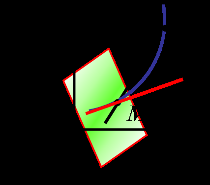
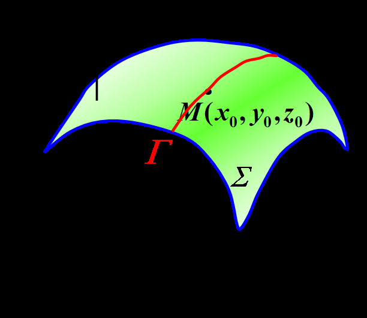
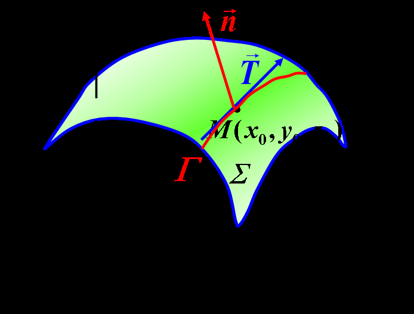
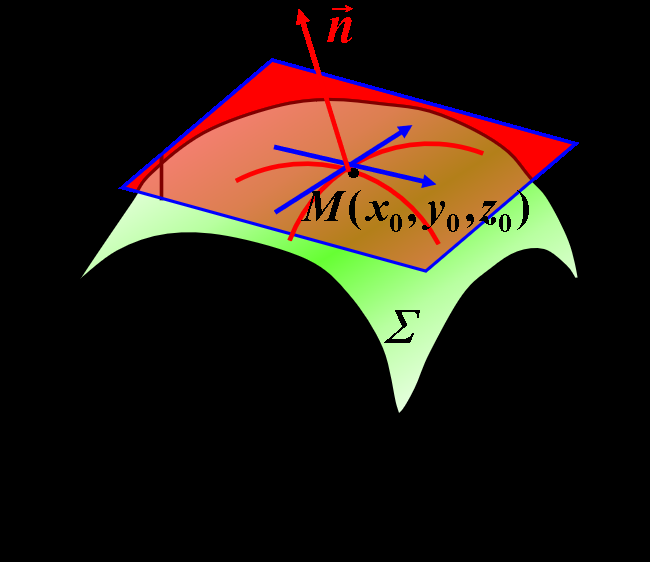

# 工科数分第7讲

<!-- page: 1 -->

工科数学分析下

李茂生

2024/3/18

李茂生
工科数学分析下–第7讲
2024/3/18
1 / 24

<!-- page: 2 -->

7.9 偏导数在几何上的应用

空间曲线的切线与法平面

曲面的切平面与法线

李茂生
工科数学分析下–第7讲
2024/3/18
2 / 24

<!-- page: 3 -->

空间曲线的切线与法平面

1. 空间曲线L的参数方程:

r = r(t) = '(t)i + (t)j + !(t)k, ↵t β.

即
8
>
<

x = '(t)
y = (t)
z = !(t)

>
:

物理意义: r 0(t)表示物体的瞬时速度；

几何意义：r 0(t) 表示曲线的切向量.

李茂生
工科数学分析下–第7讲
2024/3/18
3 / 24

<!-- page: 4 -->

几何意义

8
>
<

x = '(t)
y = (t)
z = !(t)

设空间的曲线方程

并设该

>
:

三个函数均可导. 设M(x0, y0, z0)对应
于t = t0; M0(x0 + ∆x, y0 + ∆y, z0 + ∆z)对
应于t = t0 + ∆t. 则割线MM0的方程为

x −x0

∆x
= y −y0

∆y
= z −z0

∆z
.

考察割线趋近于极限位置——切线的过程,上式分母同除以∆t,

x −x0

= y −y0

= z −z0

.

∆x

∆y

∆z

∆t

∆t

∆t

李茂生
工科数学分析下–第7讲
2024/3/18
4 / 24

<!-- page: 5 -->

几何意义

当M0 ! M，即∆t ! 0时，曲线
在M处的切线方程为

x −x0

'0(t0) = y −y0

 0(t0) = z −z0

!0(t0) .

切向量: 切线的方向向量称为曲线的切向量. 即

('0(t0), 0(t0), !0(t0)).

法平面: 过M点且与切线垂直的平面.

'0(t0)(x −x0) + 0(t0)(y −y0) + !0(t0)(z −z0) = 0.

李茂生
工科数学分析下–第7讲
2024/3/18
5 / 24

<!-- page: 6 -->

空间曲线的方程为两个柱面的交线

(

y = y(x),
z = z(x).
此时可以将其参数化，取x为参数，即可

即曲线表示为

化为上一种的情形
8
>
<

x = x
y = y(x)
z = z(x)

.

>
:

因此，其在该线上的点(x0, y0, z0)处的切线方程为

x −x0

1
= y −y0

y0(x0) = z −z0

z0(x0) .

法平面方程为

1 · (x −x0) + y0(x0)(y −y0) + z0(x0)(z −z0) = 0.

李茂生
工科数学分析下–第7讲
2024/3/18
6 / 24

<!-- page: 7 -->

例

8
>
<

R t

0 eu cos udu
y = 2 sin t + cos t
z = 1 + e3t

x =

在t = 0时刻对应的点处的切线和法平

求曲线L：

>
:

面方程.

关键求切向量E 1Xit1 y HI
Z 1 1 h

解
金点9

点
ant
故曲线L 在二0处的切向量

1.2.31

又曲线L在7
0时经过点1 107 9101 210
0
1
2

二琴

二告

故所求切线为
毕

所求法平面方程为
1.1 x 0
21y 1
312
- 2
0

2y
3 Z
8

即

李茂生
工科数学分析下–第7讲
2024/3/18
7 / 24

<!-- page: 8 -->

例

求平面y = x和抛物柱面z = x2的交线在点M(1, 1, 1)处的切线和法平面
方程.

解
题意中所考虑曲线的参数方称为

州2
𦇝蕊

售

故该曲线在M11.1 1
处的切向量为
口
Ixt

二芈
二型

于是所求切线方程为
华

所求法平面方积为
1.101
-1
1 ly 1
2.12
-1

即
水y
22
4

李茂生
工科数学分析下–第7讲
2024/3/18
8 / 24

<!-- page: 9 -->

空间曲线的方程为两个曲面的交线

设空间曲线L为空间两曲面的交线，即其方程为
(

F(x, y, z) = 0,
G(x, y, z) = 0.

设M(x0, y0, z0)为曲线L上的一点，如何求该曲线在这点处的切线和法平
面方程？我们假设F, G关于各个变量的偏导数是连续的，且

'''

@(F, G)

M 6= 0.

@(y, z)

则由隐函数定理知在M的某邻域内确定了一组隐函数y = y(x),
z = z(x). 转化为第二种类型的求法. 此时可求得，

y0(x0) = −@(F, G)

@(x, z) /@(F, G)

@(y, z) ;
z0(x0) = −@(F, G)

@(y, x) /@(F, G)

@(y, z) .

切向量：(1, y0(x0), z0(x0)).

李茂生
工科数学分析下–第7讲
2024/3/18
9 / 24

<!-- page: 10 -->

例

(

x2 + y2 + z2 = 8
x2 + y2 = z2
在点P0(1,

p

3, 2)处的切线和法平面方程.

求曲线

①

解
令FIX 9 z1
X 4
2
- 8
Glx g 21
x492

- z

2

1 㔆将剟
一灯

由隐函数存在定理存在Po的邻域使得在该邻成内原方程组

决定隐函数y yM
Z
2叫
对①中两端分别关于水求导可得
层兴品制品it 㠭器代入

后于是所求切线的切向量

古管烈士在
可解得倓品

为111 ⅓一
故所求切线为
中二景

二
所求法平面方程为x 1 - 吉1g V3

李茂生
工科数学分析下–第7讲
2024/3/18
10 / 24

<!-- page: 11 -->

例

求曲线
(

x2 + y2 + z2 −6 = 0
z −x2 −y2 = 0

①

在点M(1, 1, 2)处的切线与法平面方程.

解
令FIX 9 Z1
X 142 2
6
G1x y z
Z
2 - y

l Im 将
1m

二的44211m
10

由隐函数存在定理存在M的令䧕使得在该邻域内原方程组可决定

隐函数y y nl
Z
Z叫
在①两边同时关于水求导可得

0 代入1 x 9.21
11.1.22 得

䓅然i j

zii
等ii 品可解得儠ō
故所求切线的切向量为1
-1 0

于是所求切线为一二特二
所求法平面方程常
j

9
-1

李茂生
工科数学分析下–第7讲
2024/3/18
11 / 24

<!-- page: 12 -->

曲面的切平面与法线

回忆二元函数的局部线性化: 若函数f (x, y)在(x0, y0)点可微，则

f (x, y) ⇡f (x0, y0) + fx(x0, y0)(x −x0) + fy(x0, y0)(y −y0).

即, 二元函数f (x, y)在(x0, y0)点附近可局部线性化.

接下来，我们考察曲面z = f (x, y)与平面

z = f (x0, y0) + fx(x0, y0)(x −x0) + fy(x0, y0)(y −y0)

之间的关系.

李茂生
工科数学分析下–第7讲
2024/3/18
12 / 24

<!-- page: 13 -->

曲面的切平面与法线

设曲面⌃的方程为F(x, y, z) = 0,
M(x0, y0, z0) 2 ⌃, 函数F关于x, y, z的
偏导数在该点处连续且不同时为0. 在
曲面⌃上任意取一条过M的曲线Γ, 设
其参数方程为

x = x(t), y = y(t), z = z(t),

点M对应于参数t = t0,
且x0(t0), y0(t0), z0(t0)不同时为0.
由于曲线Γ在曲面⌃上，所以

F[x(t), y(t), z(t)] ⌘0.

李茂生
工科数学分析下–第7讲
2024/3/18
13 / 24

<!-- page: 14 -->

曲面的切平面与法线

F[x(t), y(t), z(t)] ⌘0.

两端同时对t求导，并令t = t0得

Fx(x0, y0, z0)x0(t0) + Fy(x0, y0, z0)y0(t0) + Fz(x0, y0, z0)z0(t0) = 0.

由此向量~n := rF(x0, y0, z0)
(即(Fx(x0, y0, z0), Fy(x0, y0, z0),
Fz(x0, y0, z0))) 与曲线Γ在M处的切向
量~T = (x0(t0), y0(t0), z0(t0)) 满足

~n · ~T = 0.

等价地，向量~n与~T相互垂直.

李茂生
工科数学分析下–第7讲
2024/3/18
14 / 24

<!-- page: 15 -->

曲面的切平面与法线

因为曲线Γ是曲面⌃上过点M的任意
一条曲线, 所有这些曲线在点M的切
线都与同一向量~n垂直,因此这些切
线必共面,由切线形成的这一面,称为
曲面⌃在点M处的切平面，该切平
面方程为

Fx(x0, y0, z0)(x −x0) + Fy(x0, y0, z0)(y −y0) + Fz(x0, y0, z0)(z −z0) = 0.

过点M且垂直于切平面的直线称为曲面⌃在点M的法线, 该直线方程为

x −x0
Fx(x0, y0, z0) =
y −y0
Fy(x0, y0, z0) =
z −z0
Fz(x0, y0, z0).

向量~n为曲面⌃在点M的法向量, 又是法线的方向向量.

李茂生
工科数学分析下–第7讲
2024/3/18
15 / 24

<!-- page: 16 -->

曲面方程形为z = f (x, y)的情形

令F(x, y, z) = f (x, y) −z,则有

Fx = fx, Fy = fy, Fz = −1.

故~n = (fx, fy, −1), 此时曲面在M0(x0, y0, z0)处的切平面方程为

fx(x0, y0)(x −x0) + fy(x0, y0)(y −y0) −(z −z0) = 0.

即

z = f (x0, y0) + fx(x0, y0)(x −x0) + fy(x0, y0)(y −y0).

曲面在M0(x0, y0, z0)处的法线方程为

x −x0
fx(x0, y0) =
y −y0
fy(x0, y0) = z −z0

−1 .

李茂生
工科数学分析下–第7讲
2024/3/18
16 / 24

<!-- page: 17 -->

例

求曲面z = arctan y

x 在点P0(1, 1, ⇡

4 )处的切平面和法线方程.

一川

解
所求切平面的法向量式二器哥

二
未
靠
得

装

n
l 三三
一1

_ 前

故所求切平面为
Ílx
11 十三y 1
- 1 z_T

0

即
x y
2 Z
I
0

二
2率

二叁

所求法线为㞷

李茂生
工科数学分析下–第7讲
2024/3/18
17 / 24

<!-- page: 18 -->

例

求曲面z = x2 + y2与平面2x + 4y −z = 0平行的切平面方程.

解
设所求切平面为曲面Z
X
9 在点IX
Yo 到处的切平面

于是该切平面的法向量为n
200
2yo
-17

由题意知
n 11
2
4
-1
即有tEIR
s t

l 276 290
-11
12t
4t
t
t
1

此时
靠I

z
xōty
5

于是所求切平面经过
1
2
51 旦法向量为n
12
4
-1

所求切平面方秓为
21 x D
414
-21

-
Z 5
0

即
221
4y
Z
5

李茂生
工科数学分析下–第7讲
2024/3/18
18 / 24

<!-- page: 19 -->

例

(

I
X

10x + 2y −2z = 27
x + y −z = 0
且与曲面3x2 + y2 −z2 = 0相切的平

求过直线L

面方程.

解过直线L 的平面方程一般形式为
1入u 不全为0

入10X
2y
2Z 271 十MIX ty
Z
v
①
设所求切平面为曲面3 x
9
Z
1 在10
Yo 到处的切平面

此时该切平面的法向量式二DFKX YoZ
600
2yo
- 2Zo
I FIX9 Z1
ix
y

2 ǎt_
2
Gxo x_x1
24018
-401 -22012

2 - Z
于是该切平面方程可表为

u

-20
0
Go y suit
③⑬
装
c
籒
x
2 y
2Z 2
- 2
0
②

-
in 然
对长
②

算㸑䉹
yiz
0
二垢
u
215一三

一步代入②即可得所材积

解出y
Z 二士2行

李茂生
工科数学分析下–第7讲
2024/3/18
19 / 24

<!-- page: 20 -->

例

y
x 上所有点处的切平面都过一定点.

证明：曲面z = xe

证明
设PIxr yo tl 在曲面Z二
xe告上则该曲面在点No
E

处切平面的法向量n 二1装哥Dlp
e器e
x ie

-11

e
1 -
e器
一1
故对应的切平面方程为

e是11

-
x_x
te
Iy y

-
Z Z
0

又Zo 二Xoe光代入得

e器i
lx_x1
te 器1g_yo

- 12
- xoe
二0 ①
1观客10.0.01
一
将pig
Z1 10
0
0
代入上式左端

e
11-先
x lt
e
1- yoltxoe
二0
即IX 9.21 10 0 0 均满是方和①即10.0.01即为所求定点

李茂生
工科数学分析下–第7讲
2024/3/18
20 / 24

<!-- page: 21 -->

全微分的几何意义

令∆x = x −x0, ∆y = y −y0, 则f 在(x0, y0)处的全微分可表示为

dz = f (x, y) −f (x0, y0) = fx(x0, y0)(x −x0) + fy(x0, y0)(y −y0).

曲面z = f (x, y)在点(x0, y0, z0)处的切平面方程为

z −z0 = fx(x0, y0)(x −x0) + fy(x0, y0)(y −y0).

z = f (x, y)在点(x0, y0)处的全微分恰好等于曲面z = f (x, y)在
点(x0, y0, z0)处的切平面上的点的竖坐标的增量.

李茂生
工科数学分析下–第7讲
2024/3/18
21 / 24

<!-- page: 22 -->

法向量的方向

我们知道曲面z = f (x, y)的法向量可以表示为

~n = (fx, fy, −1) 或~n = (−fx, −fy, 1).

若用↵, β, γ表示曲面的法向量的方向角, 并假定法向量的方向是向上
的,即使得它与z 轴的正向所成的角γ成锐角, 则法向量的方向余弦为

, cos γ =
1
q

, cos β =
−fy
q

cos ↵=
−fx
q

.

1 + f 2
x + f 2
y

1 + f 2
x + f 2
y

1 + f 2
x + f 2
y

李茂生
工科数学分析下–第7讲
2024/3/18
22 / 24

<!-- page: 23 -->

作业

习题7.9 (A)

I 2. (1) (3)

I 3.

I 4.

I 6. (1) (2)

I 7. 偶数题

习题7.9 (B)

I 3

李茂生
工科数学分析下–第7讲
2024/3/18
23 / 24

<!-- page: 24 -->

谢谢大家!

李茂生
工科数学分析下–第7讲
2024/3/18
24 / 24
