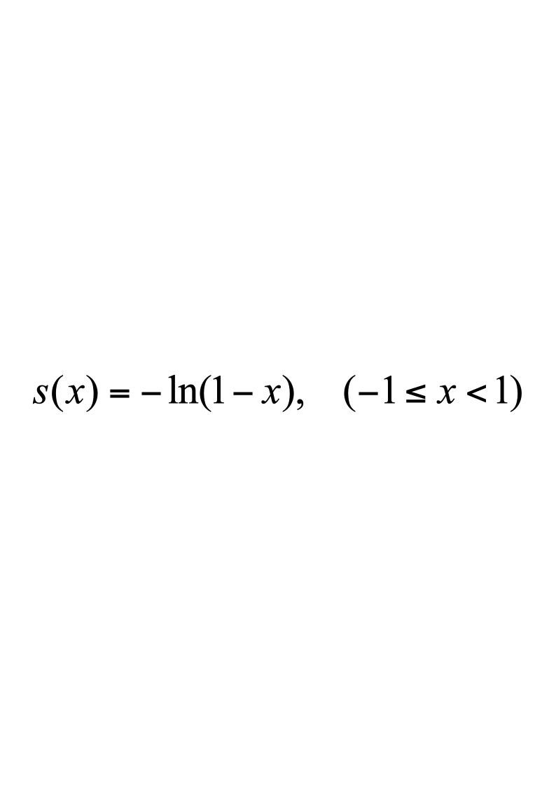
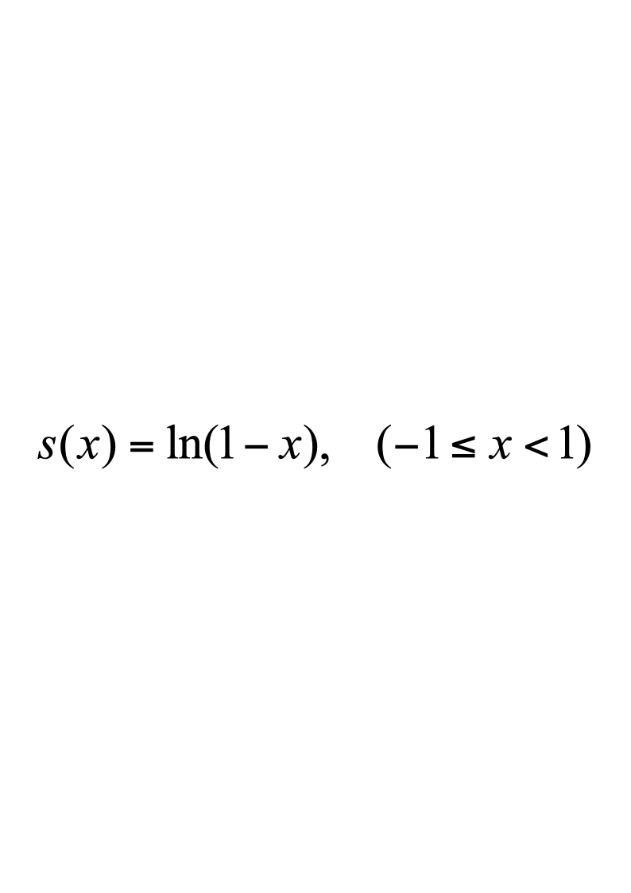
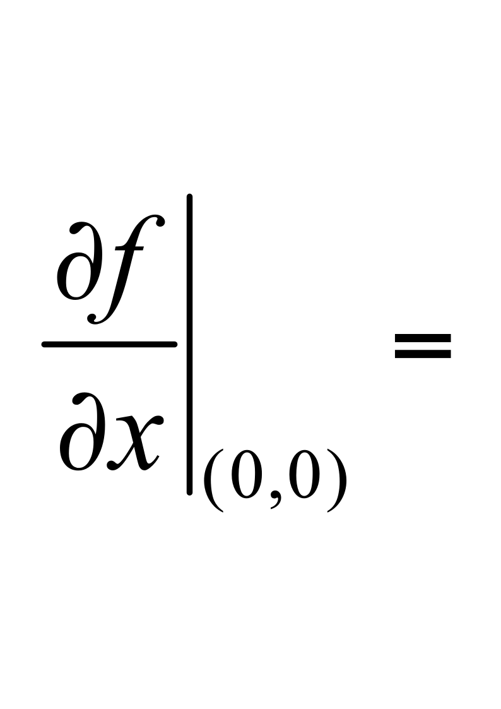
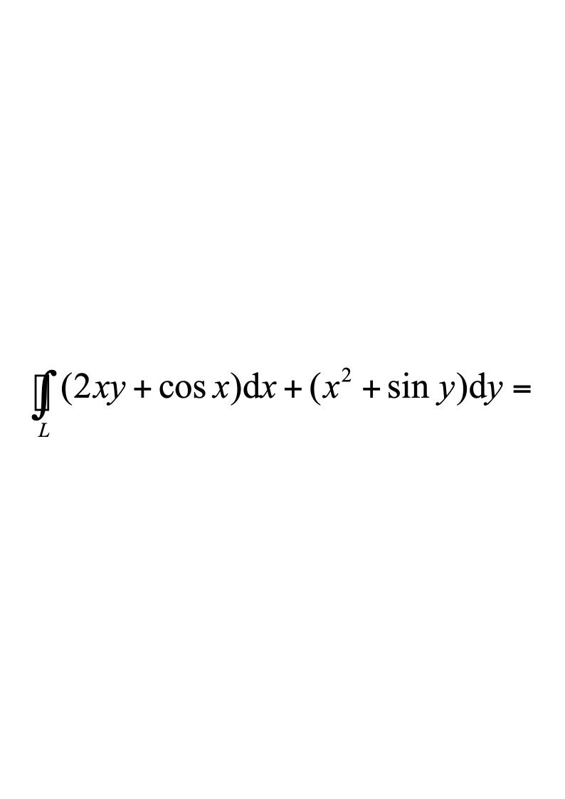
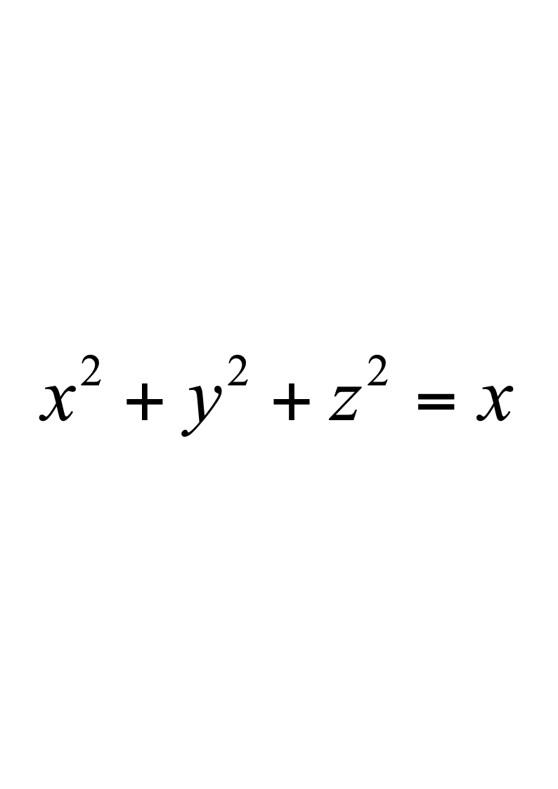
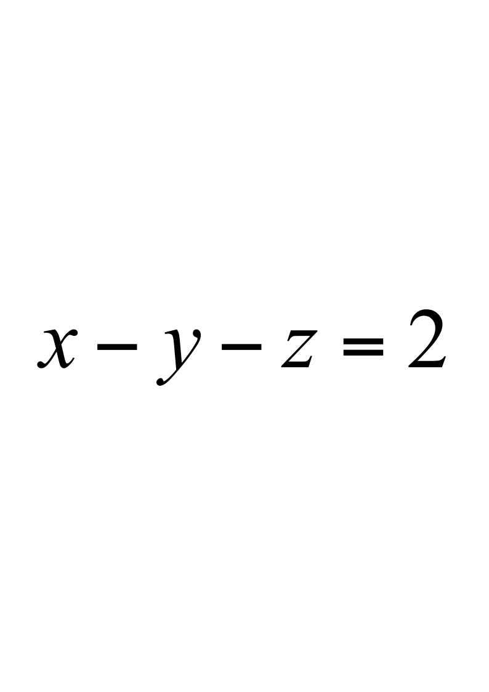
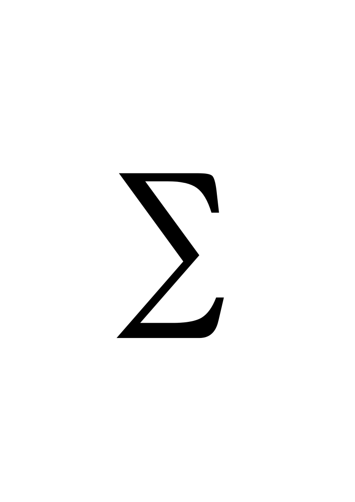
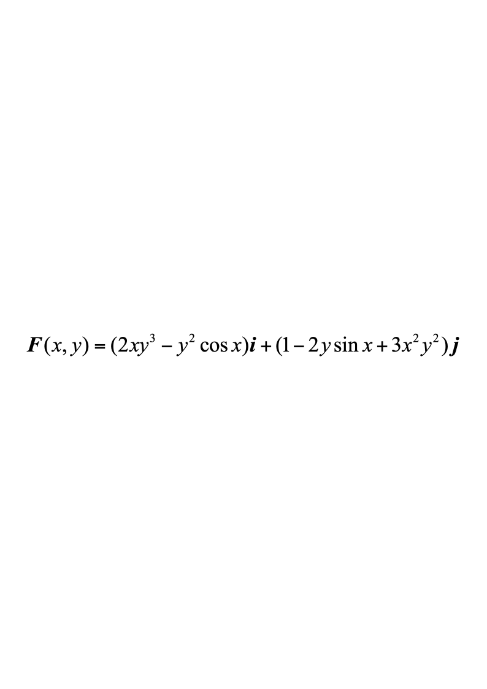
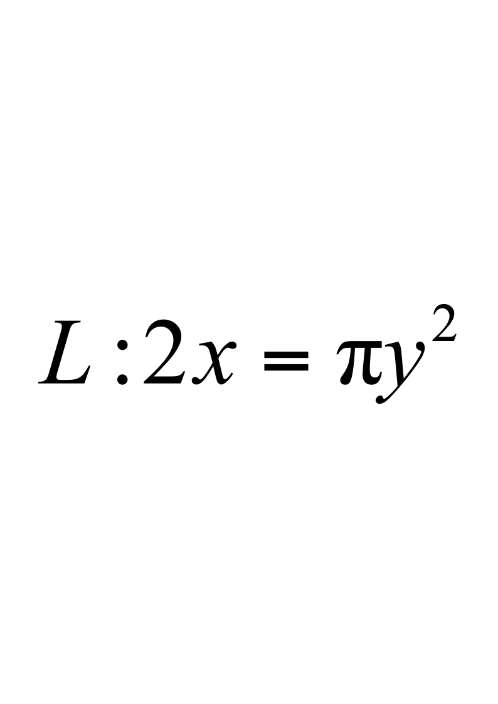
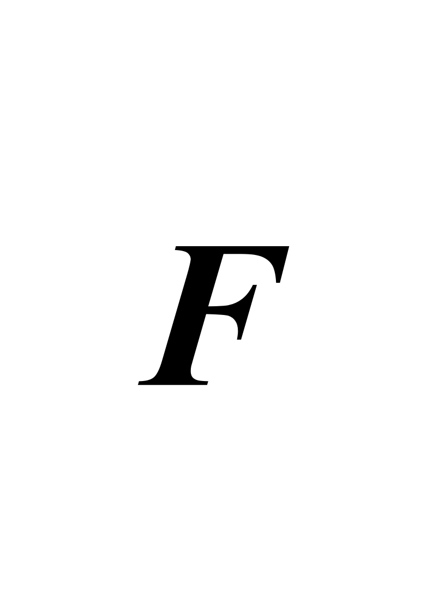

# 2012级计算机工科数学分析下 期末考试题(B卷)

**诚信应考,考试作弊将带来严重后果！**

**华南理工大学期末考试**

**《工科数学分析》2012—2013第二学期期末考试试卷（B）**

**注意事项：1.** **考前请将密封线内填写清楚；**

**2.** **所有答案请直接答在试卷上(或答题纸上)；**

**3．考试形式：闭卷；**

**4.** **本试卷共** **5个  大题，满分100分，**	**考试时间120分钟**。

| **题 号** | **一** | **二** | **三** | **四** | **五** | **总分** |
|---|---|---|---|---|---|---|
| **得 分** |  |  |  |  |  |  |
| **评卷人** |  |  |  |  |  |  |

**一、单项选择题**（每小题3分，共15分）

1．初值问题$y''+4y'+4y=0,\quady(0)=1,\quady'(0)=3$的解为（        ）。

A．  $y=(C_1+C_2x)e^{-2x}$；                        B．  $y=(1+5x)e^{-2x}$；

C． $y=(1+3x)e^{-2x}$；                              D．$y=\mathrm{e}^{-2x}+5\mathrm{e}^{2x}$．

2．对于二元函数$z=f(x,y)$，下列说法正确的是（        ）。

A．若函数$z=f(x,y)$在$(x_0,y_0)$连续，则函数在该点一定存在偏导数；

B．若函数$z=f(x,y)$在$(x_0,y_0)$存在偏导数，则函数在该点一定连续；

C．若函数$z=f(x,y)$在$(x_0,y_0)$的偏导数连续，则函数在该点一定可微；

D．若函数$z=f(x,y)$在$(x_0,y_0)$可微，则函数在该点的偏导数一定连续．

3．曲面$3x^{2}+y^{2}+z^{2}=12$上点$M(-1,0,3)$处的切平面与平面$Z=0$的夹角是（    ）。

A．$\frac{\pi}{6}$；            B．$\frac{\pi}{4}$；                  C．$\frac{\pi}{3}$；              D．$\frac{\pi}{2}$．

4．已知$L$是球面$x^2+y^2+z^2=1$与平面$x+y+z=0$的交线，则第一类曲线积分$\int_Lx^2ds=$（        ）。

A．$0$；              B．$\frac{2}{3}\pi$；            C．$\frac{1}{3}\pi$；              D．$\frac{4}{3}\pi$．

5． 幂级数$\sum_{n=1}^{\infty}\frac{x^n}{n}$的和函数是（          ）。

A．；          B．$s(x)=-\ln(x-1),(-1<x<1)$；        C．；            D．．
- **填空题**（每小题3分，共15分）
1. 已知$f(x,y)=sinxln(y+1)+cosyln(1-x)$，则                 ；
1. 微分方程$y^{(4)}-y=0$的通解为                                          ；

3．设$D=[0,1;0,2]$，则二重积分$\iint_{D}\sqrt{x+y}\,dx\,dy=$                            ；

4．设$L$是任意一条光滑闭曲线，则          ；

5．函数项级数$\sum_{n=1}^\infty\frac{1}{n}\left(\frac{x-1}{x}\right)^n$的收敛域为                                        ．
- **计算题**（每小题10分，共50分）

1．求曲面的切平面，使它垂直于平面和$x-y-\frac{1}{2}z=2$．

2.求微分方程$y''+(4x+e^{2y})(y')^3=0$的通解．

3.  计算三重积分$I=\iiint_{D}(x^{2}+y^{2})\,dx\,dy\,dz$，其中是由圆锥面$x^{2}+y^{2}=z^{2}$与平面$z=1$所围成的区域．

4.  设为曲面$x^{2}+y^{2}+z^{2}=2ax(a>0)$，计算曲面积分$I=\iint_{\Sigma}(x^2+y^2+z^2)dS$．

5.  将函数$f(x)=\frac{1}{x^{2}+4x+3}$在$x=1$处展成幂级数．

<!-- question: engineering-mathematical-analysis-2-015-Q1 -->

四、**证明题**（本题10分）

设$x=x(y,z),y=y(x,z),z=z(x,y)$都是由方程$F(x,y,z)=0$所确定的具有连续偏导数的函数，证明$\frac{\partial x}{\partial y}\cdot\frac{\partial y}{\partial z}\cdot\frac{\partial z}{\partial x}=-1$．

<!-- question: engineering-mathematical-analysis-2-015-Q2 -->

五、**应用题**（本题10分）

设有平面力场，求一质点沿曲线从点$O(0,0)$运动到点$A\left(\frac{\pi}{2},1\right)$时变力所作的功．
