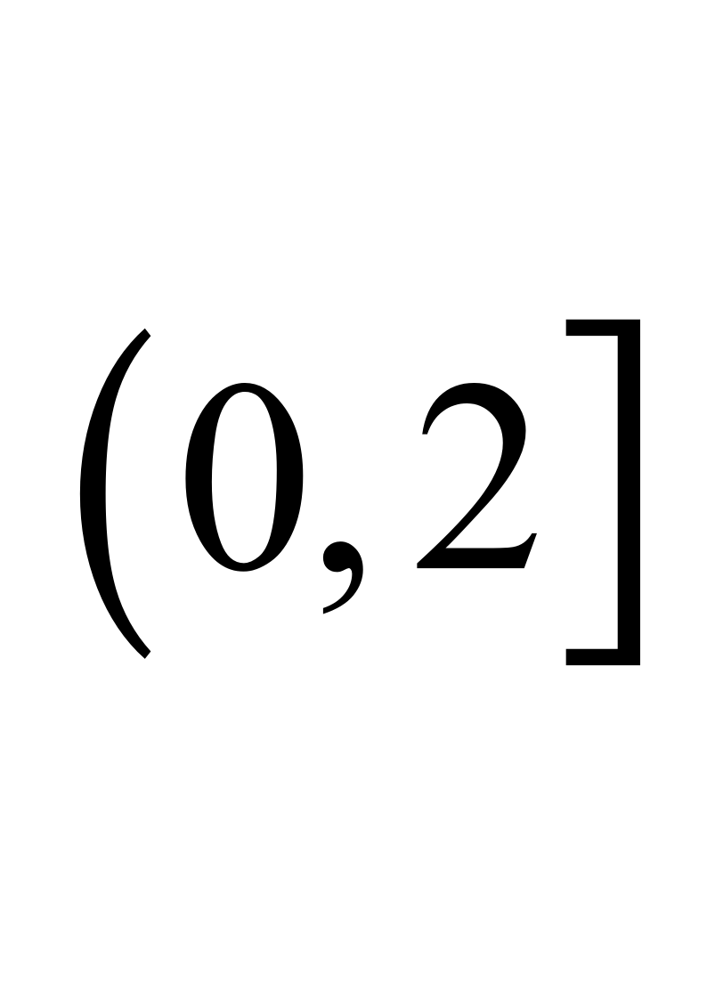
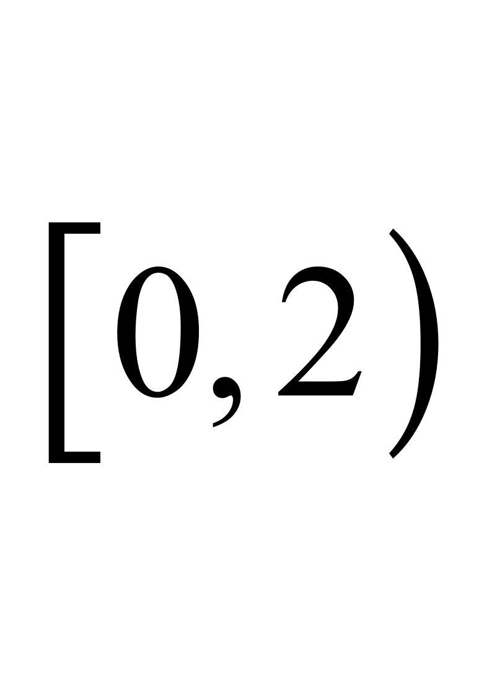
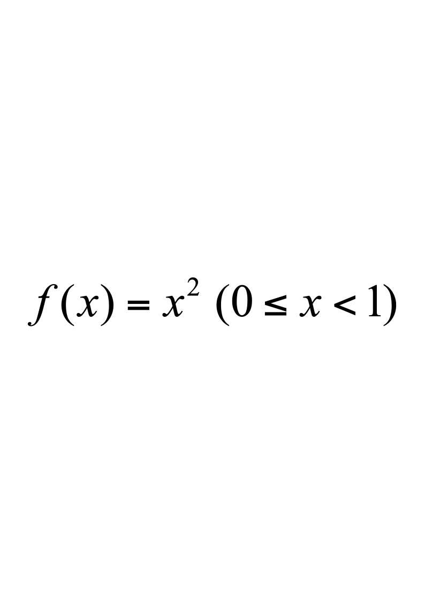
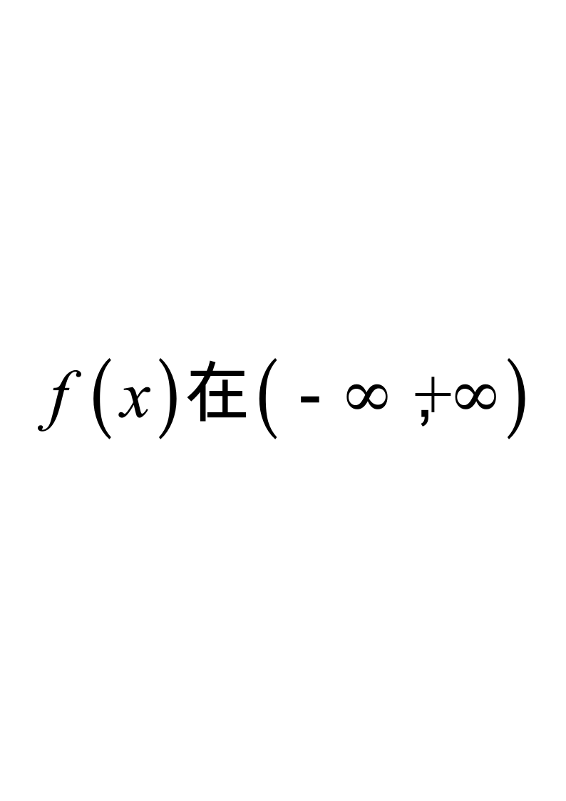

# 2013级软件 工科数学分析下A

**诚信应考，考试作弊将带来严重后果！**

**华南理工大学本科生期末考试**

**《工科数学分析》2013—2014学年第二学期期末考试试卷（A）卷**

**注意事项：1.** **开考前请将密封线内各项信息填写清楚；**

**2.** **所有答案请直接答在试卷上(或答题纸上)；**

**3．考试形式：闭卷；**

**4.** **本试卷共** **5个  大题，满分100分，**	**考试时间120分钟**。

| **题 号** | **一** | **二** | **三** | **四** | **五** | **总分** |
|---|---|---|---|---|---|---|
| **得 分** |  |  |  |  |  |  |

**一、单项选择题**（每小题3分，共15分）

1．若$Y_1,Y_2$是非齐次线性方程$y''+ay'+by=f(x)$的两个特解，则下面结论中正确的是（   ）

| A | $y_1+y_2$是非齐次线性方程的解 | B | $y_1-y_2$是非齐次线性方程的解 |
|---|---|---|---|
| C | $y_1+y_2$是$y''+ay'+by=0$的解 | D | $y_1-y_2$是$y''+ay'+by=0$的解 |

2．设$z=f(x,y)$可微，且$f(x,x^2)=\frac{1}{2},f_x(x,y)|_{y=x^2}=\frac{1}{x}$，则$f_y(x,y)|_{y=x^2}=$（        ）

| A | $-\frac{1}{x^{2}}$ | B | $\frac{1}{x^{2}}$ | C | $\frac{1}{2x^{2}}$ | D | $-\frac{1}{2x^{2}}$ |
|---|---|---|---|---|---|---|---|

3．设$C:x^{2}+y^{2}=a^{2},$取逆时针方向，则$\oint_C\frac{(x+y)dx-(x-y)dy}{x^2+y^2}=$（         ）

| A | $-2\pi$ | B | $2\pi$ | C | $0$ | D | $-\pi$ |
|---|---|---|---|---|---|---|---|

4．幂级数$\sum_{n=1}^\infty(-1)^{n-1}\frac{(x-1)^n}{n}$的收敛域是    （        ）

| A | $(0,2)$ | B |  | C |  | D | $0,2$ |
|---|---|---|---|---|---|---|---|

5.  设，而，其中，则$S\left(-\frac{1}{2}\right)\equiv$（          ）

| A | $\frac{1}{2}$ | B | $\frac{1}{4}$ | C | $\frac{1}{4}$ | D | $\frac{1}{2}$ |
|---|---|---|---|---|---|---|---|

二、**填空题**（每小题3分，共15分）
  - 微分方程$y^{(4)}-y=0$的通解为                                           ；
  - 函数处沿该点梯度方向的方向导数为            ；
  - 交换积分的顺序，则                                 ；
  - 设$\sum:x^2+y^2+z^2=a^2,$，则$\iint_{\Sigma}(x+y+z)^2dS=$               ；
  - 设幂级数$\sum_{n=1}^{\infty}a_nx^n$的收敛半径为$3$，则幂级数的收敛区间为                    ．

三、**计算题**（每小题10分，共50分）

1.    设函数$f(u)$具有二阶连续导数，而$z=f(e^xsiny)$满足方程$\frac{\partial^2z}{\partial x^2}+\frac{\partial^2z}{\partial y^2}=e^{2x}z$，求$f(u)$。

2.  计算三重积分$I=\iiint_{\Omega}(x+z)dV,$，其中是由曲面$z=\sqrt{x^{2}+y^{2}}$与曲面$z=\sqrt{1-x^2-y^2}$所围成的区域。

3.    设内有连续导数，$L$是从点$A\left(\begin{array}{cc}3&2\\3&3\end{array}\right)$到点$B(12)$的直线段，计算曲线积分$I=\int_L\frac{1+y^2f(xy)}{y}dx+\frac{x}{y^2}[y^2f(xy)-1]dy$。

4.    设是锥面$z=\sqrt{x^{2}+y^{2}}$被平面$Z=0$及$z=1$所截部分的下侧，计算第二类曲面积分$I=\iint_{\Sigma}xdydz+ydzdx+(z^2-2z)dxdy$

5.    求幂级数$\sum_{n=1}^{\infty}\frac{2n+1}{n!}x^{2n}$的和函数。

四、**证明题**（本题10分）

6.      证明级数上一致收敛。

五、**应用题**（本题10分）

7.      在第一象限内作椭球面$\frac{x^2}{a^2}+\frac{y^2}{b^2}+\frac{z^2}{c^2}=1$的切平面，使切平面与三个坐标面所围成的四面体的体积最小，求切点的坐标。
