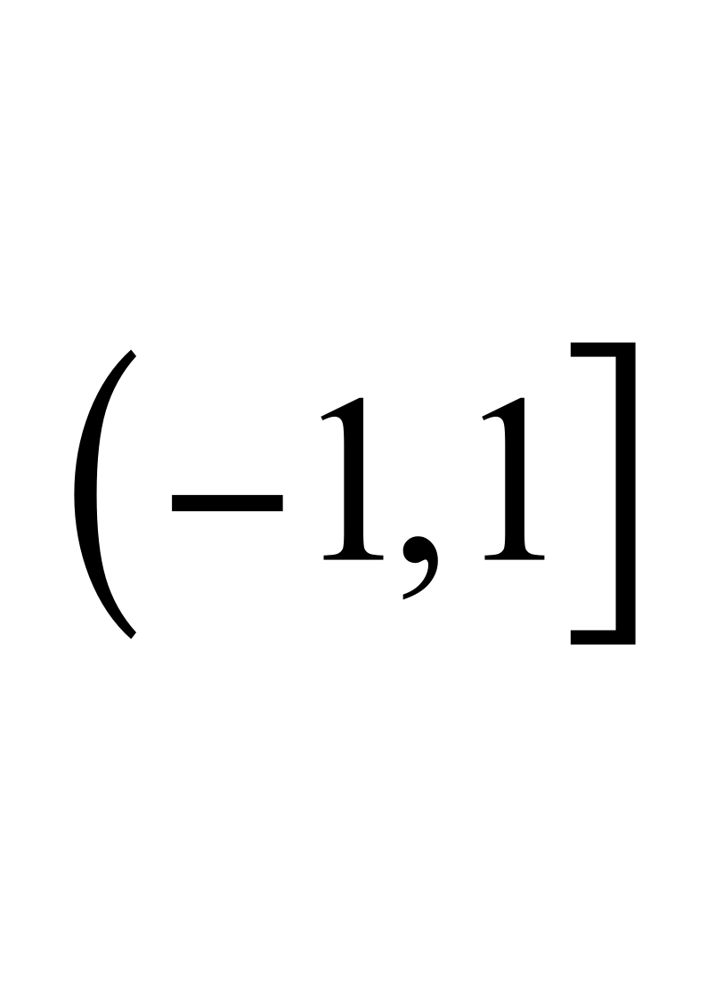
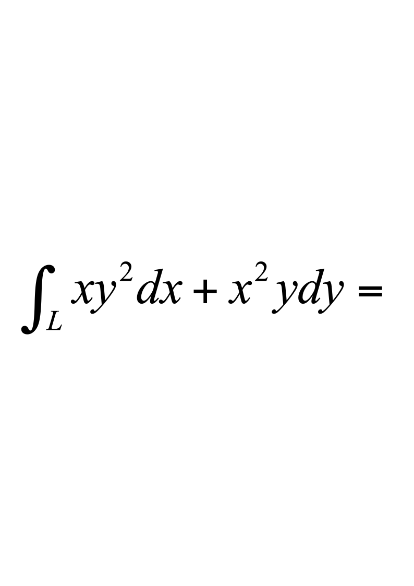
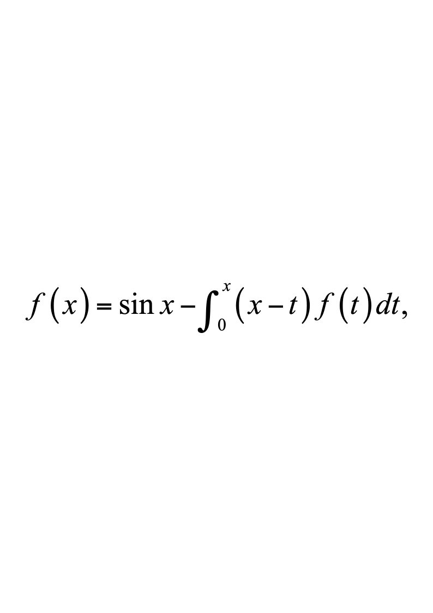

# 2014级软件 工科数学分析下B

**诚信应考，考试作弊将带来严重后果！**

**华南理工大学本科生期末考试**

**《工科数学分析》2014—2015学年第二学期期末考试试卷（B）卷**

**注意事项：1.** **开考前请将密封线内各项信息填写清楚；**

**2.** **所有答案请直接答在试卷上(或答题纸上)；**

**3．考试形式：闭卷；**

**4.** **本试卷共** **5个  大题，满分100分，**	**考试时间120分钟**。

| **题 号** | **一** | **二** | **三** | **四** | **五** | **总分** |
|---|---|---|---|---|---|---|
| **得 分** |  |  |  |  |  |  |

**一、填空题**（每小题4分，共20分）
  - 微分方程$y''-y=2xe^x$的特解形式为                                    ；
  - 设由方程$f(x-y,y-z,z-x)=0$确定了$z=z(x,y)$，其中$f$有连续的偏导数，则

$dz=$                                     ；
  - 交换积分的顺序，则$\int_0^1dy\int_{y^2}^yf(x,y)dx=$                              ；
  - 设$f(x)$是周期为$2$的周期函数，它在区间上的表达式为$f(x)=\begin{cases}3,&-1<x\leq0\\x^3,&0<x\leq1\end{cases}$，则$f(x)$的Fourier级数在$x=1$处收敛于              ；
  - 设$L:|x|+|y|=1,$取逆时针方向，则              ．

二、**计算题**（每小题10分，共40分）

1.  设$z=f\left(2x,\frac{y}{x}\right),$其中$f$具有二阶连续的偏导数，求$\frac{\partial^2z}{\partial x\partial y}$。

2.    计算三重积分$I=\iiint_{\Omega}zdxdydz,$，其中是由球面$x^2+y^2+z^2=4$与抛物面$x^2+y^2=3z$所围成的区域。

3.  计算曲线积分$I=\int_L\frac{-ydx+xdy}{x^2+4y^2}$，其中$L$是从$A(-\pi,0)$沿曲线$y=\cos\frac{x}{2}$到$B(\pi,0)$的有向曲线弧段。

4.    设是锥面$z=\sqrt{x^{2}+y^{2}}$被平面$Z=0$及$z=1$所截部分的下侧，计算曲面积分$I=\iint_{\Sigma}2x\,dy\,dz+3y\,dz\,dx+(z^2-5z)\,dx\,dy$。

三、**解答题**（每小题10分，共20分）

1.    求幂级数$\sum_{n=1}^\infty\frac{2n-1}{n!}x^{2n}$的和函数。

2.  设，其中$f(x)$为连续函数，求$f(x)$。

四、**证明题**（本题10分）

证明：级数$\sum_{n=1}^{\infty}\frac{\sin(nx)}{n^{2}}$在$(-\infty,+\infty)$上一致收敛。

五、**应用题**（本题10分）

求椭球面$x^{2}+y^{2}+\frac{z^{2}}{4}=1$在第一卦限的一点，使该点处的切平面在三个坐标轴上的截距平方和最小。
