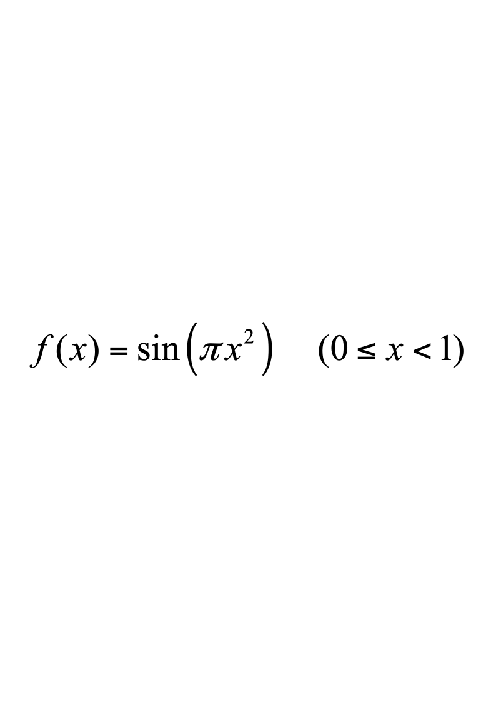
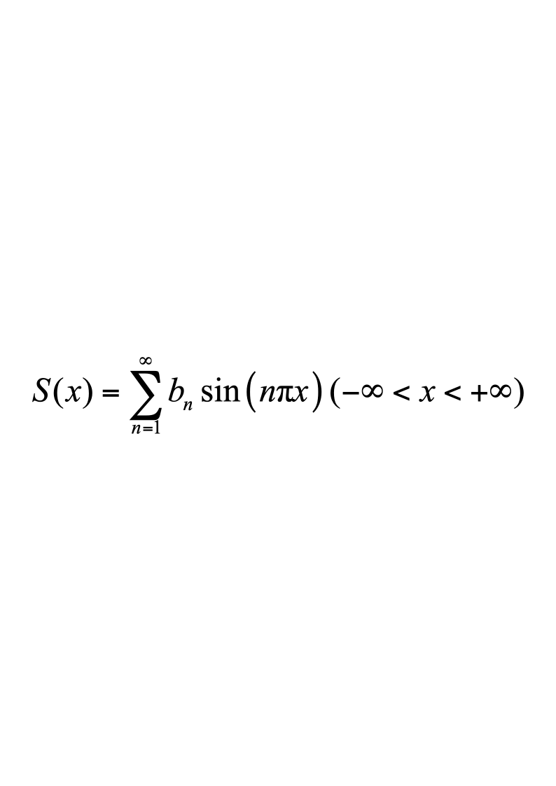
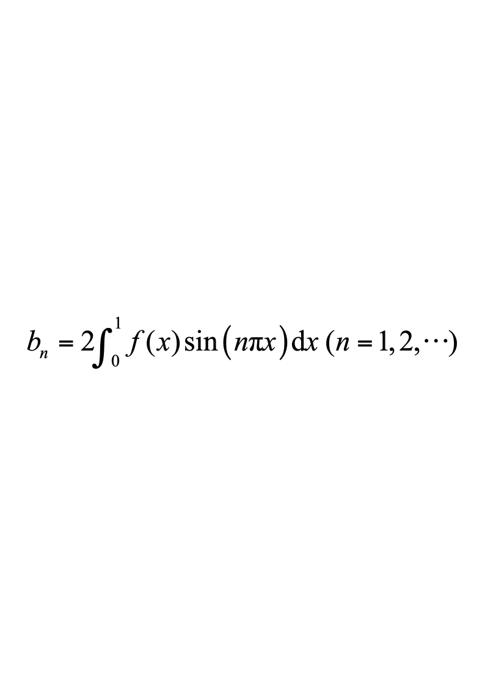
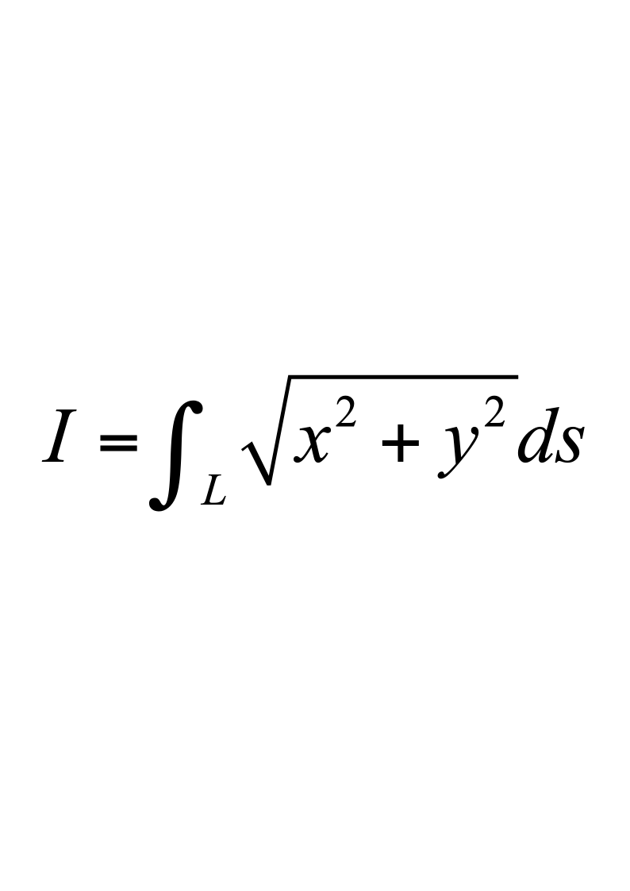
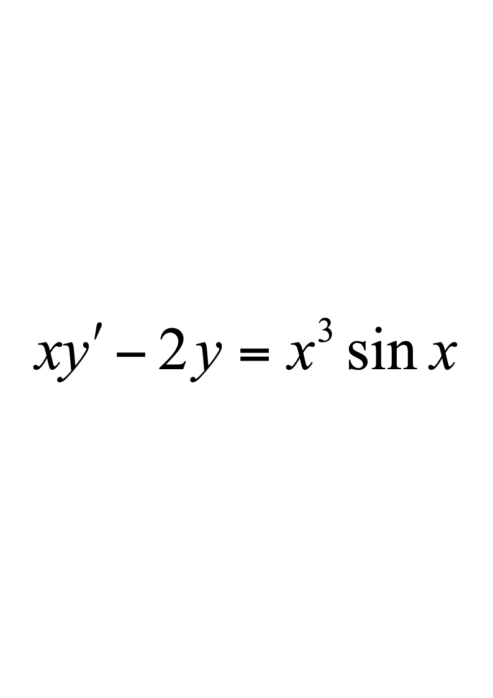
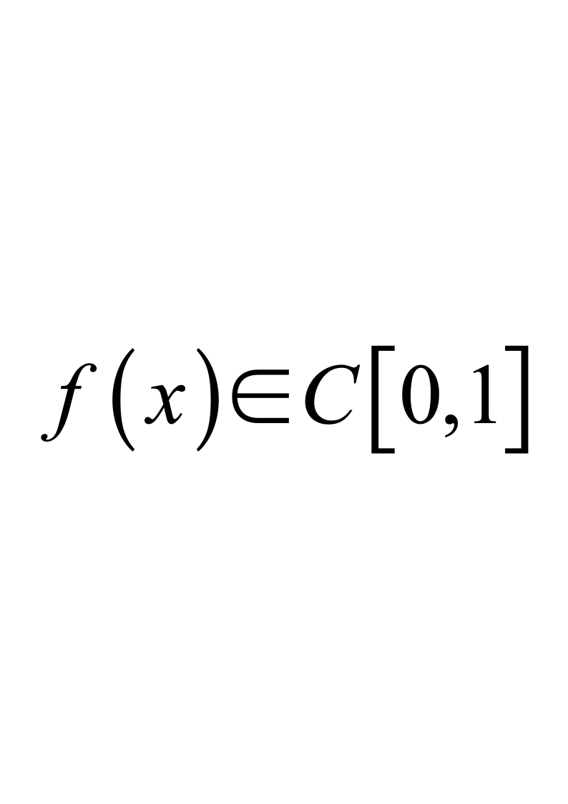

# 2015级软件 工科数学分析下A

**诚信应考，考试作弊将带来严重后果！**

**华南理工大学本科生期末考试**

**《工科数学分析》2015—2016学年第二学期期末考试试卷（A）卷**

**注意事项：1.** **开考前请将密封线内各项信息填写清楚；**

**2.** **所有答案请直接答在试卷上(或答题纸上)；**

**3．考试形式：闭卷；**

**4.** **本试卷共** **5个  大题，满分100分，**	**考试时间120分钟**。

| **题 号** | **一** | **二** | **三** | **四** | **五** | **总分** |
|---|---|---|---|---|---|---|
| **得 分** |  |  |  |  |  |  |

**一、填空题**（每小题3分，共15分）
  - 设$y_1=3,y_2=3+x^2,y_3=3+x^2+e^x$都是方程$(x^2-2x)y''-(x^2-2)y'+(2x-2)y=6x-6$的解,则该方程的通解为                                     ；
  - 设由方程$F(x-y,y-z,z-x)=0$确定了$z=z(x,y),$其中可微，则

$dz=$                                             ；
  - 函数$f(x,y,z)=\ln(x^2+y^2+z^2)$在点$P(2,0,1)$处沿梯度方向的方向导数

是                               ；
  - 设$L:\frac{x^{2}}{a^{2}}+\frac{y^{2}}{b^{2}}=1,$取顺时针方向，则$\int_L(x-y)dx+(x+y)dy=$              ；
  - 设，而，其中，则$S\left(-\frac{1}{2}\right)\equiv$               ；

二、**计算题**（每小题8分，共40分）

1.  设函数$z=f(x^2-y^2,2xy)$，其中$f(\xi,n)$具有连续的二阶偏导数，且满足$\frac{\partial^2f}{\partial\xi^2}+\frac{\partial^2f}{\partial\eta^2}=0,$  求    $\frac{\partial^2z}{\partial x^2}+\frac{\partial^2z}{\partial y^2}$。

2.    计算曲线积分，其中$L$是由圆周$x^{2}+y^{2}=ax$。

3.  设$f(x)$在$(-\infty,+\infty)$内有连续导数，$L$是从点$A\left(3,\frac{2}{3}\right)$到点$B(1,2)$的直线段，计算曲线积分$I=\int_L\frac{1+y^2f(xy)}{y}dx+\frac{x}{y^2}[y^2f(xy)-1]dy$。

4．设为曲面$x^{2}+y^{2}+z^{2}=2ax\left(a>0\right)$，计算曲面积分$I=\iint_{\Sigma}\left(x^2+y^2+z^2\right)dS$。

5.    设是上半球面$z=\sqrt{a^{2}-x^{2}-y^{2}}\quad(a>0)$，取上侧，计算曲面积分$I=\iint_{\Sigma}x^{3}\mathrm{d}y\mathrm{d}z+y^{3}\mathrm{d}z\mathrm{d}x+z^{3}\mathrm{d}x\mathrm{d}y$。

三、**解答题**（每小题9分，共18分）

1.    求幂级数$\sum_{n=1}^{\infty}\frac{2n+1}{n!}x^{2n}$的和函数。

2.  求微分方程的通解。

四、**证明题**（每小题9分，共18分）
1. 设，求证：$\int_0^1dx\int_x^1f(x)f(y)dy=\frac{1}{2}\left[\int_0^1f(x)dx\right]^2$。

2．证明：函数项级数$\sum_{n=1}^\infty\frac{\cos(nx)}{n^2}$在$(-\infty,+\infty)$上一致收敛。

五、应用题（本题9分）

求内接于半径为$a$的球且有最大体积的长方体。
