# 2016级工科数学分析试卷A

**诚信应考，考试作弊将带来严重后果！**

**华南理工大学本科生期末考试**

**《工科数学分析（二）》2016-2017学年第二学期期末考试试卷A卷**

**注意事项：1.** **开考前请将密封线内各项信息填写清楚；**

**2.** **所有答案请直接答在试卷上；**

**3．考试形式：闭卷；**

**4.** **本试卷共5大题，满分100分，考试时间120分钟**。

| **题 号** | **一** | **二** | **三** | **四** | **五** | **总分** |
|---|---|---|---|---|---|---|
| **得 分** |  |  |  |  |  |  |

- **填空题：共5题，每题2分，共10分.**
1. 函数$f(x,y)=2x^{2}+y^{2}$在点$(1,1)$处沿该点的梯度方向的方向导数为                ;
1. 向量场$(2x-3y)i+(3x-z)j+(y-2x)k$的旋度向量为                             ;
1. 设表示球面$x^2+y^2+z^2=R^2$的外侧，则第二类曲面积分

$\iint_{\Sigma}xdydz+ydzdx+zdxdy=$                ;
1. 初值问题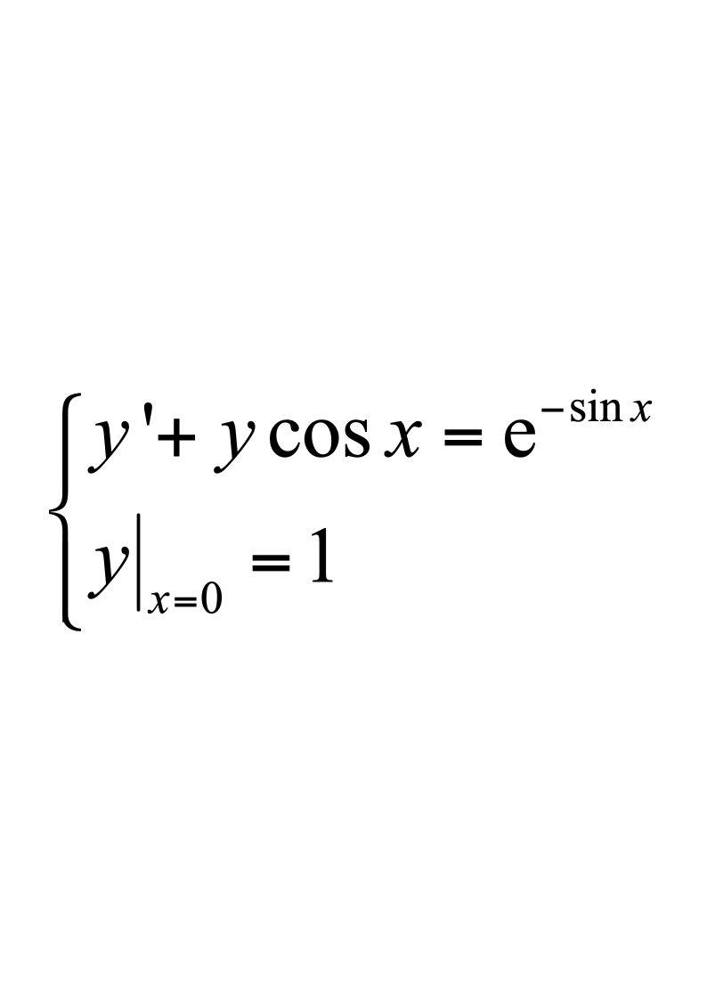的解为                           ;
1. 设$f(x)$是周期为$2$的周期函数，它在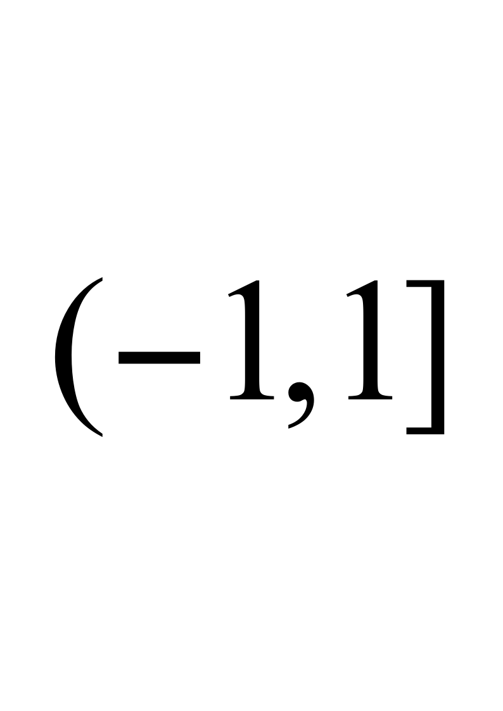上的表达式$f(x)=\begin{cases}2,&-1<x<0\\x^{3}+1,&0<x<1\end{cases}$则$f(x)$的傅里叶(Fourier)级数在$x=0$处收敛于                  .
- **单选题（每题只有一个正确选项）：共5题，每题2分，共10分.**
1. 二元函数$f(x,y)=\begin{cases}\frac{xy}{x^{2}+y^{2}},&(x,y)\neq(0,0)\\0,&(x,y)=(0,0)\end{cases}$在点$(0,0)$处（         ）;

| A.  连续，偏导数存在 | B.  不连续，偏导数存在 |
|---|---|
| C.  连续，偏导数不存在 | D.  不连续，偏导数不存在 |

1. 曲线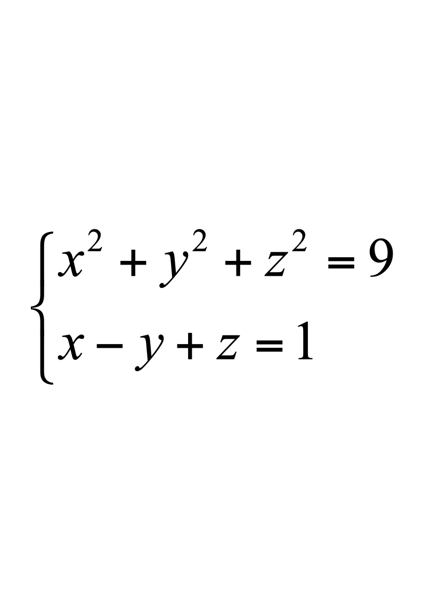在点$M(1,2,2)$处的切线一定平行于（     ）;

A.  平面				B.  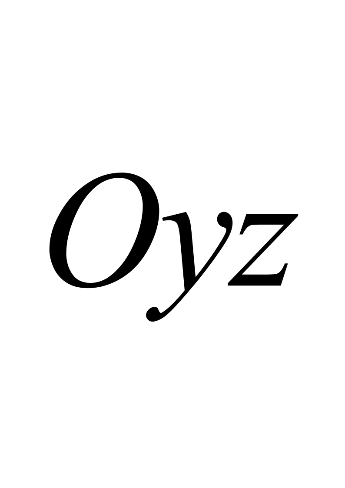平面						C.  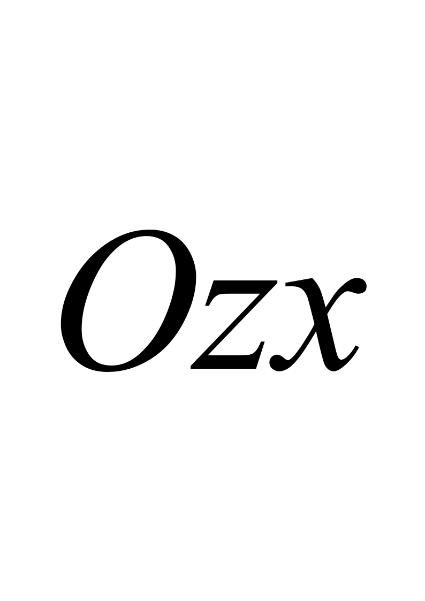平面				D.  平面$x-y+z=1$
1. 设是一个有界的平面闭区域，其边界曲线$\Gamma$分段光滑，则下列积分值**不等于**区域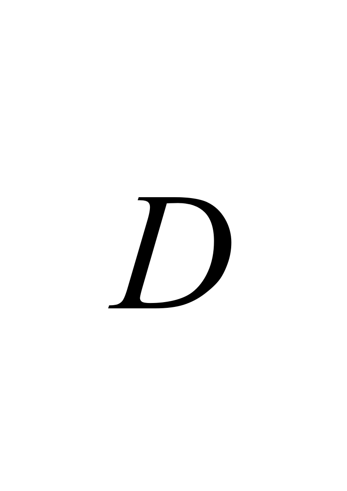的面积的是（     ）;

A.  $\int_{\Gamma}ydx$			B.  $\frac{1}{2}\int_{\Gamma}xdy-ydx$		C.  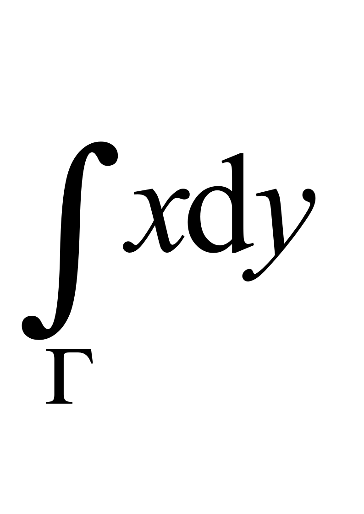		D. $\iint_D1dxdy$
1. 关于未知函数$y$的微分方程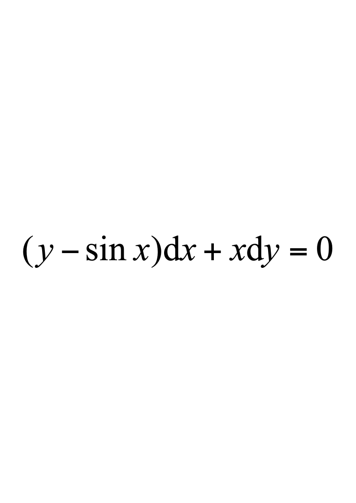是（     ）;

| A.  可分离变量方程 | B.  一阶非齐次线性方程 |
|---|---|
| C.  一阶齐次线性方程 | D.  非线性方程 |

1. 使得级数$\sum_{n=1}^{\infty}\frac{(-1)^n}{n^p}$条件收敛的常数$p$的取值范围是（      ）.

A.  $p?0$			B.  $0<p<1$			C.  $0<p?1$		D.  $p>1$
- **计算题：共4题，每题7分，共28分.**
1. 设函数$u=f(x,y,z)$有连续的偏导数，函数$y=y(x)$和$z=z(x)$分别由方程$e^{xy}=y$和$e^z=xz$确定，计算$\frac{du}{dx}$.
1. 计算累次积分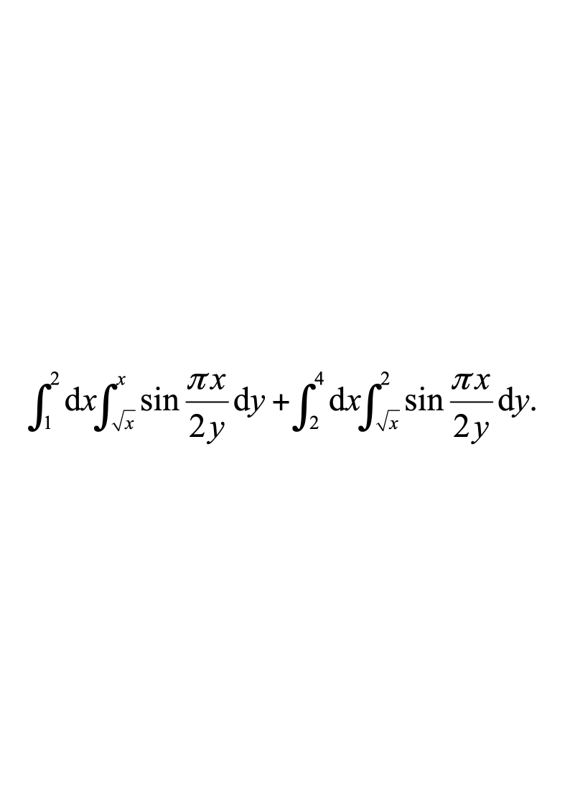
1. 计算三重积分$\iiint_{\Omega}zdxdydz$，其中是由上半球面$x^2+y^2+z^2=R^2,z>0,R>0$和锥面$z=\sqrt{x^{2}+y^{2}}$所围成的闭区域.
1. 计算第二类曲线积分$\int_{\Gamma}xy^2dy-x^2ydx$，其中$\Gamma$为椭圆$\frac{x^2}{4}+y^2=1$取逆时针方向.
- **解答题：共4题，每题8分，共32分**
1. 设二阶常系数线性微分方程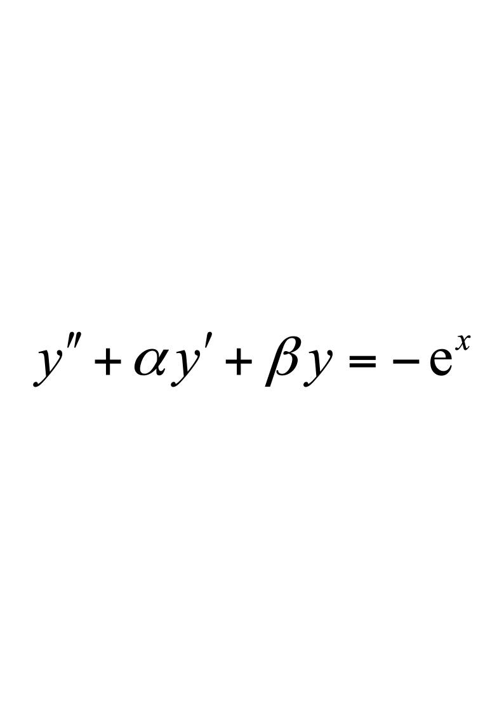的一个特解为$y=(1+x)e^x$，试确定常数$\alpha,\beta,$并求该方程的通解.
1. 已知螺旋形弹簧一圈的方程为：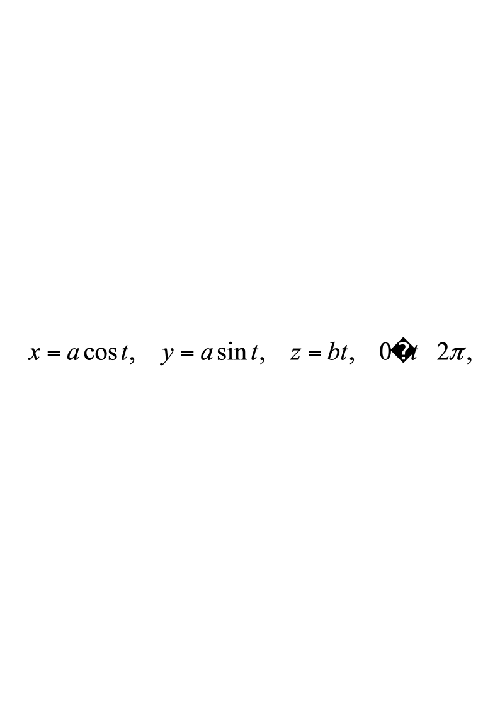其中$a,b$为大于零的常数，且弹簧上各点处的线密度等于该点到平面的距离，求此弹簧的质心坐标.
1. 求上半球面$x^2+y^2+z^2=a^2,z>0$被柱面$x^{2}+y^{2}=ax$截下的部分的面积.
1. 将函数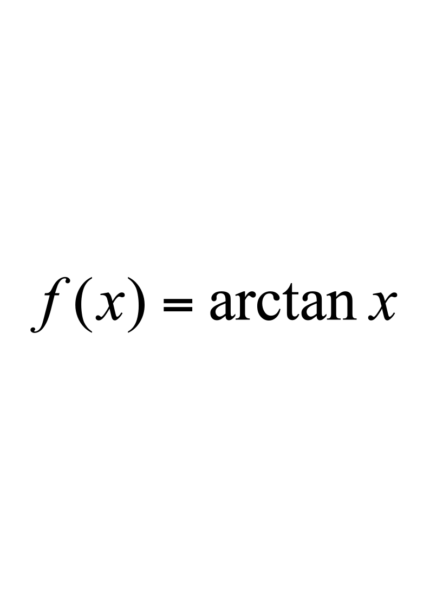展开为$x$的幂级数.

<!-- question: engineering-mathematical-analysis-2-024-Q1 -->

四、**证明题：共2题，每题6分，共12分.**
1. 设函数$f(\xi,\eta)$具有连续的二阶偏导数，且满足$\frac{\partial^2f}{\partial\xi^2}+\frac{\partial^2f}{\partial\eta^2}=0$.

证明：函数$z=f(x^2-y^2,2xy)$满足$\frac{\partial^2z}{\partial x^2}+\frac{\partial^2z}{\partial y^2}=0$.
1. 证明：函数项级数$\sum_{n=0}^{\infty}(1-x)x^n$在区间$(0,1)$上点态收敛，但不一致收敛.

**五、应用题：共1题，共8分.**

求曲线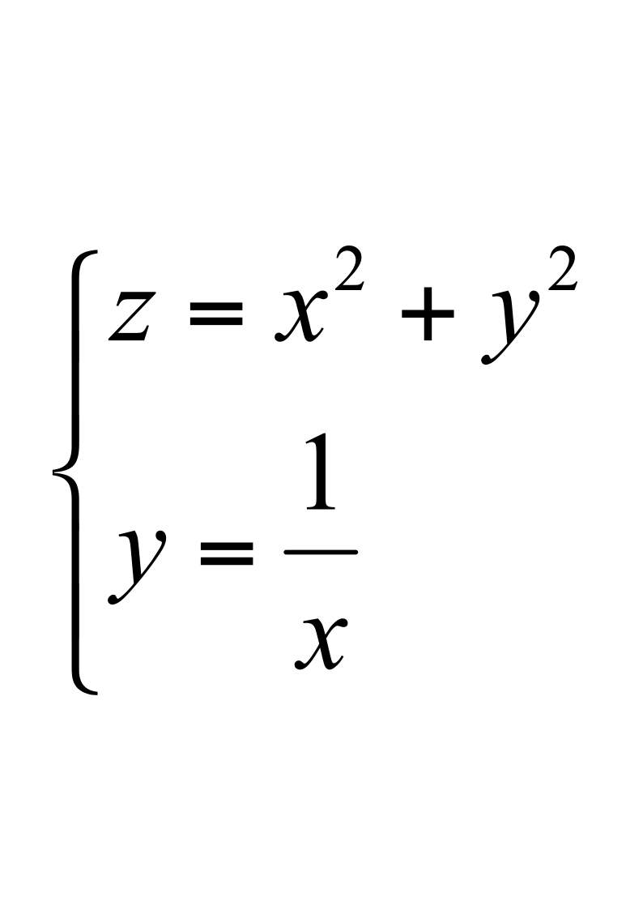上到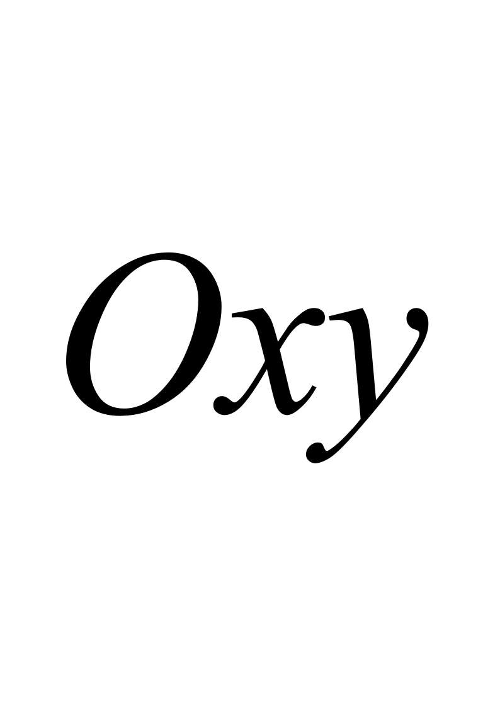平面距离最近的点.
