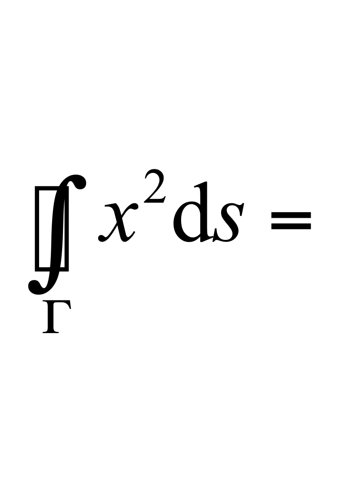
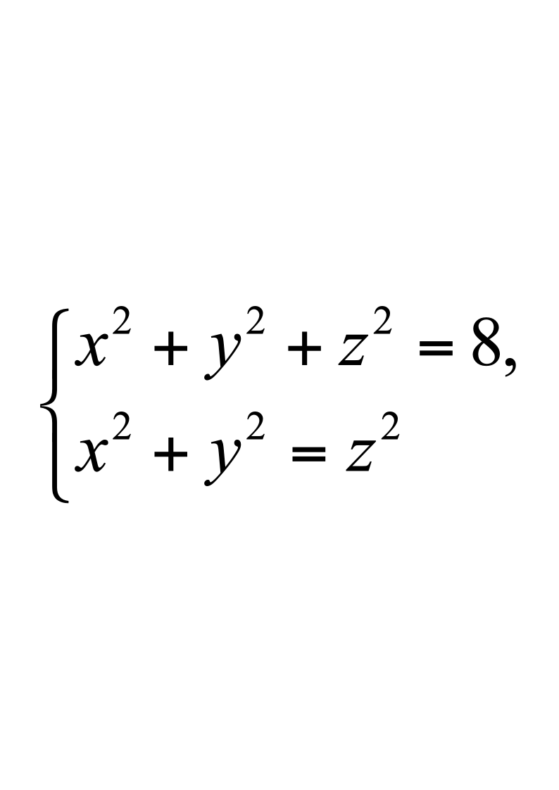
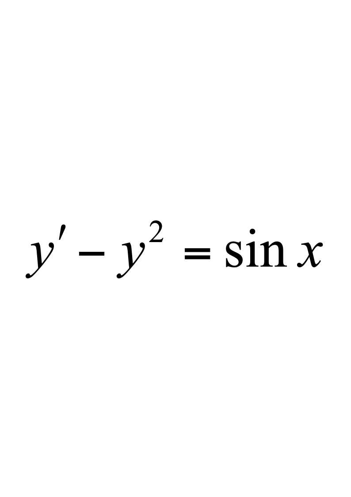
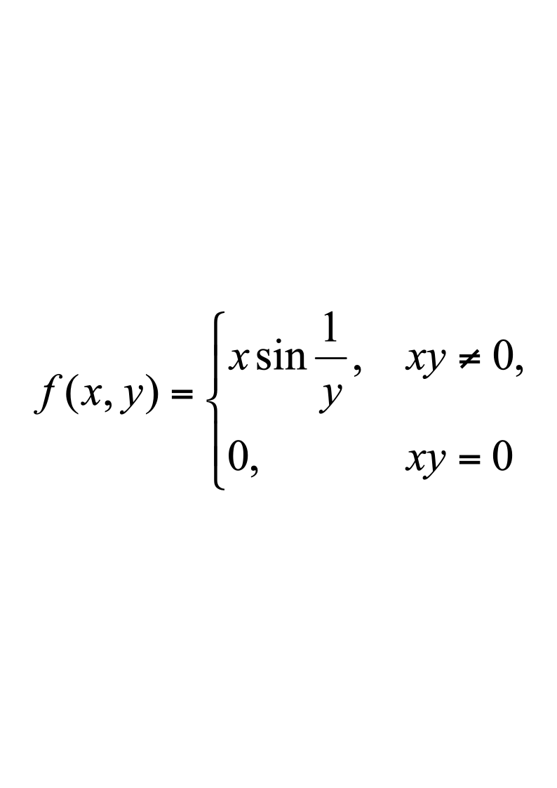
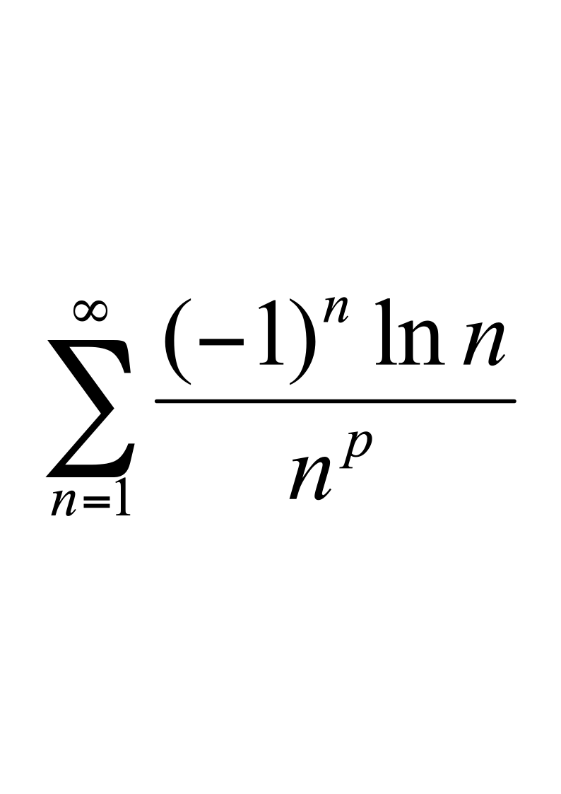
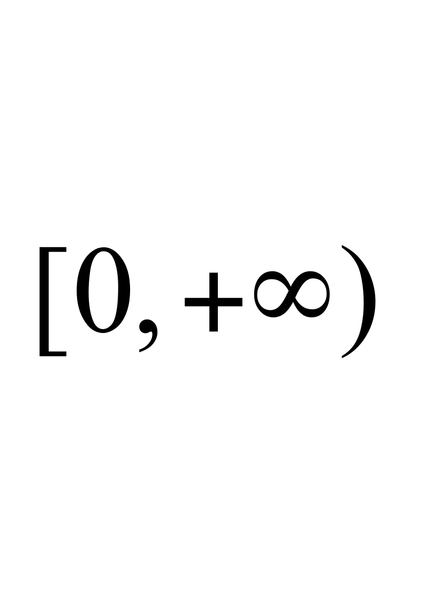
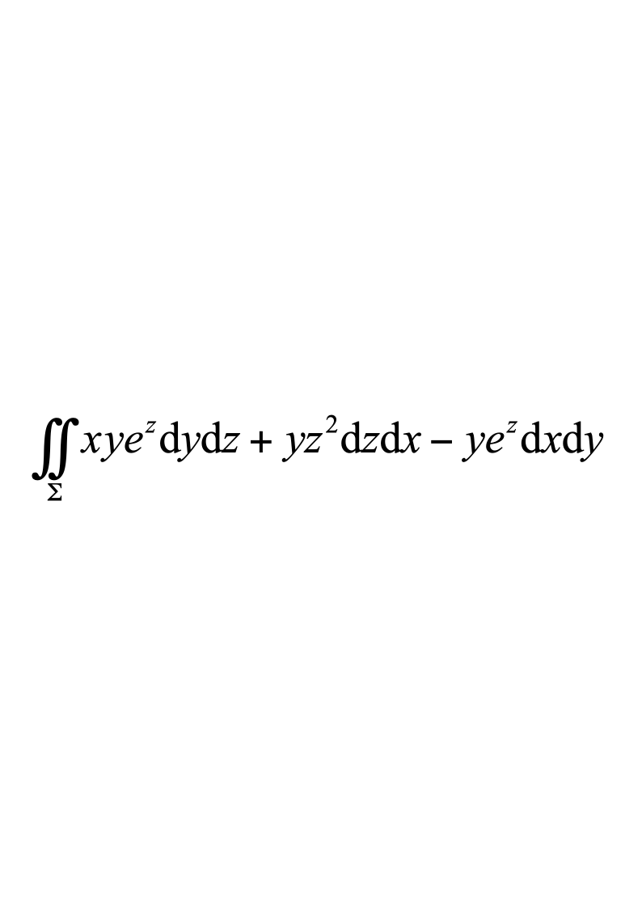
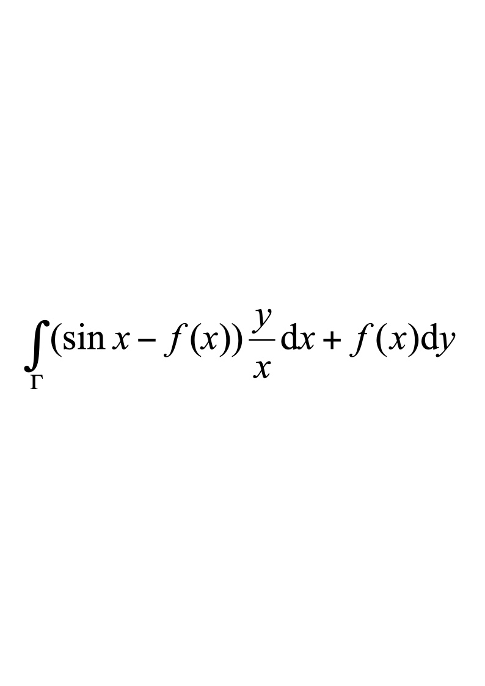
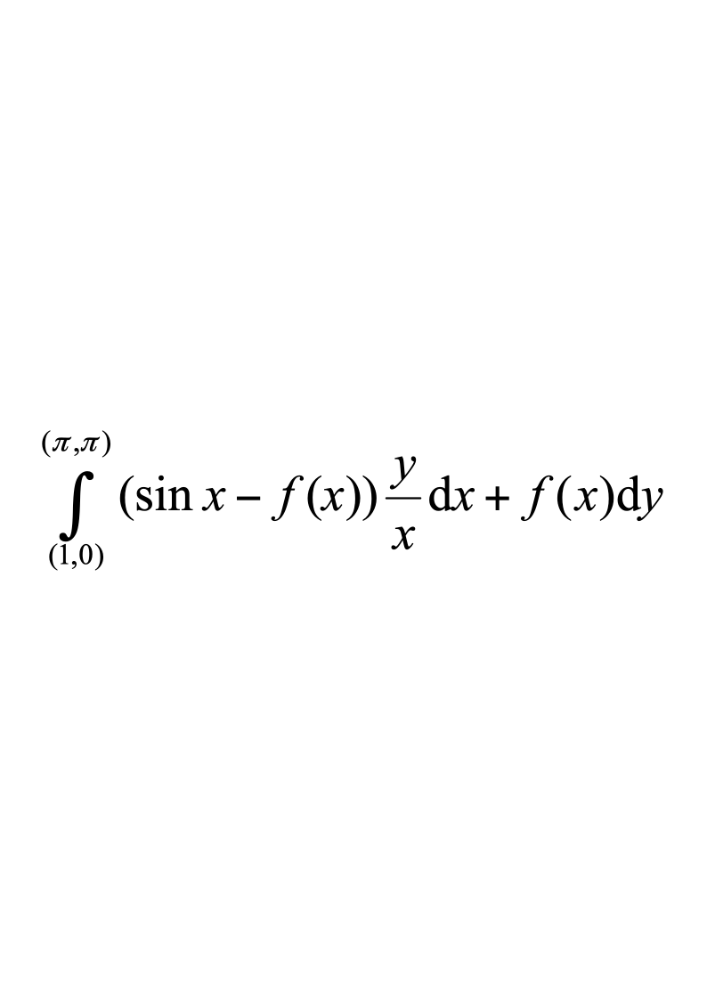

# 2017级工科数学分析期末试卷A

**诚信应考，考试作弊将带来严重后果！**

**华南理工大学本科生期末考试**

**《工科数学分析（二）》A卷**

**2017-2018学年第二学期**

**注意事项：1.** **开考前请将密封线内各项信息填写清楚；**

**2.** **所有答案请直接答在试卷上；**

**3．考试形式：闭卷；**

**4.** **本试卷共6大题，满分100分，考试时间120分钟**。

| **题 号** | **一** | **二** | **三** | **四** | **五** | **六** | **总分** |
|---|---|---|---|---|---|---|---|
| **得 分** |  |  |  |  |  |  |  |

评阅教师请在试卷袋上评阅栏签名

**一、填空题：共5题，每题2分，共10分。**
1. 微分方程$y''+y'-2y=1-2x$的通解为                          ;
1. 设函数$u=\ln(x^2+y^2+z^2)$,  求$div(gradu)=$                              ;
1. 设$\Gamma$是球面$x^2+y^2+z^2=R^2$与平面$x+y+z=0$的交线,  则第一类曲线积分                   ;
1. 曲线在点$(1,\sqrt{3},2)$处的切线方程为                                         ;
1. 设周期为$2\pi$的函数$f(x)=\begin{cases}-1,&-\pi<x<0,\\1,&0<x<\pi,\end{cases}$ 则$f(x)$的傅里叶(Fourier)级数在$x=\pi$处收敛于                 .

**二、选择题：共5题，每题2分，共10分。**
1. 下列微分方程为二阶微分方程的是(     )

A.  $(y'')^2+x^2y'+x^2=0$;				B.  $(y')^2+3xy=y^2$;

C.  $xy'''+y''+x^2y=0$;				D.  .
1. 二元函数,  则$\lim_{(x,y)\to(0,0)}f(x,y)$(     )

A.  不存在; 						B.  等于1;

C.  等于0; 						D.  等于2.
1. 设函数$z=f(x,y)$在$(a,b)$的某个邻域内有直到二阶的连续偏导数,  且$\frac{\partial z}{\partial x}(a,b)=0$,  $\frac{\partial z}{\partial y}(a,b)=0$,  记$A=\frac{\partial^{2}z}{\partial x^{2}}(a,b),B=\frac{\partial^{2}z}{\partial x\partial y}(a,b),C=\frac{\partial^{2}z}{\partial y^{2}}(a,b).$ 则函数$z=f(x,y)$在点$(a,b)$取极大值的充分条件是(     )

A.  $A>0,AC>B^2$;					B.  $A<0,AC>B^2$;

C.  $A>0,AC<B^2$;					D.  $A<0,AC<B^2$.
1. 曲面$z=F(x,y,z)$在点$(x,y,z)$处的一个法向量为(     )

A.  $(F_x,F_y,F_z-1)$;					B.  $-F_x,-F_y,1$;

C.  $(F_x,F_y,F_z)$;						D.  $(F_x-1,F_y-1,F_z-1)$.
1. 使得级数条件收敛的常数$p$的取值范围是(     )

A.  $p?0$;							B.  $0<p<1$;

C.  $0<p?1$;						D.  $p>1$.

**三、计算题：共3题，每题8分，共24分。**
1. 设$u=f(x,y,z)$,  其中函数$f$有二阶连续的偏导数,  且$z=z(x,y)$由方程$z^{5}-5xy+5z=1$所确定,  求$\frac{\partial u}{\partial x}$和$\frac{\partial^2u}{\partial x^2}$.

2.  计算累次积分$\int_{\frac{1}{4}}^{\frac{1}{2}}dx\int_{\frac{1}{2}}^{\sqrt{x}}e^{\frac{x}{y}}dy+\int_{\frac{1}{2}}^{1}dx\int_{x}^{\sqrt{x}}e^{\frac{x}{y}}dy.$

3.  计算三重积分$\iiint_\Omega(x^2+y^2+z^2)dxdydz$,  其中为球面$x^{2}+y^{2}+z^{2}=2z$围成的区域.

**四、证明题：共1题，每题1分，共8分。**

证明函数项级数$\sum_{n=0}^{\infty}x^{2}e^{-nx}$在一致收敛.

**五、简答题：共4题，每题10分，共40分。**

1.  求曲面$x^{2}+y^{2}+z^{2}=4z$在抛物面$z=x^2+y^2$内的部分的面积.

2.设是锥面$z=\sqrt{x^{2}+y^{2}}$被平面$Z=0$及$z=1$截下的部分的下侧,计算第二类曲面积分.

3.  设曲线积分与路径无关,  其中$f(x)$有一阶连续导数且$f(\pi)=1$,  求$f(x)$并计算曲线积分.

4.  求幂级数$\sum_{n=0}^{\infty}\frac{1}{2n+1}x^{2n+1}$的收敛域及和函数.

<!-- question: engineering-mathematical-analysis-2-026-Q1 -->

六、**应用题：共1题，每题8分，共8分。**

将长度为$a$的铁丝分成三段,  分别围成一个正方形、一个圆形和

一个正三角形,  求三个图形面积之和的最大值.
