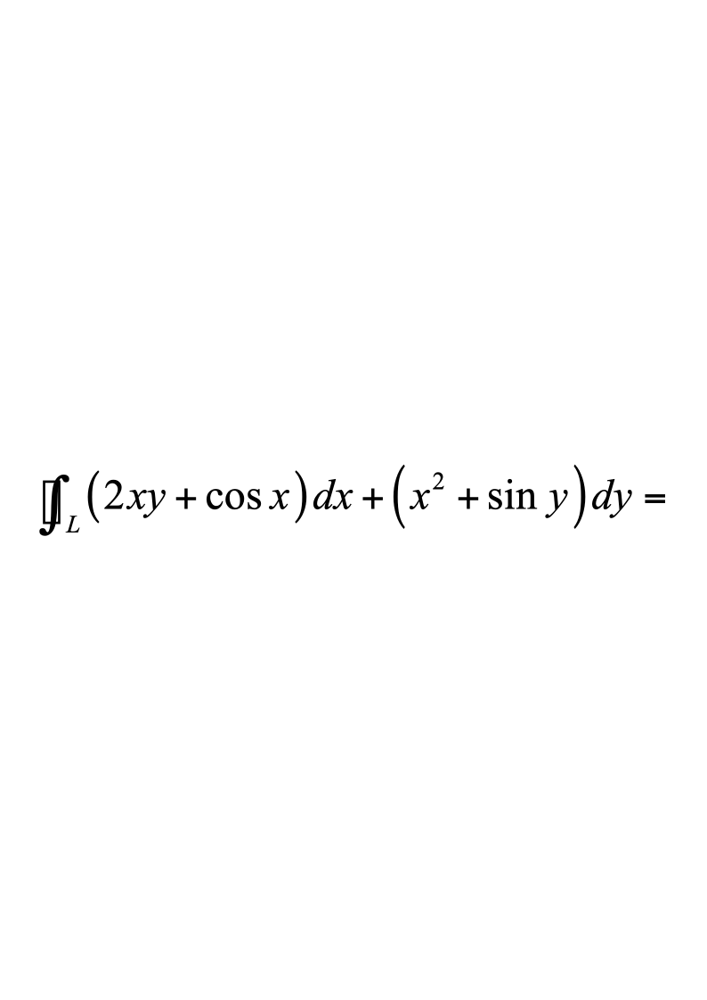
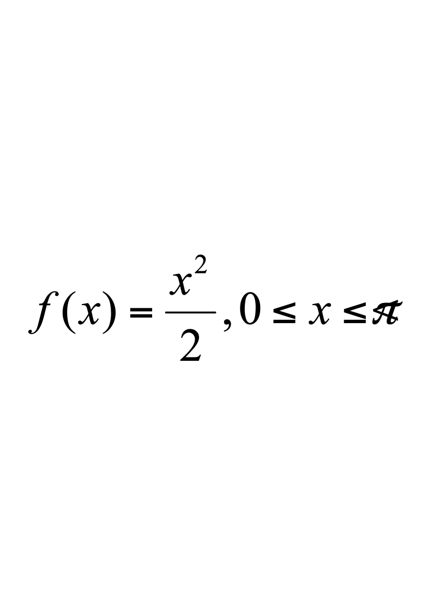
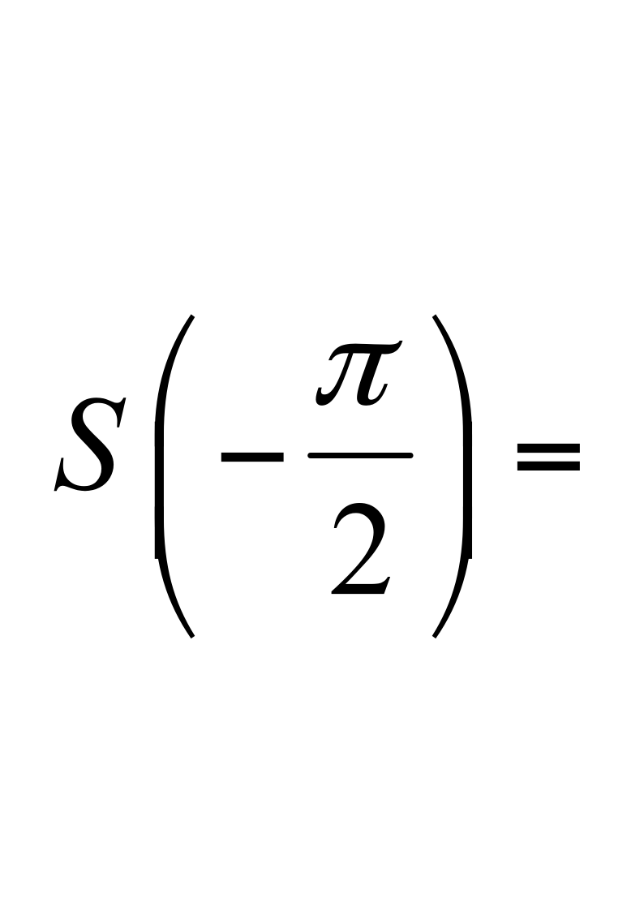
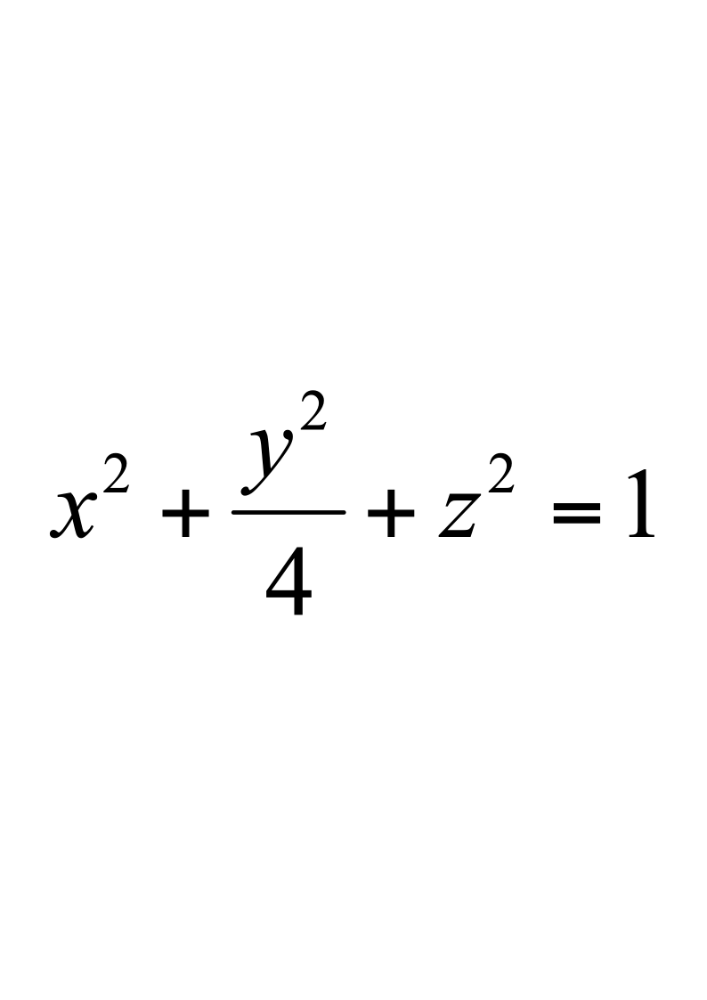
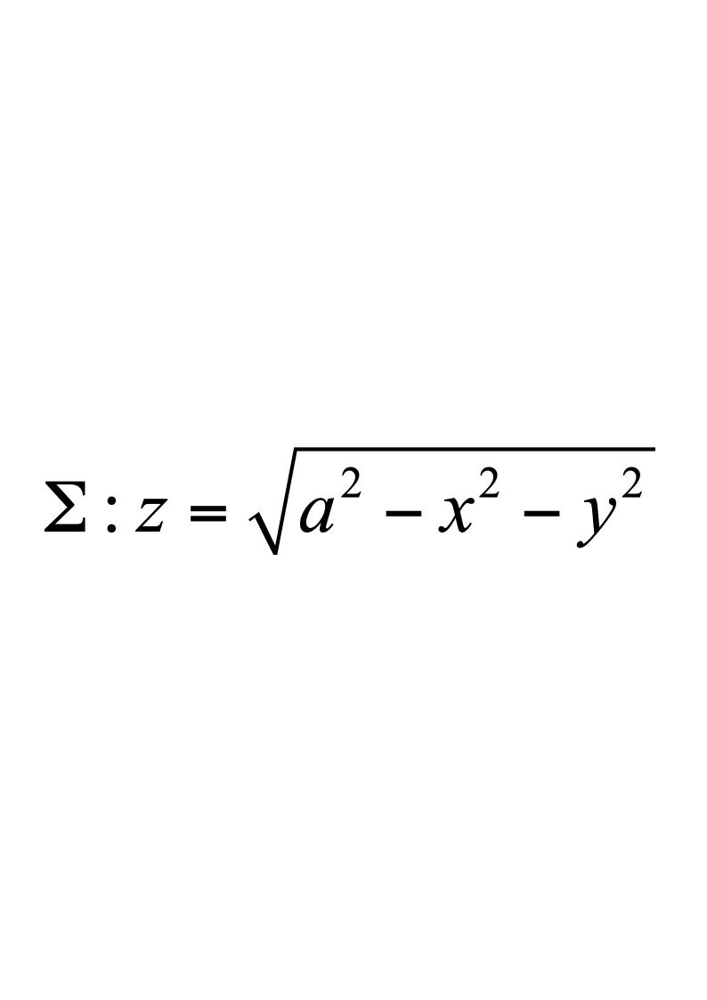
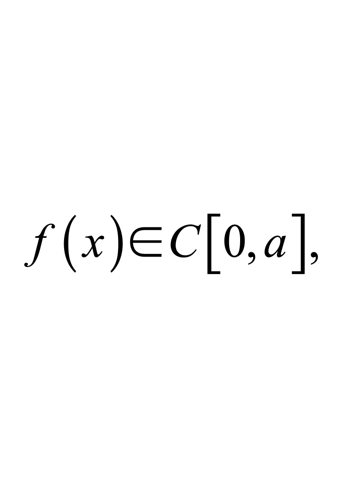

# 2018级工科数学分析（二）A

**诚信应考，考试作弊将带来严重后果！**

**华南理工大学本科生期末考试**

**《工科数学分析（二）》A卷**

**2018-2019学年第二学期**

**注意事项：1.** **开考前请将密封线内各项信息填写清楚；**

**2.** **所有答案请直接答在试卷上；**

**3．考试形式：闭卷；**

**4.** **本试卷共5大题，满分100分，考试时间120分钟**。

| **题 号** | **一** | **二** | **三** | **四** | **五** | **总分** |
|---|---|---|---|---|---|---|
| **得 分** |  |  |  |  |  |  |

评阅教师请在试卷袋上评阅栏签名

**一、填空题**（每小题3分，共15分）**.**
1. 微分方程$y''-y=2xe^x$的特解形式为$y^*=$                          ；
1. 设函数$u(x,y,z)=e^{x^2+y^2+z^2}$,  则$div(gradu)=$                              ；
1. 设$L$是任意一条光滑的闭曲线，取逆时针方向，则                  ；
1. 若级数$\sum_{n=1}^\infty\frac{(-1)^n(n+1)}{n^p}$条件收敛，则常数$p$的取值范围为                ；
1. 设，为$f(x)$的展成以$2\pi$为周期的正弦级数的和函数，则                 .

**二、计算题**（每小题8分，共32分）**.**
1. 设$z=f\left(\begin{array}{c}x,\frac{y^2}{x}\end{array}\right)$,  其中函数$f$有二阶连续的偏导数,求 $\frac{\partial^2z}{\partial x\partial y}$.

2.    计算三重积分$\iiint_{\Omega}\left(x+\frac{y}{2}-z\right)^2dxdydz$，其中是曲面所围成的区域.

3.    求密度均匀的曲面的质心坐标.

4.  求微分方程$y'cotx=ylny$的通解.

**三、解答题**（每小题10分，共30分）.

1.  设曲线积分$\int_Lxy^2dx+y\varphi(x)dy$与积分路径无关,  其中$\phi(x)$有一阶连续导数且$\varphi(0)=0$.求$\phi(x)$，并计算曲线积分$\int_{(0,0)}^{(1,1)}xy^2dx+y\varphi(x)dy$.

2.  计算$I=\iiint_{\Sigma}\frac{xdydz+ydzdx+zdxdy}{(ax^2+by^2+cz^2)^{3/2}},(a,b,c>0),\Sigma:x^2+y^2+z^2=1$，取外侧.

3.    求幂级数$\sum_{n=1}^{\infty}\frac{2n-1}{n!}x^{2n}$的收敛域及和函数.

**四、证明题**（每小题7分，共14分）**.**

1.    设证明：$2\int_{0}^{a}f(x)dx\int_{x}^{a}f(y)dy=\left[\int_{0}^{a}f(x)dx\right]^2$.

2.    证明函数项级数$\sum_{n=1}^\infty\frac{\arctan(nx)}{n^2}$在$(-\infty,+\infty)$上一致收敛.

**五、应用题**（本题9分）**.**

在椭圆$x^{2}+4y^{2}=4$的第一象限部分上求一点，使其到直线$2x+3y-6=0$的距离最短.
