# 2018级工科数学分析（二）B

**诚信应考，考试作弊将带来严重后果！**

**华南理工大学本科生期末考试**

**《工科数学分析（二）》B卷**

**2018-2019学年第二学期**

**注意事项：1.** **开考前请将密封线内各项信息填写清楚；**

**2.** **所有答案请直接答在试卷上；**

**3．考试形式：闭卷；**

**4.** **本试卷共5大题，满分100分，考试时间120分钟**。

| **题 号** | **一** | **二** | **三** | **四** | **五** | **总分** |
|---|---|---|---|---|---|---|
| **得 分** |  |  |  |  |  |  |

评阅教师请在试卷袋上评阅栏签名

**一、填空题**（每小题3分，共15分）**.**
1. 设函数,  则                           ；
1. 交换积分次序，则                              ；
1. 设曲线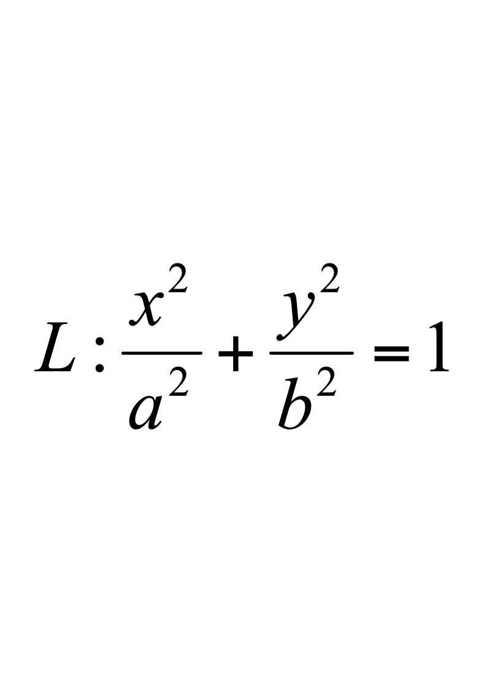，取顺时针方向，则           ；
1. 若级数条件收敛，则常数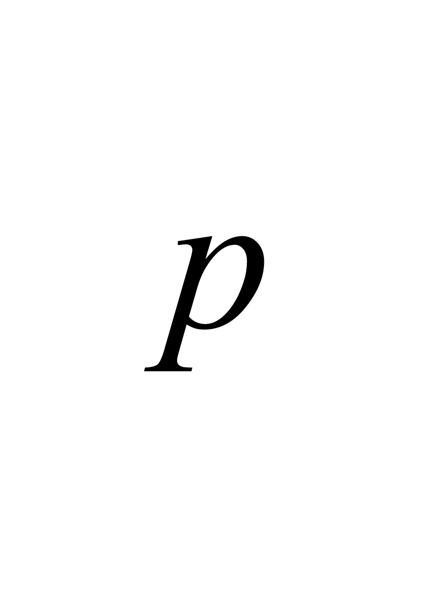的取值范围为                ；
1. 设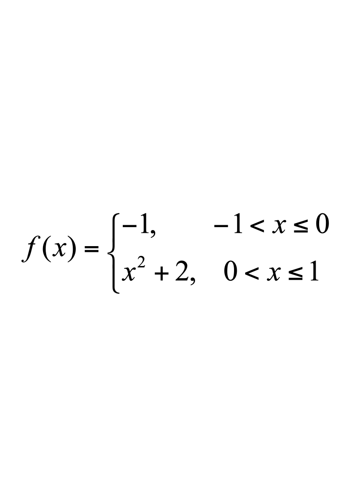，设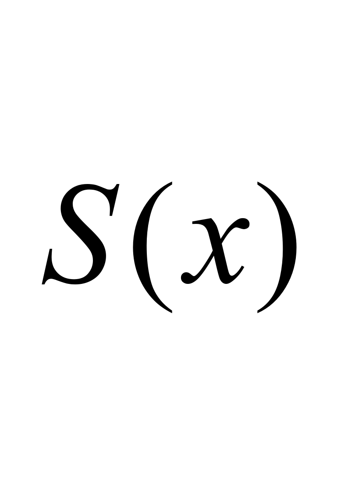为的展成以为周期的傅里叶（Fourier）级数的和函数，则                 .

**二、计算题**（每小题9分，共36分）**.**
1. 设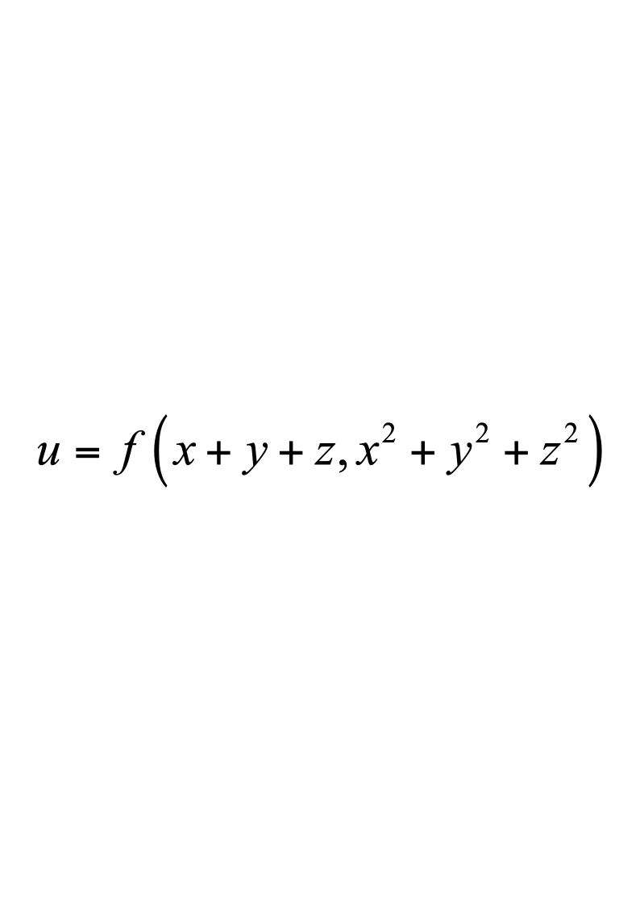,  其中函数有二阶连续的偏导数, 求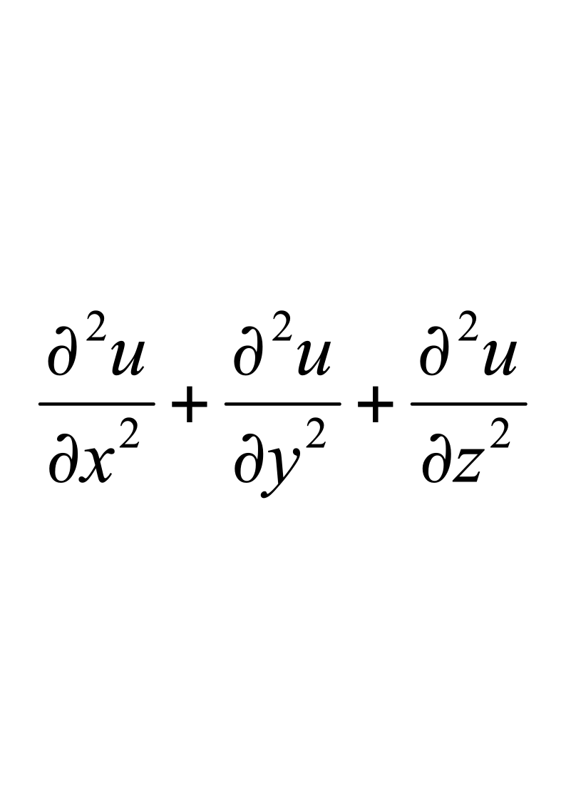.

2.    计算三重积分，其中是曲面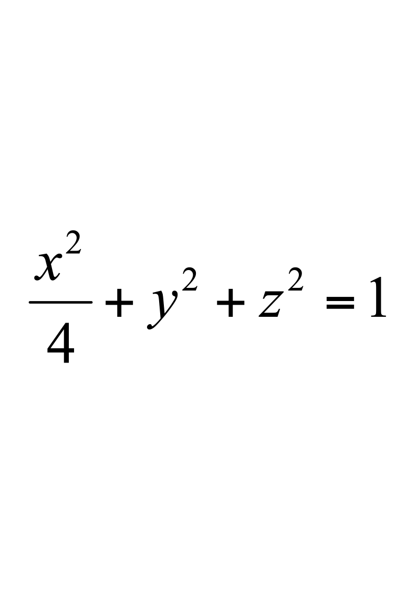所围成的区域.

3.    求抛物面的质量（的部分），其密度函数为.

4.  求微分方程的通解.

**三、解答题**（每小题10分，共30分）**.**

1.  设曲线积分与积分路径无关,  其中有一阶连续导数且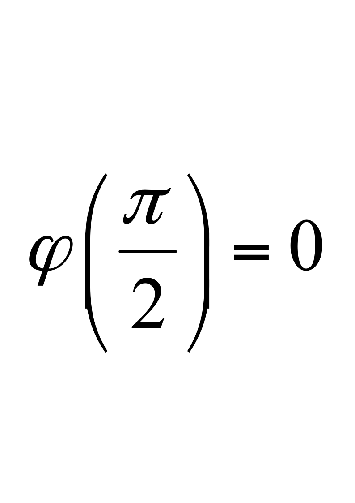,  求，并计算曲线积分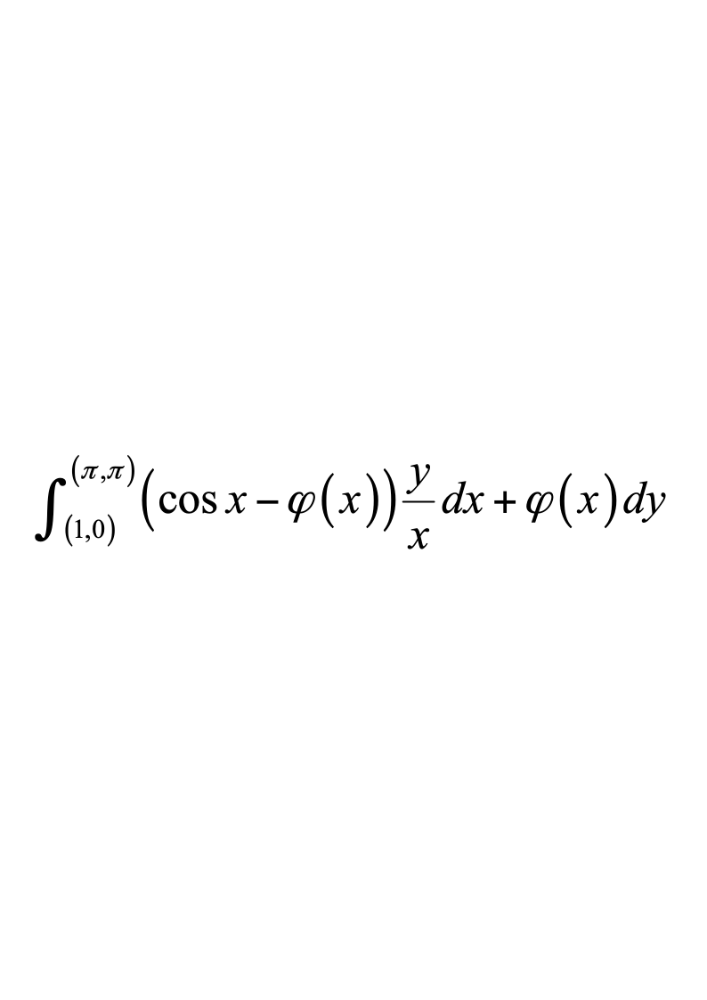.

2.  计算，为有界单连通区域的闭边界曲面，取外侧.

3.    求幂级数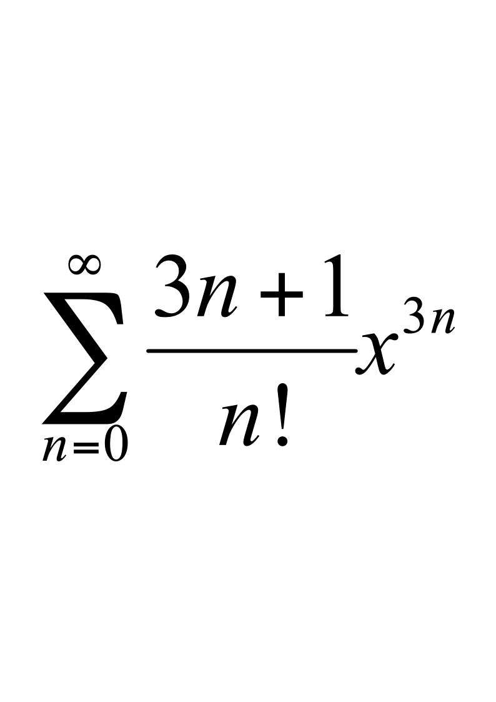的收敛域及和函数.

**四、证明题**（本题10分）**.**

证明函数项级数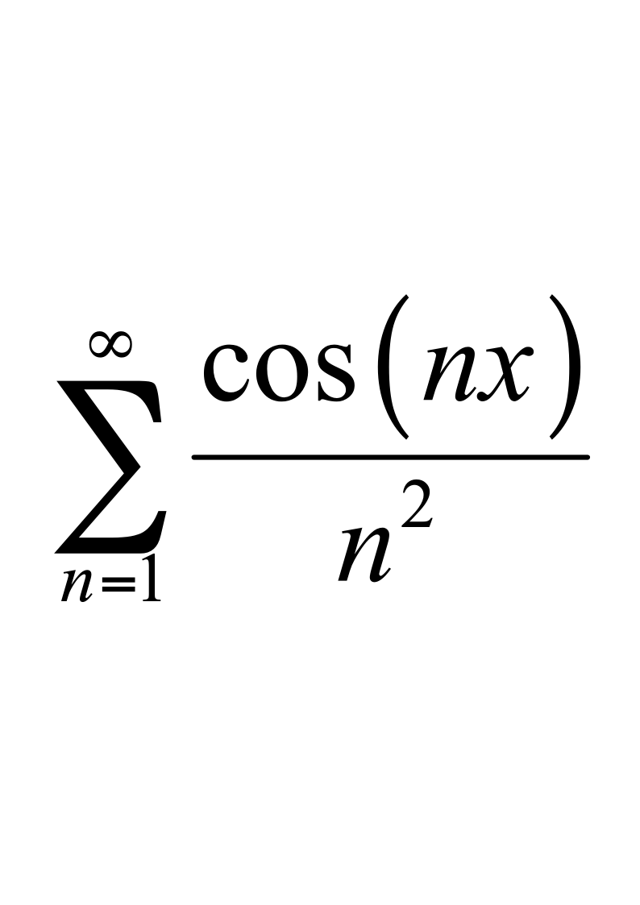在上一致收敛.

**五、应用题**（本题9分）**.**

欲造一无盖的长方体容器，已知底部造价为每平方米3元，侧面造价均为每平方米1元，现想用36元造一个容积最大的容器，求它的尺寸.
