# 2019级 工科数学分析（二）A答案

**诚信应考，考试作弊将带来严重后果！**

**华南理工大学本科生期末考试**

**2019-2020-2学期《工科数学分析》A卷**

**注意事项：1.** **开考前请将密封线内各项信息填写清楚；**

**2.** **所有答案请直接答在试卷上；**

**3．考试形式：闭卷；**

**4.** **本试卷共 （五）大题，满分100分，**	**考试时间120分钟**。

| **题 号** | **一** | **二** | **三** | **四** | **五** | **六** | **七** | **八** | **总分** |
|---|---|---|---|---|---|---|---|---|---|
| **得 分** |  |  |  |  |  |  |  |  |  |

**评阅教师请在试卷袋上评阅栏签名**

**一，填空题：共5小题，每题3分，共15分。**

**1，函数**$u=\left(2x^2+y^2\right)z^2$在点$\left(0\,1\,1\right)$沿该点梯度方向的方向导数为$2\sqrt{2}$；

**2，曲线**$x=t+1,y=t^{2}+1,z=t^{3}+1$在点$\left(\begin{array}{ccc}1&1&1\end{array}\right)$的切线方程为$\frac{x-1}{1}=\frac{y-1}{2}=\frac{z-1}{3}$；

**3，函数**$z=x^3+y^3-3xy$的极小值为$-1$；

**4，级数**$\sum_{n=1}^{\infty}\frac{x^n}{1+x^{2n}}$的收敛域为$(-\infty,-1)\cup(-1,1)\cup(1,+\infty)$；

**5，**设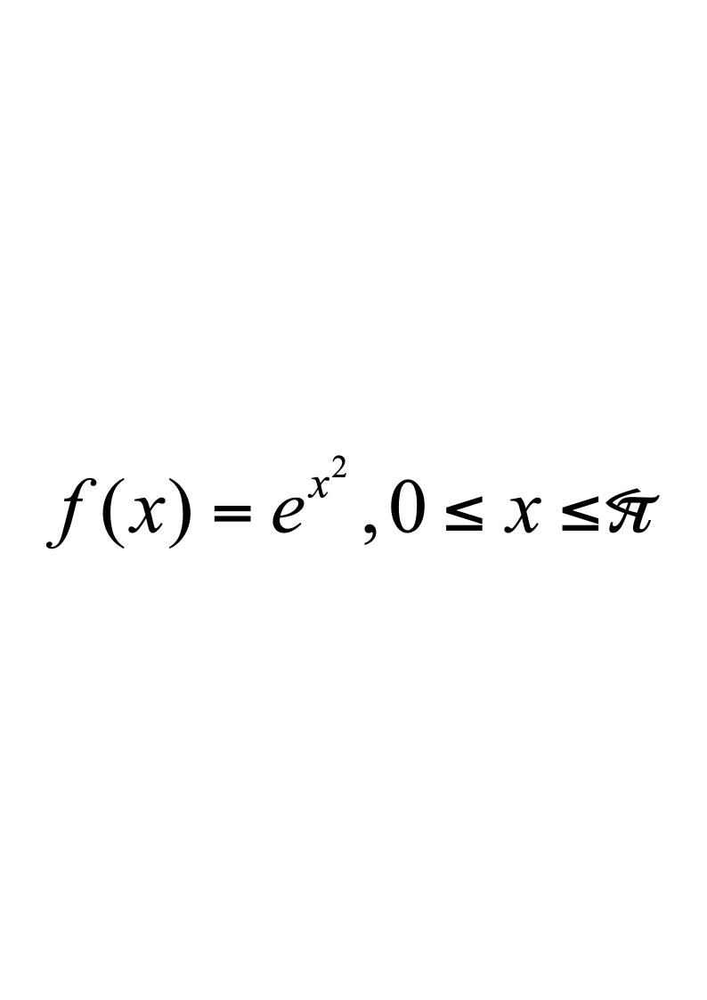，为$f(x)$的展成以$2\pi$为周期的正弦级数的和函数，则$S(0)=$0。

**二，计算题：共5小题，每题9分，共45分。**

**1，求微分方程**$y''+y'-2y=18xe^x$**的通解。**

**解：**特征方程：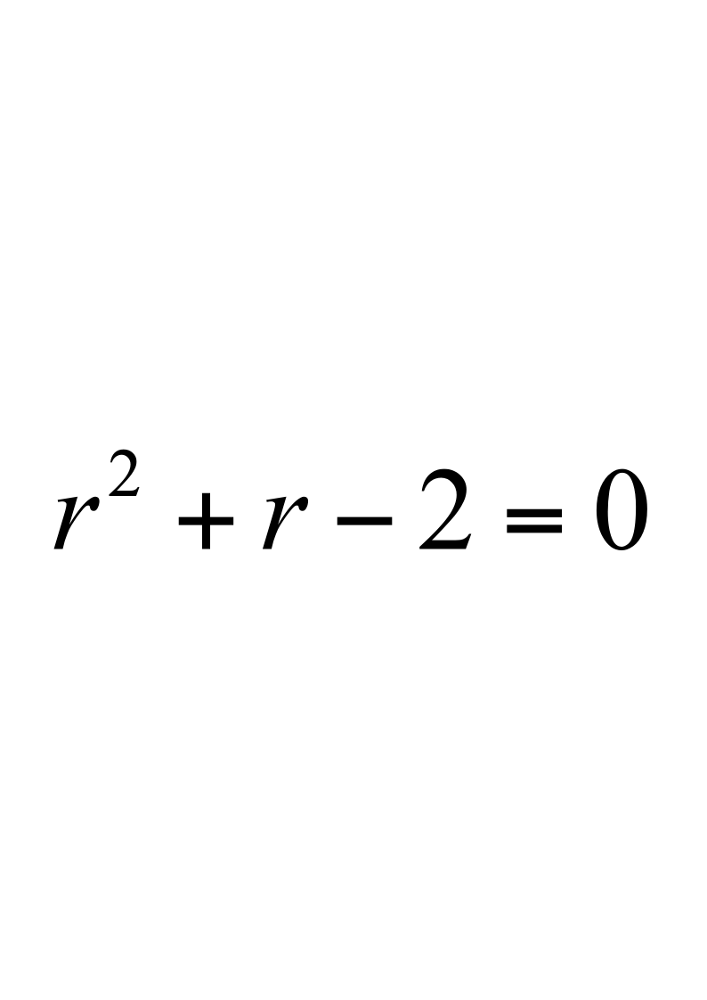，特征根：$r_1=-2,r_2=1$，

故对应其次方程得通解为：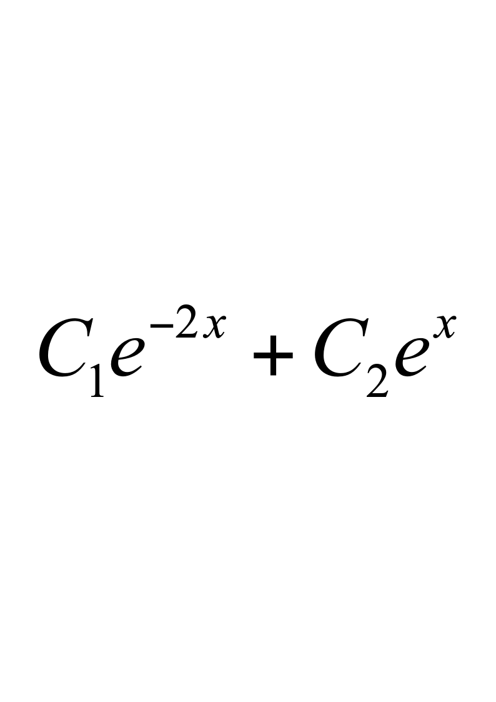。…………………………………………………3分

又因$r_2=1$是特征方程的单根，故设$y^{*}=xe^{x}(Ax+B)$，…………..….…….……………5分

将其代入原方程，得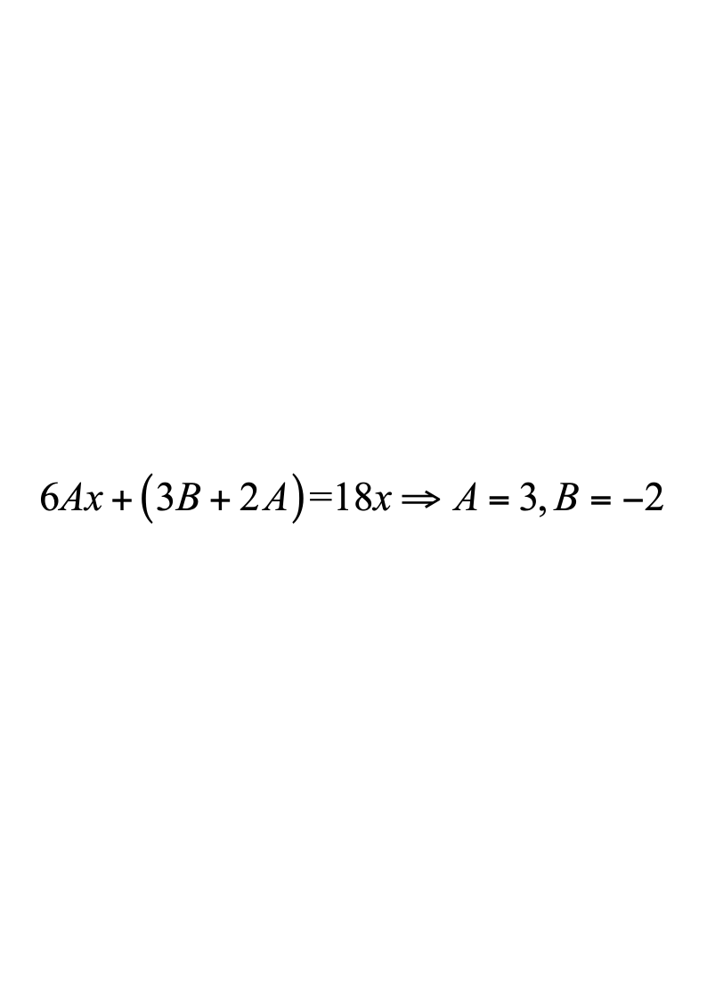，

得到原方程得一个特解为$y^{*}=xe^{x}(3x-2)$，………………… ……..….…….……………7分

所以原方程的通解为$y=C_1e^{-2x}+C_2e^x+x(3x-2)e^x$。………………..  …………………9分

**2，设**$z=f(x^2+y^2,x^2y^2)$**，其中**$f$**为任意阶可微函数，求**$\frac{\partial^2z}{\partial x^2},\frac{\partial^2z}{\partial y\partial x}$。

**解：因为**$\frac{\partial z}{\partial x}=2xf_1'+2xy^2f_2'$，所以………………………………..……………………..…………1分

$\frac{\partial^2z}{\partial x^2}=2f_1'+4x^2f_{11}''+4x^2y^2f_{12}''+2y^2f_2'+4x^2y^2f_{21}''+4x^2y^4f_{22}''=2f_1'+2y^2f_2'+4xf_{11}''+8x^2y^2f_{12}''+4x^2y^4f_{22}''$………………………..…………5分

$\frac{\partial^2z}{\partial y\partial x}=\frac{\partial}{\partial y}\left(\frac{\partial z}{\partial x}\right)=4xyf_{11}''+4x^3yf_{12}''+4xyf_2'+4xy^3f_{21}''+4x^3y^3f_{22}''=4xyf_{11}''+4xy(x^2+y^2)f_{12}''+4x^3y^3f_{22}''+4xyf_2'$……………………..…………9分

**3，**计算$\iiint_{\Omega}(x+y+z)dxdydz$，其中是曲面$z=\sqrt{x^{2}+y^{2}}$与$z=\sqrt{1-x^2-y^2}$所围成的区域.

**解：利用球坐标系：**$x=\rho\sin\varphi\cos\theta,y=\rho\sin\varphi\sin\theta,z=\rho\cos\varphi$。……..………….………3分

**则两个边界曲面的方程分别为：**$\varphi=\frac{\pi}{4},\rho=1$，

故可表示为$\Omega!$：$0\leq\theta\leq2\pi,0\leq\varphi\leq\frac{\pi}{4},0\leq\rho\leq1$。………………………………………6分

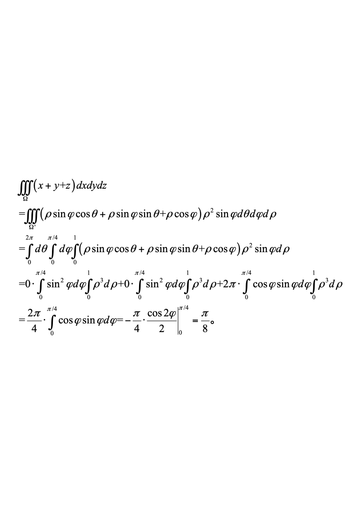                                                                ……………………………..………9分

注：也可利用对称性做。

**4，计算第二类曲线积分**$\int_Lxy^2dy-x^2ydx$**，其中**$L:\frac{x^{2}}{a^{2}}+\frac{y^{2}}{b^{2}}=1,a,b>0$，取逆时针方向。

**解：**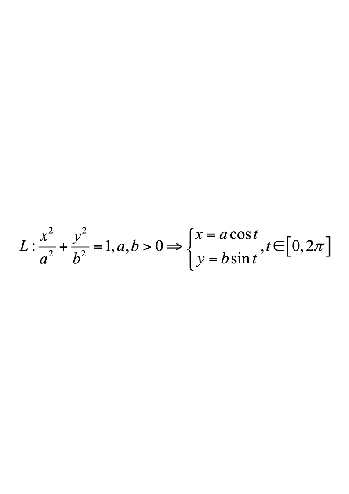。…………………………………………3分

故

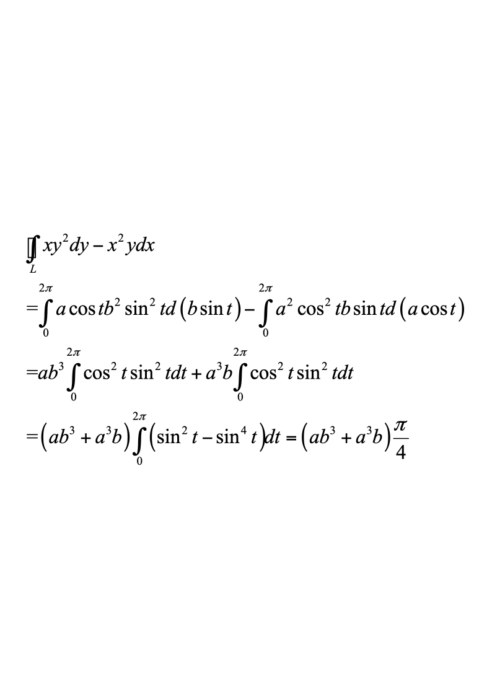…………………….……………9分

另解：利用格林公式后再进行计算。

**5，计算**$I=\iint_{\Sigma}2x(y-z)dydz+(1-y^2)dzdx+(1+z^2)dxdy$**，其中**为柱面$x^2+y^2=1$夹在平面$Z=0$和$z=3$部分的曲面，方向指向外侧。

**解：显然，**$P=2(y-z)x,Q=1-y^2,R=1+z^2$，

添加辅助面：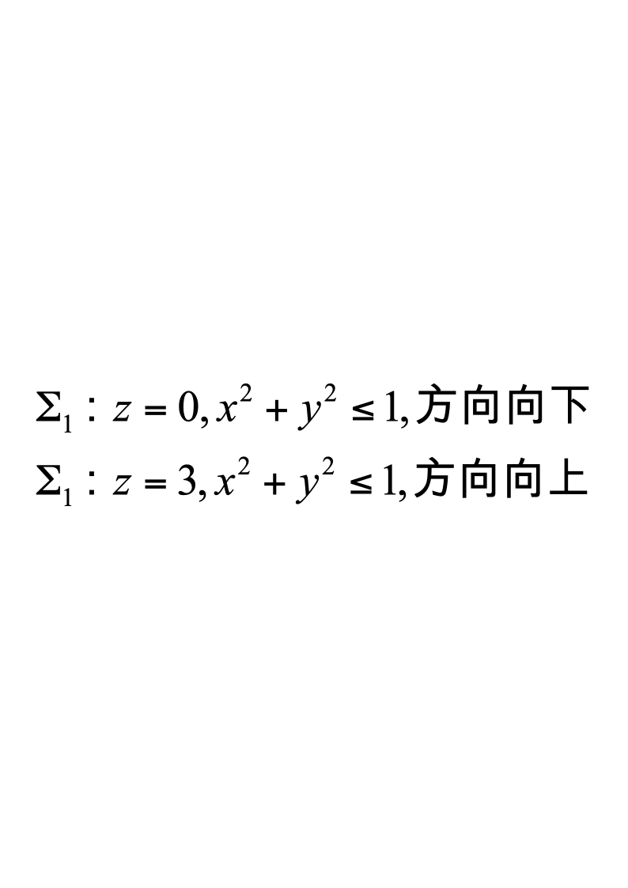，记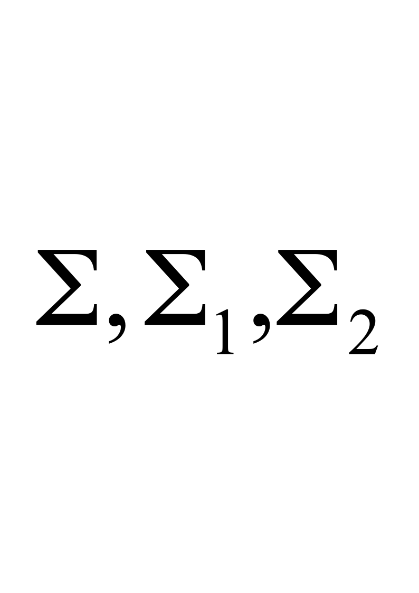围成的区域为，由高斯公式得：

$\iint_{x+\Sigma_1+\Sigma_2}2x(y-z)dydz+(1-y^2)dzdx+(1+z^2)dxdy=\iiint_\Omega\frac{\partial(2x(y-z))}{\partial x}+\frac{\partial(2x(1-y^2))}{\partial y}+\frac{\partial(1+z^2)}{\partial z}dV=\iiint_\Omega1dV=3\pi$………………………4分

分别计算曲面$\sum_1,\sum_2$上的积分为：

$\iint_{\Sigma_1}2x(y-z)dydz+(1-y^2)dzdx+(1+z^2)dxdy=\iint_{\Sigma_1}(1+0^2)dxdy=\pi\iint_{\Sigma_2}2x(y-z)dydz+(1-y^2)dzdx+(1+z^2)dxdy=\iint_{\Sigma_1}(1+3^2)dxdy=10\pi$……………….…8分

**所以：**$I=\iint_{\Sigma+\Sigma_1+\Sigma_2}-\iint_{\Sigma_1}-\iint_{\Sigma_2}=3\pi-\pi-10\pi=-8\pi$。…………………………………………9分

**三，解答下列各题：共2小题，每题8分，共16分。**

**1，试确定**$alpha$的值**，使得函数**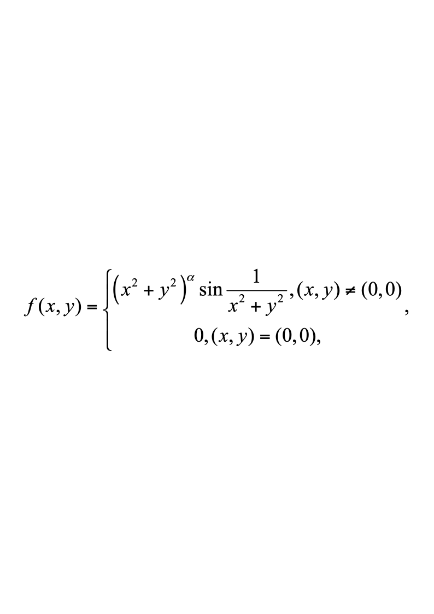在点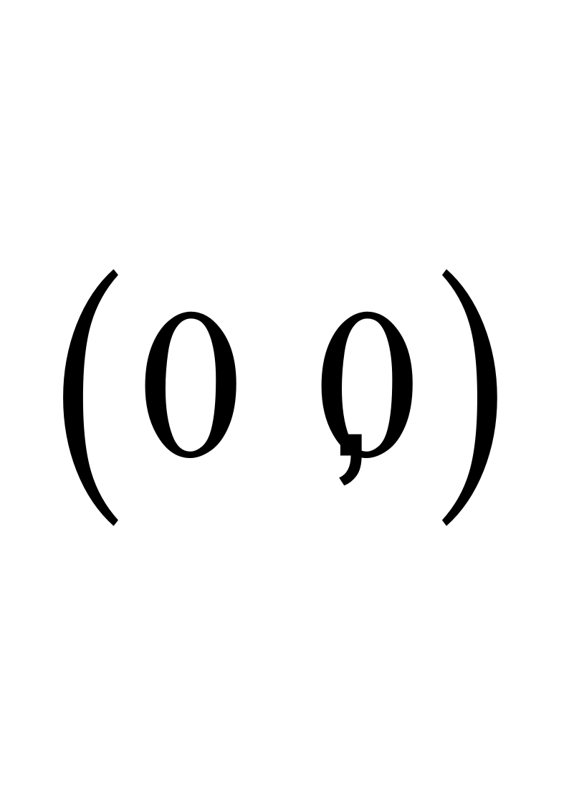处可微。

**解：因为可微必定偏导数存在，由偏导数的定义有**

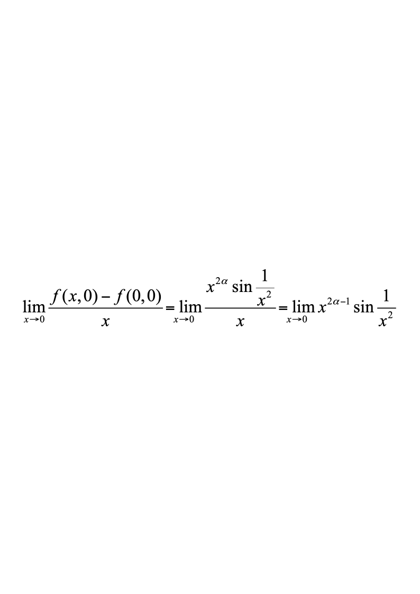，……………………………………2分

从上面的极限计算可知，要使得偏导数$f_x'(0,0)$存在，当且仅当有$2\alpha-1>0\Rightarrow\alpha>\frac{1}{2}$。

由对称性，$\alpha>\frac{1}{2}$时，有$f_x'(0,0)=f_y'(0,0)=0$。当$\alpha>\frac{1}{2}$时，可得

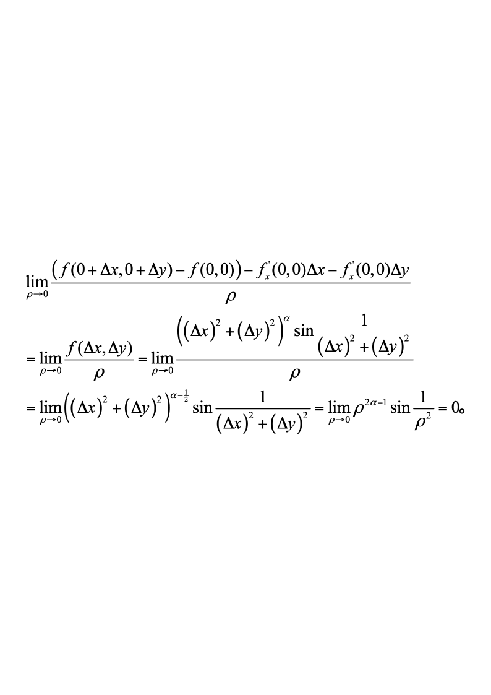……………………………6分

因此，当$\alpha>\frac{1}{2}$时，**函数**$f(x,y)$在点出可微。……………………………………………8分

2，求正项级数$\sum_{n=0}^{\infty}\frac{2n+1}{n!}$的和.

解：

$\sum_{n=0}^\infty\frac{2n+1}{n!}=2\sum_{n=0}^\infty\frac{n}{n!}+\sum_{n=0}^\infty\frac{1}{n!}=2\sum_{n=1}^\infty\frac{1}{(n-1)!}+\sum_{n=0}^\infty\frac{1}{n!}$………….……………………………………4分

$=2\sum_{n=0}^{\infty}\frac{1}{n!}+\sum_{n=0}^{\infty}\frac{1}{n!}=3\sum_{n=0}^{\infty}\frac{1}{n!}=3e$………….…………………………………………………………8分

另解：令$s(x)=\sum_{n=0}^\infty\frac{1}{n!}x^{2n+1}$，则$s'(x)=\sum_{n=0}^\infty\frac{2n+1}{n!}x^{2n}$，求出和函数以后再进行计算。
- **证明题：共2小题，每题8分，共16分。**

**1，设**$x=x(y,z),y=y(x,z),z=z(x,y)$**，都是由方程**$F(x,y,z)=0$**所确定的具有连续偏导数的函数，证明**$\frac{\partial x}{\partial y}\cdot\frac{\partial y}{\partial z}\cdot\frac{\partial z}{\partial x}=-1$。

**证明：因为**$\frac{\partial x}{\partial y}=-\frac{F_y}{F_x},\frac{\partial y}{\partial z}=-\frac{F_z}{F_y},\frac{\partial z}{\partial x}=-\frac{F_x}{F_z}$………………………4分

所以$\frac{\partial x}{\partial y}.\frac{\partial y}{\partial z}.\frac{\partial z}{\partial x}=-\frac{F_y}{F_x}\cdot-\frac{F_z}{F_y}\cdot-\frac{F_x}{F_z}=-1$……………………………8分

**2，**证明函数项级数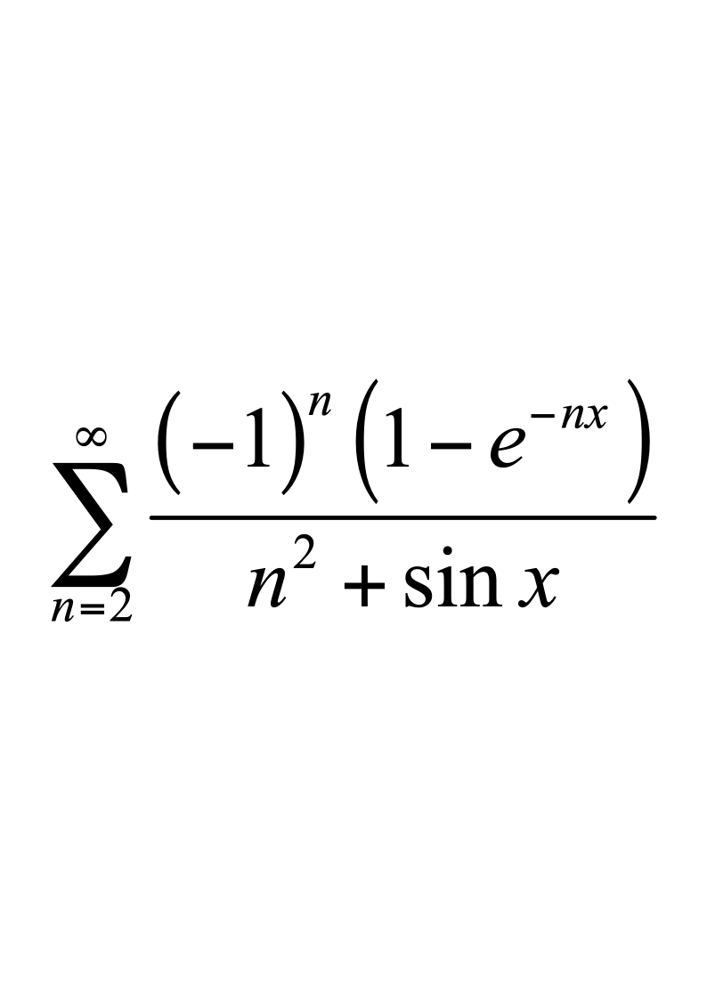在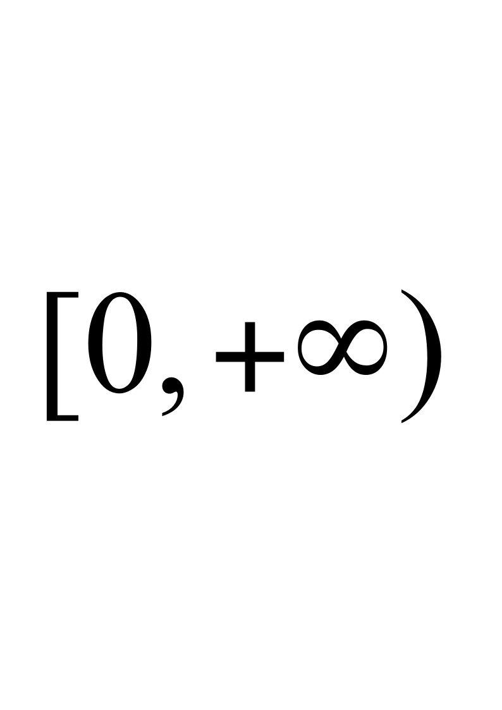上一致收敛。

解：对任意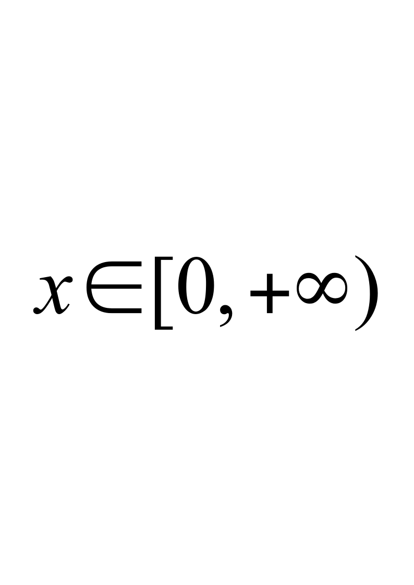，由$n2$，可得

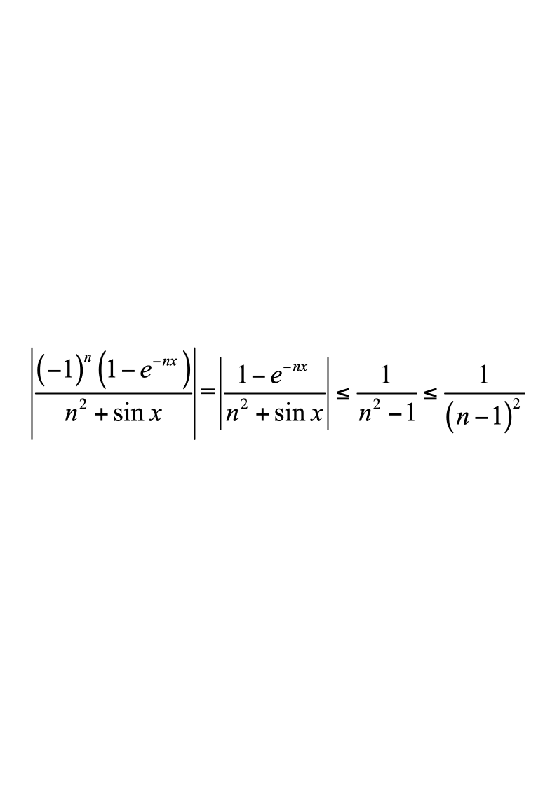。………………………………………………5分

而数项级数$\sum_{n=2}^{\infty}\frac{1}{(n-1)^2}$收敛.  由优级数判别法,  函数项级数在上一致收敛。……………………………………………………………………………………………………8分
- **应用题：共1题，每题8分，共8分。**

将正数9分成三个正数$x,y,z$之和，使得$u=x^{2}y^{3}z^{4}$最大。

**解：作拉格朗日函数；**

$L(x,y,z,\lambda)=x^{2}y^{3}z^{4}+\lambda(x+y+z-9)$………………………………………………………………2分

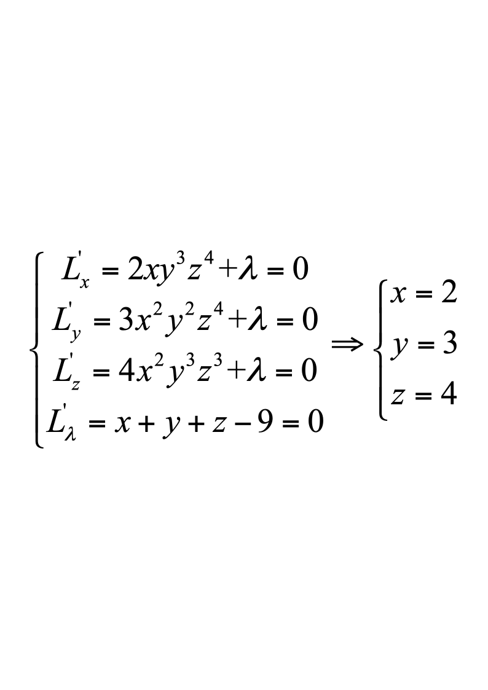……………………………………………………………………5分

**为唯一驻点。又是实际问题，所以一定存在最值。故最大值为**$u_{\max}=2^{2}3^{3}4^{4}=27648$。…..…8分
